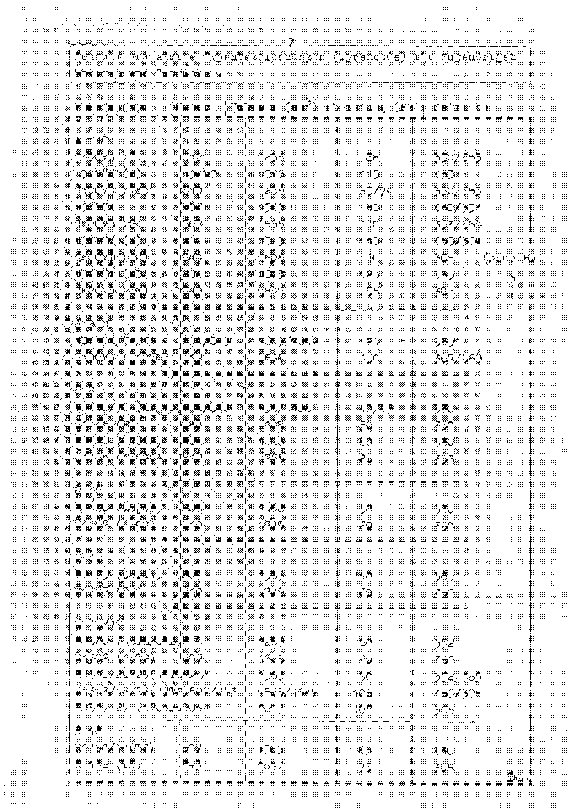
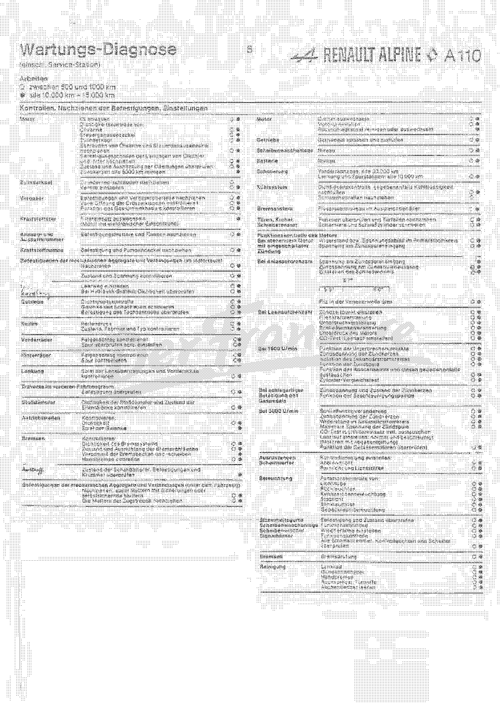

<!-- SOURCE NOTE: PDF pages 1-9. Translated from the German original; prose is English, every
value is as printed. The type cross-reference table (PDF p.8) and the service-diagnosis chart
(PDF p.9) OCR to noise and were transcribed from the rendered page images at 200-210 dpi.
The contents pages (PDF 2-6) are NOT reproduced verbatim -- see the note under Contents. -->

# Front matter — coverage, chassis numbers, type codes and the service schedule

**[PDF p.1]**

## Cover

> **REPARATURHANDBUCH — Typ A 110**
> **1300 VA, 1300 VB, 1300 VC, 1600 VB, GS**
> *1300 V85 · 1300 G/S · 1600 S*
> **RENAULT ⬥ ALPINE**

<!-- NEEDS REVIEW: the cover is clipped at the bottom in the scan itself -- the
"RENAULT ⬥ ALPINE" imprint is cut off by the page edge. The words are legible enough to
transcribe but the line is incomplete on this copy. -->

The cover lists only the 1300 VA/VB/VC, 1600 VB and GS types, but the book covers more than
that: the chassis-number and type tables below carry the **1600 VA, 1600 VC, 1600 VD and
1600 VH** as well, through to the end of production. See
[the key-settings plate](02-general-technical-data.md#key-settings-plate-wichtigste-einstellungen).

**[PDF p.2]**

## Contents

The printed contents occupy PDF pages 2–6. They are **not reproduced here**: the OCR renders
the entry titles in one column and their page numbers in a separate, unaligned column, so the
title-to-page pairing cannot be recovered from the text layer without guessing it. Guessing
page references is exactly what Rule 0 forbids.

Use **[00-index.md](00-index.md)** for navigation — it is generated from the manifest and
cites PDF pages, which are unambiguous. The chapter structure the printed contents describes
is reproduced in this wiki's chapter list.

<!-- NEEDS REVIEW: the printed contents pages carry the manual's own page numbers for every
section. Anyone working from the paper book will want them; recovering them means reading
PDF pp.2-6 as images and re-pairing the two columns by eye. Not attempted here. -->

**[PDF p.3]** — contents, continued.

**[PDF p.4]** — contents, continued.

**[PDF p.5]** — contents, continued.

**[PDF p.6]**

The contents page closes with the publisher's disclaimer:

> The advice contained in this book is given to the best of our knowledge and belief, but
> **excluding all liability**.
> *(„Die in diesem Buch enthaltenen Ratschläge werden nach bestem Wissen und Gewissen erteilt,
> jedoch unter Ausschluß jeglicher Haftung!")*

**[PDF p.7]**

## Chassis numbers by build period

*Zuordnung von Fahrgestellnummern zum Herstellungszeitpunkt* — PDF p.7.

| Vehicle type | Build period | Chassis numbers produced |
|---|---|---|
| 1300 V85 | September 69 – August 70 | 11301 – 11838 |
| 1300 G | September 69 – August 70 | 11321 – 11911 |
| 1300 S | September 69 – August 70 | 11322 – 11911 |
| 1600 | September 69 – August 70 | 16507 – end of production |
| 1600 S | September 69 – August 70 | 16507 – 16950 |
| 1300 V85 | September 70 – August 71 | 11839 – 12580 |
| 1300 G | September 70 – August 71 | 11912 – end of production |
| 1300 S | September 70 – August 71 | 11912 – end of production |
| 1600 S | September 70 – August 71 | 16951 – 17634 |
| 1300 V85 | September 71 – August 72 | 12581 – 13212 |
| 1600 S (VB) | September 71 – August 72 | 17635 – end of production |
| 1600 S (VC) | September 71 – August 72 | 17635 – 18058 |
| 1300 V85 | September 72 – August 73 | 13213 – 14100 |
| 1600 S | September 72 – August 73 | 18059 – end of production |
| 1600 SC | September 72 – August 73 | 20001 – 20106 |
| 1300 V85 | September 73 – August 74 | 14101 – 14820 |
| 1600 SC | September 73 – August 74 | 20107 – 20339 |
| 1300 V85 | September 74 – August 75 | 14843 – 15781 |
| 1600 SC/SI | September 74 – August 75 | 20340 – end of production |
| 1300 V85 | September 75 – August 76 | 15785 – end of production |

<!-- NEEDS REVIEW: four oddities in this table, all left exactly as printed.
  (1) In the first period, "1600" runs 16507 - end of production while "1600 S" runs
      16507 - 16950 from the SAME start number. Two entries claiming one chassis number.
  (2) Several entries say "end of production" (Produktionsende) in an early period and are
      then continued by a later period's row with a higher number -- so "end of production"
      cannot be read literally for those rows.
  (3) The 1300 V85 series skips: 14820 (end of 73/74) to 14843 (start of 74/75), and 15781
      to 15785. Whether those are real production gaps or scan damage is not determinable
      from this copy.
  (4) The source prints repeat marks (ditto) rather than restating the build period on
      continuation rows; the period has been written out in full on every row here for
      table legibility. The 1300 S row for 70/71 is a ditto of "Produktionsende". -->

**[PDF p.8]**

## Renault and Alpine type codes with their engines and gearboxes

*Renault und Alpine Typenbezeichnungen (Typencode) mit zugehörigen Motoren und Getrieben* —
PDF p.8. Transcribed from the page image; the OCR of this table is unusable.

### A 110

| Vehicle type | Engine | Displacement (cm³) | Output (PS) | Gearbox |
|---|---|---|---|---|
| 1300 VA (G) | 812 | 1255 | 88 | 330/353 |
| 1300 VB (S) | 1300 S | 1296 | 115 | 353 |
| 1300 VC (V85) | 810 | 1289 | 69/74 | 330/353 |
| 1600 VA | 807 | 1565 | 80 | 330/353 |
| 1600 VB (S) | 807 | 1565 | 110 | 353/364 |
| 1600 VC (S) | 844 | 1605 | 110 | 353/364 |
| 1600 VD (SC) | 844 | 1605 | 110 | 365 (new rear axle) |
| 1600 VD (SI) | 844 | 1605 | 124 | 365 (new rear axle) |
| 1600 VH (SX) | 843 | 1647 | 95 | 385 (new rear axle) |

<!-- NEEDS REVIEW: the 1300 VB (S) row prints "1300 S" in the ENGINE column -- a vehicle type
code where an engine code belongs. The same conflation appears on PDF p.11 and in the factory
manual's A-2 page, so it is the source's own error, not a transcription slip. The engine is
the 812-00 derivative; the B-2 table (PDF p.383) gives 1296 cm³ for this version. -->

<!-- NEEDS REVIEW: the "(neue HA)" = new rear axle note is printed once against the 1600 VD
(SC) row and carried down to the next two rows by ditto marks ("). Written out on each row
here. -->

### A 310

| Vehicle type | Engine | Displacement (cm³) | Output (PS) | Gearbox |
|---|---|---|---|---|
| 1600 VE/VF/VG | 844/843 | 1605/1647 | 124 | 365 |
| 2700 VA (310 V6) | 112 | 2664 | 150 | 367/369 |

### R 8

| Vehicle type | Engine | Displacement (cm³) | Output (PS) | Gearbox |
|---|---|---|---|---|
| R1130/32 (Major) | 689/688 | 956/1108 | 40/45 | 330 |
| R1136 (G) | 688 | 1108 | 50 | 330 |
| R1134 (1100 G) | 804 | 1108 | 80 | 330 |
| R1135 (1300 G) | 812 | 1255 | 88 | 353 |

### R 10

| Vehicle type | Engine | Displacement (cm³) | Output (PS) | Gearbox |
|---|---|---|---|---|
| R1190 (Major) | 688 | 1108 | 50 | 330 |
| R1192 (1300) | 810 | 1289 | 60 | 330 |

### R 12

| Vehicle type | Engine | Displacement (cm³) | Output (PS) | Gearbox |
|---|---|---|---|---|
| R1173 (Gord.) | 807 | 1565 | 110 | 365 |
| R1177 (TS) | 810 | 1289 | 60 | 352 |

### R 15/17

| Vehicle type | Engine | Displacement (cm³) | Output (PS) | Gearbox |
|---|---|---|---|---|
| R1300 (15 TL/GTL) | 810 | 1289 | 60 | 352 |
| R1302 (15 TS) | 807 | 1565 | 90 | 352 |
| R1312/22/23 (17 TL) | 807 | 1565 | 90 | 352/365 |
| R1313/18/28 (17 TS) | 807/843 | 1565/1647 | 108 | 365/395 |
| R1317/27 (17 Gord) | 844 | 1605 | 108 | 365 |

### R 16

| Vehicle type | Engine | Displacement (cm³) | Output (PS) | Gearbox |
|---|---|---|---|---|
| R1151/54 (TS) | 807 | 1565 | 83 | 336 |
| R1156 (TX) | 843 | 1647 | 93 | 385 |

> **Why the Renault rows are here:** the A110's engines, gearboxes and much of its running
> gear are Renault units. This table is the manual's own key for finding the Renault
> equivalent of an Alpine assembly — useful when a part has to be sourced or a Renault
> workshop manual consulted.

<!-- NEEDS REVIEW: the R16 TS output reads "83" and the R16 TX "93" on the image; both digits
are at the edge of legibility and could be 88/98. The R8 Major displacement pair "956/1108"
and output "40/45" are clear. Verify any figure before relying on it. -->

**[PDF p.9]**

## Service diagnosis schedule

*Wartungs-Diagnose (einschl. Service-Station)* — PDF p.9. Transcribed from the page image.

**Interval key, as printed:**

| Symbol | Interval |
|---|---|
| ○ | between 500 and 1000 km |
| ◉ | every 10,000 km – 15,000 km |

### Checks, retightening of fasteners, adjustments

| Assembly | Operation | Intervals |
|---|---|---|
| Engine | Drain oil | ○ ◉ |
| Engine | Leak check of: oil sump | ○ ◉ |
| Engine | Leak check of: timing cover | ○ ◉ |
| Engine | Leak check of: cylinder head | ○ ◉ |
| Engine | Retighten the oil sump and timing cover bolts | ○ ◉ |
| Engine | Retighten the fixing clips of the oil cooler and filter lines | ○ ◉ |
| Engine | Check the condition and alignment of the oil lines | ○ ◉ |
| Engine | Clean spark plugs every 5000 km | ◉ |
| Cylinder head | Retighten the cylinder head bolts | ○ |
| Cylinder head | Adjust the valves | ○ ◉ |
| Carburettor | Retighten the mountings and carburettor upper parts | ○ ◉ |
| Carburettor | Check full opening of the throttle butterflies | ○ ◉ |
| Carburettor | Check the function of the throttle relay lever | ○ ◉ |
| Fuel filter | Replace the filter element (engine with electronic injection) | ◉ |
| Intake and exhaust manifold | Retighten the fixing nuts and flange | ○ ◉ |
| Fuel pump | Retighten the mounting and the pump cover | ○ ◉ |
| Mechanical assemblies and connections in the engine bay | Retighten | ○ ◉ |
| (Battery) | Check condition and voltage | ○ ◉ |
| Clutch | Adjust the free play | ○ ◉ |
| Clutch | With hydraulic system: check for leaks | ○ ◉ |
| Gearbox | Leak check | ○ ◉ |
| Gearbox | Lubricate the gear-lever joints | ○ ◉ |
| Gearbox | Check the speedometer drive mounting | ○ ◉ |
| Tyres | Tyre pressure | ○ ◉ |
| Tyres | Check condition, make and type | ○ ◉ |
| Front wheels | Check rim run-out | ○ ◉ |
| Front wheels | Check the toe, adjust if necessary | ○ ◉ |
| Rear wheels | Check rim run-out | ○ ◉ |
| Rear wheels | Check the toe | ○ ◉ |
| Steering | Check the play in the steering linkage and front axle | ○ ◉ |
| Crossmember in the front compartment | Check the mounting | ○ ◉ |
| Dampers | Check damper leaks and the condition of the rubber mounts | ○ ◉ |
| Driveshafts | Check: leaks, joint play | ○ ◉ |
| Engine | Replace the oil filter | ○ ◉ |
| Engine | Fill with engine oil | ○ ◉ |
| Engine | Clean or replace the non-return valve | ◉ |
| Gearbox | Drain and refill the gearbox oil | ○ ◉ |
| Screen washer | Level | ○ ◉ |
| Battery | Level | ○ ◉ |
| Lubrication | Front wheel hubs: every 30,000 km | — |
| Lubrication | Steering and track rods: every 10,000 km | ○ ◉ |
| Cooling system | Leak check, top up coolant if necessary | ○ ◉ |
| Cooling system | Retighten the hose clips | ○ |
| Braking system | Fluid level in the reservoir | ○ ◉ |
| Doors, winder and sliding windows | Check operation and retighten the door catches | ○ ◉ |
| Doors, winder and sliding windows | Lubricate the hinges and lock barrels | ○ ◉ |

<!-- NEEDS REVIEW: HANDWRITTEN annotation -- the "Clutch" row label is inked in by hand in the
left margin (reading "kupplung"); the printed label in that cell is illegible on this scan.
The two operations in the row ("adjust the free play", "with hydraulic system: check for
leaks") are clearly clutch work, so the label is almost certainly right, but it is an owner's
annotation and not printed factory text. -->

<!-- NEEDS REVIEW: the row reading "Check condition and voltage" sits under the engine-bay
block with no printed assembly label visible on the scan; it is attributed to the battery here
on the strength of the operation, and the attribution is NOT from the source. -->

<!-- NEEDS REVIEW: the interval dots are small filled/open circles printed in two narrow
columns. At this scan quality an open ○ and a filled ◉ are distinguishable but not reliably so
on every row, and a few rows carry only one mark. Treat the interval column as indicative;
read the page image before building a service schedule from it. -->

### Engine function check

| Condition | Check | Intervals |
|---|---|---|
| Engine stopped, ignition on | Resistance or voltage drop in the primary circuit | ○ ◉ |
| Engine stopped, ignition on | Voltage at the ignition coil input | ○ ◉ |
| At cranking speed | Voltage at the ignition coil input | ○ ◉ |
| At cranking speed | Ignition voltage at the coil output | ○ ◉ |
| At cranking speed | Set the dwell angle | ○ ◉ |
| At cranking speed | Oil the felt in the distributor shaft | ○ ◉ |
| At idle speed | Set the ignition timing | ○ ◉ |
| At idle speed | Centrifugal advance | ○ ◉ |
| At idle speed | Vacuum advance | ○ ◉ |
| At idle speed | Dwell-angle variation | ○ ◉ |
| At idle speed | Engine vacuum | ○ ◉ |
| At idle speed | CO test (set the idle) | ○ ◉ |
| At 1500 rpm | Function of the contact breaker points | ○ ◉ |
| At 1500 rpm | Ignition voltage at the spark plugs | ○ ◉ |
| At 1500 rpm | Insulation of the secondary circuit | ○ ◉ |
| At 1500 rpm | Function of the ignition coil | ○ ◉ |
| At 1500 rpm | Function of the condenser; replace it if necessary | ○ ◉ |
| At 1500 rpm | Cylinder comparison test | ○ ◉ |
| On snapping the throttle open | Ignition voltage and condition of the spark plugs | ○ ◉ |
| On snapping the throttle open | Function of the accelerator pump | ○ ◉ |
| At 3000 rpm | Dwell-angle variation | ○ ◉ |
| At 3000 rpm | Ignition voltage at the spark plugs | ○ ◉ |
| At 3000 rpm | Resistance in the secondary circuit | ○ ◉ |
| At 3000 rpm | Maximum voltage of the ignition coil | ○ ◉ |

The dwell-angle row carries a small printed scale beneath it marked **55°** and **60°**, with
**57°** above it.

<!-- NEEDS REVIEW: that dwell scale is a graphic gauge, not a table; the figures 57°, 55° and
60° are read off the image. The key-settings plate (PDF p.13) gives the dwell angle as
57° ± 3°, which brackets to 54°-60° and does not match a 55°-60° band exactly. Both are
recorded as printed; do not reconcile them. -->

<!-- NEEDS REVIEW: the right-hand column of this chart runs past the bottom of the rendered
crop. Rows below "At 3000 rpm / Maximum voltage of the ignition coil" were not transcribed.
Check PDF p.9 for any further entries. -->
