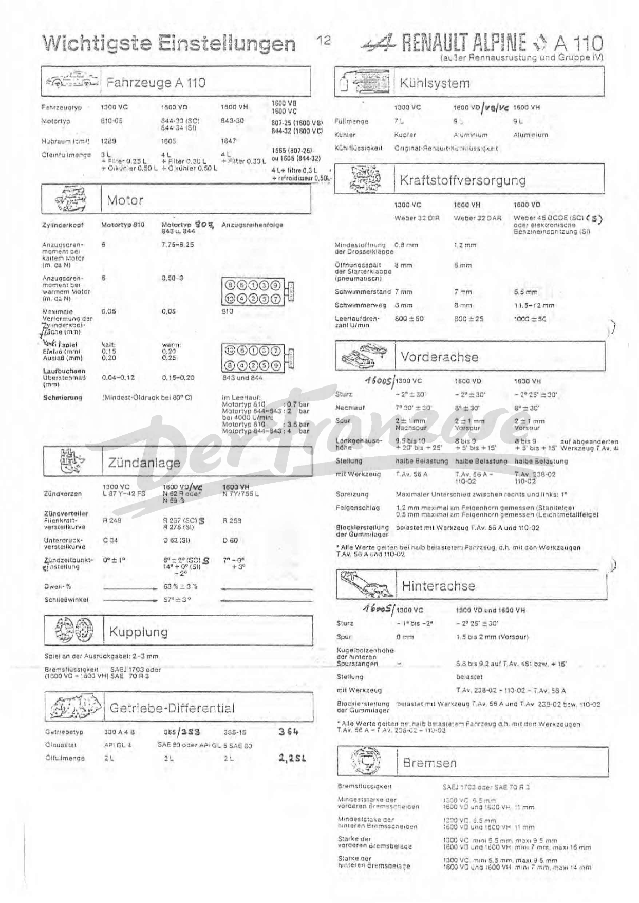

<!-- SOURCE NOTE: PDF pages 10-13 of alpine-a110-reparaturhandbuch.pdf. Translated from the
German original; prose is English, every value is as printed. Decimal separators are normalized
to the English convention (Rule 13): the page prints "3,85 m", this wiki writes "3.85 m".
Notation changes, value does not; no unit is converted.
PDF p.13 ("Wichtigste Einstellungen") OCRs almost entirely to noise and was transcribed from
the rendered page image at 200 dpi, in quadrants. It also carries HANDWRITTEN annotations by a
previous owner; those are called out individually below and are NOT manual data. -->

# General vehicle data and the key-settings plate

**[PDF p.10]**

## Vehicle design

**Model A. 110.** Rear-engined, rear-wheel-drive vehicle.

Body: sports coupé, consisting of a plastic (fibreglass) shell on a central backbone frame
(*Mittelträgerrahmen*).

From the 1970 model year the Type A.110 vehicles are available in four versions:

| Version | Factory type |
|---|---|
| Alpine 1300 | 1300 VC / V85 |
| Alpine 1300 G | 1300 VA |
| Alpine 1300 S | 1300 VB |
| Alpine 1600 S | 1600 VB — on request with GS engine (racing version) |

> **NOTE (printed on the page):** 1600 S with 1565 cm³ engine = 1600 VB; 1600 S with 1605 cm³
> engine = 1600 VC.

Identification is by the rhomboid plate fixed in the luggage compartment.

**[PDF p.11]**

## Vehicle dimensions

The following dimensions apply to **all** versions.

| Dimension | Value |
|---|---|
| Overall length | 3.85 m |
| Overall width | 1.52 m |
| Maximum height (laden) | 1.10 m |
| Maximum height (unladen) | 1.13 m | |
| Front overhang | 0.840 m |
| Rear overhang | 0.910 m |
| Wheelbase | 2.10 m |
| Front track, at the ground | 1.29 m |
| Rear track, at the ground | 1.27 m |
| Ground clearance, laden | 0.11 m |
| Interior width, at elbow height | 1.22 m |

## Weights

| | 1300 | 1300 G | 1300 S | 1600 S |
|---|---|---|---|---|
| Axle load (unladen), front | 260 kg | 280 kg | 280 kg | 280 kg |
| Axle load (unladen), rear | 425 kg | 415 kg | 415 kg | 435 kg |
| Kerb weight | 685 kg | 695 kg | 695 kg | 715 kg |

<!-- NEEDS REVIEW: SOURCE MISPRINT, not OCR — the page image prints the third column header as
"1300 G", repeating the second. Every other table in the manual gives the versions as
1300 / 1300 G / 1300 S / 1600 S, and the factory manual's A-2 (PDF p.380) prints "1300 S" in that
column, so it is rendered "1300 S" here.
The 1300 G rear axle load was first transcribed from the OCR as 445 kg; the page image clearly
prints 415 kg (corrected from image, Rule 8), which is also what A-2 prints and what makes
280 + 415 = 695 kg reconcile with the printed kerb weight. -->

## Engine

| Version | Engine type | Derived from |
|---|---|---|
| Alpine 1300 | 810-30 | engine type 810-03 of the RENAULT R. 1192 |
| Alpine 1300 G | 812-00 | same data as the Renault 8 Gordini engine |
| Alpine 1300 S | 1300 VB <!-- NEEDS REVIEW: printed "Typ 1300 VB, abgeleitet vom Motor Typ 812-00 des Renault 8 Gordini" — the VEHICLE type code appears in the engine-type slot. The source conflates the two here; kept as printed. The engine is the 812-00 derivative, and the B-2 specification table (PDF p.383) gives 1296 cm³ for this version. --> | engine type 812-00 of the Renault 8 Gordini |
| Alpine 1600 S | 807-25 | engine type 807-01 of the Renault 16 TS |

Liquid cooling, closed system. Oil cooling by a cooler in a bypass circuit (*Nebenstrom*).

## Electrical equipment

- Battery 12 Volt – 55 Ah.
- DC dynamo for the Alpine 1300, 25 to 30 Amp.
- Alternator 30/40 Amp for all other versions.

## Clutch

Single-plate dry clutch. Diaphragm-spring clutch mechanism. Driven plate with a torsionally
elastic hub. Unguided or guided graphite or ball release bearing, depending on version.

## Gearbox

- Type 330 for the Alpine 1300, or type 353 on request.
- Type 353 for all other versions.
- Type 364 for some versions of the Alpine 1600 S.

Type 330: fully synchronised 4-speed gearbox with one reverse gear.
Types 353/364: fully synchronised 5-speed gearbox with one reverse gear.
Floor-mounted gear lever (*Knüppelschaltung*).

**[PDF p.12]**

## Transmission

Drive to the rear wheels through half-shafts. One universal joint with needle bearing per shaft.

## Steering

Rack-and-pinion steering with a compensating spring.

| Item | Standard | Optional (more direct steering) |
|---|---|---|
| Turns of the steering wheel, lock to lock | 3.2 | 2.5 |
| Reduction ratio | 17 : 1 | 13.5 : 1 |

Steering wheel diameter: 300 mm, 330 mm and 360 mm.

## Front axle

Independent suspension with wishbones.

## Rear axle

Independent suspension. Mutually independent half-axles, located longitudinally by two
adjustable trailing links.

## Suspension

Coil springs front and rear. Telescopic dampers at the front (mounted inside the springs).
Four telescopic dampers at the rear, mounted on both sides of the springs.

## Braking system

Hydraulic operation. Disc brakes on all four wheels. Handbrake acting on the rear wheels
through cables.

## Tyres and wheels

Michelin X AS – Dunlop SP Sport – V 10 GT.

Recommended tyre pressures in kg/cm²:

| Tyre | Front | Rear |
|---|---|---|
| 15" tyres | 1.4–1.6 | 2.0–2.3 |
| 13" tyres | 1.6–1.8 | 2.3–2.5 |

Wheels marked with an asterisk (\*) can only be fitted with widened wings.

| Steel | Aluminium | Composite (*Verbund*) |
|---|---|---|
| 4 1/2 x 15 | ALPINE 4 1/2 x 13 | DELTA-MIC 4 1/2 x 13 |
| | ALPINE 5 1/2 x 13\* | DELTA-MIC 5 x 13 |
| | G.T. 4 1/2 x 13 | GOTTI 4 1/2 x 13 |
| | G.T. 5 x 13 | GOTTI 5 1/2 x 13\* | |
| | G.T. 5 1/2 x 13\* | GOTTI 6 x 13\* |
| | G.T. 6 x 13\* | |
| | GOTTI 5 x 13 | |

<!-- NEEDS REVIEW: the OCR of this wheel table was unusable; every cell above was read from
the page image of PDF p.12 and confirmed against the factory manual's A-2 printing. -->

## Capacities

| Item | Capacity |
|---|---|
| Fuel tank | 38 litres (front metal tank) or 50 litres (plastic tank) |
| Optional rear-mounted "aircraft tank" (*Flugzeugtank*) | 79 litres |
| Cooling and heating system (*Kühl- und Heizungssystem*) | 9 litres <!-- NEEDS REVIEW: a single figure for all versions here; the key-settings plate (below) gives 7 L for the 1300 VC and 9 L for the 1600 types, and the cooling chapter (09-cooling.md, PDF p.159) gives 13 L for the front-radiator cars. Not reconciled. --> |
| Gearbox oil | 2 litres (gearbox type 364: 2 1/2 litres) |
| Braking system | 0.27 litres |

### Engine oil

| | 1300 | 1300 G | 1300 S | 1600 S |
|---|---|---|---|---|
| Engine oil (sump) + oil cooler | 3 l + 0.5 | 2.5 l + 0.5 | 4 l + 0.5 | 4 l + 0.5 |
| Alternatively | 4 l (special) | 4 l (special) | — | — |
| Special oil filter (racing version) | — | — | + 0.5 | + 0.5 |

<!-- NEEDS REVIEW: CORRECTED. This table was first written from the key-settings plate because
its OCR was unusable, and that version was WRONG for the 1300 G (it gave 3 l). Re-read from the
page image of PDF p.12: the 1300 G sump is 2.5 l, and the "4 l (special)" entries sit in the
1300 and 1300 G columns only, beneath the sump figure — the 4-litre aluminium sump option
described in 03-engine-ignition-data.md. The racing-filter "+ 0.5" applies to the 1300 S and
1600 S only. The 2.5 l figure is independently printed in the lubrication table of chapter 03
("2.5 or 4 l") and in the factory manual's A-2. -->

**[PDF p.13]**

## Key settings plate ("Wichtigste Einstellungen")

> Printed heading: **RENAULT ALPINE ⬥ A 110 — excluding racing equipment and Group IV**
> (*außer Rennausrüstung und Gruppe IV*).

<!-- NEEDS REVIEW: everything in this section was read from the rendered page image, not from
the OCR, which is unusable for this plate. The scan carries a "DerFranzose" watermark across
it and several HANDWRITTEN owner annotations; each annotation is flagged where it occurs and
is NOT manual data. -->

### Vehicles A 110

| | 1300 VC | 1600 VD | 1600 VH | 1600 VB / 1600 VC |
|---|---|---|---|---|
| Engine type | 810-05 | 844-30 (SC), 844-34 (SI) | 843-30 | 807-25 (1600 VB), 844-32 (1600 VC) |
| Displacement (cm³) | 1289 | 1605 | 1647 | 1565 (807-25) or 1605 (844-32) |
| Oil fill | 3 L + filter 0.25 L + oil cooler 0.50 L | 4 L + filter 0.30 L + oil cooler 0.50 L | 4 L + filter 0.30 L | 4 L + filter 0.3 L + oil cooler 0.50 L |

<!-- NEEDS REVIEW: the last column's oil-fill cell is printed partly in FRENCH on this German
plate ("4 L + filtre 0.3 L + refroidisseur 0.50 L", and the displacement cell reads
"1565 (807-25) ou 1605 (844-32)"). That is the source's own mixed-language printing, not a
transcription error — rendered to English here, with the printed wording recorded. -->

### Engine

| | Engine type 810 | Engine types 807, 843 and 844 |
|---|---|---|
| Tightening torque, cold engine (m·daN) | 6 | 7.75–8.25 |
| Tightening torque, warm engine (m·daN) | 6 | 8.50–9 |
| Maximum distortion of the cylinder head face (mm) | 0.05 | 0.05 |
| Valve clearance, intake (mm) | 0.15 (cold) | 0.20 (warm) |
| Valve clearance, exhaust (mm) | 0.20 (cold) | 0.25 (warm) |
| Liner protrusion (mm) | 0.04–0.12 | 0.15–0.20 |

<!-- NEEDS REVIEW: the second column's printed header is partly obscured on the scan; it OCRs
as "Matortyvp GOR / 843 u, daa" and reads on the image as "Motortyp 80■ / 843 u. 844". It is
rendered "807, 843 and 844" to match the overhaul chapter titled "Motortypen 807 / 843 / 844",
but the leading engine number is NOT legible on this copy — verify. -->

<!-- NEEDS REVIEW: the head-bolt tightening torques are given in m·daN ("m. da N" on the
plate). The unit is NOT converted (Rule 13). 6 m·daN is approximately 60 N·m; do not use that
approximation as a working figure without checking the per-engine chapter. -->

Head-bolt tightening sequences are printed on the plate as two numbered diagrams — one for
engine 810 and one for engines 843 and 844. They are diagram-only: the bolt order is carried
entirely by the positions of the numbers in the figures, so it is delivered as an image rather
than transcribed from the leader lines.

**Lubrication** — minimum oil pressure at 80 °C:

| Engine type | At idle | At 4000 rpm |
|---|---|---|
| 810 | 0.7 bar | 3.5 bar <!-- NEEDS REVIEW: OCR reads "Motortyp 610. :9.5 bar" at 4000 rpm. The leading digit is not legible on the image at this scan quality; 3.5 bar is the reading consistent with a 0.7 bar idle figure, but 9.5 bar as OCR'd is not credible for this engine. VERIFY against the source PDF before use. --> |
| 843 / 844 | 2 bar | 4 bar |

### Cooling system

| | 1300 VC | 1600 VD / VB / VC | 1600 VH |
|---|---|---|---|
| Capacity | 7 L | 9 L | 9 L |
| Radiator | copper | aluminium | aluminium |
| Coolant | Original Renault coolant | Original Renault coolant | Original Renault coolant |

### Fuel system

| | 1300 VC | 1600 VH | 1600 VD |
|---|---|---|---|
| Carburettor | Weber 32 DIR | Weber 32 DAR | Weber 45 DCOE (SC) or electronic fuel injection (SI) |
| Minimum throttle opening | 0.8 mm | 1.2 mm | — |
| Starter-flap opening gap (pneumatic) | 8 mm | 6 mm | — |
| Float level | 7 mm | 7 mm | 5.5 mm |
| Float travel | 8 mm | 8 mm | 11.5–12 mm |
| Idle speed (rpm) | 800 ± 50 | 800 ± 25 | 1000 ± 50 |

### Ignition

| | 1300 VC | 1600 VD | 1600 VH |
|---|---|---|---|
| Spark plugs | L 87 Y–42 FS | N 62 R or N 59 G | N 7Y / 755 L |
| Distributor, centrifugal advance curve | R 248 | R 257 (SC), R 278 (SI) | R 258 |
| Distributor, vacuum advance curve | C 34 | D 62 (SI) | D 60 |
| Ignition timing setting | 0° ± 1° | 6° ± 2° (SC); 14° +0° −2° (SI) | 7° −0° +3° |
| Dwell | 63 % ± 3 % | 63 % ± 3 % | 63 % ± 3 % |
| Dwell angle | 57° ± 3° | 57° ± 3° | 57° ± 3° |

<!-- NEEDS REVIEW: the spark-plug and advance-curve part codes are at the limit of this scan's
legibility. Read from the image as: "L 87 Y-42 FS", "N 62 R oder N 59 G", "N 7Y/755 L";
curves "R 248", "R 257 (SC)", "R 278 (SI)", "R 258", "C 34", "D 62 (SI)", "D 60". The
letter/digit pairs most at risk are R/P, 8/6/5 and the "C 34" vacuum curve (OCR read "234").
Verify every code against the source PDF before ordering parts. -->

<!-- NEEDS REVIEW: the dwell and dwell-angle rows are printed once with arrows spanning all
three columns, meaning the single value applies to every version. Repeated per column here for
table legibility; the source prints it once. -->

<!-- NEEDS REVIEW: HANDWRITTEN annotation — a "VC" is inked over the printed "1600 VD" column
header of the ignition block, and an "S" is inked beside the R 257 (SC) and 6° ± 2° (SC)
cells. Not manual data; not transcribed into the table. -->

### Clutch

- Free play at the release fork: **2–3 mm**.
- Brake fluid: SAE J 1703, or (1600 VD – 1600 VH) SAE 70 R 3.

<!-- NEEDS REVIEW: the brake-fluid specification is printed inside the CLUTCH block on this
plate, not under Brakes. That is the source's own layout — kept where printed. The same fluid
specification is repeated in the Brakes block below. -->

### Gearbox / differential

| | | | | |
|---|---|---|---|---|
| Gearbox type | 330 A 4 B | 355 | 385-15 | 364 |
| Oil grade | API GL 4 | SAE 80 or API GL 5 | SAE 80 | SAE 80 |
| Oil capacity | 2 L | 2 L | 2 L | 2.2 L |

<!-- NEEDS REVIEW: this row is badly compromised and should not be trusted as printed.
  - "355" is printed, but a HANDWRITTEN "353" is inked over it. Type 353 is the gearbox the
    rest of this manual documents (there is no type 355 anywhere else in the book), so the
    printed value is likely a misprint that the owner corrected — but the printed value is
    kept here per Rule 0.
  - "385-15" is printed, and type 385 is REAL: the type cross-reference table on PDF p.8
    gives gearbox 385 for the 1600 VH (SX) and for the Renault 16 TX. So this cell is not a
    misread of 365. The "-15" suffix is still unexplained and unconfirmed.
  - "364" and "2.2 L" are HANDWRITTEN additions, not printed. They are retained because type
    364 and its 2 1/2 litre capacity are confirmed by the printed capacities section above —
    but they are an owner's annotation, not factory data.
  - The oil-grade row spans columns with a single printed entry; the per-column split shown
    here is an interpretation. -->

### Front axle

| | 1300 VC | 1600 VD | 1600 VH |
|---|---|---|---|
| Camber | −2° ± 30' | −2° ± 30' | −2° 25' ± 30' |
| Castor | 7° 30' ± 30' | 8° ± 30' | 8° ± 30' |
| Toe | 2 ± 1 mm (toe-out) | 2 ± 1 mm (toe-in) | 2 ± 1 mm (toe-in) |
| Steering-box height | 9.5 to 10, +20' to +25' | 8 to 9, +5' to +15' | 8 to 9, +5' to +15' (on modified tool T.Av. 4■) |
| Attitude | half load | half load | half load |
| With tool | T.Av. 56 A | T.Av. 56 A – 110-02 | T.Av. 238-02 – 110-02 |

- **Track variation (*Spreizung*):** maximum difference between right and left: 1°.
- **Rim run-out:** 1.2 mm maximum measured at the rim flange (steel wheel); 0.5 mm maximum
  measured at the rim flange (light-alloy wheel).
- **Locking position of the rubber bushes:** laden, with tools T.Av. 56 A and 110-02.

> All values apply with the vehicle at half load, i.e. with tools T.Av. 56 A and 110-02.

<!-- NEEDS REVIEW: the castor row OCRs as "7?30'=30' / 82% 30° / a*= 30°" and is read from the
image as 7° 30' ± 30' / 8° ± 30' / 8° ± 30'. The toe row prints "Nachspur" (toe-out) for the
1300 VC and "Vorspur" (toe-in) for the 1600 types — a real difference, not a transcription
slip, but verify it, because toe direction matters. The final steering-box-height cell cites a
modified tool whose number is cut off at the page edge ("T.Av. 4■", possibly 481). -->

<!-- NEEDS REVIEW: HANDWRITTEN annotation — "1600 S" is inked in to the left of the "1300 VC"
column header of the front-axle block. Not manual data. -->

### Rear axle

| | 1300 VC | 1600 VD and 1600 VH |
|---|---|---|
| Camber | −1° to −2° | −2° 25' ± 30' |
| Toe | 0 mm | 1.5 to 2 mm (toe-in) |
| Ball-joint height of the rear track rods | — | 8.8 to 9.2 on T.Av. 481, or +15' |
| Attitude | — | laden |
| With tool | — | T.Av. 238-02 – 110-02 – T.Av. 56 A |

- **Locking position of the rubber bushes:** laden, with tools T.Av. 56 A and T.Av. 238-02 or
  110-02.

> All values apply with the vehicle at half load, i.e. with tools T.Av. 56 A – T.Av. 238-02 –
> 110-02.

<!-- NEEDS REVIEW: HANDWRITTEN annotation — "1600 S" is inked to the left of the "1300 VC"
column header of the rear-axle block, as in the front-axle block. Not manual data. -->

<!-- NEEDS REVIEW: the rear-axle note says values apply at HALF load while the "Attitude" row
in the same block prints "belastet" (laden). The source is internally inconsistent here; both
are kept as printed. -->

### Brakes

- Brake fluid: SAE J 1703 or SAE 70 R 3.

| Item | 1300 VC | 1600 VD and 1600 VH |
|---|---|---|
| Minimum thickness, front brake discs | 6.5 mm | 11 mm |
| Minimum thickness, rear brake discs | 6.5 mm | 11 mm |
| Thickness, front brake pads | min 5.5 mm, max 9.5 mm | min 7 mm, max 16 mm |
| Thickness, rear brake pads | min 5.5 mm, max 9.5 mm | min 7 mm, max 14 mm |

<!-- NEEDS REVIEW: SAFETY-RELEVANT, and the least certain block on the plate. The OCR of these
four rows is garbage ("1SCOVE 55mm", "1290 VG 3.3mm", "min 85mm, maxi 925 mm", "mini 5.5 mm,
maxi 35 mm"). The values above are read from the page image, where the front and rear disc rows
appear IDENTICAL (6.5 / 11 mm) — which is plausible for a four-wheel-disc car but is exactly
the kind of repetition a scan artefact can manufacture, and the OCR disagrees with it. The pad
maxima (9.5 / 16 / 14 mm) are legible but the minima are not crisp. DO NOT use any figure in
this table to decide whether a disc or pad is serviceable without checking the source PDF
page, and preferably the brakes chapter.
  CROSS-CHECK AGAINST THE BRAKES CHAPTER ([16-brakes.md](16-brakes.md), PDF pp.288-312):
  1300 VC — CONSISTENT. Discs are 261 x 7.5 mm NEW, identical front and rear (pp.288, 312), so
  the plate's identical front/rear rows are real, not a scan artefact, and a 6.5 mm minimum
  leaves a plausible 1 mm wear allowance. Pads are 9.5 mm new including backing plate (p.312)
  with a 5.5 mm wear limit (p.290) — matching the plate's 9.5 max / 5.5 min exactly.
  1600 VD / VH — UNSUPPORTED. Nothing in the brakes chapter confirms the 11 mm disc minimum or
  the 7 / 16 / 14 mm pad figures; that chapter gives only 1300-era nominal sizes. These four
  values rest on this plate alone. -->
