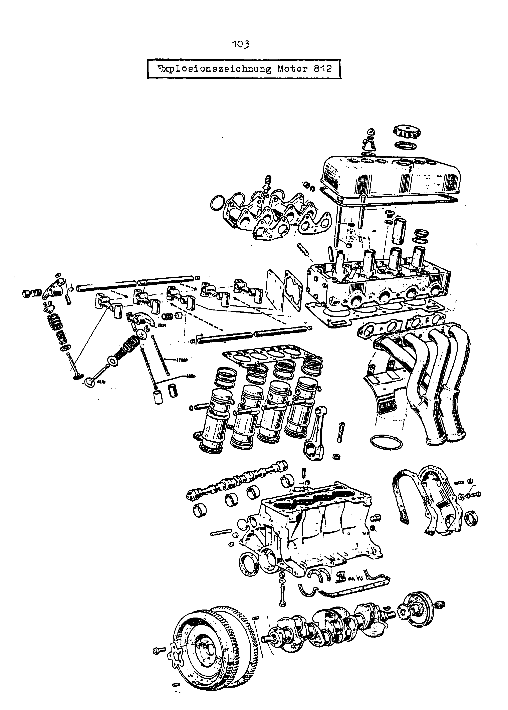
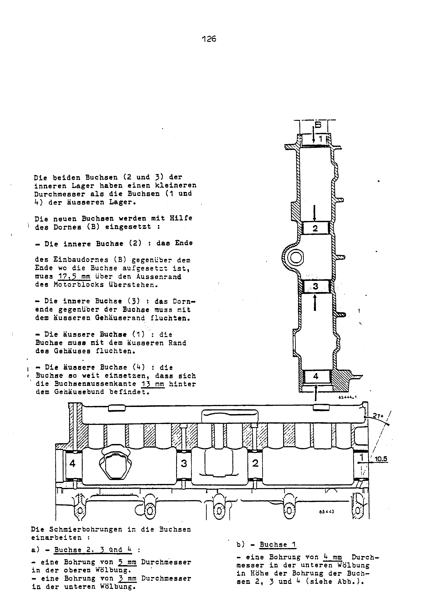
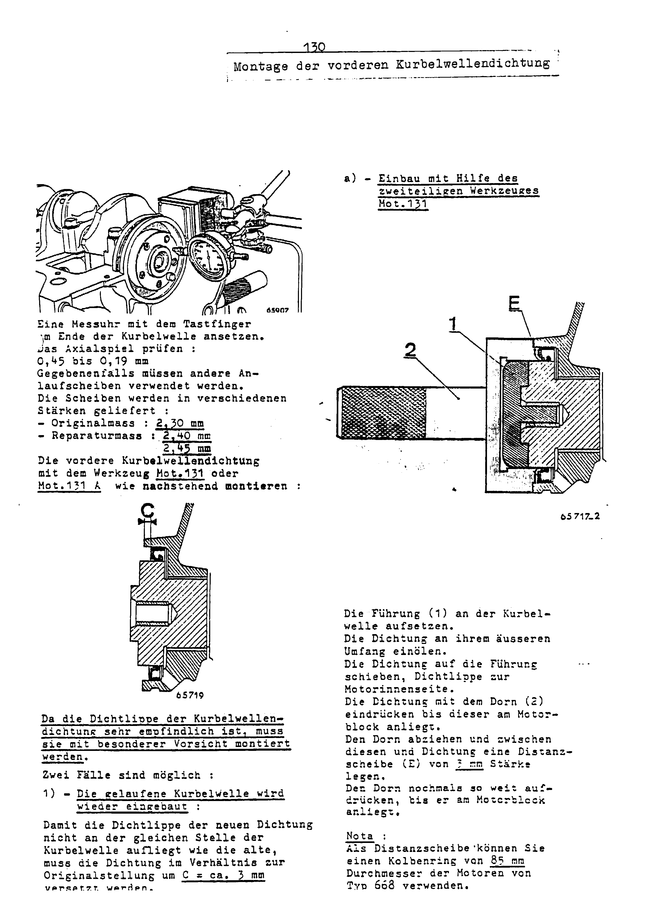
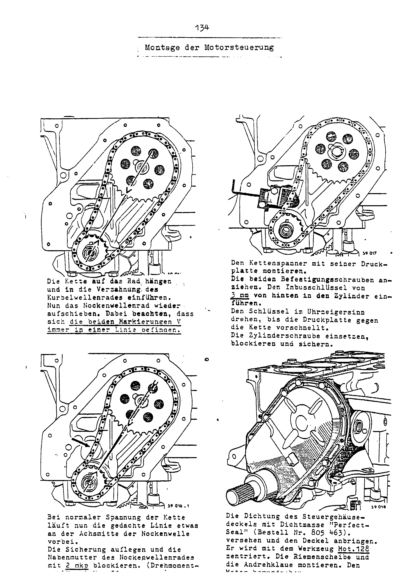
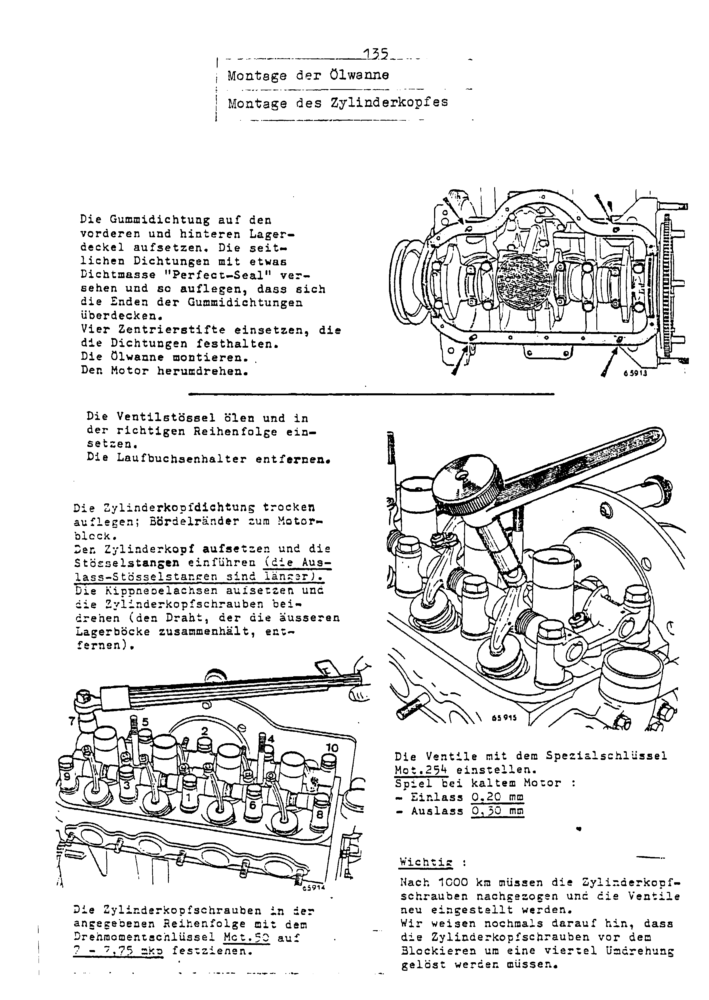
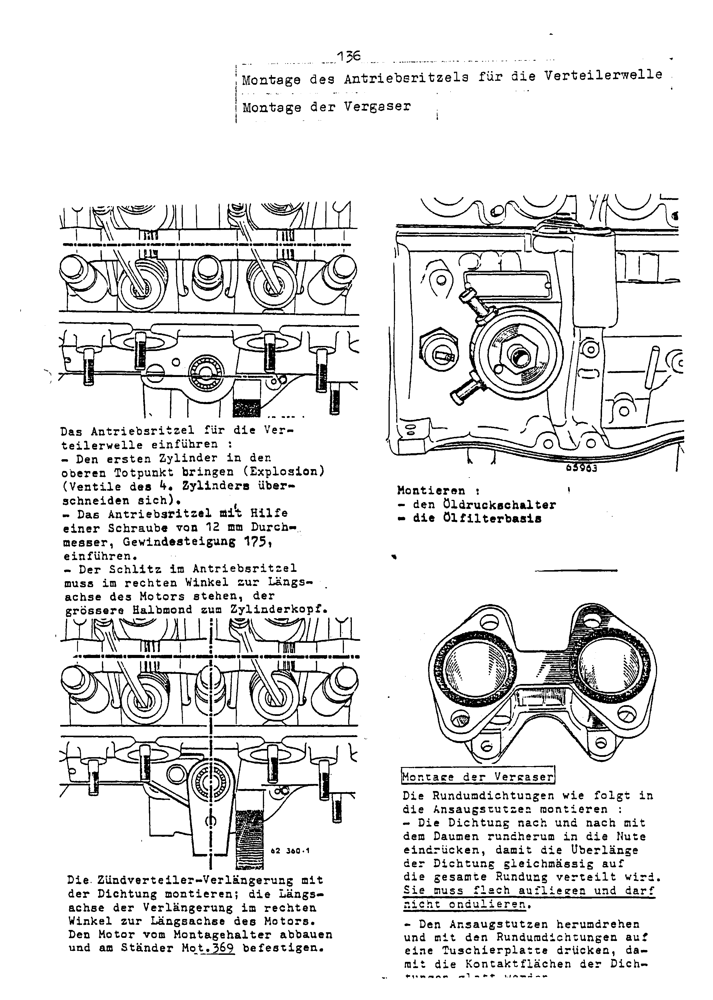
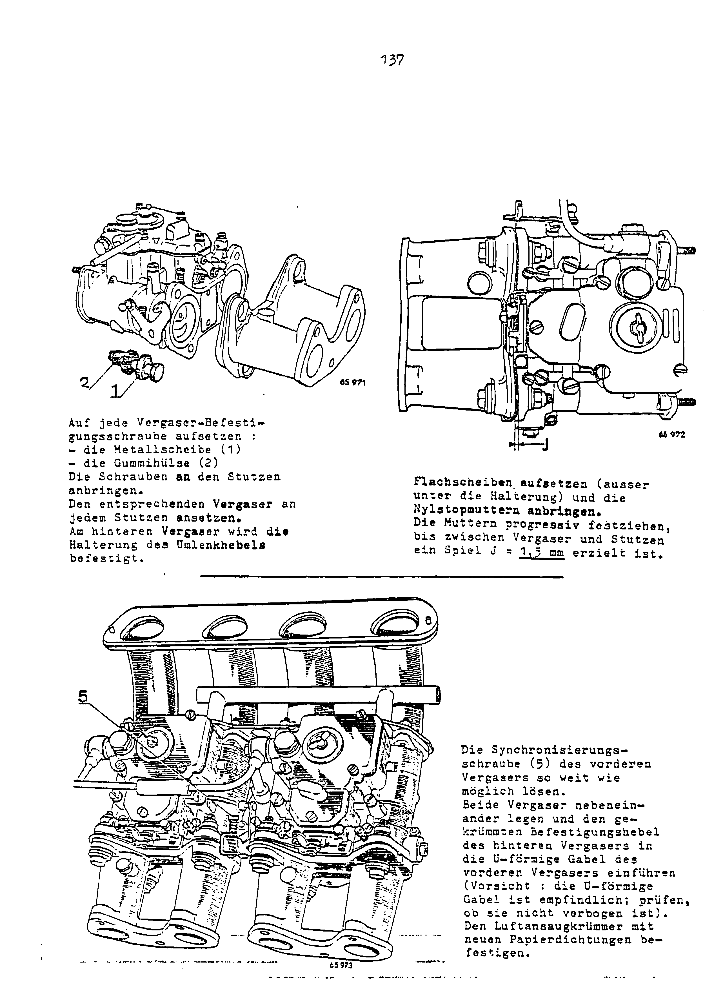
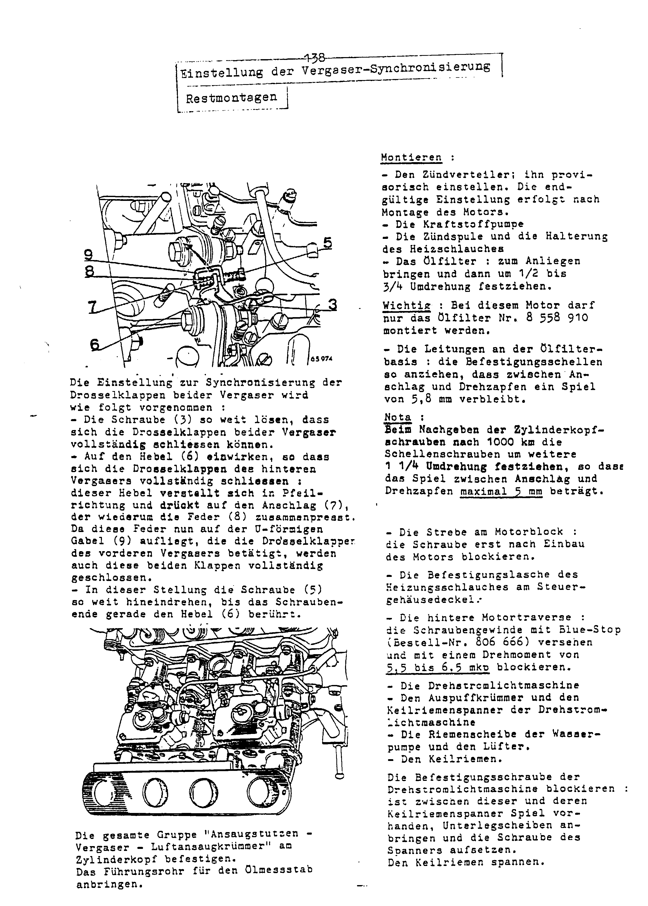

<!-- SOURCE NOTE: PDF pages 98-138. Translated from the German original; prose is English, every
value is as printed, decimal separators normalized to the English convention (Rule 13) — the
page prints "0,044", this wiki writes "0.044". Torque is printed in mkp on these pages and is NOT
converted.
EVERY page in this range was read from the rendered page image, not from the OCR alone: the OCR
of this chapter is badly degraded by the "DerFranzose" watermark, by two-column layouts with
figures between the columns, and by bleed-through from the reverse side of the sheet (PDF p.98
and p.100 in particular). All values in tables and running text were checked against the image;
where OCR and image disagreed, the image was used and the disagreement is flagged.
Scan defects: text at the bottom or right-hand edge of several pages is clipped at the scan edge
(PDF pp.110, 111, 113, 125, 132 and 134 — each flagged where it occurs; on p.113 this destroys
part of the inner valve-spring column); PDF p.98 is a section title page whose
illustration is only reverse-side bleed-through. Printed page numbers (101-141 in this range,
plus a "114a") are not PDF page numbers and are not used for citation. -->

# Engine type 812 — overhaul

Fitted to the A 110 **1300 G** and **1300 S** (the engine of the RENAULT 8 Gordini; see
[Engine and ignition — technical data](03-engine-ignition-data.md) for the differences between
the 812-00 and the 1300 S derivative).

**[PDF p.98]**

Section title page: **Engine type 812 — fitted to the 1300 G/S version — Overhaul**
(*Motortyp 812 — Montiert in der Version 1300 G/S — Instandsetzung*).

<!-- NEEDS REVIEW: the faint engine drawings on this page are bleed-through from the reverse side
of the sheet, not content of this page; the OCR of this page is noise from that bleed-through. -->

**[PDF p.99]**

## Identification

**Engine 1300 G/S — type 812 - 00/1300S** (two general views of the engine).

The type, the code number (*Kennzahl*) and the serial number (*Fabrikationsnummer*) are shown on
a plate riveted to the **right-hand side** of the engine.

**[PDF p.100]**

## Exploded view of engine 812

The page is an exploded drawing only (cylinder head, valve gear, liners and pistons, camshaft,
cylinder block, crankshaft and flywheel, manifolds, timing cover). It carries no values; the few
labels on it are French part-identification abbreviations (`ADM`, `ECHAP`).

<!-- NEEDS REVIEW: text from the reverse side of the sheet bleeds through faintly on the left of
this page; it is not part of the drawing and is not transcribed. -->

**[PDF p.101]**

## Technical data

Four-cylinder, four-stroke in-line engine.

| Item | Value |
|---|---|
| Fiscal horsepower (France only) (*Steuer-PS*) | 7 CV |
| SAE output — old standard | 110 PS at 6750 rpm |
| SAE output — new standard | 103 PS at 6750 rpm |
| DIN output | 88 PS at 6750 rpm |
| Maximum torque SAE — old standard | 12.7 mkp at 5000 rpm |
| Maximum torque SAE — new standard | 11.9 mkp at 5000 rpm |
| Maximum torque DIN | 10.7 mkp at 5000 rpm |
| Bore | 74.5 mm |
| Stroke | 72 mm |
| Displacement | 1255 cm³ |
| Compression ratio | 10.5 |
| Ignition advance (at the pulley) | 0 - 1 |
| Normal operating temperature | 73 °C |

<!-- NEEDS REVIEW: the ignition advance line prints "Vorzündung (an der Riemenscheibe) 0 - 1"
with NO unit (degrees are the likely reading but are not printed). Kept as printed. -->

- Five-bearing crankshaft, burnish-polished (*prägepoliert*).
- Hemispherical combustion chambers; **intake on the right, exhaust on the left**.
- Overhead valves, rocker-operated.
- Valve gear (timing) driven by a roller chain.
- Distributor with automatic centrifugal advance: **curve R.230**.
- Firing order: **1 - 3 - 4 - 2**.
- Spark plugs: **14 mm**.
- Fuel supply by a diaphragm pump and **2 twin-choke carburettors**.
- Liquid cooling (sealed system, not lead-sealed — *hermetisch abgeschlossen, nicht
  verplombt*). Capacity: **7.1 litres**, of which **1 litre** in the expansion tank. Centrifugal
  pump. Finned (*Lamellen*) radiator. Fan with **6 blades**, copper core.
- Pressure-fed lubrication by a gear pump. Oil filter, oil cooler.

| Oil capacity | Value |
|---|---|
| Oil sump | 2.5 litres |
| Oil filter | 0.3 litres |
| Oil cooler | 0.4 litres |

Additional fuel tank in the luggage compartment: capacity **26 l**.

<!-- NEEDS REVIEW: OCR read the oil-filter capacity as "0,5 Liter"; the page image clearly shows
"0,3 Liter" — corrected from image (Rule 8).
Cross-check with chapter 03 (PDF p.21): that table gives the 1300 G engine oil capacity as
"2.5 or 4 l". The 2.5 l here is the SUMP figure; sump + filter + cooler printed here sum to
3.2 l. Not necessarily a contradiction (the 03 table may mean sump capacity), but the two
pages do not state the same quantity — flagged, not reconciled.
All other figures on this page agree with the 1300 G column of chapter 03 (1255 cm³, 74.5 x 72,
10.5/1, 103 PS SAE at 6750, 88 PS DIN, 11.9 mkp at 5000). -->

## Removing and refitting the engine

This work is carried out for a standard exchange (*Standard-Austausch*) or for a clutch overhaul.

### Removal

1. Disconnect the battery.
2. Take out the jack.
3. Drain the coolant from the engine and the radiator.
4. Release the two oil cooler hoses and pull them out of the panel (*Wandung*).

**[PDF p.102]**

5. Remove the two upper nuts and the two lower bolts of the oil cooler mounting.
6. Swing the cooler downwards and take it out to the left. Drain the oil still in it.
7. Remove the securing bolts of the radiator shroud (*Kühlerwandung*).
8. Disconnect:
   - the wires from the terminal strip;
   - the upper radiator hose at the radiator;
   - the lower radiator hose at the water pump.
9. Take out the radiator shroud.
10. Remove the air filter with its suction hoses.
11. Remove:
    - the exhaust silencer mounting clips;
    - the exhaust silencer with its rear mounting;
    - the starter guard plate;
    - the alternator belt tensioner;
    - the exhaust manifold.
12. Disconnect:
    - the alternator wires;
    - the temperature sender wire at the cylinder head.

<!-- NEEDS REVIEW: printed "Kühlerwandung" — rendered "radiator shroud"; literally "radiator
wall/panel". -->

**[PDF p.103]**

13. Disconnect the heater hoses at the water pump.
14. Remove the valve cover and the carburettor intake stubs (*Ansaugstutzen*).
15. Remove the heater hose brackets.
16. Disconnect:
    - the oil pressure switch wire;
    - the supply wire at the ignition coil;
    - the rev counter wire at the ignition coil;
    - the fuel supply line at the pump.
17. Disconnect the starter wires and remove the starter.
18. Undo the securing nuts of the tubular crossmember (*Rohrtraverse*) and remove the
    crossmember.
19. Remove the engine tinware (*Motorbleche*).
20. Remove the securing bolts of the lateral clutch housing reinforcements, remove the housing
    cover plate and the reinforcing strut.
21. Disconnect:
    - the choke (*Starterzug*) cable;
    - the spark plug leads;
    - the brake servo vacuum pipe;
    - the throttle cable;
    - the temperature sender wire.

**[PDF p.104]**

22. Unlock and slacken the bolts connecting the engine to the clutch housing (the two upper bolts
    cannot be taken out completely).
23. Fit the lifting bracket **Mot.130** to the cylinder head.
24. Lift the engine slightly with a hoist. Remove the bolts securing the rubber mountings to the
    engine crossmember.
25. Pull the engine rearwards and lift it out upwards.
26. Mount the engine on the stand **Mot.129**.

### Refitting

Carry out all the removal operations in reverse order. Make sure the oil cooler hoses are
connected correctly:

- at **1**, the hose that comes from the **upper** base of the oil filter;
- at **2**, the hose from the **lower** base.

**[PDF p.105]**

Tighten the hose clips so that there is a dimension of **5.8 mm** between the stop and the
pivot (*Anschlag und Drehzapfen*).

> **NOTE:** after **500 km**, tighten the clips by **1 1/4 turns**, so that the dimension
> between the stop and the pivot is **5 mm** maximum.

Fill with coolant and engine oil.

## Removing and refitting the complete power unit

### Removal

1. The removal operations on the engine (up to the removal of the engine tinware) are the same
   as for removing the engine alone. **However, the starter, the exhaust manifold and the valve
   cover are not removed.**
2. Slacken the rear wheel nuts.
3. Raise the vehicle with the special jack **Cha.23** and set it on the stands **Cha.21** and
   **Cha.22**.
4. Remove the wheels.
5. On both sides, disconnect:
   - the handbrake cable;
   - the rear axle strut (*Hinterachsstrebe*).
6. Remove the three securing nuts of the rear axle struts on the floor assembly. Remove the
   struts.
7. Remove:
   - the gearchange linkage;
   - the speedometer cable;
   - the clutch cable at the fork; free it from the rubber tube and the retaining clip.
8. Pull the throttle cable sleeve out of its bracket.

**[PDF p.106]**

9. Disconnect the brake pipe at the brake pressure limiter (*Bremskraftverteiler*) inlet.
10. Free the battery cable from its clip.
11. Remove the bump rubbers (*Aufschlaggummis*).
12. Fit the dismantling stand **Cha.20 A** onto the special jack **Cha. 23**.
13. Raise the jack so that the stand bears against the underside of the power unit.
14. Release:
    - the bolts connecting the rear axle crossmember to the side members;
    - the bolts of the rear engine crossmember at the rubber mountings.
15. Lower the engine. Make sure it does not foul anything.
16. Mount the power unit on the assembly stand **Cha.08**.
17. Remove the starter.
18. Remove the bolts connecting the engine and the clutch housing. Separate the engine from the
    gearbox.

### Refitting

Carry out all the removal operations in reverse order.

- Bleed the braking system.
- Fill with coolant and engine oil.

**[PDF p.107]**

## Complete dismantling of the engine

Remove:

- the exhaust manifold;
- the alternator with its belt tensioner;
- the V-belt;
- the fan and the pulley;
- the upper radiator hose;
- the rear engine crossmember;
- the distributor;
- the oil dipstick and its guide tube;
- the carburettors and the intake stubs.

**[PDF p.108]**

## Dismantling the cylinder head

(The cylinder head can also be removed and refitted with the engine in the vehicle.)

1. Remove:
   - the clutch mechanism and the driven plate (*Mitnehmerscheibe*);
   - the oil cooler hoses;
   - the fuel pump;
   - the lateral reinforcements;
   - the ignition coil and the heater hose mounting brackets;
   - the oil pressure switch;
   - the distributor extension (*Zündverteilerverlängerung*);
   - the strut;
   - the oil filter, using tool **Mot.345**.
2. Mount the holder **Mot.125** on the rotating stand.
3. Fit the three securing bolts to the engine.
4. Secure the engine to the assembly holder.
5. If necessary, drain the engine oil.
6. Remove the valve cover and the rubber caps of the spark plug tubes.
7. Tie the two outer rocker shaft pedestals together with a piece of wire (so that they are not
   pushed outwards when lifted off).
8. Remove the cylinder head bolts.
9. Remove the rocker shafts and take out the pushrods (lay them out in order).
10. Remove the cylinder head and its gasket.

**[PDF p.109]**

## Dismantling the timing gear

1. Fit the liner retainers **Mot.124**.
2. Remove the tappets and lay them out in order.
3. Remove the distributor drive pinion using a bolt of **12 mm** diameter (thread pitch **175**).
4. Turn the engine over.
5. Remove the oil sump and the gaskets.
6. Remove the oil pump.
7. Remove the starting dog (*Andrehklaue*) and the pulley.
8. Remove the timing cover.

<!-- NEEDS REVIEW: the thread pitch is printed "(Gewindesteigung 175)" with no decimal point and
no unit. A 12 mm bolt with a 1.75 mm pitch (standard M12 coarse) is the obvious reading, but the
page prints "175" and that is what is reproduced. -->

**[PDF p.110]**

9. Remove the chain tensioner. To do this:
   - unlock and unscrew the retaining bolt of the tensioner plunger;
   - insert a **3 mm** hexagon (Allen) key into the opening;
   - turn the key **clockwise** until the tension is completely released;
   - remove the chain tensioner with its thrust plate (*Anlaufplatte*).
10. Unlock and slacken the hub bolt of the camshaft sprocket. Take off the sprocket and the
    chain.
11. Slacken the two securing bolts of the shaft flange.
12. Pull out the camshaft.

<!-- NEEDS REVIEW: scan defect — the bottom text line of this page is clipped at the scan edge
("...Anlaufplatte entfernen" and "Die Nockenwelle herausziehen" are only half visible). The
reading above is legible but not crisp. -->

**[PDF p.111]**

## Removing the flywheel and crankshaft

1. Unlock and slacken the flywheel bolts and remove the flywheel.
2. Check the con-rod markings: **no. 1 towards the flywheel side, and on the side opposite the
   camshaft**.
3. Unlock and slacken the con-rods. Remove the con-rod caps with their bearing shells.
4. Mark the position of the crankshaft main bearing caps on the cylinder block.
5. Slacken the bolts and remove the caps with their bearing shells.
6. Take out the crankshaft, the bearing shells and the thrust washers.
7. Remove the liner retainers.
8. Pull out the liners together with the pistons and con-rods.
9. Remove the oil filter base.
10. Take the cylinder block off the assembly holder.

<!-- NEEDS REVIEW: the last line runs off the right-hand edge of the scan ("Den Motorblock vom
Montagehalter abh..."); "abnehmen" (take off) is the evident reading. -->

**[PDF p.112]**

## Dismantling the valves — checking the joint face

<!-- NEEDS REVIEW: this is the page the book's contents list as printed page "114a". -->

1. Secure the cylinder head to the holder **Mot.126**.
2. Remove:
   - the spark plugs;
   - the water pump;
   - the rear blanking plate.
3. Fit the spring compressor (**Ref. Facom U43L**) and compress the valve springs.
4. Remove the valve collets, the spring caps, the springs and the spring seat washers.
5. Lay the valves out in order.
6. Take the cylinder head off the assembly holder.

### Checks

Clean and check all parts.

### Joint face

Check with a straight edge and feeler gauge (*Messlehre*):

| Item | Value |
|---|---|
| Maximum distortion | 0.05 mm |
| Cylinder head height | 73 mm |
| Minimum height | 72.8 mm |

Reface the joint faces if necessary. Below the minimum height the cylinder head must be replaced.

<!-- NEEDS REVIEW: minimum head height. OCR read "72,5 mm"; on the page image (re-rendered at
400 dpi) the last digit has a rounded top and reads as "8" with a broken left side — "72,8".
The typewriter "5" on these pages has a flat top, which this glyph does not have. Rendered
72.8 mm from the image, but the glyph is degraded: VERIFY against PDF p.112 before deciding
whether a skimmed head is scrap. -->

**[PDF p.113]**

## Measuring the combustion chamber volume — valve spring data

### Combustion chamber volume

The measurement is made **with the spark plugs and valves fitted**, using the graduated glass
(*Messglas*) and the gauge plate **Mot.106**.

**Volume: 36 cm³.**

The combustion chambers **cannot be reworked**.

### Valve springs

The intake and exhaust valve springs are identical.

| | Outer spring | Inner spring |
|---|---|---|
| Free length | approx. 43 mm | approx. 41.? *(last digit clipped)* |
| Length under a load of 26 mkp | 25 mm | — |
| Length under a load of 13 mkp | — | 23 *(unit clipped)* |
| Number of coils | 4 | 6 |
| Wire diameter | 3.8 mm | *(illegible — clipped)* |
| Inside diameter | 24.4 mm | 17.3 *(clipped — not certain)* |

<!-- NEEDS REVIEW: SCAN DEFECT — the inner-spring ("Innenfeder") column runs off the right-hand
edge of the scan; re-rendered at 400 dpi it is still cut. Legible: "ca. 41,", "23", "6". The
wire diameter is unreadable and the inside diameter reads "17,3" only partly. None of the
missing digits has been filled in. For comparison only: the factory-manual table at B-7 (PDF
p.388) gives the 812-00 inner spring a free length of 41.2 mm in its OCR — consult that page
rather than this one for inner-spring data.
The OCR read the outer free length as "45 mm"; the image shows "43" (rounded-top 3, unlike the
flat-top typewriter 5) — corrected from image. The load unit is printed "mkp" (a torque unit)
for a spring LOAD where kp/kg would be expected — kept exactly as printed; source wording. -->

### Valves

| Item | Value |
|---|---|
| Valve head diameter — intake | 35 mm |
| Valve head diameter — exhaust | 32.6 mm |
| Valve stem diameter | 7 mm |
| Seat angle | 45° |

Regrind the valves (if they are to be reused) and the valve seats.

| Seat width (*Auflagefläche*) | Value |
|---|---|
| Intake | 1.7 mm |
| Exhaust | 1.5 mm |

Grind in the valves.

> **NOTE:** after grinding in the valves and seats, the cylinder head must be cleaned very
> carefully so that no traces of grinding paste or other abrasive remain.

<!-- NEEDS REVIEW: disagreement with chapter 03 (PDF p.15/16, "Engine of the 1300 S"), which
says the 1300 S intake valves are reworked to 35 mm and the exhaust valves to 38.5 mm. This page
gives intake 35 mm and EXHAUST 32.6 mm, with no engine variant stated (the chapter covers
812-00 and 1300 S). An exhaust valve larger than the intake (38.5 vs 35) is unusual; the B-7
table (PDF p.388 OCR) appears to give 1300 S intake 38.5 / exhaust 32.6, which would mean
chapter 03 has the two attributed the wrong way round — but that is NOT settled here. Flagged,
not reconciled. -->

**[PDF p.114]**

## Replacing the valve guides

This work is carried out with the following tools:

- base plate **Mot. 121** (modified as described below, because the guides are set in the
  cylinder head at an inclination of **25°**);
- mandrel for pressing the guide out and in **(1)** (part of **Mot.148**);
- guide sleeve **(2)** (to be made up as illustrated).

### Modifying the base plate Mot.121

Make **3** pins from **10 mm** diameter bar stock, to be screwed into the plate.

The pin drawing gives: overall length **40**, head radius **r = 5**, two steps of **6**, and the
flat **a = 8**. The page prints these inch equivalents:

| Dimension | Inch equivalent (as printed) |
|---|---|
| 5 mm | 13/64" |
| 6 mm | 15/64" |
| 8 mm | 5/16" |
| 10 mm | .394" |
| 40 mm | 1 9/16" |

"a = flat (*Abflachung*)."

**[PDF p.115]**

The drawing of the modified plate gives: pin protrusion **18.5**, thread depth **25**, plate
height **86**, plate width **140**, pin spacing (overall) **340**.

1. Drill three holes of **10 mm** diameter from below on the thicker side of the plate and cut a
   thread (see the figure).
2. Screw in the three pins so that they protrude **18.5 mm** beyond the lower edge of the plate.
   Fit locknuts, but do not lock them yet.

| Dimension | Inch equivalent (as printed) |
|---|---|
| 10 mm | .394" |
| 18.5 mm | 47/64" |
| 25 mm | 63/64" |
| 86 mm | 3 3/8" |
| 140 mm | 5 1/2" |
| 340 mm | 13 13/13" |

<!-- NEEDS REVIEW: source misprint, not OCR — the image clearly prints "340 mm : 13 13/13"" —
"13/13" is not a valid fraction. 340 mm is about 13.39 in (≈ 13 25/64"). Kept exactly as
printed; use the millimetre figure. The first row's leading "1" is lost in a speck ("ˈ0 mm");
it is 10 mm (.394" = 10 mm, and the text above says 10 mm). -->

3. Check that the valve guides are vertical. To do this:
   - set a cylinder head, with the valves fitted, on the base plate;
   - lay the whole on the table of a drilling machine;
   - check whether a rod of **7 mm** diameter (fitted in the mandrel) slides freely into the
     bores of the valve guides;
   - otherwise correct the protrusion of the pins in the base plate, then lock the locknuts.

**[PDF p.116]**

### Making the guide sleeve

Make the sleeve as shown in the figure. Dimensions:

| Dimension | Value |
|---|---|
| Counterbore depth | 6 ± 0.5 mm |
| Bore diameter | 11.5 ± 0.1 mm |
| Diameter | 17.5 mm |
| Outside diameter | 30 mm |
| Overall length (from the drawing) | 85.7 ± 0.1 mm |

### Procedure

1. Set the cylinder head on the modified base plate **Mot.121**, which ensures it is correctly
   positioned.
2. Press the valve guide out with the mandrel **(1)** in the press.
3. Check the outside diameter of the guide to establish whether it is an original or a repair
   size:

| Guide | Outside diameter | Identification |
|---|---|---|
| Original | 11 mm | — |
| Repair size | 11.10 mm | one ring groove |
| Repair size | 11.25 mm | two ring grooves |

When replacing, **always use the next size up**.

4. Ream the guide seat with the reamer **Mot.132** corresponding to the outside diameter of the
   new guide.
5. Chamfer the new valve guide at the top by **2 mm** at an angle of **30°**, on the side
   opposite the existing chamfer (if the guide does not already have one).

**[PDF p.117]**

6. Press the new valve guide in with the press, as follows:
   - slide the mandrel **(1)** into the guide sleeve **(2)**;
   - push the guide onto the mandrel **(1)** (smaller chamfer facing outwards);
   - grease the guide;
   - offer the whole assembly up to the cylinder head and press the guide in with the press.
     When the shoulder of the mandrel has almost reached the guide sleeve **(2)**, turn the
     sleeve until the shoulder touches it.
7. Now ream the bore of the valve guide to **7 mm** with the reamer **Mot.132**.

> **NOTE:** after a valve guide has been replaced, the valve seat must be reground.

### Assembling the cylinder head

1. Secure the cylinder head to the holder **Mot.126**.
2. Fit the valves in the correct order.
3. Fit the spring seat washers, the inner and outer springs and the spring caps.
4. Compress the springs with the compressor (**Ref. Facom U43L**) and fit the collets.
5. Fit:
   - the rear blanking plate;
   - the water pump;
   - the temperature sender.

**[PDF p.118]**

## Dismantling the rocker shafts

1. Remove the wire that holds the outer pedestals together.
2. Separate all the parts and clean them.

The exploded figure numbers the pedestals **1** to **5** and the shafts **6** and **7**.

### Assembly

1. Clamp pedestal **(1)** (clutch side) in a vice.
2. Insert the two shafts **(6 and 7)** and slide all the other parts on as far as pedestal
   **(3)**.
3. Insert the other two shafts **(6 and 7)** into pedestal **(3)**, observing the lubrication
   grooves.
4. Slide on all the other parts here too, then tie the two outer pedestals together again with
   a piece of wire.

**[PDF p.119]**

### Identification of the parts

**Pedestals (*Lagerböcke*).** Pedestals **(1)** (clutch side) and **(5)** (timing-cover side) are
identical except for the lubrication bores, which are present in pedestal **(1)** only.
**Pedestal (1) must always be fitted on the clutch side.**

Pedestals **(2 and 4)** are identical; both have a centring sleeve. The middle pedestal **(3)**
has no particular fitting direction.

**Rocker shafts.** The two shafts **(6)** have, at one end, a groove of width **A = 5 mm**. On
the shafts **(7)** the groove width is **B = 4 mm**.

**Rocker arms.** The intake rocker arms **(A)** differ in shape from the exhaust rocker arms
**(E)** (see the figure).

## Water pump

> **The water pump cannot be overhauled.** If any part is damaged, the complete cover is
> replaced.

1. Separate the cover **(1)** from the pump housing **(2)**.
2. Clean the joint face of the housing. Fit the cover **(1)** to the housing **(2)** with a new
   gasket **(3)**.

**[PDF p.120]**

## Dismantling the oil pump

Slacken the bolts of the pump cover.

> **CAUTION:** the ball, its seat and the spring can spring out.

Remove the driven gear. Take out the driving gear with its shaft.

### Checks

Clean and check all parts:

- the condition of the drive shaft slot pieces (*Nutenstücke*);
- the ball seat;
- the relief valve spring — replace it if the oil pressure is insufficient;
- the clearance between the gears: **above 0.2 mm, replace the gears**;
- the joint face of the cover — lap it (*abziehen*) if necessary.

### Assembly

Carry out all the dismantling operations in reverse order.

**[PDF p.121]**

## Dismantling and checking the crankshaft

1. Release the crankshaft sprocket with the puller **Mot.49**. Fit a spacer sleeve so that the
   end of the crankshaft is not damaged. Remove the key.
2. Replace the bronze bush in which the clutch shaft is centred (to pull it out, cut a thread
   in it).
3. Clean the crankshaft and pull a wire through the oil passages.
4. Check the crankpins and main journals with a micrometer.

### Crankpins (big-end journals)

| Item | Value |
|---|---|
| Original diameter | 43.98 mm |
| Regrinding for repair-size bearing shells | - 0.25 mm / - 0.50 mm |
| Grinding tolerances | - 0.000 mm / - 0.016 mm |

### Main journals

| Item | Value |
|---|---|
| Original diameter | 46 mm |
| Regrinding for repair-size bearing shells | - 0.25 mm / - 0.50 mm |
| Grinding tolerances | - 0.000 mm / - 0.020 mm |

The crankpins and main journals are **burnish-polished** (*prägepoliert*): ring grooves **A**.
When the crankshaft is reground, the burnish-polishing must remain intact over **140°** (see the
figure).

5. Fit the key and draw the crankshaft sprocket on with a tube (**mark V on the sprocket facing
   outwards**).

<!-- NEEDS REVIEW: the crankpin "Schleiftoleranzen" heading is damaged on the scan
("f leiftoleranzen"); it is the same heading as for the main journals. Journal diameters
(43.98 / 46 mm) AGREE with chapter 03 (PDF p.20, 1300 G and 1300 S).
Disagreement with chapter 03: chapter 03 gives "Regrinding of the big-end and main journals:
0.25" for the 1300 G but "not advised" (*wird abgeraten*) for the 1300 S. This page, which
covers the 812 for both the 1300 G and the 1300 S, gives two repair sizes, -0.25 and -0.50 mm,
for both journals, with no restriction by variant. Flagged, not reconciled. -->

**[PDF p.122]**

## Checking the camshaft — overhauling the camshaft bearings in the cylinder block

### Camshaft

1. Clean the shaft.
2. Fit the camshaft sprocket, lock the bolt at **2 mkp** and check the end play at the securing
   flange: **0.06 to 0.11 mm**.

The play cannot be adjusted. If necessary fit a new flange. To do this:

- drive out the flange and the spacer sleeve;
- offer up the new flange;
- draw the spacer sleeve on with a tube until it rests against the shoulder;
- check the play again.

<!-- NEEDS REVIEW: the camshaft sprocket bolt torque is printed "2 mko" — "2 mkp" (OCR and
typewriter rendering of p). Read from the image. -->

### Camshaft bearings

The cylinder block is fitted with replaceable bearing bushes for the camshaft. Note, however,
that after fitting, the bushes **must** be line-bored (*gespindelt*) to the finished size. This
requires special tools, in particular a very precise boring machine and certain gauges; the work
can therefore only be carried out in specialist workshops.

The following tools are also required:

- a removal mandrel **(A)**;
- a fitting mandrel **(B)**.

The mandrel drawing gives: diameters **40.9** and **37.9**, shoulder lengths **15** and **10**,
bore **26 x 34** at **S**, overall length **450**.

| Dimension | Inch equivalent (as printed) |
|---|---|
| 10 mm | 25/64" |
| 15 mm | 19/32" |
| 26 x 34 mm | 1 1/32 x 1 11/32" |
| 37.9 mm | 1.492" |
| 40.9 mm | 1.610" |
| 450 mm | 18" |

<!-- NEEDS REVIEW: the page prints "10 mm : 25/64"" here, whereas PDF pp.114-115 print
"10 mm : .394"" — both are printed; 25/64" = 0.391", so the two pages round differently.
"450 mm : 18"" is likewise a rounded figure (450 mm ≈ 17.72"). Kept as printed; work from the mm
figures. -->

### Timing cover

1. Press out the oil seal.
2. Fit the new oil seal with tool **Mot.128**.

**[PDF p.123]**

The mandrels are to be made in-house (see the figure). The fitting-mandrel drawing **(B)** gives
diameters **37.6 +0/-0.1** and **41.4 +0/-0.1**, lengths **18** and **147**, overall length
**165**.

| Dimension | Inch equivalent (as printed) |
|---|---|
| 18 mm | 23/32" |
| 37.6 +0 / -0.1 mm | 1.476 to 1.480" |
| 41.4 +0 / -0.1 mm | 1.620 to 1.630" |
| 147 mm | 5 25/32" |
| 165 mm | 6 1/2" |

### Removing the camshaft bushes

1. Remove the blanking cover **(5)** by striking its central dome.
2. With the mandrel **(A)**, remove:
   - bush **(1)** (timing side) towards the inside of the housing; take the bush out through
     the openings in the cylinder block;
   - bush **(2)**: to remove it from the block, the bush must be squeezed together after it has
     been driven out;
   - bush **(3)**, in the same way as bush (2);
   - bush **(4)**, outwards.
3. Remove the two screw plugs inside the tappet chamber. Clean the cylinder block.

**[PDF p.124]**

### Fitting the camshaft bushes

The two bushes **(2 and 3)** of the inner bearings have a smaller diameter than the bushes
**(1 and 4)** of the outer bearings.

The new bushes are fitted with the mandrel **(B)**:

- **inner bush (2):** the end of the fitting mandrel (B) opposite the end carrying the bush must
  protrude **17.5 mm** beyond the outer edge of the cylinder block;
- **inner bush (3):** the end of the mandrel opposite the bush must be flush with the outer edge
  of the housing;
- **outer bush (1):** the bush must be flush with the outer edge of the housing;
- **outer bush (4):** insert the bush until its outer edge is **13 mm** behind the housing
  collar.

Machine the lubrication holes in the bushes:

| Bush | Hole |
|---|---|
| 2, 3 and 4 | one hole of **5 mm** diameter in the upper curve; one hole of **3 mm** diameter in the lower curve |
| 1 | one hole of **4 mm** diameter in the lower curve, level with the hole in bushes 2, 3 and 4 (see figure) |

The figure for bush 1 shows the hole at **27°** and **10.5** from the bush edge.

<!-- NEEDS REVIEW: Rule 10 — the "27°" and "10.5" callouts appear only on the sectional drawing
next to bush 1; the 27° angle's reference line and whether 10.5 (no unit) is measured to the
hole centre cannot be fully settled from the drawing. Transcribed, not interpreted further. -->

**[PDF p.125]**

## Fitting pistons and con-rods

### Line-boring the camshaft bushes

1. Fit the five crankshaft main bearing caps.
2. Now line-bore (*spindeln*) the camshaft bearing bushes to the following dimension:
   **38 mm +0.025 / -0.000**. Permissible out-of-true: **3 microns** maximum.
3. Use the longitudinal centre point (*Längsschnittmittelpunkt*) of the crankshaft as the
   starting point. The longitudinal centre point of the camshaft is fixed by the following
   dimensions (see the figure):

| Dimension | Value |
|---|---|
| E | 128 mm ± 0.05 |
| F | 81 mm ± 0.05 |
| Diameter of the crankshaft bearing bore (*Kurbelwellenlagerung*) | 49.874 mm +0.016 / +0.000 |

### Check

- Parallelism deviation between the longitudinal centre points of the crankshaft and the
  camshaft: **5/100 mm** maximum.
- Diameter of the bushes: a test mandrel of diameter **38 mm -0.005 / -0.015** must turn when
  inserted in the 4 bushes.

<!-- NEEDS REVIEW: the last line of the left column ("muss bei Einführung in die 4 Buchsen
d...") is clipped at the scan edge; "drehen" (turn) is the evident reading but only the top of
the word survives. The tolerance "+ 0.000" under 49.874 is printed with a point, the line above
with commas — reproduced as printed. -->

4. Fit a new blanking cover into the camshaft bearing from the outside. Stake the cover by
   striking its central dome.
5. Fit the two screw plugs that were used to machine the oil holes, and stake them.

## Liners — pistons — con-rods

1. Pull the pistons out of the liners.
2. Remove the gudgeon pin circlips.
3. Press out the gudgeon pins and separate the pistons from the con-rods.

### Con-rods

All four con-rods are identical.

Because the cylinders are offset in the cylinder block, the con-rod head (*Pleuelkopf*) is offset
from the con-rod foot (*Pleuelfuss*) by **A = 2 mm**.

The raised foot side is identified on the con-rod by a cast boss (*Gusswarze*).

- The con-rods of cylinders **1 and 3** are oriented the same way: **cast boss towards the
  timing cover side**.
- The con-rods of cylinders **2 and 4** likewise: **cast boss towards the flywheel**.

<!-- NEEDS REVIEW: "Pleuelkopf" / "Pleuelfuss" are kept in the source wording because German
usage for which end is "head" and which "foot" varies; the drawing shows the offset A between
the two ends' faces. This "A = 2 mm" is very likely the "(A)" that chapter 03 (PDF p.19) prints
against "Pleuelfuss erhöht (A)" for the 1300 G and 1300 S without explaining it. -->

**[PDF p.126]**

The gudgeon pin **floats in both the con-rod and the piston**. The con-rod small end
(*Pleuelauge*) is fitted with a bush. If the play of the new piston is too great, fit a new bush.

Ream the bush so that the gudgeon pin slides in it with a light suction fit (*"saugend"*). Check
that the con-rods are correctly aligned and not twisted.

<!-- NEEDS REVIEW: DISAGREEMENT WITH CHAPTER 03. Chapter 03 (PDF p.19, gudgeon pins table) gives
the 1300 G and 1300 S gudgeon pin as "free in the con-rod and PRESS FIT in the piston". This
page says the pin is FLOATING ("schwimmend") in BOTH the con-rod and the piston, retained by
circlips, and repeats it further down the page ("in beiden Teilen schwimmend gelagert"). Both
are printed as shown; not reconciled. Check the actual pistons before choosing a fitting method
(heating/pressing vs circlips). -->

### Fitting the gudgeon pin

1. Fit one gudgeon pin circlip into the piston.
2. Insert the gudgeon pin into the piston and the con-rod. The gudgeon pin floats in both parts.
3. Observe the fitting direction of the two parts:
   - **con-rods 2 and 4:** the arrow on the piston and the cast boss of the con-rod on the
     **same** side;
   - **con-rods 1 and 3:** the arrow on the piston **opposite** the cast boss of the con-rod.
4. Fit the second gudgeon pin circlip.
5. Fit to the piston:
   - the **U-Flex** oil control ring;
   - the tapered compression ring (*konischer Dichtring*) (marking upwards);
   - the "Top" ring.

> **IMPORTANT:** the ring gaps must not be reworked. Oil the piston rings and stagger the gaps
> (the gap of the U-Flex ring between two oil holes).

The two figures show the assembled orientation for **con-rods 2 and 4** and **con-rods 1 and 3**.

**[PDF p.127]**

## Fitting the crankshaft

1. Secure the cylinder block to the assembly stand **Mot.125**.
2. Fit the lower crankshaft main bearing shells:
   - the shells of bearings **1 and 3** are identical and have **one** oil hole;
   - the shells of bearings **2 - 4 and 5** are likewise identical and have **two** oil holes.
3. Oil the bearing shells.
4. Oil the main journals of the crankshaft and fit the shaft.
5. Fit the thrust washers for the end float (**oil grooves towards the crankshaft**).
6. Fit the upper bearing shells (**without oil hole**) in the bearing caps. Oil the shells.
7. Fit the bearing caps, observing the marks made on dismantling.
8. Lock the bearing cap bolts with the torque wrench **Mot.50** at **6 - 6.75 mkg**.
9. Check that the crankshaft turns freely.

<!-- NEEDS REVIEW: the torque unit is printed "mkg" here (metre-kilogram, i.e. mkp); OCR read
"mke". Read from the image. The value 6 - 6.75 AGREES with chapter 03 (PDF p.20: main bearing
tightening torque 6 to 6.75 mkp for the 1300 G and 1300 S).
"2 - 4 und 5" is reproduced as printed; it most likely means bearings 2, 4 and 5 (with 1 and 3
being the one-hole pair), not the range 2 to 4. -->

**[PDF p.128]**

10. Set a dial gauge with its feeler on the end of the crankshaft and check the end float:
    **0.45 to 0.19 mm**. If necessary, other thrust washers must be used. The washers are
    supplied in different thicknesses:

| Thrust washer | Thickness |
|---|---|
| Original size | 2.30 mm |
| Repair size | 2.40 mm |
| Repair size | 2.45 mm |

<!-- NEEDS REVIEW: source misprint, not OCR — the image clearly prints "0,45 bis 0,19 mm" (a
range whose lower bound exceeds its upper bound). Chapter 03 (PDF p.20) gives the 1300 G / 1300 S
crankshaft end float as 0.045 to 0.19 mm, which makes "0,45" almost certainly a dropped zero
for "0,045". Kept exactly as printed; DISAGREES with chapter 03 as printed. Use 0.045-0.19 mm
only after confirming against chapter 03's source page. -->

## Fitting the front crankshaft oil seal

Fit the front crankshaft oil seal with tool **Mot.131** or **Mot.131 A** as follows.

> **CAUTION:** the sealing lip of the crankshaft oil seal is very delicate, so it must be fitted
> with particular care.

Two cases are possible:

### 1) The used crankshaft is refitted

So that the sealing lip of the new seal does not bear on the same place on the crankshaft as the
old one, the seal must be offset from its original position by **C = approx. 3 mm**.

### a) Fitting with the two-piece tool Mot.131

1. Fit the guide **(1)** on the crankshaft.
2. Oil the seal on its outer circumference.
3. Slide the seal onto the guide, **sealing lip towards the inside of the engine**.
4. Press the seal in with the mandrel **(2)** until the mandrel rests against the cylinder block.
5. Withdraw the mandrel and place a spacer washer **(E)** of **3 mm** thickness between it and
   the seal.
6. Press the mandrel in again until it rests against the cylinder block.

> **NOTE:** as the spacer washer you can use a piston ring of **85 mm** diameter from the
> engines of **type 668**.

**[PDF p.129]**

### a) Fitting with the two-piece tool Mot.131 (photographs)

Fit the guide **(1)** on the crankshaft. Oil the seal on its outer circumference. Slide the seal
onto the guide, sealing lip towards the inside of the engine. Press the seal in with the mandrel
**(2)** until the mandrel rests against the cylinder block.

### b) Fitting with the one-piece tool Mot.131-A

1. Oil the seal on its outer circumference.
2. Fit the seal on the tool, **sealing lip towards the inside of the engine**.
3. Insert the seal with the tool until the tool rests against the cylinder block.
4. Withdraw the tool and place a spacer washer **(E)** of **3 mm** thickness against the shaft
   seal. To fit the washer evenly, press the tool in again until it rests against the end face of
   the engine.

> **NOTE:** a piston ring of **85 mm** diameter from the engines of **type 668** is suitable as
> the spacer washer.

### 2) New crankshaft

Here the seal must be fitted **in its original position** (no spacer).

**[PDF p.130]**

## Fitting the flywheel — checking the liner protrusion

### Flywheel

1. Fit the flywheel.
2. Fit the locking plate under the flywheel bolts and tighten the bolts.

> The bolts are **self-locking**, so **new ones must be used every time**.

3. Lock the bolts with the torque wrench **Mot.50** at **5 mkp**.
4. Check the flywheel run-out with a dial gauge: **0.06 mm maximum**.
5. Turn the engine over.

### Liner protrusion

1. Using a feeler blade (*Spionblatt*), carefully fit the liner seals. Use seals of
   **0.06 mm - 0.07 mm** (blue marking).
2. Insert the liners.
3. Press the liners down by hand so that the seals bed down.
4. Using a dial gauge **Mot.251** and the base plate **Mot.252**, measure the protrusion of the
   liners above the cylinder block surface. The protrusion must be between **0.05 and 0.12 mm**.
   (The dial gauge must be fitted with the extension **Mot.386**.)
5. If the protrusion is not correct, change the liner seals.

| Liner seal thickness | Marking |
|---|---|
| 0.06 - 0.07 mm | blue |
| 0.08 - 0.09 mm | red |

6. Once the correct dimension has been obtained, take the liners out again.

<!-- NEEDS REVIEW: the red seal's lower bound is a damaged glyph — OCR read "0,99", the image at
500 dpi shows "0,0?" with a broken digit that is most likely "8" (and 0.08-0.09 follows the blue
0.06-0.07 in sequence). Rendered 0.08 from the image; verify. The upper bound 0.09 is legible.
The flywheel torque is printed "5 mkp" (OCR "5 mko"); read from the image. -->

**[PDF p.131]**

## Fitting the pistons and liners

1. Oil the pistons.
2. Insert the con-rods with the pistons into the liners using the fitting sleeve (ring
   compressor) **Mot.397**. The con-rod foot must be aligned parallel to the flat on the upper
   edge of the liner.
3. Fit the bearing shells into the con-rods.
4. Insert the liners together with the pistons and con-rods into the cylinder block, observing
   the fitting direction:
   - **no. 1 towards the clutch**;
   - **arrow on the piston towards the clutch**.
5. Fit the liner retainers **Mot.124**.
6. Turn the engine over.
7. Draw the con-rods onto the oiled crankpins.
8. Fit the con-rod caps with their bearing shells, observing which cap belongs to which con-rod.
9. Tighten the nuts and lock them with the torque wrench **Mot.50** at **4.25 to 4.75 mkp**.
10. Check that the crank assembly turns freely.
11. Fit the oil pump.

<!-- NEEDS REVIEW: OCR read the con-rod torque as "4.95 mkv"; the page image clearly shows
"4,25 bis 4.75 mkp" — corrected from image. This AGREES with chapter 03 (PDF p.19: big-end
torque 4.25 to 4.75 mkp for the 1300 G and 1300 S). OCR read the liner retainer as "Mot.125";
the image shows "Mot.124", matching PDF p.109. -->

## Fitting the camshaft

1. Oil the camshaft bearing surfaces and fit the shaft.
2. Tighten the flange bolts.
3. Fit the camshaft sprocket (**mark V on the sprocket facing outwards**).
4. Set the two **V** marks on the two sprockets opposite each other, so that they form a line
   through the centres of the shafts.
5. Take the camshaft sprocket off again without turning the shaft.

**[PDF p.132]**

## Fitting the timing gear

1. Hang the chain on the sprocket and engage it in the teeth of the crankshaft sprocket.
2. Now slide the camshaft sprocket back on, making sure that **the two V marks are always in
   line**.

> With the chain at normal tension, the imaginary line now runs slightly past the centre of the
> camshaft.

3. Fit the lock washer and lock the hub nut of the camshaft sprocket at **2 mkp** (torque
   wrench …).
4. Fit the chain tensioner with its thrust plate.
5. Tighten the two securing bolts.
6. Insert the **3 mm** Allen key into the cylinder from behind.
7. Turn the key **clockwise** until the thrust plate snaps forward against the chain.
8. Fit the cylinder bolt, lock it and secure it.
9. Coat the timing cover gasket with the sealing compound **"Perfect-Seal"** (order no.
   **805 463**) and fit the cover. It is centred with the tool **Mot.128**.
10. Fit the pulley and the starting dog. Turn the engine over.

<!-- NEEDS REVIEW: scan defect — the bottom line of both columns is clipped at the scan edge.
The torque-wrench tool number after "(Drehmoment-" and the final words of the right column
("Den Motor herumdrehen") are only partly visible; the tool is presumably Mot.50 but is not
legible and is not filled in. -->

**[PDF p.133]**

## Fitting the oil sump

1. Fit the rubber seals onto the front and rear bearing caps.
2. Coat the side gaskets with a little **"Perfect-Seal"** sealing compound and lay them so that
   the ends of the rubber seals are overlapped.
3. Fit four centring pins to hold the gaskets in place.
4. Fit the oil sump.
5. Turn the engine over.

## Fitting the cylinder head

1. Oil the tappets and insert them in the correct order.
2. Remove the liner retainers.
3. Lay the cylinder head gasket on **dry**, flanged edges (*Bördelränder*) towards the cylinder
   block.
4. Fit the cylinder head and insert the pushrods (**the exhaust pushrods are longer**).
5. Fit the rocker shafts and run in the cylinder head bolts (remove the wire that holds the outer
   pedestals together).
6. Tighten the cylinder head bolts in the sequence shown with the torque wrench **Mot.50** to
   **7 - 7.75 mkp**.

The tightening sequence is given only on the figure. Reading the bolt numbers off the figure:

| Row on the figure (left to right) | Sequence numbers printed |
|---|---|
| Far row | 7 – 5 – 2 – 4 – 10 |
| Near row | 9 – 3 – 1 – 6 – 8 |

<!-- NEEDS REVIEW: Rule 10 — the sequence numbers 1-10 are legible on the figure (7, 5, 2, 4, 10
along the far row from left to right; 9, 3, 1, 6, 8 along the near row from left to right), but
the near/far orientation relative to the engine (intake vs exhaust side) is inferred from the
manifold studs in the drawing. Use the delivered image, not the table, to sequence the bolts. -->

7. Adjust the valves with the special spanner **Mot.254**.

| Valve clearance, engine COLD | Value |
|---|---|
| Intake | 0.20 mm |
| Exhaust | 0.30 mm |

> **IMPORTANT:** after **1000 km** the cylinder head bolts must be re-tightened and the valves
> re-adjusted. Note again that the cylinder head bolts must be **slackened by a quarter of a
> turn before being locked** (re-torqued).

<!-- NEEDS REVIEW: chapter 03 does not give a cylinder head torque for the 812, so 7 - 7.75 mkp
cannot be cross-checked there. Note this is a single cold figure; chapter 04 (807/843/844) has
separate warm/cold figures for a different engine — do not mix them. -->

**[PDF p.134]**

## Fitting the distributor drive pinion

1. Insert the drive pinion for the distributor shaft:
   - bring cylinder no. 1 to top dead centre (firing) (the valves of cylinder no. 4 on overlap
     — *überschneiden sich*);
   - insert the drive pinion with the aid of a bolt of **12 mm** diameter, thread pitch **175**;
   - the slot in the drive pinion must be at **right angles to the longitudinal axis of the
     engine**, with the **larger half-moon towards the cylinder head**.
2. Fit the distributor extension with its gasket; the longitudinal axis of the extension at
   right angles to the longitudinal axis of the engine.
3. Remove the engine from the assembly holder and secure it on the stand **Mot.369**.
4. Fit:
   - the oil pressure switch;
   - the oil filter base.

<!-- NEEDS REVIEW: "Gewindesteigung 175" as on PDF p.109 — printed without a decimal point;
reproduced as printed (see the flag there). The engine stand here is "Mot.369"; PDF p.104 names
the stand "Mot.129" for the removed engine — both printed, different contexts, not reconciled. -->

## Fitting the carburettors

Fit the O-ring seals (*Rundumdichtungen*) into the intake stubs as follows:

1. Press the seal into the groove gradually with the thumb, all the way round, so that the excess
   length of the seal is spread evenly over the whole circumference. **It must lie flat and must
   not undulate.**
2. Turn the intake stub over and press it with its O-ring seals onto a marking-out plate
   (*Tuschierplatte*) so that the contact faces of the seals become flat.

<!-- NEEDS REVIEW: the last line of the right column is clipped at the scan edge ("...der
Dichtungen glatt werden" — only the tops of the letters survive). -->

**[PDF p.135]**

3. On each carburettor securing bolt fit:
   - the metal washer **(1)**;
   - the rubber sleeve **(2)**.
4. Fit the bolts to the intake stubs.
5. Offer the corresponding carburettor up to each stub. The bracket of the relay lever
   (*Umlenkhebel*) is secured to the rear carburettor.
6. Fit plain washers (except under the bracket) and the Nylstop nuts.
7. Tighten the nuts progressively until a clearance of **J = 1.5 mm** is obtained between the
   carburettor and the stub.
8. Slacken the synchronizing screw **(5)** of the front carburettor as far as possible.
9. Lay the two carburettors side by side and engage the curved securing lever of the rear
   carburettor in the U-shaped fork of the front carburettor.

> **CAUTION:** the U-shaped fork is delicate; check that it is not bent.

10. Fit the air intake manifold with new paper gaskets.

<!-- NEEDS REVIEW: the carburettors are the Weber 45 DCOE per chapter 03 (1300 S); this page does
not name the carburettor model. -->

**[PDF p.136]**

## Setting the carburettor synchronization

The throttle valves of the two carburettors are synchronized as follows (numbers refer to the
figure):

1. Slacken screw **(3)** until the throttle valves of both carburettors can close completely.
2. Act on lever **(6)** so that the throttle valves of the rear carburettor close completely:
   this lever moves in the direction of the arrow and presses on the stop **(7)**, which in turn
   compresses the spring **(8)**. Since this spring now rests on the U-shaped fork **(9)**, which
   operates the throttle valves of the front carburettor, these two valves are also closed
   completely.
3. In this position, screw in screw **(5)** until the end of the screw just touches lever
   **(6)**.

## Final assembly

1. Fit the complete "intake stubs — carburettors — air intake manifold" assembly to the cylinder
   head.
2. Fit the guide tube for the dipstick.
3. Fit:
   - the distributor — set it provisionally; the final setting is made after the engine is
     installed;
   - the fuel pump;
   - the ignition coil and the heater hose bracket;
   - the oil filter: bring it into contact, then tighten by **1/2 to 3/4 turn**.

> **IMPORTANT:** only oil filter no. **8 558 910** may be fitted to this engine.

4. The lines at the oil filter base: tighten the securing clips so that a clearance of
   **5.8 mm** remains between the stop and the pivot.

> **NOTE:** when the cylinder head bolts are re-tightened after **1000 km**, tighten the clip
> screws by a further **1 1/4 turns**, so that the clearance between the stop and the pivot is
> **5 mm** maximum.

<!-- NEEDS REVIEW: PDF p.105 ties this same 1 1/4-turn clip re-tightening to "after 500 km";
this page ties it to the 1000 km cylinder head re-torque. Both printed; not reconciled. -->

5. The strut on the cylinder block: lock its bolt only after the engine has been installed.
6. The securing tab of the heater hose on the timing cover.
7. The rear engine crossmember: coat the bolt threads with **Blue-Stop** (order no.
   **806 666**) and lock them at a torque of **5.5 to 6.5 mkp**.
8. Fit:
   - the alternator;
   - the exhaust manifold and the alternator belt tensioner;
   - the water pump pulley and the fan;
   - the V-belt.
9. Lock the alternator securing bolt: if there is play between it and its belt tensioner, fit
   washers and then fit the tensioner bolt.
10. Tension the V-belt.

**[PDF p.137]**

11. Fit:
    - the driven plate (*Mitnehmerscheibe*): **longer hub boss towards the gearbox**;
    - the clutch mechanism: observe the marks made on dismantling, if any.
12. Centre the driven plate with the mandrel **Emb.319**.
13. Lock the clutch securing bolts.
14. Remove the intake pipes to make it easier to install the engine.

> **NOTE:** oil is only filled after the engine has been installed.

**[PDF p.138]**

## Ignition system — distributor identification

<!-- NEEDS REVIEW: this page is the first page of the ignition section ("Zündanlage"); by content
it belongs with [Ignition system](07-ignition.md), which starts at PDF p.139, but the manifest
assigns PDF p.138 to this chapter, so it is transcribed here in full (read from the page image).
Do not duplicate it in chapter 07 without removing it here. -->

| | 1300 | 1300 G | 1300 S | 1600 S | 1600 GS |
|---|---|---|---|---|---|
| Ducellier distributor with rev-counter connection | No. 4172 | 4189 | 4189 | 4266 | 4266 |
| Centrifugal advance curve | R. 236 | R. 230 | R. 230 | R. 234 | R. 234 |
| Vacuum advance curve | C. 34 | none | none | none | none |
| Advance (*Vorzündung*) | 5° | 0 to 1° | 0° | 0° | 0° |
| Spark plugs — normal | Marchal 34S; Champion L 85 | Marchal H 33 RG | H 32 RG | Champion N 62 R | 2-32 H |
| Spark plugs — circuit racing (*Rundstrecke*) | — | H 32 RG | 2-32 H | or H 32 RG | Champion N 57 R |

> **IMPORTANT:** the prescribed spark plugs must always be used; distributor **4266** must be
> given a notch for orienting the distributor cap.

<!-- NEEDS REVIEW: the 1300 G column (curve R.230, advance 0 to 1°) agrees with this chapter's
technical data on PDF p.101 (curve R.230, advance "0 - 1"). The 1300 circuit-racing cell is a
printed rule (dash). The 1600 S racing cell prints "oder H 32 RG" ("or H 32 RG"), i.e. an
alternative to the normal plug. -->

## Special tools used in this chapter

| Tool | Use |
|---|---|
| Mot. 49 | Puller for the crankshaft sprocket |
| Mot. 50 | Torque wrench |
| Mot. 106 | Gauge plate for measuring combustion chamber volume |
| Mot. 121 (modified) | Cylinder head base plate (valve guides) |
| Mot. 124 | Liner retainers |
| Mot. 125 | Engine assembly holder / stand |
| Mot. 126 | Cylinder head holder |
| Mot. 128 | Fitting the timing cover oil seal; centring the timing cover |
| Mot. 129 | Engine stand (removed engine) |
| Mot. 130 | Engine lifting bracket |
| Mot. 131 / Mot. 131 A | Fitting the front crankshaft oil seal (two-piece / one-piece) |
| Mot. 132 | Reamer for valve guides and guide seats |
| Mot. 148 | Valve guide mandrel (1) |
| Mot. 251 | Dial gauge (liner protrusion) |
| Mot. 252 | Base plate (liner protrusion) |
| Mot. 254 | Valve adjusting spanner |
| Mot. 345 | Oil filter removal |
| Mot. 369 | Engine stand |
| Mot. 386 | Dial gauge extension |
| Mot. 397 | Piston fitting sleeve (ring compressor) |
| Emb. 319 | Clutch driven plate centring mandrel |
| Cha. 08 | Power unit assembly stand |
| Cha. 20 A | Dismantling stand (on the special jack) |
| Cha. 21 / Cha. 22 | Vehicle stands |
| Cha. 23 | Special jack |
| Facom U43L | Valve spring compressor |
| Mandrels A and B (workshop-made) | Removing and fitting camshaft bushes |
| Guide sleeve (2) (workshop-made) | Fitting valve guides |

## Next

[Ignition system (all types)](07-ignition.md).
