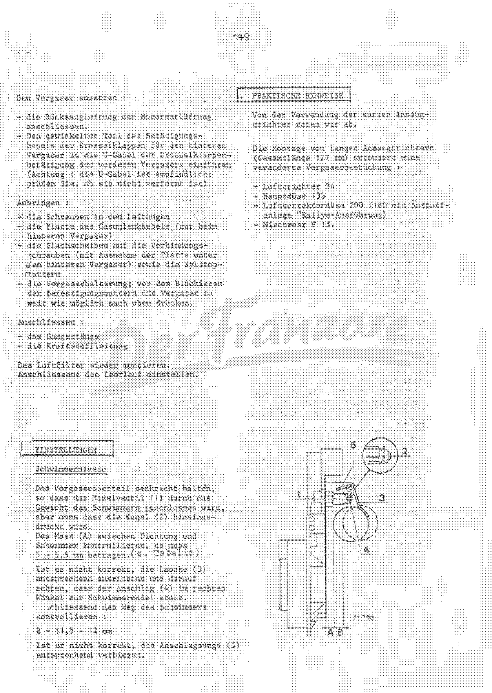
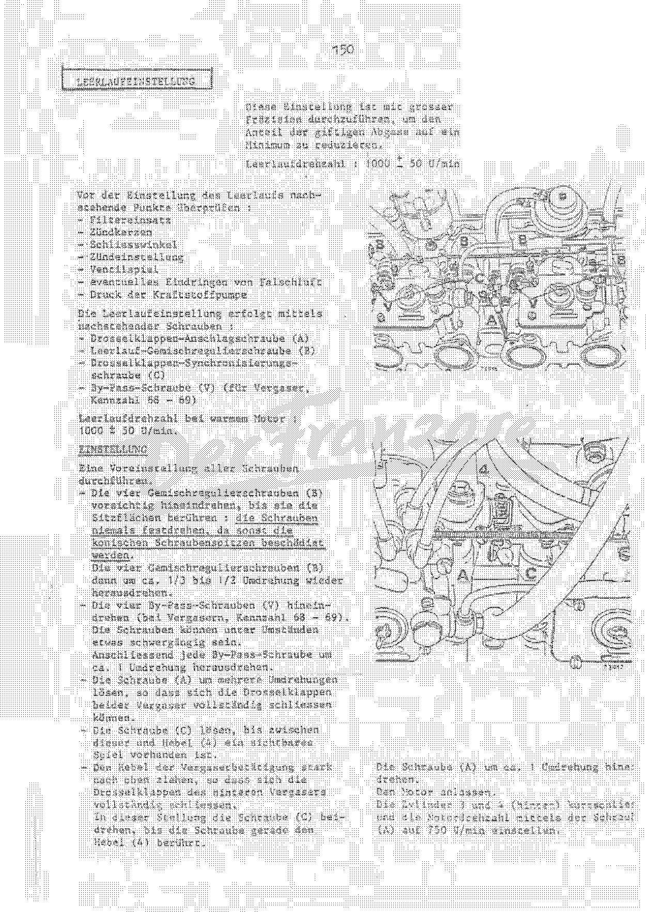
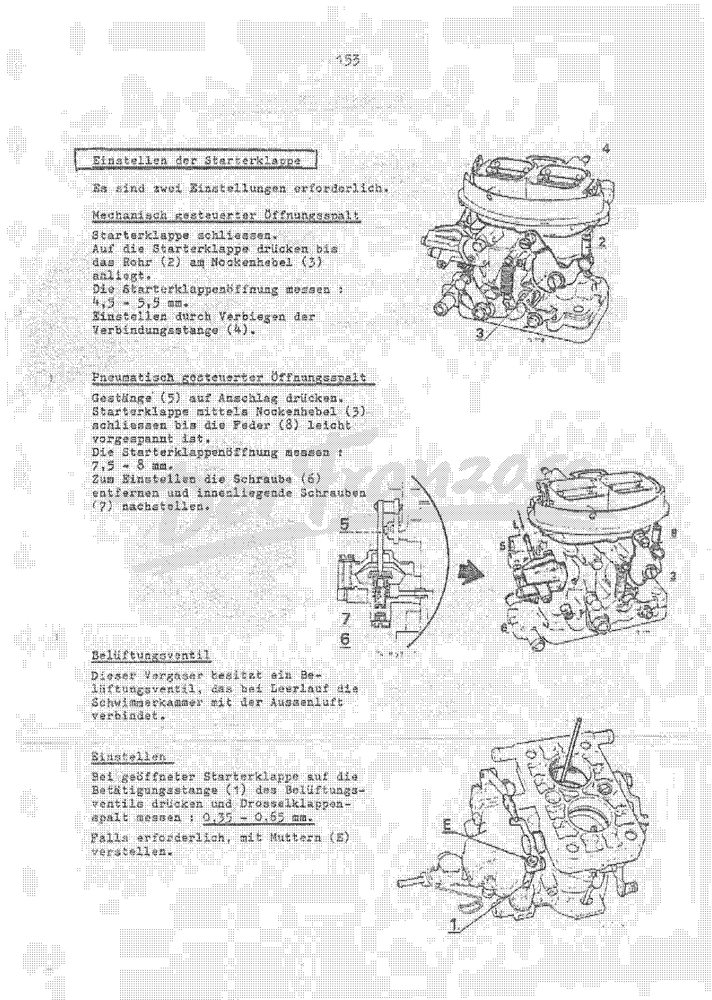
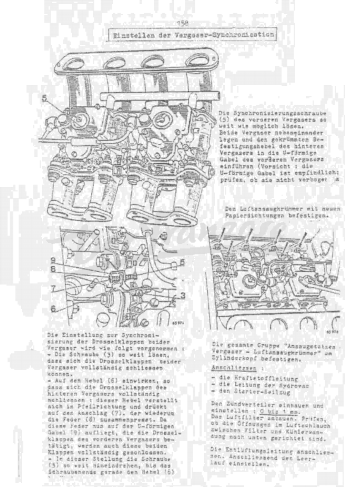

<!-- SOURCE NOTE: PDF pages 142-158 of alpine-a110-reparaturhandbuch.pdf. Translated from the
German original; prose is English, every value is as printed. Decimal separators are normalized
to the English convention (Rule 13): the page prints "11,5 mm", this wiki writes "11.5 mm".
Notation changes, value does not; no unit is converted.
Every jetting/settings table (PDF pp.142, 144, 149, 152) was read cell by cell from the page
images (350 dpi, contrast-enhanced where faded); the OCR of these tables is unusable. The 1600 S
and 1600 GS columns of the PDF p.142 table are very faint — flagged below.
MISFILED PAGES (Rule 9): the printed page numbers run 145-158 over PDF pp.142-155, then PDF
p.156 is printed "165" and PDF p.157 "166" — two CLUTCH pages (clutch identification; clutch
replacement) bound into the middle of the fuel chapter — and PDF p.158 is printed "159" and
continues the 1300 G/S carburettors. Pages are kept in PDF order as the brief requires. The two
clutch pages are transcribed here at their PDF position (so citations to PDF p.156/157 resolve)
and are signposted from [Clutch](10-clutch.md); they are not duplicated there.
Weber jet sizes ("125", "F 15", "45 F 8") are part designations, not dimensions, and carry no
unit on the page. -->

# Fuel system

**[PDF p.142]**

## Fuel supply — carburettor data by version

| Vehicle version | 1300 — 1st stage | 1300 — 2nd stage | 1300 G | 1300 S | 1600 S | 1600 GS |
|---|---|---|---|---|---|---|
| Carburettor type | WEBER Type 32 Dir. 4 | (same) | WEBER 40 DCOE 29 and 30, or 25 and 26 | WEBER 40 DCOE 29 and 30 | WEBER 45 DCOE 18-19 or 14 or 36-37 or 38-39 | WEBER 45 DCOE 18-19 or 14 or 36-37 or 38-39 |
| Choke (venturi) | 23 | 24 | 32 | 33 | 34 | 38 |
| Main jet (Gg) | 125 | 125 | 125 | 130 | 125 | 150 |
| Air corrector jet (a) | 160 | 150 | 200 | 200 | 200 | 175 |
| Emulsion tube | — | — | F 15 | F 15 | F 15 | F 15 |
| Idle jet (g) | 50 | 60 | 45 F 8 | 45 F 8 (then 50 F 8 from MOT 1635) | 55 F 8 | 55 F 8 |
| Needle valve | — | — | — | 150 | 150 | 150 |
| Accelerator pump jet | — | — | 35 | 35 | 35 | 35 |
| Float weight | 11 g | | 23 g (26 g with 25/26) | 23 g | 23 g (26 g with 14) | 23 g (26 g with 14) |
| Float height (mm) | 7 | | 5 (8.5 with 25/26) | 5 (8.5 with 25/26) | 5 (8.5 with 14) | 5 (8.5 with 14) |
| Float travel (mm) | 8 | | 11.5 | 11.5 | 15 | 15 |
| Air filter | R. 8 Lautrette | | ALPINE | ALPINE | ALPINE | ALPINE |

<!-- NEEDS REVIEW: read from the page image; the OCR of this table is garbage. The 1600 S and
1600 GS columns are printed very faintly: "34" (1600 S choke), "38" (GS choke), "150" (GS main
jet) and "175" (GS air corrector) were read from a contrast-enhanced 350 dpi crop and are the
least certain cells. The carburettor identifier first in the 1600 list reads "18-19" but could be
"13-19"; p.144 lists only 38-39, 62-63, 68-69 for the 1600 S. The 1300 G cell for the needle valve
is blank on the page; the single "150" printed under "MOT 1635)" in the 1300 S column may apply to
1300 G as well. "ab MOT 1635" rendered "from MOT 1635" — probably engine number 1635, not a tool.
The 1300 (32 Dir. 4) 2nd-stage main jet is 125 here, but the 1300 VC page (PDF p.149, carburettor
32 DIR, identifier 1001) gives 145 — different carburettor versions. -->

<!-- NEEDS REVIEW: cross-check with the key-settings plate in
[02-general-technical-data.md](02-general-technical-data.md). This table's 1300 float level 7 mm
and float travel 8 mm AGREE with the plate's 7 / 8 mm for the 32 DIR. Its 1600 S float travel
"15" does NOT match the plate's 11.5-12 mm for the 45 DCOE, nor PDF p.144 (11.5 mm) or p.146
(B = 11.5-12 mm), which are the specific 1600 S pages; the 1600 S "15" here is legible and is
reproduced as printed. -->

The figure shows the Weber DCOE from above with the idle jets **(1)** / **(g)**, starter jets
**(G1)** and items **(2)**.

**Clearance between intake stub and carburettor: 1.2 to 1.3 mm.**

<!-- NEEDS REVIEW: this clearance is printed below the DCOE figure with no version stated. The
1300 G/S fitting procedure (PDF p.154) gives J = 1.5 mm for the same joint; chapter 06 (engine
812) also gives J = 1.5 mm. The two values are not reconciled on the page. -->

> **1600 S or GS:** when an electric fuel pump is used, **never** remove the mechanical fuel
> pump; simply "short-circuit" the mechanical pump by joining its inlet and outlet with a hose.

**[PDF p.143]**

## Carburettors — 1600 S

### Technical data

The figure shows the Weber 45 DCOE with an arrow to the identifier plate on the cover.

### Fitting carburettors

The 1600 S engine was fitted successively with different **WEBER 45 DCOE** carburettors. They are
identified by the identifier numbers on the cover (see arrow).

For the engine to run correctly, the two carburettors that belong together must always be fitted
as a pair, per the table:

| Identifier — rear carburettor (timing-cover side) | Identifier — front carburettor (clutch side) |
|---|---|
| 38 | 39 |
| 62 | 63 |
| 68 — No. 7700572309 | 69 — No. 7700572310 |

> If both carburettors are replaced at the same time, fit the latest version (identifiers **68
> and 69**).

**[PDF p.144]**

### Jetting by identifier (1600 S)

Figure 65 980-1 shows the main jet **Gg**, emulsion tube assembly **(1)** with air corrector **a**,
and the idle jet holder **(2)** with idle jet **g**. The second figure locates on the carburettor:
items **1** and **2**, screw **C**, pump jets **Gp** and starter jets **Gs**.

| Identifier | 38 - 39 (number over 1000) | 62 - 63 | 68 - 69 |
|---|---|---|---|
| "Air filter" (printed; see flag) | 34 | 34 | 34 |
| Main jet Gg | 135 | 135 | 135 |
| Air corrector jet a | 220 | 220 | 220 |
| Idle jet g | * 50 F 10 | 55 F 8 | 50 F 8 |
| Starter jet Gs | 85 F 5 | 85 F 5 | 85 F 5 |
| Pump jet Gp | 35 | 35 | 35 |
| Accelerator pump intake valve | 50 | 60 | 60 |
| Pump stroke | 10 mm | 16 - 17 mm | 16 - 17 mm |
| Needle valve | 1.5 mm | 1.5 mm | 1.5 mm |
| Float level — low position | 5 mm | 5 mm | 5 mm |
| Float level — high position | 11.5 mm | 11.5 mm | 11.5 mm |
| Float weight | 23 g | 23 g | 23 g |
| Emulsion tube | F 9 | F 9 | F 9 |

\* with 1 hole of 95 and drill mark.

<!-- NEEDS REVIEW: the first row is printed "Luftfilter" (air filter) with the value 34. A value
of 34 fits the CHOKE/VENTURI ("Lufttrichter"), which is 34 for the 1600 S on PDF p.142 and in the
long-trumpet jetting on p.146. Likely a source misprint (Lufttrichter -> Luftfilter), not OCR — the
image clearly reads "Luftfilter". Reproduced as printed.
The footnote is in FRENCH on the page: "avec 1 trou de 95 et empreinte de foret".
"Saugventil der Beschleunigungspumpe" rendered "accelerator pump intake valve".
The "Schwimmerstand niedrig / hoch" (float level low / high position) 5 mm / 11.5 mm correspond
to dimensions A and B of the float-setting procedure on PDF p.146 (A = 5 - 5.5 mm,
B = 11.5 - 12 mm).
CROSS-CHECK with the key-settings plate (chapter 02): plate float level 5.5 mm and float travel
11.5-12 mm for the 45 DCOE. PDF p.146 prints A = 5 - 5.5 mm and B = 11.5 - 12 mm (legible), which
contains the plate's values; this table gives 5 / 11.5 mm. Main jet here is 135 against 125 on
the PDF p.142 overview — different identifiers / dates. -->

**[PDF p.145]**

### Removing and fitting a carburettor (1600 S)

#### Removal

1. Disconnect the battery.
2. Remove the air filter.
3. Disconnect the fuel supply pipe connections at both carburettors.
4. Disconnect the throttle linkage.
5. Unscrew the synchronizing screw **(C)** as far as possible.
6. Remove the four flange securing bolts of the carburettor and the throttle relay lever plate
   (under the rear carburettor only).
7. Remove the carburettor.

#### Fitting

1. Check the flexible flange **(1)** and fit it to the intake stub.
2. Use a washer under each carburettor securing bolt.
3. Always renew the Nylstop nuts.

**[PDF p.146]**

4. Offer up the carburettor:
   - connect the engine breather return pipe;
   - insert the angled part of the throttle operating lever of the rear carburettor into the
     U-fork of the throttle linkage of the front carburettor (**caution:** the U-fork is
     delicate — check that it is not distorted).
5. Fit:
   - the bolts on the pipes;
   - the throttle relay lever plate (rear carburettor only);
   - the flat washers on the connecting bolts (except the plate under the rear carburettor) and
     the Nylstop nuts;
   - the carburettor support; before locking the securing nuts, push the carburettors up as far
     as possible.
6. Connect the throttle linkage and the fuel pipe.
7. Refit the air filter.
8. Then set the idle.

### Practical notes

We advise against using the short intake trumpets.

Fitting the long intake trumpets (overall length **127 mm**) requires different carburettor
jetting:

| Item | Size |
|---|---|
| Choke (venturi) | 34 |
| Main jet | 135 |
| Air corrector jet | 200 (180 with the "Rallye" exhaust system) |
| Emulsion tube | F 15 |

### Settings — float level

1. Hold the carburettor top vertical, so that the needle valve **(1)** is closed by the weight of
   the float but the ball **(2)** is not pushed in.
2. Check dimension **(A)** between gasket and float: it must be **5 - 5.5 mm** (see table).
3. If it is not correct, bend tab **(3)** accordingly, making sure the stop **(4)** is at right
   angles to the float needle.
4. Then check the float travel: **B = 11.5 - 12 mm**.
5. If it is not correct, bend the stop tongue **(5)** accordingly.

<!-- NEEDS REVIEW: "(s. Tabelle)" after "5 - 5.5 mm" is in a different typeface from the rest of
the page (added later, typed, not handwritten). The "table" is presumably PDF p.144. -->

**[PDF p.147]**

### Idle setting (1600 S)

> This setting must be carried out with great precision to reduce the proportion of toxic
> exhaust gases to a minimum.

**Idle speed: 1000 ± 50 rpm.**

Before setting the idle, check:

- filter element;
- spark plugs;
- dwell angle;
- ignition timing;
- valve clearance;
- any air leaks;
- fuel pump pressure.

The idle is set with the following screws:

- throttle stop screw **(A)**;
- idle mixture screw **(B)**;
- throttle synchronizing screw **(C)**;
- by-pass screw **(V)** (for carburettors with identifier 68 - 69).

**Idle speed with the engine warm: 1000 ± 50 rpm.**

<!-- NEEDS REVIEW: the OCR reads the by-pass screw identifiers as "63 - 69"; the image clearly
prints "68 - 69" (consistent with the rest of the page) — corrected from image.
CROSS-CHECK: idle 1000 ± 50 rpm AGREES with the key-settings plate value for the 45 DCOE
(chapter 02). -->

#### Setting

Pre-set all the screws first:

1. Carefully screw in the four mixture screws **(B)** until they touch their seats. **Never
   tighten them, or the tapered tips of the screws will be damaged.** Then unscrew the four
   mixture screws **(B)** about **1/3 to 1/2 turn**.
2. Screw in the four by-pass screws **(V)** (carburettors with identifier 68 - 69). The screws
   may be somewhat stiff. Then unscrew each by-pass screw about **1 turn**.
3. Slacken screw **(A)** several turns, so that the throttles of both carburettors can close
   completely.
4. Slacken screw **(C)** until there is visible play between it and lever **(4)**.
5. Pull the carburettor operating lever hard upwards so that the throttles of the rear
   carburettor close completely. In this position screw in screw **(C)** until it just touches
   lever **(4)**.
6. Screw in screw **(A)** about **1 turn**.
7. Start the engine.
8. Short-circuit cylinders **3 and 4** (rear) and set the engine speed to **750 rpm** with screw
   **(A)**.

**[PDF p.148]**

9. Short-circuit cylinders **1 and 2** (front) and set the engine speed to **750 rpm** with screw
   **(C)**.
10. Set the engine speed to **1000 rpm** with screw **(A)**.
11. Set the idle mixture of the carburettor: adjust screw **(B)** until the maximum idle speed is
    reached (connect an electronic tachometer to the engine for this).

> \* Always finish the setting so that the mixture is weakened — i.e. when the maximum
> obtainable engine speed equals the correct idle speed, screw the mixture screw in again
> slightly.

12. Screw screw **(A)** in or out so that the idle speed is **1000 ± 50 rpm**.
13. Check the synchronization of the carburettors and readjust if necessary.
14. Check the idle mixture.
15. On carburettors with identifier **68 - 69**: short-circuit the cylinders one at a time. If
    the drop in engine speed is unequal, adjust at the by-pass screw **(V)**: determine the
    difference in the speed drop and divide it by two, so as not to upset the synchronization.

    **Example:** screw one screw in so that the speed difference drops by half the value, and
    unscrew the other screw by the same amount.
16. Correct the idle mixture after this setting.

The carburettor setting is correct when the speed drop is the same on short-circuiting the two
front and then the two rear cylinders. On carburettors with identifier 68 - 69, the speed drop on
short-circuiting individual cylinders must be about **25 rpm per cylinder**.

The figure (73912.2, captioned in French "Repères 68 et 69") shows the by-pass screws **V** on
the identifier 68/69 carburettor.

**[PDF p.149]**

## Carburettor 1300 VC — WEBER Type 32 DIR

Progressive two-stage carburettor with manually operated choke flap. With a hot-water-heated
carburettor flange. The carburettor type and identifier are stamped on one side of the
carburettor base.

Settings (values in brackets for the DIR 21 carburettor):

| Jetting and settings (identifier 1001) | 1st stage | 2nd stage |
|---|---|---|
| Choke (venturi) (K) | 23 | 24 |
| Main jet (Gg) | 125 (120) | 145 (110) |
| Idle jet (g) | 50 (70) | 60 |
| Air corrector jet (a) | 160 (135) | 150 (100) |
| Emulsion tube | F 53 | F 6 |
| Auxiliary venturi | 3 | 4.5 |
| Pump jet | 50 (single entry) | |
| Float needle valve | 1.75 mm | |
| Float weight | 11 g | |
| Float level | 7 mm | |
| Float travel | 8 mm | |
| Throttle opening (positive) | 1 mm (1.2 mm) | |
| Choke flap opening (mechanical) | 4.5 - 5.5 mm (10 mm) | |
| Choke flap opening (pneumatic) | 7.5 - 8 mm (5.5 - 6.5 mm) | |
| Throttle opening with vent valve closed | 0.35 - 0.65 mm | |

<!-- NEEDS REVIEW: table read from the page image. "Zerstäuber" rendered "auxiliary venturi"
(Weber centro/booster); "Einspritzdüse" rendered "pump jet"; "Drosselklappenöffnung (positiv)"
rendered "throttle opening (positive)" — the fast-idle throttle gap with choke closed.
The needle valve prints "1;75 mm" — read as 1.75 mm (punctuation artefact of the typewriter).
The pump jet cell has a small mark before the "50" (possibly a dash for the 1st stage).
CROSS-CHECK with the key-settings plate (chapter 02): float level 7 mm and float travel 8 mm
AGREE. The plate's minimum throttle opening "0.8 / 1.2 mm" does NOT match this page's 1 mm for the
1001 carburettor (the 1.2 mm here is the DIR 21 figure); the plate's choke gaps "8 / 6 mm" fall
inside / near this page's pneumatic 7.5 - 8 mm (5.5 - 6.5 mm). This page is legible; it does not
settle which carburettor the plate's 0.8 mm belongs to. -->

### Float setting

1. Hold the carburettor cover vertical so that the float needle valve **(1)** is closed by the
   weight of the float, without pushing the ball **(2)** into the valve body.
2. Check distance **(A)** between float chamber gasket and float: **A = 7 mm**.
3. If the distance must be corrected, bend the float arm **(3)**, making sure that the tongue
   **(4)** presses squarely on the float needle.
4. Check the float travel: **B = 8 mm**.
5. If correction is needed, bend tongue **(5)**.

### Throttle opening

1. Close the choke flap.
2. Measure the throttle opening: **1 mm**. Use gauge **M.S. 532**.
3. To adjust, slacken the locknut and adjust screw **(1)** accordingly.

<!-- NEEDS REVIEW: OCR read the gauge as "M.S. 552"; the page image prints "M.S. 532" —
corrected from image. -->

**[PDF p.150]**

### Setting the choke flap (1300 VC)

Two settings are required.

#### Mechanically controlled opening gap

1. Close the choke flap.
2. Press on the choke flap until the tube **(2)** rests against the cam lever **(3)**.
3. Measure the choke flap opening: **4.5 - 5.5 mm**.
4. Adjust by bending the connecting rod **(4)**.

#### Pneumatically controlled opening gap

1. Push the linkage **(5)** to its stop.
2. Close the choke flap with the cam lever **(3)** until the spring **(8)** is slightly
   preloaded.
3. Measure the choke flap opening: **7.5 - 8 mm**.
4. To adjust, remove screw **(6)** and adjust the inner screws **(7)**.

### Vent valve

This carburettor has a vent valve which connects the float chamber to the outside air at idle.

#### Setting

1. With the choke flap open, press the operating rod **(1)** of the vent valve and measure the
   throttle gap: **0.35 - 0.65 mm**.
2. If necessary, adjust with the nuts **(E)**.

<!-- NEEDS REVIEW: OCR read the adjusting nuts as "(5)" and the pneumatic gap as "76 - 8 mm"; the
image prints "Muttern (E)" and "7,5 - 8 mm" — corrected from image. "Belüftungsventil" rendered
"vent valve" (float chamber vent). -->

**[PDF p.151]**

### Setting the idle (1300 VC)

> This setting must be carried out with the greatest care, to achieve the exhaust-gas values
> required by law.

Using the flexible screwdriver **Mot. 561** makes the adjustment easier. The mixture screw of the
Weber 32 DIR 11 carburettor can be adjusted by hand.

#### Setting method

**Idle speed: 675 - 725 rpm.**

The setting is made with 2 screws.

1. Set the idle speed to about **700 rpm** with screw **(A)**.
2. Set screw **(B)** for the highest engine speed.
3. Repeat both operations until the maximum speed obtainable with screw **(B)** lies between
   **700 - 725 rpm**.
4. Then weaken the mixture by screwing in screw **(B)** until the speed drops by **20 to 25
   rpm**, but the engine still runs perfectly smoothly.
5. Check that the idle speed is still between **675 - 725 rpm**.

| Carburettor | Screw A | Screw B |
|---|---|---|
| Weber | Throttle stop screw | Mixture screw |
| Solex | Air regulating screw | Fuel regulating screw |

<!-- NEEDS REVIEW: CROSS-CHECK with the key-settings plate (chapter 02): the plate gives idle
800 ± 50 rpm for the 32 DIR (1300 VC); this page clearly prints 675 - 725 rpm. The two disagree
and are not reconciled; this page names the "32 DIR 11" (the jetting page names identifier 1001 and
the DIR 21) and also illustrates a SOLEX carburettor, which no A110 version in this book uses — it
may be taken over from a Renault saloon manual. Both values as printed. -->

**[PDF p.152]**

## Carburettors 1300 G/S

The vehicles are fitted with two twin-choke **WEBER 40 DCOE** carburettors.

The page carries an exploded view of the 40 DCOE (labelled 40DCOE 24 / 40DCOE 26) and a top view
locating items **1**, **2** and starter jets **Gs**, with the jet figure 65 980 (main jet **Gg**,
emulsion tube **(1)** with air corrector **a**, idle jet holder **(2)** with idle jet **g**).

### Settings

| Item | Value |
|---|---|
| Choke (venturi) | 32 |
| Air corrector jet a | 200 |
| Main jet Gg | 125 |
| Idle jet g | 45 |
| Starter jet Gs | 60 |
| Accelerator pump stroke | 10 mm |
| Accelerator pump jet | 35 |
| Needle valve | 1.5 mm |

<!-- NEEDS REVIEW: read from the page image; OCR reads the idle jet as "us" and the needle valve
as "pre, mm". The pump-jet line prints "Düse der Beschleunigerpumpe 1 . 35" — the "1 ." is a
stray mark or a leader; the value is 35. These are the 1300 G figures (choke 32); the 1300 S uses
choke 33 and main jet 130 per PDF p.142. -->

**[PDF p.153]**

### Removing and fitting the carburettors (1300 G/S)

#### Removal

1. Remove:
   - the air filter;
   - the distributor.
2. Disconnect:
   - the choke cable;
   - the fuel pipe at the front carburettor;
   - the Hydrovac pipe;
   - the breather pipe.
3. Remove the assembly "intake stubs - carburettors - air intake manifold" in one piece.
4. Separate the individual parts.

#### Assembly

Fit the ring seals into the intake stubs as follows:

1. Press the seal into the groove progressively all the way round with the thumb, so that the
   excess length of the seal is distributed evenly over the whole circumference. **It must lie
   flat and must not undulate.**
2. Turn the intake stub over and press it with its ring seals onto a surface plate, so that the
   contact faces of the seals become flat.

<!-- NEEDS REVIEW: the upper half of this page is blank on the scan. "Tuschierplatte" rendered
"surface plate"; "Ansaugkrümmer" in "Ansaugstutzen - Vergaser - Ansaugkrümmer" rendered "air
intake manifold" because p.155 calls the same part "Luftansaugkrümmer". -->

**[PDF p.154]**

3. On each carburettor securing bolt fit:
   - the metal washer **(1)**;
   - the rubber sleeve **(2)**.
4. Fit the bolts to the stubs.
5. Fit the corresponding carburettor to each stub.
6. Secure the relay lever support to the rear carburettor.
7. Fit the flat washers (except under the support) and the Nylstop nuts.
8. Tighten the nuts progressively until there is a clearance of **J = 1.5 mm** between
   carburettor and stub.

**[PDF p.155]**

### Setting the carburettor synchronization (1300 G/S)

1. Slacken the synchronizing screw **(5)** of the front carburettor as far as possible.
2. Lay the two carburettors side by side and insert the curved securing lever of the rear
   carburettor into the U-shaped fork of the front carburettor (**caution:** the U-shaped fork is
   delicate — check that it is not bent).
3. Fit the air intake manifold with new paper gaskets.

The throttles of both carburettors are synchronized as follows:

1. Slacken screw **(3)** far enough that the throttles of both carburettors can close
   completely.
2. Act on lever **(6)** so that the throttles of the rear carburettor close completely: this
   lever moves in the direction of the arrow and presses on the stop **(7)**, which in turn
   compresses the spring **(8)**. As this spring bears on the U-shaped fork **(9)** which operates
   the throttles of the front carburettor, these two throttles are also closed completely.
3. In this position screw in screw **(5)** until the end of the screw just touches lever **(6)**.

4. Fit the whole "intake stubs - carburettors - air intake manifold" assembly to the cylinder
   head.
5. Connect:
   - the fuel pipe;
   - the Hydrovac pipe;
   - the choke cable.
6. Fit and set the distributor: **0 to 1 mm**.
7. Fit the air filter. Check that the openings in the air hose between filter and radiator wall
   point downwards.
8. Connect the breather pipe. Then set the idle.

<!-- NEEDS REVIEW: step 3's last word is cut off at the foot of the page ("gerade den Hebel (6)"
— "berührt"/touches is supplied from sense). Step 6 prints "einstellen : 0 bis 1 mm" — a
distributor setting given in mm is odd; it may be the contact-breaker gap or a misprint for 0 to
1° (the 1300 G static timing is 0° +1 −0 in [Ignition system](07-ignition.md)). Kept as printed.
This synchronization and the J = 1.5 mm fitting are also given for engine 812 in
[Engine type 812 — overhaul](06-engine-812.md) (PDF pp.135-136). -->

**[PDF p.156]**

## Misfiled clutch page — clutch identification

> **This page belongs to the clutch section** (printed page 165), bound into the fuel chapter.
> See [Clutch](10-clutch.md).

### Identification

The type number is stamped on the end face of the pressure plate housing (arrow, figure 60 453).

The page shows two sectional drawings: **clutch mechanism without release plate** and **clutch
mechanism with release plate**.

<!-- NEEDS REVIEW: Rule 9 misfiled page. Printed "165" between fuel pages printed 158 and 159.
"Ausrückplatte" rendered "release plate". -->

**[PDF p.157]**

## Misfiled clutch page — replacing the clutch (all types)

> **This page belongs to the clutch section** (printed page 166), bound into the fuel chapter.
> See [Clutch](10-clutch.md).

1. Remove the engine.
2. The clutch mechanism is dynamically fine-balanced together with the crankshaft and flywheel;
   this was done either by drilling or by fitting additional washers under the securing bolts.
   Before removing the clutch mechanism, therefore, **mark the position of the mechanism on the
   flywheel, and the position and number of the washers.** (If the mechanism is replaced, the
   additional washers are **not** to be refitted!)
3. Slacken the securing bolts and remove the pressure plate and the driven plate.
4. Check all parts. Replace defective parts.

> **The friction face of the flywheel must not be machined. If the friction face is damaged, the
> flywheel must be replaced.**

### Fitting

1. Carefully clean the bearing face on the flywheel.
2. Fit the driven plate with the **longer hub side towards the gearbox**.
3. Fit the pressure plate observing the marks made on removal; if necessary drive it onto the
   dowels with light taps.
4. Insert a clutch shaft or the centring mandrel **Emb.257/Emb.02** into the hub of the driven
   plate, and tighten the securing bolts evenly, crosswise, to **5 mkp**.
5. Lubricate the contact face of the release bearing on the diaphragm spring with graphite
   grease.
6. Refit the engine and set the clutch free play.

<!-- NEEDS REVIEW: Rule 9 misfiled page, printed "166". The torque "5mkp" is clearly printed
(checked at 350 dpi). It is high for clutch cover bolts, but nothing on the page contradicts it;
kept as printed — verify before use. "Mitnehmerscheibe" rendered "driven plate" (clutch disc);
"Tellerfeder" rendered "diaphragm spring". -->

**[PDF p.158]**

## Setting the idle (1300 G/S)

Before starting the idle setting, check the following:

- condition of the spark plugs;
- distributor setting;
- valve clearance;
- any leaks. To check, pour a little paraffin on the flexible joint between carburettor and
  intake stub. If the paraffin is drawn in, there is an air leak. In that case the flexible joint
  must be checked.

**The idle speed is between 1000 and 1200 rpm.**

The carburettors are set with the following screws:

- idle stop screw **(3)**;
- idle mixture screws **(4)**;
- throttle synchronizing screw **(5)**.

1. Screw in the idle stop screw **(3)** a little, so that the throttles open slightly.
2. Carefully screw in the four mixture screws **(4)** until they touch their seats. **Never
   tighten these screws, or the seats would be destroyed.**
3. Unscrew the four mixture screws about **1 1/4 turns**.
4. Start the engine to warm it up. Blip the throttle from time to time so that the spark plugs do
   not soot up.
5. With the engine warm, connect an electronic tachometer, which gives a more accurate reading
   than the one fitted in the car.
6. Adjust screw **(3)** so that the engine speed is between **1000 and 1200 rpm**.
7. Now operate the four mixture screws **(4)** one after the other, setting each screw
   individually to reach the maximum speed.
8. Check that each cylinder is working normally:
   - by the temperature of the exhaust gases;
   - by short-circuiting the individual spark plug leads.

The synchronization can be refined further: if, when the carburettor linkage was pulled up, the
pressure was not sufficient, the throttles of the front carburettor feeding cylinders 1 and 2 are
opened slightly more than those of the rear carburettor feeding cylinders 3 and 4. The filling of
cylinders 1-2 and 3-4 then differs. To remove this inequality it is enough to screw the
synchronizing screw **(5)** in a very little. After the setting, readjust the idle speed to
**1000 to 1200 rpm** with screw **(3)**.

<!-- NEEDS REVIEW: printed page number "159" — this page continues the 1300 G/S section after the
two misfiled clutch pages. "Petroleum" rendered "paraffin" (kerosene). The last word of the page
is cut off ("regulieren"). -->

## Special tools used in this chapter

| Tool | Use |
|---|---|
| M.S. 532 | Gauge for the throttle opening (1300 VC, Weber 32 DIR) |
| Mot. 561 | Flexible screwdriver for the idle mixture screw (1300 VC) |
| Emb.257 / Emb.02 | Clutch centring mandrel (misfiled clutch page, PDF p.157) |

## Next

[Cooling system](09-cooling.md).
