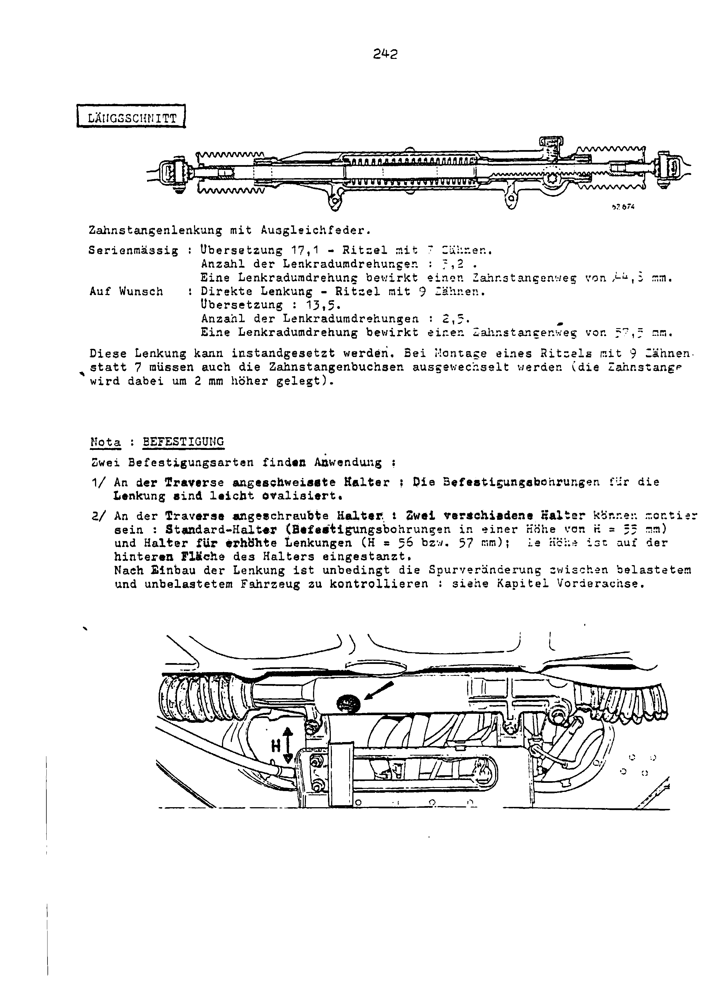
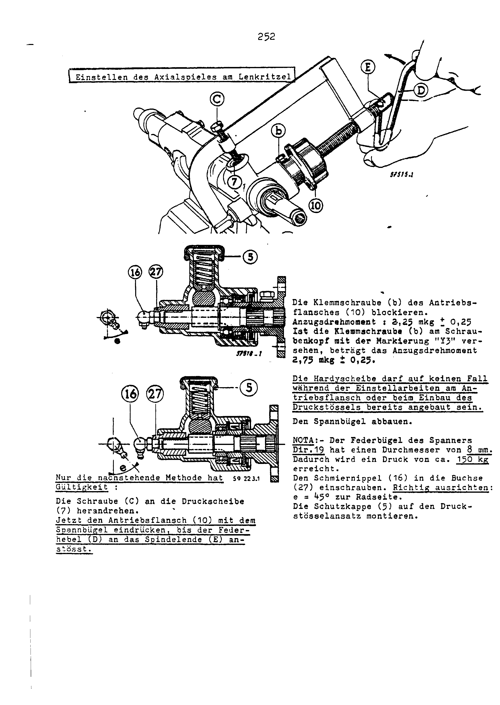
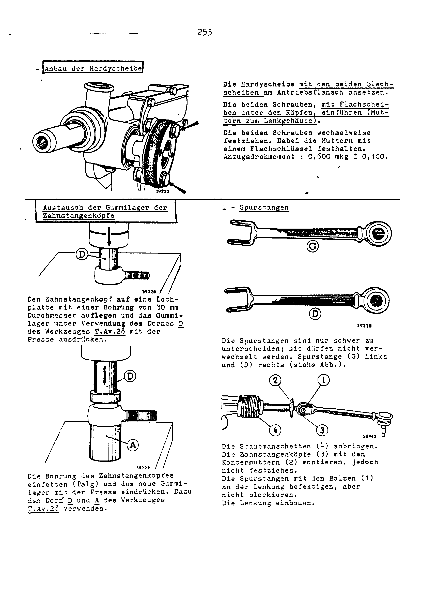

<!-- SOURCE NOTE: PDF pages 236-248. Translated from the German original; prose is English, every
value is as printed, decimal separators normalized to the English convention (Rule 13).
Torque on these pages is printed in "mkg" (metre-kilogram = mkp) and is NOT converted.
Every page in the range was read from the rendered page image; the raw OCR of this chapter is
poor (it lost every letter "t" and misread several values and tool numbers, which are flagged
where it matters). PDF p.236 is the section divider "LENKUNG" (section tab G) with the next
page's drawing showing through; it carries no data of its own. The "DerFranzose" watermark
crosses every page but obscures no value in this range. -->

# Steering (all types)

**[PDF p.236](../page-images/p0236.png)**

Section divider: **Steering** (section tab **G**). The page shows a general view of the steering
rack and carries no text or values of its own.

**[PDF p.237](../page-images/p0237.png)**

## Longitudinal section and description

Rack-and-pinion steering with a compensating spring.

| Item | Standard | Optional — direct steering |
|---|---|---|
| Pinion | 7 teeth | 9 teeth |
| Ratio | 17.1 | 13.5 |
| Turns of the steering wheel (lock to lock) | 3.2 | 2.5 |
| Rack travel per turn of the steering wheel | 44.5 mm | 57.5 mm |

<!-- NEEDS REVIEW: (1) Rack travel per turn: the image is faint on the last digits of both
values. Standard reads "44,5 mm" (OCR "£4,535"; the first digit is a broken "4") and the direct
steering "57,5 mm" (OCR "57,2"). The "5" and "3" are hard to tell apart in this typeface, so
44.3 / 57.3 cannot be excluded. Arithmetic check: 44.5 × 9/7 = 57.2, so the two printed
figures are not exactly in the pinion-tooth ratio whichever way they are read — keep as printed
and verify before relying on them. (2) Ratio: this page prints "Übersetzung 17,1" (with a
decimal comma, i.e. 17.1) where the key-settings plate in
[02-general-technical-data.md](02-general-technical-data.md) gives "17 : 1". Probably the same
value typed with a comma for the colon, but reproduced exactly as each page prints it.
Turns (3.2 / 2.5) and the direct ratio (13.5) AGREE with chapter 02. Steering-wheel
diameters are not given on these pages. -->

This steering can be overhauled. When a pinion with **9 teeth** is fitted instead of one with
**7**, the rack bushes must also be changed (the rack then sits **2 mm** higher).

### Note: mounting

Two mounting types are in use:

1. **Brackets welded to the cross-member:** the mounting holes for the steering are slightly
   elongated.
2. **Brackets bolted to the cross-member:** two different brackets may be fitted — the standard
   bracket (mounting holes at a height of **H = 55 mm**) and a bracket for raised steering
   (**H = 56 or 57 mm**). The height is stamped on the rear face of the bracket.

<!-- NEEDS REVIEW: the OCR reads the standard height as "H = 32 mm"; the page image shows
"H = 55 mm" — corrected from image. The 56 / 57 mm figures read cleanly. -->

> After fitting the steering, the **change in toe between the laden and the unladen vehicle**
> must be checked without fail — see [Front axle](13-front-axle.md).

**[PDF p.238](../page-images/p0238.png)**

## Removing and refitting the complete steering

### Removal

(See also the master cylinder section in [Brakes](16-brakes.md).)

1. Remove both front wheels.
2. Release both track rods with the tool **T.Av.54**.
3. Undo the two bolts of the Hardy disc **(2)** at the steering-column flange.
4. Remove the two bolts of the Hardy disc.
5. Unlock and slacken the two nuts **(1)** that secure the steering housing to the front
   cross-member.
6. Withdraw the complete steering housing sideways.

<!-- NEEDS REVIEW: printed "Hardyscheibe" — the flexible rubber coupling (flex disc) between
the steering column and the pinion flange; kept as "Hardy disc", the usual English trade name. -->

### Refitting

Carry out all the removal operations in reverse order. Do not forget:

- to split-pin the two securing nuts of the housing **(1)** and the bolts of the Hardy disc **(2)**.

| Fastener | Torque |
|---|---|
| Nuts (2) — castle nuts | 0.5 mkg ± 0.100 |
| Nuts (2) — self-locking | 0.750 mkg ± 0.150 |

**[PDF p.239](../page-images/p0239.png)**

- Observe the fitted direction of the bolts **(2)** (bolt head with washer towards the steering
  housing).
- Centre the steering wheel.
  1. Check the height of the ball pin.
  2. Align the front wheels and set the toe.

Before locking the locknuts of the rack ends, make sure that their pins are aligned exactly
parallel to the ground. Then tighten the pin nuts to **2.5 mkg ± 0.5**.

Lock the nuts **(a)** at **3.5 mkg ± 0.5**.

<!-- NEEDS REVIEW: the OCR dropped the 2.5 mkg ± 0.5 line entirely; it is read from the page
image. The page does not name the "Bolzenmuttern" (pin nuts) more precisely than the context
of the rack-end pins; the nuts (a) are marked on the figure at the track-rod ball joint under
the stub axle. -->

| Fastener | Torque |
|---|---|
| Rack-end pin nuts | 2.5 mkg ± 0.5 |
| Nuts (a), track-rod ball joint (per figure) | 3.5 mkg ± 0.5 |

### Longitudinal and cross sections

The page prints a longitudinal section of the steering, and two cross sections of the pinion
housing:

- pinion and bearing fitted with a **closed washer**;
- pinion and bearing fitted with a **circlip**.

> **NOTE — very important!** The design, and therefore the overhaul, of the steering was changed
> very often. Repairs on the steering should therefore only be undertaken when the correctness of
> the work carried out can be proven beyond doubt. The information given in this chapter is only
> of limited use for that!

**[PDF p.240](../page-images/p0240.png)**

## Dismantling the steering box

Remove the steering.

### A — Dismantling

1. Mount the steering housing on the special holder **Dir.20**, clamped in a vice.
2. Remove the pins **(1)** of the rack ends.
3. Slacken the locknut **(2)** and unscrew the rack end **(3)**.
4. Remove the dust boots **(4)**.

#### Steering pinion

5. Remove the protective cap **(5)** that closes the plunger housing.
6. Remove the circlip **(6)**, the thrust washer **(7)**, the spring **(8)** and the plunger
   **(9)**. Use the clamp **Dir.19** for this.
7. Remove the two bolts of the Hardy disc.
8. Remove the Hardy disc with its two plates.
9. Unscrew the clamp bolt of the pinion flange.
10. Remove the flange **(6)**, the circlip **(11)**, the lock washer **(12)** and the spacer
    **(13)**.

<!-- NEEDS REVIEW: source misprint, not OCR — step 10 prints "Den Flansch (6)"; on the exploded
view (fig. 58944) the flange is item (10), and (6) is the plunger circlip. Read as the flange
(10). -->

**[PDF p.241](../page-images/p0241.png)**

11. Remove the oil seal **(14)** with the extractor **Dir.16**.
12. Remove the circlip **(15)**, the grease nipple **(16)** and the washer **(19)**.
13. Carefully drive out the steering pinion **(17)** together with the bearing **(18)**.
14. Remove the sealing ring **(20)**.
15. Separate the bearing **(18)** from the pinion **(17)** with the press.
16. Remove the thrust washer **(21)**.

> **NOTE:** if the circlip **(21 bis)** is fitted to the pinion, it must be removed before the
> bearing **(18)** is pressed off the pinion **(17)**.

**[PDF p.242](../page-images/p0242.png)**

#### Rack

17. Remove the housing cover and the paper gasket.
18. Free the circlips **(22)** from their grooves as follows:
    1. **Circlip on the plain side of the rack:** with a screwdriver resting on the housing,
       lift one end of the ring and free it. Then, using a **17 mm** open-ended spanner (on the
       flat of the rack), turn the rack so that the circlip is pushed out of its groove **(23)**.
    2. **Circlip on the toothed side:** pull the rack out on the toothed side. When the circlip
       meets the rack bush it is pushed out of its groove.

> **NOTE:** the circlips, the snap rings and the oil seal cannot be re-used.

19. Remove the return spring **(25)**, the spring seats **(23)** and the rubber sleeve **(26)**.
20. Press the bearing bush **(2)** of the drive pinion inwards and out.

<!-- NEEDS REVIEW: source misprints, not OCR — (a) step 20 prints "Die Lagerbuchse (2)"; the
figure (59041) labels the pinion bush (27), which is also how the assembly text on PDF p.243
names it. (b) In step 18.1 the groove is given as "(23)", the same number the page uses for the
spring seats; reproduced as printed. -->

### B — Replacing the rack bushes

21. Press out the two rack bushes with the mandrel **Dir.17**.

> **NOTE:** the rack bushes **(28)** are distinguished by their colour; the **bronze-coloured**
> bush is fitted on the steering-pinion side.

22. Fit the bronze-coloured bush **(28)** on the pinion side, chamfer facing inwards.

> **NOTE:** if the bushes are not to be replaced, it is advisable to remove the bush opposite the
> pinion side. This makes reassembly considerably easier.

**[PDF p.243](../page-images/p0243.png)**

## Reassembly

1. Fit the drive pinion bush **(27)** from the inside of the housing.
2. There must be a grease reserve behind the rack bush **(28)**.
3. Insert the rubber bush **(26)** into the spring **(25)**.
4. Compress the spring with its two spring seats **(23)** and insert it into the housing.
5. Slide the new locking ring **(22)** onto the plain side of the rack (make sure it is properly
   seated in the ring groove).
6. Insert the rack **(24)**, with the guide mandrel **Dir.18 C** pushed onto it, toothed side
   first into the housing, and push it through the rubber bush **(26)** (as far as the middle of
   the spring).
7. Now slide the second new locking ring **(22)** over the guide mandrel.
8. Insert the fitting fork **Dir.18 C** into the housing.
9. Push the rack through until the locking ring **(22)** snaps in.

<!-- NEEDS REVIEW: the OCR reads the guide mandrel as "Dir.16 C"; the page image shows
"Dir.18 C" for both the guide mandrel and the fitting fork — corrected from image. -->

**[PDF p.244](../page-images/p0244.png)**

10. Remove the guide mandrel and the fitting fork.
11. Now fit the second rack bush **(28)** using a tube, and secure it with a new circlip.
12. After filling with an appropriate quantity of grease, fit the cover with a new paper
    gasket.

### Fitting the pinion

13. Fit the new circlip **(21 bis)** or the thrust washer **(21)** on the pinion.
14. Press the bearing **(18)** onto the pinion **(17)**.
15. Fit the **new** sealing washer **(20)** in the ring groove on the pinion.

> When inserting the pinion **(17)**, the **flat face (A)** of the splines must face the plunger.

**[PDF p.245](../page-images/p0245.png)**

16. Fit in this order: the thrust ring **(19)**, the **new** circlip **(15)**, the **new** oil
    seal **(14)** — oil it before fitting — the spacer **(13)**, the lock washer **(12)** and
    the upper **new** circlip **(11)**.

### D — Important note

On steering units fitted with the thrust washer **(21)** in place of the circlip **(21 bis)**,
various changes were made, mainly affecting the following parts:

- steering pinion **(17)**;
- bearing **(18)**;
- spacer **(13)**;
- seal **(20)**;
- retaining ring **(12)**

(see the previous page).

**[PDF p.246](../page-images/p0246.png)**

## Fitting the rack plunger

1. Fit the flange **(10)** so that the axis of its two bolt holes is at right angles to the
   rack axis. Do not lock the locking bolt **(6)**.
2. Fit the clamp **Dir.19**. Insert the two pins **(A)** on the spindle head into the holes of
   the drive flange **(10)**, and the centring pin **(B)** into the hole for the grease nipple.

> The plastic thrust plunger has been replaced by a **steel plunger**. When fitting this new
> plunger, a spring of **50 kg** load **must** be fitted instead of **25 kg**.
>
> **NOTE:** because the new spring has a much higher load, the inner groove for the snap ring
> **(6)** must be checked very carefully. The groove must show no damage whatever.

3. Fit:
   - the thrust plunger **(9)**;
   - the spring **(8)**;
   - the thrust washer **(7)**;
   - the **new** snap ring **(6)**.
4. Compress these parts with the screw **(C)** of the clamp **Dir.16**.
5. Fit the snap ring **(6)** into its groove with circlip pliers.
6. Slacken the screw **(C)**.

<!-- NEEDS REVIEW: (a) step 4 prints the clamp as "Dir.16" (clear on the image) whereas the
same clamp ("Spannbügel") is "Dir.19" in step 2, on PDF p.240 and on PDF p.247; Dir.16 is the
oil-seal extractor on PDF p.241. Probably a source misprint for Dir.19 — kept as printed.
(b) step 1 calls the locking bolt "(6)"; on the figure the flange clamp bolt is lettered (b) and
(6) is the snap ring. Kept as printed. -->

**[PDF p.247](../page-images/p0247.png)**

## Setting the pinion end float

> **Only the following method is valid:**

1. Run the screw **(C)** in against the thrust washer **(7)**.
2. Now push the drive flange **(10)** in with the clamp until the spring lever **(D)** touches
   the spindle end **(E)**.
3. Lock the clamp bolt **(b)** of the drive flange **(10)**.

| Fastener | Torque |
|---|---|
| Clamp bolt (b), drive flange (10) | 2.25 mkg ± 0.25 |
| Clamp bolt (b) with head marked "Y3" | 2.75 mkg ± 0.25 |

> **On no account may the Hardy disc already be fitted to the drive flange during this
> adjustment, or while the thrust plunger is being fitted.**

4. Remove the clamp.

> **NOTE:** the spring bow of the clamp **Dir.19** has a diameter of **8 mm**. This produces a
> load of about **150 kg**.

5. Screw the grease nipple **(16)** into the bush **(27)**. Align it correctly:
   **e = 45°** towards the wheel side.
6. Fit the protective cap **(5)** on the thrust-plunger boss.

<!-- NEEDS REVIEW: no numerical end-float value is printed; the setting is made purely by the
spring-lever method of clamp Dir.19 described above. The OCR reads the torque as "292,25 mkg";
the image shows 2.25 mkg ± 0.25 — corrected from image. -->

**[PDF p.248](../page-images/p0248.png)**

## Fitting the Hardy disc

1. Offer the Hardy disc, with its two sheet-metal washers, up to the drive flange.
2. Insert the two bolts, with flat washers under the heads (nuts towards the steering
   housing).
3. Tighten the two bolts alternately, holding the nuts with an open-ended spanner.

**Hardy disc bolts — tightening torque: 0.600 mkg ± 0.100.**

## Replacing the rubber bushes of the rack ends

1. Lay the rack end on a plate with a **30 mm** diameter hole and press the rubber bush out with
   the press, using the mandrel **D** of tool **T.Av.28**.
2. Grease the bore of the rack end (tallow) and press the new rubber bush in with the press,
   using the mandrels **D** and **A** of tool **T.Av.28**.

<!-- NEEDS REVIEW: the OCR reads the tool as "T.Av.25" and "T.av.23"; the page image reads
"T.Av.28" both times — corrected from image, though the last digit (8 vs 3) is not perfectly
crisp. -->

### I — Track rods

> The track rods are hard to tell apart; they **must not be interchanged**. Track rod **(G)** is
> the **left**, **(D)** the **right** (see figure).

1. Fit the dust boots **(4)**.
2. Fit the rack ends **(3)** with the locknuts **(2)**, but do not tighten them.
3. Attach the track rods to the steering with the pins **(1)**, but do not lock them.
4. Fit the steering.

## Special tools used in this chapter

| Tool | Use |
|---|---|
| T.Av.54 | Releasing the track rods (ball-joint extractor) |
| T.Av.28 | Mandrels D and A — pressing the rack-end rubber bushes out and in |
| Dir.16 | Oil-seal extractor (pinion oil seal 14); also printed as the clamp on PDF p.246 |
| Dir.17 | Mandrel — pressing out the rack bushes |
| Dir.18 C | Guide mandrel and fitting fork — refitting the rack |
| Dir.19 | Clamp (spring-bow tensioner) — plunger removal/fitting and pinion end-float setting |
| Dir.20 | Special holder for the steering housing (in a vice) |

## Next

[Front axle (all types)](13-front-axle.md).
