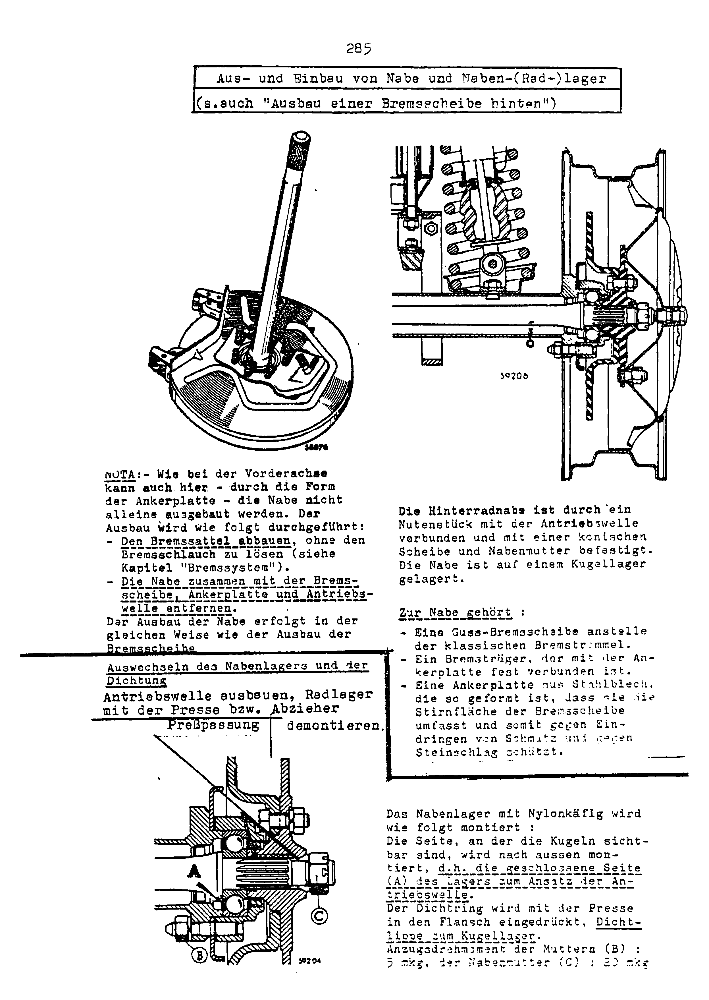

<!-- SOURCE NOTE: PDF pages 270-280. Translated from the German original; prose is English, every
value is as printed, decimal separators normalized to the English convention (Rule 13).
Torque on these pages is printed in "mkp" and "mkg" (the manual treats both as equal) and is NOT
converted. Every page in the range was read from the rendered page image. PDF p.270 is the
section divider "HINTERACHSE" (section tab J); its OCR is mirrored ("3SHOVH3LNIH") and it
carries no data. The illustrations on PDF pp.279-280 show a Renault 8-type saloon, not the A110
— the alignment method is a borrowed Renault procedure. The "DerFranzose" watermark crosses every
page but obscures no value in this range. -->

# Rear axle (all types)

**[PDF p.270](../page-images/p0270.png)**

Section divider: **Rear axle** (section tab **J**). No text or values.

**[PDF p.271](../page-images/p0271.png)**

## Rear axle — description of changes

As on the front axle, changes were made here to obtain **negative camber**. They are as follows.

### Alpine 1300 and 1300 G — 1600 S

Normal version with gearbox type **353**:

- fitting of **12 mm** wedges between the cross-member and the side gearbox mountings;
- fitting of **12 mm** wedges between the gearbox and the centre gearbox bearing block; this
  also requires the studs to be replaced.

> **NOTE:** **6 mm** wedges for the Alpine 1600 S with gearbox type **364** and hard side rubber
> mountings (set of rubber silentblocs no. **0996128200**).

### Alpine 1300 G (factory assembly) — 1300 S

- fitting of **23 mm** wedges between the cross-member and the side gearbox mountings;
- replacement of the centre bearing block (**ALPINE** bearing block);
- fitting of a strut between the clutch housing and the cross-member;
- side rubber mountings of greater hardness (set of rubber silentblocs no. **0996128200**).

<!-- NEEDS REVIEW: (a) "23 mm" is read from the image; in this typewriter face 3 and 5 are
close, but the glyph matches the "3" of "353" on the same page. The OCR also reads 23. (b) The
same silentbloc set number 0996128200 is printed for both the "hard" 1600 S mountings and the
"greater hardness" 1300 G/S mountings; the OCR read the second as "0996123200" — the image shows
…128200 both times. -->

Optionally, struts may be fitted between the front engine cross-member and the engine block; in
that case a cross-member with welded-on threaded pieces must be fitted. All these changes are
intended to stiffen the rear axle and so give better stability of the vehicle at high speeds.

### Axle locating struts

The axle locating struts were also modified: on the chassis side they are fitted with **two
toothed pieces instead of the rubber bushes**.

The axle tubes are fitted **without preload**. The eccentrics therefore do not need to be
adjusted to obtain toe-in or toe-out at the rear wheels. It is recommended instead to check the
alignment of the drive unit relative to the chassis (see
[Checking the rear axle position](#checking-the-rear-axle-position)).

<!-- NEEDS REVIEW: cross-check with the key-settings plate in
[02-general-technical-data.md](02-general-technical-data.md). This chapter prints NO rear camber,
toe or track-rod ball-joint height values at all — so chapter 02's rear-axle figures (camber
−1° to −2° 1300 VC / −2° 25' ± 30' 1600; toe 0 mm / 1.5 to 2 mm toe-in; ball-joint height
8.8 to 9.2 on T.Av. 481) can be neither confirmed nor refuted here. Nor does this chapter state a
load condition for the rear axle, so chapter 02's half-load vs "belastet" (laden) inconsistency is
NOT clarified. Note the tension: this page says the rear eccentrics need NOT be adjusted to set
rear toe, while chapter 02 gives a rear toe-in figure for the 1600; and the A110 rear end
described here (swing half-axles, trailing struts) has no "rear track rods" — the ball-joint
height line in chapter 02 may belong to a different rear layout. Kept as an open question. -->

**[PDF p.272](../page-images/p0272.png)**

## Technical data

The rear axle consists of two symmetrical half-axles, flanged to the right and left of the
gearbox. Each half-axle comprises:

- a pivoting axle tube (**swing axle**);
- a drive shaft;
- a coil spring and two dampers;
- a check strap;
- a rear axle strut, which keeps the axle tube at right angles to the gearbox;
- a bump-stop rubber;
- rubber boots at the axle-tube joints.

<!-- NEEDS REVIEW: printed "Achstrichter (Pendelachse)" — rendered "axle tube (swing axle)";
"Fangband" rendered "check strap" (travel-limiting strap). -->

**[PDF p.273](../page-images/p0273.png)**

## Removing and refitting a half-axle, right or left

### Removal

1. Slacken the wheel nuts and jack up the vehicle.
2. Drain the gearbox oil.
3. Remove the wheel.
4. Release the handbrake cable.
5. Unlock and unscrew the locknut of the handbrake adjusting screw.
6. Slacken the handbrake adjusting screw a few turns.
7. Free the end of the guide plate from its pin.
8. Remove the brake caliper (**do not disconnect the brake hoses**).
9. Slacken the nut of the rear axle strut at the brake backplate.
10. At the other end of the rear axle strut, reached from under the vehicle, slacken the locknut
    of the ball end.
11. By turning it, thread the rear axle strut out between the brake backplate and the damper
    mounting.
12. If the rear axle strut is to be removed completely, undo its securing bolt on the chassis
    central tube (accessible from inside the car, at the lower edge of the gearbox tunnel).

**[PDF p.274](../page-images/p0274.png)**

13. Compress the spring with the compressor **Sus.21**.
14. Release the dampers at the top.
15. Release the check strap on one side.
16. Remove the spring and the rubber seat.
17. Remove the side rubber mounting on the gearbox and its bracket.
18. On the right-hand side, remove the retainer of the throttle-cable outer.
19. Mark the position of the half-shells on the axle carriers.
20. Remove the nuts of the half-shells.
21. Remove the half-shells and the half-axle.

### Refitting

Carry out all the removal operations in reverse order.

- Coat the contact faces of the half-shells with **Perfect-Seal** sealing compound and lock the
  nuts at **5 mkp**.
- Fill with gearbox oil.

<!-- NEEDS REVIEW: the unit is underlined on the page and its last letter is clipped by the
underline ("5 mkɒ"); read as "5 mkp", as on PDF pp.275 and 277 where the same nuts are 5 mkp.
The OCR lost the number entirely ("> _mkov"). -->

**[PDF p.275](../page-images/p0275.png)**

## Removing and refitting a side gearbox mounting

### Left-hand rubber mounting

1. Slacken the securing nuts of the rubber mounting on the half-shells.
2. Remove the bolts on the rear axle cross-member and push the brake pressure limiter aside.
3. Remove the rubber mounting with its bracket.
4. Separate the rubber mounting from its bracket.
5. Fit a new rubber mounting.
6. Refit the assembly (tightening torque of the securing nuts on the half-shells: **5 mkp**).

### Right-hand rubber mounting

Same work as for the left-hand mounting. In addition, free the throttle cable from its bracket.

## Removing and refitting a universal joint

1. Remove the half-axle concerned.
2. Take out the universal joint.
3. Grease the new universal joint and fit it.
4. Refit the half-axle.

> **NOTE:** the universal joints **cannot be repaired**.

**[PDF p.276](../page-images/p0276.png)**

## Removing and refitting an axle tube

### Removal

1. Slacken the wheel nuts and lift the vehicle.
2. Drain the gearbox oil.
3. Remove the wheel.
4. Release the handbrake cable.
5. Open the locknut of the handbrake adjusting screw as far as possible.
6. Unscrew the handbrake adjusting screw a few turns.
7. Free the end of the guide plate from the dowel pin.
8. Remove the brake caliper (**do not disconnect the brake hose**).
9. Unlock and slacken the nut of the rear axle strut (see
   [Removing and refitting a half-axle, right or left](#removing-and-refitting-a-half-axle-right-or-left)).
10. Slacken the following securing nuts:
    - of the deflector plate;
    - of the bearing cage.
11. Remove the deflector plate, the brake disc and the drive shaft together. If fitted, catch the
    spacer washers between the deflector plate and the axle-tube flange.

**[PDF p.277](../page-images/p0277.png)**

12. Compress the spring with the compressor **Sus.21**.
13. Release the upper damper mountings.
14. Release one side of the check strap.
15. Remove the spring with the rubber seat.
16. Release the lower damper mountings and remove the dampers.
17. Remove the side rubber mounting with its bracket.
18. On the right-hand side, remove the outer-cable bracket of the throttle cable.
19. Mark the position of the carrier shells on the half-shells.
20. Slacken the securing nuts and remove the half-shells.
21. Remove the axle tube.
22. Take out the needle bearings.

### Checks

Check that the axle tube is not distorted and that the running surfaces of the needle bearings are
in good condition. If the axle tube has to be replaced, pull off the dust cap and the half-shells.

### Refitting

Carry out the removal operations in reverse order.

- When fitting a new axle tube, the brake carrier plate must be aligned.
- Coat the contact faces of the half-shells with **Perfect-Seal** sealing compound (order no.
  **805 463**) and lock the securing nuts at **5 mkp**.
- Fill with gearbox oil.

**[PDF p.278](../page-images/p0278.png)**

## Removing and refitting the hub and hub (wheel) bearing

(See also "Removing a rear brake disc" in [Brakes](16-brakes.md).)

The rear wheel hub is connected to the drive shaft by a **splined piece** and secured with a
**conical washer and hub nut**. The hub runs on a **ball bearing**.

The hub assembly comprises:

- a cast brake disc in place of the conventional brake drum;
- a brake carrier rigidly connected to the backplate;
- a sheet-steel backplate shaped to enclose the face of the brake disc, protecting it against
  dirt and stone chips.

> **NOTE:** as on the front axle, the shape of the backplate makes it impossible to remove the hub
> on its own. Removal is carried out as follows:
>
> - Remove the brake caliper without disconnecting the brake hose (see [Brakes](16-brakes.md)).
> - Remove the hub together with the brake disc, backplate and drive shaft.
>
> The hub is removed in the same way as the brake disc.

### Replacing the hub bearing and the seal

Remove the drive shaft; remove the wheel bearing (**press fit**) with the press or an extractor.

The hub bearing with **nylon cage** is fitted as follows: the side on which the balls are visible
is fitted **outwards**, i.e. the **closed side (A)** of the bearing faces the shoulder of the
drive shaft.

The seal is pressed into the flange with the press, **sealing lip towards the ball bearing**.

| Fastener | Torque |
|---|---|
| Nuts (B) | 5 mkg |
| Hub nut (C) | 20 mkg |

<!-- NEEDS REVIEW: SAFETY-RELEVANT. The hub-nut figure is faint on the scan: the "2" is clear,
the second digit is a broken "0" (read at 600 dpi). It agrees with the brakes chapter
(full-text PDF p.310: "Die Nabenmutter mit 20 mkg blockieren und dann versplinten"), so 20 mkg is
kept with reasonable confidence; verify against PDF p.278 / p.310. No rear bearing end-float or
preload figure is printed — the rear hub runs on a single press-fitted ball bearing. -->

**[PDF p.279](../page-images/p0279.png)**

## Checking the rear axle position

(Alignment of the drive unit relative to the chassis.)

### 1 — Toe of the rear wheels

1. Stand the vehicle on a horizontal surface. Fit the pointer carrier to one wheel so that the
   pointer faces **rearwards**.
2. Mark the position of the pointer carrier on the tyre.
3. Lay the measuring bar with its two sliders on the ground behind the vehicle.
4. Set the **"0"** mark of the slider on the pointer tip and lock the slider.
5. Do the same at the other wheel.

**[PDF p.280](../page-images/p0280.png)**

6. Push the vehicle forwards by **half a wheel revolution**.
7. Fit the pointer carrier to one wheel so that the pointer faces **forwards**.
8. Now slide the measuring bar, with both sliders locked, under the vehicle and align it so that
   the "0" mark of one slider coincides with the pointer tip.
9. Fit the pointer to the other wheel. **Here too, the pointer tip must coincide with the "0"
   mark of the second slider.**

### 2 — Position of the rear wheels relative to the floor pan

1. Fit the pointer carrier to one wheel so that the pointer faces forwards at sill height.
2. Measure the distance **"D"** between the pointer and the sill.
3. Do the same on the other side of the vehicle.

**The distance "D" must be the same on both sides.**

<!-- NEEDS REVIEW: neither check gives a numerical tolerance — both are equality checks
(zero rear toe difference; equal D both sides). This is consistent with chapter 02's "0 mm" rear
toe for the 1300 VC, but gives no toe-in figure for the 1600. The stray "5" marks at the top corners of
PDF p.280 are a scan artefact or binding mark, not data. -->

## Special tools used in this chapter

| Tool | Use |
|---|---|
| Sus.21 | Rear spring compressor |
| Perfect-Seal (order no. 805 463) | Sealing compound for the half-shell contact faces |

## Next

[Suspension and dampers (all types)](15-suspension-dampers.md).
