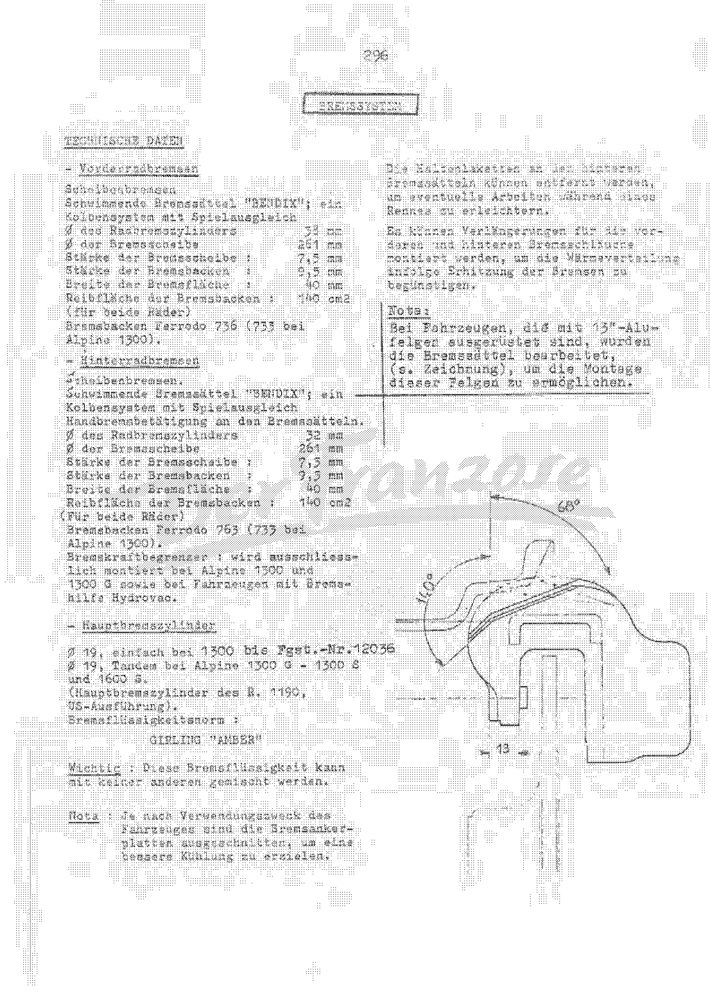
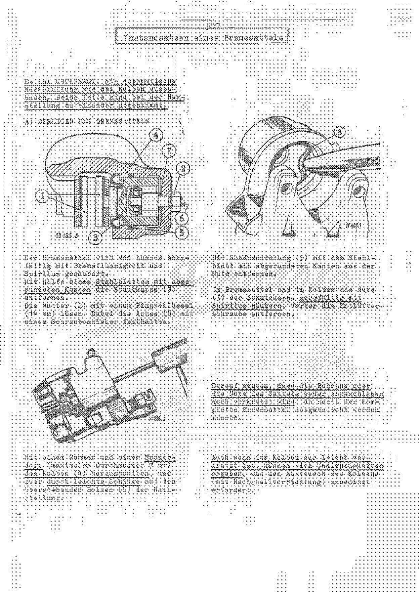
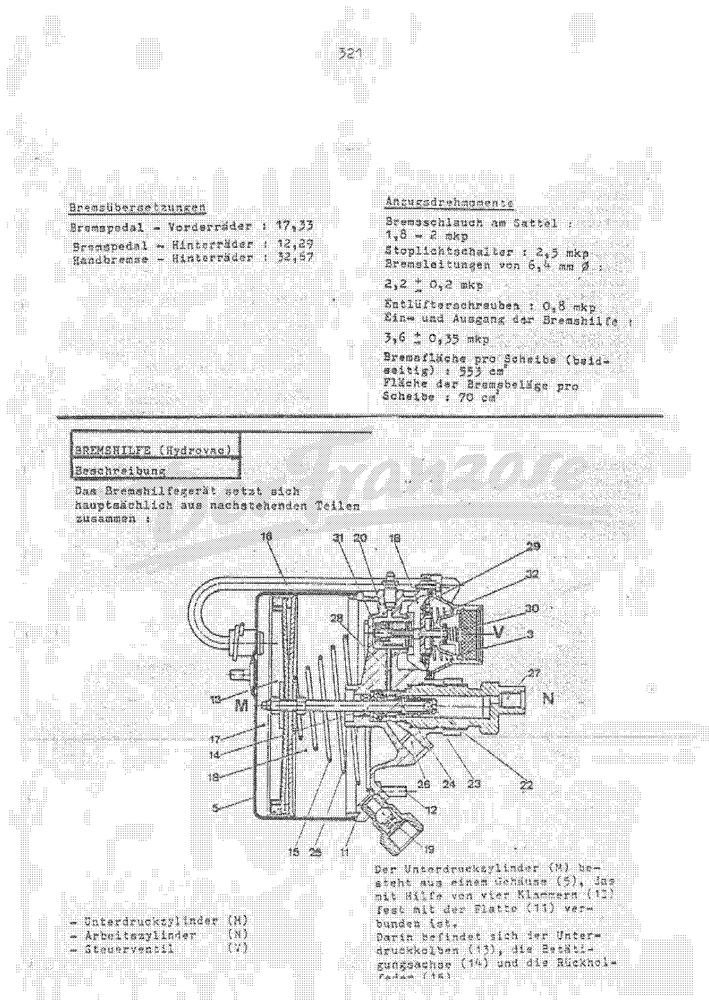

<!-- SOURCE NOTE: PDF pages 287-319 of alpine-a110-reparaturhandbuch.pdf (printed pages 295-327).
Translated from the German original; prose is English, every value is as printed, decimal
separators normalized to the English convention (Rule 13): the page prints "7,5 mm", this wiki
writes "7.5 mm". No unit is converted: torques stay in "mkg" / "mkp" exactly as each page prints
them, pressures in kg/cm², vacuum in mm of mercury.
SAFETY-CRITICAL CHAPTER: every disc, pad, bore, torque, pressure, clearance and fluid value was
read from the rendered page image (200 dpi) and from 350-600 dpi crops of prepared.pdf, not from
the OCR. All pages 287-319 were read from images.
Scan defects: p.287 has the facing page bleeding through in mirror image; pp.297, 298, 309, 317
show faint neighbouring-sheet fragments at the margins; the "DerFranzose" watermark crosses every
page. Several boxed notes (pp.295, 301, 303, 309) are in a different typeface from the body — later
typed insertions into the sheet, not handwriting. No handwritten annotations found in this range.
PAGE ORDER: p.317 (printed 325) is the conclusion of the leak test on p.318 (printed 326); kept in
PDF order and cross-linked.
The Hydrovac section (pp.311-319) shows a Renault four-door saloon in its general-arrangement
drawing and appears to be taken from a Renault saloon manual. -->

# Braking system (all types)

**[PDF p.287]**

Section title page ("BREMSSYSTEM") with a perspective drawing of a front brake caliper and its
hose on the hub carrier (figure 62536-2). No values.

<!-- NEEDS REVIEW: scan defect — the facing page (PDF p.288) shows through this title page in
mirror image. The bleed-through is not transcribed here. -->

**[PDF p.288]**

## Technical data

### Front brakes

Disc brakes. Floating calipers, **"BENDIX"**; single-piston system with automatic clearance
take-up.

| Item | Value |
|---|---|
| Wheel cylinder (caliper piston) ⌀ | 38 mm |
| Brake disc ⌀ | 261 mm |
| Brake disc thickness | 7.5 mm |
| Brake pad thickness | 9.5 mm |
| Width of the braking surface | 40 mm |
| Friction area of the pads (both wheels) | 140 cm² |
| Brake pads | Ferodo 736 (733 on the Alpine 1300) |

<!-- NEEDS REVIEW: SAFETY-RELEVANT. OCR read the front wheel cylinder diameter as "33 mm"; the
page image at 600 dpi clearly shows "38 mm" — corrected from image. Disc ⌀ 261, disc thickness
7,5, pad thickness 9,5, width 40, area 140 are crisp on the image. The pad make is printed
"Ferrodo" (sic) — rendered Ferodo; the grade numbers are as printed. -->

<!-- NEEDS REVIEW: SAFETY-RELEVANT. "Stärke der Bremsscheibe 7,5 mm" and "Stärke der
Bremsbacken 9,5 mm" carry no "new"/"minimum" qualifier on the page; they read as NOMINAL (new)
dimensions. "Bremsbacken" literally means brake shoes; on this disc-brake car the manual uses
it for the pad (backing plate plus lining) — rendered "brake pad". -->

### Rear brakes

Disc brakes. Floating calipers, **"BENDIX"**; single-piston system with automatic clearance
take-up. Handbrake actuation at the calipers.

| Item | Value |
|---|---|
| Wheel cylinder (caliper piston) ⌀ | 32 mm |
| Brake disc ⌀ | 261 mm |
| Brake disc thickness | 7.5 mm |
| Brake pad thickness | 9.5 mm |
| Width of the braking surface | 40 mm |
| Friction area of the pads (both wheels) | 140 cm² |
| Brake pads | Ferodo 763 (733 on the Alpine 1300) |

<!-- NEEDS REVIEW: front pads are printed "Ferrodo 736", rear "Ferrodo 763" — the two grade
numbers are digit-transpositions of each other. Both are crisp on the image and are reproduced
as printed; it may be a genuine front/rear grade difference or a typing slip in the source.
Verify against a parts list before ordering pads. -->

**Brake pressure limiter** ("Bremskraftbegrenzer"): fitted exclusively on the Alpine 1300 and
1300 G, and on vehicles with the Hydrovac brake servo.

<!-- NEEDS REVIEW: KEY-SETTINGS PLATE CROSS-CHECK (chapter 02, PDF p.13). SAFETY-RELEVANT.
This page gives NOMINAL (new) dimensions only — it gives no minimum disc thickness and no
minimum pad thickness of its own; it does not distinguish engine/type versions (it is the
1300-era data set, Ferodo 733 "on the Alpine 1300", 261 mm discs).
  - Disc: this page prints 7.5 mm new thickness, IDENTICAL front and rear. The plate prints a
    minimum of 6.5 mm (1300 VC) for BOTH front and rear. 7.5 new vs 6.5 minimum = 1 mm total
    wear allowance, which is self-consistent, and the identical front/rear figures here
    CORROBORATE the plate's suspicious identical front/rear disc rows for the 1300 VC column.
    (Note PDF p.291 also says A110 discs are 1 mm thicker than the R8/R8 Major's and must not be
    interchanged.) This chapter contains NO disc data for the 1600 VD/VH (the plate's 11 mm
    minimum) — that figure remains uncorroborated by this chapter.
  - Pads: this page prints 9.5 mm pad thickness front and rear; the plate's 1300 VC pad MAXIMUM
    is 9.5 mm front and rear — AGREES. The plate's 1300 VC pad MINIMUM 5.5 mm AGREES with PDF
    p.290 item 1 ("replace pads when backing plate with lining measures only 5,5 mm"), which is
    crisp on the image. The plate's 1600 VD/VH pad figures (min 7, max 16 front / 14 rear) have
    NO counterpart in this chapter — uncorroborated.
  - Fluid: this page prints GIRLING "AMBER" (see below); the plate prints SAE J 1703 or SAE 70 R
    3. These are DIFFERENT specifications — see the flag at the fluid line.
Also note: PDF p.291 forbids skimming (turning) discs outright, so the 6.5 mm minimum is a wear
limit, not a machining limit. -->

### Master cylinder

| Version | Master cylinder |
|---|---|
| 1300 up to chassis no. 12036 | ⌀ 19, single |
| Alpine 1300 G – 1300 S and 1600 S | ⌀ 19, tandem (master cylinder of the R. 1190, US version) |

<!-- NEEDS REVIEW: SAFETY-RELEVANT. "Ø 19" is printed with no unit (mm implied). Both "19"s and
the chassis number "12036" are crisp on the image. "Fgst.-Nr." = Fahrgestellnummer, rendered
"chassis no." -->

**Brake fluid specification:** GIRLING **"AMBER"**.

> **IMPORTANT:** this brake fluid must not be mixed with any other.

<!-- NEEDS REVIEW: SAFETY-RELEVANT. This page specifies Girling "Amber" fluid and forbids mixing
it with any other; the key-settings plate (chapter 02, PDF p.13) specifies SAE J 1703 or SAE 70
R 3. These DISAGREE. They are probably from different periods of production (the plate covers
the 1300 VC / 1600 VD / VH; this data page is 1300-era), but the source does not say so.
Do not mix fluids; identify what is in the system before topping up. -->

> **Note:** depending on the use of the vehicle, the brake anchor plates (dust shields) are cut
> away to obtain better cooling.

The retaining plates on the rear calipers can be removed to make any work during a race easier.

Extensions can be fitted to the front and rear brake hoses to assist the dissipation of heat
when the brakes get hot.

> **Note:** on vehicles fitted with 13" alloy wheels, the calipers have been machined (see
> drawing) to allow these wheels to be fitted.

The drawing shows the machined caliper corner: angles **68°** and **140°**, and dimension
**13** (unit not printed; mm implied).

<!-- NEEDS REVIEW: "Bremsankerplatten" rendered "brake anchor plates (dust shields)"; "Halteplaketten" rendered "retaining plates". The drawing's 68° / 140° / 13 are read from the image; which edge each angle is measured from is shown only on the drawing — read PDF p.288 before machining a caliper. -->

**[PDF p.289]**

## Operation of the braking system

**a) As soon as the braking system is pressurised** (the driver presses the brake pedal), the
pressure acts simultaneously on:

1. **The pistons of the wheel cylinders**, which press the pads against the brake discs.
2. **The base of the wheel cylinders.** The caliper is thereby displaced sideways and presses the
   second pad against the disc. The clamping force is therefore distributed equally over both
   pads, so that their wear is also equal.

Under the effect of the pressure exerted by the brake fluid and the sideways movement of the
brake piston, the rubber seal deforms.

**b) When the pressure in the braking system is released** (brake pedal let go), the piston can
move back sideways. This happens:

- through the pressure of the rubber seal, which returns to its original shape;
- through the rotation of the brake discs, which pushes the pads back.

To ensure correct braking of the vehicle in every situation, a very small clearance between pads
and discs is needed. For this the wheel cylinders are **fitted with an automatic adjusting
device**, which works as follows (figures 55 222.3, 55 223.3, 57 741, 57 740):

- **Brake applied:** the piston moves in the direction of the arrow and takes with it the spring
  ring **(1)**, which sits in its groove with a certain clearance, up to the stop **(B)**.
- **Brake released:** the piston moves in the direction of the arrow and takes the spring ring
  **(1)** with it up to the stop **(A)**.

**[PDF p.290]**

The clearance of the spring ring in its groove is chosen so that the piston, and therefore the
pads, can retract by a maximum of **0.7 to 0.8 mm**.

If the piston travel becomes greater than 0.7 to 0.8 mm through wear of the pads, the piston
shifts its position on the spring ring. This happens because the pressure of the brake fluid
exceeds the clamping force of the spring ring **(1)**. When the piston retracts, its travel is
automatically limited again to the original **0.7 to 0.8 mm**.

<!-- NEEDS REVIEW: the OCR reads the first occurrence as "0,7 bis 0,9 mm"; the page image shows
"0,7 bis 0,8 mm" in all three places (the first is underlined, which is what confused the OCR) —
corrected from image. -->

## Assembly instructions

The following must be observed without fail during assembly. The design of the disc brakes
demands particular care on some points. If these are not observed, the following can occur:

- abnormal pad wear;
- abnormal disc wear;
- poor braking;
- pads seizing.

1. **The pads must be replaced when the thickness of the pad (backing plate with lining) is only
   5.5 mm.**
2. **The pads must slide into the caliper bracket without binding.** Therefore, when fitting new
   pads or after an accident, always check that there is a total clearance of **0.15 to 0.30 mm**
   between the end faces of the pads (seen axially) and the caliper bracket.
3. **The piston nose carries a mark.** The cut face of the spring ring must line up with this
   mark. When fitting the piston into the cylinder, make sure that this mark lines up with the
   bleed screw. If this assembly instruction is not followed, it is impossible to bleed the
   braking system completely.
4. **The piston must be pushed into the cylinder by hand, without special tools.** Observe the
   following:
   - dip the piston and rubber seal in brake fluid before fitting;
   - observe the mark on the piston nose;
   - press the piston progressively into the cylinder with the thumb;
   - coat the end face of the piston with a little special grease (part no. 806 521);
   - insert the screw of the automatic adjusting device into the bore with a small screwdriver;
   - tighten the locknut.
5. When removing and refitting the caliper, the retaining split pins must be removed. On
   assembly make sure that they do not bind in their bores. **The use of a hammer or other
   striking tools is forbidden.** After inserting the split pins, spread them apart with a
   screwdriver. No striking tool may be used for this either, so that the caliper brackets are
   not distorted.

<!-- NEEDS REVIEW: SAFETY-RELEVANT. Pad replacement limit 5,5 mm and pad-to-bracket clearance
0,15 bis 0,30 mm are crisp on the 400 dpi crop. "Bremsträger" is rendered "caliper bracket"
throughout (literally "brake carrier"). The 5.5 mm limit applies to backing plate PLUS lining
("Stärke der Bremsbacken mit Belag"), not to the lining alone. It AGREES with the key-settings
plate's 1300 VC pad minimum (5.5 mm) — but the plate's 1600 VD/VH minimum is 7 mm, and this page
does not say which models its 5.5 mm applies to. -->

**[PDF p.291]**

6. For all work on the brake cylinder (replacing a seal, etc.) **only soft and rounded tools may
   be used.** The slightest damage to the cylinder (scratches, etc.) would cause leaks, and the
   complete caliper would have to be replaced.
7. **It is essential that a vehicle is fitted with pads of the same quality on all four
   wheels.** A column of figures stamped on the pads is made up of the part number and the pad
   quality. It is quite possible to use pads of a different quality when changing the pads on
   **all four wheels** — but then all the pads must be changed (only pads approved by us may be
   used).
8. **On assembly it is very important to centre the caliper bracket relative to the brake
   disc.** For this purpose thin steel shims are used between the caliper bracket and its
   mounting (at the front on the stub-axle carrier, at the rear on the axle tubes). The distance
   between the brake disc and the flanged edge of the caliper bracket must be
   **2.5 mm ± 0.5**. Outside this tolerance the position of the brake disc must be readjusted.
9. To change the pads, or for work on the brake discs, the caliper can be removed without
   disconnecting the brake lines (see
   [Removing and refitting a caliper](#removing-and-refitting-a-caliper)).
10. The pads are marked:
    - by a stamped letter;
    - by a colour stripe.

    In addition the caliper is marked on the outside with a colour stripe, from which the make of
    the pads can be identified without dismantling.

> **Note:** compared with the brake discs fitted to the R 1130, R 1131 and R 1132 (R 8, R 8
> Major), the discs of **all versions of the A 110 are 1 mm thicker**. Consequently thinner pads
> are used here, which must **not** be interchanged with those of the types named above. The
> same of course applies to the discs themselves.

> **Note — reworking the brake discs:** **Turning (skimming) the brake discs is strictly
> forbidden!** Every damaged brake disc (scoring, etc.) must be replaced with a new one.

<!-- NEEDS REVIEW: SAFETY-RELEVANT. "2,5 mm ± 0,5" — the ± sign is faint on the image (OCR read
"- 0,5"); read as ±, unit of the tolerance not printed (mm implied). "Achsschenkelträger"
rendered "stub-axle carrier"; "Achsrohre" rendered "axle tubes". -->

**[PDF p.292]**

## Fault-finding

The source prints this as a three-column table (Symptom | Cause — one or more together |
Remedy). Rendered per Rule 3 as a step/condition table: each row is one possible cause; check
them in order.

### Symptom: "creaking" — a dull noise, either when braking lightly in corners or when releasing the handbrake

| Step | Check (cause) | Remedy |
|---|---|---|
| a | Handbrake cable badly routed? | Align the cable and its clips (the cable must rest lightly on the rear axle struts). |
| b | Brake hose twisted? | Fit the hose normally (maximum twist 1/12 of a turn). |
| c | Pads swollen? | Replace the defective pads (per axle). |
| d | Pressure lugs of the clips oblique instead of perpendicular to the disc? | Straighten the fixing tabs of the clips and check the right angle to the disc (gauge Fre.16). |
| e | Calipers seating badly in the caliper bracket during braking? | Press the outer clips in towards the wheel centre by 0.2 to 0.4 mm. |
| f | Seats of the vibration dampers too small? | Check the caliper bracket and the caliper clips; replace damaged parts. |
| g | Heavy run-out of the brake disc (more than 0.3, measured at ⌀ 250)? | Replace the brake disc. |
| h | Vibration damper jammed in its seat? | Replace the vibration dampers. |

<!-- NEEDS REVIEW: SAFETY-RELEVANT. Disc run-out limit printed "mehr als 0,3 bei Ø 250
gemessen" with NO unit on either figure (mm implied: 0.3 mm run-out measured on a 250 mm
diameter). The watermark crosses this cell but "0,3" and "250" are legible on the image.
"Klammern" rendered "clips"; "Vibrationsdämpfer" kept literally as "vibration dampers" (the
anti-rattle bushes of the caliper). -->

### Symptom: "rattling" — due to excessive movement of the caliper on bad roads

| Step | Check (cause) | Remedy |
|---|---|---|
| 1 | Seats of the vibration dampers too large? | **Front axle:** replace the vibration dampers of 10 mm outside diameter with ones of 10.5 mm outside diameter. **Rear axle:** fit anti-noise springs on both wheels. |

**[PDF p.293]**

### Symptom: "squealing" — shrill noise when braking

| Step | Check (cause) | Remedy |
|---|---|---|
| 1 | Friction noise of the pads on the disc, especially with violent braking? | Generally difficult to eliminate, since all pads squeal more or less. |

### Symptom: long pedal travel

| Step | Check (cause) | Remedy |
|---|---|---|
| 1 | Air in the braking system? | Bleed. |
| 2 | Too much play at the master cylinder pushrod? | Readjust the play to obtain pedal free travel of less than 5 mm at the pedal. |

### Symptom: knocking noise when braking

| Step | Check (cause) | Remedy |
|---|---|---|
| 1 | End faces of the pads peened over, giving too much play in the caliper brackets? | Fit spacer shims between pads and caliper bracket. |

### Symptom: slight whistle at the start of braking, after parking in wet weather

| Step | Check (cause) | Remedy |
|---|---|---|
| 1 | Slight oxidation of the brake discs? | Stops by itself after the brakes have been applied. |

### Symptom: pulling to the right or left, with or without abnormal heating of the brakes

| Step | Check (cause) | Remedy |
|---|---|---|
| a | Piston sticking in the caliper cylinder? | Lubricate the piston, as described above, with special grease (part no. 806.521). |
| b | Pad swollen so that it binds in the caliper bracket? | Replace the pads and check that the total clearance between them and the caliper bracket is between 0.15 and 0.3 mm. |

### Symptom: poor braking effect

| Step | Check (cause) | Remedy |
|---|---|---|
| 1 | Brake disc contaminated (generally by grease)? | Rub down with emery paper and clean with trichloroethylene (disc and pads). |

<!-- NEEDS REVIEW: the special grease part number is printed "806 521" on PDF p.290 and
"806.521" here — same number, punctuation differs; both as printed. -->

**[PDF p.294]**

## Removing and refitting a caliper

> **Note:** for work on the pads (replacement) or on the brake discs, the calipers can be removed
> **without** disconnecting the brake hoses. Bleeding is then not needed on refitting. With the
> caliper removed, however, the brake pedal must **on no account** be pressed, or the piston
> would be pushed out.

### Removal

1. Raise the vehicle and remove the wheels.
2. Plug the outlet of the brake fluid reservoir.
3. Slightly slacken the brake hose at the caliper.
4. At the rear wheels, unhook the handbrake cable and free it from the adjusting screw with
   combination pliers.
5. Pull out the split pins of the two caliper clips.
6. Pull the two caliper clips up so that the caliper is free.
7. Collect the anti-noise rubbers.
8. Pull the caliper off towards the rear.
9. Remove the pads.
10. Disconnect the brake hose from the caliper.
11. Lay the caliper down.
12. Then clean the outside of the caliper carefully **with brake fluid or methylated spirit**.

<!-- NEEDS REVIEW: steps 3 and 10 disconnect the hose, which contradicts the Note's "without
disconnecting the brake hoses" — that is how the page reads: the Note describes the pad-change
shortcut, the numbered sequence the full removal. "Bremsausgleichbehälter" rendered "brake
fluid reservoir"; "Spiritus" rendered "methylated spirit"; "Geräuschdämpfergummis" rendered
"anti-noise rubbers". Figures 58591, 58592, 58593. -->

**[PDF p.295]**

### Refitting

1. Fit the pads into the caliper and mount the caliper in the caliper bracket.
2. Fit **new** vibration dampers (rubbers), inserting the lower one first.
3. To make fitting easier, pull the caliper slightly out of the caliper bracket and hold the
   caliper clips almost closed. Fit the vibration damper into its seat and check that it is not
   jammed.
4. Fit **new** split pins. They must go in easily — do not use a hammer or similar! Bend the ends
   of the split pins open slightly. Do not strike them, so as not to bend the caliper bracket.
5. If necessary, tighten the brake hose and check its position.
6. At the rear wheels, fit and adjust the handbrake.
7. If the brake hose was disconnected, the system must be bled.

**Check on refitting:**

- the centring of the caliper bracket relative to the brake disc;
- the end float of the pads in the caliper bracket: **0.15 – 0.30 mm**;
- the position of the caliper clips;
- the run-out of the brake discs;
- the cleanliness of the brake discs and pads.

<!-- NEEDS REVIEW: SAFETY-RELEVANT. The "0,15 - 0,30mm" figure on this page is typed in a
visibly different, larger typeface from the surrounding text (an insertion into the original
sheet, typed, not handwritten). It agrees with PDF pp.290 and 293. "Unwucht" literally means
"imbalance"; rendered "run-out" since that is what is checked on a disc (fault table, PDF
p.292). -->

> **Note:** the caliper clips can be replaced. To do so, drill out their pin from the outside,
> drive it out, fit a new pin and peen it over. Then align the pressure lugs of the clips.

### Brake hose positioning

If the brake hose is twisted:

1. Remove the clip **(C)** at the other end of the hose, after slackening the union bolt **(D)**.
2. Realign the brake hose.
3. Refit the clip **(C)**.
4. Tighten the bolt **(D)**.
5. Bleed the braking system.

> Twisted brake hoses result in calipers sitting askew, and therefore in noise. (Maximum
> permissible twist: 1/12 of a turn — fault table, PDF p.292.)

**[PDF p.296]**

## Bleeding with the brake pedal

Each wheel cylinder must be bled separately. Before carrying out this work, check the fluid level
in the brake fluid reservoir.

Begin with the wheel cylinder **farthest from the master cylinder, i.e. the right-hand rear
wheel**, and finish with the nearest.

1. Fit the bleed hose and the bleed spanner.
2. Dip the free end of the hose into a transparent container holding brake fluid.
3. Open the bleed screw **1/4 turn** and have a helper press the brake pedal **slowly** until no
   more bubbles are seen in the container.
4. Close the bleed screws while the brake pedal is fully down.

## Adjusting the handbrake

Figure 55587.2: locknut **(1)**, adjusting screw **(2)**, cam **(3)** of the operating lever.

1. Raise the vehicle.
2. Slacken the locknut **(1)** of the adjusting screw **(2)**.
3. Lubricate the adjusting screw **(2)** and the retaining eye with graphite grease.
4. Set the cam **(3)** of the operating lever so that it **lightly** touches the pad. To do so,
   tighten the adjusting screw **(2)** until the pad touches the brake disc.
5. Then slacken the adjusting screw **(2)** by **a little more than half a turn (max. 3/4 turn)**
   and lock the locknut **(1)**.
6. Operate the handbrake lever in the car so that the cable equalises at the relay lever. Check
   that the brake releases correctly.
7. The brake must "bite" as soon as the **5th or 6th notch** engages.

> **NOTE:** the tensioning sleeve on the operating linkage between the handbrake lever and the
> relay lever must not be altered. This linkage was set definitively at the factory.

<!-- NEEDS REVIEW: "Spannmuffe" rendered "tensioning sleeve"; "Umlenkhebel" rendered "relay
lever"; "Halterungsöse" rendered "retaining eye". -->

**[PDF p.297]**

## Freeing and lubricating seized pistons in the wheel cylinders

This operation is necessary when:

- the vehicle pulls to one side, especially after braking;
- one wheel overheats excessively.

### Removal

Remove the caliper without disconnecting the brake hose. The system therefore does not need to be
bled after refitting.

### Dismantling

Free the front caliper completely from the caliper bracket and remove the worn pads.

> **From this moment on the brake pedal must on no account be pressed.** (At the rear wheels, the
> handbrake cable must be released.)

### C/ Lubricating the piston

Clean the caliper and the dust cap carefully **with brake fluid or methylated spirit**.

a) Remove the dust cap **(A)** using a rounded steel blade.

Clean the end of the piston and the dust cap seat with methylated spirit. Let them air-dry and
check that there is no dirt between piston and cylinder.

b) Press the brake pedal lightly **so that the piston is pushed out by 3 to 4 mm**.

> **NOTE:** catch the piston travel with the tool **Fre.12A**, so that the piston is not pushed
> all the way out.

c) Apply special grease with a brush between the front face of the piston and the cylinder.

<!-- NEEDS REVIEW: the section letters on this page run "— ZERLEGEN" then "C/ SCHMIEREN DES
KOLBENS": the "A/" before "Ausbau" and "B/" before "Zerlegen" are not printed (or are lost),
so only "C/" survives — kept as printed. Step b) tells you to press the pedal, after the
dismantling note says the pedal must on no account be pressed: the latter applies until the
Fre.12A tool is in place. Scan defect: a neighbouring page shows through faintly in the
background of this page; not transcribed. Figures 57 398.1, 58598. -->

**[PDF p.298]**

### Refitting the piston (after lubrication)

1. Push the piston fully back with the tool **Fre.12 A** (figure 57409.1).
2. Repeat the operations described in paragraphs b and c.
3. Clean the dust cap with methylated spirit and refit it.
4. Set the automatic adjuster to **"0"** with the tool **Fre.12 A**.

> **NOTE:** the pistons must be lubricated on all four brake cylinders, but **one piston after
> the other**, so that no piston is pushed right out of its cylinder when the brake pedal is
> pressed. The brake hoses do not need to be disconnected for this.

### Additionally, on the rear brakes

Figure 57 406.1: locknut **(1)**, handbrake adjusting screw **(2)**, lever **(3)**, rubber
washer **(A)**, spring **(B)**.

1. Slacken the locknut **(1)** and unscrew the handbrake adjusting screw **(2)**.
2. Remove the lever **(3)** and the spring **B**, so that the rubber washer **A**, which sits
   between the lever and the caliper, can be removed.
3. Lubricate the adjusting screw together with the handbrake cable bracket.
4. Fit a new rubber washer **(A)** so that its rubber pip lies in the recess of the lever
   (figures 57407, 57408).
5. Fit the lever **(3)**, and put a few drops of brake fluid on the rubber washer so that it
   slides better.
6. Fit the spring **B**.

Refit the calipers.

<!-- NEEDS REVIEW: scan defect — a small fragment ("~2") of a neighbouring page shows at the
top right margin; not content. -->

**[PDF p.299]**

## Overhauling a caliper

> **It is FORBIDDEN to remove the automatic adjuster from the piston.** The two parts are matched
> to each other during manufacture.

### A) Dismantling the caliper

Caliper section, figure 55185.3: pads **(1)**, nut **(2)**, dust cap **(3)**, piston **(4)**,
square-section seal **(5)**, adjuster pin/spindle **(6)**, copper seal **(7)**.

<!-- NEEDS REVIEW: the key to items 1–7 is not printed as a legend; it is assembled from the
text of PDF pp.299–301 ("Mutter (2)", "Staubkappe (3)", "Kolben (4)", "Rundumdichtung (5)",
"Achse/Bolzen (6)", "Kupferdichtung (7)"). Item 1 (pads) is inferred from the drawing. -->

1. Clean the outside of the caliper carefully with brake fluid and methylated spirit.
2. Remove the dust cap **(3)** using a steel blade with rounded edges.
3. Slacken the nut **(2)** with a ring spanner (**14 mm**), holding the spindle **(6)** with a
   screwdriver.
4. With a hammer and a **bronze drift (maximum diameter 7 mm)**, drive out the piston **(4)**
   with light blows on the protruding pin **(6)** of the adjuster (figure 55 226.2).
5. Remove the square-section seal **(5)** from its groove with the round-edged steel blade
   (figure 57400.1).
6. Carefully clean the groove **(3)** of the dust cap in the caliper and on the piston with
   methylated spirit. First remove the bleed screw.

> Take care that the bore and the groove of the caliper are neither knocked nor scratched,
> otherwise the complete caliper would have to be replaced.
>
> Even if the piston is only lightly scratched, leaks can result, which makes replacement of
> the piston (with adjuster) absolutely necessary.

<!-- NEEDS REVIEW: "Rundumdichtung" rendered "square-section seal" (the piston seal in the
cylinder groove; literally "all-round seal"). Step 6 refers to "die Nute (3) der Schutzkappe" —
item 3 is the dust cap, so "groove (3)" means the dust-cap groove; kept as printed. -->

**[PDF p.300]**

### B) Assembling the caliper

1. Wet the cylinder bore and the groove with brake fluid, and fit a new square-section seal
   **(5)**, likewise dipped in brake fluid **to standard SAE 70 R1**.
2. Dip the new piston with adjuster in brake fluid and fit a new copper seal **(7)** on the
   threaded pin (figure 57 401.1).

> **VERY IMPORTANT!** On its end face on the pad side the piston carries a mark (electric
> scriber) which identifies the position of the gap of the circlip of the automatic adjuster
> **(A)** (figure 57402).
>
> When the piston is fitted into the cylinder, this mark must be aligned so that it lies **on
> one line with the axis of the bleed screw**. Otherwise correct bleeding is impossible, since
> air bubbles at the circlip could not escape properly. To bring the mark to the specified
> position, turn the piston with pliers (see figure 57403.1).

The piston must be inserted into the bore by hand. **Never drive the piston in or press it in
by force**, to avoid damaging the square-section seal **(5)**. Proceed as follows without fail:

- hold the piston **(4)** vertical with the copper seal **(7)** fitted, the thread of the pin
  **(6)** upwards;
- align the piston and the bore exactly;
- press the piston in slowly and evenly.

<!-- NEEDS REVIEW: SAFETY-RELEVANT. The fluid standard on this page is crisp on the image as
"SAE 70 R1". It differs from the key-settings plate (SAE J 1703 or SAE 70 R 3, chapter 02) and
from the technical data on PDF p.288 (Girling "Amber", not to be mixed). Three different
fluid designations in the book; reproduced as printed. -->

**[PDF p.301]**

3. Guide the pin of the automatic adjuster with a small screwdriver so that it engages in its
   seat (figure 57405.1).
4. Coat the wall of the piston on the pad side all round with special grease. Work the grease
   between piston and cylinder with a brush (figure 58 594).
5. The special grease can be ordered under **no. 806.521**.
6. Press the piston fully into the cylinder (figure 57404.1).
7. Turn the piston so that the mark forms a line with the bleed screw.
8. Hold the piston **(6)** with a screwdriver and lock the nut **(2)** to
   **1.5 mkg +0.25 / −0**.
9. Use a nut of normal thickness.
10. Fit a new dust cap **(3)**.

| Fastener | Torque |
|---|---|
| Caliper adjuster nut (2) | 1.5 mkg +0.25 / −0 |

<!-- NEEDS REVIEW: SAFETY-RELEVANT. Torque "1,5 mkg + 0,25 / - 0" is crisp on the 500 dpi crop.
The unit is printed "mkg" (= mkp, metre-kilogram-force), reproduced as printed, not converted.
The page writes "Den Kolben (6) ... festhalten" — but item (6) is the adjuster pin/spindle
(PDF p.299 holds "die Achse (6)" with a screwdriver while slackening the same nut); the
screwdriver holds the pin (6), not the piston (4). Source wording, kept. -->

> **The first calipers were fitted with flat (thin) nuts: replace these with nuts of normal
> thickness.**

To simplify bleeding later, fill the caliper with brake fluid (through the brake hose union
opening) (figure 57 399.1).

To let the air escape: remove the bleed screw, tilt the caliper alternately right and left,
refit the bleed screw and fit a new dust cap.

Screw the brake hose back on, using a new copper seal. The brake hose is only tightened after
the caliper has been finally fitted.

> **Open seized bleed screws with the utmost care:** because they are drilled hollow, they shear
> off with even slight force — and the caliper is then unusable. If the screw does not free with
> careful handling, proceed as follows:
>
> - remove the piston and all seals from the caliper;
> - put the caliper in boiling water for about **15 min** (alternatively an oven, **max. 200°**);
> - take the caliper out and hold the bleed screw under very cold water for about **15 s** —
>   do not let any cold water reach the caliper body;
> - immediately try to free the screw; repeat if necessary.

<!-- NEEDS REVIEW: "max.200°" — the unit after the degree sign is cut off at the right margin of
the scan (°C presumed). This boxed paragraph is in a different typeface from the rest of the
page (a later insertion, typed). -->

**[PDF p.302]**

## Removing and refitting the master cylinder

The page opens with a section of the single master cylinder showing the bottom valve **(7)** and
the pushrod clearance **(K)**, and three detail views **A**, **B**, **C** of the cup and valve.

### 1. Operation

**A/ Rest position:** the connecting port to the reservoir is open. Between piston and pushrod
there is a clearance **(K)**, corresponding to a pedal free travel of **5 mm** (detail A).

**B/ Braking position:** the primary cup is pushed forward, closes the compensating port and
forces the brake fluid through the bottom valve into the line (detail B).

**C/ Release position:** the primary cup is pushed back by the spring. This creates a depression
in the master cylinder, which draws the brake fluid back from the lines until the pressures are
equal (detail C).

> **VERY IMPORTANT:** the bottom valve **(7)** has **four small-diameter holes** through which
> the brake fluid can flow back in the release position. **When replacing the bottom valve,
> always check before fitting that these holes are present — otherwise the brakes would not
> release.**

<!-- NEEDS REVIEW: SAFETY-RELEVANT. Pedal free travel "5 mm" is crisp (underlined) and agrees
with the fault table on PDF p.293 ("less than 5 mm"). "Bodenventil" rendered "bottom valve"
(the residual-pressure / check valve at the outlet end); "Hauptbremsmanschette" rendered
"primary cup". -->

### Removal

> **Note:** the master cylinder is very difficult to reach:
> - from below;
> - from inside the car, through the pedal box;
> - from the left-hand wheel arch.
>
> Better — and also suitable for work on the steering:
> - remove the fuel tank;
> - cut a large opening in the curved polyester panel now exposed (the continuation of the
>   "bulkhead");
> - after finishing the work, bond the cut-out piece back in (see chapter
>   [Bodywork](18-body.md)).

1. Disconnect the battery.
2. Mark, disconnect and remove the stop-lamp switch wires.
3. Seal the outlets of the brake fluid reservoir.
4. Unscrew all the lines.
5. Slacken the fixing bolts and take out the master cylinder.

<!-- NEEDS REVIEW: "durch die Pedaller…" is cut off at the right margin of the scan — read as
"Pedalerie" (pedal box). "Spritzwand" rendered "bulkhead". -->

### Refitting

Carry out all removal operations in reverse order. Then **adjust the free travel** and **bleed
the brakes**.

Check that after the brake pedal is released:

- the four wheels turn freely;
- there is no residual pressure left in the lines.

**[PDF p.303]**

## Overhauling the single master cylinder

Exploded view 55 598.2 and section 55 210.2.

### Removal of parts

Remove:

1. the circlip **(1)**;
2. the thrust washer **(2)**;
3. the complete piston **(3)**;
4. the primary cup **(4)**;
5. the return spring **(5)**;
6. the bottom valve **(6)**.

Wash all parts in **95 % alcohol** or methylated spirit and check them for damage (scratches,
scoring, ovality, etc.). Always replace damaged parts.

Before fitting, dip all parts in brake fluid **SAE 70 R1**.

Check that the parts slide well in the piston [bore].

> **Note:** when replacing or dismantling a master cylinder, check whether an **aluminium
> spacer washer** is fitted on the piston crown. It must be refitted when the master cylinder is
> replaced. (Also valid for the tandem master cylinder.)

<!-- NEEDS REVIEW: "Prüfen, ob die Teile gut im Kolben gleiten" literally says "slide well in
the piston"; the sense is the cylinder bore — "[bore]" added. Bottom valve is item (7) on
PDF p.302 but item (6) on this page — different figures, each as printed. The boxed Note is in
a different typeface (a later insertion). -->

**[PDF p.304]**

## Overhauling the tandem master cylinder

(See the note on [the single master cylinder](#overhauling-the-single-master-cylinder) —
aluminium spacer washer.)

> The parts making up the primary and secondary pistons must **not** be dismantled. If one of
> these parts is damaged, the complete "primary piston" or "secondary piston" must be replaced.

1. Clamp the master cylinder in a vice fitted with soft jaws.
2. With a wooden drift, push the two pistons in by about **5 mm**, then slacken the stop screw
   **(1)**.
3. Keeping the pistons under light pressure, remove one after another from the cylinder:
   - the circlip **(2)**;
   - the stop washer **(3)**;
   - the primary piston **(4)**;
   - the secondary piston **(5)** (use compressed air to remove the pistons if necessary).
4. Check the inside wall of the master cylinder.
5. Clean the parts with methylated spirit, check them, and systematically replace every part
   showing signs of wear.
6. Before assembly, dip the parts in brake fluid **of the specified standard (see the marking on
   the reservoir cap)**.
7. Assemble the master cylinder.

<!-- NEEDS REVIEW: the page cross-refers to "Nota Seite 311" — printed page 311, which is PDF
p.303 (linked above). Figure numbers 74 4?5 1 and ?4 424 are only partly legible. -->

**[PDF p.305]**

## Removing the pedals with the master cylinder

### Removal

1. Remove the front gear-linkage tunnel.
2. Disconnect the battery.
3. Plug the outlet of the brake fluid reservoir.
4. Disconnect the feed line at the master cylinder.
5. Unhook the return springs of the pedals:
   - accelerator pedal;
   - brake pedal;
   - clutch pedal.
6. Mark and disconnect the stop-lamp switch wires.
7. Remove:
   - the stop-lamp switch;
   - the grease nipple of the pedal shaft;
   - the circlip of the pedal shaft;
   - the fixing bolt;
   - the pedal shaft.

   Note the spacer washers between the pedals.
8. Remove the pedal cover plate, the rubber covering and the floor felt.
9. Lift the pedals out upwards (figure 58 590.1).
10. Remove the pedal bracket after taking out its two fixing bolts.

<!-- NEEDS REVIEW: "Den vorderen G…stängetunnel" — one letter is lost in the scan; read as
"Gestängetunnel" (linkage tunnel). Figure 58589. -->

### Refitting

Carry out all removal operations in reverse order. Check the free travel of the pushrod at the
master cylinder and the free travel of the clutch pedal. Bleed the brakes.

**[PDF p.306]**

## Brake pressure proportioning valve

(Fitted only on the **1300 VC/G** and on vehicles with a brake servo.)

<!-- NEEDS REVIEW: "Bremskraftverteiler" rendered "brake pressure proportioning valve". The
technical data (PDF p.288) call the same device "Bremskraftbegrenzer" (pressure limiter) and
say it is fitted "exclusively on the Alpine 1300 and 1300 G, and on vehicles with Hydrovac";
this page says "1300VC/G". Both as printed. -->

### A/ Operation

**a) Normal braking** (figure 53370): under normal, light braking the valve does not come into
action. The passage of fluid to the rear wheel cylinders stays open.

**b) Heavy braking** (figure 53375): the pressure in the brake lines becomes very high. The valve
comes into action, i.e. it closes the lines to the rear wheel cylinders when the pressure
reaches:

| Valve identification | Cut-off pressure |
|---|---|
| White plug | 50 kg/cm² +8 / −0 |
| Yellow plug and yellow marking | 56 kg/cm² −0 / −6 |

This gives maximum braking effect at the front wheels.

<!-- NEEDS REVIEW: SAFETY-RELEVANT. Both cut-off pressures are crisp on the 500 dpi crops and
are reproduced exactly: white "50 kg/cm² + 8 / - 0" (i.e. 50 to 58), yellow "56 kg/cm² - 0 /
- 6" (i.e. 50 to 56). The yellow upper tolerance is printed with a minus sign ("- 0"), which
is the same as +0; kept as printed. -->

### B/ Removal

Figure 57464.

1. Disconnect the rigid lines **(1)**, **(2)** and **(3)** from the valve.
2. Remove the nut securing the valve to the rear axle cross-member.
3. Take out the valve.

> **NOTE:** the proportioning valve cannot be dismantled. If it is damaged or works badly (e.g.
> heavy braking of the rear wheels) or loses fluid, it must be replaced.

**Identification:** coloured plastic plug on the valve body. Calibration (setting) marked on a
hexagon at the valve inlet.

<!-- NEEDS REVIEW: "Tarierung auf einem Sechskant am Verteilereingang" rendered "calibration
marked on a hexagon at the valve inlet". -->

### C/ Refitting

Carry out all removal operations in reverse order. Bleed the braking system.

**[PDF p.307]**

## Removing and refitting a brake disc or an anchor plate — front

### Removal

1. Remove the caliper **without disconnecting the brake hose** (figure 58609).
2. Pull off the hub cap with the pliers **Rou.08**.
3. Remove the split pin and take off the hub nut with the thrust washer.

> **In every case the brake disc, hub and anchor plate must be removed together.**

4. Slacken the four nuts securing these parts to the stub axle and remove the parts (figure
   58610).
5. Collect the sheet-steel spacer shims between the anchor plate and the stub-axle flange.
6. Take out the outer hub bearing.

> **NOTE:** if the outer bearing is tight on the stub axle, pull the hub off with the puller
> **Rou.09 A** (figure 58611). Separate the anchor plate from the brake disc.

To pull the inner bearing off the stub axle, use the puller **B.Vi.28** with the claws
**B.Vi.48** and a spacer to protect the **16 mm** diameter thread (figure 58612).

<!-- NEEDS REVIEW: "Bremsankerplatte" / "Ankerplatte" rendered "anchor plate" (the plate that
carries the caliper bracket and dust shield); "Achsschenkel" rendered "stub axle". -->

**[PDF p.308]**

7. Remove the bolts joining the hub and the brake disc (figure 57460).
8. **Mark the position of the two parts relative to each other** and separate them with a
   bronze hammer.
9. Replace damaged parts.

### Refitting

1. Assemble the hub and brake disc, observing the marks made earlier. Tighten the nuts to
   **4.5 mkg ± 1**. Fill the hub with multi-purpose grease.
2. Fit the hub with brake disc and anchor plate to the stub axle (figure 58 613).
3. Fit the outer bearing.
4. Fit the thrust washer and run the hub nut down so that the bearings centre themselves.
5. Tighten the hub nut, then **slacken it by one-sixth of a turn and fit the split pin**.
6. Fill the hub cap **3/4** full with grease and fit it.

> **NOTE:** before locking the four nuts of the anchor plate on the stub-axle flange, the
> centring of the anchor plate must be checked.

**Torque of the fixing nuts: 2.5 mkg ± 0.5.**

| Fastener (front) | Torque |
|---|---|
| Hub-to-brake-disc nuts | 4.5 mkg ± 1 |
| Anchor plate fixing nuts on the stub-axle flange | 2.5 mkg ± 0.5 |
| Hub nut | tighten, then back off 1/6 turn and split-pin (no torque given) |

<!-- NEEDS REVIEW: SAFETY-RELEVANT. Both torques are in a faint typeface on this page; read from
the image as "4,5 mkg ± 1" and "2,5 mkg ± 0,5". The "± 1" tolerance is the fainter of the two
— verify against PDF p.308. The same pair of values is printed more clearly for the rear on
PDF p.310, which supports these readings. The page does not say how tight "festziehen" is for
the front hub nut before backing off. Centring of the anchor plate: see assembly instruction 8
on PDF p.291 (2.5 mm ± 0.5). -->

**[PDF p.309]**

## Removing and refitting a brake disc — rear

### Removal

> **In every case the hub, brake disc and anchor plate must be removed together.**

1. Release the handbrake cable.
2. Remove the caliper **without disconnecting the brake hose** (figure 58614).
3. Remove:
   - the nut securing the rear axle strut to the anchor plate;
   - the four nuts securing the anchor plate to the axle tube;
   - the three nuts securing the drive shaft to the axle tube.
4. Pull the assembly slightly away from the axle tube and mark the positions of the spacer
   shims.
5. Remove the hub together with brake disc, anchor plate and drive shaft.
6. Clamp these parts in a vice with the special holder **Rou.11** (figure 57423).
7. Unlock the hub nut and remove it with the conical washer.
8. Fit the puller **Rou.09 A** (figure 57 424).
9. Press out the drive shaft, tapping the three fixing bolts of the bearing flange lightly with a
   bronze hammer so that it frees.
10. Remove the anchor plate and the bearing flange.
11. Collect the four fixing bolts of the anchor plate.
12. **Mark the position of the brake disc on the hub.**
13. Remove the three fixing nuts and separate the two parts with a bronze hammer. Replace damaged
    parts.

> **NOTE:** squealing noises occurring at the rear hub at low speed are often due to too much
> play in the fit between wheel hub and drive shaft.
>
> **Check:** remove the wheel, unlock and slacken the hub nut, and collect the conical washer.
> If the hub can be moved on the drive shaft **even slightly**, the fit has too much play. If
> the wear is not too far advanced, the repair can be postponed a little by tightening the hub
> nut hard. But then the **drive shaft, wheel hub and wheel bearing must always be replaced
> together**, since the wear always occurs on all the parts equally! (See the drawing
> "Replacing the hub bearing" — [Rear axle](14-rear-axle.md).)

<!-- NEEDS REVIEW: scan defect — a stray character ("13"?) shows at the top-right margin; not
content. The NOTA box is in a different typeface (a later insertion). -->

**[PDF p.310]**

### Refitting

1. Assemble the brake disc and hub (**observe the marks made earlier**). Tighten the nuts to
   **4.5 mkg ± 1** (figure 58 615).
2. Offer up the hub, brake disc and bearing flange to the anchor plate — which has been fitted
   with the four bolts.
3. Coat the splined part of the drive shaft and the bearing with multi-purpose grease.
4. Press the drive shaft and the bearing into the hub with the press (**nylon cap of the bearing
   towards the gearbox**) (figure 58616).
5. Fit the conical washer and the hub nut with multi-purpose grease.
6. Lock the hub nut at **20 mkg** and then fit the split pin.
7. Coat the contact face of the axle tube with a little sealing compound.
8. Fit this complete assembly to the vehicle (figure 58617).
9. Lock the three nuts securing the drive shaft to the axle tube at **5 mkg ± 0.5**.
10. Before tightening the four nuts of the anchor plate, check that **the anchor plate is
    correctly centred relative to the brake disc**.
11. Tightening torque of the nuts: **2.5 mkg ± 0.5**.

| Fastener (rear) | Torque |
|---|---|
| Brake-disc-to-hub nuts | 4.5 mkg ± 1 |
| Rear hub nut | 20 mkg (then split pin) |
| Drive shaft bearing flange nuts on the axle tube (3) | 5 mkg ± 0.5 |
| Anchor plate nuts (4) | 2.5 mkg ± 0.5 |

<!-- NEEDS REVIEW: SAFETY-RELEVANT. All four torques read from the page image (400 dpi): "4,5 mkg
± 1", "20 mkg", "5 mkg ± 0,5", "2,5 mkg ± 0,5". Unit printed "mkg", not converted. The 20 mkg
rear hub nut has no tolerance printed. -->

**[PDF p.311]**

## "Hydrovac" brake servo

<!-- NEEDS REVIEW: the general-arrangement drawing on this page (figure 62682) shows a Renault
four-door SALOON, not an A110, and the Hydrovac section (PDF pp.311–319) appears to be taken
over from a Renault saloon manual. Its data (master cylinder ⌀ 22 mm, Girling "Amber" factory
fill, servo located at the "air box" and "wheel arch") may not match an A110 installation.
Use it with that in mind. -->

### Braking system with "Hydrovac" brake servo

Key to the general arrangement (figure 62682): brake discs **(1)**, pads **(2)**, caliper
brackets **(3)**, calipers **(4 or 5)**, reservoir **(6)**, master cylinder **(7)**, brake pedal
**(8)**, vacuum servo unit **(9)**, rigid brake lines **(10)**, brake hoses **(11)**, brake
pressure proportioning valve **(12)**, handbrake **(A)**.

- The handbrake **(A)** acts mechanically on the rear wheels. It has no effect on the hydraulic
  braking system.
- The braking effect is produced by friction between the brake discs **(1)**, which are fixed
  to the hub, and the pads **(2)**, which are held by the caliper bracket **(3)** and the calipers
  **(4 or 5)**.

The hydraulic braking system comprises:

- a reservoir **(6)**, connected to the master cylinder **(7)**;
- a master cylinder **(7)** with a bottom valve, so that no residual pressure remains in the
  braking system after braking. It is operated by the brake pedal **(8)** and is assisted by the
  vacuum unit **(9)**;
- rigid brake lines **(10)** and brake hoses **(11)**, which carry the fluid to each wheel
  cylinder;
- one caliper **(4 or 5)** per wheel, whose piston acts directly on one pad;
- a brake pressure proportioning valve **(12)**.

**[PDF p.312]**

### Technical data (Hydrovac system)

Connection diagram of the four-way union (figure 63 100):

| Port | Connection |
|---|---|
| a | Outlet to the four-way union |
| b | Inlet from the master cylinder |
| c | Vacuum from the engine inlet manifold |
| d | Outlet to the left-hand front caliper |
| e | Outlet to the right-hand front caliper |
| f | Outlet to the brake pressure proportioning valve |
| g | Inlet from the brake servo unit |

| Item | Value |
|---|---|
| Master cylinder ⌀ | 22 mm |
| Wheel cylinder ⌀, front | 38 mm |
| Wheel cylinder ⌀, rear | 32 mm |
| Brake disc ⌀ | 261 mm |
| Brake disc thickness | 7.5 mm |
| Pad width | 40 mm |
| Pad length, front and rear | 95 mm −0.15 / −0.25 |
| Pad thickness (including backing plate) | 9.5 mm +0 / +0.2 |
| Brake fluid level | 2 cm below the cap |

When the fluid level in the reservoir reaches the **"Mini"** mark, the warning lamp lights.

**Vacuum brake servo — lubrication of the vacuum cylinder:** Bendix-Vac oil, part no.
**8566 148**, approx. **35 cm³**.

Brake pressure proportioning valve with double effect. Brake hoses: A.T.E. "Teves". Dust shields
with ventilation openings.

<!-- NEEDS REVIEW: SAFETY-RELEVANT. Read from the 400 dpi crops: master cylinder "22 mm", wheel
cylinders "38 mm" / "32 mm", disc "261 mm" / "7,5 mm", pad width "40 mm", pad length "95 mm
- 0,15 / - 0,25", pad thickness "9,5 mm + 0 / + 0,2" — all crisp.
  - Master cylinder: 22 mm here vs ⌀ 19 on PDF p.288 (single and tandem). Different system
    (servo-assisted, possibly the Renault saloon this section comes from) — do not assume either
    applies to a given car without measuring.
  - Wheel cylinders 38 / 32 mm here AGREE with PDF p.288 (which confirms the image reading of
    "38" over the OCR's "33" there).
  - Disc 261 mm × 7.5 mm AGREES with PDF p.288; again NOMINAL, no minimum given.
  - KEY-SETTINGS PLATE CROSS-CHECK: pad thickness INCLUDING backing plate 9.5 mm (+0/+0.2) new
    AGREES with the plate's 1300 VC pad maximum 9.5 mm (front and rear). No 1600 VD/VH figures
    here.
"Abdeckbleche" rendered "dust shields". -->

### Brake fluid

**To standard SAE 70 R 3.**

The factory fill is **CASTROL "GIRLING Brake Fluid Amber"**. **Only this fluid may be used to top
up the reservoir.**

In addition, the following fluids are homologated:

- Freelub HD 3
- Lockeed HD 55
- NASIC FJ 3

> **Important precautions:** in an emergency, one of the three fluids named above may be used to
> top up the level. In that case the braking system must be drained **as soon as possible** and
> flushed with alcohol. To fill the system, one of the approved brake fluids must be used.

<!-- NEEDS REVIEW: SAFETY-RELEVANT. This page reconciles part of the fluid conflict: it names
the STANDARD as SAE 70 R 3 (matching the key-settings plate, chapter 02) and Girling Amber as
the factory fill (matching PDF p.288). But PDF pp.300 and 303 tell you to dip seals in fluid
"SAE 70 R1" — a different (older) standard — and the plate also allows SAE J 1703. "Lockeed"
(sic) and "NASIC" are as printed. -->

**[PDF p.313]**

### Brake ratios

| Ratio | Value |
|---|---|
| Brake pedal – front wheels | 17.33 |
| Brake pedal – rear wheels | 12.29 |
| Handbrake – rear wheels | 32.67 |

### Tightening torques

| Fastener | Torque |
|---|---|
| Brake hose at the caliper | 1.8 – 2 mkp |
| Stop-lamp switch | 2.5 mkp |
| Brake lines of 6.4 mm ⌀ (unions) | 2.2 ± 0.2 mkp |
| Bleed screws | 0.8 mkp |
| Brake servo inlet and outlet | 3.6 ± 0.35 mkp |

| Item | Value |
|---|---|
| Braking surface per disc (both sides) | 553 cm² |
| Pad area per disc | 70 cm² |

<!-- NEEDS REVIEW: SAFETY-RELEVANT. Torques and ratios read from the 350 dpi crop: "1,8 - 2 mkp",
"2,5 mkp", "2,2 ± 0,2 mkp", "0,8 mkp", "3,6 ± 0,35 mkp" — all crisp. Unit printed "mkp" here
(other pages print "mkg"); not converted. The "553 cm²" and "70 cm²" are less crisp (superscript
under the watermark). 70 cm² per disc × 2 = 140 cm², agreeing with PDF p.288's "140 cm² (both
wheels)". -->

### Brake servo (Hydrovac) — description

Section of the servo (figure, items 3–32). The servo is made up mainly of:

- the vacuum cylinder **(M)**;
- the slave (hydraulic) cylinder **(N)**;
- the control valve **(V)**.

The vacuum cylinder **(M)** consists of a housing **(5)**, which is firmly attached to the plate
**(11)** by four clips **(12)**. Inside it are the vacuum piston **(13)**, the operating rod
**(14)** and the return spring **(15)**.

**[PDF p.314]**

A pipe **(16)** connects the left-hand chamber **(17)** of the vacuum cylinder with the right-hand
side of the diaphragm **(29)** in the control valve **V**.

The right-hand chamber **(18)** of the vacuum cylinder is connected through a non-return valve
**(19)** to the vacuum line, and through a bore in the plate **(20)** to the left-hand side of
the diaphragm housing.

**In the slave cylinder (N)** is the piston **(22)**, in which slides the end of the operating
rod **(14)**, fitted with a valve **(23)**. Rod and piston are joined by a pin **(24)**. At the
transition from vacuum cylinder M to slave cylinder N, this rod **(14)** runs in the seal
**(25)**, air- and oil-tight. Brake fluid enters from the master cylinder through the bore
**(26)** and leaves to the wheel cylinders through the bore **(27)**. Through the bore **(28)**
the left-hand chamber of the slave cylinder **(22)** is connected to the piston **(31)** of the
control valve.

**The control valve V** comprises the piston **(31)**, the diaphragm **(29)**, the atmospheric
inlet valve **(30)**, the return spring **(32)** and the filter **(3)**.

<!-- NEEDS REVIEW: "die linke Kammer des Arbeitszylinders (22)" — (22) is the piston, not a
chamber; as printed. -->

### Maintenance

**The air filter must be cleaned every 15,000 km.** In very dusty areas, do this at shorter
intervals.

Proceed as follows (figure 62 869):

1. Remove the spring ring **(1)** and the perforated cover **(2)**.
2. Take out the filter element **(3)**, clean it with thinners and **let it air-dry** (if the
   element is too dirty, replace it).
3. Clean the element housing.
4. Refit the filter element, the perforated cover and the spring ring.

**The vacuum piston in the servo is lubricated every 15,000 km or every 6 months**, whichever
comes first — above all before winter, so that no deposits form that would seize the piston. Use
no lubricant other than **"Bendix-Vac"** (Renault part no. **8 566 148**).

Proceed as follows (figure 62687):

1. Remove the unit.
2. Remove the drain plug **(4)** **by hand** and empty the vacuum cylinder **(5)**.

**[PDF p.315]**

3. Set the unit horizontal.
4. Fill the cylinder with the special fluid; the filler plug serves as the level.
5. Refit the plug **(4)** **by hand**.
6. Refit the unit and bleed the complete braking system.

## Removing and refitting the brake servo unit

### Removal

Figures 60 682.1, 62686.1.

1. Stop the engine and press the brake several times until there is no more vacuum in the servo.
2. Plug the reservoir.
3. Remove the filler neck of the fuel tank.
4. Disconnect:
   - the connecting hose **(6)**;
   - the line from the master cylinder **(7)**;
   - the outlet line to the four-way union **(8)**.
5. Remove the two nuts **(9)** on the air box and the two bolts **(10)** on the wheel arch.
6. Take out the unit.

### Refitting

Carry out all removal operations in reverse order. Check the level of the vacuum-piston
lubricant.

> **NOTE:** if there is a fault, send the brake servo unit away for overhaul.

**[PDF p.316]**

## Brake servo — faults

| Step | Symptom | Possible cause |
|---|---|---|
| 1 | Pedal stiff | Pedal shaft seized |
| 1 | Pedal stiff | Grease or brake fluid on the pads |
| 1 | Pedal stiff | Servo unit not working — no vacuum, because of: blocked or disconnected lines; faults at the inlet manifold |
| 2 | Pedal goes to the floor (or nearly) | Leaks |
| 2 | Pedal goes to the floor (or nearly) | Air in the braking system |
| 2 | Pedal goes to the floor (or nearly) | Hose fabric expansion (hoses ballooning) |
| 2 | Pedal goes to the floor (or nearly) | Leaking cups in the master cylinder |
| 2 | Pedal goes to the floor (or nearly) | Leak at the servo unit |
| 3 | Brakes release badly | Insufficient pedal free travel |
| 3 | Brakes release badly | Compensating port in the master cylinder blocked |
| 3 | Brakes release badly | Brake pedal binding |
| 3 | Brakes release badly | Pistons binding in the wheel cylinders |
| 3 | Brakes release badly | Pads swollen |
| 3 | Brakes release badly | Handbrake badly adjusted |
| 3 | Brakes release badly | Faults at the servo unit: a) control valve piston sticking; b) non-return valve in the slave cylinder not opening; c) vacuum piston not returning |

The source table gives causes only (no remedy column).

**[PDF p.317]**

### Servo leak test — conclusion

Figures 60 682-2 and 62689 (servo in place): inlet line **(1)**, outlet **(2)**, vacuum line
**(3)**, cover **(4)**, line **(5)**, plate seal **(6)**, vacuum cylinder **(7)**, filter inlet
**(A)**.

The checks described under [Checking the braking system](#checking-the-braking-system) have
eliminated:

- the inlet manifold;
- the vacuum lines;
- the atmospheric-pressure inlet in the control valve;
- the non-return valve.

If the loss of vacuum persists, the servo unit must be removed and checked for leaks at:

- the cover seal **(4)** (see tightening of the screws);
- the connections of the line **(5)** at the front cover and at the vacuum cylinder **(7)**;
- the plate seal **(6)** between the plate and the vacuum cylinder **(7)**.

If these checks give no result, the servo unit must be sent away for checking.

<!-- NEEDS REVIEW: PAGE ORDER. This page (printed page 325) concludes the leak test whose steps
A–C are on the NEXT page, PDF p.318 (printed 326) — "the checks described above" refers forward
in PDF order. Transcribed in PDF order; read p.318 first. Scan defect: a row of dashes runs
down the left margin (edge of a neighbouring sheet); not content. -->

**[PDF p.318]**

## Checking the braking system

Faults in the braking system can come from the master cylinder, the wheel cylinders, the lines
or the inlet manifold. **The servo unit must therefore not be removed before you have
systematically checked the possible sources of the fault listed.**

### A — Preliminary checks on the braking system

Put the vehicle on a level surface, release the brakes, start the engine, accelerate the vehicle
to about **35 km/h** and brake hard; keep the pressure on the pedal.

| Step | Check | Result | Action |
|---|---|---|---|
| 1 | Is the pedal spongy? | Yes | Probably air in the system — bleed the braking system. |
| 2 | Can the pedal be pressed slowly to the floor? | Yes | There is a leak. Short-circuit the servo by connecting the feed line **(1)** to the outlet **(2)**; bleed the system. Press the pedal as before. If the pedal still sinks slowly, look for the leak in the system: check lines, unions, wheel cylinders and master cylinder. Eliminate leaks before other checks. |
| 3 | — | — | Reconnect the lines to the servo and bleed the complete system again. |
| 4 | Stop the engine, pump the brake until there is no vacuum left in the unit. Release the pedal, press it again, hold it firmly and start the engine with the vehicle stationary. Does the pedal go further down? | Yes | Vacuum system in order. |
| 4 | (as above) | No | Go to B. |

### B — Checking the inlet manifold and the vacuum lines to the servo

1. Disconnect the inlet line **(3)** at the unit and connect a vacuum gauge to this line.
2. Run the engine at idle and read the vacuum. **If the gauge shows less than 350 mm of mercury,
   the vacuum is insufficient.**
3. First check the sealing of the lines. If it is in order, look for the fault at the inlet
   manifold. If a measurement directly at the inlet manifold gives no better result, the engine
   must be overhauled.

### C — Checking the servo unit for leaks

1. Refit the vacuum line to the unit. Connect a vacuum gauge to the lubrication hole of the vacuum
   cylinder, **making sure the connection is airtight**.
2. Run the engine at idle for one minute, then stop it. **If the vacuum falls by more than 25 mm
   of mercury in 15 seconds**, there is a leak, which may be:
   - at the non-return valve;
   - at the atmospheric-pressure inlet in the control valve.
3. To localise the leak, **carefully cover the whole area of the filter inlet (A)** on the servo
   unit, then repeat the test. If the vacuum loss occurs again, the non-return valve may be
   defective.

Continued on [PDF p.317](#p317) (see the page-order note there).

<!-- NEEDS REVIEW: SAFETY-RELEVANT. "350 mm Quecksilbersäule" and "25 mm Quecksilbersäule in 15
Sekunden" and "ca. 35 km/h" are crisp on the image; units as printed (mm of mercury). The step
4 "No" branch is not printed — the page goes straight on to B; it is inferred from the
structure. -->

**[PDF p.319]**

## Replacing the brake pressure proportioning valve (servo-equipped vehicles)

Figure 62702: feed line **(1)**, lines to the rear wheel cylinders **(2)** and **(3)**, fixing
bolt **(B)**.

### Removal

1. Disconnect the feed line **(1)** and the two lines **(2)** and **(3)** to the rear wheel
   cylinders.
2. Remove the fixing bolt **(B)** of the valve. Take out the valve.
3. Remove the bracket fixed to the valve.

> **NOTE:** the proportioning valve must not be dismantled. If faulty, it must be replaced.

### Refitting

Remove one of the protective caps closing the outlets to the wheel cylinders and **fill** the
valve with brake fluid. Carry out all removal operations in reverse order. Bleed the braking
system.

## Complete bleeding of the braking system (with servo)

Figure 62703 (pressure bleeding equipment connected).

**Important notes:** this braking system is bled in the same way as on a vehicle without a
servo. **However, bleeding must be carried out with the engine stopped, beginning with the bleed
screw (A) of the servo unit, after pressing the brake pedal a few times so that no vacuum remains
in the unit.**

See also [Bleeding with the brake pedal](#bleeding-with-the-brake-pedal).

## Special tools used in this chapter

| Tool | Use |
|---|---|
| Fre.12 A | Holding/pushing back the caliper piston and setting the automatic adjuster to "0" |
| Fre.16 | Gauge for checking the clip lugs are square to the disc |
| Rou.08 | Hub cap pliers |
| Rou.09 A | Hub puller |
| Rou.11 | Special holder for clamping the rear hub assembly in a vice |
| B.Vi.28 | Puller for the front inner hub bearing |
| B.Vi.48 | Claws for B.Vi.28 |

## Next

[Electrical system](17-electrical.md).
