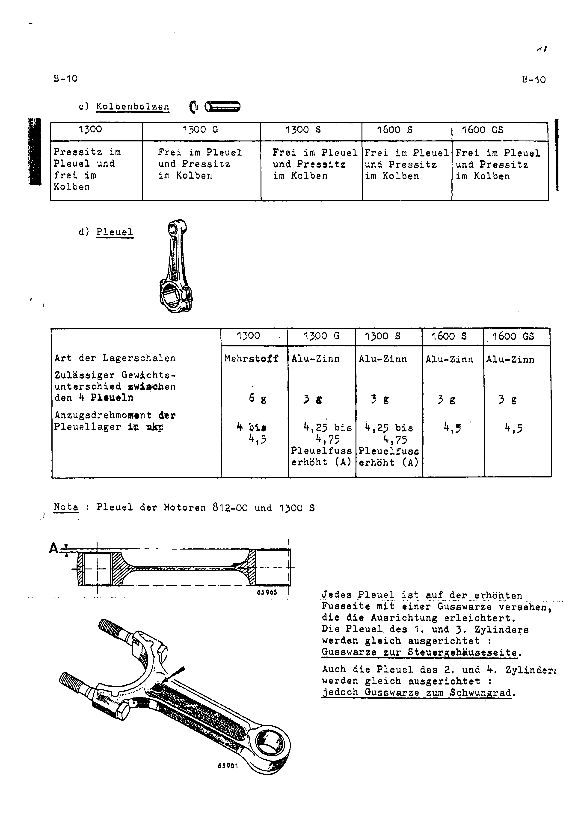
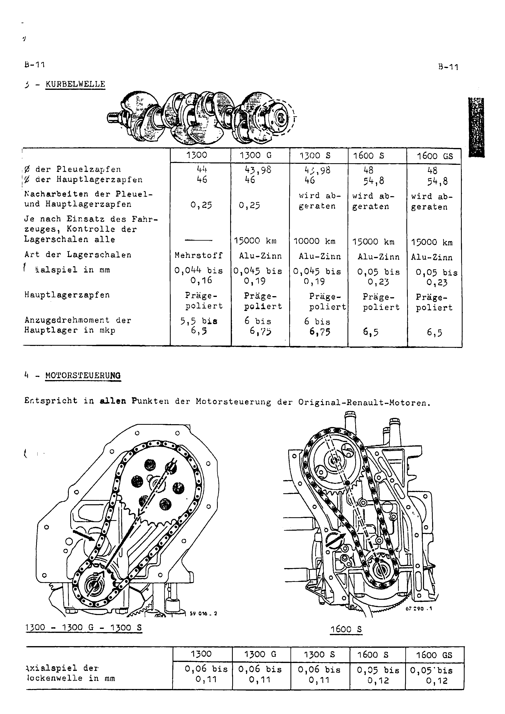
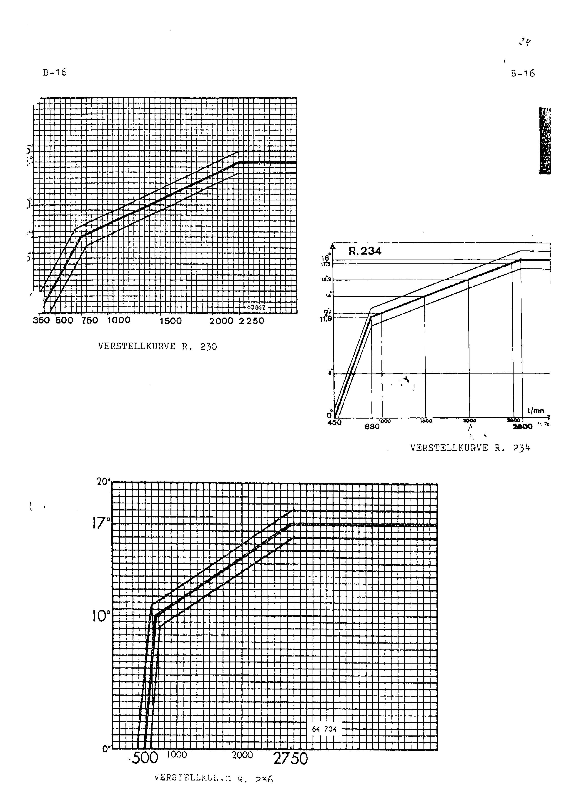

<!-- SOURCE NOTE: PDF pages 382-397, section B (B-2 to B-16) of the 1st-edition October 1970
factory repair manual. Translated from the German original; prose is English, every value is as
printed. Decimal separators are normalized to the English convention (Rule 13): the page prints
"0,044", this wiki writes "0.044"; "7.000 - 10.000 km" is written "7,000 - 10,000 km". Torque is
printed in mkp throughout this section and is NOT converted.
EVERY table in this section (B-2, B-6, B-7, B-9, B-10, B-11, B-12, B-14, B-15) was transcribed
from the page images rendered at 130-300 dpi, not from the OCR, which is badly damaged by the
"DerFranzose" watermark and the multi-column typewritten layout. This typewritten printing is
generally CLEAN on the image; where the OCR disagreed, the image was used.
This section duplicates data printed in the large Reparaturhandbuch (chapters 03, 04, 05, 06).
Agreements and disagreements with those chapters are recorded in flags; those chapters have not
been edited.
Scan notes: PDF p.382 is the section divider sheet. The left margin is clipped on PDF pp.390,
392 and 394 (first letters of some lines lost — no values affected). Small numbers at the top
corner of most pages ("12", "16", "18", "20" … "24") are HANDWRITTEN page counts added by an
owner and are not transcribed. Two "#" marks on PDF p.388 are probably handwritten — flagged
there. -->

# Section B — Engine and ignition

**[PDF p.382](../page-images/p0382.png)**

Section divider: **MOTOR – ZÜNDUNG** (Engine – ignition), tab **B**. No other content.

**[PDF p.383](../page-images/p0383.png)**

## B-2 — Engine: technical data

### 1/ General

| Vehicle type | 1300 | 1300 G | 1300 S | 1600 S | 1600 GS |
|---|---|---|---|---|---|
| Engine type | 810-30 | 812-00 | 1300 S | 807-25 | 1600 GS |
| Displacement | 1289 cm³ | 1255 cm³ | 1296 cm³ | 1565 cm³ | 1596 cm³ |
| Bore/stroke | 73 x 77 | 74.5 x 72 | 75.7 x 72 | 77 x 84 | 77.8 x 84 |
| Compression ratio | 9.4/1 | 10.5/1 | 12/1 | 10.25/1 | 11.5/1 |
| Maximum output SAE | 81 PS at 5900 rpm | 103 PS at 6750 rpm | 132 PS at 7200 rpm | 138 PS at 6000 rpm | 172 PS at 7000 rpm |
| Maximum output DIN | 74 PS | 88 PS | 116 PS | 110 PS | approx. 155 PS |
| Maximum torque in mkp | 10.5 at 3500 rpm | 11.9 at 5000 rpm | 12.4 at 4500 rpm | 14.7 at 5000 rpm | 18.4 at 6000 rpm |
| Intake valve opens before TDC | 20° | 31° | 50° | 40° | 53° |
| Intake valve closes after BDC | 80° | 61° | 91° | 72° | 83° |
| Exhaust valve opens before BDC | 55° | 62° | 74° | 72° | 83° |
| Exhaust valve closes after TDC | 42° | 26° | 54° | 40° | 53° |
| Recommended maximum speed (rpm) | 6300 | 6750 | 7000 | 6000 | 6500 |
| Maximum permissible speed (rpm) | 6500 | 7000 | 7500 | 6250 | 7000 |

<!-- NEEDS REVIEW: VALVE TIMING — THE TWO PRINTINGS AGREE. Read from the page image at 200 dpi,
every valve-timing cell on this page matches chapter 03 (PDF p.15) exactly: intake closes
80/61/91/72/83, exhaust opens 55/62/74/72/83, exhaust closes 42/26/54/40/53. The figures
"94/92" (intake closes, 1300 S / 1600 S) and "24" and "10" (exhaust opens / closes) in the raw
OCR of this page are OCR errors: the image clearly shows 91, 72, 74 and 40. The rest of the
table (bore/stroke, compression, outputs, torque, speeds) also agrees with chapter 03 cell for
cell. The OCR misread compression "9.4/1" as "Shy", "10.25/1" as "19,851" and the 1300 DIN output
as "zu ps" (image: 74 PS) — all corrected from the image. -->

<!-- NEEDS REVIEW: source error, not OCR — the 1300 S column prints "1300 S" in the ENGINE TYPE
row (a vehicle designation where an engine code belongs). Same in chapter 03. The engine is the
812-00 derivative (see B-3 c). -->

### 2/ Identification

Rectangular type plate on the cylinder block (RENAULT or ALPINE type plate).

> **NOTE:** the engine number and type given on this plate **must** be quoted on all spare part
> orders.

### 3/ Differences between the original RENAULT engine and the ALPINE engine

#### a) Type 810-30, derived from type 810-03 of the R. 1192

**Identical parts:** cylinder block; pistons and liners; crankshaft; valve gear
(*Motorsteuerung*); oil sump; valves.

**Modified or different parts:**

- Cylinder head: reworked valve seats; the seat faces of the intake and exhaust valve springs,
  and the spring caps for fitting the inner springs, likewise reworked; intake ports matched to
  those of the manifold; joint face ground down by **2.6 mm**.
- Intake and exhaust manifold of the RENAULT 8 S.
- **Valve cover ALPINE** (*Ventildeckel ALPINE*).
- Carburettor of the RENAULT 8 S.
- Water pump and cooling fan of the RENAULT 8 Gordini.
- Oil pump of the RENAULT 8 Gordini.
- Camshaft ALPINE.
- Clutch of the R. 1135 with the flywheel of the Estafette no. **8 331 975** for graphite release
  bearings.

**[PDF p.384](../page-images/p0384.png)**

## B-3 — Engine differences (continued) and operations

#### b) Type 812-00, corresponds to the engine of the RENAULT 8 Gordini

On request with a **4-litre aluminium oil sump**; when it is used, the oil pump is compensated
with a **13 mm** thick spacer plate.

#### c) Engine of the 1300 S, derived from type 812-00

**Identical parts:** cylinder block; crankshaft; clutch; carburettor.

**Modified or different parts:**

- Pistons and liners: 1296 cm³, ALPINE type.
- Oil pump extension, H = **13 mm**.
- Oil sump ALPINE.
- Camshaft **13 R** ALPINE.
- Stronger tension of the oil-pump valve spring (+ 1 washer of **1.2 mm**).
- Cylinder head gasket.
- Cylinder head: intake ports machined, polished and aligned; intake valves reworked by 5/10 to a
  ⌀ of **35 mm**, exhaust valves reworked by 4/10 to a ⌀ of **38.5 mm**.
- Oil pump rotor raised by **5 mm**.
- Weber carburettor **45 DCOE**.
- Aluminium oil sump ALPINE with a lower oil pick-up pipe height.

<!-- NEEDS REVIEW: "13 mm" (spacer plate and oil pump extension) and camshaft "13 R" are read from
the image at 300 dpi. The OCR read the spacer as "15 mm", and chapter 03 (PDF p.15) flags the
camshaft as "13 R" or "15 R". On this typewriter the 3 and 5 both have flat tops, but the glyph in
all three places matches the "3" in "35 mm" two lines below, not the "5" in "5/10". Read as 13.
Not fully certain — verify before ordering a camshaft by this code. -->

<!-- NEEDS REVIEW: VALVE DIAMETERS — this line is printed exactly as chapter 03 has it
(intake 35 mm, exhaust 38.5 mm) and the image is unambiguous, so it is the source's wording, not
an OCR error. It CONFLICTS with this manual's own B-7 table (PDF p.388), which gives the 1300 S
intake head diameter as "35 or 38.5" and the exhaust as 32.6. Read together, the 38.5 mm figure
is the alternative (reworked) INTAKE diameter; an exhaust valve of 38.5 mm is not supported
anywhere else. Kept as printed; use the B-7 table below, not this line. -->

<!-- NEEDS REVIEW: the 1300 S carburettor is given here as "Weber-Vergaser 45 DCOE", but the
carburettor table at B-14 (PDF p.395) of the SAME manual gives the 1300 S as "WEBER 40 DCOE 29
u. 30". The two pages contradict each other; both are kept as printed. -->

#### d) Type 807-25, derived from engine 807-01 of the R. 1151

This engine is already modified at the Renault works as follows:

- Additional dowel pin on the crankshaft.
- Reinforced connecting rods.
- Special pistons, gudgeon pins and piston rings.
- Special camshaft.
- Cylinder block reinforced at the bearing saddles.
- Specially machined timing cover, to accept a spacer plate for the mounting of the rear engine
  crossmember.
- **Aluminium valve cover ALPINE** (*Alu-Ventildeckel ALPINE*).
- Special cylinder head.
- Double valve springs.
- Intake valves ⌀ **42** with modified valve head; exhaust valves modified in shape.
- Intake and exhaust manifold ALPINE.
- Rocker arms (different heat treatment).

#### On request: 1600 GS engine, derived from type 807-25

- Special pistons and liners, bore **77.80** (displacement 1596 cm³).
- Cylinder head: alignment of the ports; inner and outer valve springs different; special spring
  caps (stepped).
- Special camshaft.

> **NOTE:** ALPINE reserves the right to make changes to this engine type according to the
> customer's wishes and the intended use of the vehicle (motor racing).

<!-- NEEDS REVIEW: lettering differs from chapter 03. This printing letters the 807-25 as "d)" and
leaves the 1600 GS unlettered ("Auf Wunsch …"); chapter 03 (PDF p.15) reports the 807-25 list
unlettered and the GS as d). The content of the lists is the same. -->

> **A note on "Ventildeckel ALPINE" / "Alu-Ventildeckel ALPINE".** These two items — printed
> clearly on the page image in B-2 (810-30 list) and B-3 (807-25 list) — are the **valve cover
> (rocker cover)** and the **aluminium valve cover**. An English edition of this manual renders
> this item as "scumbags", an evident mistranslation; the German original settles that the part
> meant is the ALPINE (aluminium) valve cover.

## II — Operations

### Removing the engine

All these engines are mounted in the rear of the vehicle on a crossmember of type **R.1135**.
Proceed as follows:

1. Drain the cooling system.
2. Disconnect:
   - the mechanical and electrical controls;
   - the water, fuel and oil hoses and lines;
   - on some models, the struts connecting the engine to the chassis or to the rear crossmember.

**[PDF p.385](../page-images/p0385.png)**

## B-4 — Removing the engine (continued)

3. Undo the bolts connecting the clutch housing and the cylinder block.
4. Remove the rear crossmember.
5. On the 1600 S the exhaust manifold, the alternator, the water pump pulley, the hoses at the
   water pump, the starter and the right-hand engine bearer on the chassis must also be removed.

> The front face of the cylinder head is more easily accessible if the cover plate on the rear
> bulkhead is removed.

6. Raise the rear of the vehicle to remove the engine downwards.

<!-- NEEDS REVIEW: chapter 03 (PDF p.16) adds a note after step 6 about vehicles "ab Bj.09/84".
That note does NOT appear in this October 1970 printing. -->

### Refitting the engine

Carry out the removal operations in reverse order. Before connecting the water and oil hoses,
make sure they are in good condition.

### Removing the power unit (*Antriebsgruppe*)

1. Drain the cooling system.
2. Disconnect the mechanical, electrical and hydraulic controls, and the water, oil and fuel
   hoses.
3. Release the gearbox crossmember from the chassis.

<!-- NEEDS REVIEW: this printing resolves the step that chapter 03 (PDF p.17) could not read:
step 1 of power-unit removal is printed here clearly as "Das Kühlsystem entleeren" (drain the
cooling system). It also differs at step 3: here "Die Getriebetraverse vom Fahrgestell lösen"
(release the GEARBOX crossmember from the chassis); chapter 03 has step 3 as undoing the clutch
housing to cylinder block bolts. Both kept as each page prints. -->

The page carries four photographs/drawings (engine-to-gearbox joint, figure 61 400; underside of
the crossmember; the bulkhead cover plate; the gearbox crossmember, figure 61 406). They carry
no values.

**[PDF p.386](../page-images/p0386.png)**

## B-5 — Removing the power unit (continued)

4. Release the tie rods (*Zugstreben*) connecting the power unit to the chassis.
5. Release the engine crossmember from the chassis.
6. Raise the rear of the vehicle sufficiently for the power unit to be taken out downwards.

> **NOTE:** on the 1600 S the crossmember is modified and reinforced.

7. Separate the engine from the gearbox.

Figure 61 407 shows the engine/gearbox assembly with arrows to the separation bolts.

### Refitting the power unit

Carry out the removal operations in reverse order.

- Fill with coolant and oil.
- Bleed the braking system.
- Check the alignment of the engine with the longitudinal axis of the vehicle.

**[PDF p.387](../page-images/p0387.png)**

## B-6 — Overhaul of the sub-assemblies: cylinder head

See also the relevant RENAULT repair manual:

| Vehicle | RENAULT manual |
|---|---|
| Alpine 1300 | MR 131 (R. 1192) |
| Alpine 1300 G and 1300 S | MR 133 (R. 1135) |
| Alpine 1600 S | MR 96 (R. 1151) |

### 1 — Cylinder head

| | 810-30 | 812-00 | 1300 S | 807-25 | 1600 GS |
|---|---|---|---|---|---|
| Head bolt torque, cold engine, in mkp | 5.5 to 6.5 | 7 to 7.75 | 7.5 then 8 | in two stages: 5.5 then 7.75 to 8.25 | in two stages: 5.5 then 7.75 to 8.25 |
| Head bolt torque, warm engine (50 min after switching off), in mkp | 6.5 | not provided for | not provided for | 8.5 to 9 | not provided for |
| Valve clearance, cold engine — intake | 0.20 | 0.20 | 0.25 | 0.20 | 0.25 |
| Valve clearance, cold engine — exhaust | 0.25 | 0.30 | 0.30 | 0.30 | 0.35 |
| Cylinder head height in mm | 71.80 | 73.0 | 72.4 or 72.6 | 93.5 | 93.5 |
| Maximum skim (*Abschleifmass*) in mm | 0.30 | 0.20 | 0.20 | 0.30 | 0.20 |
| Maximum distortion in mm | 0.05 | 0.05 | 0.05 | 0.05 | 0.05 |
| Combustion chamber volume in cm³ | 36 | 36 | 35 | 43 | 43 |
| Cylinder head gasket thickness\* | 15/10 | 15/10 | 10/10; 12/10 after skimming | 15/10 | 15/10 |

\* The thickness of the cylinder head gasket may vary according to version (footnote printed on
B-7).

<!-- NEEDS REVIEW: read from the image at 220 dpi; all cells are crisp. Cross-checks:
- 807-25 head torque (5.5 then 7.75-8.25 cold; 8.5-9 warm) AGREES with chapter 04 (PDF p.25) and
  the key-settings plate in chapter 02.
- 807-25 MAXIMUM SKIM: this table prints 0.30 mm for the 807-25. Chapter 04 (PDF p.29) prints
  "0.5 mm (0.3 mm)" and INFERS that 0.5 mm applies to 807/843/844 and 0.3 mm to the 810. This
  table contradicts that inference for the 807-25 (0.30 mm here). Not reconciled.
- 810-30 head height 71.80 and skim 0.30 agree with chapter 04's 810 column ("72 (71.80)", 0.3).
- 812-00 head height 73.0 and skim 0.20 agree with chapter 06 (PDF p.112: 73 mm, minimum 72.8).
- 810-30 head torque 5.5 to 6.5 cold / 6.5 warm DIFFERS from chapter 05 (PDF pp.66, 75:
  5.5-6 m.daN, cold or warm) and from the key-settings plate in chapter 02 (6 m·daN cold and
  warm, engine 810). Different units are printed (mkp here, m.daN there).
- VALVE CLEARANCES: 810-30 cold 0.20 / 0.25 here; the key-settings plate in chapter 02 gives
  engine 810 as 0.15 / 0.20 cold. 807-25 cold 0.20 / 0.30 here; the plate gives 807/843/844 as
  0.20 / 0.25 WARM. The plate is a later document covering later engine variants (810-05,
  843, 844); the figures are NOT interchangeable — use the one for your engine and condition. -->

#### Valve guides

| | 810-30 | 812-00 | 1300 S | 807-25 | 1600 GS |
|---|---|---|---|---|---|
| Inside diameter in mm | 7 | 7 | 7 | 8 | 8 |
| Outside diameter in mm, normal | 11 | 11 | 11 | 13 | 13 |
| Oversize with 1 groove (1st repair stage) | 11.10 | 11.10 | 11.10 | 13.10 | 13.10 |
| Oversize with 2 grooves (2nd repair stage) | 11.25 | 11.25 | 11.25 | 13.25 | 13.25 |

#### Valve seats

| Width of the seat faces in mm | 810-30 | 812-00 | 1300 S | 807-25 | 1600 GS |
|---|---|---|---|---|---|
| Intake | 1.1 to 1.4 | 1.7 | 1.7 | 1.5 to 1.8 | 1.5 to 1.8 |
| Exhaust | 1.4 to 1.7 | 1.5 | 1.5 | 1.7 to 2 | 1.7 to 2 |

<!-- 812-00 guide sizes (11 / 11.10 / 11.25) and seat widths (1.7 / 1.5) agree with chapter 06
(PDF pp.113, 114). -->

**[PDF p.388](../page-images/p0388.png)**

## B-7 — Valves, valve springs, tappets and pushrods

### Valves

| | 810-30 | 812-00 | 1300 S | 807-25 | 1600 GS |
|---|---|---|---|---|---|
| Valve head diameter in mm — intake | 33.5 | 35 | 35 or 38.5 | 42 | 42 |
| Valve head diameter in mm — exhaust | 30.0 | 32.6 | 32.6 | 35.35 | 35.35 |
| Valve stem diameter in mm — intake | 7 | 7 | 7 | 8 | 8 |
| Valve stem diameter in mm — exhaust | 7 | 7 | 7 | 8 | 8 |
| Seat angle | 45° | 45° | 45° | 45° | 45° |
| Valve lift in mm — intake | 8.4 | 8.94 | 10.2 | 10.1 | 10.1 |
| Valve lift in mm — exhaust | 8.4 | 8.43 | 10 | 10.1 | 10.1 |

<!-- NEEDS REVIEW: 1300 S VALVE-HEAD DIAMETERS, read from the image at 240 dpi: the intake cell
is printed on two lines, "35 oder / 38,5" — i.e. INTAKE 35 OR 38.5 mm — and the exhaust is
32.6 mm. So the belief "1300 S intake 38.5 / exhaust 32.6" is confirmed for the exhaust (32.6)
and for 38.5 being an INTAKE figure, but the page gives 35 mm as an equally valid intake size.
This bears on chapter 03's flag (PDF p.15/16): the 38.5 mm figure belongs to the intake, not the
exhaust; B-3 on PDF p.384 (and chapter 03) attaches it to the exhaust. The 812-00 column
(35 / 32.6) agrees with chapter 06 (PDF p.113). -->

### Valve springs

| | 810-30 | 812-00 | 1300 S | 807-25 | 1600 GS |
|---|---|---|---|---|---|
| Free length in mm — outer spring | 42.2 | 43 | 43 | 54.3 | 46 |
| Free length in mm — inner spring | 34 | 41.2 | 41.2 | 46.8 | 34.2 |
| Length in mm under load — outer spring | Type R.1170: 17.2 at 36 kg | Type R.1135: 18 at 44 kg | Type R.1135: 18 at 44 kg | Type R.1151: 13.8 at 52 kg | Type 1600 GS: 22.7 at 61 kg |
| Length in mm under load — inner spring | Type ALPINE: 18 at 17 kg | Type R.1135: 18.2 at 23 kg | Type R.1135: 18.2 at 23 kg | Type R.1171: 22.3 at 16 kg | Type 1600 GS: 16.7 at 17.5 kg |
| Wire diameter in mm — outer spring | 3.4 | 3.8 | 3.8 | 4.2 | 4.2 |
| Wire diameter in mm — inner spring | 2 | 2.7 | 2.7 | 2.6 | 2.6 |
| Inside diameter in mm — outer spring | 21.6 | 24.4 | 24.4 | 27.6 | 27.6 |
| Inside diameter in mm — inner spring | 12 | 17.3 | 17.3 | 19.8 | 19.8 |

<!-- NEEDS REVIEW: two "#" marks stand in front of the 812-00 free lengths ("# 43", "# 41,2").
They are in darker, irregular strokes unlike the typewriter face and are probably a HANDWRITTEN
owner annotation; not manual data and not transcribed. -->

<!-- NEEDS REVIEW: cross-check with chapter 06 (PDF p.113, 812 engine). This table supplies the
812-00 inner-spring data that chapter 06 lost to a clipped scan: free length 41.2 mm, wire
diameter 2.7 mm, inside diameter 17.3 mm (outer free length 43, wire 3.8, inside 24.4 agree).
The LOAD test points differ: chapter 06 prints outer spring "25 mm under 26 mkp" and inner
"23 under 13 mkp"; this table prints outer 18 at 44 kg and inner 18.2 at 23 kg. These may be two
different points on the same spring, but they are not the same figures — both kept as printed. -->

<!-- NEEDS REVIEW: 807-25 outer spring "13,8 bei 52 kg" — the "13,8" is legible but the 1 is
faint behind the watermark; the inner spring of the 807-25 is listed as type "R.1171" (not
R.1151 as the outer). Both as printed. -->

### Tappets (*Ventilstössel*)

| Diameter in mm | 810-30 | 812-00 | 1300 S | 807-25 | 1600 GS |
|---|---|---|---|---|---|
| Original size | 19 | 21 | 21 | 12 | 12 |
| Repair size | 19.2 | 21.2 | 21.2 | 12.20 | 12.20 |

### Pushrods (*Stösselstangen*)

| | 810-30 | 812-00 | 1300 S | 807-25 | 1600 GS |
|---|---|---|---|---|---|
| Length in mm — intake | 176 | 166 | 166 | 74.5 | 74.5 |
| Length in mm — exhaust | 176 | 189 | 189 | 105.5 | 105.5 |
| Diameter in mm | 5 | 5.5 | 5.5 | 6 | 6 |

### Dismantling — overhaul — assembly; replacing the cylinder head gasket

See the corresponding RENAULT repair manual:

| Vehicle | RENAULT manual |
|---|---|
| Alpine 1300 | MR 131 (R. 1192) |
| Alpine 1300 G – 1300 S | MR 133 (R. 1135) |
| Alpine 1600 S | MR 96 (R. 1151) |

**[PDF p.389](../page-images/p0389.png)**

## B-8 — Special features (*Besonderheiten*)

### 1300 S — fitting the cylinder head gasket

A cylinder head gasket that has been stored damp should be dried before fitting: place it for
about **20 min** in an oven heated to **150 °C**.

In an emergency a metal sheet is sufficient, on which the gasket is laid to avoid direct contact
with the flame of a stove; the temperature can be checked with a temperature probe.

Then apply **Hylomar SQ 32/M** to the joint faces of the cylinder block and cylinder head with a
stiff brush.

Before the vehicle is put into service, the cylinder head bolts must be retightened twice:

1. First to **7.5 mkp**, after letting the engine warm up at standstill for **30 min**.
2. Then let the engine cool down and tighten the bolts to **8 mkp**.

After **500 km** the cylinder head bolts must be tightened again to **8 mkp**.

<!-- NEEDS REVIEW: these figures match the 1300 S column of B-6 ("7.5 then 8" mkp, cold). Note
that the first retightening here is done after a 30-min warm-up, while B-6 states the 1300 S
has NO warm-engine figure ("nicht vorgesehen"). As printed. -->

### 1600 S — removing and refitting the cylinder head, or replacing the cylinder head gasket

To carry out this work properly, the engine must be removed.

It is possible to remove the cylinder head with the engine installed, but the free height below
the rear bulkhead does not allow the use of the centring tool **Mot. 451**. The front face of
the cylinder head is easily accessible if the cover plate on the rear bulkhead is removed.

The page shows tool **MOT 451** (parts 1, 2, 3; figure 09 628) and the cylinder block with the
gasket laid on (figure 60 951.1, parts 1 and 2). No legend for the part numbers is printed.

### 1600 GS

Depending on the use of the vehicle (racing), it is recommended to replace the **exhaust valves
every 7,000 - 10,000 km**.

**[PDF p.390](../page-images/p0390.png)**

## B-9 — Liners, pistons, con-rods

### a) Liners

| Version | 1300 | 1300 G | 1300 S | 1600 S | 1600 GS |
|---|---|---|---|---|---|
| Liner seat seal material | paper | paper | copper | paper | paper |
| Seat seal thickness — blue | 0.08 | 0.07 | 0.05 | 0.08 | 0.08 |
| Seat seal thickness — red | 0.10 | 0.09 | 0.07 | 0.10 | 0.10 |
| Seat seal thickness — green | 0.12 | — | 0.10 | 0.12 | 0.12 |
| Seat seal thickness — (fourth, unlabelled) | — | — | 0.12 | — | — |
| Liner protrusion | 0.04 to 0.11 | 0.05 to 0.12 | 0.15 to 0.20 | 0.10 to 0.15 | 0.10 to 0.15 |
| Inside diameter | 73 | 74.5 | 75.7 | 77 | 77.80 |

<!-- NEEDS REVIEW: the 1300 S column lists FOUR copper seal thicknesses against three colour
labels (blue/red/green); the colour of the fourth (0.12) is not printed. As printed. No unit is
printed in this table; mm is implied. -->

<!-- NEEDS REVIEW: LINER PROTRUSION disagrees with the key-settings plate in chapter 02 (PDF
p.13), which gives 0.04-0.12 mm for engine 810 and 0.15-0.20 mm for 807/843/844. This table
gives 0.04-0.11 for the 1300 (810-30) and 0.10-0.15 for the 1600 S (807-25). Chapter 04 (PDF
p.49) relies on the plate's 0.15-0.20 for the 807. The 0.15-0.20 figure appears here only for
the 1300 S. The 807-25 seal thicknesses (0.08 / 0.10 / 0.12, blue / red / green) agree with
chapter 04. Not reconciled — confirm for your engine before shimming liners. -->

Figure 62 356 shows the liner protrusion being measured with a dial gauge.

### b) Pistons

*(The piston is marked)* with an arrow, which must point to the flywheel side.

<!-- NEEDS REVIEW: the start of this sentence is clipped at the left margin of the scan; only
"…it einem Pfeil gekennzeichnet, der zur Schwungradseite zeigen muss" survives. -->

| Shape of the piston crown | 1300 | 1300 G | 1300 S | 1600 S | 1600 GS |
|---|---|---|---|---|---|
| | flat | domed with flat | domed with flat | domed with flat | domed with flat |

**[PDF p.391](../page-images/p0391.png)**

## B-10 — Gudgeon pins and con-rods

### c) Gudgeon pins

| 1300 | 1300 G | 1300 S | 1600 S | 1600 GS |
|---|---|---|---|---|
| Press fit in the con-rod and free in the piston | Free in the con-rod and press fit in the piston | Free in the con-rod and press fit in the piston | Free in the con-rod and press fit in the piston | Free in the con-rod and press fit in the piston |

<!-- Agrees with chapter 03 (PDF p.19). This printing has no gudgeon-pin diameter row. -->

### d) Con-rods

| | 1300 | 1300 G | 1300 S | 1600 S | 1600 GS |
|---|---|---|---|---|---|
| Type of bearing shells | multi-material (*Mehrstoff*) | alu-tin | alu-tin | alu-tin | alu-tin |
| Permissible weight difference between the 4 con-rods | 6 g | 3 g | 3 g | 3 g | 3 g |
| Big-end bearing tightening torque in mkp | 4 to 4.5 | 4.25 to 4.75 — con-rod foot raised (A) | 4.25 to 4.75 — con-rod foot raised (A) | 4.5 | 4.5 |

<!-- Agrees with chapter 03 (PDF p.19) cell for cell. The "(A)" that chapter 03 could not
identify is the dimension "A" on the sectional drawing directly below this table (figure 65 965):
it marks the height by which the con-rod foot (big-end face) is raised on one side. -->

> **NOTE:** con-rods of the 812-00 and 1300 S engines.

Each con-rod has a cast lug on the raised side of its foot, to make orientation easier.

- The con-rods of cylinders **1 and 3** are oriented the same way: **cast lug towards the timing
  cover side**.
- The con-rods of cylinders **2 and 4** are also oriented the same way, **but with the cast lug
  towards the flywheel**.

**[PDF p.392](../page-images/p0392.png)**

## B-11 — Crankshaft and valve gear

### 3 — Crankshaft

| | 1300 | 1300 G | 1300 S | 1600 S | 1600 GS |
|---|---|---|---|---|---|
| ⌀ of the big-end journals | 44 | 43.98 | 43.98 | 48 | 48 |
| ⌀ of the main bearing journals | 46 | 46 | 46 | 54.8 | 54.8 |
| Regrinding of big-end and main journals | 0.25 | 0.25 | not advised | not advised | not advised |
| Depending on vehicle use, check the bearing shells every | — | 15000 km | 10000 km | 15000 km | 15000 km |
| Type of bearing shells | multi-material | alu-tin | alu-tin | alu-tin | alu-tin |
| End float in mm | 0.044 to 0.16 | 0.045 to 0.19 | 0.045 to 0.19 | 0.05 to 0.23 | 0.05 to 0.23 |
| Main bearing journals | burnish-polished (*Prägepoliert*) | burnish-polished | burnish-polished | burnish-polished | burnish-polished |
| Main bearing tightening torque in mkp | 5.5 to 6.5 | 6 to 6.75 | 6 to 6.75 | 6.5 | 6.5 |

<!-- Agrees with chapter 03 (PDF p.20) cell for cell. This printing is crisp at 220 dpi and
SETTLES chapter 03's journal-diameter flag: the 1600 S / 1600 GS big-end journal is "48" (not 43)
and the 1300 G / 1300 S figure is "43,98" (not 45.98). The "End float" row label is clipped at
the left margin ("…ialspiel"); read as "Axialspiel". -->

### 4 — Valve gear (*Motorsteuerung*)

Corresponds in all respects to the valve gear of the original Renault engines.

The page shows the timing chain and sprocket marks for the **1300 – 1300 G – 1300 S** (figure
59 016-2) and for the **1600 S** (figure 67 290-1).

| Camshaft end float in mm | 1300 | 1300 G | 1300 S | 1600 S | 1600 GS |
|---|---|---|---|---|---|
| | 0.06 to 0.11 | 0.06 to 0.11 | 0.06 to 0.11 | 0.05 to 0.12 | 0.05 to 0.12 |

**[PDF p.393](../page-images/p0393.png)**

## B-12 — Lubrication and cooling system

### 5 — Lubrication

**Alpine 1300 G – 1300 S – 1600 S.** Oil cooler at the rear right on the 1600 S and the 1300 S
racing version, cooled by a fan on the 1600 S; and at the rear on the tail panel
(*Heckschürze*) on the 1300 S and 1300 G.

**Alpine 1300.** Modified ALPINE oil cooler behind the radiator of the cooling system; it is
cooled by the fan blade of the water pump.

| | 1300 | 1300 G | 1300 S | 1600 S | 1600 GS |
|---|---|---|---|---|---|
| Engine oil capacity | 3 or 4 l | 2.5 or 4 l | 4 l | 4 l | 4 l |
| Oil pump pressure, cold | 4 to 4.5 | 4 to 4.5 | 4.5 to 5 | 4 to 4.5 | 4 to 4.5 |
| Oil pump pressure, warm | 3.5 to 4 | 3.5 to 4 | 3 to 4 | 3.5 to 4 | 3.5 to 4 |
| Replace the oil filter element every | 10000 km | 10000 km | 5000 km | 10000 km | 5000 km |
| Oil change every | 2500 km | 2500 km | 2500 km | 2500 km | 2500 km |
| Recommended engine oil | Elf 20 W 40 | Elf 20 W 40 | Elf 20 W 40 | Elf prestigrade 20 W 50 | Elf prestigrade 20 W 50 |

> No additives of any kind are recommended — neither for the engine oil nor for the fuel.

<!-- NEEDS REVIEW: no pressure unit is printed. Otherwise agrees with chapter 03 (PDF p.21),
EXCEPT that chapter 03 has an extra row "At 4000 rpm, warm: 4 – 5" for the 1600 S and 1600 GS.
That row is NOT in this October 1970 printing. -->

### 6 — Cooling system

Hermetically sealed system with expansion tank.

**Capacity:** 9 litres of coolant on all versions with the radiator at the front; 6.5 to 7
litres on all versions with the radiator at the rear.

On vehicles with an aluminium radiator at the front, only a mixture of **50 % antifreeze and
50 % demineralised water**, or ready-mixed coolant (order no. **806 834** – 6-litre can, or
**806 835** – 8-litre can), may be used.

**Alpine 1300 G – 1300 S – 1600 S.** Front-mounted radiator with two fans, one of them switched
on by hand. On vehicles in racing version, a water box (*Wasserkasten*) replaces the expansion
tank.

**[PDF p.394](../page-images/p0394.png)**

## B-13 — Cooling (continued) and fuel supply

**Alpine 1300.** Radiator at the rear — version R. 1135 — cooled by a fan.

**Thermostat:** depending on the outside temperature and the use, 1 to 4 additional overflow
holes of **4.5** diameter were drilled ("winter" or "summer" thermostat).

<!-- NEEDS REVIEW: no unit is printed after "4,5 Durchmesser"; mm is implied. The first letters
of the lines on this page are clipped at the left margin ("…ühler hinten", "…ermostat",
"…berlaufbohrungen"); no values are affected. -->

### 7 — Fuel supply (*Kraftstoffversorgung*)

The page carries only illustrations: a downdraught twin-choke carburettor, a carburettor cover
and a twin-choke side-draught carburettor body. No values.

**[PDF p.395](../page-images/p0395.png)**

## B-14 — Carburettor data

| Vehicle version | 1300 (1st stage) | 1300 (2nd stage) | 1300 G | 1300 S | 1600 S | 1600 GS |
|---|---|---|---|---|---|---|
| Carburettor type | WEBER type 32 Dir. 4 | (same) | WEBER 40 DCOE 29 and 30, or 25 and 26 | WEBER 40 DCOE 29 and 30 | WEBER 45 DCOE 18-19, or 14, or 36-37, or 38-39 | WEBER 45 DCOE 18-19, or 14, or 36-37, or 38-39 |
| Choke (*Lufttrichter*) | 23 | 24 | 32 | 33 | 34 | 38 |
| Main jet (Gg) | 125 | 125 | 125 | 130 | 125 | 150 |
| Air correction jet (a) | 160 | 150 | 200 | 200 | 200 | 175 |
| Emulsion tube (*Mischrohr*) | — | — | F 15 | F 15 | F 15 | F 15 |
| Idle jet (g) | 50 | 60 | 45 F 8 | 45 F 8 (then 50 F 8 from MOT 1635) | 55 F 8 | 55 F 8 |
| Accelerator pump injector | — | — | 35 | 35 | 35 | 35 |
| Float weight | 11 g | | 23 g (26 g on 25/26) | 23 g | 23 g (26 g on 14) | 23 g (26 g on 14) |
| Float height in mm | 7 | | 5 (8.5 on 25/26) | 5 (8.5 on 25/26) | (8.5 on 14) | 5 (8.5 on 14) |
| Float travel in mm | 8 | | 11.5 | 11.5 | 15 | 15 |
| Air filter | R. 8 Lautrette | | ALPINE | ALPINE | ALPINE | ALPINE |

<!-- NEEDS REVIEW: read from the image at 240 dpi. (1) The 1600 S float-height cell prints only
"(8,5 auf 14)" — the leading "5" that the 1600 GS cell has is NOT printed for the 1600 S. It is
not supplied here; it is probably 5, by analogy with the GS, but that is not on the page.
(2) The 1300 float weight/height/travel and air filter are printed once across both stage
columns. (3) "MOT 1635" in the 1300 S idle-jet cell is read as an engine-number break ("from
engine no. 1635"), not a tool number — the abbreviation is as printed. (4) Weber jet/tube codes
are data and are copied exactly. -->

<!-- NEEDS REVIEW: the 1300 S carburettor (WEBER 40 DCOE here) contradicts B-3 on PDF p.384, which
lists "Weber-Vergaser 45 DCOE" among the 1300 S modifications. As printed on each page. -->

Clearance between the intake manifold and the carburettor: **1.2 to 1.3 mm**.

To adjust the float level and travel, see the carburettor chapter of RENAULT repair manual
**MR 96**.

> **On the 1600 S or GS:** never remove the mechanical fuel pump when an electric pump is used.

The figure (65 979) shows the top of a DCOE carburettor with items 1, 2, G1 and I marked; no
legend is printed for them.

**[PDF p.396](../page-images/p0396.png)**

## B-15 — Ignition: identification of the distributors

| | 1300 | 1300 G | 1300 S | 1600 S | 1600 GS |
|---|---|---|---|---|---|
| Ducellier distributor with tachometer connection | No. 4172 | 4189 | 4189 | 4266 | 4266 |
| Centrifugal advance curve | R. 236 | R. 230 | R. 230 | R. 234 | R. 234 |
| Vacuum advance curve | C. 34 | none | none | none | none |
| Ignition advance (*Vorzündung*) | 5° | 0 to 1° | 0° | 0° | 0° |
| Spark plugs — normal | Marchal 34S; Champion L 85 | Marchal H 33 RG | H 32 RG | Champion N 62 R | 2-32 H |
| Spark plugs — circuit racing (*Rundstrecke*) | — | H 32 RG | 2-32 H | or H 32 RG | Champion N 57 R |

<!-- NEEDS REVIEW: the 1600 S cell "oder H 32 RG" ("or H 32 RG") sits in the circuit-racing row
but begins with "or", so it may be an alternative to the normal-use Champion N 62 R rather than
a circuit plug. Layout as printed; meaning not settled. Spark-plug and distributor codes read at
300 dpi and are crisp. The key-settings plate in chapter 02 (a later document) gives the 1300 VC
curves as R 248 / C 34 and timing 0° ± 1°; this 1970 table gives R. 236 / C. 34 and 5° for the
1300. Different documents, different dates — not interchangeable. -->

> **IMPORTANT:** the prescribed spark plugs must always be used. Distributor **4266** must be
> provided with a notch for the orientation of the distributor cap.

**[PDF p.397](../page-images/p0397.png)**

## B-16 — Centrifugal advance curves

The page prints three advance curves (degrees against engine speed), each with a centre line and
tolerance band: **R. 230**, **R. 234** and **R. 236**. They are charts only and are delivered as
an image.

Axis labels legible on the scan:

| Curve | Speed-axis labels (rpm, as printed) | Advance-axis labels (as printed) |
|---|---|---|
| R. 230 | 350, 500, 750, 1000, 1500, 2000, 2250 | clipped at the left edge |
| R. 234 | 450, 880, 1000, 1800, 2000, 2800 *(and a smaller "3000"?)* ; axis "t/mn" | 0, 8°, 11.9, 12.1, 14, 15.9, 17.5, 18° |
| R. 236 | 500, 1000, 2000, 2750 | 0°, 10°, 17°, 20° |

<!-- NEEDS REVIEW: these labels are small and partly overprinted. On R. 230 the degree scale is
cut off at the left page edge and cannot be read. On R. 234 the last speed label is printed
twice in overlapping type ("2800" bold over a smaller figure, possibly "3000"); the degree labels
"12.1", "15.9" and "17.5" are tiny and uncertain. The breakpoints have NOT been transcribed as a
table, because reading them off the graph would be guessing. Use the image. -->

## Next

[Section C — Electrical equipment](23-fm-c-electrical.md).
