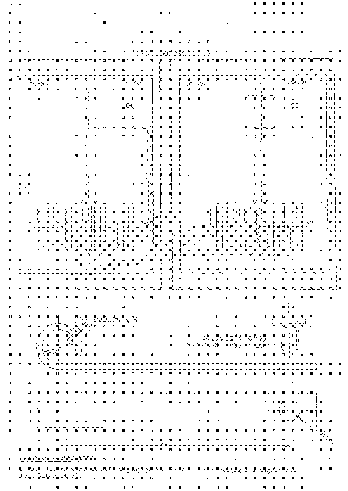

<!-- SOURCE NOTE: PDF pages 413-417, section H (H-1 to H-3 and an unnumbered drawing sheet) of the
1st-edition October 1970 factory repair manual. Translated from the German original; prose is
English, every value is as printed. Decimal separators are normalized to the English convention
(Rule 13): "1,30 m" is written "1.30 m", "9,5" is written "9.5". Angles are printed with ° and '
(minutes) and are NOT converted. PDF p.413 is the section divider. All settings, part numbers
and tool numbers were read from the page images at 130-300 dpi; the OCR misreads several of them
(camber "19 4O'" = 1° 40'; castor "8030'" = 8°30'; the measuring-flag tool "T.Av. Ihön" =
T.Av. 481; tool "T.Av. 3%" = T.Av. 34). PDF p.417 ("MESSFAHNE RENAULT 12") is a dimensioned
workshop drawing for a home-made bracket and modified measuring flags, delivered as an image. -->

# Section H — Front axle

**[PDF p.413]**

Section divider: **VORDERACHSE** (Front axle), tab **H**, with a drawing of the wishbones and
stub-axle carrier. No other content.

**[PDF p.414]**

## H-1 — Front axle: design and settings

Independent suspension using the components of the RENAULT 8 GORDINI:

- upper wishbone;
- lower wishbone;
- stub-axle carrier (*Achsschenkelträger*).

The mounting of the lower wishbone on the crossmember side has, however, been modified so as to
obtain **negative camber**: the mounting points were moved **9 mm outwards** (this applies only
to chassis from no. **2163**).

The two figures show the camber angle Cα with the dimension H (figure 59 208.1) and the
kingpin/castor angle Ch (figure 58 765.1).

### Settings (*Einstellwerte*)

| | Up to chassis no. 2162 | From chassis no. 2163 |
|---|---|---|
| Camber (*Sturz*) | 1° 40' positive | 1°30' negative |
| Castor (*Nachlauf*) | 9° ± 1 | 8°30' ± 30 with the more direct steering; 7°30' ± 30 with normal steering |
| Toe (*Spur*) | between 1 mm toe-out and 2 mm toe-in | 2 mm ± 1 toe-out, at half load |

<!-- NEEDS REVIEW: units of the ± tolerances are as printed — "9° ± 1" (degree implied) and
"± 30" (minutes implied, after a value in ° and '). Toe direction: "Nachspur" = toe-out,
"Vorspur" = toe-in, as in chapter 02.
CROSS-CHECK with the key-settings plate in chapter 02 (PDF p.13), a later document: it gives the
1300 VC camber as −2° ± 30', castor 7° 30' ± 30', toe 2 ± 1 mm toe-out, and the 1600 VD/VH castor
8° ± 30' with toe-IN. This 1970 page gives camber 1°30' negative (not −2°) for chassis from 2163,
and toe-OUT for all versions from 2163 regardless of steering. The two documents differ on camber
and on the toe direction for the 1600s; use the one for your car's date and chassis number. The
corresponding chapter of the large manual (13-front-axle.md) was still untranscribed when this
was written. -->

**[PDF p.415]**

## H-2 — Setting the front axle

With the setting gauge **FACOM U-70** or the optical measuring gauge **BEM**.

### 1./ Preliminary checks

(See **MR 101, booklet G-100**.)

- Check:
  - the tyre pressures;
  - the play of the joints, etc.;
  - the rim run-out (the **BEM** gauge can neutralise it).
- **Castor:** the castor must be the same on both sides; tolerance **± 1°** (the higher value
  should, if possible, be on the right).
- **Steering-box height (*Lenkgehäusehöhe*):** two different kinds of bracket are used:
  - brackets welded to the front crossmember;
  - brackets bolted to the front crossmember. These are supplied in three versions and differ by
    the distance between the centre of the steering mounting hole and the centre of the upper
    mounting hole on the crossmember:

| Bracket | Distance | Part no. |
|---|---|---|
| Standard bracket | 55 mm | 6000000557 |
| Raised bracket | 56 mm | 6000000351 |
| Raised bracket | 57 mm | 6000001352 |

The figures **56** and **57** are stamped on the rear face of the brackets.

<!-- NEEDS REVIEW: the two raised-bracket numbers break the pattern (…000351 vs …001352); both are
crisp on the image and are copied exactly. Section G-1 (PDF p.412) says the height is stamped on
every bracket including the 55 mm one; this page says only 56 and 57 are stamped. As printed. -->

The brackets determine the position of the rack ends relative to the track-rod ball pins, which
is designed so that the change in toe from half load to the unladen vehicle always tends towards
a **reduction of toe-out** (**0 to 2 mm toe-in per side** under these conditions).

The figure (63 256) shows tool **Dir. 326**.

### 2./ Checks and settings

a) Carry out the checks after a road test, or bounce the vehicle first.

b) Settle the vehicle on a level surface.

c) Check the camber.

d) Check the castor (a maximum difference of **1°** between right and left is permissible). If
   the difference exceeds 1°, the eccentric at the lower wishbone mounting must be adjusted
   accordingly.

e) Set the steering centre point: fit tool **Dir. 326** between the end face of the steering box
   and the rack nut on the pinion side. Lock the steering in this position with the clamping tool
   **T.Av. 34**.

f) Place the front wheels on turntables.

g) Lock the wheels with the pedal press.

**[PDF p.416]**

## H-3 — Setting the front axle (continued)

h) Bring the front axle to the **"half load"** position: fit tool **T.Av. 56 A** between the upper
   wishbone and the side member (*Längsholm*) (figure 60 362).

i) Fit the modified measuring flags **T.Av. 481** and the home-made brackets (see the figure at
   the end of the section). Alternatively, fit the support tube of tool **T.Av. 246** with a strap
   under the floor pan, at a distance of **1.30 m** from the centre of the front wheels
   (figure 59 209.1).

j) Depending on the tool used, aim the pointer or the light beam at the additional cross on the
   measuring flag, then release the front axle so that the pointer or light beam reaches the
   scale.

k) If the reading lies in the **hatched zone**, the steering height is correct.

l) If the reading lies outside the hatched zone, the position of the steering box on the
   crossmember must be changed — either by elongating the mounting holes of the box (with welded
   brackets) or by replacing the brackets with ones of **55 – 56 or 57 mm** hole spacing, as the
   case may be.

Investigations on the production line have shown that it is generally necessary to raise the
steering box on the **right-hand side**, by replacing the 55 mm bracket with a **56 mm** one.

> **NOTE:** if this work does not achieve the permissible tolerances for the change in toe from
> half load to the unladen vehicle, the individual parts of the front axle must be checked with
> the checking gauge (*Kontrollehre*).

m) Finally, set the front-wheel toe at half load and the toe distribution.

<!-- NEEDS REVIEW: the first step on this page OCRs as "n)"; on the image it is "h)", following
g) on PDF p.415. -->

### Removing – overhauling – refitting the front axle

See **MR 68** or **MR 131**.

**[PDF p.417]**

## Measuring flag RENAULT 12 (*Messfahne RENAULT 12*) — modified T.Av. 481 and bracket

This sheet is a dimensioned drawing of the left (*LINKS*) and right (*RECHTS*) measuring flags
**TAV 481**, and of a home-made bracket. It is delivered as an image.

Values legible on the drawing:

| Item | As printed |
|---|---|
| Scale markings, left flag (top / bottom) | 8, 10 / 9, 9.5, 11 |
| Scale markings, right flag (top / bottom) | 10, 8 / 11, 9, 7 |
| Height of the cross above line A (left flag) | 60 |
| Bracket: bolt | ⌀ 6 |
| Bracket: bend radius / hook | ⌀ 20 |
| Bracket: bolt ⌀ 10/125 | order no. 0855622200 |
| Bracket: hole | ⌀ 12 |
| Bracket: hole centre distance | 200 |

<!-- NEEDS REVIEW: the hatched (correct) zone on each flag lies between the scale lines labelled
around 9 to 10; the exact zone boundaries are a matter of reading the drawing — use the image.
"Schraube ⌀ 10/125" is read as an M10 x 1.25 bolt but is kept as printed. No units are printed;
mm is implied. -->

**Vehicle front side** (*Fahrzeug-Vorderseite*): this bracket is fitted at the mounting point for
the seat belts (from underneath).

## Special tools used in this section

| Tool | Use |
|---|---|
| FACOM U-70 | Front-axle setting gauge |
| BEM | Optical measuring gauge |
| Dir. 326 | Setting the steering centre point |
| T.Av. 34 | Clamping (locking) the steering |
| T.Av. 56 A | Half-load setting tool (between upper wishbone and side member) |
| T.Av. 246 | Support tube (alternative to the measuring flags) |
| T.Av. 481 | Measuring flags (modified) |

## Next

[Section J — Rear axle](28-fm-j-rear-axle.md).
