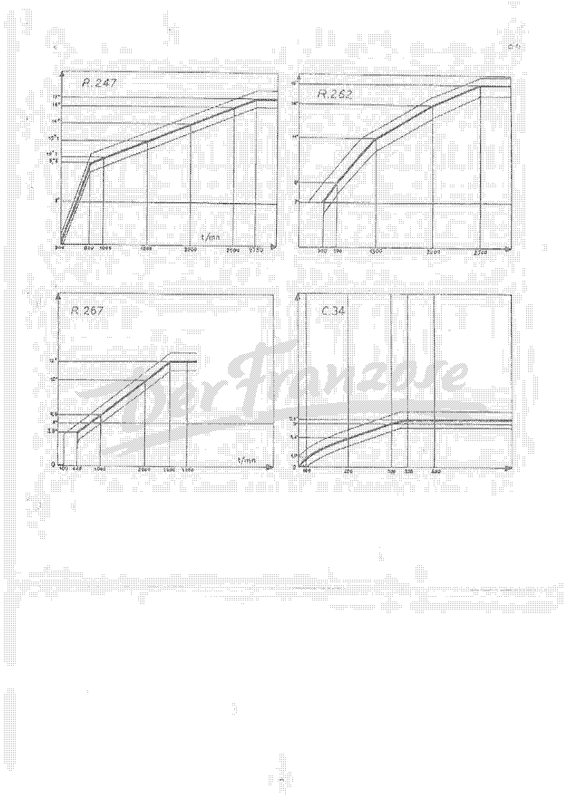
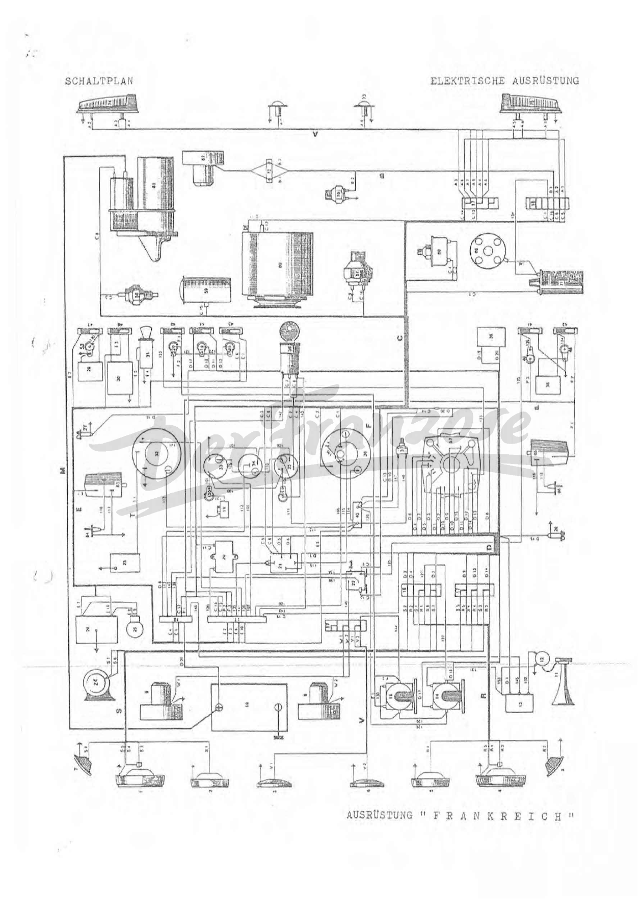

<!-- SOURCE NOTE: PDF pages 434-446 — the third bound document of the PDF, the Alpine A110 UPDATE
SUPPLEMENT ("ZUSATZ"). Translated from the German original; prose is English, every value is as
printed, decimal separators normalized to the English convention (Rule 13): "0,25 A" -> 0.25 A,
"8,5 mm" -> 8.5 mm; German thousands points -> commas ("12.249" -> 12,249). The printed text "11912"
(p.446) has no separator on the page and is kept as printed.
All pages were read from the page images. The cable directory, connections table and bulb table
(PDF pp.439-445) were transcribed cell by cell from the images; the OCR is badly wrong on several of
them (see flags). PDF pp.437-438 are drawings. PDF pp.439, 441-445 are landscape scans. A
"DerFranzose" watermark crosses every page. Some pages carry a small printed page number in a
corner — printed page numbers are not PDF page numbers and are not used here.
The supplement amends the sections of the 1st-edition factory manual (PDF 375-433, chapters
[21](21-fm-a-general.md) to [32](32-fm-r-special-tools.md)); each heading below names the section it
amends. Cross-checks against those chapters are given in flags; those chapters were not edited. -->

# Update supplement — general data, engine, ignition, electrical, clutch, gearbox, steering

**[PDF p.434]**

## Supplement title page

Title page of the supplement, in the same layout as the factory manual's title page:
**ALPINE RENAULT — Société des Automobiles ALPINE, 3, boulevard Foch, Epinay-Seine, 93 — FRANCE**
(works also at Dieppe, 76 — FRANCE).

**REPARATURHANDBUCH (repair manual), type A 110 — 1300 VA, 1300 VB, 1300 VC, 1600 VB, GS.**
**ZUSATZ (supplement) — January 1972.**

<!-- NEEDS REVIEW: the cover is dated "Januar 1972". The task brief and the supplement's own table
(p.450, "Ausgabe Dezember 1970") date its material from December 1970 onward; the cover date is
the date of this compiled edition, not of each amendment. Both dates are as printed. -->

> The repair methods prescribed by the manufacturer in this manual were compiled taking into
> account the technical specifications valid on the day of compilation. The repair methods may
> differ if the manufacturer changes various assemblies or parts of its production. All copyright
> belongs to the Société des Automobiles ALPINE. Reprinting or translation, even in extracts, of
> this document and the use of the spare-part numbers and numbering system are not permitted
> without the special written approval of the Société des Automobiles …

<!-- NEEDS REVIEW: the last line of the legal notice is cut off at the bottom edge of the page
("... der Société des"). Transcribed to where it ends. -->

The right-hand side lists the section tabs of the manual: A General (*Allgemeines*), B Engine —
ignition, C Electrical equipment, D Clutch, E Gearbox, G Steering, H Front axle, J Rear axle,
L Suspension — shock absorbers, M Brake system, N Body, and a further tab cut off at the bottom
edge (presumably R, special tools).

**[PDF p.435]**

## Chapter A — General vehicle data (amends [21](21-fm-a-general.md))

### Page A-3

**Paragraph 13 — Tyres and wheels.** Add: ALPINE 5" aluminium wheel, fitted as standard to
**1600 S** vehicles since **January 1971**.

**Paragraph 14 — Capacities.** Cooling and heating system: correct, for models with the radiator
mounted at the front: capacity **13 to 14 litres** instead of **9 litres**.

<!-- NEEDS REVIEW: SUPPLEMENT CHANGES A VALUE. Chapter 21 (page A-3 capacities) lists "Cooling and
heating system — 9 litres". This supplement corrects it to 13 to 14 litres for front-radiator
models. The same correction is printed again for B-12 below. Chapter 22 (B-12) still says 9
litres for the front radiator. The supplement is the later document. -->

## Chapter B — Engine (amends [22](22-fm-b-engine-ignition.md))

### Page B-2

On the ALPINE 1300 from engine type **810-30, no. 290** the inner valve springs are omitted.

### Page B-7

Inner valve springs of engine types **807-25**: it must read **type R.1151 instead of R.1171**; the
data given are correct.

Engine type **807-25 and 1600 GS**: correct the values given for the length of the pushrods
(*Stösselstangen*); it must read:

| Pushrod | Length |
|---|---|
| Intake (*Einlass*) | 178 mm |
| Exhaust (*Auslass*) | 110 mm |

<!-- NEEDS REVIEW: SUPPLEMENT CHANGES A VALUE. Chapter 22 (B-7, pushrods) prints the 807-25 and
1600 GS pushrod lengths as intake 74.5 and exhaust 105.5. This supplement says "correct" and gives
178 and 110. Both are printed as stated; the two documents disagree on both figures. The chapter 22
intake value "74.5" is not plausible next to an exhaust length of 105.5 (the 1300 S pushrods are
166/189), so it may itself be a misprint — not resolved here. The printed word is "Länge der
Stösselstangen"; the OCR "Ländern" (countries) is an OCR error, read from the image. -->

<!-- NEEDS REVIEW: the OCR read "R.i17?1" for "R.1171"; the page image shows "R.1171" clearly.
Chapter 22 (B-7) lists the 807-25 inner spring as R.1171 and the outer spring as R.1151; the
supplement says the inner spring is R.1151 instead. -->

### Page B-8

Add the address of the supplier of the sealant **HYLOMAR**: Etablissements BEAUCHAMPS,
96, rue George SAND, 37 — TOURS.

### Page B-10

Gudgeon pins: add the gudgeon pin diameter:

| 1300 | 1300 G | 1300 S | 1600 S | 1600 GS |
|---|---|---|---|---|
| Ø 20 | Ø 20 | Ø 20 | Ø 21 | Ø 21 |

<!-- NEEDS REVIEW: the OCR is unusable on this table; read from the image. Unit not printed
(presumably mm). Chapter 22 (B-10) has no gudgeon-pin diameter row, so this is an addition. -->

### Page B-12

**Paragraph 5** — add the engine oil pressure for ALPINE **1600 S and 1600 GS** at 4000 rpm and warm
engine: **4 to 5 kg/cm²**.

**Paragraph 6** — correct the capacity of the cooling and heating system on vehicles with the radiator
at the front: it must read **13 to 14 litres instead of 9 litres**.

<!-- NEEDS REVIEW: the unit is printed "kg/cm²" with the superscript overprinted by scan noise;
read from the image. -->

### Page B-13

Add: **"Winter" thermostat** = outside temperatures **below 15 °C**; **"Summer" thermostat** =
outside temperatures **above 15 °C**.

On the ALPINE **1600 GS, Group IV**, no thermostat is fitted.

**[PDF p.436]**

### Page B-14 — carburettor and fuel

**Engine 1600 S:** air correction jet **180 instead of 200**.

For carburettors of all types, state precisely:

| Float weight | Needle valve | Float height |
|---|---|---|
| 23 g | 150 | 5 mm |
| 26 g | 150 | 8.5 mm |

Correct: clearance between the intake manifold and the carburettor — depending on the depth of the
grooves for the all-round seal — **1.3 to 1.5 mm instead of 1.2 to 1.3 mm**.

**Engine 807-25 and 1600 GS — fuel pump:** add the static pressure with the pump not running:

| Static pressure | Value |
|---|---|
| minimum | 0.170 kg/cm² |
| maximum | 0.280 kg/cm² |

<!-- NEEDS REVIEW: SUPPLEMENT CHANGES VALUES. Chapter 22 (B-14, carburettor table PDF p.395):
air correction jet for the 1600 S = 200 (supplement: 180); manifold-to-carburettor clearance =
1.2 to 1.3 mm (supplement: 1.3 to 1.5 mm). Chapter 22 float table already lists 23 g/5 mm and
26 g/8.5 mm, so the float line is a clarification, not a change. The unit "kg/cm²" is overprinted
by scan noise on both pump-pressure lines; read from the image. -->

### Page B-15 — ignition

**Engines 1600 S and 1600 GS:** the distributor with tachometer connection, **type 4266 (curve
R.234)**, was replaced from model year 1971 by a distributor without tachometer connection,
**type 4311 (curve R.262)**, and later by the distributor of the **R.1173** vehicles, **type 4355
(curve R.267)**.

For the last-named distributor the ignition advance (*Vorzündung*) is **0 – 10 mm at the pulley
instead of 0 – 8 mm**.

> **Note:** the **5° mark** on the clutch housing corresponds to a piston position of **0.2 mm before
> TDC** (*o.T.*) and to a distance of **6 mm before the notch** on the crankshaft pulley.

**Engines 1300 G and 1300 S:** from model year 1971 a distributor without tachometer connection,
**type 4136 (curve R.230)**, is fitted.

**Engine 810-30 for ALPINE 1300:** from production number **12,249** a distributor **type 4245
(curves R.247 / C.34)** without tachometer connection is fitted.

<!-- NEEDS REVIEW: the OCR read "0 - 8 mm" correctly but garbled "R.1173" and "4245"; all
distributor type numbers and curve numbers were read from the image and are crisp. The curves
themselves are on the next page. Chapter 22 (B-15, PDF p.396) lists only 4172/4189/4266 with curves
R.236/R.230/R.234. The advance "0 - 10 mm at the pulley" is a distance on the crankshaft pulley,
not degrees; the 5° / 0.2 mm / 6 mm note is the only conversion the page gives. -->

## Chapter C — Electrical equipment (amends [23](23-fm-c-electrical.md))

### Page C-1

**Starter, 1600 S:** in addition, a **Paris-Rhône** starter, **type D8 E71**; it is to be preferred to
the Ducellier starter **type 6183**.

**Cooling fan:** instead of the cooling-fan motor no. **08 70 459 500** (belongs to **60 00 000 636**)
the motor no. **77 01 003 920** with **double polarity** is fitted. When carrying out repair work, pay
attention to the correct connections. This motor is supplied through a **12 volt relay, Cartier no.
08 55 608 100**.

<!-- NEEDS REVIEW: the OCR read the new motor number as "77 01 00% 920"; the image shows
"77 01 003 920". Chapter 23 (C-1, starter row) lists for the 1600 S "PARIS-RHONE 12 V D 8 E 75
(type R. 1190)" and Ducellier "6183 (type R. 1151)" — the supplement names the Paris-Rhône
type as D8 E71 (not E75): the two documents disagree on that suffix; both as printed. -->

**[PDF p.437]**

## Ignition advance curves R.247, R.262, R.267 and C.34 (amends B-15 / B-16)

The page prints four curves (advance in degrees against engine speed *t/mn*, i.e. rpm), each a centre
line inside a tolerance band: **R.247** and **C.34** (distributor 4245 for the 810-30), **R.262**
(distributor 4311) and **R.267** (distributor 4355). They are charts only and are delivered as an
image.

Tick labels legible on the scan (speed in rpm / advance in degrees, as read):

| Curve | Speed-axis labels | Advance-axis labels |
|---|---|---|
| R.247 | 500 (clipped), 840, 1000, 1500, 2000, 2500, 2750 | 5°, 9°5, 10°1, 12°1, 14°, 16°, 17° |
| R.262 | 300, 500, 1300, 2000, 2500 | 7°, 8°, 11°, 14°, 16° |
| R.267 | 100, 640, 1000, 2000, 1600, 3000 | 3.9°, 5°, 5.5°, 10°, 12° |
| C.34 | 100, 200, 300, 338, 400 | 1.1°, 3.4°, 5°, 5.3° |

<!-- NEEDS REVIEW: the labels are tiny, degraded and partly overprinted by the watermark. This is
a list of the legible tick labels only: the breakpoints (which speed goes with which angle) have
NOT been transcribed because reading them off the graph would be guessing. R.267: the speed labels
read "100, 640, 1000, 2000, 1600, 3000" in that order along the axis — "1600" sits between 2000 and
3000 in the print, so either the order or a digit is wrong; kept as read. C.34 is a vacuum-advance
curve, so its speed axis is probably vacuum or a different quantity, not rpm — the axis has no
legible title. Use the image. The page has a stray hand-written-style mark at the top right
("d.") — ignore. -->

**[PDF p.438]**

## Chapter C — Wiring diagram, electrical equipment (amends [23](23-fm-c-electrical.md))

**SCHALTPLAN ELEKTRISCHE AUSRÜSTUNG** (wiring diagram, electrical equipment) — **AUSRÜSTUNG
"FRANKREICH"** (equipment "France", i.e. the French-market version of the lighting and
signalling). The diagram is delivered as an image. Each component is marked with its number from the
component list on p.440; each wire carries its code from the cable directory on pp.439 and
441-442 and the connections table on pp.443-444 (letters A to W, numbers 01 to 148).

<!-- NEEDS REVIEW: the diagram is dense line art at about 200 dpi under a watermark. Wire codes
and component numbers are too small to be transcribed reliably from this scan and have not been
extracted; use the image together with the tables that follow. -->

**[PDF p.439]**

## Cable directory (*Kabelverzeichnis*) — harness key and harnesses A to C

Harness (*Kabelstrang*) letters:

| Letter | Harness |
|---|---|
| A | Rear-lighting harness |
| B | Rear fan harness |
| C | Main harness, rear |
| D | Harness of the combination switch and turn-signal switch |
| F | Fog-lamp harness |
| P | Left interior-light harness |
| R | Left headlamp harness |
| S | Right headlamp harness |
| T | Fuel-gauge sender harness |
| V | Harness for the fog-lamp power supply |
| W | Front fan harness |

<!-- NEEDS REVIEW: harness "E" (instrument panel, *Instrumententafel*) is used on p.441 but has no
line in this key, and the key's "T / V / W" descriptions do not agree with the headings used in
the table on p.442 (see the flag there). As printed. -->

How to read the tables: **Code** = wire number (*Kennzahl*); **Colour** (*Farbe*), translated;
**Ø** = wire size as printed ("12/10" etc., unit not printed — presumably tenths of a millimetre);
**Designation** (*Bezeichnung*) = from — to. "Klemmleiste" = terminal block; "Stromklemme ohne
Kontakt" / "Stromklemme mit Kontakt" = power terminal without / with contact (printed
literally; presumably unswitched / switched supply — the page does not say).

<!-- NEEDS REVIEW: Rule 13 translation — "Stromklemme ohne/mit Kontakt" rendered literally. Colours:
Lila = violet, Rosa = pink. A hyphenated colour ("Lila - grau") is a two-colour wire; rendered
"violet-grey". -->

### Harness A — rear lighting

| Code | Colour | Ø | Designation |
|---|---|---|---|
| A1 | Violet-grey | 12/10 | Turn signal left — terminal block |
| A2 | Brown-grey | 12/10 | Turn signal right — terminal block |
| A3 | Pink | 12/10 | Stop light right — terminal block |
| A4 | Yellow-red | 12/10 | Rear light right — terminal block |
| A5 | Yellow-red | 12/10 | Rear light left — terminal block |
| A6 | Pink | 12/10 | Stop light left — terminal block |
| A7 | Yellow-red | 12/10 | Number-plate lighting — terminal block |
| A8 | Yellow-red | 12/10 | Number-plate lighting — terminal block |

### Harness B — rear fan

| Code | Colour | Ø | Designation |
|---|---|---|---|
| B1 | Red | 16/10 | Power supply, rear fan — terminal block |
| B2 | Black | 16/10 | Fan — oil pressure switch ("mano") |

### Harness C — main harness, rear (continued on p.441)

| Code | Colour | Ø | Designation |
|---|---|---|---|
| C1 | Black-red | 12/10 | Tachometer — terminal block |
| C2 | Blue | 12/10 | Oil pressure switch |
| C3 | Brown-green | 12/10 | Temperature sender — temperature sender — tachometer |
| C4 | Grey | 12/10 | Oil pressure switch — oil-pressure warning lamp |
| C5 | Violet-red | 12/10 | Turn-signal relay — terminal block |
| C6 | Brown-red | 12/10 | Turn-signal relay — terminal block |
| C7 | Red-grey | 12/10 | Ignition coil — ignition switch |
| C8 | Grey | 20/10 | Starter — ignition switch |
| C9 | Brown | 16/10 | Temperature sender — relay, front fan |
| C10 | Red | 16/10 | Temperature sender — relay, front fan |

<!-- NEEDS REVIEW: B2 — "mano" is printed (French short form for manometer / pressure switch);
kept as printed. C2 has a single end listed ("Öldruckschalter"), as printed. C3 prints three
items ("Wärmefühler  Wärmefühler  Drehzahlmesser"): rendered as printed; the repeated sender is
probably a two-sender wire. "Wärmefühler" translated "temperature sender" (coolant temperature
sensor per the component list, items 58 and 67). The OCR of C3/C4 and of the colours "Lila-rot",
"Braun-rot" was checked against the image; the OCR missed C2's second line and printed C4's
"Grau" correctly. Ø of C8 is 20/10. -->

**[PDF p.440]**

## Component list (*Kennnummer* — designation) for the wiring diagram

| No. | Component | No. | Component |
|---|---|---|---|
| 1 | Headlamp, right | 51 | Yellow indicator lamp, high beam |
| 2 | High-beam headlamp, right | 52 | Yellow indicator lamp, fog lamps |
| 3 | Fog lamp, right | 53 | Green indicator lamp, right half of windscreen heating |
| 4 | Headlamp, left | 54 | Red indicator lamp, oil pressure |
| 5 | High-beam headlamp, left | 55 | Yellow indicator lamp, handbrake |
| 6 | Fog lamp, left | 56 | Ignition switch |
| 7 | Turn signal, right | 57 | Combination switch |
| 8 | Turn signal, left | 58 | Coolant temperature sender |
| 9 | Cooling fan, front | 59 | Electric fuel pump |
| 10 | Battery | 60 | Alternator (three-phase generator, *Drehstromlichtmaschine*) |
| 11 | Overland signal (*Überlandsignal*) | 61 | Starter |
| 12 | Compressor for the overland signal | 62 | Fan, rear |
| 13 | Relay for the overland signal | 63 | Interior light, right |
| 14 | Relay for the high-beam headlamps | 64 | Door contact, front right |
| 15 | Relay for the fog lamps | 65 | Interior light, left |
| 16 | Terminal block 6-5 | 66 | Door contact, front left |
| 17 | Terminal block 6-3 | 67 | Coolant temperature sender |
| 18 | Terminal block 6-6 | 68 | Distributor |
| 19 | Handbrake contact | 69 | Oil pressure switch |
| 20 | Voltage regulator DUCELLIER | 70 | Oil temperature sender |
| 21 | Turn-signal relay | 71 | Ignition coil |
| 22 | Relay, front cooling fan | 72 | Terminal block, rear fan |
| 23 | Fuel level gauge (*Kraftstoffvorratanzeiger*) | 73 | Number-plate lighting |
| 24 | City horn (*Stadtsignalhorn*) | 74 | Rear light, right |
| 25 | Windscreen-washer pedal | 75 | Rear light, left |
| 26 | Windscreen-wiper motor | 76 | Power terminal without contact |
| 27 | Parking lamp, right | 77 | Power terminal with contact |
| 28 | Parking lamp, left | | |
| 29 | Resistor, right half of windscreen heating | | |
| 30 | Heater blower | | |
| 31 | Cigar lighter | | |
| 32 | Odometer (*Kilometerzähler*) | | |
| 33 | Voltmeter | | |
| 34 | Clock | | |
| 35 | Oil pressure gauge | | |
| 36 | Tachometer | | |
| 37 | Rheostat of the instrument lighting | | |
| 38 | Resistor, left half of windscreen heating | | |
| 39 | Stop-light switch | | |
| 40 | Terminal block, parking-light (*Standbeleuchtung*) | | |
| 41 | Switch, left half of windscreen heating | | |
| 42 | Switch for the front fan | | |
| 43 | Switch for the windscreen wiper | | |
| 44 | Switch for the high-beam headlamps | | |
| 45 | Switch for the fog lamps | | |
| 46 | Switch for the heater blower | | |
| 47 | Switch, right half of windscreen heating | | |
| 48 | Green indicator lamp, left half of windscreen heating | | |
| 49 | Red indicator lamp, front fan | | |
| 50 | Blue indicator lamp for high beam | | |

<!-- NEEDS REVIEW: numbers 1-77 were read from the image; the OCR garbled several ("9?", "10°.)",
"55 Voltmeter", "27 Warkleuchte", "75 Kennzeichenbeleuchtung", "40 Klemmleiste Standbeleuchtung",
"76/2 Stromklemme") and those are corrected from the image. Item 55 on the left is the voltmeter
(33), not "55"; item 73 is the number-plate lighting; the OCR "75" for it is wrong. Items 54 and 69
both relate to oil pressure (54 = red indicator lamp, 69 = switch); items 58 and 67 are two
separate coolant temperature senders as printed. "Überlandsignal" rendered "overland signal"
(a long-distance / country-road horn, with compressor and relay). "Windschutzscheibenbeheizung" =
windscreen heating. "Standbeleuchtung"/"Standlicht" = parking/side light. The page carries a
margin page number "67" and a thin line printed through the middle of the left table. -->

**[PDF p.441]**

## Cable directory (continued) — harnesses C, D and E

### Harness C — continued

| Code | Colour | Ø | Designation |
|---|---|---|---|
| C11 | Blue-black | 12/10 | Alternator terminal DF — exciter terminal of the voltage regulator |
| C12 | Blue-white | 30/10 | Power terminal without contact on the instrument panel — alternator |
| C13 | Yellow | 12/10 | Parking-light terminal (*Klemme Standbeleuchtung*) — terminal block |
| C14 | Pink | 12/10 | Harness of combination and turn-signal switch — terminal block |
| C15 | Red | 16/10 | Power terminal with contact — electric fuel pump |
| C16 | Red | 12/10 | Power terminal with contact — terminal block |

<!-- NEEDS REVIEW: the designation lines in this block do not sit level with the code lines in the
image (the C12 designation wraps over three lines: "Stromklemme ohne Kontakt an der /
Instrumententafel — Drehstromlichtmaschine"). The pairing above follows the six wires against
the six designation groups in print order. C16 is 12/10 on the image (the OCR read "42/10"). C11
printed "Klemme DF" with "Erregerklemme d. Spannungsreglers" — "DF" is the field terminal of the
alternator. -->

### Harness D — combination switch and turn-signal switch

| Code | Colour | Ø | Designation |
|---|---|---|---|
| D1 | White-red | 16/10 | Combination and turn-signal switch — relay for the horn |
| D2 | Violet-pink | 16/10 | Combination and turn-signal switch — terminal block 6-5 |
| D3 | Brown-red | 12/10 | Combination and turn-signal switch — terminal block 6-5 |
| D4 | Violet-red | 12/10 | Combination and turn-signal switch — terminal block 6-5 |
| D5 | Brown-red | 12/10 | Combination and turn-signal switch — turn-signal relay |
| D6 | Violet-red | 12/10 | Combination and turn-signal switch — turn-signal relay |
| D7 | Blue-grey | 12/10 | Combination and turn-signal switch — turn-signal relay |
| D8 | Blue-grey | 20/10 | Combination and turn-signal switch — power terminal without contact |
| D9 | Yellow | 12/10 | Combination and turn-signal switch — terminal block |
| D10 | Yellow | 12/10 | Combination and turn-signal switch — parking-light terminal |
| D11 | Green | 16/10 | Combination and turn-signal switch — switch for the high-beam headlamps |
| D12 | Green | 12/10 | Combination and turn-signal switch — high-beam indicator lamp |
| D13 | Green-blue | 16/10 | Combination and turn-signal switch — terminal block |
| D14 | Pink-red | 16/10 | Combination and turn-signal switch — terminal block |
| D15 | Blue-violet | 12/10 | Combination and turn-signal switch — parking lamp, left |
| D16 | Blue-brown | 12/10 | Combination and turn-signal switch — parking lamp, right |
| D17 | Red-grey | 20/10 | Switch for the high-beam headlamps — relay |
| D18 | Red-grey | 12/10 | Indicator lamp for high-beam headlamps — relay (see flag) |
| D19 | Red-grey | 12/10 | (second line of the D18/D19 entry — see flag) |
| D20 | Pink | 12/10 | Power terminal with contact — stop-light switch |
| D21 | White | 30/10 | Stop-light switch / + battery — rear harness / power terminal without contact |

<!-- NEEDS REVIEW: D18/D19: two wires (both red-grey, 12/10) share one designation block that is
printed on two lines — "Kontrolleuchte für" / "Fernscheinwerfer — Relais" — so it is not clear
whether D18 is "indicator lamp — relay" and D19 "high-beam headlamps — relay", or one entry for
both. Not resolved; both rows left as read. D21's block has "Stoplichtschalter — Hinterer
Kabelstrang" on the first line and "+ Batterie — Stromklemme ohne Kontakt" on the second: the
wire is 30/10 white and runs from the stop-light switch to the rear harness and, on a second line,
the battery +/power terminal; as printed. Wire colour pairs D3/D5 and D4/D6 repeat (brown-red,
violet-red) as printed. -->

### Harness E — instrument panel

| Code | Colour | Ø | Designation |
|---|---|---|---|
| E1 | Blue | 12/10 | Interior light — power terminal without contact |
| E2 | Red | 16/10 | Switch for right half of windscreen heating — (end not printed) |
| E3 | Red | 16/10 | Heating — power terminal with contact |
| E4 | Blue | 16/10 | Switch for heater blower — power terminal with contact |
| E5 | Yellow | 12/10 | Cigar lighter — power terminal without contact |
| E6 | Red | 16/10 | Cigar lighter — lighting terminal |
| E7 | White | 16/10 | Switch for windscreen wiper — power terminal without contact |
| E8 | Red | 16/10 | Switch for windscreen wiper — windscreen wiper |
| E9 | White | 16/10 | Windscreen wiper — windscreen-washer pedal |
| E10 | Red | 16/10 | Windscreen wiper — power terminal with contact |

<!-- NEEDS REVIEW: E2/E3: the designation "Schalter f. re. Hälfte Windschutzsch. Beheizung" is
printed across two lines (E2 and E3) and the right-hand end "Stromklemme mit Kontakt" appears on
the E3 line only; so E2's far end is blank in print. Kept that way. E8-E10: the image shows an
extra duplicated line ("Scheibenwischer — Scheibenwascherpedal") between E9 and E10 that does
not fit ten wires; the E8-E10 pairings above follow the first occurrence of each pair and may be
misaligned by one line. The OCR of E5/E6 ("Gelb bp", "= > oan pb") is wrong; read from the image. -->

**[PDF p.442]**

## Cable directory (continued) — harnesses F, P, R, S, T, V, W

| Code | Colour | Ø | Designation |
|---|---|---|---|
| F | harness | | Fog lamps |
| F1 | Green | 16/10 | Switch for the fog lamps — relay |
| F2 | Green | 12/10 | Indicator lamp for the fog lamps — relay |
| P | harness | | Left interior light |
| P1 | Blue | 12/10 | High-beam headlamp — terminal block |
| P2 | Red | 16/10 | Turn signal left — terminal block |
| P3 | Red | 12/10 | Dipped beam — terminal block |
| R | harness | | (see flag) |
| R1 | Red-grey | 20/10 | High beam — terminal block |
| R2 | Violet-grey | 16/10 | Parking light — terminal block |
| R3 | Pink | 12/10 | (see flag) |
| R4 | Green | 16/10 | (see flag) |
| R5 | Yellow-red | 12/10 | (see flag) |
| S | harness | | Right headlamp |
| S1 | Red-grey | 20/10 | High-beam headlamp — terminal block |
| S2 | Brown-grey | 16/10 | Turn signal right — terminal block |
| S3 | Pink | 12/10 | Dipped beam — terminal block |
| S4 | Green | 16/10 | High beam — terminal block |
| S5 | Yellow-red | 12/10 | Parking light — terminal block |
| S6 | Violet-blue | 12/10 | Terminal block — city horn |
| S7 | White-green | 20/10 | Terminal block — city horn |
| T | harness | | (fuel-gauge sender — see flag) |
| T1 | Yellow | 12/10 | (see flag) |
| V | harness | | (see flag) |
| V1 | Green | 16/10 | (see flag) |
| V2 | Green | 16/10 | (see flag) |
| W | harness | | (see flag) |
| W1 | Brown | 12/10 | (see flag) |
| W2 | Brown | 12/10 | (see flag) |

<!-- NEEDS REVIEW: THIS PAGE'S DESIGNATIONS ARE NOT ALIGNED WITH ITS WIRE CODES IN THE PRINT. The
designation column was typed as one block per harness, but the blocks sit one harness out of
step with the code column, so a literal row-by-row reading gives nonsense (for example the
"Left interior light" harness P would carry "high-beam headlamp", "turn signal left", "dipped
beam", "high beam", "parking light" — five items for three wires — and the printed headings
"HARNESS: INTERIOR LIGHT LEFT", "HEADLAMP RIGHT" etc. fall on the wrong rows). The designation
column, in printed top-to-bottom order, reads:
(F) "Nebellampen" / Schalter für Nebellampen — Relais / Kontrolleuchte für Nebellampen — Relais;
(P) "Innenleuchte links" / Fernscheinwerfer — Klemmleiste / Blinker links — Klemmleiste /
Abblendlicht — Klemmleiste / Fernlicht — Klemmleiste / Standlicht — Klemmleiste;
"Scheinwerfer rechts" / Fernscheinwerfer — Klemmleiste / Blinker rechts — Klemmleiste /
Abblendlicht — Klemmleiste / Fernlicht — Klemmleiste / Standlicht — Klemmleiste /
Klemmleiste — Stadt-Signalhorn / Klemmleiste — Stadt-Signalhorn;
"Kraftstoffvorratgeber" / Kraftstoffvorratgeber — Vorratanzeiger;
"Stromversorgung Nebellampen" / Nebellampe rechts — Klemmleiste / Nebellampe links — Klemmleiste;
"Ventilator" / Ventilator rechts — Klemmleiste / Ventilator links — Klemmleiste.
Read in that order, the five lamp lines belong to the **R** (left headlamp) wires R1-R5, not to P;
the "Scheinwerfer rechts" block (five lamp lines plus two horn lines) belongs to **S** (S1-S7);
"Kraftstoffvorratgeber — Vorratanzeiger" belongs to the **T** wire(s) (the harness key on p.439
says T = fuel-gauge sender); "Nebellampe rechts/links — Klemmleiste" belongs to **V** (V1, V2:
fog-lamp power supply per the key) and "Ventilator rechts/links — Klemmleiste" to **W** (W1, W2:
front fan per the key). That leaves harness P with only the interior-light end(s) and T with
"T1 yellow 12/10" — i.e. the print is one block short at P and T. Likewise the heading "T" in the
table says "Stromversorgung Nebellampen" while the key says T = fuel-gauge sender. I have
therefore left the P, R, T, V and W rows' designations blank-marked "see flag" and given the
mapping above instead of guessing; the S rows are placed as the print order implies (seven lines
for seven wires: S1 high beam through S5 parking light, then the two horn lines). Verify against
the wiring diagram on p.438 before relying on any pairing here. The wire codes, colours and Ø
columns are crisp. The colour "Gelb - rot" of R5 and the "Lila - blau" of S6 were read from the
image (OCR: "Gelb Berot", "Lila - blau"). -->

**[PDF p.443]**

## Connections table (*Anschlüsse*) — wires 01 to 137

Columns: **Code** (*Kennzahl*), **Colour**, **Ø**, **Designation** (from — to), **Wire ends**
(*Kabelenden*). "Einfachstecker" = single plug; "Doppelstecker" = double plug; "Kabelschuh" = cable
lug (ring/eye terminal); "nackt" / "Ende nackt" = bare end; "Ø 5" etc. = lug hole size as printed.

| Code | Colour | Ø | Designation | Wire ends |
|---|---|---|---|---|
| 01 | Red | 12/10 | Voltmeter — handbrake indicator lamp | Plug — bare end |
| 02 | Red | 12/10 | Voltmeter — power terminal with contact | Double plug, cable lug Ø 5 |
| 03 | Red | 12/10 | Voltmeter — oil pressure switch | 2 double plugs |
| 04 | Red | 12/10 | Oil pressure switch — indicator lamp | Plug, bare end |
| 05 | Red | 12/10 | Shunt, both + tachometer | Single and double plug |
| 06 | Red | 12/10 | Power terminal with contact — + tachometer | Cable lug with 5 single plugs |
| 07 | Black | 12/10 | Voltmeter — clock | 2 double plugs |
| 08 | Black | 12/10 | Clock — oil pressure switch | 2 double plugs |
| 09 | Yellow | 12/10 | Voltmeter — clock | 2 double plugs |
| 10 | Yellow | 12/10 | Clock — oil pressure switch | 2 double plugs |
| 11 | Yellow | 12/10 | Oil pressure switch — lighting terminal | 2 double plugs |
| 12 | Blue | 16/10 | Power terminal without contact — clock | Single plug, cable lug Ø 5 |
| 13 | Yellow | 12/10 | Lighting terminal — odometer | Single plug, cable lug Ø 5 |
| 14 | Yellow | 12/10 | Lighting terminal — tachometer | Single plug, cable lug Ø 5 |
| 15 | White | 12/10 | Terminal "REP" turn-signal relay — tachometer | 2 single plugs |
| 16 | Black | 12/10 | Interior light — door contact, front right | Single plug, bare |
| 17 | Black | 12/10 | Interior light — door contact, front right | 2 cable lugs Ø 5 |
| 18 | Black | 12/10 | Interior light — door contact, front left | Single plug, bare |
| 19 | Black | 12/10 | Interior light — door contact, front left | 2 cable lugs Ø 5 |
| 20 | Red | 12/10 | Switch, right half of windscreen heating — indicator lamp | Double plug, bare |
| 21 | Black | 12/10 | Indicator lamp for fog lamps — indicator lamp for high-beam headlamps | Bare at both ends |
| 22 | Black | 12/10 | Indicator lamp for high-beam headlamps — indicator lamp for high beam | Bare at both ends |
| 23 | Pink | 16/10 | Combination and turn-signal switch — switch for fog lamps | 2 single plugs |
| 24 | Red | 12/10 | Switch, left half of windscreen heating — indicator lamp | Double plug — bare |
| 25 | White | 12/10 | Relay, front fan — switch | 2 single plugs |
| 26 | White | 12/10 | Switch for fan — indicator lamp | Double plug, bare |
| 27 | Red-grey | 20/10 | Relay, high-beam headlamps — terminal block | Single plug, cable lug 5 |
| 28 | Yellow | 16/10 | Relay, high-beam headlamps — parking-light terminal | 2 cable lugs of 5 |
| 29 | Yellow | 16/10 | Relay, high-beam headlamps — relay, fog lamps | 2 cable lugs of 5 |
| 30 | Yellow | 16/10 | Relay, fog lamps terminal B — terminal | 2 cable lugs of 5 |
| 31 | Black | 12/10 | Relay, horn ("Rel. Signalh.") — relay, high-beam headlamps | 2 cable lugs of 5 |
| 32 | Red | 12/10 | Relay, horn — compressor | 2 cable lugs of 5 |
| 33 | Black | 12/10 | Relay, horn — compressor | 2 cable lugs of 5 |
| 34 | Red-black | 12/10 | Terminal block — ignition coil | Single plug — cable lug 5 |
| 35 | Red | 12/10 | Turn-signal relay — power terminal with contact | Single plug — cable lug 5 |
| 36 | Red | 12/10 | Voltage regulator — power terminal with contact | Single plug — cable lug 5 |
| 37 | White | 12/10 | Contact on handbrake — handbrake indicator lamp | Single plug — bare |

<!-- NEEDS REVIEW: the left edge of the scan is clipped, so the first characters of the code
column are partly cut (header "ennzahl"); the codes read 01 to 09 and 10 to 37 in unbroken
order, and the OCR's "I13", "114" etc. are 13, 14. Cells read from the image where the OCR failed:
03 and 08 print the size as "12/ 0" (one digit lost to scan noise); read as 12/10 from context,
but the printed glyph is not clear. 02: the cable-lug size after "Ø" is cut at the cell edge;
read as "Ø 5" from the neighbouring rows. 05: "Shunter beide + Drehzahlmesser" — "Shunter" is
the printed word (probably the ammeter shunt, not otherwise listed); kept as "Shunt". 15: "REP" is
printed as is. 21 and 22: the printed words differ — "Kontrolleuchte f. Fernscheinwerfer" vs
"Kontrolleuchte f. Fernlicht" — both rendered literally. 30: "Klemme B — Klemme", as printed. 31:
"Rel.Signalh." is the printed abbreviation for the horn relay. Lug sizes are printed "Ø 5" on some
rows and just "von 5" on others; copied as printed. The table continues on the next page;
code 138 does not appear (see p.444). -->

**[PDF p.444]**

## Connections table (continued) — wires 139 to 148

| Code | Colour | Ø | Designation | Wire ends |
|---|---|---|---|---|
| 139 | Blue | 12/10 | Relay, fan — power terminal without contact | Single plug — cable lug Ø 5 |
| 140 | Red | 12/10 | Relay, fan — terminal block | 2 single plugs |
| 141 | Red | 12/10 | Odometer — power terminal with contact | Single plug — cable lug Ø 5 |
| 142 | Blue | 16/10 | Ignition switch — power terminal without contact | Cable lug Ø 5 and Ø 4 |
| 143 | Red | 16/10 | Ignition switch — power terminal with contact | Cable lug Ø 5 and Ø 4 |
| 144 | Green | 16/10 | Relay, fog lamps — terminal block | Cable lug Ø 5 — single plug |
| 145 | Blue | 16/10 | Relay, horn — power terminal without contact | 2 cable lugs Ø 5 |
| 146 | Red-black | 16/10 | Terminal "RUP" ignition coil — "Delco" | 2 cable lugs Ø 4 |
| 147 | Yellow | 16/10 | Parking-light terminal — rheostat | Cable lug Ø 5 — bare |
| 148 | Yellow | 16/10 | Lighting terminal — rheostat | Cable lug Ø 5 — bare |

<!-- NEEDS REVIEW: THE TABLE JUMPS FROM 137 (p.443, last row, cut off at the bottom edge of that
page) TO 139 — there is no row 138 on either page. Either a row is missing from the print or the
number was skipped; not resolved. The OCR of 141 ("42/10") and 139-146 colours/Ø was checked
against the image: 141 is 12/10 (not 42/10); 145 is Blue 16/10 ; 143 is Red (the OCR read "Blau").
146 prints "Klemme RUP Zündspule — Delco": "RUP" and "Delco" are printed words (the latter a
brand name — presumably the Delco ignition/alternator); kept as printed. The table frame has
no further rows; the lower two-thirds of the page is blank. -->

**[PDF p.445]**

## Bulb table (*Lampentabelle*)

Columns: **Equipment (*Ausrüstung*)** = market version; **Use**; **Lamp**; **Order no.** (*Bestell-Nr.*).

| Market version | Use | Lamp | Order no. |
|---|---|---|---|
| France | High and dipped beam | Bilux lamp, yellow, 12 V 40/45 W | 77 01 348 007 |
| Italy — Germany | High and dipped beam | Bilux lamp, white, 12 V 40/45 W | 77 01 348 008 |
| France — Italy — Germany | High-beam headlamp (*Fernscheinwerfer*) | Halogen lamp, 12 V - 55 W | 08 55 829 500 |
| France — Italy — Germany | Fog lamps | Halogen lamp, 12 V - 55 W | 60 00 001 472 |
| France | Parking lamps | Lamp 12 V - 0.25 A | 60 00 000 143 |
| Germany — Italy | Parking lamps | Lamp 12 V - 4 W | 77 01 348 013 |
| France — Germany — Italy | Turn signal, front | Lamp 12 V - 21 W | 08 54 626 500 |
| France — Germany — Italy | Turn signal, rear | Lamp 12 V - 21 W - P 25-1, base BA 15S-19 (1073) | 08 54 626 500 |
| France — Germany — Italy | Rear and stop light | Lamp 12 V - 21/5W - P 25-2, base BA 15 and 19 (1034) | 08 54 576 100 |
| France | Number-plate lighting | Lamp 12 V - 7 W | 08 54 615 500 |
| Italy | Number-plate lighting | Lamp 12 V - 5 W | 77 01 348 020 |
| Germany | Number-plate lighting | Festoon lamp (*Soffittenlampe*) 12 V - 2.7 W | 60 00 001 512 |
| France — Italy — Germany | Interior lighting | Festoon lamp 12 V - 2.7 W | 60 00 001 587 |
| France — Italy — Germany | Parking light — oil-pressure indicator lamp — handbrake indicator lamp | Lamp 12 V - 4 W | 77 01 348 013 |
| France — Italy — Germany | Lighting of odometer, tachometer, oil pressure gauge | Lamp 12 V - 3 W (Spezialflash) | 60 00 001 511 |
| France — Italy — Germany | Lighting of clock — high-beam indicator lamp | Lamp 12 V - 3 W | 60 00 001 510 |
| France — Italy — Germany | Indicator lamp for rear-window heating — fan — high-beam headlamp — fog lamps — voltmeter lighting | Lamp 24 V - 3 W | 60 00 000 578 |

<!-- NEEDS REVIEW: every order number was read from the image (the OCR dropped or garbled digits
in many: "08 DD 500", "60 00 472", "27 07 015", "03 54 500", "08 St 100", "60 00 001 Sie",
"60 00 004 510"). Points to check: (1) the last row prints "Lampe 24 V - 3 W" — 24 V on a
12 V car; the image is clear, so it is kept as printed (a possible misprint for 12 V, not
resolved). (2) Front and rear turn-signal lamps share order no. 08 54 626 500 as printed. (3) The
rear turn-signal row prints the base "BA 15S-19 (1073)" and the rear/stop light row "BA 15 und 19
(1034)" — the figures in brackets are printed, probably lamp-catalogue numbers; kept. (4) The
"high-beam headlamp" row (*Fernscheinwerfer*) is a separate halogen lamp, distinct from the Bilux
two-filament lamp of the first two rows. (5) "Spezialflash" is a printed brand/type word; kept.
(6) The market column prints "Deutschland - Italien" on some rows and "Italien - Deutschland" on
others; order kept as printed. -->

**[PDF p.446]**

## Chapter C — page C-2 (amends [23](23-fm-c-electrical.md))

### Page C-2

From ALPINE **1300 VA-VB no. 11912; 1300 VC no. 12,249 and 1600 VB no. 16,951**: instruments of
make **ED** with **green instead of white lettering** are fitted.

From this version the water temperature gauge is combined with the counter block (**PR 871,
plates 61-01 and 61-05**).

<!-- NEEDS REVIEW: "Seite C-2" heading as printed. The vehicle numbers are shown as "11912"
(no separator printed), "12.249" and "16.951" in the source; the separators of the last two
were normalized to commas, the first kept as printed. Chapter 23 (C-2, instrument table) lists
the instruments; this supplement changes only their lettering colour and combines the water
temperature gauge with the counter block — it does not give a changed value. -->

## Chapter D — Clutch (amends [24](24-fm-d-clutch.md))

**Alpine 1300:** from production no. **11,779** the Alpine 1300 is equipped with gearbox **type
353-35** with a **guided clutch release ball bearing**.

| Part | Reference |
|---|---|
| Driven plate (*Mitnehmerscheibe*) Ø 180, order no. ALPINE | 60 00 001 295 |
| Clutch mechanism (cover assembly) Ø 180, order no. ALPINE | 60 00 001 294 |
| Ball release bearing type R.1170 — order no. | 77 00 519 270 |

**Alpine 1300 G and 1300 S:** same changes as for the Alpine 1300, from production no. **11,872**.

<!-- NEEDS REVIEW: SEE CHAPTER 24. Chapter 24 lists the 1300 clutch as "⌀ 180, type R. 1135,
0855931100" with release bearing "0855878200/..." under different (Renault) numbers; this
supplement gives ALPINE order numbers 60 00 001 295 / 294 and bearing R.1170 77 00 519 270 for
the later guided-bearing version. Different parts, different numbering; not a contradiction.
"Kupplungsmechanismus" rendered "clutch mechanism (cover assembly)" — printed "Kupplungsmechanismus
Ø 180". The OCR of the bearing number ("77 00051907270") was corrected from the image
("77 00 519 270"). -->

## Chapter E — Gearbox (amends [25](25-fm-e-gearbox.md))

"**100 VB**: gearbox type 364 with new code number."

**Gearbox type 364-05:** crown wheel and pinion **11 x 34**, normal reduction: **3.09**.

Speedometer drive (*Tachoantrieb*): **6 x 10**; conical distance: **61.50 mm**.

It differs from gearbox type 364-01 and 06 only by the ratio of the crown wheel and pinion.

Gearbox types **353-20 and 364** can be fitted with a **long 5th gear 32 x 31**, ratio: **0.97**.

The conical distance on all gearboxes of **type 364** is **61.5**.

<!-- NEEDS REVIEW: "100 VB" is printed — almost certainly a misprint for 1600 VB (the model that
takes the 364 gearbox); kept as printed. SUPPLEMENT CHANGES A VALUE: chapter 25 (E-, gearbox types)
lists the 364-05 with crown wheel and pinion 8 x 27 and "gear ratios 364-05 = 353-03"; the
supplement gives 11 x 34 (ratio 3.09; 34/11 = 3.09 — consistent). Chapter 25 also notes the
conical distance of the 364 (61.50 mm) — agrees. 32 x 31 gives 31/32 = 0.97 — consistent as
printed. The 364-01 and "06" (sic, no "-") are printed like that. -->

## Chapter G — Steering (amends [26](26-fm-g-steering.md))

Add: on some versions of the Alpine 1300, from production no. **12,037**, the steering of type
**R.1136** is fitted instead of **R.1135**.

## Next

[Update supplement — axles, brakes, body](34-supplement-axles-brakes-body.md).
