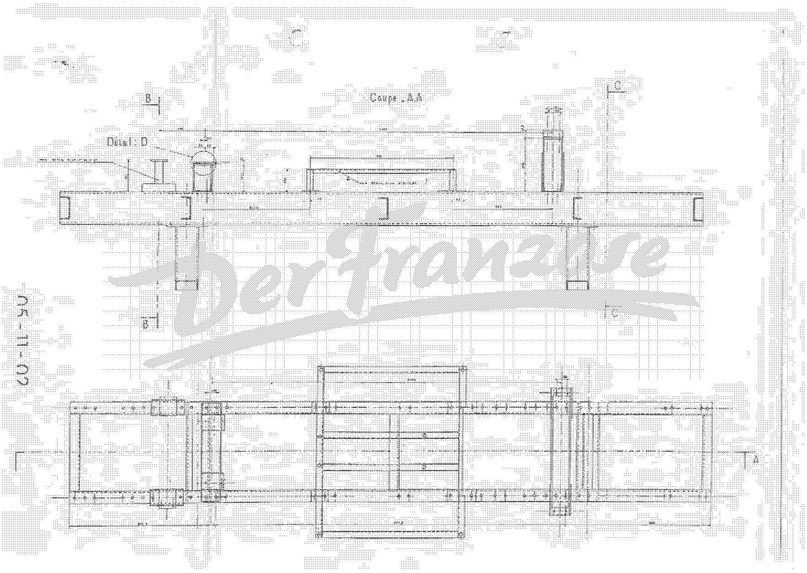
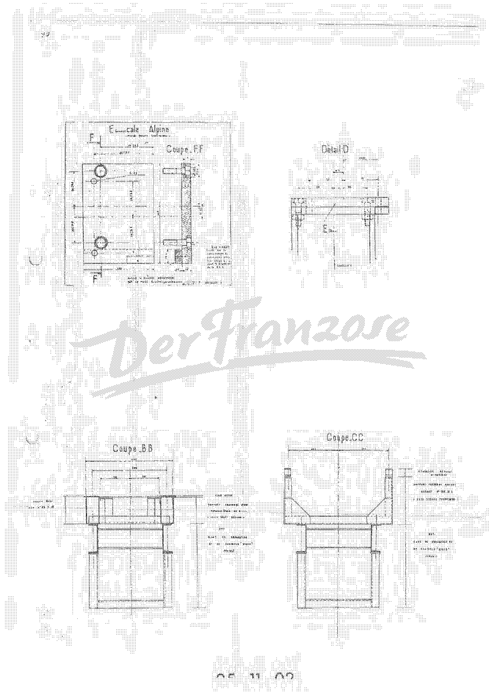
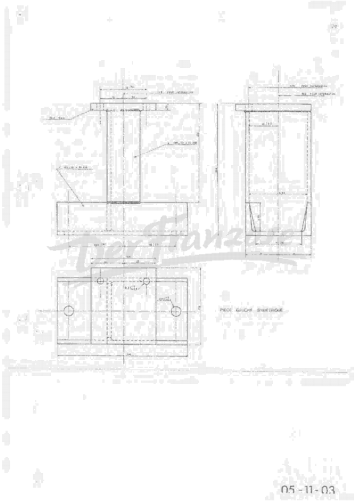
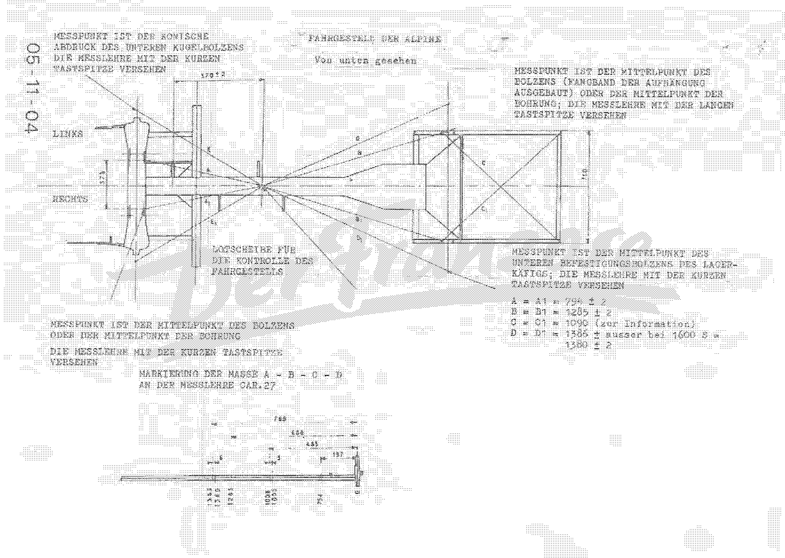
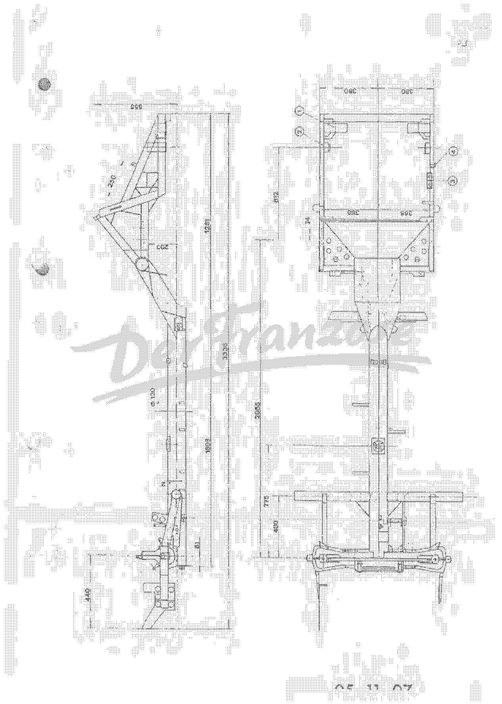
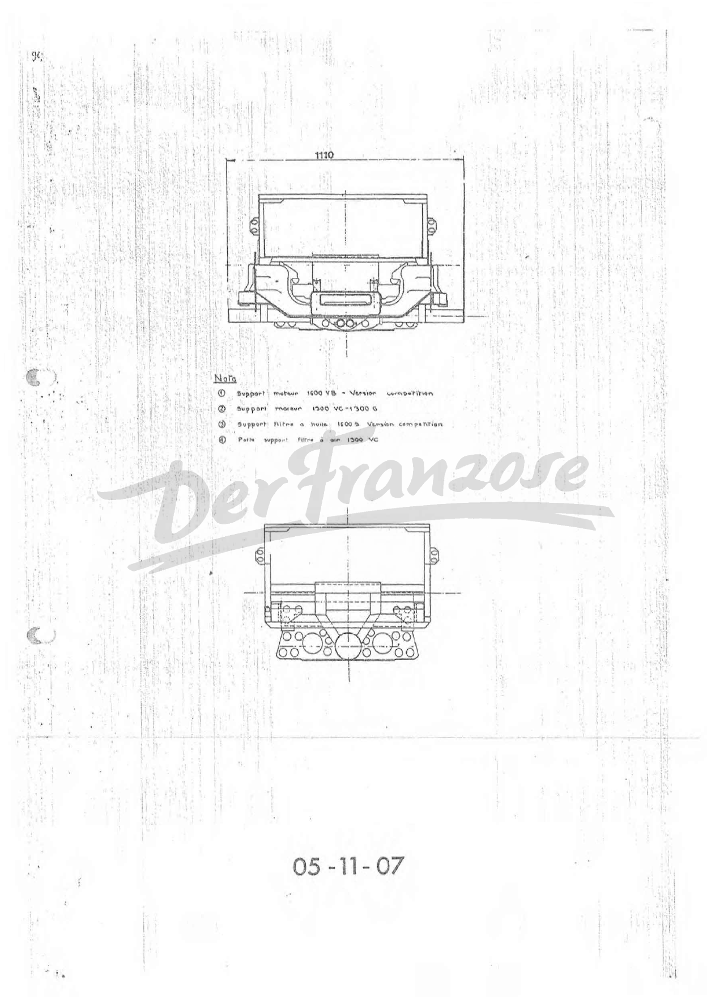

<!-- SOURCE NOTE: PDF pages 461-468 — the end of the update supplement (chapter R special tooling
and the tooling and chassis drawings). Translated from the German original; prose is English, every
value is as printed, decimal separators normalized to the English convention (Rule 13).
PDF p.461 is a typed table, read from the image. PDF pp.462-467 are line drawings (tool drawings and
chassis drawings); they are delivered as images and only the dimensions and labels that are crisp enough
to read are transcribed — most dimension figures on pp.462-464 are tiny and degraded and are NOT
transcribed (flagged). The drawing legends on pp.462-464 and 467 are in French ("Coupe", "Détail",
"Pièce gauche symétrique", "Support moteur ...", "Pour information"); they are translated in the
body. PDF p.468 is the back cover: a blank sheet with no OCR text and no content except the
"DerFranzose" watermark. The OCR draft mislabels the drawing numbers of pp.462, 464 and 465; the
numbers in the page-image margins are used (see flags). -->

# Update supplement — special tooling (chapter R) and chassis drawings

**[PDF p.461]**

## Chapter R — Special tooling (amends [32](32-fm-r-special-tools.md))

| Reference | Supplier | Description of the tool |
|---|---|---|
| 05-11-02 | F.L. | Supports (*Unterlagen*) for use with the mounting blocks **Car.09-5** for the front axle; assembly plan: see body straightening bench RENAULT |
| 05-11-03 | F.L. | Mounting block for aligning the fixing holes of the anti-roll bar (height of the luggage-compartment floor) |
| ENS. 55-019 | Celette | ALPINE RENAULT fitting piece, in addition to ENS 55-01 or 12 |
| Model SA 70 | Globe | Vibrating saw for plastic parts — Pneumatic tools Globe, 143, Av. du Général de Gaulle, 92 — LA GARENNE-COLOMBES |
| EP 9239 | Globe | Replacement blades for the vibrating saw |
| TI 1956 | M.F.O.M. | Pliers for "Jack-Nut" nuts — M.F.O.M., 5, rue de Dunkerque, 75 — PARIS 10ème |
| none (*keine*) | Avdel | Pliers for "Nutsert" sleeves — AVDEL, 66, rue David d'Angers, 75 — PARIS 19ème |
| 60 00 001 285 | ALPINE | Spark-plug wrench for ALPINE 1600 S |
| POL 15.000 | Ch. Maire | Pneumatic grinding and polishing device, small model — Charles Maire, 42, rue E. Bonte, 91 — RIS ORANGE |

<!-- NEEDS REVIEW: read from the image; the OCR is accurate here except the order number of the
spark-plug wrench, which it printed as "60 00 001 # 285" (the image shows "60 00 001 285" split over two
lines, "60 00 001" / "285"), and "POL 15.000" (kept as printed: a catalogue reference, not a thousands
number — the "15.000" is NOT normalized). The row "05-11-02" says the supports go with the mounting
blocks "Car.09-5" — printed so, though the Renault bench blocks are named "Car.95" on p.454; two spellings
of the same bench part, not resolved. The Avdel postcode is "75 - PARIS 19ème" here and "74-PARIS 19éme" on
p.457 as printed (Paris is department 75; "74" is probably a typo on p.457). "RIS ORANGE" = Ris-Orangis
(the page prints it cut/underlined as shown). The "F.L." supplier is as printed (presumably the supplier
code of the drawing owner, not expanded). The cross-references: 05-11-02 and 05-11-03 are the drawings on the
following pages (the table's "Montageplan" refers to the Renault bench). -->

## Tool drawings

The following tool drawings were made by the factory for the body straightening bench. They are
delivered as images; transcribed text covers the drawing numbers, titles and the legible dimensions only.

**[PDF p.462]**

### Drawing 05-11-02 — mounting-block supports (1 of 2: overall view and section A-A)

Landscape drawing: an elevation labelled **"Coupe A.A"** (section A-A), a lower plan view, section marks
**B-B** and **C-C**, a circled **"Détail : D"**, and call-outs "voir détail plan n° 05-11-03" (see detail
drawing no. 05-11-03). Drawing number printed in the left margin: **05-11-02**.

<!-- NEEDS REVIEW: the OCR draft labels this page "N&-11-09" — the page image shows "05-11-02" rotated in the
left margin. Dimensions on this drawing (an overall length of about three thousand millimetres, several
spacings of the order of 200-500, heights) are printed in very small, degraded type and the digits cannot be
read reliably (candidate readings such as "3057" and "2557" are NOT safe); NONE of them is transcribed. Use
the image together with p.454 (which describes where each block goes). -->

**[PDF p.463]**

### Drawing 05-11-02 — mounting-block supports (2 of 2: wedge, detail D, sections B-B and C-C)

Four views: the **Alpine wedge** (*cale Alpine*, "left/right wedge, symmetrical piece") with section **F-F**;
**Détail D**; **Coupe B-B** and **Coupe C-C** (sections showing the Alpine supports on the RENAULT mounting
blocks). The legends in the sections are French, in tiny type, and mostly illegible; they refer to the support and wedge of the Alpine, the RENAULT front and rear cross-member supports and the RENAULT combination repair/checking bench. Drawing number printed at the bottom: **05-11-02**.

<!-- NEEDS REVIEW: the French legends are tiny and partly illegible; only their gist is given above and no
part number from them is transcribed (a "Car.95" mounting block is named on p.454 and p.461). NO dimension is
transcribed from this page: the sizes (wedge width, hole spacings, section widths) are tiny and degraded.
Use the image. -->

**[PDF p.464]**

### Drawing 05-11-03 — anti-roll-bar bearing-block holder (mounting block)

Three views of a welded steel mounting block: an elevation (left), a side elevation (right) and a plan
(bottom), with the note **"Pièce gauche symétrique"** (the left-hand piece is symmetrical). Drawing number
printed at the bottom right: **05-11-03**. Legible entries:

| Item | As printed |
|---|---|
| Plate | "Tôle 10 mm" (sheet 10 mm) — flange plate thickness 10 |
| Section of the post and the base | "U 100 x 50 x 45 250" (channel section, length 250 — read from the leader lines) |
| Overall width of the base (plan) | 200 |
| Block width (plan) | 100, of which 45 and 55 either side of the centre line |
| Flange dimension | 70 ±0.2 (about 15 and 55 either side of the centre line) |
| Dimension | 45 ±0.2 |
| For information | "240 pour information", "640 pour information", "550 pour information" |

<!-- NEEDS REVIEW: the OCR draft mislabels this page "05-11-08"; the image shows "05-11-03" in the bottom
margin (matches the table on p.461). The dimensions above were read at the limit of legibility — the figures
"45 ±0.2", "70 ±0.2", "Tôle 10 mm", "U 100 x 50 x 45 250" and the overall "200" are crisp enough; the hole diameters on the plan
(with small stacked tolerances), "115" (plan height), "155", "205",
"43" and "64.5" are NOT crisp and are not transcribed as values; the "pour information" lines (240, 640, 550)
are reference dimensions, not manufacturing dimensions. Do not manufacture the part from this transcription —
use the image. The unit is not printed (millimetres presumed). -->

## Chassis drawings

**[PDF p.465]**

### Drawing 05-11-04 — chassis of the Alpine, seen from below: measuring points

Title: **FAHRGESTELL DER ALPINE — Von unten gesehen** (chassis of the Alpine — seen from below). Landscape
plan view of the backbone chassis with the left (*LINKS*) and right (*RECHTS*) sides, the plumb disc and the
measuring-point lines A, A1, B, B1, C, C1, D, D1, E, E1. Drawing number in the left margin: **05-11-04**.

Measuring-point legends (as printed, translated):

| Point | Legend |
|---|---|
| E / E1 (front, upper left) | "The measuring point is the conical impression of the lower ball pin. Fit the gauge with the short probe tip." |
| B / B1 (upper right) | "The measuring point is the centre of the bolt (suspension catch strap removed) or the centre of the bore; fit the gauge with the long probe tip." |
| Plumb disc | "Plumb disc for checking the chassis." |
| D / D1 (lower right) | "The measuring point is the centre of the lower fixing bolt of the bearing cage; fit the gauge with the short probe tip." |
| A / A1 (lower left) | "The measuring point is the centre of the bolt or the centre of the bore; fit the gauge with the short probe tip." |
| Gauge scale | "Marking of the dimensions A - B - C - D on the gauge Car.27." |

Dimensions printed on the drawing:

| Dimension | Value |
|---|---|
| Plumb disc from the pedal-assembly axis | 570 ±2 |
| Width at the front axle (left–right) | 578 (read from the drawing — see flag) |
| Width at the rear frame | 760 |
| A = A1 | 794 ±2 |
| B = B1 | 1285 ±2 |
| C = C1 | 1090 (for information) |
| D = D1 | 1386 ± except on the 1600 S = 1380 ±2 |

Gauge scale (bottom of the drawing), values printed along the gauge: **0**, **794** (A), **1005 / 1008**
(E and E1), **1285** (B), **1360 / 1386** (D), and spacings **197, 483, 688, 785** with small offset marks
**3** and **6**.

<!-- NEEDS REVIEW: SAFETY RELEVANT — chassis measuring points. The measuring values A, B, C, D agree with the
text on pp.453-454 and are crisp. Points to check: (1) "D = D1 = 1386 ± ausser bei 1600 S = 1380 ± 2" — the
tolerance after 1386 is missing on the drawing (the text on p.453 gives ±2 for both). (2) The gauge scale
lists "1360" next to "1386" — the printed pair is "1386 / 1380" in the text and the OCR read "1360"; on the
image the second figure of that pair is partly overprinted and reads either 1380 or 1360; the text value
1380 is what pp.453-454 print. (3) "578" and "760" are small leader dimensions read from the image;
"578" may read "576" — not resolved. (4) The gauge-scale spacings (197, 483, 688, 785, offsets 3 and 6) are
tiny. The OCR draft labelled this drawing nothing useful; the left-margin number "05-11-04" is clear. -->

**[PDF p.466]**

### Drawing 05-11-07 — general view of the chassis (side and plan) with main dimensions

Two views, rotated 90° on the page: a **side elevation** (left) and a **plan view** (right) of the chassis
frame, with four numbered call-outs **1 to 4** (explained on the next page). Drawing number at the bottom:
**05-11-07**.

Dimensions printed on the drawing (as read):

| View | Dimensions |
|---|---|
| Side elevation | 3336 (overall length), 1698, 1261, 555, 250, 203, Ø 120, 61, 440 |
| Plan view | 2055, 775, 400, 612, 74, 365 / 365, 380 / 380 |

<!-- NEEDS REVIEW: SAFETY RELEVANT — chassis dimensions. The numbers above are the figures printed on the
drawing, read from the image; the leader lines are not fully traceable (the drawing is rotated and the
dimension lines cross), so WHICH feature each number measures is not stated here — except by the obvious
overall length 3336 and the symmetric pairs 365/365 and 380/380 (half-widths about the centreline). "1698" is
read in a rotated position and could be "1696"/"1898"; "250" and "203" label the rear-end details. Treat
the list as an index of the figures on the drawing, not as checked measuring values; the OCR draft
labelled the page "05-11-09" and printed "1261" and "3336" — the drawing number in the image margin is
05-11-07. -->

**[PDF p.467]**

### Drawing 05-11-07 — front views of the chassis (engine-mount versions)

Two front views of the chassis, one above the other; the upper one carries the dimension **1110** (width).
A legend **"Nota"** lists the four call-outs of the preceding page:

| Call-out | Legend (French in the original) |
|---|---|
| 1 | Engine mount, 1600 VB — competition version |
| 2 | Engine mount, 1300 VC — 1300 G |
| 3 | Oil-filter mount, 1600 S — competition version |
| 4 | Air-filter mount bracket, 1300 VC |

Drawing number at the bottom: **05-11-07**.

<!-- NEEDS REVIEW: SAFETY RELEVANT — chassis dimension. The scan of this page is heavily speckled
(vertical streaks across the whole page). The only legible dimension is "1110" at the top; the lower view
has none. The French "Nota" legend was read as above — "Support moteur 1600 VB - Version compétition",
"Support moteur 1300 VC - 1300 G", "Support filtre à huile 1600 S Version compétition", "Patte support filtre
à air 1300 VC"; the "1300 G" (second line) might read "1300 S" — not resolved. The OCR draft labelled the
page as another drawing number; the image shows "05-11-07" at the bottom. -->

**[PDF p.468]**

## Back cover

PDF p.468 is the back cover of the supplement. It is a blank sheet carrying only the "DerFranzose"
watermark; there is no OCR text and no printed content.

<!-- NEEDS REVIEW: no content on this page (scan of the back cover). Nothing transcribed or omitted. -->

## Special tools used in this chapter

| Tool / reference | Use |
|---|---|
| 05-11-02 | Supports for the mounting blocks on the RENAULT straightening bench (front axle) |
| 05-11-03 | Mounting block for the anti-roll-bar fixing holes |
| Car.27 | Measuring gauge for the chassis measuring points |
| Car.087 | RENAULT body straightening bench |
| Car.95 / Car.09-5 | RENAULT mounting blocks (front cross-member / front axle) |
| ENS 55-019 | Celette fitting piece (added to ENS 55-01 or 12) |
| SA 70 / EP 9239 | Pneumatic vibrating saw / replacement blades |
| TI 1956 | Pliers for "Jack-Nut" nuts |
| 60 00 001 285 | Spark-plug wrench for ALPINE 1600 S |
| POL 15.000 | Pneumatic grinding and polishing device |

## Next

This is the last chapter of the manual. Return to the [update supplement — general data](33-supplement-general-engine-electrical.md)
or the [index](00-index.md).
