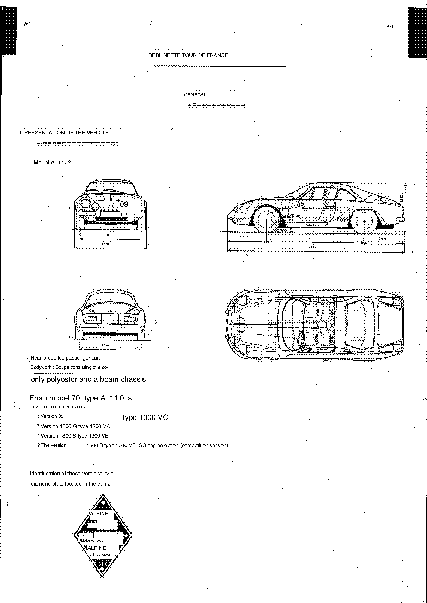

<!-- Source note: PDF pages 1-9. Pages 1-6 are covers, the publisher's title page and the
     illustrated contents plate; their substance is reproduced as the section table below.
     Pages 7-9 are the manual's numbered pages A-1, A-2 and A-3.
     This manual is an English MACHINE TRANSLATION of the French original; French terms
     survive untranslated and French decimal commas are rendered inconsistently as periods.
     Every value below is transcribed as printed and flagged where the page image and the
     running text disagree. See ../README.md. -->

# A — General (Généralités)

Section **A** of the *Alpine A110 Repair Manual*, Type A 110, 1st edition October 1970.
Source PDF pages 1–9; manual pages **A-1** to **A-3**.

**[PDF p.2]**

## Publisher

Société des Automobiles **ALPINE**
boulevard Foch — Epinay/Seine — 93 — FRANCE
Avenue Pasteur — Dieppe — 76 — FRANCE

**1st edition — October 1970.**

**[PDF p.2]**

## Section map (from the contents plate)

The manual is tabbed by letter, and pages are numbered per section (`A-1`, `B-13`, …), not
continuously.

| Code | Section (as translated) | French original | Chapter file |
| ---- | ----------------------- | --------------- | ------------ |
| A | General | Généralités | this file |
| B | Engine · Ignition | Moteur · Allumage | [b-engine-ignition.md](b-engine-ignition.md) |
| C | Electrical equipment | Équipement électrique | [c-electrical-equipment.md](c-electrical-equipment.md) |
| D | Clutch | Embrayage | [d-clutch.md](d-clutch.md) |
| E | Gearbox | Boîte de vitesses | [e-gearbox.md](e-gearbox.md) |
| G | Steering | Direction | [g-steering.md](g-steering.md) |
| H | Front axle | Train avant | [h-front-axle.md](h-front-axle.md) |
| J | Rear axle | Train arrière | [j-rear-axle.md](j-rear-axle.md) |
| L | Suspension · Dampers | Suspension · Amortisseurs | [l-suspension-shock-absorbers.md](l-suspension-shock-absorbers.md) |
| M | Braking system | Freinage | [m-braking-system.md](m-braking-system.md) |
| N | Bodywork | Carrosserie | [n-bodywork.md](n-bodywork.md) |
| R | Special tooling | Outillage spécial | [r-special-tooling.md](r-special-tooling.md) |

There are no sections F, I, K, O, P or Q — the factory skipped those letters.

**[PDF p.7]**

## A-1 — Presentation of the vehicle

**Berlinette Tour de France — Model A 110.**

Rear-engined, rear-driven passenger car. Bodywork: coupé consisting of an all-polyester
body shell on a backbone chassis.

<!-- TRANSLATION NOTE (triaged: nothing left undecided, no value at stake):translation reads "Coupe consisting of a co-/only polyester and a beam
chassis" — French "coque uniquement polyester et un châssis poutre", i.e. polyester-only
shell + backbone ("beam") chassis. Rendered above as the evident sense; wording, not a value. -->

From the **1970 model**, type A 110 is divided into four versions:

| Version | Factory type |
| ------- | ------------ |
| 85 | 1300 VC |
| 1300 G | 1300 VA |
| 1300 S | 1300 VB |
| 1600 S | 1600 VB |

with the **GS engine option** (competition version).

Versions are identified by a **diamond-shaped plate located in the trunk**.

### Dimension drawing (A-1)

Figured dimensions on the drawing, in millimetres as printed:

| Dimension (drawing) | Value |
| ------------------- | ----- |
| Overall length | 3,850 |
| Wheelbase | 2,100 |
| Front overhang | 0,840 |
| Rear overhang | 0,910 |
| Overall height | 1,113 |
| Overall width | 1,520 |
| Front view, lower figure | 1,363 |
| Rear view, lower figure | 1,290 |
| Ground clearance | 0,120 |
| Interior figures | 0,670 · 1,220 · 1,050 |

<!-- NEEDS REVIEW:the drawing's track/clearance/height figures do not agree with the A-2
text below (drawing 1,363 / 1,290 / 0,120 / 1,113 vs text 1.29 / 1.27 / 0.11 / 1.13).
Both are transcribed as printed; neither has been "reconciled". The A110 was built with
more than one track width, so this may be a real difference between the drawing's car and
the table's, not an error. Verify against the French original before using either.
     TRIAGE 2026-10-06 (TypeSafe/Jev, classification only — no value supplied or confirmed by the model): keep_safety · next step: needs_french_original · leaves-undecided 0.98 · risk-if-guessed 0.85 · blocks-a-job 0.47 -->

**[PDF p.8]**

## A-2 — General characteristics

### 1) General dimensions — applicable to all versions

| Dimension | Value (m) |
| --------- | --------- |
| Overall length | 3.85 |
| Overall width | 1.52 |
| Overall height, laden | 1.10 |
| Overall height, empty | 1.13 |
| Front overhang | 0.840 |
| Rear overhang | 0.910 |
| Wheelbase | 2.10 |
| Front track on the ground | 1.29 |
| Rear track on the ground | 1.27 |
| Ground clearance, laden | 0.11 |
| Interior width at elbows | 1.22 |

<!-- TRANSLATION NOTE (triaged: nothing left undecided, no value at stake):translation labels. "Overall hem (load)" is French "hauteur totale (en
charge)" = overall height laden; "Fake Door Front / Back" is "porte-à-faux AV / AR" =
front / rear overhang; "Back to the ground" is "voie AR au sol" = rear track; "Ground
guard in charge" is "garde au sol en charge" = ground clearance laden. Values unchanged;
only the English labels were restored to their evident meaning. The overhang figures check
out against the wheelbase: 0.840 + 2.10 + 0.910 = 3.85 m. -->

### 2) Weight

| Item | 85 | 1300 G | 1300 S | 1600 S |
| ---- | --- | ------ | ------ | ------ |
| Unladen in running order — front | 260 kg | 280 kg | 280 kg | 280 kg |
| Unladen in running order — rear | 425 kg | 415 kg | 415 kg | 435 kg |
| **Total weight** | **685 kg** | **695 kg** | **695 kg** | **715 kg** |

(Each column's front + rear adds to its printed total.)

### 3) Engine

| Version | Fiscal rating | Engine type (as printed) |
| ------- | ------------- | ------------------------ |
| 85 | Z cv | Type **810-30**, derived from engine 810-03 of RENAULT R. 1192 |
| 1300 G | 7 cr | Type **812-00**, keeping the same characteristics as that of the RENAULT 8 G |
| 1300 S | 7 cv | Type **1300 VB**, derived from engine **812-00** of RENAULT 8 G |
| 1600 S | 9 cv | Type **807-25**, derived from engine 807-01, RENAULT 16 TS |

<!-- NEEDS REVIEW:three problems in this table, all left exactly as printed.
(1) "Version 85 - Z cv" — "Z" is not a number; the page image shows "Z cv" too, so this is
    either a source misprint or an OCR error in the French original. Do not assume a value.
(2) "Version 1300 G. - 7 cr" — "cr" for "cv"; punctuation/letter artifact.
(3) The 1300 S row gives "Type 1300 VB" where the other rows give an engine number —
    1300 VB is the VEHICLE type, not an engine type. The row conflates the two.
General (non-manual) sources give 1300 G = engine 812-01 and 1300 S = engine 812; this
manual as translated says 812-00 for both. Unresolved — see ../README.md.
     TRIAGE 2026-10-06 (TypeSafe/Jev, classification only — no value supplied or confirmed by the model): keep_safety · next step: record_as_source_defect · leaves-undecided 0.98 · risk-if-guessed 0.74 · blocks-a-job 0.44 -->

Cooling: water cooling with radiator, sealed. Oil cooling with a radiator mounted in bypass.

<!-- TRANSLATION NOTE (triaged + hand-checked: nothing left undecided):"Water cooling with radiator / Waterproof" is French "refroidissement
d'eau par radiateur, étanche" (sealed system), not "waterproof"; "Diversion-mounted diator"
is "radiateur monté en dérivation" (bypass-mounted radiator). Wording only. -->

### 4) Electrical equipment

- Battery **12 volts — 55 Amp/h**.
- Dynamo for version 85: **25 to 30 Amp/h**.
- Alternator for other versions: **30 to 40 Amp/h**.

<!-- NEEDS REVIEW:"Alternative" in the translation is French "alternateur" = alternator.
     TRIAGE 2026-10-06 (TypeSafe/Jev, classification only — no value supplied or confirmed by the model): keep_safety · next step: verify_against_pdf_page · leaves-undecided 0.96 · risk-if-guessed 0.54 · blocks-a-job 0.38 -->

### 5) Clutch

- Dry single-plate.
- Diaphragm mechanism.
- Disc with torsion-damper hub.
- Release bearing unguided, graphite-guided or ball type depending on the version.

### 6) Gearbox

| Version | Gearbox type |
| ------- | ------------ |
| 85 | Type **330**, or Type **353** for version 85 as an option |
| Other versions | Type **353** |
| Certain 1600 S | Type **364** |

Ratios: **4 forward synchronised + 1 reverse** for the 330; **5 forward synchronised +
1 reverse** for the 353 and 364. Gear lever on the floor.

<!-- TRANSLATION NOTE (triaged: nothing left undecided, no value at stake):"Reports" is French "rapports" = ratios/gears; "1 step rear" is
"1 marche arrière" = 1 reverse. Wording only, values unchanged. -->

**[PDF p.9]**

## A-3 — General characteristics (continued)

### 7) Transmissions

- Lateral driveshafts to the rear wheels.
- **1 needle-roller universal joint per shaft**, per wheel.

<!-- TRANSLATION NOTE (triaged: nothing left undecided, no value at stake):"1 needle cardan joint per tree / Wheel" — French "1 joint de cardan à
aiguilles par arbre de roue" = one needle-bearing universal joint per wheel shaft. -->

### 8) Steering

Rack and pinion with compensating spring.

| | Standard | Optional ("direct" steering) |
| --- | --- | --- |
| Turns of the steering wheel | 3.2 | 2,5 |
| Multiplication (ratio) | 17/1 | 13.5/1 |

Steering wheel Ø: **300 mm, 330 mm and 360 mm**.

<!-- TRANSLATION NOTE (triaged: nothing left undecided, no value at stake):"2,5" is printed with a French decimal comma while "3.2" and "13.5" use
periods; all three are left as printed. "Directorate" in the translation is French
"direction" = steering; "Direct direction" = "direction directe" (the quicker rack). -->

### 9) Front axle (train avant)

- Deformable transverse quadrilaterals (double wishbones).
- Independent half-axles.

### 10) Rear axle (train arrière)

- Rear arms consisting of two **trompettes** (trumpet tubes), one each side of the gearbox.
- Independent half-axles, located longitudinally by two adjustable tie-rods.

<!-- TRANSLATION NOTE (triaged + hand-checked: nothing left undecided):"on both sides of the speeds" is a mistranslation of "de part et d'autre
de la boîte de vitesses" (either side of the gearbox) — "vitesses" was translated alone.
"Two adjustable force legs" is "deux jambes de force réglables" = two adjustable
tie-rods/struts. -->

### 11) Suspension

Printed as paragraph **"(17)"** on the page — a source numbering error; it falls between
(10) Rear axle and 12) Brakes.

- Helical (coil) springs front and rear.
- **Two** telescopic shock absorbers at the front, located inside the springs.
- **Four** telescopic shock absorbers at the rear, on both sides of the half-axles.
- Front anti-roll bar.

<!-- NEEDS REVIEW:source misprint, not OCR — the page image clearly prints "(17)" for what
is sequentially paragraph 11. Kept as printed and noted. The rear damper sentence
("on both sides of the / come out") is French "de part et d'autre des sorties" and is only
partly translated; the arrangement above is the evident reading — verify.
     TRIAGE 2026-10-06 (TypeSafe/Jev, classification only — no value supplied or confirmed by the model): keep_safety · next step: verify_against_pdf_page · leaves-undecided 0.94 · risk-if-guessed 0.55 · blocks-a-job 0.35 -->

### 12) Brakes

- Hydraulic actuation.
- **Discs on all four wheels.**
- Cable handbrake on the rear wheels.

### 13) Tyres and rims

Tyres: **Michelin X AS — Dunlop SP Sport — V10 GT**.

Recommended pressures, in kg:

| Wheels | Front | Rear |
| ------ | ----- | ---- |
| 15 inch | 1,4 to 1,6 | 2.0 to 2.3 |
| 13 inch | 1.6 to 1.8 | 2.3 to 2.5 |

<!-- NEEDS REVIEW:the unit is printed only as "kg" — on a French manual of this date that
is kg/cm2 (≈ bar). Not stated on the page, so not asserted here. The 15-inch front figure
is printed "1, 4 to 1,6" with French commas while the rest of the table uses periods; all
left as printed.
     TRIAGE 2026-10-06 (TypeSafe/Jev, classification only — no value supplied or confirmed by the model): keep_safety · next step: close_as_documentation · leaves-undecided 0.57 · risk-if-guessed 0.59 · blocks-a-job 0.27 
     HAND-CHECKED: kept open because the UNIT of the tyre pressures is genuinely unknown — the page prints only "kg". -->

Rims:

| | Sheet steel | Aluminium | Sheet and alloy |
| --- | --- | --- | --- |
| Wheels | 4 1/2 × 15 | ALPINE 4 1/2 × 13 ALPINE 5 1/2 × 13\* G.T. 4 1/2 × 13 G.T. 5 × 13 G.T. 5 1/2 × 13 \* G.T. 6 × 13\* GOTTI 5 × 13 | DELTA-MIC 4 1/2 × 13 DELTA-MIC 5 × 13 GOTTI 4 1/2 × 13 GOTTI 5 1/2 × 13\* GOTTI 6 × 13 \* |

> **NOTE:** The rims identified by an asterisk can be fitted **only** to lightened-type
> bodies with widened wheel arches.

<!-- NEEDS REVIEW:the translation reads "do not can be adapted only on carrosseries of the
lightened type with passages of Expanded wheel" — French "ne peuvent être adaptées que sur
des carrosseries du type allégé avec passages de roue élargis". The negative + "only" is a
translation artifact; the restrictive sense above is the evident reading. Verify.
     TRIAGE 2026-10-06 (TypeSafe/Jev, classification only — no value supplied or confirmed by the model): keep_blocking · next step: verify_against_pdf_page · leaves-undecided 0.89 · risk-if-guessed 0.33 · blocks-a-job 0.24 -->

### 14) Capacity

- **Petrol tank:** 38 l sheet-metal **or** 50 l plastic, placed at the front.
  Optional 79 l aviation-type tank placed at the rear.
- **Cooling system with heater:** 9 l.
- **Gearbox oil:** 2 l (BV 364 — 2 1/4 l).
- **Brake system:** 0.27 l.

<!-- NEEDS REVIEW:the litre symbol is printed as "l" and OCRs as "/" or "1" throughout this
paragraph ("38 /", "9 1.", "2l."). Quantities above are the page image's reading. The
"79-type aviation tank" is French "réservoir type aviation de 79 l" — 79 is the capacity in
litres, not a type number; stated as 79 l above. Verify against the French original.
     TRIAGE 2026-10-06 (TypeSafe/Jev, classification only — no value supplied or confirmed by the model): keep_safety · next step: verify_against_pdf_page · leaves-undecided 0.94 · risk-if-guessed 0.41 · blocks-a-job 0.28 -->

Engine oil:

| Item | 85 | 1300 G | 1300 S | 1600 S |
| ---- | --- | ------ | ------ | ------ |
| Engine oil (lower sump) | 3 l | 2,5 l | 4 l | 4 l |
| + oil radiator | + 0.5 | + 0.5 | + 0.5 | + 0.5 |
| 4 l option | yes | yes | — | — |
| + special competition oil filter | — | — | + 0.5 | + 0.5 |

<!-- NEEDS REVIEW:the cells OCR as "31", "2.51", "4 I" — these are "3 l", "2,5 l" and "4 l"
with the litre symbol; read from the page image. The "4l. option" note on the image spans
the 85 and 1300 G columns only, and the "+0.5" special-competition-filter row appears only
under 1300 S and 1600 S; rendered that way above. "MOTOR OIL (lower plate)" is French
"huile moteur (carter inférieur)" = engine oil, lower sump.
     TRIAGE 2026-10-06 (TypeSafe/Jev, classification only — no value supplied or confirmed by the model): keep_safety · next step: verify_against_pdf_page · leaves-undecided 0.92 · risk-if-guessed 0.49 · blocks-a-job 0.27 -->

---

**Next:** [B — Engine and Ignition](b-engine-ignition.md)
