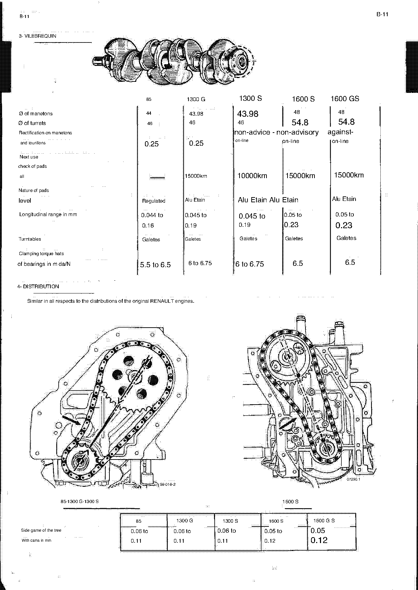
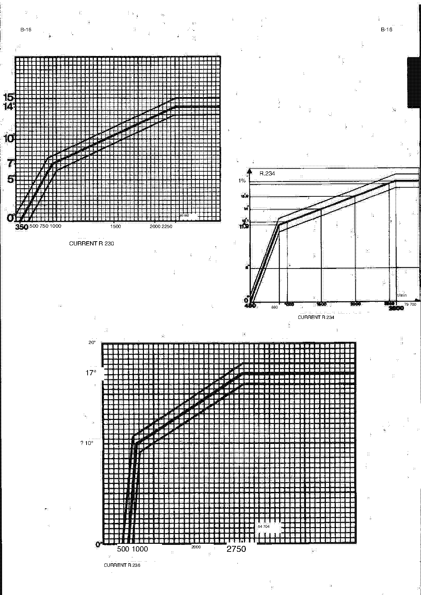

<!-- Source note: PDF pages 10-25. Page 10 is the unnumbered illustrated section plate
     ("MOTEUR · ALLUMAGE"); pages 11-25 are manual pages B-2 to B-16. There is NO page B-1
     in this scan — see 10-needs-review.md.
     English machine translation of the French original. French decimal commas appear
     inconsistently as periods, and many technical terms are mistranslated
     (ALLUMAGE -> "lighting", bougies -> "candles", allumeur -> "lighter", bielle ->
     "believe"/"bial", culbuteurs -> "cultivators", sièges -> "litters", volant ->
     "steering wheel"). Terms are restored to their evident meaning with the printed form
     noted; NO numeric value has been changed. -->

# B — Engine and Ignition (Moteur · Allumage)

Section **B**, source PDF pages 10–25, manual pages **B-2** to **B-16**.

> **This chapter is not self-contained.** For sub-assembly repair the manual refers you to
> the corresponding Renault workshop manual (*MR*):
>
> | Version | Renault manual |
> | ------- | -------------- |
> | 85 | MR 131 (R. 1192) |
> | 1300 G and 1300 S | MR 133 (R. 1135) |
> | 1600 S | MR 96 (R. 1151) |

**[PDF p.11]**

## B-2 — 1) Engine characteristics (general)

| | 85 | 1300 G | 1300 S | 1600 S | 1600 GS |
| --- | --- | --- | --- | --- | --- |
| Engine type | 810-30 | 812-000 | 1300 S | 807-25 | 1600 GS |
| Engine capacity | 1289 cm³ | 1255 cm³ | 1296 cm³ | 1565 cm³ | 1596 cm³ |
| Bore × stroke | 73 × 77 | 74.5 × 72 | 75.7 × 72 | 77 × 84 | 77.8 × 84 |
| Compression ratio | 9.4/1 | 10.5/1 | 12/1 | 10.25/1 | 11.5/1 |
| Maximum SAE power | 81 Ch at 5900 t/min | 103 Ch at 6750 t/min | 132 Ch at 7200 t/min | 138 Ch at 6000 t/min | 172 Ch at 7000 t/min |
| Maximum SAE torque (m daN) | 10.5 at 3500 t/min | 11.9 at 5000 t/min | 12.4 at 4500 t/min | 14.7 at 5000 t/min | 18.4 at 6000 t/min |
| Valve timing — AOA | 20° | 31° | 50° | 40° | 53° |
| Valve timing — RFA | 80° | 61° | 91° | 72° | 83° |
| Valve timing — AOE | 55° | 62° | 74° | 72° | 83° |
| Valve timing — RFE | 42° | 26° | 54° | 40° | 53° |
| Recommended speed (t/min) | 6300 | 6750 | 7000 | 6000 | 6500 |
| Maximum speed (t/min) | 6500 | 7000 | 7500 | 6250 | 7000 |

<!-- NEEDS REVIEW:the "Engine type" row prints the VERSION name ("1300 S", "1600 GS") in
two columns where the others give an engine number — kept exactly as printed. Note also
"812-000" (three zeros) here against "812-00" on page A-2; both left as printed.
     MAINTAINER JUDGEMENT (2026-10-06): treat "812-000" and "812-00" as the SAME engine,
     the difference being a typographic slip in the source rather than two variants. The
     manual nowhere distinguishes them, no part or procedure in it keys off the third zero,
     and the two spellings are used for the same column of the same version. Both remain
     transcribed exactly as each page prints them; this note records the reading, it does
     not change either page. Not independently verified against an Alpine or Renault parts
     catalogue.
The second timing row is printed "FRG"; in a French manual the sequence is AOA / RFA / AOE
/ RFE (avance ouverture admission, retard fermeture admission, avance ouverture
échappement, retard fermeture échappement), so "FRG" is read as RFA. The degree values are
unchanged.
"Ch" is French "chevaux" (SAE horsepower as printed); "t/min" is tours/minute = rpm.
Torque values print a trailing stray letter ("10.5 d", "11.9 a", "12.4 to") — an artifact of
"à" (at); the numbers are unchanged.
     TRIAGE 2026-10-06 (TypeSafe/Jev, classification only — no value supplied or confirmed by the model): keep_safety · next step: close_as_documentation · leaves-undecided 0.59 · risk-if-guessed 0.44 · blocks-a-job 0.15 
     HAND-CHECKED: the 812-000 / 812-00 point is RESOLVED (see maintainer judgement above). Still open because "FRG"->RFA is an inference and the "Engine type" row prints version names where engine codes belong. -->

**[PDF p.11]**

## B-2 — 2) Identification

By rectangular plate on the unit (RENAULT plate or ALPINE plate).

> **NOTE:** The engine number and type on this plate must be quoted **IMPERATIVELY** when
> ordering parts.

**[PDF p.11]**

## B-2 / B-3 — 3) Difference between the original RENAULT engine and the ALPINE engine

### (a) Type 810-30, derived from 810-03 of R. 1192

**Identical parts:** cylinder block group · pistons and liners · crankshaft (*vilebrequin*)
· timing gear (*distribution*) · lower crankcase · valves (*soupapes*).

**Parts machined or replaced:**

- **Cylinder head (*culasse*):** machining of the valve chambers; machining of the intake and
  exhaust spring seats and cups for fitting internal springs; alignment of the intake ports
  relative to the manifold; machining (**2.6 mm**) of the joint face.
- Intake and exhaust manifold RENAULT 8 S.
- ALPINE *scumbags*.
- RENAULT carburettor 8 S.
- RENAULT 8G water pump and fan.
- RENAULT 8G oil pump.
- ALPINE camshaft.
- Clutch type R. 1135 with Estafette-type flywheel No **8331975** for graphite release stops.

<!-- NEEDS REVIEW:"ALPINE scumbags" is an untranslated/garbled machine-translation of some
French part name; the page image shows the same words, so the source word cannot be
recovered from this copy. Left as printed — do not guess. It recurs on B-3 as "ALPINE
aluminium scumbags".
"with type steering wheel Estafette No 8331975" — French "volant" means FLYWHEEL, not
steering wheel; rendered as flywheel above. The part number is unchanged.
"rectification (2.6 mm) of the plane joint" is machining of the head joint face by 2.6 mm —
value unchanged.
     TRIAGE 2026-10-06 (TypeSafe/Jev, classification only — no value supplied or confirmed by the model): keep_safety · next step: needs_french_original · leaves-undecided 0.92 · risk-if-guessed 0.55 · blocks-a-job 0.46 -->

### (b) Type 812-00, identical to the RENAULT 8 G engine

- Optional **4 l** aluminium sump with baffle.
- ALPINE oil pump **H = 13 mm**.

### (c) Type 1300 S, derived from 812-00

**Identical parts:** cylinder block group · crankshaft · clutch · carburettor.

**Identical or replaced parts:**

- Pistons and liners: **1296 cm³**, ALPINE type.
- Oil pump extension, **H = 13 mm**.
- Lower ALPINE aluminium housing.
- Camshaft **13 R ALPINE**.
- Stronger valve-spring setting; oil pump (**+ 1 washer of 1,2 mm**).
- Bone joint.
- **Cylinder head:** machining of the intake ports, polishing and alignment; **5/10th**
  rectification for intake valves Ø **35 mm**; rectification of **4/10th** for intake valves
  Ø **38,5 mm**.

<!-- NEEDS REVIEW:"Bone joint" is an untranslated French term, unrecoverable from this copy.
"5/10th" and "4/10th" are French shorthand for 0.5 mm and 0.4 mm; left in the printed form.
"1,2 mm" and "38,5 mm" keep their French decimal commas as printed.
     TRIAGE 2026-10-06 (TypeSafe/Jev, classification only — no value supplied or confirmed by the model): keep_safety · next step: needs_french_original · leaves-undecided 0.95 · risk-if-guessed 0.76 · blocks-a-job 0.59 -->

### (d) Type 807-25, derived from 807-01 of R. 1151

This engine is delivered prepared by the R.N.U.R. to the following specifications:

- Additional centring dowel on the crankshaft.
- Reinforced connecting rods.
- Pistons, gudgeon pins, special rings.
- Special camshaft.
- Cylinder housing reinforced at the level of the liners.
- Timing cover machined to accept an intermediate plate for the rear engine crossmember support.
- ALPINE aluminium *scumbags*.
- Special assembly.
- Double valve springs.
- Intake valves Ø **42**, less head, hollow — tulip-shape; different exhaust valve.
- ALPINE inlet and exhaust manifolds.
- Rockers (*culbuteurs*) with different heat treatment.
- Oil pump rotor **5 mm** higher.
- **WEBER 45 DCOE** carburettor.
- ALPINE aluminium oil sump with re-cut pickup-strainer height.

<!-- NEEDS REVIEW:"Cultivators (heat treatment different)" is French "culbuteurs" = rocker
arms; "crepine" is the oil pickup strainer; "Pion of additional centering" is "pion de
centrage" = centring dowel. Wording restored, values unchanged. "Special ass." is printed
truncated and is not recoverable.
     TRIAGE 2026-10-06 (TypeSafe/Jev, classification only — no value supplied or confirmed by the model): keep_safety · next step: close_as_documentation · leaves-undecided 0.93 · risk-if-guessed 0.47 · blocks-a-job 0.31 
     HAND-CHECKED: kept open because "Special ass." is truncated in the source and is not recoverable. -->

### Option 1600 GS, derived from 807-25

- Special liners and pistons, bore **77.80** (cylinder: **1596 cm³**).
- **Cylinder head:** alignment of the ducts; internal valve springs with different external
  ones; special spring support cups; alignment of the ducts.
- Special camshaft.

> **NOTE:** For all these engine types ALPINE reserves the right to introduce other engines
> according to the type of customer and the use of the vehicle (competition).

**[PDF p.13]**

## B-3 / B-4 / B-5 — II) Interventions

### Removing the engine only (*dépose moteur seul*)

All these engines are attached to the rear of the vehicle by an R.1135 crossmember.

1. Drain the cooling circuit.
2. Disconnect: mechanical and electrical controls; water, petrol and oil pipes; on certain
   models, the tie-rods connecting the engine to the chassis or to the rear crossmember.
3. Uncouple the clutch bellhousing from the cylinder block group.
4. Fit the rear crossmember.
5. **On 1600 S** it is necessary to remove the exhaust manifold, the alternator, the water
   pump pulley, the water-pump inlets and outlets, the starter and the right-hand engine
   mount on the chassis.
6. Lift the rear of the body and clear the engine from underneath.

> Access to the front face of the head is made easier by removing the inspection plate in
> the rear bulkhead.

### Refitting the engine only

Operate in the reverse order of removal. Ensure the water and oil drains are in good
condition before connecting.

### Removing the powertrain (*dépose groupe propulseur*)

1. Drain the water circuit.
2. Disconnect the mechanical controls, electrical and hydraulic equipment, and the water,
   oil and petrol pipes.
3. Unbolt the gearbox crossmember support from the chassis.
4. Fit the tie-rods connecting the unit to the chassis.
5. Unroll the engine from the chassis.
6. Lift the rear of the vehicle high enough to let the unit pass.
7. Separate the engine from the gearbox.

> **NOTE:** The 1600 S crossmember is modified and strengthened.

### Refitting the powertrain

Operate in the reverse order of removal. Replenish the oil and water. Bleed the brake
system. Check the engine alignment relative to the longitudinal axis of the vehicle.

<!-- NEEDS REVIEW:these procedures are translated loosely ("Unburst the cross-section
support box chassis speeds", "Unroll the mo- the chassis", "Operate contrary to filing").
The step sequence and every number are as printed; the English has been made readable.
Verify step 3/5 wording against the French original before relying on it.
     TRIAGE 2026-10-06 (TypeSafe/Jev, classification only — no value supplied or confirmed by the model): keep_safety · next step: needs_french_original · leaves-undecided 0.96 · risk-if-guessed 0.71 · blocks-a-job 0.39 -->

**[PDF p.15]**

## B-6 — 1) Cylinder head (*culasse*) — repair of sub-assemblies

| | 810-30 | 812-000 | 1300 S | 807-25 | 1600 GS |
| --- | --- | --- | --- | --- | --- |
| Head bolt torque, cold (m daN) | 5.5 to 6.5 | 7–7.75 | in 2 stages: 7.5 and then 8 | in 2 stages: 5.5 and 7.75–8,25 | in 2 stages: 5.5 and 7,75–8.25 |
| Head bolt torque, hot — after 50′ stop (m daN) | 6.5 | unplanned | — | 8.5 to 9 | not foreseen |
| Tappet clearance, cold — intake (mm) | 0.20 | 0.20 | 0.25 | 0.20 | 0.25 |
| Tappet clearance, cold — exhaust (mm) | 0.25 | 0.30 | 0.30 | 0.30 | 0.35 |
| Height of head (mm) | 71.80 | 73.0 | 72.4 or 72.6 | 93.5 | 93.5 |
| Maximum correction (mm) | 0.30 | 0.20 | 0.20 | 0.30 | 0.20 |
| Maximum deformation (mm) | 0.05 | 0.05 | 0.05 | 0.05 | 0.05 |
| Volume of chambers (cm³) | 36 | 36 | 35 | 43 | 43 |
| Thickness of the head gasket \* | 15/10 | 15/10 | 10/10, 12/10th after rectification | 15/10 | 15/10 |

\* The thickness of the head gaskets may be different depending on the version.

<!-- NEEDS REVIEW — SAFETY-RELEVANT, head bolt torque.
(1) The 807-25 and 1600 GS cells are printed with text spilling across the column rule and
    OCR as "5.5 and / 7.75-8, 25-7, 75-8.25". Read from the page image, both columns appear
    to be "in 2 stages: 5,5 then 7,75-8,25 m daN", with French decimal commas. The reading
    is NOT certain — do not use these two columns without checking the source PDF p.15.
(2) "in 2 strokes" is French "en 2 temps" = in 2 stages.
(3) "Cold starter setting" is French "réglage des culbuteurs à froid" = cold tappet/rocker
    clearance; restored above, values unchanged.
(4) 812-000 head gasket OCRs as "15/102" and 1300 S as "10/10g" — the page image shows
    "15/10" and "10/10"; the stray trailing characters are scan artifacts.
(5) "Volume of rooms" is "volume des chambres" = combustion chamber volume.
(6) The 1300 S hot-torque cell is empty on the page; "—" above means not printed, not zero.
(7) Units: this table says "m da/N" (m daN), while B-8 gives the same 1300 S figures as
    "mkg". They are not the same unit (1 kgf·m = 0.981 daN·m). Both are transcribed as
    printed; the discrepancy is unresolved. -->

### Valve guides (*guides de soupapes*)

| | 810-30 | 812-000 | 1300 S | 807-25 | 1600 GS |
| --- | --- | --- | --- | --- | --- |
| Inner diameter (mm) | 7 | 7 | 7 | 8 | 8 |
| Outer diameter, normal (mm) | 11 | 11 | 11 | 13 | 13 |
| Outer diameter, repair with 1 groove (mm) | 11.10 | 11.10 | 11.10 | 13.10 | 13.10 |
| Outer diameter, repair with 2 grooves (mm) | 11.25 | 11.25 | 11.25 | 13.25 | 13.25 |

### Valve seats (*sièges de soupapes*)

| Seat width (mm) | 810-30 | 812-000 | 1300 S | 807-25 | 1600 GS |
| --- | --- | --- | --- | --- | --- |
| Intake | 1.1 to 1.4 | 1.7 | 1,7 | 1.5 to 1.8 | 1.5 to 1.8 |
| Exhaust | 1.4 to 1.7 | 1.5 | 1,5 | 1.7 to 2 | 1.7 to 2 |

<!-- NEEDS REVIEW:the table heading prints "SOUPAPED STEELS" and the two rows "Admission" /
"Stimulation". "Width of litters" is French "largeur des sièges" = seat width (sièges =
seats, machine-translated as "litters"); the second row is read as Exhaust because it pairs
with Admission exactly as every other intake/exhaust pair in this chapter does — but the
printed word is "Stimulation", so verify. "Repair with 1/2 throat" is "gorge" = groove.
The 807-25 exhaust cell OCRs with a leading "?" ("?1.7 to 2"); the page image shows
"1.7 to 2".
     TRIAGE 2026-10-06 (TypeSafe/Jev, classification only — no value supplied or confirmed by the model): keep_safety · next step: verify_against_pdf_page · leaves-undecided 0.79 · risk-if-guessed 0.41 · blocks-a-job 0.17 -->

**[PDF p.16]**

## B-7 — Valves, springs, rockers and pushrods

### Valves (*soupapes*)

| | 810-30 | 812-000 | 1300 S | 807-25 | 1600 GS |
| --- | --- | --- | --- | --- | --- |
| Head diameter, intake (mm) | 33.5 | 35 | 35 or 38.5 | 42 | 42 |
| Head diameter, exhaust (mm) | 30.0 | 32.6 | 32.6 | 35.35 | 35.35 |
| Stem diameter, intake (mm) | 7 | 7 | 7 | 8 | 8 |
| Stem diameter, exhaust (mm) | 7 | 7 | 7 | 8 | 8 |
| Seat angle | 90° | 90° | 90° | 90° | 90° |
| Valve lift, intake (mm) | 8.4 | 8.94 | 10.2 | 10,1 | 10.1 |
| Valve lift, exhaust (mm) | 8.4 | 8.43 | 10 | 10,1 | 10.1 |

<!-- TRANSLATION NOTE (triaged: nothing left undecided, no value at stake):"Diameter of tail" is "diamètre de queue" = stem diameter; "Angle of
range" is "angle de portée" = seat angle; "Lifting valves" is "levée des soupapes" = valve
lift. 807-25 lift prints French commas ("10,1"); left as printed. -->

### Valve springs (*ressorts de soupapes*)

| | 810-30 | 812-000 | 1300 S | 807-25 | 1600 GS |
| --- | --- | --- | --- | --- | --- |
| Free length, outer spring (mm) | 42.2 | 43 | 43 | 54.3 | 46 |
| Free length, inner spring (mm) | 34 | 41,2 | 41.2 | 46.8 | 34.2 |
| Outer spring — type | type R.1170 | type R.1135 | type R.1135 | type R.1151 | type 1600 GS |
| Outer spring — shortening under load | 17.2 under 36 da/N | 18 under 44 da/N | 18 under 44 da/N | 13.8 under 52 da/N | 22,7 under 61 da/N |
| Inner spring — type | type ALPINE | type R.1135 | type R.1135 | type R.1171 | type 1600 GS |
| Inner spring — shortening under load | 18 under 17 da/N | 18.2 under 23 da/N | 18.2 under 23 da/N | 22.3 under 16 da/N | 16.7 under 17.5 da/N |
| Wire diameter, outer spring (mm) | 3.4 | 3.8 | 3.8 | 4.2 | 4.2 |
| Wire diameter, inner spring (mm) | 2 | 2.7 | 2.7 | 2.6 | 2.6 |
| Inner diameter, outer spring (mm) | 21.6 | 24.4 | 24.4 | 27.6 | 27.6 |
| Inner diameter, inner spring (mm) | 12 | 17.3 | 17.3 | 19.8 | 19.8 |

<!-- NEEDS REVIEW:the 812-000 free lengths print with a leading hash ("# 43", "# 41,2") —
a scan artifact; the numbers are as shown. The 1600 GS outer-spring figure OCRs as
"22 7 sub" and the inner as ".16.7 under"; the page image reads 22,7 and 16.7. The 1300 S
inner-spring inner diameter OCRs as "? 17.3". "Domestic spring" is "ressort intérieur" =
inner spring; "Yarn diameter" is "diamètre du fil" = wire diameter; "Decrease in length
under load" is "diminution de longueur sous charge". "sub"/"under" both render French
"sous".
     TRIAGE 2026-10-06 (TypeSafe/Jev, classification only — no value supplied or confirmed by the model): keep_review · next step: verify_against_pdf_page · leaves-undecided 0.27 · risk-if-guessed 0.33 · blocks-a-job 0.15 -->

### Rocker bearing surfaces and pushrods

| | 810-30 | 812-000 | 1300 S | 807-25 | 1600 GS |
| --- | --- | --- | --- | --- | --- |
| Rocker bearing diameter, normal (mm) | 19 | 21 | 21 | 12 | 12 |
| Rocker bearing diameter, repair (mm) | 19.2 | 21.2 | 21.2 | 12.20 | 12.20 |
| Pushrod length, intake (mm) | 176 | 166 | 166 | 74.5 | 74.5 |
| Pushrod length, exhaust (mm) | 176 | 189 | 189 | 105.5 | 105.5 |
| Pushrod diameter (mm) | 5 | 5.5 | 5.5 | — | — |

<!-- TRANSLATION NOTE (triaged + hand-checked: nothing left undecided):the printed headings are "CULBUTOR POWERS" (French "portées de
culbuteurs" = rocker bearing surfaces) and "IIGE OF CULBURIERS" ("tiges de culbuteurs" =
pushrods). The 807-25 / 1600 GS pushrod-diameter cells are blank on the page; "—" means
not printed. Note the 85's intake and exhaust pushrods are the same length while the
others differ — as printed. -->

**[PDF p.17]**

## B-8 — Head gasket replacement

### 1300 S — fitting the head gasket

> **CAUTION:** If the gasket has been stored in a damp place it must be dried before
> assembly. Dry it by heating to about **150 °C for 20 minutes** in an oven. A simple
> support on which the gasket rests is enough, to avoid direct contact with the flame of
> any stove. Temperature can be checked with a thermochrome pencil.

The block joint faces and the crankcase cylinders are then coated with **Hylomar SQ 32/M**
applied with a stiff brush.

The head is tightened **twice** before the vehicle is put into service:

1. First time at **7,5 mkg**.
2. Then, after running the engine hot for **30 minutes**, re-tighten at **8 mkg** once cooled.
3. A final tightening at **8 mkg** after **500 km** of use of the car.

<!-- NEEDS REVIEW — SAFETY-RELEVANT. The unit here is printed "mkg" (kgf·m) while the B-6
table gives the same 1300 S figures in "m da/N" (daN·m). 1 kgf·m = 0.981 daN·m, so the two
are close but not identical. Both are transcribed exactly as printed; which unit the
factory intended is unresolved. -->

### 1600 S — removing and refitting the head, or replacing the gasket

This operation can be carried out properly only with the engine removed. Although removing
the head on the car is possible, the height available under the rear panel does not allow
the use of the **MOT 451** centring tool. Access to the front face of the head is made
easier on this model by removing the inspection hatch in the rear bulkhead.

### 1600 GS

Depending on use (competition) it is recommended to replace **all exhaust valves every
7000–10000 km**.

**[PDF p.18]**

## B-9 — 2) Liner / piston / connecting-rod assembly

### (a) Liners (*chemises*)

| | 85 | 1300 G | 1300 S | 1600 S | 1600 GS |
| --- | --- | --- | --- | --- | --- |
| Base gasket material | Paper | Paper | Copper | Paper | Paper |
| Gasket thickness — blue (mm) | 0.08 | 0.07 | 0.05 | 0.08 | 0.08 |
| Gasket thickness — red (mm) | 0.10 | 0.09 | 0.07 | 0.10 | 0.10 |
| Gasket thickness — green (mm) | 0.12 | — | 0.10 | 0.12 | 0.12 |
| Gasket thickness — fourth value (mm) | — | — | 0.12 | — | — |
| Liner protrusion (mm) | 0.04 to 0.11 | 0.05 to 0.12 | 0.15 to 0.20 | 0,10 to 0.15 | 0,10 to 0.15 |
| Inside Ø (mm) | 73 | 74.5 | 75.7 | 77 | 77.80 |

<!-- NEEDS REVIEW:the gasket rows are labelled only "Blue gasket thickness / Red / Green"
on the page, and the 1300 S column prints FOUR values (0.05, 0.07, 0.10, 0.12) against
three colour labels — so the fourth value's colour is not stated. The 1300 G column prints
only two (0.07, 0.09). Rendered exactly as counted from the page image; "—" means no value
printed, not zero. The 85 red cell OCRs as "? 0.10".
"Exceeding shirts" is French "dépassement des chemises" = liner protrusion above the block
face — a value you set with these shim gaskets, so getting the colour mapping right matters.
Verify against the source PDF p.18.
     TRIAGE 2026-10-06 (TypeSafe/Jev, classification only — no value supplied or confirmed by the model): keep_safety · next step: verify_against_pdf_page · leaves-undecided 0.97 · risk-if-guessed 0.85 · blocks-a-job 0.67 -->

### (b) Pistons

Marked with an arrow on the (engine) flywheel side.

| Head shape | 85 | 1300 G | 1300 S | 1600 S | 1600 GS |
| --- | --- | --- | --- | --- | --- |
| | Flat | Domed with flats | Domed with flats | Domed with flats | Domed with flats |

<!-- NEEDS REVIEW:"Remarked with an arrow on the steering motor" is French "repéré par une
flèche" plus a direction word the translation garbled — the orientation reference is not
recoverable from this copy. Do not rely on the "flywheel side" reading above; check the
source PDF p.18. "Plate" is "plat" = flat; "Bomb with flats" is "bombé avec méplats" =
domed with flats.
     TRIAGE 2026-10-06 (TypeSafe/Jev, classification only — no value supplied or confirmed by the model): keep_safety · next step: verify_against_pdf_page · leaves-undecided 0.98 · risk-if-guessed 0.81 · blocks-a-job 0.63 -->

**[PDF p.19]**

## B-10 — (c) Gudgeon pins · (d) Connecting rods

### (c) Gudgeon pins (*axes*)

| 85 | 1300 G | 1300 S | 1600 S | 1600 GS |
| --- | --- | --- | --- | --- |
| Tight in the rod and free in the piston | Free in the rod and the piston | Free in the rod and the piston | Free in the rod and the piston | Free in the rod and the piston |

<!-- NEEDS REVIEW:the 1300 G / 1300 S / 1600 S / 1600 GS cells print "Free in the / and the
/ piston" — the word "bielle" (rod) was dropped by the translation in all four. The 85 cell
prints "Hard in the biel and free in the piston". Read as above; verify.
     TRIAGE 2026-10-06 (TypeSafe/Jev, classification only — no value supplied or confirmed by the model): keep_safety · next step: verify_against_pdf_page · leaves-undecided 0.96 · risk-if-guessed 0.54 · blocks-a-job 0.34 -->

### (d) Connecting rods (*bielles*)

| | 85 | 1300 G | 1300 S | 1600 S | 1600 GS |
| --- | --- | --- | --- | --- | --- |
| Bearing shell material | Regulated (white metal) | Alu Etain | Alu Etain | Alu Etain | Alu Etain |
| Theoretical weight difference between the 4 rods | 6 g | 3 g | 3 g | 3 g | 3 g |
| Big-end cap clamping torque (m daN) | 4 to 4.5 | 4,25–4,75 | 4,25–4,75 | 4.5 | 4.5 |
| Small end | — | offset (A) | offset (A) | — | — |

<!-- NEEDS REVIEW — SAFETY-RELEVANT, big-end cap torque. The 1300 G / 1300 S cell OCRs as
"4.25-4, 75, 4.25-4,75" — one value printed across two columns with French decimal commas,
read as 4,25–4,75 m daN for both. Verify against the source PDF p.19.
"Nature of pads" is "nature des coussinets" = bearing shell type; "Regulated" is French
"régule" = white metal / babbitt; "Alu Etain" is aluminium-tin, left in French.
"Clamping torque hats" is "couple de serrage des chapeaux" = cap torque.
"foot of bial offset (A)" is "pied de bielle décalé (A)" = offset small end. -->

> **NOTE:** 812-00 and 1300 S engine rods.

Each rod carries a boss on one side that fixes its orientation. The rods of **cylinders 1
and 3** are fitted the same way round, working side towards the timing gear. **Cylinders 2
and 4** likewise, working side towards the steering side.

<!-- NEEDS REVIEW:"on the side of the decal- / This is a job that allows for its
orientation" is a broken translation of a French sentence naming the identifying boss;
"working side distribute" is "côté travail: distribution" (timing side) and "working on the
steering side" is "côté direction". In a rear-engined car "côté direction" is unusual and
may be a mistranslation of "côté volant" (flywheel side). Do NOT fit rods on this reading
alone — check the source PDF p.19 and its figures.
     TRIAGE 2026-10-06 (TypeSafe/Jev, classification only — no value supplied or confirmed by the model): keep_safety · next step: verify_against_pdf_page · leaves-undecided 0.97 · risk-if-guessed 0.86 · blocks-a-job 0.68 -->

**[PDF p.20]**

## B-11 — 3) Crankshaft (*vilebrequin*)

| | 85 | 1300 G | 1300 S | 1600 S | 1600 GS |
| --- | --- | --- | --- | --- | --- |
| Ø of crankpins (*manetons*) (mm) | 44 | 43.98 | 43.98 | 48 | 48 |
| Ø of main journals (*tourillons*) (mm) | 46 | 46 | 46 | 54.8 | 54.8 |
| Regrinding of crankpins and journals (mm) | 0.25 | 0.25 | not advised | not advised | not advised |
| Next check of bearing shells | — | 15000 km | 10000 km | 15000 km | 15000 km |
| Bearing shell material | Regulated (white metal) | Alu Etain | Alu Etain | Alu Etain | Alu Etain |
| End float (mm) | 0.044 to 0.16 | 0.045 to 0.19 | 0.045 to 0.19 | 0.05 to 0.23 | 0.05 to 0.23 |
| Thrust washers | Galettes | Galettes | Galettes | Galettes | Galettes |
| Main bearing cap clamping torque (m daN) | 5.5 to 6.5 | 6 to 6.75 | 6 to 6.75 | 6.5 | 6.5 |

<!-- NEEDS REVIEW — SAFETY-RELEVANT, main bearing cap torque. "non-advice - non-advisory -
against- / on-line" in the regrinding row is French "non préconisée" = not advised /
not recommended; rendered above, no value involved. "Longitudinal range" is "jeu
longitudinal" = end float. "Turntables / Galetes" is French "galettes" (a thrust-washer
type) and is left in French because the English term is not recoverable. The 85 "next
check" cell prints a dash. -->

**[PDF p.20]**

## B-11 — 4) Timing (*distribution*)

Similar in all respects to the timing of the original RENAULT engines.

| Camshaft end float (mm) | 85 | 1300 G | 1300 S | 1600 S | 1600 GS |
| --- | --- | --- | --- | --- | --- |
| | 0.06 to 0.11 | 0.06 to 0.11 | 0.06 to 0.11 | 0.05 to 0.12 | 0.05 to 0.12 |

<!-- NEEDS REVIEW:printed "Side game of the tree with cams in mm" — French "jeu latéral de
l'arbre à cames" = camshaft end float. The 1600 GS column prints the two values on separate
lines without a "to"; read as 0.05 to 0.12 to match the 1600 S column.
     TRIAGE 2026-10-06 (TypeSafe/Jev, classification only — no value supplied or confirmed by the model): keep_review · next step: close_as_documentation · leaves-undecided 0.78 · risk-if-guessed 0.27 · blocks-a-job 0.15 
     HAND-CHECKED: kept open because the 1600 GS camshaft end float is READ as a range the page does not actually print as one. -->

**[PDF p.21]**

## B-12 — 5) Lubrication

**Versions 1300 G = 1300 S = 1600 S.** Oil radiator at the right rear for the 1600 S and
1300 competition versions, cooled by a motor-fan for the 1600 S, and behind the rear skirt
on the 1300 and 1300 G.

**Version 85.** ALPINE modified oil radiator at the rear of the water radiator; it is cooled
by the water-pump fan.

| | 85 | 1300 G | 1300 S | 1600 S | 1600 GS |
| --- | --- | --- | --- | --- | --- |
| Engine sump capacity | 3 or 4 l | 2.5 or 4 l | 4 l | 4 l | 4 l |
| Oil pump pressure, cold | 4 to 4.5 | 4 to 4.5 | 4.5 to 5 | 4 to 4.5 | 4 to 4.5 |
| Oil pump pressure, hot | 3.5 to 4 | 3.5 to 4 | 3 to 4 | 3.5 to 4 | 3.5 to 4 |
| Oil filter cartridge replacement | 10000 km | 10000 km | 5000 km | 10000 km | 5000 km |
| Oil change interval | 2500 km | 2500 km | 2500 km | 2500 km | 2500 km |
| Oil recommended | Elf 20W40 | Elf 20W40 | Elf 20W40 | Prestigrade 20W50 | Prestigrade 20W50 |

> **NOTE:** No additives are recommended either in the oil or in the petrol.

<!-- NEEDS REVIEW:the oil-pressure rows print NO unit on the page — on a French manual of
this date these are almost certainly kg/cm2 (≈ bar), but that is not stated, so no unit is
asserted here. "Periodicity of discharges" is "périodicité des vidanges" = oil change
interval. The 1300 G oil cell OCRs as "EIFs" (Elf).
     TRIAGE 2026-10-06 (TypeSafe/Jev, classification only — no value supplied or confirmed by the model): keep_safety · next step: verify_against_pdf_page · leaves-undecided 0.79 · risk-if-guessed 0.61 · blocks-a-job 0.22 -->

**[PDF p.21]**

## B-12 / B-13 — 6) Cooling (*refroidissement*)

Sealed circuit with expansion tank.

- **9 l** capacity for all versions with a front radiator.
- **6.5 to 7 l** for versions with a rear radiator.

For cars fitted with an aluminium front radiator the circuit must be filled **only** with a
50 % antifreeze / 50 % demineralised water mixture, or with prepared coolant
ref. **806.834** (6 l can) or **806.835** (8 l can).

**Versions 1300 G = 1300 S = 1600 S.** Water radiator at the front of the vehicle with two
motor-fans, one of which is manually controlled. On the competition versions a header tank
replaces the expansion tank.

**Version 85.** Rear radiator type **1135**, cooled by a fan.

**Thermostat.** Depending on the outside temperature and use, pierced with **1 to 4 holes**
of additional bleed of Ø **4.5** (winter- or summer-type thermostat).

<!-- NEEDS REVIEW:the hole count OCRs as "from I to 4 holes"; the page image shows "1 to 4".
"waterproof circuit and expansion vase" is "circuit étanche et vase d'expansion" = sealed
circuit and expansion tank; "water box" is "boîte à eau" = header tank. "Ø 4.5" has no unit
printed; mm is implied but not stated.
     TRIAGE 2026-10-06 (TypeSafe/Jev, classification only — no value supplied or confirmed by the model): keep_safety · next step: verify_against_pdf_page · leaves-undecided 0.65 · risk-if-guessed 0.66 · blocks-a-job 0.28 -->

**[PDF p.22]**

## B-13 / B-14 — 7) Carburation

| | 85 (barrel 1) | 85 (barrel 2) | 1300 G | 1300 S | 1600 S | 1600 GS |
| --- | --- | --- | --- | --- | --- | --- |
| Carburettor type | WEBER type 32 DIR 4 | — | WEBER 40 DCOE 29 and 30, or 25 and 26 | WEBER 40 DCOE 29 and 30 | WEBER 45 DCOE 18-19, or 14, or 36-37, or 38-39 | WEBER 45 DCOE 18-19, or 14, or 36-37, or 38-39 |
| Venturi (*buse*) | 23 | 24 | 32 | 33 | 34 | 38 |
| Main jet — G.P. (Gg) | 125 | 125 | 125 | 130 | 125 | 150 |
| Air corrector — G. Air (a) | 160 | 150 | 200 | 200 | 200 | 175 |
| Emulsion tube | — | — | F 15 | F 15 | F 15 | F 15 |
| Idle jet — G.R. (g) | 50 | 60 | 45 F 8 | 45 F 8 (then 50 F 8 from MOT 1635) | 55 F 8 | 55 F 8 |
| Pump jet (Inj.) | — | — | 35 | 35 | 35 | 35 |
| Float weight | 11 g | | 23 g (26 g on 25/26) | 23 g | 23 g (26 g out of 14) | 23 g (26 g out of 14) |
| Float height (mm) | 7 | | 5 (8.5 on 25/26) | 5 (8.5 on 25/26) | (8.5 out of 14) | 5 (8.5 out of 14) |
| Float stroke (mm) | 8 | | 11.5 | 11.5 | 15 | 15 |
| Air filter | A. 8 Lautette with Cobra's head on carburettor | | ALPINE | ALPINE | ALPINE | ALPINE |

Gasket between the aluminium manifolds and the carburettor base: **1.2 to 1.3 mm**.

For float level and stroke adjustment see the carburettor chapter of **MR 96**.

> **CAUTION (1600 S / 1600 GS):** never remove the mechanical petrol pump when using an
> electric pump.

<!-- NEEDS REVIEW:the "85" column is split into two sub-columns on the page (the Weber 32
DIR 4 is a twin-barrel carburettor, printed "body 28 body"); its float and filter rows span
both, rendered as merged cells above. Blank cells shown as "—" are not printed on the page,
not zero.
The jet labels are French abbreviations kept as printed: G.P. (Gg) = gicleur principal =
main jet; G. Air (a) = gicleur d'air = air corrector; G.R. (g) = gicleur de ralenti = idle
jet; Inj. = pump/injector jet; "Nozzle" = buse = venturi/choke.
"(26g out of 14)" and "(8.5 out of 14)" are the translation's rendering of a French
parenthetical about DCOE type 14 — read as "26 g on the 14", but not certain.
"A. 8 Lautette with Cobra's head" is an untranslated/garbled French filter description and
is not recoverable from this copy — left as printed.
     TRIAGE 2026-10-06 (TypeSafe/Jev, classification only — no value supplied or confirmed by the model): keep_safety · next step: verify_against_pdf_page · leaves-undecided 0.97 · risk-if-guessed 0.64 · blocks-a-job 0.34 -->

**[PDF p.24]**

## B-15 — 8) Ignition (*allumage*)

> The page heading is printed "**8) LIGHTING**" — a machine-translation of *ALLUMAGE*
> (ignition), not lighting. The lighting circuit is in [C — Electrical Equipment](c-electrical-equipment.md).

### Distributor (*allumeur*) identification

| | 85 | 1300 G | 1300 S | 1600 S | 1600 GS |
| --- | --- | --- | --- | --- | --- |
| Ducellier distributor No. | 4172 | 4189 | 4189 | 4266 | 4266 |
| Centrifugal advance curve | R. 236 | R. 230 | R. 230 | R. 234 | R. 234 |
| Vacuum advance curve | C. 34 | without | without | without | without |
| Initial advance setting | 5° | 0 to 1° | 0° | 0° | 0° |
| Spark plugs (*bougies*) — normal | Marchal 345 · Champion L85 | Marchal H 33 RG | H 32 GR | Champion N 62 R | 2-32 H |
| Spark plugs — circuit (racing) | — | H 32 GR | 2-32 H | or H 32 RG | Champion N 57 R |

> **IMPORTANT:** It is imperative to fit the recommended type of spark plug. For
> distributor **4266**, a notch must be re-cut on the distributor body to orient the
> distributor head to the engine.

<!-- NEEDS REVIEW:the two spark-plug rows are labelled only "Candles — Normal" and
"Circuit" on the page, and the cells do not line up cleanly with those two rows in every
column (the 85 column prints three entries, the 1300 S column leaves the middle blank).
The split above is the most consistent reading of the page image but is NOT certain —
check the source PDF p.24 before buying plugs.
"Candles" is French "bougies" = spark plugs; "lighter"/"allowers" is "allumeur" =
distributor; "March" is Marchal. "Ducellier-to-Ducellier taking turns account" is a garbled
rendering of the French row label naming the Ducellier distributor part number.
     TRIAGE 2026-10-06 (TypeSafe/Jev, classification only — no value supplied or confirmed by the model): keep_safety · next step: verify_against_pdf_page · leaves-undecided 0.97 · risk-if-guessed 0.73 · blocks-a-job 0.49 -->

### B-16 — Centrifugal advance curves

These pages are **graphs only** — there is no table in the source. The curves are delivered
as an image; read values off it rather than from any transcription.

Readable axis labels, as printed:

| Curve | Advance axis marks | Speed axis marks (t/min) |
| ----- | ------------------ | ------------------------ |
| R 230 | 0°, 5°, 7°, 10°, 14°, 15° | 350, 500, 750, 1000, 1500, 2000, 2250 |
| R 234 | 0°, 11.9, 14°, 15.9 | 450, 880, … 2800 |
| R 236 | 0°, 10°, 17°, 20° | 500, 1000, 2000, 2750 |

<!-- NEEDS REVIEW — SAFETY-RELEVANT (ignition timing). These axis values are read off a
low-contrast graph; several R 234 marks are illegible in this scan and are shown as "…".
The R 236 10° mark OCRs with a leading "?". Do NOT set timing from this table — use the
delivered image, or better, the source PDF p.25. Each graph shows a tolerance band (two
lines), not a single curve; no band values are transcribed here. -->

## Missing pages in this scan

<!-- NEEDS REVIEW:ABRIDGED SCAN — page B-1 is MISSING from this scan. PDF p.10 is the unnumbered section divider plate and PDF p.11 is already B-2, so one numbered page is absent. Section B otherwise runs B-2 to B-16 unbroken. This is a property of the source scan and cannot be fixed by this conversion.
     TRIAGE 2026-10-06 (TypeSafe/Jev, classification only — no value supplied or confirmed by the model): keep_safety · next step: record_as_source_defect · leaves-undecided 0.98 · risk-if-guessed 0.76 · blocks-a-job 0.44 -->

See [10-needs-review.md](10-needs-review.md) and [../README.md](../README.md).

---

**Previous:** [A — General](a-general.md) · **Next:** [C — Electrical Equipment](c-electrical-equipment.md)
