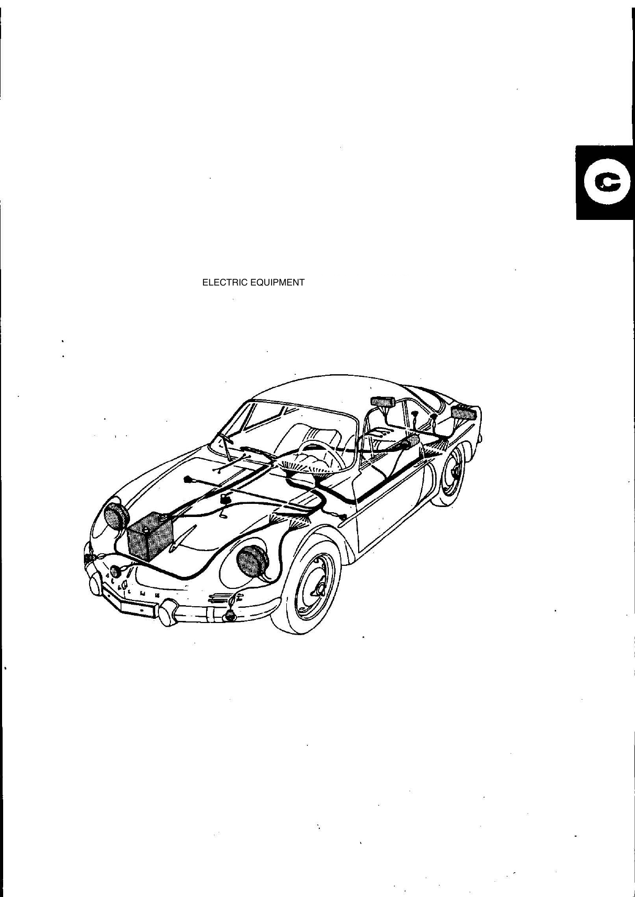
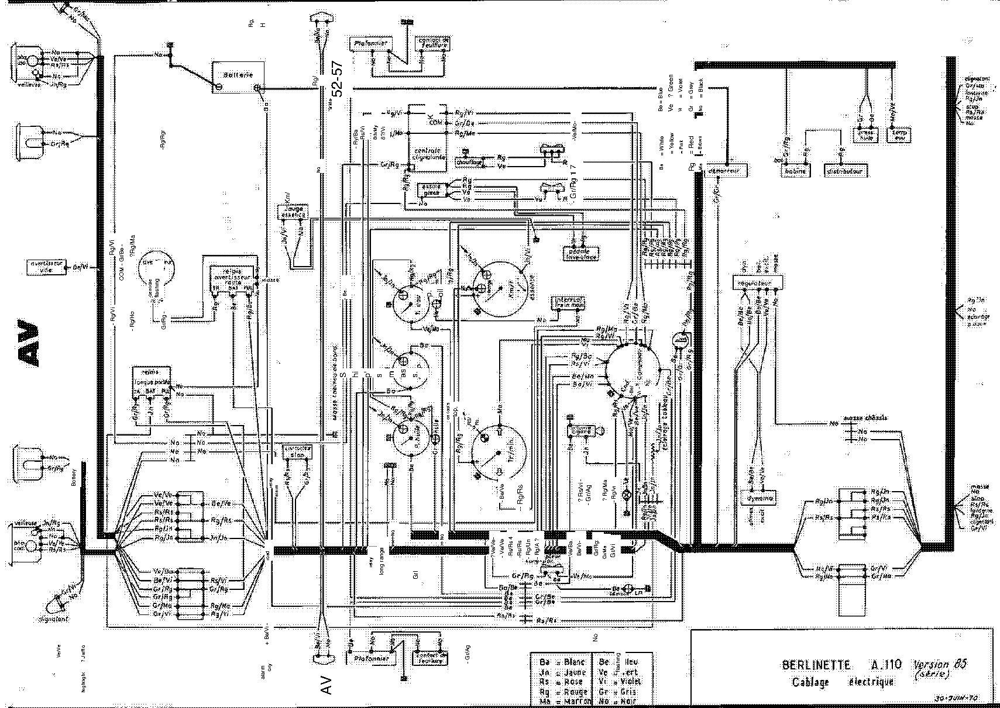

<!-- Source note: PDF pages 26-29. Page 26 is the unnumbered illustrated section plate;
     pages 27-28 are manual pages C-1 and C-2; page 29 is the full wiring diagram, which is
     still in FRENCH (untranslated) and is delivered as an image.
     English machine translation of the French original — many component names are garbled
     (DEMARRIER = démarreur = starter, ALLUMER = allumeur = distributor, BOUGIES = spark
     plugs, PHARES = headlamps, ESSUIE-GLACE = windscreen wiper). Part numbers and values
     are transcribed exactly as printed. -->

# C — Electrical Equipment (Équipement électrique)

Section **C**, source PDF pages 26–29, manual pages **C-1** and **C-2**.

**[PDF p.27]**

## C-1 — Electrical equipment, items 1–10

| # | Item | 85 | 1300 G · 1300 S | 1600 S |
| --- | --- | --- | --- | --- |
| 1 | **Starter** (*démarreur*) — type | DUCEL 12 V 6187 (type R 1170) | PARIS-RHONE 12 V D8 E75 (type R 1190) | DUCEL 12 V 6183 (Type R 1151) |
| | Locked pinion torque | 1.25 m da/N | 1.05 m da/N | 1.25 m da/N |
| | Intensity, sprocket blocked | 380 A | 380 to 420 A | 375 A |
| 2 | **Alternator or dynamo** — type | GEN BOSCH 12 V 0101302103, 14 V 30 A 25 | ALT SEV-MOTOROLA 12 V A 14/30-40 | ALT SEV-MOTOROLA 12 V A 14/30-40 |
| | Normal intensity | 30 A | 30 A at 3000 +/m under 13.2 V | 30 A at 3000 +/m under 13.2 V |
| | Fitted to | type R1190 — cold climates | type R 1135 | type R 1135 |
| 3 | **Regulator** | BOSCH 14 V 30 A 0190309019, type R 1190 — cold climates | DUCEL 8364, 12 V, type R1135 | DUCEL 8364, 12 V, type R1135 |
| 4 | **Distributor** (*allumeur*) | see [B — Engine and Ignition](b-engine-ignition.md#b-15-8-ignition-allumage) | see engine chapter | see engine chapter |
| 5 | **Spark plugs** (*bougies*) | see [B — Engine and Ignition](b-engine-ignition.md#b-15-8-ignition-allumage) | see engine chapter | see engine chapter |
| 6 | **Oil pressure sender** | Jaeger 12 V, 6 bars, No 6000000624 | Jaeger 12 V, 6 bars, No 6000000624 | Jaeger 12 V, 6 bars, No 6000000624 |
| 7 | **Oil and water temperature thermistor** | Jaeger 12 V, No 0853989600, type R 1151 | Jaeger 12 V, No 0853989600, type R1151 | Jaeger 12 V, No 0853989600, type R1151 |
| 8 | **Thermo-contact MOSTA — oil radiator fan** | — | — | 82/92: 12 V, No 0855957600, identical to MOSTA water R1151 |
| 9 | **Thermo-contact MOSTA — water radiator fans** | — | Jaeger 12 V, 75/84°, Peugeot type | Jaeger 12 V, 75/84°, Peugeot type |
| 10 | **Fan motor — water radiator** | — | Rabotti 12 V, No 6000000631 | Rabotti 12 V, No 6000000631 |
| | **Fan motor — oil radiator** | — | — | Rabotti 12 V, No 6000000631 |

<!-- NEEDS REVIEW:
(1) "DEMARRIER" is French "démarreur" = starter motor; "ALLUMER" is "allumeur" = distributor;
    "BOUGIES" = spark plugs; "ALTERNATOR OR GENERATRICE" = alternator or dynamo;
    "PRESSURE TRANSMITTOR OIL (TRAMA)" = oil pressure transmitter/sender;
    "ELTRA THERMISTANCE" = thermistor sender; "MCTO VENTILATOR" = "moto-ventilateur" = fan
    motor. Labels restored; no value changed.
(2) "DUCEL" is printed throughout for DUCELLIER — left as printed.
(3) "Great colds" is French "grands froids" = cold-climate (specification), not a product
    name.
(4) "30A to 3000 +/m" — "+/m" is the scan's rendering of "t/min" (rpm); the 1600 S cell also
    OCRs "SOus 13.2 V" for "sous 13.2 V" (= under 13.2 V). Numbers unchanged.
(5) The 1300 G-1300 S normal-intensity cell carries a stray "?" on the page.
(6) Cells shown "—" are blank on the page (that row does not apply to that version), NOT
    zero. Row 8 applies only to the 1600 S; rows 9/10 are blank for the 85 (which has a
    rear radiator cooled by an engine-driven fan — see B-13).
(7) The 85 column groups "type R1190 / Great colds" under both the alternator and the
    regulator; rendered as a separate "Fitted to" row above. -->

**[PDF p.28]**

## C-2 — Electrical equipment, items 11–24

| # | Item | 85 | 1300 G · 1300 S | 1600 S |
| --- | --- | --- | --- | --- |
| 11 | **Ammeter or voltmeter** | Ammeter Jaeger 30 A, No 6000000059 | Voltmeter Jaeger 12 V, No 0855808900, type R1135 | Voltmeter Jaeger 12 V, No 0855808900, type R1135, **or** Ammeter 30 A No 6000000059 on *Mills* versions |
| 12 | **Oil pressure gauge** | Jaeger 12 V | Jaeger 12 V | Jaeger 12 V |
| 13 | **Water temperature gauge** | Jaeger 12 V | Jaeger 12 V | Jaeger 12 V |
| 14 | **Oil temperature gauge** | Jaeger 12 V | Jaeger 12 V | Jaeger 12 V |
| 15 | **Test indicator** | in block — Veglia meter | in block — Veglia counter | in block — Veglia counter |
| 16 | **Block** | Viglia 12 V | Viglia 12 V | Viglia 12 V |
| 17 | **Block account** | Veglia | Veglia | Veglia |
| 18 | **Headlamp relays — iodine, anti-fog / long-range** | DUCEL 12 V 22621 | DUCEL 12 V 22621 | DUCEL 12 V 22621 |
| 19 | **Windscreen wiper motor** | SEV 12 V, derivative R1133 | SEV 12 V, derivative R 1133 | SEV 12 V, derivative R 1133 |
| 20 | **Heater motor** | Sofica 12 V, type R1135 | Sofica 12 V, type R 1135 | Sofica 12 V, type R 1135 |
| 21 | **Lighting switch** (*commodo éclairage*) | Jaeger type R1132 | Jaeger type R 1132 | Jaeger type R1132 |
| 22 | **Road headlamps** (*phares route*) | Cibié Ø 180 | Cibié Ø 180 | Cibié Ø 180 |
| 23 | **Long-range lamps** | Iodine Cibium Ø 162 | Iodine Cibium Ø 162 | Iodine Cibium Ø 162 |
| 24 | **Road horn** | DUCEL Tenor | DUCEL Tenor | DUCEL Tenor |

<!-- NEEDS REVIEW:
(1) "AMPEREMETTER OR VOLTO" is "ampèremètre ou voltmètre"; "WISE-VITER MOTOR" is
    "moteur essuie-glace" = windscreen wiper motor; "COMMODO ECLAIRAGE" is the lighting
    stalk switch; "ROAD PHARES" is "phares route" = main-beam headlamps;
    "LONG-RANGE PASSENGERS" is "phares longue portée" = long-range driving lamps;
    "ROAD WARNING" is "avertisseur route" = road horn (an audible warning, not a lamp —
    the wiring diagram on p.29 shows both "avertisseur ville" and "avertisseur route").
(2) Rows 15/16/17 ("TEST INDICATOR", "BLOCK", "BLOCK ACCOUNT") are translations of French
    instrument-cluster terms that are not recoverable from this copy — most likely the
    speedometer/odometer assembly ("compteur" = counter/speedometer, "bloc" = cluster).
    Left as printed; do not rely on the English names.
(3) "Viglia" (rows 16) and "Veglia" (rows 15, 17) are both printed — Veglia Borletti is the
    maker; the spelling varies on the page and is left as printed.
(4) Row 18 prints "PHARES in IODE-ANTI-BROUGHT-BROUGHTER" — "phares iode, anti-brouillard"
    = iodine (quartz-halogen) headlamps and fog lamps. Rendered above; verify.
(5) "on versions Mills" (row 11, 1600 S) is untranslated and not recoverable.
(6) "DUCEL I2V" in row 18 of the 1600 S column uses a capital I for the digit 1 — an OCR
    artifact; the value is 12 V. -->

**[PDF p.29]**

## C — Wiring diagram

The wiring diagram occupies a full landscape page and is **still in French** — it was not
translated. It is delivered as an image; read it directly rather than from any transcription.

Title block as printed: **BERLINETTE A.110 Version 85 (série) — Câblage électrique —
30-JUIN-70**.

### Wire colour key (from the diagram's own legend)

| Code | French | English |
| ---- | ------ | ------- |
| Ba | Blanc | White |
| Jn | Jaune | Yellow |
| Rs | Rose | Pink |
| Rg | Rouge | Red |
| Ma | Marron | Brown |
| Be | Bleu | Blue |
| Ve | Vert | Green |
| Vi | Violet | Violet |
| Gr | Gris | Grey |
| No | Noir | Black |

A two-code wire label such as `Rg/Ma` is a red wire with a brown tracer.

<!-- NEEDS REVIEW: this colour key is transcribed from the diagram's own printed legend and
is the one part of p.29 that survives as text. The rest of the diagram — component labels,
connector positions, circuit routing — is NOT transcribed and must be read from the image
or the source PDF p.29. Note the diagram is captioned "Version 85" only: no wiring diagram
for the 1300 G, 1300 S or 1600 S appears in this scan. See 10-needs-review.md. -->

---

**Previous:** [B — Engine and Ignition](b-engine-ignition.md) · **Next:** [D — Clutch](d-clutch.md)
