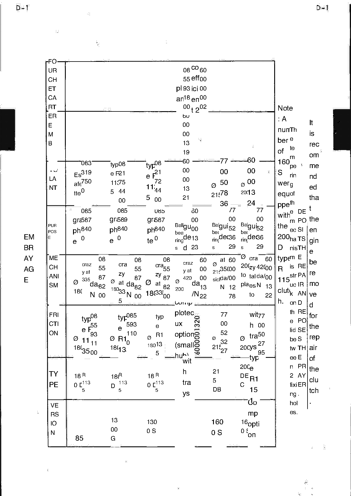

<!-- Source note: PDF pages 30-32. Page 30 is the unnumbered illustrated section plate
     ("EMBRAYAGE"); page 31 is manual page D-1; page 32 is D-2.
     Page 31 (D-1) is a wide table whose English translation overlay is rotated and
     superimposed on the French original — it is UNREADABLE as text in this copy and is
     delivered as an image only, NOT transcribed. See Rule 12 / 10-needs-review.md. -->

# D — Clutch (Embrayage)

Section **D**, source PDF pages 30–32, manual pages **D-1** and **D-2**.

**[PDF p.31]**

## D-1 — Clutch characteristics table

This page is a single wide characteristics table covering the fork, bellhousing, release
bearing, mechanism, friction plate and type, by version (85 · 1300 G · 1300 S · 1600 S ·
1600 GS option). **The English translation in this copy is overlaid at 90° on the French
original and the result is illegible** — column headings, part numbers and values all
collide. Nothing from it is transcribed here, because no reading of it would be
trustworthy.

Fragments that are legible on the page, recorded only as orientation — **not as data**:

- Row headings (French, down the left edge): *FOURCHETTE · CARTER EMB[RAYAGE] · VOLANT ·
  BUTÉE(?) · MÉCANISME · FRICTION · TYPE · VERSION*, under the section title *EMBRAYAGE*.
- Version columns: 85 · 1300 G · 1300 S · 1600 S · 1600 (GS) option.
- A note in the right margin reads, in part: *"A number of 160 S were equipped with the
  200 D type R 115 clutch."* and *"It is recommended that the engine be removed for the
  repair of the clutch."*

<!-- NEEDS REVIEW:everything in this section is provisional. The row headings above are
reconstructed from partial letters down the left edge of the page image and are NOT
certain. The marginal note is pieced together from fragments ("A number of 160 S wer
equipped with the 200 D type R 115 clutch", "It is recommended that the engine be removed
for the repair of the clutch") and the model designation "160 S" is almost certainly
"1600 S" with a dropped digit — but it is left as it reads. NO part number, torque,
diameter or thickness from this page has been transcribed, because none can be read
reliably. Use the source PDF p.31 directly.
     TRIAGE 2026-10-06 (TypeSafe/Jev, classification only — no value supplied or confirmed by the model): keep_safety · next step: verify_against_pdf_page · leaves-undecided 0.99 · risk-if-guessed 0.74 · blocks-a-job 0.66 -->

**[PDF p.32]**

## D-2 — Note on the competition clutch

> **IMPORTANT — 200 DEC competition clutch.**
>
> In the disengaged (*débrayé*) position this type of clutch makes a noise similar to that
> caused by an insufficiently seated release bearing. This characteristic noise is normal;
> its origin is in a "vibra-…"

<!-- NEEDS REVIEW:the note breaks off mid-word on the page ("its origin in a \"vibra-")
and the following line reads "In its guidebook, \"the plateau \" is used." — the French
sentence is incomplete or mis-ordered in the translation and its ending is not recoverable
from this copy. "debray" is French "débrayé" = disengaged; "plateau" is the clutch pressure
plate. "200 DEC" is as printed; the D-1 margin note mentions a "200 D" clutch, so the
designation may be "200 D" plus something — unresolved.
     TRIAGE 2026-10-06 (TypeSafe/Jev, classification only — no value supplied or confirmed by the model): keep_safety · next step: verify_against_pdf_page · leaves-undecided 0.98 · risk-if-guessed 0.46 · blocks-a-job 0.36 -->

## Missing pages in this scan

<!-- NEEDS REVIEW:ABRIDGED SCAN — section D ends at D-2 in this scan. Whether the factory's section D continued past D-2 is not determinable from this copy.
     TRIAGE 2026-10-06 (TypeSafe/Jev, classification only — no value supplied or confirmed by the model): keep_safety · next step: record_as_source_defect · leaves-undecided 0.98 · risk-if-guessed 0.61 · blocks-a-job 0.38 -->

See [10-needs-review.md](10-needs-review.md) and [../README.md](../README.md).

---

**Previous:** [C — Electrical Equipment](c-electrical-equipment.md) · **Next:** [E — Gearbox](e-gearbox.md)
