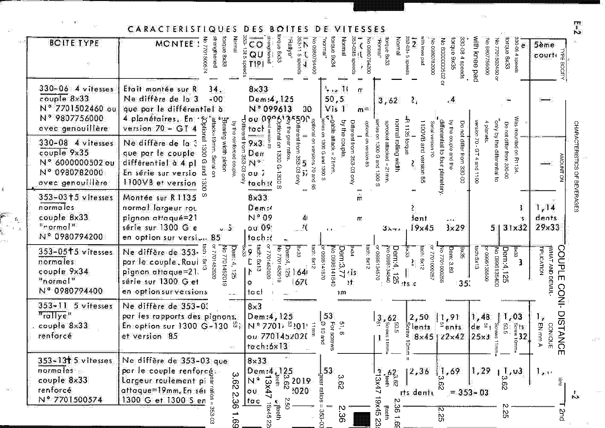
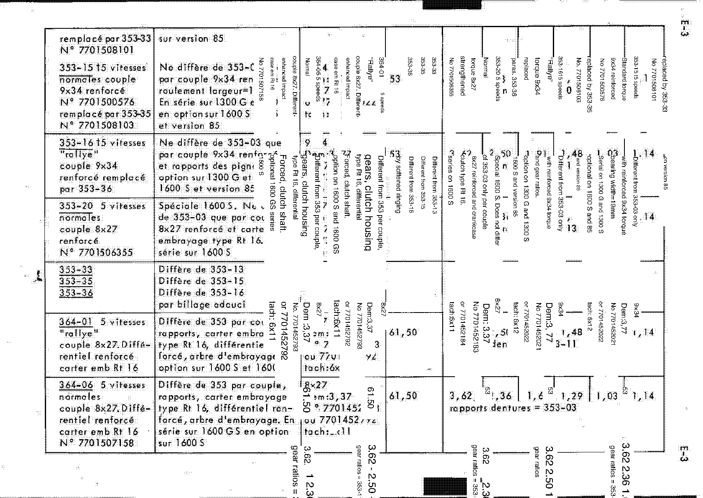

<!-- Source note: PDF pages 33-37. Page 33 is the unnumbered illustrated section plate
     ("BOÎTE DE VITESSES"); pages 34-37 are manual pages E-1 to E-4.
     Pages 35 and 36 (E-2, E-3) are the wide gearbox characteristics table. On those two
     pages the English translation is overlaid at 90 degrees across the French original,
     which destroys the ratio columns; the FRENCH left-hand columns remain readable and are
     transcribed, the ratio columns are NOT. Both pages are delivered as images. -->

# E — Gearbox (Boîte de vitesses)

Section **E**, source PDF pages 33–37, manual pages **E-1** to **E-4**.

**[PDF p.34]**

## E-1 — Identification

The type, the index and the fabrication number are shown on a plate at the front of the
casing.

Example as printed: **Type 353-03**.

The page carries an external view of the gearbox and a **longitudinal section of gearbox
353**.

<!-- NEEDS REVIEW: "BOX OF VITSES" is French "boîte de vitesses" = gearbox; "brication" is a
truncated "fabrication"; "Carver" is "carter" = casing/housing; "LONGITUDINAL CCUPE" is
"coupe longitudinale" = longitudinal section. No values on this page. -->

**[PDF p.35]**

## E-2 / E-3 — Gearbox characteristics (*Caractéristiques des boîtes de vitesses*)

> **Read these two pages from the images, not from text.** The ratio, final-drive and
> cone-distance columns are unreadable in this copy — the English overlay sits across them
> at 90°. Only the French left-hand description column survives intact, and it is
> transcribed below.

### Gearbox types (from the French description column)

| Box type | Speeds | Final drive (*couple*) | Part No. | Description as printed (French) |
| -------- | ------ | ---------------------- | -------- | ------------------------------- |
| 330-06 | 4 | 8×33 | 7701502460 or 9807756000, *avec genouillère* | *Était montée sur R.1134. Ne diffère de la 330-00 que par le différentiel à 4 planétaires. En série sur version 70 – GT 4…* |
| 330-08 | 4 | 9×35 | 6000000502 or 0980782000, *avec genouillère* | *Ne diffère de la 330-06 que par le couple différentiel à 4 planétaires. En série sur version 1100 VB et version…* |
| 353-03 | 5 (normal) | 8×33 "normal" | 0980794200 | *Montée sur R.1135, normal largeur roulement pignon attaqué = 21 mm, série sur 1300 G et en option sur version 85* |
| 353-05 | 5 (normal) | 9×34 "normal" | 0980794400 | *Ne diffère de 353-03 que par le couple. Roulement pignon attaqué = 21 mm, série sur 1300 G et en option sur versions…* |
| 353-11 | 5 "rallye" | 8×33 *renforcé* | 7701452019 / 7701452020 | *Ne diffère de 353-03 que par les rapports des pignons. En option sur 1300 G – 1300 S et version 85* |
| 353-13 | 5 (normal) | 8×33 *renforcé* | 7701500574 | *Ne diffère de 353-03 que par le couple renforcé. Largeur roulement pignon attaqué = 19 mm. En série sur 1300 G et 1300 S…* |
| 353-15 | 5 (normal) | 9×34 *renforcé* | 7701500576, replaced by **353-35** No 7701508103 | *Ne diffère de 353-03 que par couple 9×34 renforcé, roulement largeur = 19 mm(?). En série sur 1300 G et en option sur 1600 S et version 85* |
| 353-16 | 5 "rallye" | 9×34 *renforcé* | replaced by **353-36** | *Ne diffère de 353-03 que par couple 9×34 renforcé et rapports des pignons. Option sur 1300 G et 1600 S et version 85* |
| 353-20 | 5 (normal) | 8×27 *renforcé* | 7701506355 | *Spéciale 1600 S. Ne diffère de 353-03 que par couple 8×27 renforcé et carter embrayage type Rt 16. Série sur 1600 S* |
| 353-33 | — | — | 7701508101 | *Diffère de 353-13 … par billage adouci* |
| 353-35 | — | — | 7701508103 | *Diffère de 353-15 … par billage adouci* |
| 353-36 | — | — | — | *Diffère de 353-16 … par billage adouci* |
| 364-01 | 5 "rallye" | 8×27, *différentiel renforcé*, *carter emb. Rt 16* | 7701452792 / 7701452793 | *Diffère de 353 par couple, rapports, carter embrayage type Rt 16, différentiel renforcé, arbre d'embrayage. Option sur 1600 S et 1600 (GS)* |
| 364-06 | 5 (normal) | 8×27, *différentiel renforcé*, *carter emb. Rt 16* | 7701507158 | *Diffère de 353 par couple, rapports, carter embrayage type Rt 16, différentiel renforcé, arbre d'embrayage. En série sur 1600 GS, en option sur 1600 S* |

<!-- NEEDS REVIEW: this table is transcribed from the FRENCH column of the page images.
(1) Several descriptions are cut off at the right-hand edge where the English overlay
    begins; those are shown ending with "…". Words shown in brackets or marked (?) were
    inferred from partial letters.
(2) "avec genouillère" (330-06, 330-08) is a knuckle-joint gear linkage; "billage adouci"
    (353-33/35/36) is softened detent balling; "pignon attaqué" is the crown-wheel pinion;
    "renforcé" is reinforced/strengthened. Left in French deliberately — the English overlay
    renders these as "knee pad", "softened ringing" and "attacked sprocket", which are
    machine-translation artifacts, not terms.
(3) Part numbers are transcribed digit-for-digit from the French column where it is clean.
    Where a number appears only in the overlaid English columns it is NOT recorded here.
(4) NO gear ratio, final-drive ratio (Dem:) or cone distance is transcribed. Fragments
    visible on the pages include "Dem: 4,125", "Dem: 3,89", "Dem: 3,77", "Dem: 3,37" and
    ratio sets such as "3,62 / 2,50 / 1,91 / 1,48 / 1,03" (353-11) and
    "3,62 / 2,36 / 1,69 / 1,29 / 1,03" (353-13 / 364-06) — these are NOT reliable, because
    the column each belongs to cannot be determined under the overlay. Read them from the
    source PDF pp.35–36 before using them. -->

**[PDF p.37]**

## E-4 — Section drawing and interventions

The page opens with a longitudinal section of the gearbox, with dimension **A** marked at
the rear.

> **NOTE:** The tachometer drive is taken by a square drive, as there is no reference as on
> the RENAULT 8 GORDINI.

> **NOTE:** There is an optional **"Hewland" self-locking differential**, competition only.

<!-- NEEDS REVIEW: "Tachymeter training is done by a square" is French "l'entraînement du
tachymètre se fait par carré" = the speedometer/tachometer drive is a square drive;
"self-locking bridge" is "pont autobloquant" = limited-slip / self-locking differential
("pont" = axle/final drive, not bridge). -->

### Removing and refitting the gearbox

In general, proceed as for the removal of the gearbox on vehicles of the Renault 8 and 10
range.

- **Versions 85, 1300 G and 1300 S:** it is possible to drop the gearbox only.
- **Versions 1600:** it is advisable to drop the complete powertrain.

> **NOTE:** When refitting, do not omit to pull up the mounts between the side pads and the
> central box and crossmember.

<!-- NEEDS REVIEW: "DEPOSITED AND REPOSED BY THE B.V." is "dépose et repose de la B.V."
(boîte de vitesses) = gearbox removal and refitting; "When rewinding" is "au remontage" =
on reassembly; "the holds" is "les cales" or "les attaches" — the exact fastening named is
not recoverable. Verify step wording against the source PDF p.37. -->

### Gearbox adjustment

The procedure and the setting values remain the same as those of boxes **330-00** or
**353-13**. Check however the **conical distance** given in the characteristics table.

- For boxes **330-06** and **330-08** refer to **MR. 131**.
- Boxes **353** and **364** refer to **MR 133 (R 1135)**.

<!-- NEEDS REVIEW: the heading is printed "STRENGTHENING OF THE CITY OF VITSES" — a machine
translation of a French heading about the boîte de vitesses whose first word is not
recoverable ("réglage" = adjustment is the reading that fits the body text, but it is a
guess and is flagged as such). "Conical distance" is "distance conique" = the crown-wheel /
pinion cone setting distance. -->

### Replacing the gear linkage

1. Remove the gear lever cup and lever housing.
2. Disconnect the rod at the side coupling box.
3. Pull the rod/lever assembly out backwards and downwards.
4. Separate the lever from the rod.

> If the rod is difficult to release, unbolt the rear engine mounting so as to raise the
> nose of the gearbox.

<!-- NEEDS REVIEW: the heading is printed "REPLACEMENT OF THE VITES AND LEVEL CONTROL
BREAKDOWN." and the sub-heading "VITSES" — French "vitesses"; the full heading is not
recoverable (it probably covers the gear-change linkage and the oil level check, but the
page gives no level-check text). Steps above are the readable procedure only. -->

## Missing pages in this scan

<!-- NEEDS REVIEW: ABRIDGED SCAN — section E ends at E-4 in this scan. Pages E-2 and E-3 are present but illegible (see above), so of the four pages only E-1 and E-4 are usable as text. -->

See [10-needs-review.md](10-needs-review.md) and [../README.md](../README.md).

---

**Previous:** [D — Clutch](d-clutch.md) · **Next:** [G — Steering](g-steering.md)
