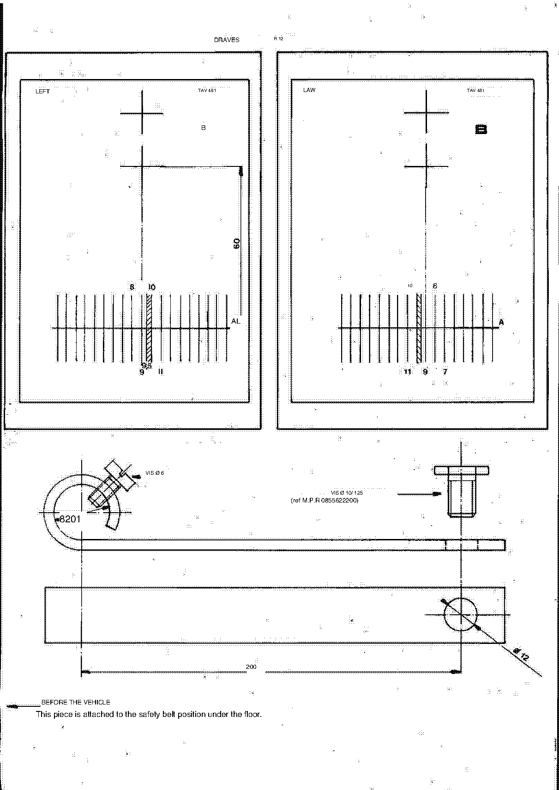

<!-- Source note: PDF pages 40-44. Page 40 is the unnumbered illustrated section plate
     ("TRAIN AVANT"); pages 41-43 are manual pages H-1 to H-3; page 44 is the unnumbered
     drawing of the locally-made castor-measuring flags referenced by step (i) on H-2.
     Throughout this chapter: "hunting" = French "chasse" = CASTOR; "carrossing" =
     "carrossage" = CAMBER; "parallelism" = "parallélisme" = TOE; "clamps"/"pinching" =
     "pincement" = TOE-IN; "opening" = "ouverture" = TOE-OUT; "train" = "train" = axle
     assembly; "AV" = avant = front, "AR" = arrière = rear, "D"/"G" = droite/gauche =
     right/left. -->

# H — Front Axle (Train avant)

Section **H**, source PDF pages 40–44, manual pages **H-1** to **H-3**.

**[PDF p.41]**

## H-1 — Description

Deformable transverse quadrilateral (double wishbone), using the same elements as the
**RENAULT 8 GORDINI**:

- Upper wishbone (*triangle supérieur*).
- Lower wishbone (*triangle inférieur*).
- Stub-axle carrier (*porte-fusée*).

However, the positioning of the lower wishbone on the crossmember is modified in order to
obtain **negative camber**: the fastening points are moved **9 mm outwards**.

<!-- TRANSLATION NOTE (triaged: nothing left undecided, no value at stake):"Rocket door" is French "porte-fusée" = stub axle carrier / upright
("fusée" is the stub axle, not a rocket). "a nega-tif" is "carrossage négatif" = negative
camber, split across a line break in the translation. -->

**[PDF p.41]**

## H-1 — Regulatory values (geometry settings)

> **SAFETY-RELEVANT.** These are the wheel-alignment settings. Read the flags below before
> using them.

### Up to bodywork No. 2162

| Setting | Value as printed |
| ------- | ---------------- |
| Camber (*carrossage*) | 1°40 **positive** |
| Castor (*chasse*) | 9°:1 |
| Toe (*parallélisme*) | between 1 mm toe-out (*ouverture*) and 2 mm toe-in (*pincement*) |

### From bodywork No. 2162

| Setting | Value as printed |
| ------- | ---------------- |
| Camber (*carrossage*) | 1°30 **negative** |
| Castor — direct (quick) steering | 8°30 ± 30′ |
| Castor — normal steering | 7°30 ± 30′ |
| Toe (*parallélisme*) | 2 mm ± 1, toe-out (*ouverture*), in the mid-load position |

<!-- NEEDS REVIEW — SAFETY-RELEVANT, wheel alignment.
(1) The castor tolerances print as "8°30: 30" and "7°30$30" — the ":" and "$" are OCR
    artifacts of the ± sign; read as ± 30 minutes. The DEGREE values 8°30 and 7°30 are
    unchanged and are legible on the page image.
(2) The pre-2162 castor cell prints "9°:1." — this could be 9° ± 1° (matching the ± pattern
    of the post-2162 rows) or something else entirely. It is NOT resolved; left exactly as
    printed. Do not assume a tolerance.
(3) The post-2162 toe prints "Parallelism, 2mm:l in mid-load position. (Opening)" — read as
    2 mm ± 1 mm, toe-out. The ":l" is the same ± artifact followed by a 1 OCR'd as a letter
    l. Verify against the source PDF p.41.
(4) The camber sign FLIPS at bodywork No. 2162, from 1°40 positive to 1°30 negative — this
    is what the page says and it is consistent with the 9 mm outward move of the lower
    wishbone mounts described above. Check your car's bodywork number before setting camber.
(5) "Clamps" in the pre-2162 toe row is "pincement" = toe-in, and "opening" is "ouverture" =
    toe-out; the row therefore gives a range that spans from toe-out to toe-in. -->

**[PDF p.42]**

## H-2 — Front axle alignment method

With a **Facom 470** device or **BEM** optical device.

### 1) Preliminary verifications

(See **MR 101**, fascicle **G 100**.)

- Check the tyre pressures.
- Check joint play, etc.
- Check rim run-out (*voile des jantes*) — the BEM apparatus neutralises the latter.

**Castor angles.** The castor values taken from the two half-axles must be equalised to
within a tolerance of **1°** — preferably obtaining the higher value on the right-hand (D)
side.

<!-- TRANSLATION NOTE (triaged: nothing left undecided, no value at stake):"the sail of the rims" is "le voile des jantes" = rim run-out/wobble;
"Articulation games" is "jeux des articulations" = play in the joints; "must be ega-" is
"égalisées" = equalised, truncated on the page; "(pre- we'll try to get the value the
highest on side D)" is "(de préférence on cherchera à obtenir la valeur la plus élevée du
côté D)". Side D = droite = right. -->

### Steering rack mounting supports

Two types of mounting were used:

- Welded brackets on the front crossmember.
- Bolted supports on the front crossmember, available under **three references**, differing
  by the centre distance between the centre of the housing mounting hole and the centre of
  the upper fixing hole on the crossmember:

| Support | Centre distance | Part No. |
| ------- | --------------- | -------- |
| Standard support | 55 mm | 6000000557 |
| Enhanced support | 56 mm | 6000000351 |
| Upgraded support | 57 mm | 6000001352 |

The figures **56** and **57 mm** are stamped on the **rear face** of the supports.

The supports have the effect of placing the rack relative to the steering arms in a
position such that the variation of toe between the mid-load and high positions always
moves towards a **decrease of toe-out, from 0 to 2 mm per half-axle** (front toe-in under
these conditions).

<!-- NEEDS REVIEW:"interax" is French "entraxe" = centre distance; "rudder" is "biellettes"
or "leviers de direction" — the exact component is not recoverable, rendered as "steering
arms" from context; "rack bits" is "les embouts de crémaillère" = rack ends.
The three part numbers are transcribed digit-for-digit from the page image; note the
standard support is numbered 6000000557 (10 digits) while the other two are 6000000351 and
6000001352 — the inconsistency is as printed. These part numbers match the H = 55/56/57 mm
supports described on G-1.
     TRIAGE 2026-10-06 (TypeSafe/Jev, classification only — no value supplied or confirmed by the model): keep_safety · next step: close_as_documentation · leaves-undecided 0.83 · risk-if-guessed 0.56 · blocks-a-job 0.26 -->

### 2) Checks and settings

| Step | Operation |
| ---- | --------- |
| a | Carry out the checks after a road test, or rock the car. |
| b | Stabilise the vehicle on a level area. |
| c | Centre the steering with the aid of jig **DIR 326** (locate it on the … side). |
| d | Make a brief alignment of the front wheels. |
| e | Check the bodywork angle. |
| f | Place the vehicle on turntables (*plateaux pivotants*). |
| g | Lock the wheels with the pedal press. |
| h | Obtain the mid-load position by placing the fore-and-aft stays **56 A** between the upper wishbone and the sill member (*longeron*). |
| i | Set up the axle-to-axle flags, modified before No. 481, and the locally-made supports (see the sketch at the end of the chapter) — of the **TAV 246** with the aid of a bungee under the gearbox at **1.30 m** from the front wheel axis. |
| j | Using the equipment available, point the needle or light beam on the cross centre of the flag. Then decompress the front axle to bring the needle or light beam onto the graduated scale. |
| k | If the needle falls inside the hatched area, the adjustment of the wishbone heights is correct. |
| l | If the needle falls outside the area, act on the eccentric of the inner wishbone to bring the … into this area. In that case, redo steps h–i and i, check the result, and repeat as often as necessary. |
| m | Check the castor angle (a maximum difference of **1°** is allowed between sides D and G). |
| n | Finally, set the toe in the mid-load position and perfect the wheel movement. |

> **If the castor difference is greater than 1°:** change the position of the steering
> housing on the crossmember — by ovalising the fixing holes in the case of welded
> supports, or by replacing the steering support(s) with one of **55, 56 or 57 mm** as
> appropriate.
>
> Surveys carried out on a production basis have shown that in general it was necessary to
> raise the boxes on the right by replacing a **55** support with a **56 mm** support.

> **NOTE:** If after this operation the castor-angle readings still cannot be brought within
> tolerance, it will be necessary to check the front-axle elements.

<!-- NEEDS REVIEW — this procedure is heavily damaged by the translation.
(1) Step c prints "Centre management with the help of cava- bind DIR 326 (plocate the
    latter side)" — "centrage de la direction à l'aide du calibre DIR 326"; the bracketed
    instruction is not recoverable.
(2) Step g prints "Block the wheels with the press-pedal" — "bloquer les roues avec le
    presse-pédale" (a brake-pedal clamp).
(3) Step h prints "the forward-rail holds 56 A between triangle Superior and longeron" —
    the tool designation "56 A" and the dimension are as printed; "longeron" is the chassis
    sill member and is left in French.
(4) Step i mixes two sentences on the page; "sandow" is a bungee/elastic cord, kept.
    "TAV 246" and "481" are as printed. The 1.30 m dimension is legible.
(5) Step l prints "to bring the Guarantor or radius in this area" — the component named is
    not recoverable ("Guarantor" is a machine-translation artifact).
(6) Step m prints "maximum rate of 1o is allowed" — "1o" is 1° (degree sign OCR'd as the
    letter o).
(7) The note at the end prints "I don't know." where the French names a tool or reference —
    not recoverable.
(8) "FOREIGN TRAIN RELATIONSHIP METHOD" (H-2 heading) and "FOREIGN TRAIN" (H-3) are machine
    translations of a French heading about the train AVANT (front axle) — "AV" was read as
    a word rather than an abbreviation. -->

**[PDF p.43]**

## H-3 — Removal, overhaul and refitting — front axle

See **MR 68** or **MR 131**.

<!-- NEEDS REVIEW:the heading prints "DEPOSITED - STATE REMISSION - REPCSE / FOREIGN
TRAIN" — French "dépose, remise en état, repose / train avant" = removal, overhaul,
refitting / front axle.
     TRIAGE 2026-10-06 (TypeSafe/Jev, classification only — no value supplied or confirmed by the model): keep_safety · next step: needs_french_original · leaves-undecided 0.95 · risk-if-guessed 0.69 · blocks-a-job 0.52 -->

---

**Previous:** [G — Steering](g-steering.md) · **Next:** [J — Rear Axle](j-rear-axle.md)
