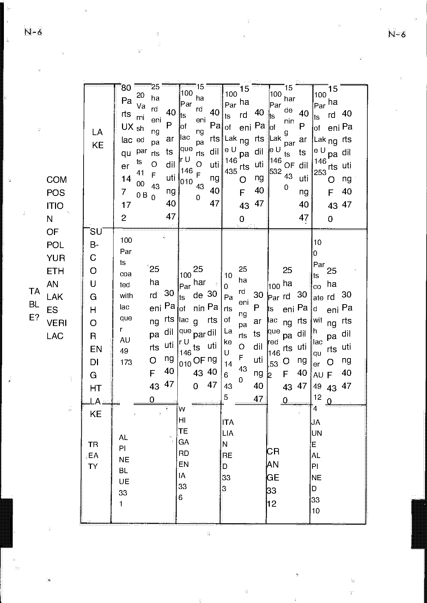

<!-- Source note: PDF pages 51-57. Page 51 is the unnumbered illustrated section plate
     ("CARROSSERIE"); pages 52-56 are manual pages N-1 to N-5; page 57 is Table 2 (lacquer
     composition), whose English overlay is rotated across the French original and which is
     delivered as an image only.
     This chapter is the most heavily damaged by the machine translation: in several places
     the translator emitted "I'm sorry." / "That's right." / "You're a biante." where the
     French text continued. Those gaps are marked and NOT filled in. -->

# N — Bodywork (Carrosserie)

Section **N**, source PDF pages 51–57, manual pages **N-1** to **N-5**.

Section N continues to **N-13** in the factory's own numbering — the update supplement cites
page N-13 — but this scan stops at **N-5**. See [10-needs-review.md](10-needs-review.md).

**[PDF p.52]**

## N-1 — Characteristics

Polyester bodywork consisting of two main elements:

- **1 floor frame or platform**
- **one hull** (*coque*)

These two elements are joined on a **backbone chassis** with polyester resin and woven glass
fabrics, making up a very rigid and light assembly — about **100 kg** for the hull and
**50 kg** for the chassis.

Removable elements:

- Doors
- Front and rear bonnets (*capots AV and AR*)

These require adjustment on each vehicle. As replacement parts they are delivered with the
ribs at maximum to allow their adjustment to the bodyshell.

> **NOTE:** As an option, ALPINE can supply **lightened hulls** for competition use; the
> weight saving can reach **30 to 40 kg**.

<!-- NEEDS REVIEW: "chas-beam" is "châssis poutre" = backbone chassis; "otters" is a
truncated artifact at the end of the chassis-weight sentence and carries no value; "Cap AV
and AR" is "capots AV et AR" = front and rear bonnets; "weight gain" is "gain de poids" =
weight SAVING, not gain. The 100 kg / 50 kg / 30-40 kg figures are legible and unchanged. -->

**[PDF p.52]**

## N-1 — Materials used and proportions

### 1) Woven fabrics

| Fabric | Weight |
| ------ | ------ |
| Lightweight glass fabric (light ROVING) | 270 g/m² |
| Heavy glass fabric (heavy roving) | 520 g/m² |
| Felt or matt | 300 g/m² |

### 2) Resin

Standard pre-accelerated polyester resin — e.g. **STERPON 1069** pre-accelerated **33 %**.
The resin is used to impregnate the glass fabrics.

### 3) Accelerator

**Cobalt naphthenate at 6 %** — e.g. **NL 51**. Incorporated into the resin, it accelerates
polymerisation.

### 4) Catalyst

**Methyl ethyl ketone peroxide** — e.g. **BUTUNOX** or **TRIGONOX X 40** (faster). The
catalyst initiates the reaction at the time of use.

**USE:** at the time of use, catalyse to **1.5 % by weight (1 to 2 %)**. In the case of a
temperature above **20 °C**, decrease the dose of hardener; in cold weather increase this
proportion.

**POLYMERISATION:** once the mixture is made, a chemical hardening reaction takes place in
**15 to 20 minutes** (depending on the proportions), with a heat release which is required
for the resin to harden. In an inadequately heated space (less than **18 °C**), in high-
humidity air currents, or outdoors, the hardening time is longer. It is therefore necessary
to warm the atmosphere with infra-red, or to increase the dose of catalyst.

<!-- NEEDS REVIEW: "Ree ex:" is "Réf. ex:" = reference, for example; "pre-access AC 33%" is
"pré-accéléré à 33 %"; "Naphthenate of Cobait" is cobalt naphthenate; "TRIGCNOX" is
Trigonox (OCR'd O); "It is therefore necessary to increase the number of workers. / iron the
atmosphere with infra-" is a broken rendering of "il est donc nécessaire de réchauffer
l'atmosphère avec de l'infra-rouge" — the "number of workers" clause is a translation
artifact with no counterpart in the sense; the reading above follows the infra-red clause.
All percentages, temperatures and times are legible and unchanged. -->

**[PDF p.52]**

## N-1 / N-2 — Repair of glass-resin/polyester bodywork

### Materials

A **body repair kit** containing **4 kg of resin** plus the catalyst required and **2 kg of
light and matt fabric** is supplied by the central ALPINE MPR under reference
**6000001354**.

Repairing glass-resin laminate bodywork poses no particular problem: the techniques are
relatively simple and easily learned by non-specialised staff, and the materials used are
the same products used in the manufacture of the part to be repaired.

Two cases must be distinguished in the damage to be treated: either the body shape is
saved, or the damaged part has nothing left of its original configuration.

### 1) Repair of minor damage (without replacement of elements)

Applies where areas are **"delaminated"** — i.e. where the plastic and the glass fabric have
separated.

1. Polish the inner (non-moulded) face perfectly, to remove all traces of paint and grease
   and to activate the surface for a good bond. This work is very often done with a disc
   sander, but in places that are not accessible a wood rasp or a simple scraper is used to
   advantage.
   - The prepared area must always extend about **5 centimetres** beyond the extreme limits
     of the damage to be repaired.
2. Lay the fabrics on the inside, to reunite the edges of a tear or, in the case of a
   delaminated area, to give the laminate back its initial mechanical resistance.
   - Fabrics will preferably be chosen light — approximately **250/300 g/m²** — as they are
     easier to apply, and their number increased so as to reconstitute a thickness equal to
     that of the part being repaired.
   - The pieces of glass cloth are cut so that each is slightly larger than the one it
     covers, to avoid the coincidence of the edges, which would provoke too abrupt a change
     of section.
   - These fabrics are impregnated more conveniently on a flat sheet, then laid up and
     worked with a brush.
3. With the reinforcing work completed and the resin polymerised (if necessary with
   infra-red heating), restore the outer surface: use a rasp or sanding disc to remove, in
   the deteriorated area, the successive layers of paint, primer and gel-coat.
4. Fill with polyester mastic — exactly the work painters do when laying traditional
   mastics on bodywork — then prepare and paint (see the polyurethane paint application
   section).

> **In the event of a tear,** chamfer the edges of the tear to a width **C = 40 to 50 mm**.
> This is done at the "scalex" with an abrasive disc **No. 24** on a rasp or disc grinder.
> Cover the area thus freed of fibre with mixed resin, then apply the polyester mastic.

<!-- NEEDS REVIEW: step 2's reason clause prints "initial qualities of resistance meca- /
I'm sorry." — the machine translation dropped the end of the sentence ("mécanique"); read as
mechanical resistance. "the repairing room" is "la pièce à réparer" = the part being
repaired, read as such. The dimension C = 40 to 50 mm and the abrasive disc No. 24 are
legible. "scalex" is as printed and is not recoverable. -->

### 2) Repair with replacement of a body part

If the body forms are totally destroyed by the impact, the only valid course is to replace
the damaged part.

1. First establish, on the car, the limits of the element to be replaced.
   - Illustrations of the "standard" replacement elements supplied by ALPINE appear in
     plates **82-05 to 82-08 of PR 871**.
2. Cut out the deteriorated part with a saw, then offer up the replacement element.
3. Hold the replacement in position using sheet-metal plates (format about
   **50 mm × 15 mm**), two holes and screws such as **PARKER**.
4. Complete the work as above with the laying of fabrics.
5. With the polymerisation finished, remove the metal plates and continue the surface work:
   sand the edges to a bevel about **5 cm** either side of the junction line, lay and
   impregnate small strips of glass fabric (1 and 2) on the edges, then surface-fill with
   polyester mastic, primer, preparation and painting.

If this work has been well carried out, the repairs are absolutely invisible and in no way
depreciate the solidity of the car. As a bodyshell, it is not diminished.

The work may moreover be carried out by any bodywork workshop, if one or two workers have
followed a few days' training course — and even this condition does not prove really
necessary except for the execution of major work.

To identify the replacement elements, refer to the spare parts catalogue **ALPINE — PR.
871**. The equipment required is nothing out of the ordinary and is already in all bodywork
workshops.

> **NOTE:** Cleaning brushes and containers is done with **acetone**.

<!-- NEEDS REVIEW: "50m/m x 15m/m about" is "50 m/m × 15 m/m environ" — m/m is the French
shorthand for millimetres, rendered as mm above. "As a rossery, they are not diminished" is
"la carrosserie n'en est pas diminuée"; "identify the replacement elements, These must be
carried out by the manufacturer but experience has demonstrated that this approach there was
no problem" is a scrambled passage whose sense is only partly recoverable — the reading
above follows the surviving clauses. Plates 82-05 to 82-08 of PR 871 and the catalogue
reference PR. 871 are legible. -->

**[PDF p.54]**

## N-3 / N-4 — Polyurethane painting (*Polyurethane peinture*)

Covering: (a) method of application of **"Vérilac"** polyurethane lacquers; (b) painting of
bonnet interiors; (c) dashboard painting.

Two types of paint are currently used in manufacture: cellulosic lacquers, whose application
processes are well known, and **Vérilac**-brand polyurethane lacquers, for which the method
below is given.

### (a) Method of application of "Vérilac" polyurethane lacquers

#### 1) Identification of paint

A rectangular plate fixed in the front luggage box, on the apron near the identification
diamond, identifies the manufacturer, the nature of the lacquer and the colour, according to
the code given in the annex (**Table 1** — see below).

#### 2) Products used

On request, for the application of polyurethane paints, the ingredients may be supplied by
the Central RPM:

| Stage | Product | Catalyst |
| ----- | ------- | -------- |
| *(first entry not recoverable)* | Polyester coating **K 89021** | Catalyst **TC 50** |
| Primer (*apprêt*) | Ready Polyester **K 89007** | Catalyst **817** |
| Underlayer / lacquer (*sous-couche*) | see below | — |

For shades **Blue ALPINE metallised ref. 331** and **yellow ref. 3310**: coated with blue
lacquer **AU 49173** or yellow **AT 49124**; **41000 B** varnishes for blue 331 only;
hardener **430**; diluent **D 4047**.

For other colours: lacquer according to **Table 2**; hardener **430**; diluent **D 4047**.

<!-- NEEDS REVIEW: the products list prints "- I'm sorry." where the first product category
is named and "- SCUS-CCUCHE." (= "sous-couche" = undercoat) and "- That's right." as further
category headings — two of the four category names are NOT recoverable. The product codes
themselves (K 89021, TC 50, K 89007, 817, AU 49173, AT 49124, 41000 B, 430, D 4047) are
legible and unchanged. "Blue ALPINE me-/Tallised ref. 33l" prints a letter l for the final
digit; the page elsewhere gives 331, used above. "Hardening 430" is "durcisseur 430" =
hardener. -->

#### 3) Surface preparation

1. Paper stripping **220 – 320 – 400** in water.
2. Fill major defects with **Polyester coating K 89021**, prepared at the time of use as
   follows:
   - coating K 89021 = **100 parts**
   - TC 50 catalyst (yellow) = **2 parts**

   Prepare only the corresponding amount, for a usable life of **15 to 20 minutes**. Mix
   well: the paste obtained must be practically white.

   > **CAUTION:** Do not exceed the dose of TC 50 — any excess slows drying, with possible
   > bleed-through under the lacquer.
3. Sand.
4. Apply **polyester primer**, prepared at the time of use, usable life **20 minutes**:
   - primer K 89007 = **100 parts**
   - catalyst 817 = **10 parts**

   Apply 3 or 4 coats without interruption. Drying: **5 to 6 hours**.
5. Take up slight defects with polyester coating. Paper sanding **400** with water.

<!-- NEEDS REVIEW: the TC 50 dose prints "= 2 per-" followed by "It's not a big deal." — the
unit word is cut off and the translator emitted an apology in its place. "2 parts" above
follows the 100-parts basis of the line above it, but the printed text does NOT say "parts"
— verify against the source PDF p.54. All other quantities and times are legible. -->

#### 4) Application of lacquers (composition — Table 2)

1. **Application of the underlayer.** Prepare at the time of use; pot life **12 hours**.
   (A special underlay called *enduit-lace* for blue 331 and yellow 3310.) Drying at ambient
   temperature.
2. **After 15 minutes:** application of a first coat of lacquer. Prepare **20 to 30 minutes**
   before use; pot life **12 hours**. (More varnish for blue 331.) Drying at room
   temperature: **15 minutes**.
3. **Application of the second coat** of lacquer. Air drying **6 to 8 hours** at ambient
   temperature; handleable after **2 to 3 hours**.

> **CAUTION:** Do not lacquer on hot or wet surfaces. Avoid hot air currents and damp.

#### 5) Materials and quantities of products

For information, the factory uses **Devilbiss** guns **JG A 502**, nozzle **AV 15 EXE**, cap
number **30**. Spraying pressure **4 bars** for primer, **3 bars** for underlayers and
lacquers.

For the complete painting of one car, allow:

| Product | Quantity |
| ------- | -------- |
| Primer mixture | 9 kg |
| Underlay mixture | 1.7 kg |
| Lacquer mixture | 3,3 kg |

<!-- NEEDS REVIEW: the lacquer quantity prints "- 3, 3kg" — a French decimal comma split by
a space, read as 3,3 kg; the other two rows use periods. The 9 kg primer figure is large
relative to the other two but is what the page prints. "hat number 30" is "chapeau n° 30" =
air cap No. 30; "Pistolage" is spray application, left as printed in the sentence. -->

### (b) Painting of bonnet interiors

After sanding, apply with the gun the **Gayflex Multicolor Mix**, sold ready for use.

### (c) Dashboard painting

To avoid the appearance of haloes, treat the board section by section — for example the
upper part — with a masking stop along the front edge. Matt down the area over the whole
section. Apply **1 to 2 coats** depending on the size of the area to be retouched, of
crackle black matt cellulosic (**341 0016**, Astral for example) diluted **50 %**. After
**10 minutes** of drying, apply a coat of black matt cellulosic diluted 50 % (**341 0014**,
Astral for example).

Drying: **1 hour** at ambient temperature.

<!-- NEEDS REVIEW: "aureoles" is "auréoles" = haloes/rings; "Depolished depolishment" is
"dépolissage" = matting/keying the surface. The paragraph ends "Drying: 1 hour at am-
temperature / You're a biante." — "am-/biante" is "ambiante" (ambient) split across a line
with the translator's apology inserted; read as ambient temperature. The two paint codes
341 0016 and 341 0014 differ by one digit and are both legible — check them against the
source PDF p.55 before ordering. -->

**[PDF p.56]**

## N-5 — Table 1: paint identification plate code

### 1 — Manufacturer

| Code | Manufacturer |
| ---- | ------------ |
| 1 | MAX MEYER |
| 2 | RINSHED MASON (R.M) |
| 3 | VERILAC |
| 4 | DUCO |
| 5 | VALENTINE |

### 2 — Nature

| Code | Nature |
| ---- | ------ |
| 1 | CELLULOSIC |
| 2 | GLYCEROPHTALIC |
| 3 | POLYURETHANE |
| 4 | ACRYLIC |

### 3 — Colour (*coloris*)

| Code | Colour |
| ---- | ------ |
| 1 | BLUE ALPINE |
| 2 | BLUE AZUR |
| 3 | ITALIAN RED |
| 4 | RED RUBIS |
| 5 | ROSE BRUYERE |
| 6 | WHITE GARDENIA |
| 7 | GRIS MONTEBELLO |
| 8 | BEIG SABLE |
| 9 | VERY PARIOLI |
| 10 | JAUNE |
| 11 | STEEL BLUE |
| 12 | ORANGE |

<!-- NEEDS REVIEW: colour names are left exactly as printed, including the ones the
translation mangled: "VERY PARIOLI" is French "VERT PARIOLI" (Parioli green) with T read as
Y; "BEIG SABLE" is "BEIGE SABLE"; "JAUNE" and "GRIS MONTEBELLO" were left untranslated by
the source. Codes 1-12 are legible and sequential. This is the key to the identification
plate described on N-3. -->

**[PDF p.57]**

## N-5 / Table 2 — Composition of polyurethane lacquers

The lacquer composition table (**Table 2**, December 1970 edition — *Composition des laques
polyuréthanes VERILAC*) is printed with its English overlay rotated across the French
original and **cannot be read as text** in this copy. It is delivered as an image.

Fragments legible on the page, recorded only as orientation — **not as data**: the heading
*"TABLE 2 DECEMBER 1970 EDITION — COMPOSITION OF POLYURETHANE LAKES VERILAC"*, columns of
parts-by-weight figures (100, 147, 172, 146, 010, 40, 43, 47, 4047 …) and the product codes
**UT 146 010**, **D 430**, **4047**.

<!-- NEEDS REVIEW: nothing in Table 2 is transcribed as data. The parts-by-weight figures
cannot be attributed to their colour rows under the overlay. A cleaner version of the same
information appears in the UPDATE SUPPLEMENT on PDF p.77 — see
[u4-supplement-bodywork-paint.md](u4-supplement-bodywork-paint.md), which lists the
polyurethane lacquer kit compositions in readable form. Prefer that page. -->

## Missing pages in this scan

<!-- NEEDS REVIEW: ABRIDGED SCAN — section N ends at N-5 in this scan, but the October 1971 supplement cites page N-13 of this manual (and the supplement's Chapter N amendment refers to a 'table 2 on page N-6' that is not in this scan either). Pages N-6 through N-13 therefore existed and are ABSENT. Anything about body dimensions, chassis jigs or trim that would live in those pages is simply not here. -->

See [10-needs-review.md](10-needs-review.md) and [../README.md](../README.md).

---

**Previous:** [M — Braking System](m-braking-system.md) · **Next:** [R — Special Tooling](r-special-tooling.md)
