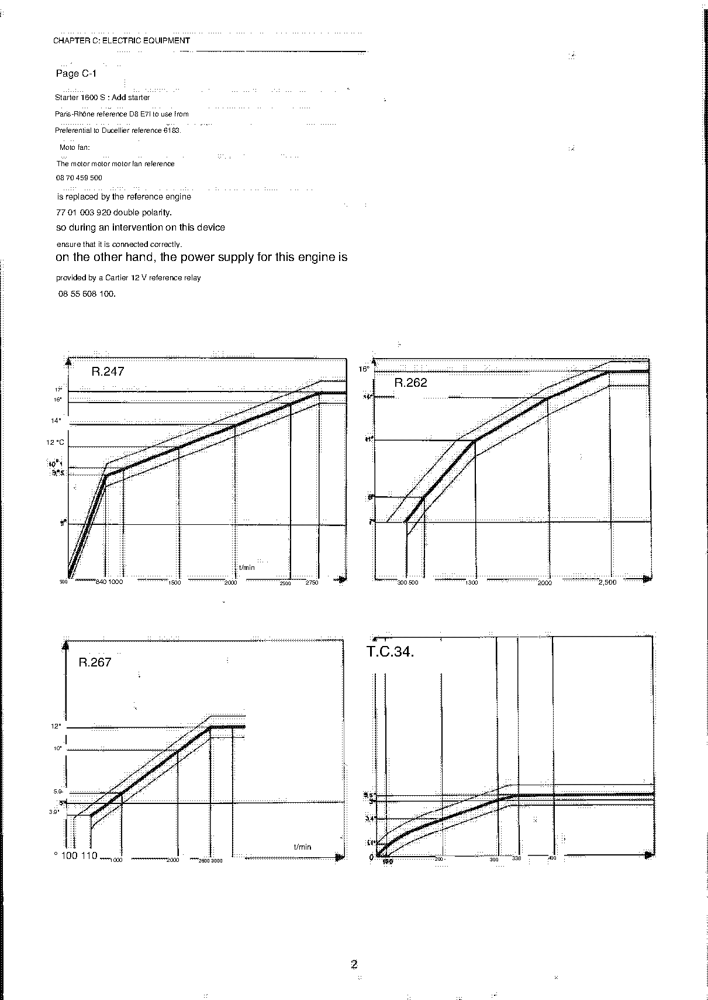

<!-- Source note: PDF pages 61-63 = supplement cover + supplement pages 1 and 2.
     The supplement is a SEPARATE document bound after the manual, with its own page
     numbering (1-22 on pp.62-83). Its cover (p.61) is the same title plate as the manual's
     but overprinted "OCTOBER 1971 ADDITIVE".
     These amendment pages are the best-preserved text in the whole PDF — the translation
     is still rough but the figures are legible. -->

# Update supplement — amendments to Chapters A, B and C

Source PDF pages 61–63; supplement pages **1** and **2**.

> **This supplement supersedes the main manual wherever the two disagree.** It is the
> **OCTOBER 1971 ADDITIVE** to the October 1970 1st edition. Where an amendment below
> contradicts a value in [A](a-general.md), [B](b-engine-ignition.md) or
> [C](c-electrical-equipment.md), the amendment wins.

**[PDF p.62]**

## Chapter A: Characteristics — General

### Page A-3, paragraph 13 — Tyres and rims

Add the **ALPINE 5a aluminium rim**, fitted as series equipment on the 1600 S since
**January 1971**.

### Page A-3, paragraph 14 — Capacity

**Cooling system with heating:** correct, for models with a front radiator, the quoted
capacity to **13 to 14 litres instead of 9 litres**.

<!-- NEEDS REVIEW: supersedes the "Cooling system with heating: 9 l" figure in
[A — General, §14](a-general.md#14-capacity). The 9 l figure stays correct only for cars
with a rear radiator. "ALPINE 5a" may be "5 1/2" — the A-3 rim table lists an
"ALPINE 5 1/2 × 13"; verify against the source PDF p.62. -->

**[PDF p.62]**

## Chapter B: Engine

### Page B-2

**Version 85, from engine 810-30 No 290:** removal of the inner valve springs.

### Page B-7

- **Engine 807-25, inner valve spring:** replace type **R.1171** with **R.1151**; the
  characteristics given in the MR are correct.
- **Engines 807-25 and 1600 GS:** correct the pushrod lengths — read **intake 178 mm**,
  **exhaust 110 mm**.

<!-- NEEDS REVIEW — this amendment CONTRADICTS the main manual. B-7 (PDF p.16) prints the
807-25 / 1600 GS pushrod lengths as intake 74.5 mm and exhaust 105.5 mm; this supplement
corrects them to 178 mm and 110 mm. See
[B — Rocker bearing surfaces and pushrods](b-engine-ignition.md#rocker-bearing-surfaces-and-pushrods).
"lengths of shafts of buttocks" is French "longueurs des tiges de culbuteurs" = pushrod
lengths ("culbuteurs" mangled again). The amendment also says the inner valve spring type
changes from R.1171 to R.1151 — B-7 lists R.1171 for the 807-25, so the supplement
supersedes it. "ca-erysteria" is "caractéristiques". -->

### Page B-8

Add the address of the supplier of **Hylomar** paste:

> BEAUCHAMPS
> 96, rue Georges SAND
> 37 — COURSE

<!-- NEEDS REVIEW: "dough" is French "pâte" = paste (the Hylomar jointing compound used on
the 1300 S head gasket — see [B-8](b-engine-ignition.md#b-8-head-gasket-replacement)).
"37- COURSE" is the département 37 plus a town name the translation garbled; not
recoverable. -->

### Page B-10 — Gudgeon pin diameters

| | 85 | 1300 G | 1300 S | 1600 S | 1600 GS |
| --- | --- | --- | --- | --- | --- |
| Piston pin Ø | 20 | 20 | 20 | 21 | 21 |

<!-- NEEDS REVIEW: the main manual's B-10 gives no gudgeon pin diameters at all (only
whether the pin is tight or free), so this table ADDS data rather than correcting it. No
unit is printed; mm is implied by the Ø symbol but not stated. -->

### Page B-12

- **Paragraph 5** — add oil pressure: **1600 S and 1600 GS at 4000 t/min hot: 4 to 5 bars**.
- **Paragraph 6** — correct the cooling capacity: for versions with a front radiator,
  **13 to 14 litres instead of 9 litres**.

<!-- NEEDS REVIEW: this is the first place in the whole manual where the oil-pressure UNIT
is stated — "bars". The B-12 oil-pressure table (PDF p.21) prints its figures with no unit
at all; this amendment makes bars the likely reading there too, but the main table is still
left unitless in [B-12](b-engine-ignition.md#b-12-5-lubrication) as printed. -->

### Page B-13 — Thermostat

Add:

| Thermostat type | Condition |
| --------------- | --------- |
| Winter type | outside temperature **< 15°** |
| Summer type | outside temperature **> 15°** |

The **1600 GS group IV** versions are fitted **without thermostat**.

<!-- NEEDS REVIEW: the temperature unit is printed only as "15°" — °C is implied but not
stated. This supersedes nothing in B-13, which only mentions a thermostat pierced with 1 to
4 bleed holes of Ø 4.5. -->

### Page B-14 — Carburation

- **Engine 1600 S:** replace air corrector 200 by 180.
- **Specify, for all types of carburettor:**

  | Float weight | Needle valve | Float height |
  | ------------ | ------------ | ------------ |
  | 23 g | point 150 | **5 mm** |
  | 26 g | point 150 | **8.5 mm** |

- **Correct** the clearance between the aluminium manifolds and the carburettor base to
  **1.3 to 1.5 mm instead of 1.2 to 1.3 mm**, depending on the depth of the O-ring grooves.
- **Engines 807-25 and 1600 GS, petrol pump** — add the static pressure, with the pump not
  delivering:
  - minimum **0,170 bar**
  - maximum **0.280 bar**

<!-- NEEDS REVIEW:
(1) "replace air sprinkler 200 para. 180" is French "remplacer le gicleur d'air 200 par le
    180" = replace the 200 air corrector jet with the 180 — "para." is "par le". This
    supersedes the 1600 S "G. Air (a) = 200" cell in
    [B-13/B-14 Carburation](b-engine-ignition.md#b-13-b-14-7-carburation).
(2) "point 150" is French "pointeau 150" = needle valve 150 (not a "point").
(3) The manifold-to-carburettor gasket correction supersedes the main manual's "1.2 to
    1.3 mm" on the same page.
(4) "the pump does not debi-" is "la pompe ne débitant pas" = with the pump not delivering.
    The minimum prints with a French comma (0,170) and the maximum with a period (0.280);
    both left as printed. -->

### Page B-15 — Ignition

**Engines 1600 S and 1600 GS.** The distributor reference **4266**, curve **R. 234**, was
replaced from Model 71 by a distributor **without tachometer drive**, reference **4311**,
curve **R.262** — and then by the type **R. 1173**, reference **4355**, curve **R.267**.

With this last distributor, the initial setting is from **0 to 8 mm/10 mm** at the pulley.

> For information: the **5°** marker on the clutch housing corresponds to a piston position
> of **0,2 mm before TDC**, and to a distance of **6 mm** before the index on the crankshaft
> pulley.

**Engines 1300 G and 1300 S.** From Model 71, fitting of the distributor **without
mechanical tachometer drive**, reference **4136**, curve **R.230**.

**Engine 810-30, version 85.** From vehicle **12249**, fitting of the distributor without
mechanical tachometer drive, reference **4245**, curves **R.247** and **C. 34**.

<!-- NEEDS REVIEW — SAFETY-RELEVANT (ignition timing).
(1) "Allumeur without reference tower count" and "the lighter without counting-turns meca-"
    are French "allumeur sans compte-tours mécanique" = distributor without mechanical
    tachometer (rev-counter) drive take-off. Rendered as such.
(2) "PMH" is "point mort haut" = TDC.
(3) These supersede the B-15 distributor table in
    [B — Ignition](b-engine-ignition.md#b-15-8-ignition-allumage) for Model 71 onwards.
    Note that the main manual gives the 85 distributor as 4172 curve R.236, while this
    amendment gives 4245 curves R.247 + C.34 from vehicle 12249 — the main manual's C.34
    vacuum curve is retained.
(4) "from 0 to 8 mm/10 mm at the pulley" is as printed and its meaning is not clear from
    this copy — do NOT set initial advance from it. Check the source PDF p.62. -->

**[PDF p.63]**

## Chapter C: Electric Equipment

### Page C-1

- **Starter, 1600 S:** add starter **Paris-Rhône reference D8 E71**, to be used in
  preference to Ducellier reference 6183.
- **Fan motor:** the fan motor reference **08 70 459 500** is replaced by motor reference
  **77 01 003 920**, which is **double-polarity** — so during any work on this device make
  sure it is connected correctly. The supply for this motor is provided by a **Cartier 12 V
  relay, reference 08 55 608 100**.

<!-- NEEDS REVIEW: "D8 E7l" prints a letter l for the final character; read as D8 E71 — but
the C-1 table in the main manual lists the 1300 G/1300 S starter as "PARIS-RHONE 12V D8
E75", so this could equally be D8 E75 with a damaged digit. NOT resolved; check the source
PDF p.63 before ordering. "Moto fan" is "moto-ventilateur" = fan motor; "The motor motor
motor fan" is a repeated-word OCR artifact. -->

### Centrifugal advance curves R.247, R.262, R.267 and vacuum curve T.C.34

The four curves named in the Chapter B amendments are printed as graphs on this page.

Readable axis marks, as printed:

| Curve | Advance axis | Speed axis (t/min) |
| ----- | ------------ | ------------------ |
| R.247 | 5°, 9°5, 10°1, 12 °C, 14°, 16°, 17° | 500, 840, 1000, 1500, 2000, 2500, 2750 |
| R.262 | 7°, 8°, 11°, 14°, 16° | 300, 500, 1300, 2000, 2,500 |
| R.267 | 3.9°, 5°, 5.9°, 10°, 12° | 100, 110, 1000, 2000, 2600, 3000 |
| T.C.34 | 1,1°, 3,4°, 5°, 5,5° | 0, 100, 200, 300, 338, 400 |

<!-- NEEDS REVIEW — SAFETY-RELEVANT (ignition timing). These axis marks are read off
low-contrast graphs. Specific problems: the R.247 "12 °C" mark is a degree-symbol OCR
artifact (it is an advance angle in degrees, not a temperature); "10°1" and "9°5" use the
French convention where the digit after the degree sign is tenths (10.1° and 9.5°). The
T.C.34 graph's speed axis is NOT in t/min — it is a vacuum curve and its horizontal axis is
most likely depression in mm Hg, but the page does not label it. Do NOT set timing from this
table; use the delivered image or the source PDF p.63. Each graph shows a tolerance band,
not a single line; no band values are transcribed. -->

---

**Previous:** [R — Special Tooling](r-special-tooling.md) · **Next:** [Update supplement — wiring harness directory](u2-supplement-wiring-harness-directory.md)
