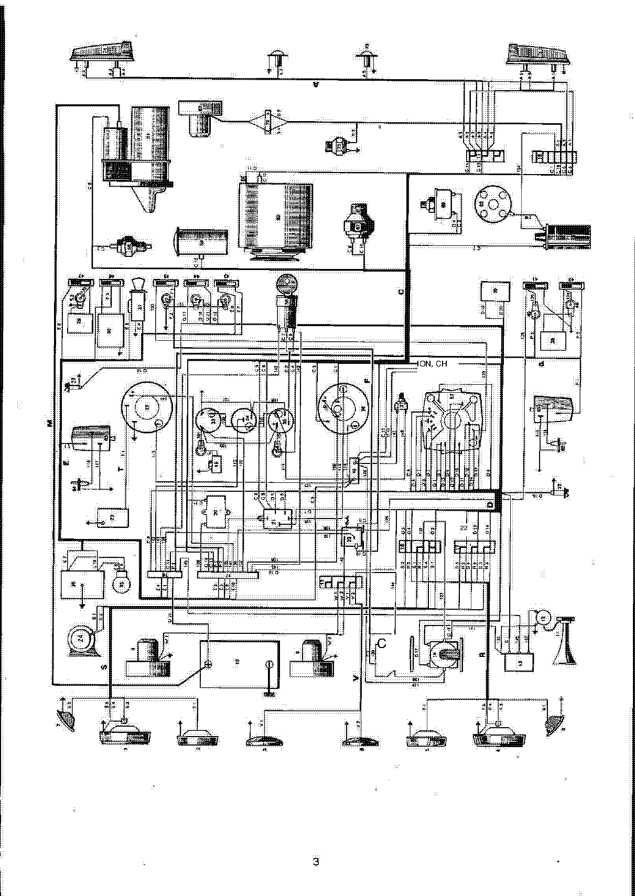
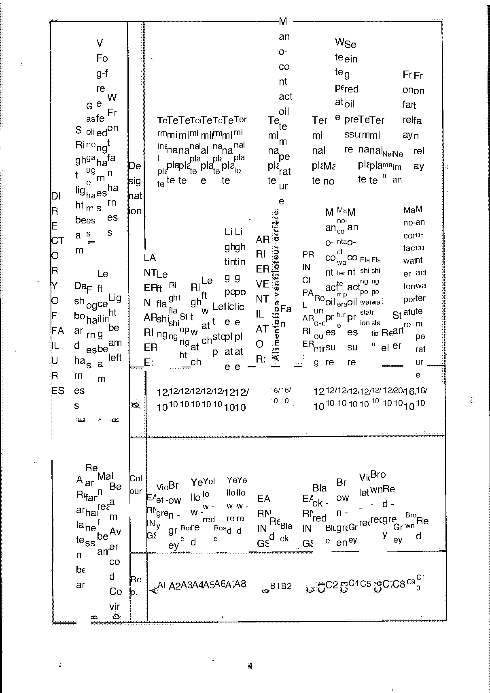
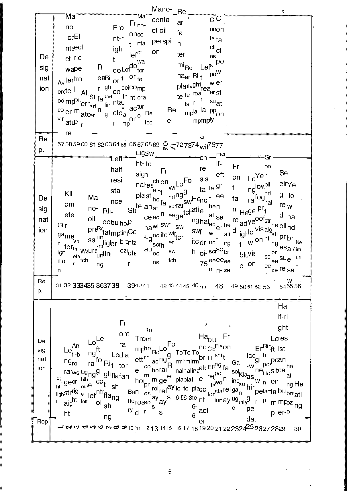
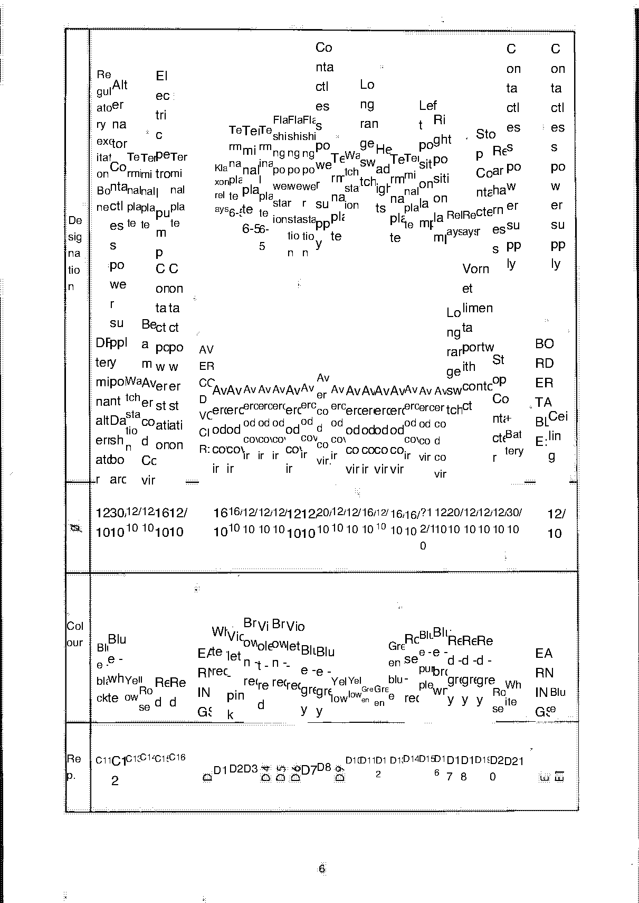
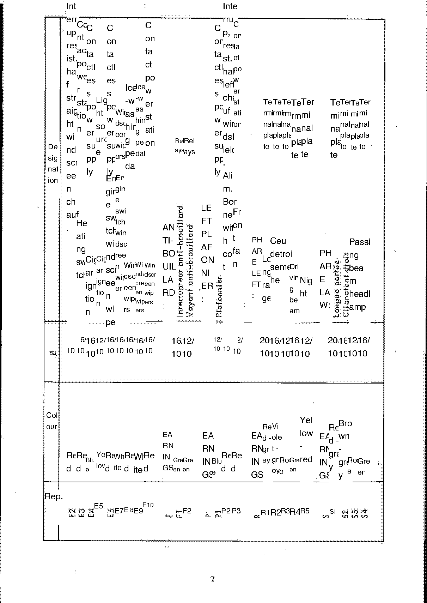
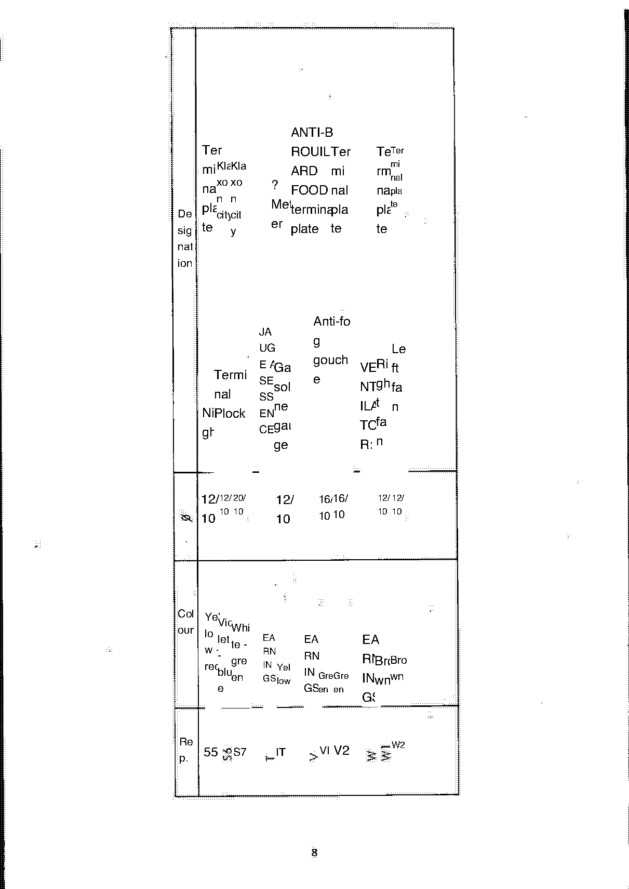
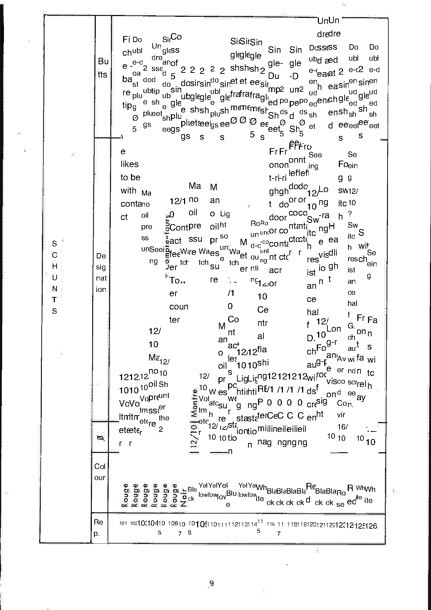
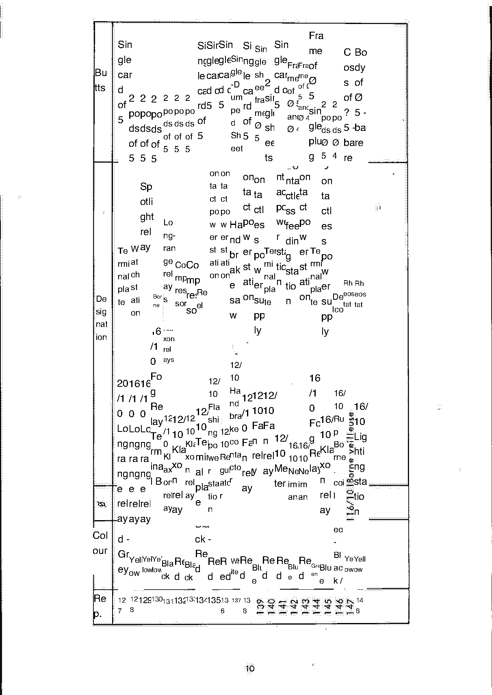
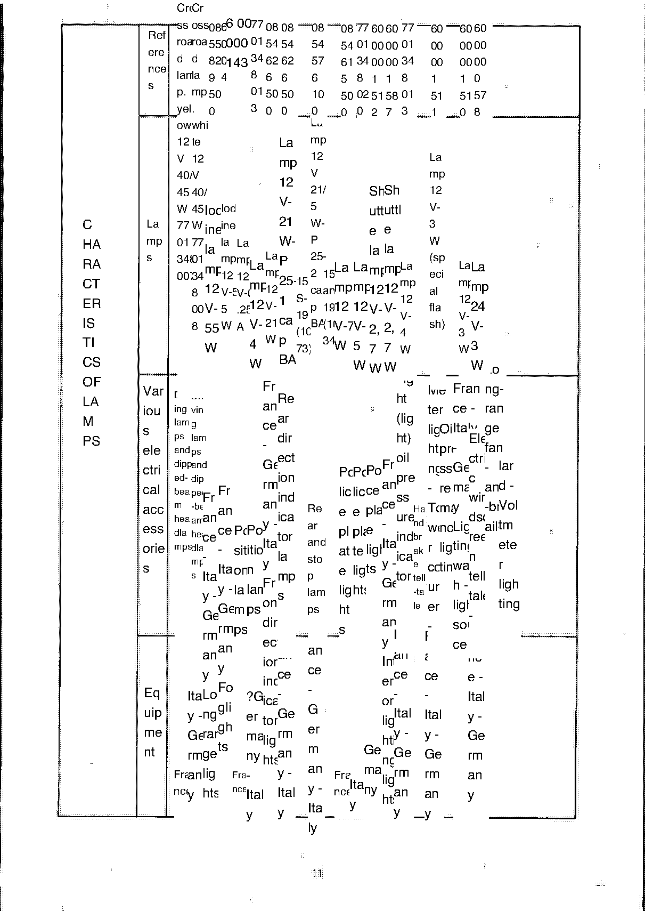

<!-- Source note: PDF pages 64-72 = supplement pages 3-11.
     These nine pages are the wiring-harness and connector directory. Their column headings
     are printed at 90 degrees and the English translation overlay scrambles them completely
     (see the raw OCR: "De sig nat ion", "Te rmi nal pla te", "Un dre dre SinCo Fi Do").
     NOTHING on these pages is transcribed as data. They are delivered as images, per
     04_cleanup_methodology.md Rule 12 and Rule 10's "too dense/ambiguous to read reliably"
     clause. -->

# Update supplement — wiring harness and connector directory

Source PDF pages 64–72; supplement pages **3** to **11**.

> **These nine pages are wiring documentation that the translation has destroyed.**
>
> The English overlay sits on top of the French original with the column headings running at
> 90°, so neither layer can be read. **Nothing on them has been transcribed** — not a colour
> code, not a terminal number, not a part number. A wrong reading here puts current through
> the wrong circuit.
>
> This is not a gap that further work on this copy can close. It is a permanent defect of
> this translated edition, recorded as such. Anyone who needs A110 harness data should go to
> the French original or a Renault 8/10/16 wiring manual; the images below are reproduced so
> you can at least see what is on each page, not so you can work from them.

The pages are headed, as far as is legible, **"DIRECTORY OF FAILURES"** — French
*répertoire des faisceaux* (wiring harness directory). The translator read *faisceaux*
(harnesses) as a word for failures.

**[PDF p.64]**

## What is on each page (so you can find the right one — NOT data)

| Supplement page | PDF page | Content, from the fragments that are legible |
| --------------- | -------- | -------------------------------------------- |
| 3 | 64 | Opening page of the directory |
| 4 | 65 | Designation column: lighting circuits — side lights, headlamps, fog lamps, indicators, left/right |
| 5 | 66 | Pressure switches and thermo-contacts — oil pressure sender, water temperature, front/rear, left/right doors |
| 6 | 67 | Charging and starting — regulator, alternator, terminal plates, battery, water temperature, starter |
| 7 | 68 | Switches and contactors — headlamp flash, windscreen washer, wiper, pedal-operated contacts |
| 8 | 69 | Terminal plates — horns (*klaxons*), anti-fog supply, terminal plate colours (yellow, violet, white-red, green, blue) and sizes 12, 20, 10 |
| 9 | 70 | Butt connectors and shunts — single/double, sheathed/unsheathed, 2- and 5-way |
| 10 | 71 | Butt connectors — body/chassis frame, single Ø 5, Ø 2 |
| 11 | 72 | **Characteristics of lamps** — cross-reference numbers (e.g. 08 54 013 46…, 77 01 500 …) |

<!-- TRANSLATION NOTE (closed 2026-10-06 as a permanent source defect, not an open item):
the table above is a reading of scattered legible words across each page image, offered only
so a reader can tell which page to open. The words are machine-translated from French and
several ("Fo g-f re", "Ri ghga", "Mano- conta ct") are too broken to interpret. NOTHING here
is an accurate index of the page contents, and no reference number above is complete.
     Nothing further can be recovered from this copy — these pages are wiring documentation
     the translation destroyed, so this is a property of the source, not work left undone.
     Note also that the main manual's only wiring diagram (p.29) covers the Version 85
     (serie) only — see [C — Electrical Equipment](c-electrical-equipment.md#c-wiring-diagram). -->

---

**Previous:** [Update supplement — Chapters A, B, C](u1-supplement-general-engine-electrical.md) · **Next:** [Update supplement — Chapters C, D, E, G, H, J, L, M](u3-supplement-steering-brakes.md)
