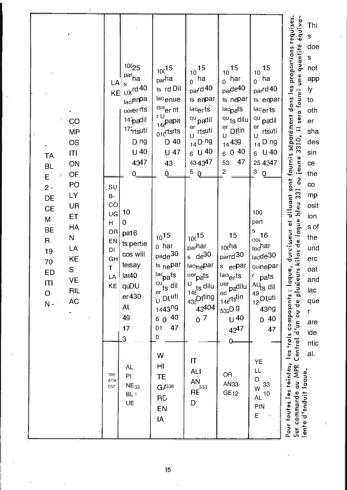
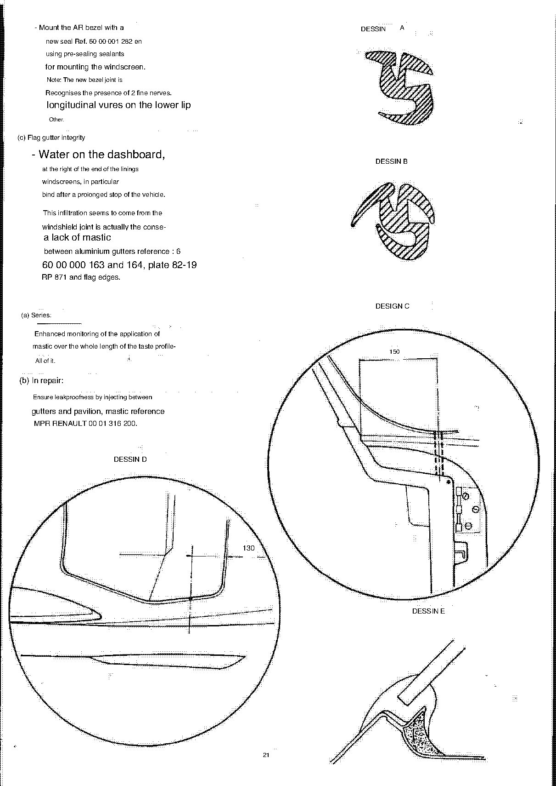

<!-- Source note: PDF pages 76-82 = supplement pages 15 to 21.
     p.76 (supplement 15) is the "TABLE 2 DECEMBER 1970 EDITION" lacquer composition sheet,
     printed at 90 degrees and illegible — delivered as an image.
     p.77 (supplement 16) is the replacement paint-kit composition list and is CLEAN — it is
     the best-preserved page of paint data in the whole document.
     pp.78-82 (supplement 17-21) are the chassis/body checking and repair procedures, with
     Drawings A-E on p.82. -->

# Update supplement — paint compositions, chassis checking and body repair

Source PDF pages 76–82; supplement pages **15** to **21**.

**[PDF p.76]**

## Supplement p.15 — Table 2, December 1970 edition

The replacement for Table 2 referenced by the Chapter N amendment. It is printed with its
English overlay rotated across the French and **cannot be read as text**.

<!-- NEEDS REVIEW: nothing from this page is transcribed. The readable page that follows
(supplement p.16, below) covers the same ground in usable form — prefer it. -->

**[PDF p.77]**

## Supplement p.16 — Composition of replacement paint kits

> This page is clean and complete. Quantities are in kilogrammes, as printed (the source
> uses French decimal commas inconsistently — `1,000 kg` is one kilogramme, not one
> thousand).

### 1) "BLANC 336" polyurethane lacquer — 60 00 001 601

| Component | Code | Quantity |
| --------- | ---- | -------- |
| White | UT 146 010 | 1,000 kg |
| Hardener | OF 430 | 0,150 kg |
| Diluent | 4047 | 0,500 kg |

### 2) Polyurethane lacquer "RED 333" — 60 00 001 602

| Component | Code | Quantity |
| --------- | ---- | -------- |
| Red | U 146 435 | 1,000 kg |
| Hardener | OF 430 | 0,150 kg |
| Diluent | 4047 | 0,500 kg |

### 3) Polyurethane lacquer "ORANGE 3312" — 60 00 001 603

| Component | Code | Quantity |
| --------- | ---- | -------- |
| Orange | U 146 532 | 1,000 kg |
| Hardener | OF 430 | 0,150 kg |
| Diluent | 4047 | 0,500 kg |

### 4) Polyurethane lacquer "BLUE 331" — 60 00 001 604

| Component | Code | Quantity |
| --------- | ---- | -------- |
| Blue | UX 147 172 | 1,000 kg |
| Hardener | OF 430 | **0,250 kg** |
| Diluent | 4047 | 0,500 kg |

### 5) "YELLOW 3310" polyurethane lacquer — 60 00 001 605

| Component | Code | Quantity |
| --------- | ---- | -------- |
| Yellow | U 146 253 | 1,000 kg |
| Hardener | OF 430 | 0,150 kg |
| Diluent | 4047 | 0,500 kg |

### 6) Polyurethane lacquer "BLUE GENDARMERIE" — 60 00 001 606

| Component | Code | Quantity |
| --------- | ---- | -------- |
| Blue gendarmerie | U 146 576 | 1,000 kg |
| Hardener | OF 430 | 0,150 kg |
| Diluent | 4047 | 0,500 kg |

### 7) BLUE ENDUIT (coating) — 60 00 001 607

| Component | Code | Quantity |
| --------- | ---- | -------- |
| Blue coating | AS AT 4917 3 | 1,000 kg |
| Hardener | OF 430 | 0,160 kg |
| Diluent | 4047 | 0,500 kg |

### 8) YELLOW ENDUIT (coating) — 60 00 001 608

| Component | Code | Quantity |
| --------- | ---- | -------- |
| Yellow coating | As at 49 124 | 1,000 kg |
| Hardener | OF 430 | 0.160 kg |
| Diluent | 4047 | 0,500 kg |

### 9) Dashboard finishing — 60 00 001 609

| Component | Quantity |
| --------- | -------- |
| Cellulosic matt black | 1,000 kg |
| Black cellulosic crackle | 1,000 kg |
| Black polyurethane matt | 1,000 kg |
| Hardener OF 471 | 0.420 kg |
| Diluent 4047 | 0,500 kg |

### 10) Polyester primer (*apprêt*) — 60 00 001 610

| Component | Code | Quantity |
| --------- | ---- | -------- |
| Ready | K 89 007 | 1,500 kg |
| Catalyst | C8 17 | 0,150 kg |

### 11) Polyester mastic — 60 00 001 611

| Component | Code | Quantity |
| --------- | ---- | -------- |
| Mastic | K 89 021 | 1,500 kg |
| Catalyst | TC 50 (dose) | 0.030 kg |

### 12) Bonnet paint — 60 00 001 612

| Component | Quantity |
| --------- | -------- |
| Bicolour paint | 1,000 kg |

### 13) Cellulosic lacquers

| Colour | Quantity | Reference |
| ------ | -------- | --------- |
| White | 1,000 kg | 60 00 001 6… |
| Red | 1,000 kg | 60 00 001 614 |
| Metallic blue | 1,000 kg | 60 00 001 615 |
| Yellow | 1,000 kg | 60 00 001 616 |
| Black | 1,000 kg | 60 00 001 617 |
| Orange | 1,000 kg | 60 00 001 618 |
| Metallic beige | 1,000 kg | 60 00 001 619 |
| Andalusian blue | 1,000 kg | 60 00 001 620 |
| Heather rose (*rose bruyère*) | 1,000 kg | 60 00 001 621 |
| Silver grey | 1,000 kg | 60 00 001 622 |
| Ruby red | 1,000 kg | 60 00 001 623 |
| Parioli green | 1,000 kg | 60 00 001 624 |
| Green Bosco | 1,000 kg | 60 00 001 625 |
| Blue 442 | 1,000 kg | 60 00 001 626 |
| Blue 418 | 1,000 kg | 60 00 001 627 |
| Azure blue | 1,000 kg | 60 00 001 628 |
| Aluminium underlayer | 1,000 kg | 60 00 001 629 |

<!-- NEEDS REVIEW:
(1) The White row of section 13 prints its reference truncated as "60 00 001 6" — the last
    two digits are cut off at the page edge. Shown as "60 00 001 6…"; it is almost certainly
    613 given the sequence 614-629 that follows, but that is NOT printed, so it is not
    asserted.
(2) The quantity column mixes French commas and periods for the same value (0,150 vs 0.160,
    0,500 vs 0.420/0.030). All left exactly as printed.
(3) Section 4 (BLUE 331) is the only lacquer with 0,250 kg of hardener instead of 0,150 —
    this is consistent with the Chapter N amendment's note that blue 331 was changed. It
    looks like an outlier but it is what the page prints.
(4) "LAKE" throughout the headings is French "laque" = lacquer; "RECHANGE" is "rechange" =
    replacement/spare; "ENDUIT" is a coating/filler; "CAPOTAL PEINTURE" is read as bonnet
    (capot) paint; "APPRET" is primer.
(5) Codes with internal spaces ("AS AT 4917 3", "As at 49 124", "C8 17") are printed that
    way. "As at 49 124" is the same product as "AT 49124" named on manual page N-3 — the
    spacing differs between pages. Section 10's catalyst "C8 17" is the "817" catalyst of
    N-3 with an OCR'd prefix. -->

**[PDF p.78]**

## Supplement pp.17–21 — Chassis and bodywork checking and repair

### A — Checking the backbone chassis

Tools required: control pin **CAR 27**; the joint inspection and repair bench; some
locally-made tools.

#### 1 — Different cases of use of the pin (see ALPINE plan 05-11-04)

First check the position of the pilot puck welded on the lower part of the central beam.
This puck must be located at **570 mm +2** from the pedal axis. Otherwise, drill the beam at
Ø **10,5** at this distance and plug the hole with mastic.

| Check | Reference dimension |
| ----- | ------------------- |
| (a) Front axle, lower arm position — short tip E | E = **1005 +2** |
| (a) Front axle, lower arm position — short tip E1 | E1 = **1008 ± 2** |
| (c) Front crossing control, lower arm inner points | A = A1 = **794 +2** |
| (d) Rear axle, stub-axle tube position — all models except 1600 S | D = D1 = **1386 ± 2** |
| (d) Rear axle, stub-axle tube position — 1600 S | D = D1 = **13080 + 2** |
| (e) Rear axle, front crossmember position | B = B1 = **1285 + 2** |
| (f) Rear frame geometry | C = C1 = **1090** (for information only) |

**Castor check (a):** the difference between right and left must be less than **1°** — a
deviation of 1° results in a displacement of **3 mm** at the lower wishbone. It is best to
have slightly more castor on the right than on the left, so the distance above may be up to
3 mm more than, rather than less than, distance E.

**(b) Front axle, upper arm and steering ball-joint positions:** compare using the pin fitted
with the cranked tip; see Chapter N of **MR 131**.

**(d) note:** with the reservations set out on page **N-13** of **MR 131**, and measuring
from the centre of the lower fixing stud of the bearing cage, compare with the pin fitted
with the short tip. The engine axis of a 1600 S is close to horizontal, whereas the 1300
engine axis is inclined by about **3°** (a range of 12 mm instead of 6), and this difference
is reflected in an increase in D and D1 of **6 cm**.

<!-- NEEDS REVIEW — several problems here, all left as printed:
(1) "D = DI = 13080 + 2 for 1600 S" — 13080 mm is implausible beside 1386 mm for all other
    models; a digit has very likely been inserted (1380 would fit, given the +6 cm note
    would make it 1446 — which it does not). The value is NOT resolved. Check the source
    PDF p.78 before using it.
(2) The "+2" and "± 2" tolerances are printed inconsistently (some as "+ 2" over a bar,
    some as "+2"); the page image shows a ± sign for E1 and D at least. Transcribed as seen.
(3) "3o (range of 12 mm instead of 6)" — "3o" is 3° (degree sign OCR'd as o).
(4) "pige" is the French measuring pin/gauge and is left in French where the translation
    kept it; "patella" and "lower patella" are "rotule" = ball joint, and "the lower
    patella" in the castor note is the lower wishbone ball joint.
(5) "the puck" is "le pion" = the locating peg/dowel.
(6) The reference to page N-13 of MR 131 is to the RENAULT manual, not to this manual's own
    section N — which stops at N-5 in this scan. -->

### B — Control bench (ALPINE Plan 05-11-02)

1. **Renault CAR test bench 08-7** — have the following locally made:
   - (a) Mounts adapted to the front RENAULT CAR 09-5 support (plan 05-11-02).
   - (b) Support for anti-roll bar bearings (bottom), ref. 05-11-03.
2. **Cellette control bench** — order by the usual methods, adaptation parts **ENS 55-019**
   in addition to **ENS 55-01** or **12**.
3. **Use of different media (ALPINE Plan 05-11-02)** — with only the front and rear axles
   removed:
   - Set up the front crossmember support with its ALPINE mounts, the anti-roll bar bearing
     support, and the rear crossmember support (Renault or Celette original support).
   - Install the anti-roll bar bearing support ref. **05-11-03**.
   - The location of these elements is indicated on plan 05-11-02.
   - Generally, perform the checks in accordance with Chapter N of **MR 131**.

> **NOTE:** Do not use support **05-11-05**, which is intended for use on the production
> line.

### C — Replacement of the chassis

This replacement cannot be done validly except on special jigs; the chassis is not delivered
separately as a replacement part.

### D — Replacement of the front crossmember

1. Remove the front axle, rear axle, steering housing and master cylinder.
2. Place the petrol tank in the bottom of the boot; in the case of a sheet-metal tank,
   unseal it.
3. Remove the cooling-circuit tubes (front radiator).
4. Cut the front apron over a surface between the vertical axis of the front crossmember,
   the bottom of the boot and the wheel arches.
5. Cut away, with torch or saw, the front crossmember of the central beam and the upper beam
   carrying the pedals and lamps.
6. Unseal the wheel arches and cut the two false members as close as possible to the front
   crossmember.
7. Remove the crossmember.

The MPR supplies as replacements: the front crossmember, 2 false front members, 2 sealing
plates, 2 flexible supports, 2 shock-buffer cup holders, 2 steering housing supports.

Refitting:

1. Present the hull on the surface table (support) and, with shims, set a distance of
   **137 mm ± 1** between the lower part of the beam and the table surface, at about
   **100 mm** back from the axis of the front members (this support is necessary because the
   front crossmember has been removed).
2. Position the front crossmember on the table support with its mounts, after engaging it in
   the beam.
3. Check if necessary that A = A1 = **794 + 2** (plan 05-11-04).
4. Position the cup holders (hole in the axis of the crossmember).
5. Position the false members on the crossmember to the right of the cup holders.
6. Mark on the false sealing plates, their lower edge corresponding to the bottom of the
   boot.
7. Weld.
8. Rivet the plates with "Pop" rivets.
9. Re-seal with glass fabric and resin on the wheel arches.
10. Seal the cut in the apron.
11. Refit the mechanical assemblies and adjust the front axle and the steering housing.
12. Weld the brake hose supports.

<!-- NEEDS REVIEW: "a distanthis of l37 mm + l" — the OCR gives l for 1 twice; read as
137 mm ± 1 from the page image. "marble" is "marbre" = surface table/alignment bench;
"holds" is "cales" = shims (as elsewhere); "Pop laughs" is "rivets Pop"; "false loin / false
AV lanterns" is "faux longerons" = false side members — "lanterne" and "loin" are both the
translation misreading "longeron". The step order above follows the page's own order but the
two columns of the original interleave; verify against the source PDF p.79. -->

### E — Rear section of the beam frame

In the case of slight damage, repair of the rear frame is possible. Use square or
rectangular section tubes of a dimension corresponding to the original elements (these
elements are not sold as replacements). Refer to the C and C1 dimensions of plan **05-11-04**
and those of the general chassis plan in the MR.

Since bodywork **No. 4500** the elements of the rear frame are made in **50 × 30** square
tube.

### F — Replacement of hull elements

In addition to the elements described on plates **82-01 to 82-09 of PR 871**, the following
parts are now available:

- Half floor, left and right
- Air filter compartment
- Front part of the front bottom plate, up to the wheel axis
- Front radiator air intake
- Lower side, left and right
- Front and rear half-sides up to and including the door pillar
- Front and rear wheel arches
- Roof panel with and without … 

For cutting bodywork elements, the recommended tool is the **oscillating pneumatic saw model
SA 70** from:

> Outils Pneumatiques Globe
> 143, Avenue du Général de Gaulle
> 92 — LA GARENNE-COLOMBES

Replacement blades bear the reference **EP 9239**.

<!-- NEEDS REVIEW: the last hull element prints "Pavillon with and without bullets-/Break."
— "pavillon" is the roof panel, but the qualifier is not recoverable. "Half-block AV and AR
up to the amount of door included" is "demi-flancs AV et AR jusqu'au montant de porte
inclus" = front and rear half-sides up to and including the door pillar. "VA part VA bottom
plate-shape" is "partie AV de la plate-forme" = front part of the platform. -->

### G — Nutsert and Jack-Nut inserts

#### (a) Nutsert inserts for bodywork

To make fitting and removal of headlamps and indicator units easier — for replacing a bulb,
for example — steel **"Nutsert"** inserts are used in manufacture: tubes **Ø 4 pitch 70**,
reference **60 00 001 363**.

During any work it is possible to adapt these inserts to cars that do not have them, as
follows:

1. Make a fitting tool locally according to the sketch.
2. Drill using a **9.5 mm** long-series drill (useful length **150 mm**), giving the drill a
   correct inclination so that the hole comes out in the door frame on the inside.
3. Fit a PVC **8/10** tube.
4. Pierce at **Ø 8 mm** behind the dashboard for the wiring.
5. Thread the Nutsert insert onto the tool using a **4 × 10 pitch 70** screw and a flat
   washer.
6. Drive the insert into the body with a hammer.
7. Tighten the screw until resistance is felt.
8. Remove the screw — the insert is now riveted to the body.

**Ø 6 inserts** (for fixing fairings, e.g. the floor), fitted by the same method, are
available under reference **60 00 001 364**.

A Nutsert insert clamp is sold by:

> AVDEL
> 66, rue David d'Angers
> 75 — PARIS 19e

(specify the size of the inserts).

#### (b) Jack-Nut nuts

**Ø 6 Jack-Nut** nuts are also used for fixing fairings and regulators. These nuts,
reference **60 00 001 546**, can be used in plastic thicknesses of **4 to 5 mm**:

1. Drill the plastic to **Ø 11**.
2. Set the Jack-Nut nut with the special **Molly Jack-Nut** clamp ref. **TI 1956**, supplied
   by:

> Ets F.O.M.
> 5, rue de Dunkerque
> 75 — PARIS 10e

<!-- NEEDS REVIEW: the drill in step (b)1 prints "Ø 11" while the nut is a Ø 6 Jack-Nut —
that is what the page says, but it reads oddly; check the source PDF p.80. The clamp
reference is printed "TI 1956" here and "IT 1956" in the supplement's own tooling table on
p.83 — the two DISAGREE; both are transcribed. "5 Dunkirk Street" is "5, rue de Dunkerque";
"THE GARENNE-COLOMBES" is "La Garenne-Colombes" — place names restored. "in his dressing
room" is a machine-translation artifact with no counterpart. -->

### H — Windscreen and rear screen sealing

#### (a) In production

A number of improvements have been made since May 1969.

**1 — Windscreens.** Seal No **60 00 000 138**, plate **82-30 of PR 871**.

- Transition from the "ring" neoprene seal to a "shaped" seal.
- Since **2-1-70**, adoption of a natural rubber with better elasticity and a change of
  hardness.
- Improvement of the section by increasing the depth of the glass groove and reducing the
  heel (drawing B).
- Since **10-2-70** (bodies made at DIEPPE) and **20-4-70** (bodies made at
  THIRON-GARDAIS), water-collection holes were provided in the lower radius of the frame
  (drawing C). These drain holes are also used for the passage of the heated-windscreen
  supply wires.

Various precautions were also taken on the body line:

- Respect for the width and profile of the flange.
- Reduction of the polyester and mastic thicknesses on the edge of the hardwood (drawing E).
- Reduction of the lining thickness of the windscreens at the hardwood.

**2 — Rear screen.** Seal No **60 00 000 139**, plate **82-30 of PR 871**.

- Replacement of the "ring" neoprene seal by a "shaped" rubber seal.
- On the same dates as above, drain holes in the rear screen flange (drawing D).
- In chain bodywork, precautions identical to those in paragraph A1.

#### (b) In repair

**1 — Windscreens.**

1. Offer up and clean the windscreen aperture.
2. Pour a little water with a sponge into the groove to verify, with the car horizontal,
   that the hole marked on drawing C is correctly placed at the lowest point.
3. Drill using a **9.5 mm** long-series drill (useful length **150 mm**) as indicated in the
   drawing, giving the drill a correct inclination so that the hole comes out in the door
   frame on the inside.
4. Fit a PVC **8/10** tube.
5. For a heated windscreen, use the drain tube for the passage of the wires, bringing them
   behind the dashboard by piercing at **Ø 8 mm**.
6. On the width of the flange, thin the lining of the windscreen aperture.
7. Mount the windscreen by the usual methods with the new seal ref. **60 00 001 281**, using
   between seal and body **caustat mastic case 20 ref. 306** or **Fillum BOYRIVEN** mastic,
   and between seal and glass either the caustat 20 or **Electro-Mastic Plastic type PB**.

> **NOTE:** The new seal is recognised by the presence of a thin longitudinal rib on the
> inner lip.

**2 — Rear screen.**

1. Offer up and clean the screen aperture.
2. By the same method as above, and using drawing D, drill **2 holes of Ø 8 mm**.
3. First lift the top covering of the parcel shelf in order to check that the holes do not
   come out inside the cabin but in the engine compartment.
4. To the right of the flange, thin the top of the parcel shelf.
5. Mount the rear screen with a new seal ref. **60 00 001 282**, using the same pre-sealing
   sealants as for mounting the windscreen.

> **NOTE:** The new rear-screen seal is recognised by the presence of **2 fine longitudinal
> ribs** on the lower lip.

#### (c) Flag gutter sealing

Water on the dashboard, to the right of the end of the windscreen trims, in particular after
a prolonged stop. This infiltration appears to come from the windscreen seal but is in fact
the consequence of a lack of mastic between the aluminium gutters, references
**60 00 000 163** and **164** (plate 82-19 of PR 871), and the body edges.

- **(a) In production:** enhanced monitoring of the application of mastic over the whole
  length of the gutter profile.
- **(b) In repair:** ensure leak-tightness by injecting between gutters and roof the mastic
  reference **MPR RENAULT 00 01 316 200**.

Dimensions marked on the drawings, as printed: **150** (drawing D) and **130** (drawing E).

<!-- NEEDS REVIEW:
(1) "AR bezel" throughout is French "lunette AR" = rear screen/backlight, not a bezel.
(2) "hardwood" is French "bois dur"?? — more likely a mistranslation of "baie" (aperture) or
    "caisse" (body shell); the component is NOT recoverable and "hardwood" is almost
    certainly wrong. Rendered as "body" where the sense is clear and left flagged here.
(3) "THIRON-GARDIAN" is printed; the French town is Thiron-Gardais — the name is corrected
    above as a place name only, no value affected.
(4) "caustat mastic case 20 ref. 306" is "mastic caoutchouc"? — the product name is not
    recoverable; "case 20" is as printed.
(5) "Flag gutter" is "gouttière de pavillon" = roof gutter — "pavillon" (roof) was
    translated as "flag". The reference numbers 60 00 000 163/164 are legible.
(6) Paragraph (b)2 step 3 prints "I'm sorry, sir." where the French continued; the step
    above follows the surviving clauses. The cabin/engine-compartment distinction matters
    (water must drain outside, not inside) — verify against the source PDF p.81. -->

---

**Previous:** [Update supplement — Chapters C, D, E, G, H, J, L, M](u3-supplement-steering-brakes.md) · **Next:** [Update supplement — special tooling](u5-supplement-special-tooling.md)
