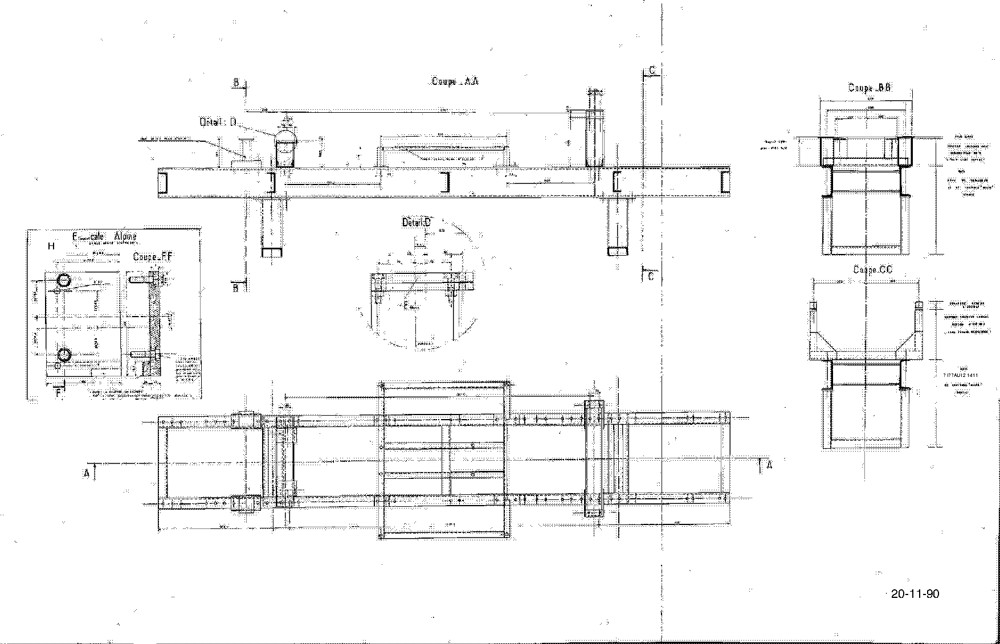
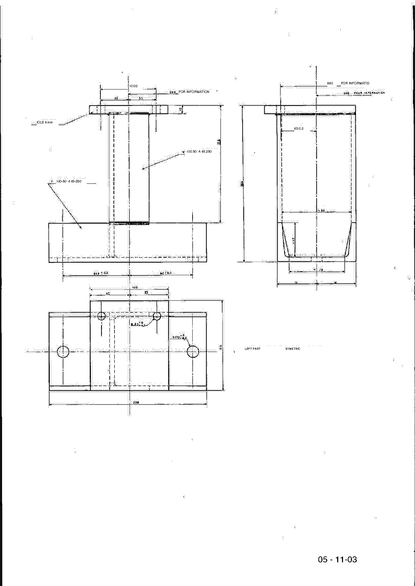
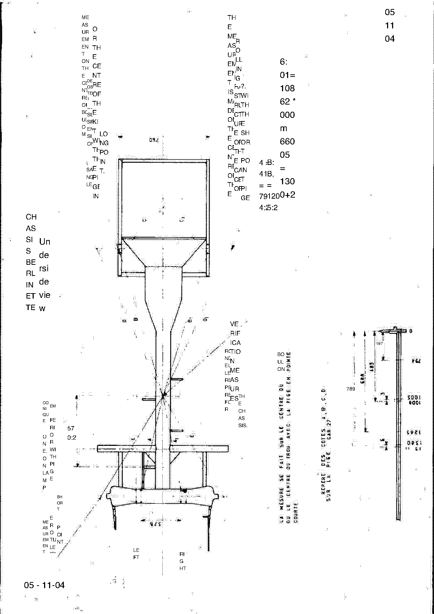
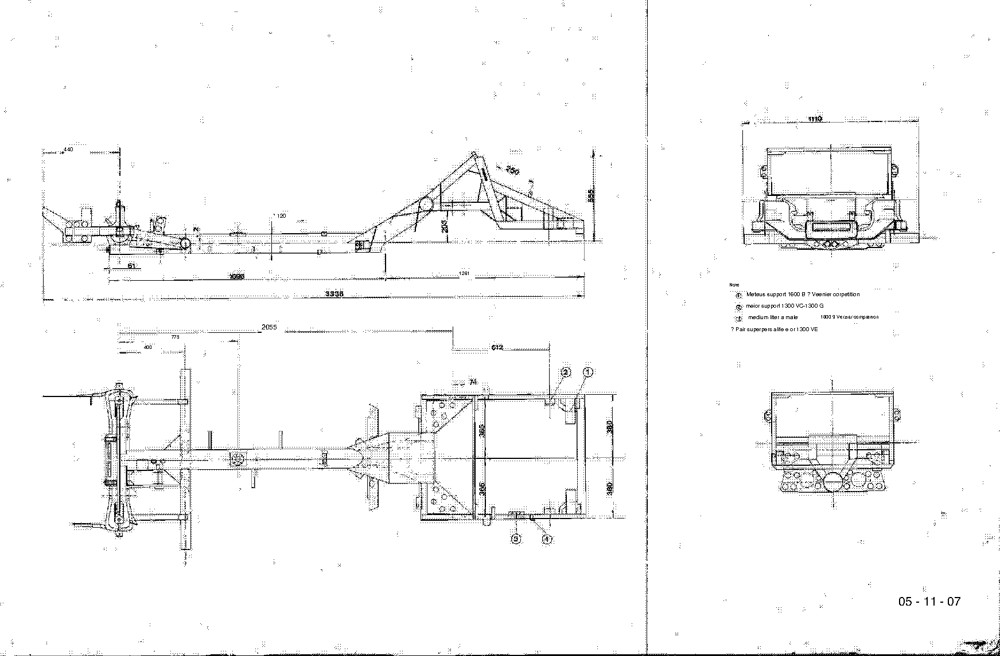

<!-- Source note: PDF pages 83-87 = supplement page 22 (the Chapter R tooling table) plus
     four unnumbered tool drawing sheets. The drawing sheets (pp.84-87) are dimensioned
     workshop drawings of the locally-made tools; their text is sparse and badly OCR'd, so
     they are delivered as images with only the clearly legible figures recorded. -->

# Update supplement — Chapter R: special tooling

Source PDF pages 83–87; supplement page **22** plus four unnumbered drawing sheets.

**[PDF p.83]**

## Supplement p.22 — Chapter R: Special tooling

| Reference | Supplier | Description of tool |
| --------- | -------- | ------------------- |
| 05 11 02 | F.L. | Mounts to be used with the front crossmember supports CAR. 09-5 — RENAULT test bench installation diagram |
| 05 11 03 | F.L. | Support for positioning the anti-roll bar mounting holes (bottom height) |
| ENS. 55-019 | Celette | ALPINE RENAULT mounting complement to ENS. 55-01 or 12 |
| Model SA 70 | Globe | Oscillating saw for cutting polyester |
| EP 9239 | Globe | Replacement blades for vibrating saws |
| IT 1956 | Ets F.O.M. | Jack-Nut nut clamp |
| *(none)* | Avdel | Pliers for Nutsert inserts |
| 60 00 001 258 | ALPINE | Spark-plug wrench for 1600 S |
| POL 15 000 | Ch. Maire | Sander — small-model pneumatic polisher |

Suppliers, as printed:

| Supplier | Address |
| -------- | ------- |
| Globe | Outils Pneumatiques Globe, 143 Avenue du Général de Gaulle, 92 — La Garenne-Colombes |
| Ets F.O.M. | 5, rue de Dunkerque, 75 — Paris 10e |
| AVDEL | 66, rue David d'Angers, 75 — Paris 19e |
| Charles MAIRE | 42, rue E. Bouté, 91 — Ris-Orangis |

<!-- NEEDS REVIEW:(1) The Jack-Nut clamp is listed here as "IT 1956" but as "TI 1956" on supplement p.20 — the
    two DISAGREE. Both transcribed; see
    [u4-supplement-bodywork-paint.md](u4-supplement-bodywork-paint.md#b-jack-nut-nuts).
(2) The spark-plug wrench is "60 00 001 258" here and "6000001258" on manual page R-1 — same
    number, different spacing. See [R — Special Tooling](r-special-tooling.md).
(3) "F.L." is a supplier abbreviation that is never expanded in this document.
(4) "Candle key" is "clé à bougies" = spark-plug wrench; "Upgrades" in the 05 11 02 row is
    "cales" = mounts/shims (as elsewhere in this manual); "Ch. Mayor" is Charles Maire.
(5) Addresses are restored to their French forms as place names only ("Dunkirk Street" →
    rue de Dunkerque, "THE GARENNE-COLOMBES" → La Garenne-Colombes, "42 E. Bouté Street" →
    42 rue E. Bouté). No reference number was changed.
     TRIAGE 2026-10-06 (TypeSafe/Jev, classification only — no value supplied or confirmed by the model): keep_safety · next step: record_as_source_defect · leaves-undecided 0.95 · risk-if-guessed 0.69 · blocks-a-job 0.30 -->

**[PDF p.84]**

## Tool drawing sheets

The four unnumbered sheets that close the document are dimensioned workshop drawings of the
locally-made tools referenced in the chassis-checking procedure. **Make these tools from the
drawings, not from any transcription** — most of their text did not survive OCR.

### Legible figures on the drawings

| Sheet | PDF page | Plan ref. | Legible text and dimensions, as printed |
| ----- | -------- | --------- | --------------------------------------- |
| 1 | 84 | — | "2 1411 20-11-90" — mostly illegible |
| 2 | 85 | **05 - 11-03** | "FOR INFORMATION", "Kmm 45:0.2", "100.50", "45.250", "100-50", "LEFT PART SYMETRIC" |
| 3 | 86 | — | A note about where the measurement is taken — see below |
| 4 | 87 | **05 - 11 - 07** | "440", "120", "1261", "2055", "775", "400"; "support 1600 B … competition", "support 1300 VC-1300 G", "1300 VE" |

Sheet 3's note, as far as it can be read:

> "THE MEASUREMENT IS MADE ON THE CENTRE OF THE … OF THE PIECE … THE MEASUREMENT ON THE
> CENTRE OF … DEPOSITED …"

<!-- NEEDS REVIEW:everything in this section is fragmentary.
(1) Sheet 1's "20-11-90" looks like a date but 1990 is twenty years after this manual — it
    is more likely a drawing number or a damaged "20-11-70". Left as printed.
(2) Sheet 2's "Kmm 45:0.2" uses the same ":" for ± seen throughout this scan, so it is
    probably 45 ± 0.2 mm — NOT asserted. The repeated "100.50" / "100-50" and "45.250" /
    "45-250" pairs differ only in their separator, which is an OCR artifact, but which
    separator is correct is not determinable.
(3) Sheet 4's part names ("Meteus support 1600 B", "Veenier corpetition meior support",
    "medium liter a male", "Verziar compatition", "Pair superpers alite e or 1300 VE") are
    machine-translation wreckage and are NOT recoverable; "1300 VE" is almost certainly
    1300 VC or VB with a damaged letter. The numeric dimensions listed are the ones legible
    on the image.
(4) Sheet 3's note is pieced together from a vertically-scrambled block and should be
    treated as unreadable.
Anyone making these tools must work from the source PDF pp.84-87, or better, from the
original ALPINE plans 05-11-02 to 05-11-07 cited in
[u4-supplement-bodywork-paint.md](u4-supplement-bodywork-paint.md).
     TRIAGE 2026-10-06 (TypeSafe/Jev, classification only — no value supplied or confirmed by the model): keep_safety · next step: verify_against_pdf_page · leaves-undecided 0.98 · risk-if-guessed 0.88 · blocks-a-job 0.64 -->

---

**Previous:** [Update supplement — bodywork and paint](u4-supplement-bodywork-paint.md) · **Back to:** [index](00-index.md)
