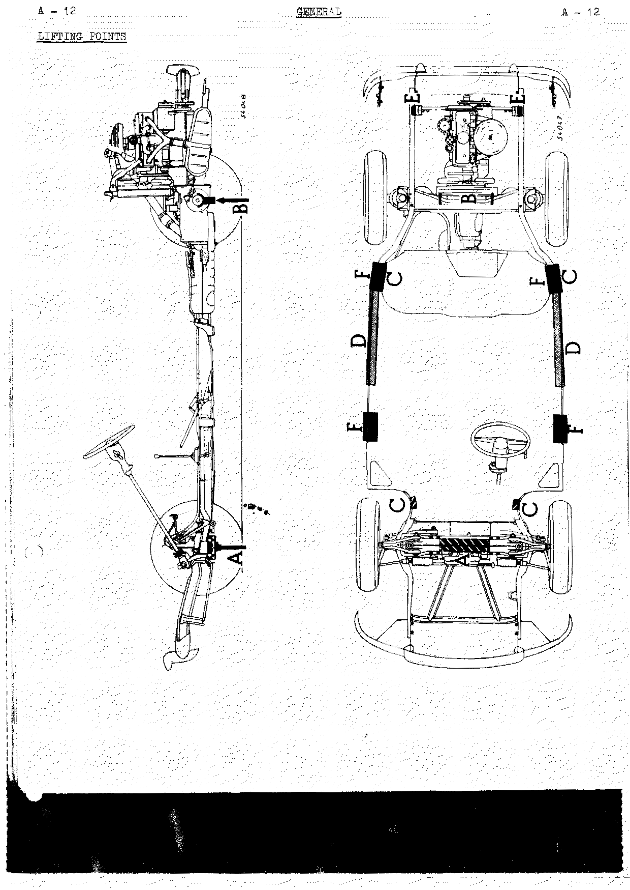
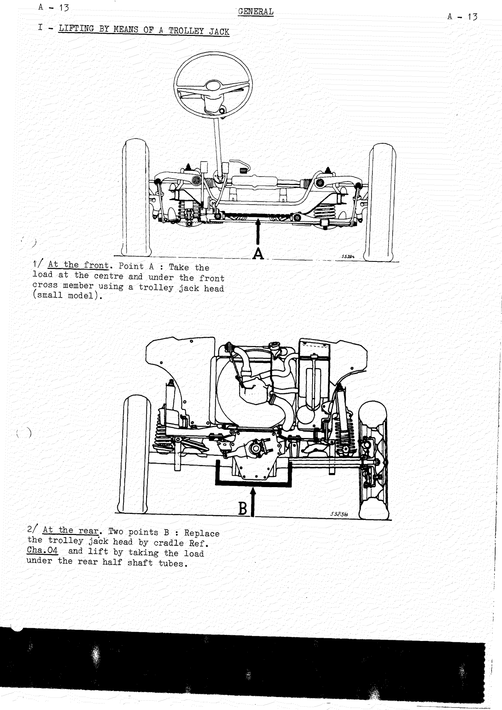

# General

<!--
Source: Renault Dauphine Workshop Manual M.R.93 (English edition, November 1964), Chapter A "General".
Page mapping note: in this scan the PDF page number runs one ahead of the manual's printed page,
i.e. PDF p.4 = printed page A-3, PDF p.15 = printed page A-14. Citations below give the PDF page
(and the printed A-page where useful). PDF p.1-2 are the manual cover and chapter tab-index and
carry no chapter content; PDF p.3 is this chapter's table of contents.
-->

<!-- PDF p.3 · chapter contents page -->

Chapter A of the M.R.93 workshop manual. It covers the general vehicle specifications for each
Dauphine variant and the approved lifting points.

## Contents of chapter

| Section | PDF page | Printed page |
| ------------------------------------------ | -------- | ------------ |
| Specifications — models previous to 1960   | 4        | A-3          |
| Specifications — 1960 model                 | 5–6      | A-4/A-5      |
| Specifications — 1961 model                 | 7        | A-6          |
| Specifications — 1961 Ondine                | 8        | A-7          |
| Specifications — 1960–1961 Dauphine Gordini | 9–10     | A-8/A-9      |
| Specifications — 1961 Gordini               | 11       | A-10         |
| Specifications — Dauphine R.1093            | 12       | A-11         |
| Lifting points                              | 13–15    | A-12/A-14    |

## General vehicle specifications

### Models previous to 1960

<!-- PDF p.4 · A-3 -->

| Dimension / weight     | Metric    | Imperial       |
| ---------------------- | --------- | -------------- |
| Overall length         | 3.945 m   | 155 5/16"      |
| Overall width          | 1.520 m   | 59 13/16"      |
| Height, unladen        | 1.440 m   | 56 11/16"      |
| Height, laden          | 1.400 m   | 55 1/8"        |
| Wheelbase              | 2.270 m   | 89 3/8"        |
| Front track            | 1.250 m   | 49 7/32"       |
| Rear track             | 1.220 m   | 48 1/32"       |
| Ground clearance       | 0.150 m   | 5 29/32"       |
| Kerb weight            | 630 kg    | 1387 lbs       |
| Maximum laden weight   | 1,000 kg  | 2202 lbs       |
| Turning circle radius  | 4.55 m    | 14 ft. 11 in.  |

### 1960 Dauphine

<!-- PDF p.5 · A-4 -->

Dimensions (letters are the drawing references on the dimensioned three-view figure):

| Ref | Dimension                                | Metric   | Imperial   |
| --- | ---------------------------------------- | -------- | ---------- |
| L   | Overall length                           | 3.945 m  | 155 5/16"  |
| I   | Overall width                            | 1.520 m  | 59 13/16"  |
| H   | Overall height                           | 1.375 m  | 54 9/64"   |
| A   | Wheelbase                                | 2.270 m  | 89 3/8"    |
| B   | Front overhang                           | 0.805 m  | 31 11/16"  |
| C   | Rear overhang                            | 0.870 m  | 34 1/4"    |
| D   | Front track                              | 1.250 m  | 49 7/32"   |
| E   | Rear track                               | 1.222 m  | 48 3/32"   |
| F   | Ground clearance                         | 0.140 m  | 5 1/2"     |
|     | Kerb weight                              | 650 kg   | 1431 lbs   |
|     | Maximum laden weight                     | 1,000 kg | 2202 lbs   |
|     | Axle loading (laden) — front             | 420 kg   | 925 lbs    |
|     | Axle loading (laden) — rear              | 580 kg   | 1277 lbs   |
|     | Minimum turning circle diameter (overall)| 9.83 m   | 31 ft. 6 in. |

<!-- PDF p.6 · A-5 -->

Engine, transmission and fluid capacities:

| Assembly                             | Type    | Fluid capacity (litres) | Imperial      | US           |
| ------------------------------------ | ------- | ----------------------- | ------------- | ------------ |
| Engine                               | 670-1   | 2.5                     | 4½ pts Imp    | 5¼ pts US    |
| Solex carburettor                    | 28 IBT  |                         |               |              |
| Clutch, Ferodo single disc (dry)     | PKH 4/8 |                         |               |              |
| Gearbox (transmission case)          | 314.20  | 1.25                    | 2¼ pts Imp    | 2¾ pts US    |
| Steering                             | 59.1    |                         |               |              |
| Front axle                           | 67.20   |                         |               |              |
| Braking system                       |         | 0.23                    | 1/2 pt        |              |
| Cooling system                       |         | 4.6                     | 8 pts Imp     | 9¾ pts US    |
| Fuel tank                            |         | 32                      | 7 galls. Imp  | 8½ galls. US |

Engine data:

- French taxable horsepower: 5 HP
- SAE brake horsepower: 30 BHP at 4,250 rpm
- Compression ratio: 7.75 to 1

### 1961 Dauphine

<!-- PDF p.7 · A-6 -->

Special features of the 1961 Dauphine (differences from the 1960 model):

- New carburettor: Solex type 28 IDT
- New accelerator pedal
- Brake pressure limiting valve at the rear
- Engine compression ratio: 8 to 1
- Power: 32 BHP at 4,500 rpm
- Gearbox (transmission case): Type 314-30 (3 speed)

### 1961 Ondine

<!-- PDF p.8 · A-7 -->

The specifications of the 1961 Ondine differ from those of the 1961 Dauphine only in:

- Overall length: 3.960 m (155 29/32")
- Gearbox type: 318-13 (4 speed)

### 1960–1961 Dauphine Gordini and 1961 Gordini

<!-- PDF p.9 · A-8 -->

Dimensions. In the source table the "1961 Gordini" column lists only the values that differ from
the "Dauphine Gordini"; where the 1961 Gordini cell is blank the value is the same as the Dauphine
Gordini column.

| Ref | Dimension                                 | 1961 Gordini            | Dauphine Gordini         |
| --- | ----------------------------------------- | ----------------------- | ------------------------ |
| L   | Overall length                            | 3.985 m (156 57/64")    | 3.945 m (155 5/16")      |
| I   | Overall width                             |                         | 1.520 m (49 13/16") <!-- NEEDS REVIEW: source misprint, not OCR — page image clearly prints "49 13/16"", but 1.520 m ≈ 59.8" and every other model in this chapter gives 59 13/16"; the "49" appears to be a typo in the manual --> |
| H   | Overall height                            |                         | 1.375 m (54 9/64")       |
| A   | Wheelbase                                 |                         | 2.270 m (89 3/8")        |
| B   | Front overhang                            | 0.845 m (33 1/4")       | 0.805 m (31 11/16")      |
| C   | Rear overhang                             |                         | 0.870 m (34 1/4")        |
| D   | Front track                               |                         | 1.250 m (49 7/32")       |
| E   | Rear track                                |                         | 1.222 m (48 3/32")       |
| F   | Ground clearance                          |                         | 0.140 m (5 1/2")         |
|     | Kerb weight                               |                         | 650 kg (1431 lbs)        |
|     | Maximum laden weight                      |                         | 1,000 kg (2202 lbs.)     |
|     | Axle loading (laden) — front              |                         | 420 kg (925 lbs.)        |
|     | Axle loading (laden) — rear               |                         | 580 kg (1277 lbs.)       |
|     | Minimum turning circle diameter (overall) |                         | 9.83 m (31 ft. 6 in.)    |

<!-- PDF p.10 · A-9 -->

Engine, transmission and fluid capacities (common to the 1960–1961 Dauphine Gordini and the 1961 Gordini):

| Assembly                             | Type     | Fluid capacity (litres) | Imperial      | US           |
| ------------------------------------ | -------- | ----------------------- | ------------- | ------------ |
| Engine                               | 670-5    | 2.5                     | 4½ pts Imp    | 5¼ pts US    |
| Solex carburettor                    | 32 PIBT  |                         |               |              |
| Clutch, Ferodo single disc (dry)     | PKH 4/8  |                         |               |              |
| Gearbox (transmission case)          | 318      | 1.25                    | 2¼ pts Imp    | 2¾ pts US    |
| Steering                             | 59       |                         |               |              |
| Front axle                           | 67       |                         |               |              |
| Braking system                       |          | 0.23                    | 1/2 pt        |              |
| Cooling system                       |          | 4.6                     | 8 pts Imp     | 9¾ pts US    |
| Fuel tank                            |          | 32                      | 7 galls. Imp  | 8½ galls. US |

<!-- NEEDS REVIEW: OCR/scan — carburettor type reads "32 PIBT" on the page image; Solex designations for this era are usually of the PBIC family, so "PIBT" may be a source typo. Kept exactly as printed. -->

Engine data:

- French taxable horsepower: 5 HP
- SAE brake horsepower: 40 BHP at 5000 rpm
- Compression ratio: 8 to 1

#### 1961 Gordini — special features

<!-- PDF p.11 · A-10 -->

Special features of the 1961 models:

- Gearbox (transmission case):
  - Type 318-12 (up to May 1960)
  - Type 318-14 (from May 1960)
  - Type 318-13 (from October 1960)
- Improved suspension
- Adjustable front seatback rake
- New accelerator pedal
- Brake pressure limiting valve at the rear

### Dauphine R.1093

<!-- PDF p.12 · A-11 -->

General specifications of Type R.1093 vehicles.

Dimensions (letters are the drawing references on the dimensioned three-view figure):

| Ref | Dimension                                 | Metric   | Imperial      |
| --- | ----------------------------------------- | -------- | ------------- |
| L   | Overall length                            | 3.945 m  | 155 5/16"     |
| I   | Overall width                             | 1.520 m  | 59 13/16"     |
| H   | Overall height, empty                     | 1.441 m  | 56 47/64"     |
|     | Overall height, laden                     | 1.400 m  | 55 1/8"       |
|     | Ground clearance, empty                   | 0.191 m  | 7½"           |
|     | Ground clearance, laden                   | 0.150 m  | 5 15/16"      |
| A   | Wheelbase                                 | 2.270 m  | 89 3/8"       |
| D   | Front track                               | 1.250 m  | 49 7/32"      |
| E   | Rear track                                | 1.220 m  | 48 1/32"      |
|     | Kerb weight (full fuel tank)              | 655 kg   | 1 443 lbs.    |
|     | Minimum turning circle diameter (overall) | 9.830 m  | 31 ft 6 in.   |

Engine, transmission and fluid capacities:

| Assembly                          | Type            |
| --------------------------------- | --------------- |
| Engine                            | 670-5 Special   |
| Solex carburettor                 | 32 PAIA 3-301   |
| Clutch, Ferodo single disc (dry)  | PKH 5.2         |
| Steering                          | 59              |
| Front axle                        | 67-27           |
| Gearbox (transmission case)       | 318-18          |

| Fluid          | Capacity | Imperial     | US           |
| -------------- | -------- | ------------ | ------------ |
| Engine oil     | 2.5 l    | 4½ pts Imp   | 5¼ pts US    |
| Gearbox oil    | 1.6 l    | 2¾ pts Imp   | 3½ pts US    |
| Braking system | 0.23 l   | 1/2 pt       |              |
| Cooling system | 4.6 l    | 8 pts Imp    | 9¾ pts US    |
| Fuel tank      | 32 l     | 7 galls Imp  | 8½ galls US  |

Engine data:

- French taxable horsepower: 5 HP
- Brake horsepower: 5 BHP at 5,800 rpm <!-- NEEDS REVIEW: source misprint, not OCR — page image clearly prints "5 BHP at 5,800 rpm", which is implausibly low for the R.1093 (a tuned "Special" 670-5 engine; real output is in the ~49–55 BHP range). Appears to be a dropped leading digit in the original typescript. Kept exactly as printed. -->
- Compression ratio: 9.2 to 1

## Lifting points

<!-- PDF p.13 · A-12 -->

The approved lifting/jacking points are identified by the letters A–F on the figure below (side
view and underbody views). Points A and B are for a trolley jack; C for a car lift with hinged
arms; D for the special lift; E and F for a sling/hoist.

### I — Lifting by means of a trolley jack

<!-- PDF p.14 · A-13 -->

1. **At the front — Point A:** Take the load at the centre and under the front cross member using
   a trolley jack head (small model).
2. **At the rear — Two points B:** Replace the trolley jack head by cradle Ref. Cha.04 and lift by
   taking the load under the rear half shaft tubes.

### II — Lifting by means of a car lift with hinged arms

<!-- PDF p.15 · A-14 -->

**Four points C:** Place the four lifting points of the lift under the floor section side members
as near as possible to the front and rear axles.

### III — Lifting by means of the special lift

**Two lifting areas D:** Place the two chocks under the right and left hand side members and lift
using the special lift (Ref. Cha.09).

### IV — Lifting by a sling or a hoist

1. **At the rear side members — Two points E:** Engage the two hooks of sling (Ref. Cha.03) into
   the right and left hand apertures in the rear side members. <!-- NEEDS REVIEW: OCR read "Two points H"; page image shows "E" and the lifting-points figure (A-12) labels the rear side-member points "E" — corrected from image. -->
2. **Lifting for placing on the jig bench — Four points F:** Place the lifting frame (Ref. Car.36)
   under the right and left hand side members and lift by means of the sling (Ref. Car.34).
