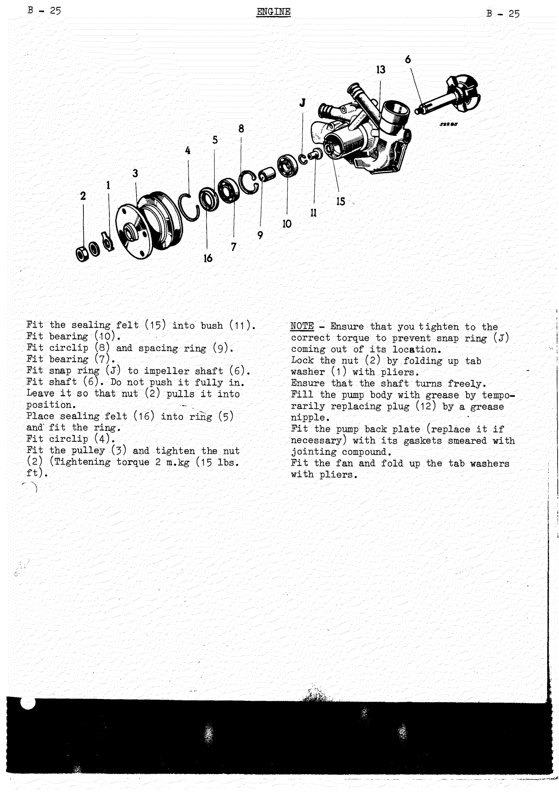
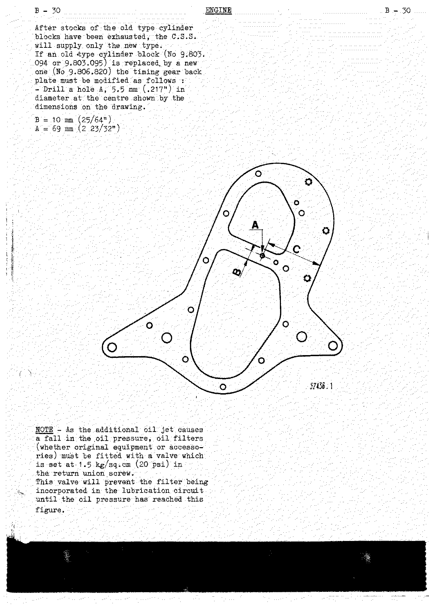
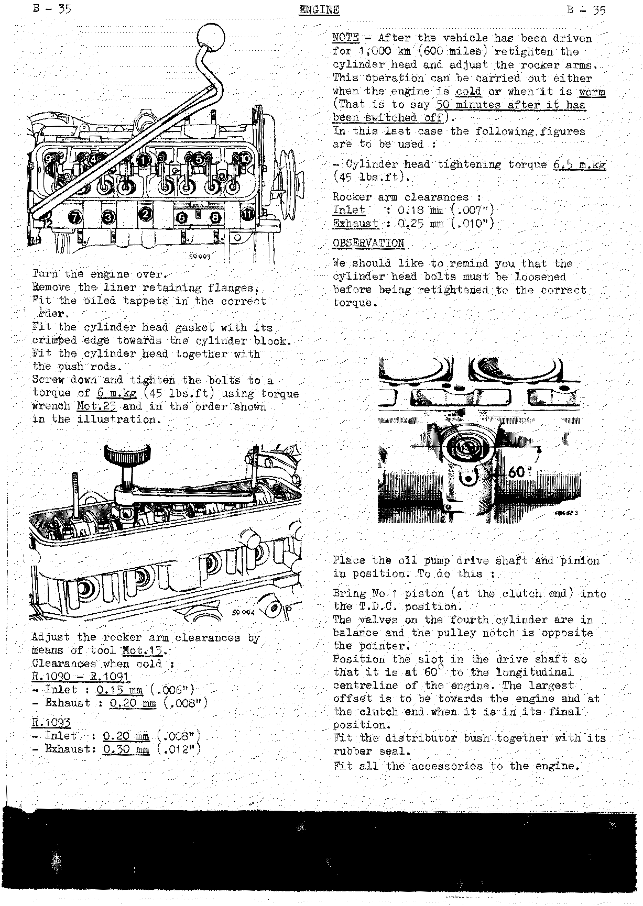
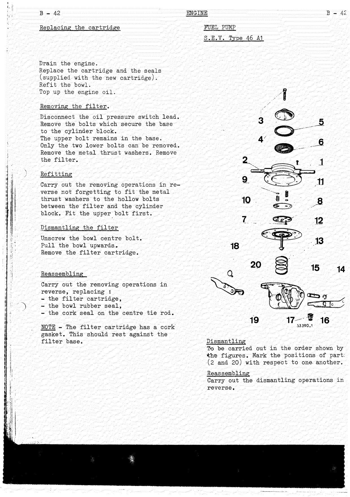
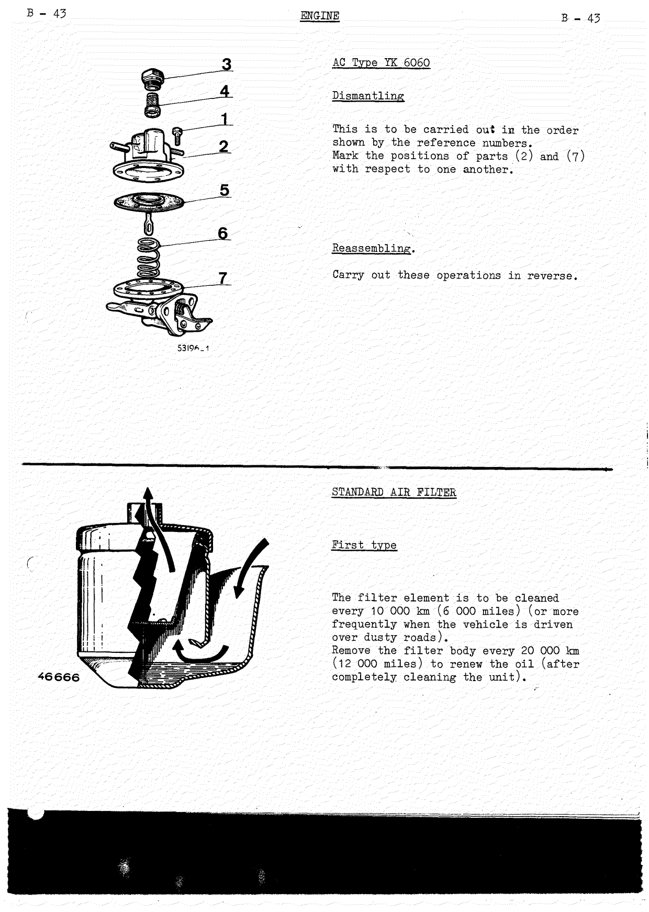
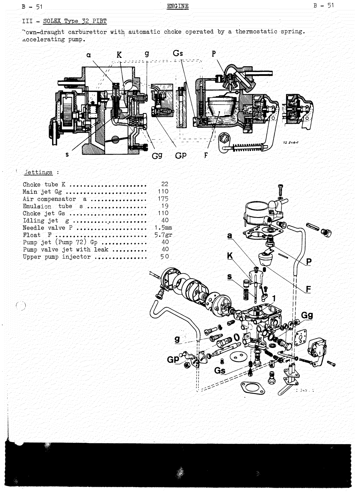
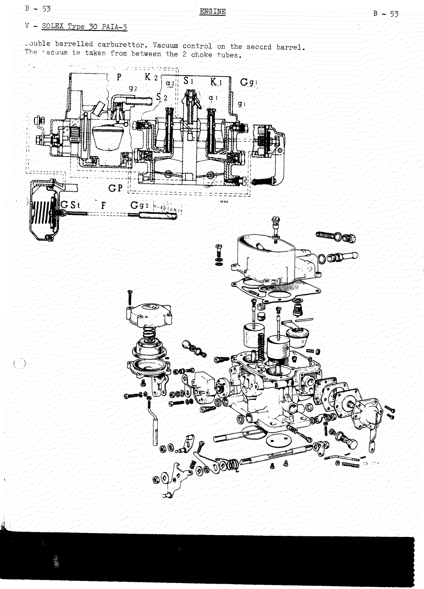

# Engine

<!--
Source: Renault Dauphine Workshop Manual M.R.93 (English edition, November 1964), Chapter B "Engine".
Covers Renault engine sections §14, 15, 16, 17, 73 for the 845 cc "Ventoux" Type 670 engine
(R.1090 / R.1091 / R.1093).
Page mapping note: in this scan the PDF page runs 14 ahead of the manual's printed B-page,
i.e. printed B-3 = PDF p.17, printed B-54 = PDF p.68. Citations below give the PDF page.
PDF p.16 is the chapter tab-divider and this chapter's table of contents (printed as one page).
No duplicate or misfiled pages were found in this range; the most complete pass is transcribed once.
Every numeric/spec value below was cross-checked against the rendered page image.
-->

<!-- PDF p.16 · chapter tab / contents -->

Chapter B of the M.R.93 workshop manual. It covers the four-cylinder 845 cc Type 670 ("Ventoux")
engine: identification and specifications, engine and power-unit removal, dismantling, overhaul of
the cylinder head, water pump, oil pump, crankshaft, camshaft, cylinder block and liner–piston
assemblies, reassembly, and service of the radiator, fuel pump, air filters, carburettors and fuel
tank.

## Contents of chapter

| Section                                                              | Printed page | PDF page |
| ------------------------------------------------------------------- | ------------ | -------- |
| Identification                                                      | B-3          | 17       |
| Specifications                                                      | B-4          | 18       |
| Removing and refitting the engine                                   | B-5          | 19       |
| Removing and refitting the power unit assembly                      | B-9          | 23       |
| Standard service exchange                                           | B-14         | 28       |
| Dismantling                                                         | B-15         | 29       |
| Overhauling the cylinder head                                       | B-16         | 30       |
| Overhauling the water pump                                          | B-24         | 38       |
| Overhauling the oil pump                                            | B-26         | 40       |
| Crankshaft                                                          | B-26         | 40       |
| Camshaft                                                            | B-27         | 41       |
| Cylinder block                                                      | B-28         | 42       |
| Timing gear casing                                                  | B-28         | 42       |
| "Liner–piston–connecting rod" assemblies                            | B-31         | 45       |
| Reassembling                                                        | B-32         | 46       |
| Removing and refitting the radiator                                 | B-36         | 50       |
| Removing and refitting the water pump                               | B-37         | 51       |
| Removing, replacing the cylinder head gasket and refitting the head | B-37         | 51       |
| Replacing a valve spring                                            | B-39         | 53       |
| Replacing the sump (oil pan) gaskets                                | B-40         | 54       |
| Checking the oil pressure                                           | B-41         | 55       |
| Oil filter                                                          | B-41         | 55       |
| Fuel pump                                                           | B-42         | 56       |
| Air filter                                                          | B-43         | 57       |
| Carburettor                                                         | B-47         | 61       |
| Removing and refitting the fuel tank                                | B-54         | 68       |

## Identification

<!-- PDF p.17 · B-3 -->

The type, index and manufacturing number are given on a number plate which is rivetted to the
right-hand side of the engine.

| Engine type          | Application                                                    |
| -------------------- | ------------------------------------------------------------- |
| 670-01               | R.1090                                                        |
| 670-04               | R.1091 (up to manufacturing number 8.848)                     |
| 670-05               | R.1091 (from manufacturing number 8.849 onwards)              |
| 670-05 special       | R.1093                                                        |

## Specifications

<!-- PDF p.18 · B-4 -->

Four-cylinder four-stroke, in line, vertical. 3-bearing crankshaft.

| Item                       | Value                     |
| -------------------------- | ------------------------- |
| French taxable horsepower  | 5 HP                      |
| Bore                       | 58 mm (2.284")            |
| Stroke                     | 80 mm (3.150")            |
| Cubic capacity             | 845 cc (51 cu.in)         |
| Firing order               | 1 – 3 – 4 – 2             |
| Spark plugs                | 14 mm                     |

### R.1090

| Item                   | 7.25 to 1                       | 7.75 to 1                       | 8 to 1                          |
| ---------------------- | ------------------------------- | ------------------------------- | ------------------------------- |
| Compression ratio      | 7.25 to 1                       | 7.75 to 1                       | 8 to 1                          |
| Brake horsepower (SAE) | 26.5 HP at 4,200 rpm            | 30 HP at 4,250 rpm              | 32 HP at 4,500 rpm              |
| Maximum torque (SAE)   | 6.9 m.kg (50 lbs.ft) at 2,000 rpm | 6.9 m.kg (50 lbs.ft) at 2,000 rpm | 6.9 m.kg (50 lbs.ft) at 2,000 rpm |

### R.1091 – R.1093

| Item                   | 670-04                          | 670-05                          | 670-05 special                  |
| ---------------------- | ------------------------------- | ------------------------------- | ------------------------------- |
| Compression ratio      | 7.7 to 1                        | 8 to 1                          | 9.2 to 1                        |
| Brake horsepower (SAE) | 38 HP at 5,000 rpm              | 40 HP at 5,000 rpm              | 55 HP at 5,800 rpm              |
| Maximum torque (SAE)   | 6.9 m.kg (50 lbs.ft) at 3,300 rpm | 6.9 m.kg (50 lbs.ft) at 3,300 rpm | 7.7 m.kg (55 lbs.ft) at 4,500 rpm |

### General

- Overhead valves operated by rocker arms.
- Timing gear drive by means of gearwheels.
- Ignition timing by rotary distributor with centrifugal advance and vacuum compensator.
- Fuel feed by means of diaphragm pump and carburettor.
- Water cooling. Centrifugal water pump. Fin-type radiator.
- Cooling system capacity: 4.77 litres (8½ pts Imp) (10 pts US).
- Pressure lubrication by means of a gear pump.
- Sump (oil pan) contents: max. 2.5 litres (4½ pts Imp) (5¼ pts US); min. 1.5 litre (2¼ pts Imp) (3¼ pts US).

## Removing and refitting the engine

Renault recommend this operation when carrying out a standard service exchange of the engine or
repairs on the clutch.

### I — 1956 model

<!-- PDF p.19 · B-5 -->

**Removing.**

Left-hand side:

1. Remove the air filter.
2. Disconnect the accelerator control.
3. Disconnect the ignition coil and then remove it.
4. Disconnect the temperature switch lead.
5. Disconnect the radiator upper securing point.
6. Disconnect the hose between the cylinder head and the radiator.
7. Remove the floor tray and the silencer (muffler).
8. Disconnect the dynamo (generator) and starter leads.

Right-hand side:

1. Remove the heater casing (when applicable).
2. Disconnect the hose at the bottom of the radiator.
3. Disconnect the oil pressure switch lead.
4. Remove the engine floor tray.
5. Remove the bolts which secure the radiator to the gearbox housing and remove it.

<!-- PDF p.20 · B-6 -->

Under the car — right-hand side:

1. Disconnect the fuel pipe from its outlet at the tank.
2. Remove the nuts and bolts which connect the engine to the gearbox.

Under the car — left-hand side:

1. Remove the nuts and bolts which connect the engine to the gearbox.
2. Disconnect the clutch control.
3. Take the weight of the engine by means of shackle Mot.86 or Mot.130.
4. Remove the rear engine support cross member.
5. Free the engine towards the rear then swing it to place it crosswise in its compartment.

<!-- PDF p.21 · B-7 -->

Then lift it sufficiently for it to clear the top of the rear end panel.

**Refitting.** Carry out the removing operations in reverse. Fill the cooling system and top up the
engine oil if necessary.

### II — Models later than 1956

<!-- PDF p.21 · B-7 -->

**Removing.**

Left-hand side:

1. Drain the radiator.
2. Remove the air filter.
3. Remove the engine floor tray.
4. Disconnect: the accelerator control, the ignition coil, the temperature switch lead, the
   starter, the dynamo (generator); disconnect the exhaust clamp.
5. Remove the hose clips and disconnect the hoses between: the radiator and water pump; the heater
   and the water pump; the radiator filler pipe and the radiator.
6. Remove the cardboard.
7. Unlock and remove the two nuts which secure the engine to the gearbox housing.

<!-- PDF p.22 · B-8 -->

Right-hand side:

1. Disconnect the oil pressure switch lead and the ignition coil.
2. Remove the heater.
3. Disconnect the radiator tie.
4. Remove the engine floor tray.
5. Remove the bolts connecting the radiator to the gearbox housing.
6. Remove the radiator towards the left of the engine.
7. Remove the silencer (muffler).
8. Disconnect the fuel pipe at the tank outlet.
9. Remove the nuts and bolts which connect the engine to the gearbox.
10. Secure shackle Mot.86 to the cylinder head using the cylinder head bolts.
11. Remove the engine rear cross member.
12. Pull the engine towards the rear of the vehicle. Swing it to the left. Take out the engine.

**Refitting.** Carry out the removing operations in reverse. Fill the cooling system and top up the
engine oil if necessary.

## Removing and refitting the power unit assembly

<!-- PDF p.23 · B-9 -->

**Removing.**

Left-hand side:

1. Drain the cooling system.
2. Remove the air filter.
3. Disconnect: the accelerator control, the temperature switch lead, the starter, the dynamo
   (generator).
4. Remove the hose clips and disconnect the hoses between the heater and the water pump.
5. Remove the engine floor tray and the silencer (muffler).

Right-hand side:

1. Disconnect: the oil pressure switch lead, the ignition coil.
2. Remove: the engine floor tray, the heater.
3. Remove the two bolts which secure the fuel tank filler neck. From under the vehicle, disconnect
   the half-shaft limiting straps.

<!-- PDF p.24 · B-10 -->

1. Position lift Cha.23 under the car, ensuring that you correctly position the wooden chocks (B)
   under the car and the stop against the cooling-air intake aperture. Lift until the safety device
   engages.
2. Slip the front and rear adaptable trestles (Cha.21 and Cha.22) under the car. Lower the car onto
   these trestles at points (A and C). Pull back the rear trestle as far as it will go.

<!-- PDF p.25 · B-11 -->

1. Disconnect the fuel contents rheostat lead and the fuel pipe.
2. Remove the fuel tank.
3. Disconnect the clutch cable from its lever.
4. Free the clutch and the accelerator cables from their cover end stops.
5. Disconnect the gear change lever at the gearbox (transmission case) and the hand brake control
   at the swivel lever.
6. Free the hand brake covers from their securing points on the swivel lever.
7. Disconnect the speedometer cable and the rigid brake pipe from the 3-way union on the cross member.
8. Remove the air cushion if there is one.
9. Fit the assembly support Cha.20 A to the lift. Place this under the power unit assembly from the
   rear of the car.
10. Remove the bolts which secure the suspension front cross member to the side members and the
    bolts which secure the rear cross member to the rear mounting pads.
11. Ensure that all the leads and controls are in fact disconnected and lower the power unit assembly.

<!-- PDF p.26 · B-12 -->

1. Place the power unit / support assembly on table Cha.08.
2. Remove the radiator.
3. Separate the gearbox from the engine by taking out the connecting bolts.

If the above equipment is not available, the power unit assembly can be removed as follows:

1. Place the car over an inspection pit and carry out the dismantling and disconnecting operations
   already described.
2. Using lifting sling Cha.03, lift the body until the power unit is completely freed.
3. Slide the support trolley Mot.80 or support Mot.129 under the power unit assembly.
4. Lower the vehicle.
5. Remove the nuts which secure the assembly to the cross members.
6. Lift the rear of the vehicle.
7. Take out the power unit assembly.

<!-- PDF p.27 · B-13 -->

The engine is disconnected from the gearbox using the adjustable support belonging to tooling Mot.80.

> **NOTE:** The old-type trestles Cha.10, Cha.10 A and lift Cha.09 (shown on page 10) as well as
> disconnecting support Cha.07 (shown on page 11) have been replaced by adaptable trestles Cha.21
> for the front and Cha.22 for the rear, lift Cha.23 and adaptable disconnecting support Cha.20 A.
> (See the new reference numbers in chapter P, Special Tooling.)

**Refitting.** Carry out the removing operations in reverse. Bleed the braking system. Fill the
cooling system. Fill the engine with oil if necessary.

## Standard service exchange

<!-- PDF p.28 · B-14 -->

Remove:

- the dynamo (generator), the carburettor and the inlet–exhaust manifolds;
- the ignition coil, the distributor with its adjusting lever and the spark plugs, the fuel pump,
  the oil pressure switch;
- the fan and fan belt;
- the starter and the clutch mechanism.

Drain off the engine oil. Remove the rear engine support cross member. Remove the fuel pipes and
free the throttle ball joint.

## Dismantling

<!-- PDF p.29 · B-15 -->

1. Partially re-screw the starting dog. Free the crankshaft pulley by means of extractor Mot.49.
   Remove the starting dog and the pulley.
2. Remove the inlet and exhaust manifolds and the carburettor.
3. Remove the dynamo (generator).
4. Mount the engine on support Mot.253 B <!-- NEEDS REVIEW: OCR read "Mot.25 3B"; tool reference not cross-checked against image --> which is fitted to the adjustable stand equipped with extensions Mot.25 A.
5. Remove the cylinder head.
6. Remove the tappets, marking their original order so that they may be refitted in the same
   positions. Fit the liner retaining flanges Mot.12. Remove the fuel pump. Extract the oil-pump
   pinion and the distributor socket using tool Mot.04.

Remove:

- the timing gear cover;
- the idle wheel (split-pin and left-hand-thread nut);
- the idle wheel shaft;
- the crankshaft gearwheel (2) (extractor Mot.49), taking the load on the partially refitted
  starting dog;
- the camshaft (3) (retaining flange secured to the cylinder block by two bolts) and the front pulley.

<!-- PDF p.30 · B-16 -->

Swing the support through 180°. Remove:

- the sump (oil pan) and the oil pump;
- the timing gear back plate and the two locating studs;
- the big-end caps, ensuring that they are marked from 1 to 4 starting at the clutch end;
- the liner retaining flanges, to permit removal of the "connecting rod–piston–liner" assemblies;
- the main bearing caps.

Before removing the flywheel, mark its position with respect to the crankshaft.

## Overhauling the cylinder head

### Cylinder head — dismantling

<!-- PDF p.30 · B-16 -->

Remove the spark plugs. Fit the cylinder head to support Mot.102.

<!-- PDF p.31 · B-17 -->

1. Remove the water pump and its back plate.
2. Remove the rocker arm shaft rubber plug.
3. Remove the two plugs from the rocker arm shaft, the four rocker arm retaining clamps and the two
   end thrust springs.
4. Remove the two rocker arm shaft set bolts.
5. Extract the rocker arm shafts by means of tool Mot.31.
6. Remove the valves and their springs. To do this: free the valve stems by compressing the spring
   seats and the springs; remove the two valve collets from each valve with a scriber point; free
   the compressor, remove the spring seats, the springs and the protective rubber washers on the
   valve stems. (Multiple compressor and cylinder head support Mot.103.)
7. Remove the valves and place them in a plank which has been drilled with 8 marked holes so that
   they can be refitted in the same order.
8. Swing over the cylinder head in order to remove the collets and the lower spring seat washers.

### Type 670-04 engine

<!-- PDF p.32 · B-18 -->

1. Remove the water pump.
2. Remove the four rocker arm assembly retaining nuts.
3. Separate the assembly from the cylinder head. Separate the rocker arms and the shaft bearings.
4. Dismantle the valves and their springs. Place the cylinder head on support Mot.103 and compress
   the springs one after the other with tool Mot.02 in order to remove the collets.
5. Remove the springs followed by the valves. Place the valves in a plank which has been drilled
   with 8 holes, so that they may be refitted in the same positions during reassembly.

### Checking and overhauling

<!-- PDF p.33 · B-19 -->

Clean and check all the parts.

**Gasket face.** Check for bow with a ground straight edge; maximum permissible: 0.05 mm (.002").
Reface it if necessary.

**Cylinder head height — R.1090:**

| Item     | 7.25 to 1        | 7.75 to 1        | 8 to 1           |
| -------- | ---------------- | ---------------- | ---------------- |
| Standard | 96.4 mm (3.796") | 95.3 mm (3.752") | 94.7 mm (3.728") |
| Repair   | 95.9 mm (3.776") | 94.8 mm (3.732") | 94.2 mm (3.709") |

Below the repair figure, replace the cylinder head.

- From 96.4 to 96.2 mm (3.796 to 3.788"), 95.3 to 95.1 mm (3.752 to 3.744"), or 94.7 to 94.5 mm
  (3.728 to 3.720"): reface the gasket face **without** correcting the combustion chamber volumes.
- From 96.2 to 95.9 mm (3.788 to 3.776"), 95.1 to 94.8 mm (3.744 to 3.732"), or 94.5 to 94.2 mm
  (3.720 to 3.709"): reface the gasket face, **correcting** the combustion chamber volumes.

**Cylinder head height — R.1091:**

| Item     | 670-04           | 670-05           |
| -------- | ---------------- | ---------------- |
| Standard | 76 mm (2.992")   | 94.7 mm (3.728") |
| Repair   | 75.5 mm (2.973") | 94.2 mm (3.709") |

- From 94.7 to 94.5 mm (3.728 to 3.720"): reface the gasket face without correcting the combustion
  chamber volumes.
- From 94.5 to 94.2 mm (3.720 to 3.709"): reface the gasket face, correcting the combustion chamber
  volumes.

**Cylinder head height — R.1093:** Standard 93.5 mm (3.681").

**Combustion chamber volumes.** Check by means of a graduated pipette and straddle gauge Mot.106.

| Model / engine | Compression ratio | Volume                |
| -------------- | ----------------- | --------------------- |
| R.1090         | 7.25 to 1         | 31 cc (1.890 cu.in)   |
| R.1090         | 7.75 to 1         | 28.4 cc (1.733 cu in) |
| R.1090         | 8 to 1            | 27.3 cc (1.666 cu in) |
| R.1091 (670-04)| —                 | 29.5 cc (1.798 cu in) |
| R.1091 (670-05)| —                 | 27.3 cc (1.666 cu in) |
| R.1093         | —                 | 25 cc (1.524 cu in)   |

If the volume is less than this, correct the combustion chamber at the point shown on the page image.

**Valve springs — R.1090:**

| Item                                              | 7.25 to 1 and 7.75 to 1 | 8 to 1            |
| ------------------------------------------------- | ----------------------- | ----------------- |
| Free length                                       | 38 mm (1 1/2")          | 39 mm (1 17/32")  |
| Length under a load of 14 kg (31 lbs)             | 24 mm (15/16")          | —                 |
| Length under a load of 17.7 ± 1 kg (37 to 41 lbs) | —                       | 24 mm (15/16")    |
| Wire diameter                                     | 2.50 mm (.098")         | 2.60 mm (.102")   |

<!-- PDF p.35 · B-21 -->

**Valve springs — R.1091:**

| Item                                              | 670-04           | 670-05           |
| ------------------------------------------------- | ---------------- | ---------------- |
| Free length                                       | —                | 39 mm (1 17/32") |
| Length under a load of 19 kg (42 lbs)             | 24.3 mm (61/64") | —                |
| Length under a load of 20.2 ± 1 kg (42 to 47 lbs) | —                | 24 mm (15/16")   |
| Wire diameter                                     | 2.60 mm (.102")  | 2.70 mm (.106")  |

**Valve springs — R.1093** (two springs per valve):

| Item            | Outer              | Inner            |
| --------------- | ------------------ | ---------------- |
| Free length     | 38.5 mm (1 17/32") | 30 mm (1 3/16")  |
| Wire diameter   | 2.75 mm (.108")    | 1.8 mm (.071")   |
| Inside diameter | 17.3 mm (.681")    | 12.2 mm (.480")  |

**Valves — head diameter:**

| Model / engine  | Inlet             | Exhaust        |
| --------------- | ----------------- | -------------- |
| R.1090          | 27 mm (1.063")    | 25 mm (.984")  |
| R.1091 (670-04) | 27 mm (1.063")    | 25 mm (.984")  |
| R.1091 (670-05) | 28.2 mm (1.110")  | 25 mm (.984")  |
| R.1093          | 28.2 mm (1.110")  | 25 mm (.984")  |

<!-- PDF p.36 · B-22 -->

On the R.1093 the nitriding of the exhaust valve stems has now been discontinued. This has involved
standardising the collets with those of the inlet valves.

- Stem diameter: 6 mm (.236") then 7 mm (.276").
- Seat angle: 120° for valves with 6 mm stems; 90° for valves with 7 mm stems.
- Re-cut the valve faces (if they are not new) and the seats. Maximum seat width: inlet 1.5 mm
  (1/16"), exhaust 1.8 mm (5/64").
- Grind in the valves on their seats.

> **NOTE:** Carefully clean the cylinder head after re-cutting the seats and grinding the valves so
> as to remove all traces of grinding wheel dust or valve grinding paste.

### Replacing a valve guide

<!-- PDF p.36 · B-22 -->

Push out the guide by means of mandrel Mot.03 A on a press. Measure the outside diameter of the
guide to check whether it is the original one or a repair size. Replace the worn guide by that of
the diameter immediately above it.

| Guide inside diameter | Original size  | Repair sizes                          |
| --------------------- | -------------- | ------------------------------------- |
| 6 mm (.236")          | 10 mm (.394")  | 10.10 mm (.398"), 10.25 mm (.403")    |
| 7 mm (.276")          | 11 mm (.433")  | 11.10 mm (.437"), 11.25 mm (.443")    |

The 10.10 and 11.10 mm guides are marked with one groove; those of 10.25 and 11.25 mm with two grooves.

<!-- PDF p.37 · B-23 -->

1. Ream out the guide locating bore with reamer Ref. MPR 12 913 for guides with an inside diameter
   of 6 mm (.236"), or Mot.132 for guides with an inside diameter of 7 mm (.276") — which
   corresponds to the diameter of the new guide.
2. Lubricate the guide and insert it on the press using mandrel Mot.03 A for the guide with an
   inside diameter of 6 mm (.236"), or Mot.143 for the guide with an inside diameter of 7 mm
   (.276"), until the mandrel makes contact with the cylinder head.
3. Ream out the inside of the guide using reamer Ref. MPR 12 913 for guides with an inside diameter
   of 6 mm (.236"), or Mot.132 for guides with an inside diameter of 7 mm (.276").

> **NOTE:** After replacing the guide, re-cut the corresponding valve seat.

As the valve guides of the type 670-04 engine are inclined at an angle of 8°, one must place the
cylinder head on a support to eliminate this inclination.

**Reassembling.** Carry out the dismantling operations in reverse.

## Overhauling the water pump

### Water pump — dismantling

<!-- PDF p.38 · B-24 -->

Remove the fan and the pump back plate. Dismantle the pump in the order shown by the drawing
reference numbers. Use tool Ref.01 to remove the bearings. Clean and check all the parts. A repair
kit is supplied by the C.S.S.

### Water pump — reassembling

<!-- PDF p.38 · B-24 -->

1. Fit the sealing bush to the pump body on the press. Its friction face must be re-cut to obtain a
   perfect locating area.
2. Fit the two bearings in order to locate the facing tool Ref.06.
3. Reface the bush on a drilling machine.
4. Remove the bearings.

<!-- PDF p.39 · B-25 -->

1. Fit the sealing felt (15) into bush (11).
2. Fit bearing (10).
3. Fit circlip (8) and spacing ring (9).
4. Fit bearing (7).
5. Fit snap ring (J) to impeller shaft (6).
6. Fit shaft (6). Do not push it fully in — leave it so that nut (2) pulls it into position.
7. Place sealing felt (16) into ring (5) and fit the ring.
8. Fit circlip (4).
9. Fit the pulley (3) and tighten the nut (2). **Tightening torque: 2 m.kg (15 lbs.ft).**

> **NOTE:** Ensure that you tighten to the correct torque to prevent snap ring (J) coming out of its
> location.

Lock the nut (2) by folding up tab washer (1) with pliers. Ensure that the shaft turns freely. Fill
the pump body with grease by temporarily replacing plug (12) by a grease nipple. Fit the pump back
plate (replace it if necessary) with its gaskets smeared with jointing compound. Fit the fan and
fold up the tab washers with pliers.

## Overhauling the oil pump

<!-- PDF p.40 · B-26 -->

1. Unlock and remove the pressure relief valve plug (its aluminium seal acts as a locking washer).
2. Remove the ball and the spring. Clean them with petrol (gasoline).
3. Fit a new spring. When the plug is tightened against its aluminium seal, the spring is compressed
   by the correct amount to obtain the relief setting without any necessity for adjustment.

If the output pressure is still low after checking and re-conditioning the pressure relief valve,
the low pressure is caused by gearwheel wear. In this case they are to be replaced and the cover
gasket face refaced. When there is more than 0.2 mm (.008") of clearance between the gearwheel and
the pump body, replace the gearwheels.

## Crankshaft

<!-- PDF p.40 · B-26 -->

Clean the crankshaft and poke a wire down the lubrication ducting. Check the diameters of the crank
pins and journals with a micrometer.

| Item                                        | Crank pins                        | Journals                                        |
| ------------------------------------------- | --------------------------------- | ----------------------------------------------- |
| Nominal diameter                            | 38 mm (1.496")                    | 40 mm (1.575")                                  |
| Re-grinding sizes (for repair-size shells)  | 0.25 mm (.010"), 0.50 mm (.020")  | 0.25 mm (.010"), 0.50 mm (.020"), 1 mm (.040")  |
| Grinding tolerances                         | 0.025 mm (.001"), 0.041 mm (.0016") | 0.009 mm (.00035"), 0.025 mm (.001")          |

<!-- PDF p.41 · B-27 -->

The crankshaft fitted to the type 670-05 engine (R.1091 and R.1093) has roll-hardened bearing areas.
These may be identified by the run-out undercut at A. They may be re-ground on condition that the
undercut remains intact over a sector of 140° on the crankshaft rotational centreline side.

## Camshaft

<!-- PDF p.41 · B-27 -->

Lubricate the gearwheel bore and fit it on the press with the largest offset on its hub facing
towards the camshaft. Push it into place until an end clearance at the flange of 0.06 to 0.14 mm
(.002" to .0055") has been obtained.

To remove the gearwheel, push out the camshaft on a press, using the thrust flange at the locating
face. If this flange is worn or distorted it is to be replaced. When refitting, never take the load
on the far end of the camshaft. Place the shoulder on the first of the camshaft bearing areas on
parallels A. Fit the flange (with its chamfer facing towards the shoulder) and the key.

> **NOTE:** The camshaft on the type 670-05 engine (R.1091) has a circular groove in it at the
> gearwheel end.

## Timing gear casing

<!-- PDF p.42 · B-28 -->

Replace the timing gear casing seal. This seal is fitted by using mandrel Mot.95 A.

## Cylinder block

<!-- PDF p.42 · B-28 -->

Two types of plug have been used to block the ends of the lubrication ducts.

**1 — Threaded plugs:** Drill the plugs and unscrew them by means of a square tool forced into the
hole. Clean the lubrication ducting and the cylinder block. To re-plug the lubrication ducts, screw
in an aluminium plug and pean it into position.

<!-- PDF p.43 · B-29 -->

**2 — Smooth plugs:**

1. Drill the centre of the plug with a 6.75 mm (17/64") diameter hole.
2. Tap the hole with an 8 x 125 thread.
3. Extract the plug with a screw applied against a tube the inside diameter of which is slightly
   larger than the outside diameter of the plug.
4. Clean the cylinder block and poke a wire down the lubrication ducting. Fit the lubrication ducting
   plugs. Pean them in place using tool Mot.111A.

### Cylinder block interchangeability

<!-- PDF p.43 · B-29 -->

Up to November 62 the timing gear was lubricated solely through the idle wheel shaft without any
other outlet. From this date onwards lubricating oil was still passed through this shaft, but in
addition an oil jet was placed in the cylinder block which improved lubrication of the timing gear.
This modification was introduced at the following manufacturing numbers:

- Engine type 670-01: 1.658.339
- Engine type 670-05: 157.158

<!-- PDF p.44 · B-30 -->

After stocks of the old-type cylinder blocks have been exhausted, the C.S.S. will supply only the
new type. If an old-type cylinder block (No 9.803.094 or 9.803.095) is replaced by a new one
(No 9.806.820) the timing gear back plate must be modified as follows:

- Drill a hole A, 5.5 mm (.217") in diameter, at the centre shown by the dimensions on the drawing.
- B = 10 mm (25/64")
- A = 69 mm (2 23/32")

> **NOTE:** As the additional oil jet causes a fall in the oil pressure, oil filters (whether
> original equipment or accessories) must be fitted with a valve which is set at 1.5 kg/sq.cm
> (20 psi) in the return union screw. This valve will prevent the filter being incorporated in the
> lubrication circuit until the oil pressure has reached this figure.

## "Liner–piston–connecting rod" assemblies

<!-- PDF p.45 · B-31 -->

1. Check the play in the small-end bush using a new gudgeon pin. If necessary, insert a new bush on
   the press, aligning the oil hole in the bush with that in the connecting rod small end. Ream out
   the bush until the gudgeon pin is a close push-fit in it, using tool Mot.107-1 and reamers
   Mot.107-2.
2. Check the connecting rod for bow and twist (on a connecting rod checking machine).
3. Fit one circlip to the piston. Immerse the piston in boiling water. Introduce the gudgeon pin, by
   hand, into the piston and connecting rod which have the same reference number on them. Fit the
   second circlip.
4. Clean the piston ring grooves. Fit the chromium-plated "firing" ring and the two compression
   rings. Fit the U.Flex oil control ring by hand. Position its gap between the two oil outlet holes.
   **Never adjust the piston ring gaps.** Oil them and stagger their gaps.

Since July 1960, engines have been fitted with full-skirted pistons, and these pistons have three
piston rings instead of the former four:

- 1 chromium-plated firing ring;
- 1 phosphate-treated compression ring;
- 1 U.Flex oil control ring.

The gudgeon pin bore is offset by 1 mm (.039"). Ensure that you fit the piston the correct way
round: the hole in the piston skirt below the gudgeon pin should be on the clutch side.

> **NOTE — For R.1093:** The pistons have convex crowns. The firing and compression rings are both
> chromium plated.

<!-- PDF p.46 · B-32 -->

Insert the "piston–connecting rod" assembly into the liner using sleeve Mot.216 and ensuring that
the connecting rod is the correct way round. The number on the connecting rod big end should be on
the opposite side to the camshaft.

## Reassembling

<!-- PDF p.46 · B-32 -->

1. Place the half shells in the cylinder block (ensure that the oil holes align).
2. Fit the oiled crankshaft together with its flywheel (the locking plates under the flywheel
   securing bolts should cover the shear pin holes).
3. Place the end-play adjusting flanges on either side of the centre main bearing, with the machined
   faces (in which there are lubrication grooves) against the crankshaft. Fit the main bearing caps
   with the half-shell locating spigot on each cap on the same side as that on the cylinder block.
   It is forbidden to reface the joint faces of the bearing caps, the big-end caps or the elastic
   half shells.
4. Moderately tighten the main bearing cap bolts. Ensure that the crankshaft turns freely and check
   the flywheel for buckle with a dial indicator: maximum possible 0.08 mm (.003").
5. Check the crankshaft end play. This should be 0.05 to 0.25 mm (.002" to .010").
   - Nominal thickness of the two flanges: 2 mm (.079").
   - Repair thicknesses: 2.05 – 2.10 and 2.15 mm (.081" – .083" and .085").

<!-- PDF p.47 · B-33 -->

Tighten the main bearing cap bolts with torque wrench Mot.23. **Tightening torque: 6 m.kg
(45 lbs.ft).**

6. Insert the liners into the cylinder block fitted with the thinnest of their lower seals (the flats
   on the upper shoulders opposite one another). Number 1 is to be at the clutch end and the number
   on the big end on the opposite side to the camshaft.
7. Press down the liners by hand to ensure that they seat correctly on the seals and check the
   projection by means of a dial indicator. The liners should project above the gasket face, before
   the cylinder head is tightened down, by 0.08 to 0.15 mm (.003" to .006").
   - Thickness of available lower liner seals: 0.90 – 0.95 – 1 and 1.05 mm (.036" – .038" – .040"
     and .042").
8. When the correct liner projection has been obtained, fit the liner retaining flanges Mot.12 and
   swing the engine support over.
9. Place the elastic half shells on the connecting rods and big-end caps. Place the connecting rods
   on the previously oiled crank pins and fit their caps. **Tighten to a torque of 3.5 m.kg
   (25 lbs.ft)** and lock the bolts (spanner/wrench Mot.23). Ensure that the moving parts turn freely.
10. Fit the oil pump.

<!-- PDF p.48 · B-34 -->

11. Screw four studs into the ends of the cylinder block near the bearings. These studs will prevent
    the gaskets moving and will permit them and the sump (oil pan) to be located.
12. Fit the back plate together with its locating dowels and its paper gaskets smeared with jointing
    compound. Fit the camshaft, which is to be lubricated with copious quantities of oil. After
    tightening the flange bolts, ensure that the shaft turns freely.
13. Fit the gearwheel and its key (with the gearwheel position mark towards the outside) to the
    crankshaft. Fit the idle wheel so that the position marks on the three gearwheels are in line.
    Screw on and split-pin the nut.
14. First fit the rear main bearing gasket and smear its ends with jointing compound. Fit the side
    gaskets with their ends overlapping the rear main bearing gasket (apply jointing compound at the
    points where they overlap).
15. Fit the timing gear casing with its gasket smeared with jointing compound. Locate it with tool
    Mot.95 A and tighten the bolts. Following this, fit the pulley, the starter handle guide and the
    starting dog.
16. Fit the front bearing gasket with its ends smeared with jointing compound and resting on the
    side gaskets (apply jointing compound at the points at which they overlap). Fit the sump (oil
    pan) and tighten the bolts.

<!-- PDF p.49 · B-35 -->

17. Turn the engine over. Remove the liner retaining flanges. Fit the oiled tappets in the correct
    order.
18. Fit the cylinder head gasket with its crimped edge towards the cylinder block. Fit the cylinder
    head together with the push rods. Screw down and tighten the bolts to a torque of **6 m.kg
    (45 lbs.ft)** using torque wrench Mot.23 and in the order shown in the illustration.

Tighten the twelve cylinder head bolts in numerical order (1 to 12) as shown in the figure.

19. Adjust the rocker arm clearances by means of tool Mot.13. Clearances when cold:

| Model            | Inlet             | Exhaust           |
| ---------------- | ----------------- | ----------------- |
| R.1090 – R.1091  | 0.15 mm (.006")   | 0.20 mm (.008")   |
| R.1093           | 0.20 mm (.008")   | 0.30 mm (.012")   |

> **NOTE:** After the vehicle has been driven for 1,000 km (600 miles), retighten the cylinder head
> and adjust the rocker arms. This operation can be carried out either when the engine is cold or
> when it is warm (that is to say 50 minutes after it has been switched off). In this last case the
> following figures are to be used:
> - Cylinder head tightening torque: 6.5 m.kg (45 lbs.ft).
> - Rocker arm clearances: inlet 0.18 mm (.007"); exhaust 0.25 mm (.010").

> **OBSERVATION:** We should like to remind you that the cylinder head bolts must be loosened before
> being retightened to the correct torque.

20. Place the oil pump drive shaft and pinion in position. To do this: bring No 1 piston (at the
    clutch end) into the T.D.C. position. The valves on the fourth cylinder are in balance and the
    pulley notch is opposite the pointer. Position the slot in the drive shaft so that it is at 60°
    to the longitudinal centreline of the engine. The largest offset is to be towards the engine and
    at the clutch end when it is in its final position.
21. Fit the distributor bush together with its rubber seal. Fit all the accessories to the engine.

## Removing and refitting the radiator

<!-- PDF p.50 · B-36 -->

**Removing.**

1. Drain the cooling system.
2. Remove the air filter.
3. Remove the two tie arms together with the filler nozzle.
4. Disconnect the hoses between the radiator and the water pump.
5. Remove the heater.
6. Remove the cardboards.
7. Disconnect the throttle control.
8. Remove the two radiator securing nuts.
9. Push the radiator towards the rear to free it from the studs.
10. Remove it towards the left.

**Refitting.** Protect the radiator from the fan blades by placing a piece of cardboard over the
matrix. Then carry out the removing operations in reverse.

## Removing and refitting the water pump

<!-- PDF p.51 · B-37 -->

**Removing.**

1. Remove the radiator (see [Removing and refitting the radiator](#removing-and-refitting-the-radiator)).
2. Loosen the fan belt and remove it.
3. Remove the nuts shown arrowed and remove the water pump. Clean the gasket face.

**Refitting.** Carry out these operations in reverse.

## Removing, replacing the cylinder head gasket and refitting the cylinder head

<!-- PDF p.51 · B-37 -->

**Removing.**

1. Drain the cooling system.
2. Remove the hose clips and disconnect the hoses; the air filter; the carburettor.
3. Disconnect the temperature switch lead and the throttle control.
4. Remove the manifold-to-exhaust-pipe half clamps. Remove the manifolds.
5. Remove the bolts which secure the ties to the radiator, the fan belt, the rocker arm cover and
   the cylinder head bolts.

<!-- PDF p.52 · B-38 -->

On the type 670-04 engine, additionally disconnect the water hoses, the exhaust manifold, the
throttle control, the fuel pipes, the automatic choke lead and the plug leads. Remove the radiator
tie bolts which secure them to the cylinder head, followed by the cylinder head bolts.

Remove the cylinder head. Fit the liner retaining flanges Mot.12.

**Refitting.**

1. Remove the liner retaining flanges. Screw the two locating studs Mot.104 into the cylinder block.
2. Fit the cylinder head gasket with its crimped edge towards the cylinder block. (The varnish with
   which this gasket is treated becomes plastic when heated and seals the joint.)
3. Fit the cylinder head without the No 2 and No 3 cylinder inlet valve push rods, in order to be
   able to screw in the 2 corresponding cylinder head bolts. Fit the cylinder head bolts without
   tightening them. Remove the two locating studs.

<!-- PDF p.53 · B-39 -->

4. Refit the push rods by pushing back the rocker arms.
5. Adjust the rocker arm clearances using spanner (wrench) Mot.13. Clearance when cold:

| Model            | Inlet             | Exhaust           |
| ---------------- | ----------------- | ----------------- |
| R.1090 – R.1091  | 0.15 mm (.006")   | 0.20 mm (.008")   |
| R.1093           | 0.20 mm (.008")   | 0.30 mm (.012")   |

6. Refit the manifold with new gaskets. Tighten down the cylinder head in the order shown (same
   sequence as the [cylinder head bolt tightening illustration](#reassembling) on B-35).
   **Tightening torque: 6 m.kg (45 lbs.ft)** (wrench Mot.23).

> **NOTE:** After the vehicle has been driven for 1,000 km (600 miles), one should retighten the
> cylinder head and adjust the rocker arms. This operation can be carried out either when the engine
> is cold, or when it is warm (that is to say 50 minutes after it has been switched off). In this
> last case use the following adjusting figures:
> - Cylinder head bolt tightening torque: 6.5 m.kg (45 lbs.ft).
> - Rocker arm clearances: inlet 0.18 mm (.007"); exhaust 0.25 mm (.010").

> **NOTE:** We should like to remind you that the cylinder head bolts must be loosened before being
> re-tightened to the correct torque.

## Replacing a valve spring

<!-- PDF p.53 · B-39 -->

1. For those springs at the ends and in the centre of the cylinder head, remove the thrust spring
   retaining clamps.
2. Unscrew the nut and bolt on the rocker arm concerned to its maximum extent. Compress the spring
   (single depressor Mot.02), slide the rocker arm along its shaft, remove the rod and swing back the
   rocker arm.
3. Fit valve retaining clamp Mot.61 in place of the spark plug. Place the clamp rod under the valve
   head and tighten the rod.
4. Compress the spring and remove the collets, the spring and the spring seat.
5. When refitting a new spring, carry out the removing operations in reverse and adjust the rocker arms.

## Replacing the sump (oil pan) gaskets

<!-- PDF p.54 · B-40 -->

1. Drain the oil. Remove the sump (oil pan). Clean the gasket faces.
2. Screw in four studs at the ends of the cylinder block near the bearings. These will prevent the
   gaskets moving and will permit the location of the gaskets and the sump (oil pan).
3. First fit the rear main bearing gasket. Smear its ends with jointing compound. Fit the side
   gaskets with their ends overlapping the rear bearing gasket (apply jointing compound at the points
   at which they overlap).
4. Fit the front bearing gasket with its ends smeared with jointing compound and resting on the side
   gaskets (apply jointing compound to the areas at which they overlap).
5. Fit the sump (oil pan) and tighten the bolts.

## Checking the oil pressure

<!-- PDF p.55 · B-41 -->

(With the engine at its operating temperature.) Connect pressure gauge Mot.73 to the oil pressure
switch tapping. Start the engine. Pressure:

| Condition                | Pressure                |
| ------------------------ | ----------------------- |
| At idling speed (550 rpm)| 1.2 kg/sq.cm (20 psi)   |
| Accelerated (4000 rpm)   | 2.4 kg/sq.cm (35 psi)   |

## Oil filter

<!-- PDF p.55 · B-41 -->

**1 — Lockheed filter.** Replacing the cartridge: unscrew the cartridge. Replace it by a new
cartridge (oil the seal before fitting).

**2 — FRAM filter.** The FRAM filter increases the lubrication system oil capacity by 0.6 litres.
Consequently the quantity of oil to be poured into the engine becomes 3.1 litres (5½ pts Imp)
(6½ pts US).

<!-- PDF p.56 · B-42 -->

Replacing the cartridge: drain the engine. Replace the cartridge and the seals (supplied with the
new cartridge). Refit the bowl. Top up the engine oil.

Removing the filter: disconnect the oil pressure switch lead. Remove the bolts which secure the base
to the cylinder block. The upper bolt remains in the base; only the two lower bolts can be removed.
Remove the metal thrust washers. Remove the filter.

Refitting: carry out the removing operations in reverse, not forgetting to fit the metal thrust
washers to the hollow bolts between the filter and the cylinder block. Fit the upper bolt first.

Dismantling the filter: unscrew the bowl centre bolt. Pull the bowl upwards. Remove the filter
cartridge.

Reassembling: carry out the removing operations in reverse, replacing the filter cartridge, the bowl
rubber seal and the cork seal on the centre tie rod.

> **NOTE:** The filter cartridge has a cork gasket. This should rest against the filter base.

## Fuel pump

### S.E.V. Type 46 A1

<!-- PDF p.56 · B-42 -->

**Dismantling.** To be carried out in the order shown by the figures. Mark the positions of parts
(2 and 20) with respect to one another.

**Reassembling.** Carry out the dismantling operations in reverse.

### AC Type YK 6060

<!-- PDF p.57 · B-43 -->

**Dismantling.** This is to be carried out in the order shown by the reference numbers. Mark the
positions of parts (2) and (7) with respect to one another.

**Reassembling.** Carry out these operations in reverse.

## Air filter

### Standard air filter — first type

<!-- PDF p.57 · B-43 -->

The filter element is to be cleaned every 10 000 km (6 000 miles) (or more frequently when the
vehicle is driven over dusty roads). Remove the filter body every 20 000 km (12 000 miles) to renew
the oil (after completely cleaning the unit).

### Standard air filter — second type

<!-- PDF p.58 · B-44 -->

The filter must be periodically maintained to keep it in efficient operating condition:

- every 10 000 km (6 000 miles) when driving over good roads;
- every 5 000 km (3 000 miles) when driving over poor roads.

Unscrew the wing nut and separate the various parts. Clean the parts with petrol (gasoline). Lightly
oil the final element before refitting. Fill the bowl with new oil up to the indicated level. When
refitting, ensure that the rubber seal is correctly positioned.

### Compound air filter — first type

<!-- PDF p.59 · B-45 -->

**Dry filter (1).** Every 1 500 km (1 000 miles) — dismantle the dry filter to clean its filter
element. Hold this vertically and tap it lightly with a stick to cause the dust to fall out. Blow it
with compressed air.

**Oil bath filter (2).** Every 3 000 km (2 000 miles) — dismantle the oil bath filter. Wash the
filter element with diesel oil or petrol (gasoline). Allow it to drain before refitting. Also wash
out the filter bowl and top up the oil level (level plug) with engine oil.

> **NOTE:** These should be cleaned more frequently if the car is used under very dusty conditions.

### Compound air filter — second type

<!-- PDF p.60 · B-46 -->

**Removing.** Disconnect the points shown by the arrows.

**Maintaining the filter.** Maintaining the filter in effective operating condition involves cleaning
it every 5 000 km (3 000 miles).

Dry filter element: clean the final element, which is retained in the filter cover by a wing screw.
Loosen the upper clamp. The final element is cleaned with petrol (gasoline). Lightly oil it before
refitting.

Oil bath element: loosen the clamp to clean the element and the bowl. These are to be washed with
diesel oil or petrol (gasoline). Allow the element to dry and fill the bowl with new engine oil to
the level shown by the arrows. Reassemble the unit and ensure:

- that the rubber seal in the centre of the lower section is in its correct position;
- that the rubber seals retained by the clamps are in good condition;
- that the clamps are fully tightened.

## Carburettor

<!-- PDF p.61 · B-47 -->

Different types of carburettors are fitted to the R.1090, R.1091 and R.1093 models:

| Model  | Carburettors                                        |
| ------ | --------------------------------------------------- |
| R.1090 | SOLEX Type 28 IBT, SOLEX Type 28 IDT                |
| R.1091 | SOLEX Type 32 PICBT, SOLEX Type 32 PIBT             |
| R.1093 | SOLEX Type 30 PAIA-3                                |

### Removing and refitting the carburettor

<!-- PDF p.61 · B-47 -->

**Remove:**

- the air filter;
- the fuel pipe;
- the accelerator control;
- the return spring;
- the carburettor fastenings;
- the carburettor, freeing the choke heater pipes from the hot air intake.

**Check:** the gasket face of the oval-shaped flange by means of which the carburettor is mounted on
the inlet manifold, and reface it if necessary.

**Refitting.** Fit the new gaskets. After refitting the carburettor, adjust the idling speed.

### I — SOLEX Type 28 IBT

<!-- PDF p.62 · B-48 -->

Down-draught carburettor with choke operated by thermostatic spring.

**Settings:**

| Setting              | Ref. 247 | Ref. 247-1 | Ref. 267-1 | Ref. 267-3 | Ref. 268 |
| -------------------- | -------- | ---------- | ---------- | ---------- | -------- |
| Main jet Gg          | 100      | 97.5       | 92         | 95         | 92       |
| Air compensator a    | 155 K    | 160 K      | 155 K      | 155 K      | 165 K    |
| Idling jet g         | 45       | 45         | 45         | 45         | 40       |
| Choke jet Gs         | 100      | 100        | 95         | 95         | 95       |
| Choke tube K         | 19       | 19         | 19         | 19         | 18       |
| Needle valve P       | 1.5      | 1.5        | 1.5        | 1.5        | 1.5      |
| Float (plastic) F    | 5.7 gr   | 5.7 gr     | 5.7 gr     | 5.7 gr     | 5.7 gr   |

### II — SOLEX Type 28 IDT

<!-- PDF p.63 · B-49 -->

Down-draught carburettor with choke operated by thermostatic spring.

**Adjustments:**

| Setting              | Ref. 280         | Ref. 90               | Ref. 286              |
| -------------------- | ---------------- | --------------------- | --------------------- |
| Main jet Gg          | 97               | 90                    | 102                   |
| Air compensator a    | 175 X            | 175 X                 | 190 X                 |
| Idling jet g         | 37               | 37                    | 37                    |
| Choke jet Gs         | 95               | 95                    | 95                    |
| Choke tube K         | 20.8             | 20.8                  | 22                    |
| Needle valve P       | 1.6              | 1.6                   | 1.6                   |
| Float (plastic) F    | 5.7 gr           | 5.7 gr (leaf type)    | 5.7 gr (leaf type)    |
| Enrichener           | acceleration 50  | —                     | Power                 |

Ref. 286 is fitted with an altitude compensator A3.

### Automatic choke (types 28 IBT, 28 IDT, 32 PIBT)

<!-- PDF p.64 · B-50 -->

The operating principles of the automatic chokes fitted to carburettor types 28 IBT, 28 IDT and
32 PIBT are identical. Only the shape of the parts on that fitted to the type 32 PIBT is different.

**Dismantling.**

- Remove the choke cover (6), the thermostatic spring (5) and the cover gasket (4), and the
  "shaft–choke plate–support" assembly (B).
- Remove (when the float chamber cover has been removed): the richness corrector piston stop (1),
  the piston (2) and its spring (3).

**Reassembling.**

1. Place the following on the carburettor body: the spring (3) and the piston (2). Ensure that the
   piston slides freely in the bore. Then the upper corrector stop (1).

> **NOTE:** If the choke plate or the thermostatic spring are damaged, replace the entire
> "choke plate–shaft–support–thermostatic spring–cover" assembly.

2. Position the plate in its support (B). To do this, position: the thermostatic spring shaft slot
   vertically; the air calibration orifice on the throttle side; and secure the
   "choke plate–shaft–support" assembly to the carburettor body.
3. Fit the cover (6) gasket (4). Engage the thermostatic spring into the shaft (it should be wound
   in a clockwise direction). Fit the cover (6), introducing the thermostatic spring tab into its
   location. Fit it without tightening down the screws. Place the mark (R2) on the cover opposite the
   punch mark (R1) on the body. Tighten the screws.

> **NOTE:** The automatic choke is adjusted when it is assembled at the factory. It must not be changed.

### III — SOLEX Type 32 PIBT

<!-- PDF p.65 · B-51 -->

Down-draught carburettor with automatic choke operated by a thermostatic spring. Accelerating pump.

**Settings:**

| Setting                     | Value   |
| --------------------------- | ------- |
| Choke tube K                | 22      |
| Main jet Gg                 | 110     |
| Air compensator a           | 175     |
| Emulsion tube s             | 19      |
| Choke jet Gs                | 110     |
| Idling jet g                | 40      |
| Needle valve P              | 1.5 mm  |
| Float F                     | 5.7 gr  |
| Pump jet (Pump 72) Gp       | 40      |
| Pump valve jet with leak    | 40      |
| Upper pump injector         | 50      |

### IV — SOLEX Type 32 PICBT

<!-- PDF p.66 · B-52 -->

Down-draught carburettor with electrically operated automatic choke. Reference 263.

**Settings:**

| Setting                     | Value |
| --------------------------- | ----- |
| Choke tube                  | 24    |
| Main jet Gg                 | 115   |
| Air compensator             | 175   |
| Idling jet g                | 40    |
| Choke jet Gs                | 100   |
| Accelerating pump jet Gp    | 40    |

**Automatic choke — operating principles.** This is identical to that on the type 32 PIBT
carburettor. Only the method of heating the thermostatic spring differs. In this automatic choke the
spring is secured and wound around a heated hub in which there is a resistance. This resistance is
electrically heated as soon as the ignition is switched on and remains fed with current whilst the
ignition remains switched on. When current flows through the resistance it heats the spring, which
unwinds and closes the choke. The temperature of the resistance wire does not exceed 400°C when
operating. The current consumption is in the order of 5 to 6 Watts.

**Dismantling.** Disconnect the feed lead. Remove the 3 casing screws and remove it.

**Replacing the resistance.** The thermostatic spring and the resistance form one assembly (A) which
can be replaced when one or the other is damaged. Remove the nuts and bolts which secure the assembly
to the casing. On refitting, ensure that you refit the earth (ground) screw.

**Reassembling.** Ensure that you correctly engage the end of the choke spring into the choke plate
control lever. Fit the casing and, before tightening the screws, align the reference mark on the
casing with that on the carburettor body.

### V — SOLEX Type 30 PAIA-3

<!-- PDF p.67 · B-53 -->

Double-barrelled carburettor. Vacuum control on the second barrel. The vacuum is taken from between
the 2 choke tubes.

**Settings.** There are two different settings.

<!-- PDF p.68 · B-54 -->

| Setting              | Weak (Ref. 301) — 1st barrel | Weak (Ref. 301) — 2nd barrel | Rich (Ref. 301-1) — 1st barrel | Rich (Ref. 301-1) — 2nd barrel |
| -------------------- | ---------------------------- | ---------------------------- | ------------------------------ | ------------------------------ |
| Choke tube           | 22                           | 24                           | 22                             | 24                             |
| Main jet             | 110                          | 120                          | 115                            | 120                            |
| Air compensator      | 190                          | 185                          | 190                            | 185                            |
| Emulsion tube        | 17 T                         | 17 T                         | 17 T                           | 17 T                           |
| Idling jet           | 40 x 100                     | 40 x 60                      | 40 x 100                       | 40 x 60                        |
| Sprung needle valve  | 1.75                         | —                            | 1.75                           | —                              |
| Float                | 7.2 gr                       | —                            | 7.2 gr                         | —                              |
| Choke jet            | 120                          | —                            | 120                            | —                              |

The weak-mixture carburettor to Ref. 301 is that fitted in production. The rich-setting carburettor
to Ref. 301-1 can be fitted on request.

## Removing and refitting the fuel tank

<!-- PDF p.68 · B-54 -->

**Removing.**

1. Remove the 2 filler pipe retaining nuts.
2. Disconnect the petrol (gasoline) pipe and the rheostat lead.
3. Remove the 3 tank securing nuts.
4. Remove the tank.

**Refitting.** Carry out these operations in reverse.
