# Electrical Equipment and Ignition

<!--
Source: Renault Dauphine Workshop Manual M.R.93 (English edition, November 1964), Chapter D
"Electrical Equipment and Ignition".

Page mapping note (PDF page ↔ printed "D-n" page). PDF p.119 is the chapter tab-divider and carries
the first half of the chapter contents; PDF p.120 carries the second half. Numbered body content
begins at printed D-3 = PDF p.121. The scan then runs ahead of the printed page, but the offset is NOT
constant because the scan is missing two printed pages (D-10 and D-18, both absent from the scan —
each is the second page of a two-page wiring-diagram spread whose facing page IS present):
  printed D-3  = PDF p.121 ... D-9  = PDF p.127   (offset +118)
  [printed D-10 not in scan]
  printed D-11 = PDF p.128 ... D-17 = PDF p.134   (offset +117)
  [printed D-18 not in scan]
  printed D-19 = PDF p.135 ... D-69 = PDF p.185   (offset +116)
This mapping was confirmed page-by-page against the running "D-n" headers in the images
(p.127 = D-9, p.128 = D-11, p.134 = D-17, p.135 = D-19, p.139 = D-23, p.141 = D-25, p.149 = D-33,
p.153 = D-37, p.185 = D-69). Citations below give the PDF page and the printed D-page.

No duplicate or misfiled pages were found; the two absent printed numbers (D-10, D-18) are genuine
gaps in the scan, not deduplicated content. Every performance-spec value below (field-coil
resistances, regulator cut-in/regulated voltages and currents, dynamo/starter test-bench figures,
ignition timing and advance figures, points and plug gaps, brush/commutator dimensions, torques) was
cross-checked against the rendered page image; where OCR disagreed with the image the image value is
used and flagged, and source misprints are flagged separately. The five large "List of wires" harness
schedules were transcribed from the page images cell-by-cell.

Section headings are qualified by variant where titles would otherwise collide, so intra-file anchors
stay unique.
-->

<!-- PDF p.119–120 · chapter tab / D-1–D-2 · contents -->

Chapter D of the M.R.93 workshop manual covers the whole electrical system of the Dauphine range: the
wiring diagrams, harness/wire schedules and component-connection charts for each electrical variant
(R1090 pre-1961, R1090 1961, R1090 12-volt, R1091 Gordini 1960/1961), then the specifications and
service procedures for the ignition (distributor, coil, plugs, timing and advance curves), charging
system (dynamo and voltage regulator), starter motors, windscreen wipers, headlights and the steering
lock.

## Contents of chapter

| Section                                                    | Printed page | PDF page |
| ---------------------------------------------------------- | ------------ | -------- |
| Wiring diagram — R1090 models previous to 1961             | D-3          | 121      |
| Wiring diagram — R1090 1961 models                         | D-11         | 128      |
| Wiring diagram — R1090 12-volt system                      | D-19         | 135      |
| Wiring diagram — R1091 Gordini 1960 / 1961 models          | D-26         | 142      |
| Component connection — R1090 previous to 1961              | D-6          | 124      |
| Component connection — R1090 1961 models                   | D-14         | 131      |
| Component connection — R1090 12-volt system                | D-22         | 138      |
| Component connection — R1091 Gordini 1960 / 1961           | D-32         | 148      |
| Component specifications — dynamos and voltage regulators  | D-36         | 152      |
| Component specifications — starters                        | D-38         | 154      |
| Component specifications — distributors                    | D-39         | 155      |
| Component specifications — batteries                       | D-40         | 156      |
| Component specifications — ignition coils                  | D-40         | 156      |
| Component specifications — spark plugs                     | D-40         | 156      |
| Component specifications — flasher unit                    | D-40         | 156      |
| Component specifications — oil pressure switch             | D-40         | 156      |
| Component specifications — water temperature switch/gauge  | D-40         | 156      |
| Component specifications — fuel contents indicator         | D-40         | 156      |
| Component specifications — stop switches                   | D-40         | 156      |
| Component specifications — headlights                      | D-40         | 156      |
| All distributor types                                      | D-41         | 157      |
| Adjusting the points gap                                   | D-44         | 160      |
| Checking the advance curves on the test bench              | D-46         | 162      |
| Adjusting the static timing on the vehicle                 | D-48         | 164      |
| Checking the advance curves on the vehicle                 | D-49         | 165      |
| Dynamos — specification and mechanical data                | D-51         | 167      |
| Checking the dynamo on the vehicle                         | D-52         | 168      |
| Removing the pulley                                        | D-53         | 169      |
| Checking the dynamos on the test bench                     | D-54         | 170      |
| Checking the dynamo–voltage regulator combination         | D-55         | 171      |
| Ducellier starter                                          | D-57         | 173      |
| Paris-Rhône starter                                        | D-58         | 174      |
| Marelli starter                                            | D-61         | 177      |
| Windscreen wipers                                          | D-63         | 179      |
| Headlights                                                 | D-65         | 181      |
| Steering lock                                              | D-69         | 185      |

---

## Wiring diagram — R1090 models previous to 1961

<!-- PDF p.121 · D-3 -->

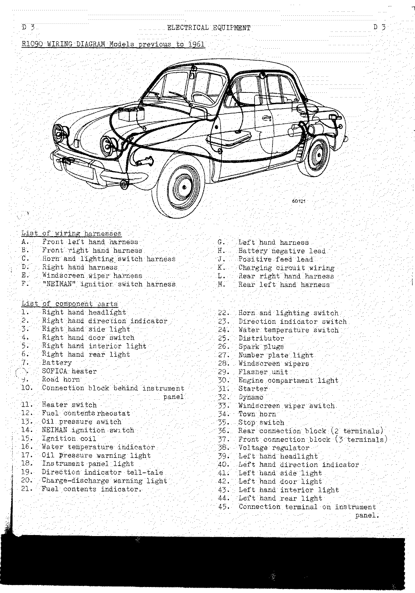

### List of wiring harnesses (R1090 pre-1961)

| Ref. | Harness                          | Ref. | Harness                   |
| ---- | -------------------------------- | ---- | ------------------------- |
| A    | Front left hand harness          | G    | Left hand harness         |
| B    | Front right hand harness         | H    | Battery negative lead     |
| C    | Horn and lighting switch harness | J    | Positive feed lead        |
| D    | Right hand harness               | K    | Charging circuit wiring   |
| E    | Windscreen wiper harness         | L    | Rear right hand harness   |
| F    | "NEIMAN" ignition switch harness | M    | Rear left hand harness    |

### List of component parts (R1090 pre-1961)

| No. | Component                        | No. | Component                              |
| --- | -------------------------------- | --- | -------------------------------------- |
| 1   | Right hand headlight             | 23  | Direction indicator switch             |
| 2   | Right hand direction indicator   | 24  | Water temperature switch               |
| 3   | Right hand side light            | 25  | Distributor                            |
| 4   | Right hand door switch           | 26  | Spark plugs                            |
| 5   | Right hand interior light        | 27  | Number plate light                     |
| 6   | Right hand rear light            | 28  | Windscreen wipers                      |
| 7   | Battery                          | 29  | Flasher unit                           |
| 8   | SOFICA heater                    | 30  | Engine compartment light               |
| 9   | Road horn                        | 31  | Starter                                |
| 10  | Connection block behind instrument panel | 32 | Dynamo                            |
| 11  | Heater switch                    | 33  | Windscreen wiper switch                |
| 12  | Fuel contents rheostat           | 34  | Town horn                              |
| 13  | Oil pressure switch              | 35  | Stop switch                            |
| 14  | NEIMAN ignition switch           | 36  | Rear connection block (2 terminals)    |
| 15  | Ignition coil                    | 37  | Front connection block (3 terminals)   |
| 16  | Water temperature indicator      | 38  | Voltage regulator                      |
| 17  | Oil pressure warning light       | 39  | Left hand headlight                    |
| 18  | Instrument panel light           | 40  | Left hand direction indicator          |
| 19  | Direction indicator tell-tale    | 41  | Left hand side light                   |
| 20  | Charge-discharge warning light   | 42  | Left hand door light                   |
| 21  | Fuel contents indicator          | 43  | Left hand interior light               |
| 22  | Horn and lighting switch         | 44  | Left hand rear light                   |
|     |                                  | 45  | Connection terminal on instrument panel |

### List of wires (R1090 pre-1961)

<!-- PDF p.122 · D-4 -->

Conductor diameters are given as the source figure "in mm" (strand count / tenths of a mm) with the
AWG conversion alongside.

| Harness | Wire | Sleeve and wire colour        | From                   | To                | Ø (mm/10) | AWG |
| ------- | ---- | ----------------------------- | ---------------------- | ----------------- | --------- | --- |
| A       | 201  | Green                         | 37                     | 39G (full bm)     | 16/10     | 14  |
| A       | 202  | Pink                          | 37                     | 39G (dip)         | 16/10     | 14  |
| A       | 203  | Yellow                        | 37                     | 39G (sd. lght)    | 9/10      | 19  |
| B       | 204  | Green                         | 37                     | 1D (full bm)      | 16/10     | 14  |
| B       | 205  | Pink                          | 37                     | 1D (dip)          | 16/10     | 14  |
| B       | 206  | Yellow                        | 37                     | 1D (sd. lght)     | 9/10      | 19  |
| C       | 207  | Black wire (22), blue (10)    | 22 "+" H & L switch    | 10                | 25/10     | 10  |
| C       | 208  | Yellow on yellow wire         | 22 "L.AR" (rear lgt)   | 18                | 12/10     | 16  |
| C       | 209  | Yellow on yellow wire         | 22 "L.AR" (rear lgt)   | 37                | 12/10     | 16  |
| C       | 210  | Pink                          | 22 "C"                 | 37                | 16/10     | 14  |
| C       | 211  | Green                         | 22 "PH" (head lgt)     | 37                | 16/10     | 14  |
| C       | 212  | Violet on red wire            | 22 "V" (town)          | 34                | 16/10     | 14  |
| C       | 213  | White                         | 22 "R" (road)          | 9                 | 16/10     | 14  |
| C       | 214  | Violet on grey wire           | 23 "G"                 | 29                | 12/10     | 16  |
| C       | 215  | Blue, red                     | 23 "+" (dir. ind. sw.) | 29 "CL"           | 12/10     | 16  |
| C       | 216  | Brown on grey wire            | 23 "D"                 | 29                | 12/10     | 16  |
| C       | 217  | Violet on black wire          | 23 "FG" (L.H. lgt.)    | 29                | 9/10      | 19  |
| C       | 218  | Brown on black wire           | 23 "FD" (R.D. lgt.)    | 29                | 9/10      | 19  |
| Single wires | 219 | Pink                     | 35                     | 45                | 12/10     | 16  |
| Single wires | 220 | Red                      | 29 "+"                 | 35                | 12/10     | 16  |
| D       | 221  | Blue                          | 10                     | 7 "+" battery     | 25/10     | 10  |
| D       | 222  | Blue                          | 10                     | 5                 | 9/10      | 19  |
| D       | 223  | Violet, yellow                | 21                     | 12                | 9/10      | 19  |
| D       | 224  | Black                         | 17                     | 13                | 12/10     | 16  |
| D       | 225  | Red                           | 16                     | 15                | 16/10     | 14  |
| D       | 226  | Red                           | 16                     | 11                | 16/10     | 14  |
| D       | 227  | Brown on black wire           | 29                     | 3 (R. hand)       | 9/10      | 19  |
| D       | 228  | Brown                         | 29                     | 2                 | 12/10     | 16  |
| D       | 229  | Black wire, no sleeve         | 5                      | 4                 | 9/10      | 19  |
| D       | 230  | Brown                         | 8                      | 11                | 16/10     | 14  |
| E       | 231  | Blue                          | 33                     | 28 "1"            | 12/10     | 16  |
| E       | 232  | Red                           | 33                     | 28 "2"            | 12/10     | 16  |
| Single wires | 233 | Red                      | 29 "+"                 | 28 "2"            | 12/10     | 16  |
| Single wires | 234 | Red                      | 29 "+"                 | 21                | 16/10     | 14  |
| Single wires | 235 | Red                      | 16                     | 21                | 20/10     | 12  |
| F       | 236  | White (14), blue (10)         | 14 "+"                 | 10                | 25/10     | 10  |
| F       | 237  | Red                           | 14 "B"                 | 16                | 25/10     | 10  |
| G       | 238  | Yellow                        | 36                     | 18                | 12/10     | 16  |
| G       | 239  | Pink                          | 45                     | 36                | 12/10     | 16  |
| G       | 240  | Blue, black (20), blue (38)   | 20                     | 38 "Dyn."         | 12/10     | 16  |
| G       | 241  | Grey                          | 31                     | 14 "D"            | 25/10     | 10  |
| G       | 242  | Violet on black wire          | 29                     | 41 (L. hand)      | 9/10      | 19  |
| G       | 243  | Violet                        | 29                     | 40                | 12/10     | 16  |
| G       | 244  | Brown, black (16), brown (24) | 16                     | 24                | 12/10     | 16  |
| G       | 245  | Blue                          | 10                     | 43                | 9/10      | 19  |
| G       | 246  | Black wire, no sleeve         | 42                     | 43                | 9/10      | 19  |
| Single wire | 247 | White                     | 31                     | 30                | 12/10     | 16  |
| K       | 248  | White                         | 38 "BAT"               | 31                | 25/10     | 10  |
| K       | 249  | Green                         | 38 "EXC" (Fld.)        | 32                | 12/10     | 16  |
| K       | 250  | Blue                          | 38 "DYN"               | 32                | 25/10     | 10  |
| L       | 251  | Pink on salmon pink wire      | 36                     | 6 (Stop)          | 12/10     | 16  |
| L       | 252  | Yellow on red wire            | 36                     | 6 (sd. lght.)     | 9/10      | 19  |
| L       | 253  | Yellow on black wire          | 36                     | 27                | 9/10      | 19  |
| M       | 254  | Yellow on red wire            | 36                     | 44 (sd. lght.)    | 9/10      | 19  |
| M       | 255  | Pink on salmon pink wire      | 36                     | 44 (stop)         | 12/10     | 16  |
| Single wire | 256 | Blue                      | 29 "CL"                | 19                | 9/10      | 19  |

### Wiring diagram schematic (R1090 pre-1961)

<!-- PDF p.123 · D-5 -->

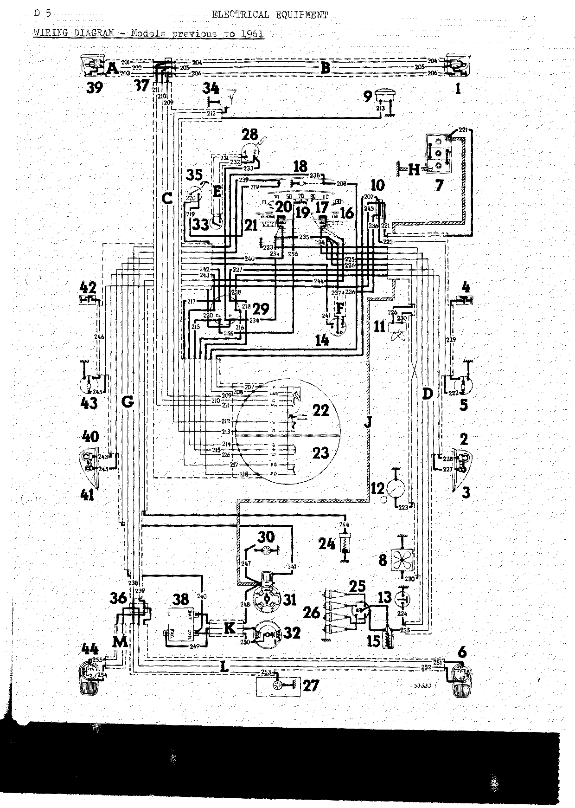

### Component connections (R1090 pre-1961)

<!-- PDF p.124 · D-6 -->

**Instrument panel.** Panel components 16 Water temperature indicator, 17 Oil pressure warning light,
18 Instrument panel light, 19 Direction indicator tell-tale, 20 Charge-discharge warning light,
21 Fuel contents indicator, 45 Terminal on instrument panel. Wires present at the panel:

| Wire No. | Colour of sleeve and wire | Wire No. | Colour of sleeve and wire |
| -------- | ------------------------- | -------- | ------------------------- |
| 208      | yellow on yellow wire     | 235      | red                       |
| 219      | pink                      | 237      | red                       |
| 223      | violet yellow             | 238      | yellow                    |
| 224      | black                     | 239      | pink                      |
| 225      | red                       | 240      | blue black                |
| 226      | red                       | 244      | brown, black              |
| 234      | red                       |          |                           |

**Right hand headlight (1) / left hand headlight (39):**

| Wire — left (39) | Wire — right (1) | Colour |
| ---------------- | ---------------- | ------ |
| 201              | 204              | green  |
| 202              | 205              | pink   |
| 203              | 206              | yellow |

<!-- PDF p.125 · D-7 -->

**Horn and lighting switch (22):**

| Wire No. | Colour of sleeve and wire | Wire No. | Colour of sleeve and wire |
| -------- | ------------------------- | -------- | ------------------------- |
| 207      | black wire                | 214      | violet on grey wire       |
| 208      | yellow on yellow wire     | 215      | blue, red                 |
| 209      | yellow on yellow wire     | 216      | brown on grey wire        |
| 210      | pink                      | 217      | violet on black wire      |
| 211      | green                     | 218      | brown on black wire       |
| 212      | violet on red wire        |          |                           |
| 213      | white                     |          |                           |

**Connection block (front) 3 terminals (37):**

| Wire No. | Colour of sleeve and wire |
| -------- | ------------------------- |
| 201      | green                     |
| 202      | pink                      |
| 203      | yellow                    |
| 204      | green                     |
| 205      | pink                      |
| 206      | yellow                    |
| 209      | yellow on yellow wire     |
| 210      | pink                      |
| 211      | green                     |

<!-- PDF p.126 · D-8 -->

**Flasher unit (29):**

| Wire No. | Colour of sleeve and wire | Wire No. | Colour of sleeve and wire |
| -------- | ------------------------- | -------- | ------------------------- |
| 214      | violet on grey wire       | 228      | brown                     |
| 215      | blue, red                 | 233      | red                       |
| 216      | brown on grey wire        | 234      | red                       |
| 217      | violet on black wire      | 242      | violet on black wire      |
| 218      | brown on black wire       | 244      | violet                    |
| 220      | red                       | 256      | blue                      |
| 227      | brown on black wire       |          |                           |

**Connection block (rear) 2 terminals (36) and voltage regulator (38).** Harnesses: G = left hand
side; K = charging circuit; L = rear right hand; M = rear left hand.

| Wire No. | Colour of sleeve and wire |
| -------- | ------------------------- |
| 238      | yellow                    |
| 239      | pink                      |
| 240      | blue                      |
| 248      | white                     |
| 249      | green                     |
| 250      | blue                      |
| 251      | pink on salmon pink wire  |
| 252      | yellow on red wire        |
| 253      | yellow on black wire      |
| 254      | yellow on red wire        |
| 255      | pink on salmon pink wire  |

<!-- PDF p.127 · D-9 -->

**NEIMAN ignition switch (14):**

| Wire No. | Colour of sleeve and wire |
| -------- | ------------------------- |
| 236      | white                     |
| 237      | red                       |
| 241      | grey                      |

**Starter (31)** — Harness J: positive feed:

| Wire No. | Colour of sleeve and wire |
| -------- | ------------------------- |
| 241      | grey                      |
| 247      | white                     |
| 248      | white                     |

**Windscreen wiper (28):**

| Wire No. | Colour of sleeve and wire |
| -------- | ------------------------- |
| 231      | blue                      |
| 232      | red                       |
| 233      | red                       |

**Dynamo (generator) (32):**

| Wire No. | Colour of sleeve and wire |
| -------- | ------------------------- |
| 249      | green                     |
| 250      | blue                      |

---

## Wiring diagram — R1090 1961 models

<!-- PDF p.128 · D-11 -->

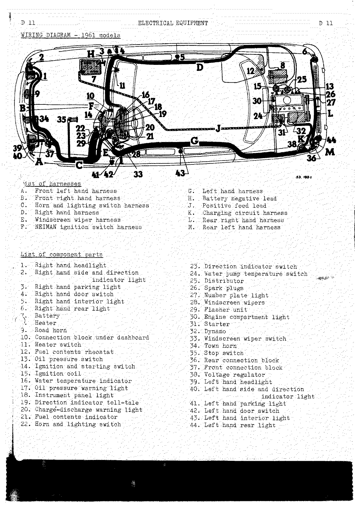

### List of harnesses (R1090 1961)

| Ref. | Harness                          | Ref. | Harness                   |
| ---- | -------------------------------- | ---- | ------------------------- |
| A    | Front left hand harness          | G    | Left hand harness         |
| B    | Front right hand harness         | H    | Battery negative lead     |
| C    | Horn and lighting switch harness | J    | Positive feed lead        |
| D    | Right hand harness               | K    | Charging circuit harness  |
| E    | Windscreen wiper harness         | L    | Rear right hand harness   |
| F    | NEIMAN ignition switch harness   | M    | Rear left hand harness    |

### List of component parts (R1090 1961)

| No. | Component                             | No. | Component                             |
| --- | ------------------------------------- | --- | ------------------------------------- |
| 1   | Right hand headlight                  | 23  | Direction indicator switch            |
| 2   | Right hand side and direction indicator light | 24 | Water pump temperature switch    |
| 3   | Right hand parking light              | 25  | Distributor                           |
| 4   | Right hand door switch                | 26  | Spark plugs                           |
| 5   | Right hand interior light             | 27  | Number plate light                    |
| 6   | Right hand rear light                 | 28  | Windscreen wipers                     |
| 7   | Battery                               | 29  | Flasher unit                          |
| 8   | Heater                                | 30  | Engine compartment light              |
| 9   | Road horn                             | 31  | Starter                               |
| 10  | Connection block under dashboard      | 32  | Dynamo                                |
| 11  | Heater switch                         | 33  | Windscreen wiper switch               |
| 12  | Fuel contents rheostat                | 34  | Town horn                             |
| 13  | Oil pressure switch                   | 35  | Stop switch                           |
| 14  | Ignition and starting switch          | 36  | Rear connection block                 |
| 15  | Ignition coil                         | 37  | Front connection block                |
| 16  | Water temperature indicator           | 38  | Voltage regulator                     |
| 17  | Oil pressure warning light            | 39  | Left hand headlight                   |
| 18  | Instrument panel light                | 40  | Left hand side and direction indicator light |
| 19  | Direction indicator tell-tale         | 41  | Left hand parking light               |
| 20  | Charge-discharge warning light        | 42  | Left hand door switch                 |
| 21  | Fuel contents indicator               | 43  | Left hand interior light              |
| 22  | Horn and lighting switch              | 44  | Left hand rear light                  |

### List of wires (R1090 1961)

<!-- PDF p.129 · D-12 -->

| Harness | Wire | Sleeve and wire colour     | From                    | To                    | Ø (mm/10) | AWG |
| ------- | ---- | -------------------------- | ----------------------- | --------------------- | --------- | --- |
| A       | 101  | Pink                       | 37                      | 39 (dip)              | 16/10     | 14  |
| A       | 102  | Green                      | 37                      | 39 (full bm)          | 16/10     | 14  |
| A       | 103  | No sleeve, red wire        | 39                      | Earth (ground)        | 16/10     | 14  |
| B       | 104  | Pink                       | 37                      | 1 (dip)               | 16/10     | 14  |
| B       | 105  | Green                      | 37                      | 1 (full bm)           | 16/10     | 14  |
| B       | 106  | No sleeve, red wire        | 1                       | Earth (ground)        | 16/10     | 14  |
| C       | 107  | Blue                       | 22 "+"                  | 10                    | 25/10     | 10  |
| C       | 108  | Violet on red wire         | 22 "V" (Town)           | 34                    | 16/10     | 14  |
| C       | 109  | White                      | 22 "R" (Road)           | 9                     | 16/10     | 14  |
| C       | 110  | No sleeve, yellow wire     | 22 "L.AV" (F. lgt)      | 37                    | 16/10     | 14  |
| C       | 111  | Pink                       | 22 "C"                  | 37                    | 16/10     | 14  |
| C       | 112  | Green                      | 22 "PH" (Hd.L)          | 37                    | 16/10     | 14  |
| C       | 113  | No sleeve, yellow wire     | 22 "L.AV" (F. lgt)      | 18                    | 12/10     | 16  |
| C       | 114  | Blue                       | 23 "+"                  | 29 "COM" (Switch)     | 16/10     | 14  |
| C       | 115  | Brown on yellow wire       | 23 "AR.D" (R.RH)        | 29                    | 16/10     | 14  |
| C       | 116  | Violet on grey wire        | 23 "AV.G" (F.LH)        | 40 (Dir. Ind.)        | 16/10     | 14  |
| C       | 117  | Pink                       | 23 "+ Stop"             | 35                    | 16/10     | 14  |
| C       | 118  | Brown on grey wire         | 23 "AV.D" (F.RH)        | 2 (Dir Ind.)          | 16/10     | 14  |
| C       | 119  | Violet on yellow wire      | 23 "AR.G" (R.LH)        | 29                    | 16/10     | 14  |
| C       | 120  | Brown on black wire        | 23 "F.D." (R.H.L)       | 3                     | 9/10      | 19  |
| C       | 121  | Violet on black wire       | 23 "F.G." (L.H.L)       | 41                    | 9/10      | 19  |
| C       | 122  | Red                        | 29 "+"                  | 35                    | 16/10     | 14  |
| C       | 123  | Yellow on red wire         | 37                      | 40 (F. light)         | 12/10     | 16  |
| C       | 124  | Yellow on red wire         | 37                      | 2 (F. light)          | 12/10     | 16  |
| G       | 125  | Brown                      | 29                      | 36                    | 16/10     | 14  |
| G       | 126  | Violet                     | 29                      | 36                    | 16/10     | 14  |
| G       | 127  | Yellow                     | 18                      | 36                    | 16/10     | 14  |
| G       | 128  | Blue                       | 20                      | 38 "DYN"              | 12/10     | 16  |
| G       | 129  | Violet                     | 16                      | 24                    | 9/10      | 19  |
| G       | 130  | Grey                       | 14 "D"                  | 31                    | 25/10     | 10  |
| G       | 131  | Blue                       | 10                      | 43                    | 12/10     | 16  |
| G       | 132  | No sleeve, black wire      | 42                      | 43                    | 9/10      | 19  |
| Single wire | 133 | Red                    | 28 "2"                  | 29 "+"                | 16/10     | 14  |
| E       | 134  | Red                        | 28 "2"                  | 33                    | 16/10     | 14  |
| E       | 135  | Blue                       | 28 "1"                  | 33                    | 16/10     | 14  |
| F       | 136  | Blue (10), white (14)      | 10                      | 14 "+"                | 25/10     | 10  |
| F       | 137  | Red                        | 16                      | 14 "B"                | 25/10     | 10  |
| D       | 138  | Black                      | 17                      | 13                    | 12/10     | 16  |
| D       | 139  | Red                        | 16                      | 11                    | 16/10     | 14  |
| D       | 140  | Brown                      | 11                      | 8                     | 16/10     | 14  |
| D       | 141  | Violet                     | 21                      | 12                    | 12/10     | 16  |
| D       | 142  | Red                        | 16                      | 15                    | 16/10     | 14  |
| D       | 143  | Blue                       | 10                      | 5                     | 12/10     | 16  |
| D       | 144  | Blue                       | 10                      | 7                     | 25/10     | 10  |
| D       | 145  | No sleeve, black wire      | 4                       | 5                     | 9/10      | 19  |
| Single wires | 146 | Red                   | 16                      | 21                    | 20/10     | 12  |
| Single wires | 147 | Red                   | 15                      | 25                    | 16/10     | 14  |
| K       | 148  | White                      | 31                      | 38 "BAT"              | 25/10     | 10  |
| K       | 149  | Green                      | 32 "EXC" (FLD)          | 38 "EXC" (FLD)        | 12/10     | 16  |
| K       | 150  | Blue                       | 32 "DYN"                | 38 "DYN"              | 25/10     | 10  |
| L       | 151  | Brown on salmon pink wire  | 36                      | 6 (Stop)              | 16/10     | 14  |
| L       | 152  | Yellow on red wire         | 36                      | 6 (R. light)          | 12/10     | 16  |
| L       | 153  | Yellow on black wire       | 36                      | 27                    | 9/10      | 19  |
| M       | 154  | Violet on salmon pink wire | 36                      | 44 (Stop)             | 16/10     | 14  |
| M       | 155  | Yellow on red wire         | 36                      | 44 (R. light)         | 12/10     | 16  |
| Single wires | 156 | Red on blue wire      | 19                      | 29 "REP"              | 12/10     | 16  |
| Single wires | 157 | Red                   | 21                      | 29 "+"                | 16/10     | 14  |
| Single wires | 158 | White                 | 31                      | 30                    | 12/10     | 16  |

### Wiring diagram schematic (R1090 1961)

<!-- PDF p.130 · D-13 -->

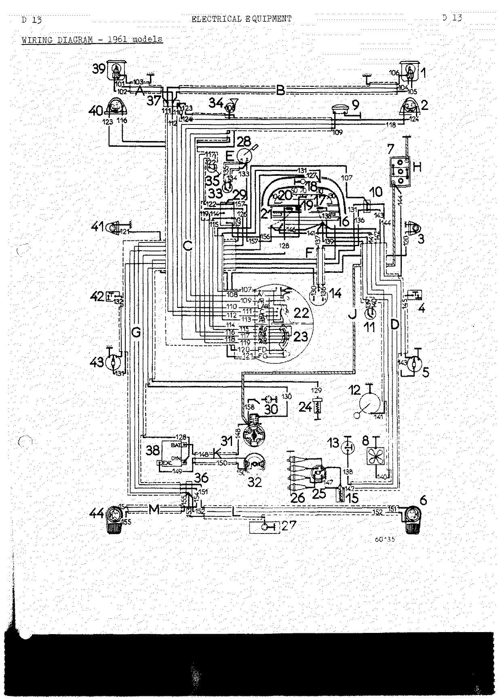

### Component connections (R1090 1961)

<!-- PDF p.131 · D-14 -->

**Instrument panel.** Panel components 16 Water temperature indicator, 17 Oil pressure warning light,
18 Instrument panel light, 19 Direction indicator tell-tale, 20 Charge-discharge warning light,
21 Fuel contents indicator. Wires present at the panel:

| Wire No. | Colour of sleeve and wire | Wire No. | Colour of sleeve and wire |
| -------- | ------------------------- | -------- | ------------------------- |
| 113      | yellow wire               | 138      | black                     |
| 127      | yellow                    | 139      | red                       |
| 128      | blue                      | 141      | violet                    |
| 129      | violet                    | 142      | red                       |
| 137      | red                       | 146      | red                       |
|          |                           | 156      | red on blue wire          |
|          |                           | 157      | red                       |

**Right hand headlight (1) / left hand headlight (39):**

| Wire — left | Wire — right | Colour   |
| ----------- | ------------ | -------- |
| 101         | 104          | pink     |
| 102         | 105          | green    |
| 103         | 106          | red wire |

<!-- PDF p.132 · D-15 -->

**Horn and lighting switch (22):**

| Wire No. | Colour of sleeve and wire |
| -------- | ------------------------- |
| 107      | blue                      |
| 108      | violet on red wire        |
| 109      | white                     |
| 110      | yellow wire               |
| 111      | pink                      |
| 112      | green                     |
| 113      | yellow wire               |

**Direction indicator switch (23):**

| Wire No. | Colour of sleeve and wire |
| -------- | ------------------------- |
| 114      | blue                      |
| 115      | brown on yellow wire      |
| 116      | violet on grey wire       |
| 117      | pink                      |
| 118      | brown on grey wire        |
| 119      | violet on yellow wire     |
| 120      | brown on black wire       |
| 121      | violet on black wire      |

**Connection block under dashboard (10):**

| Wire No. | Colour of sleeve and wire |
| -------- | ------------------------- |
| 107      | blue                      |
| 131      | blue                      |
| 136      | blue                      |
| 143      | blue                      |
| 144      | blue                      |

<!-- PDF p.133 · D-16 -->

**Rear connection block (36) and voltage regulator (38):**

| Wire No. | Colour of sleeve and wire | Wire No. | Colour of sleeve and wire   |
| -------- | ------------------------- | -------- | --------------------------- |
| 125      | brown                     | 150      | blue                        |
| 126      | violet                    | 151      | brown on salmon pink wire   |
| 127      | yellow                    | 152      | yellow on red wire          |
| 128      | blue                      | 153      | yellow on black wire        |
| 148      | white                     | 154      | violet on salmon pink wire  |
| 149      | green                     | 155      | yellow on red wire          |

**Flasher unit (29):**

| Wire No. | Colour of sleeve and wire |
| -------- | ------------------------- |
| 114      | blue                      |
| 115      | brown on yellow wire      |
| 119      | violet on yellow wire     |
| 122      | red                       |
| 125      | brown                     |
| 126      | violet                    |
| 133      | red                       |
| 156      | red on blue wire          |
| 157      | red                       |

**Front connection block (37):**

| Wire No. | Colour of sleeve and wire |
| -------- | ------------------------- |
| 101      | pink                      |
| 102      | green                     |
| 104      | pink                      |
| 105      | green                     |
| 110      | yellow wire               |
| 111      | pink                      |
| 112      | green                     |
| 123      | yellow on red wire        |
| 124      | yellow on red wire        |

<!-- PDF p.134 · D-17 -->

**Starting and ignition switch (14):**

| Wire No. | Colour of sleeve and wire |
| -------- | ------------------------- |
| 130      | grey                      |
| 136      | white                     |
| 137      | red                       |

**Windscreen wiper (28):**

| Wire No. | Colour of sleeve and wire |
| -------- | ------------------------- |
| 133      | red                       |
| 134      | red                       |
| 135      | blue                      |

**Starter (31):**

| Wire No. | Colour of sleeve and wire |
| -------- | ------------------------- |
| 130      | grey                      |
| 148      | white                     |
| 158      | white                     |

**Dynamo (32):**

| Wire No. | Colour of sleeve and wire |
| -------- | ------------------------- |
| 149      | green                     |
| 150      | blue                      |

---

## Wiring diagram — R1090 12-volt system

<!-- PDF p.135 · D-19 -->

### List of harnesses (R1090 12-volt)

| Ref. | Harness                          | Ref. | Harness                   |
| ---- | -------------------------------- | ---- | ------------------------- |
| A    | Front left hand harness          | G    | Left hand harness         |
| B    | Front right hand harness         | H    | Battery negative lead     |
| C    | Horn and lighting switch harness | J    | Positive feed lead        |
| D    | Right hand harness               | K    | Charging circuit harness  |
| E    | Windscreen wiper harness         | L    | Rear right hand harness   |
| F    | Heater switch harness            | M    | Rear left hand harness    |

### List of component parts (R1090 12-volt)

| No. | Component                             | No. | Component                             |
| --- | ------------------------------------- | --- | ------------------------------------- |
| 1   | Right and left hand Sealed-Beam headlights | 20 | NEIMAN ignition and starting switch |
| 2   | Front right and left hand side and direction indicator lights | 21 | Right and left hand door switches |
| 3   | Road horn                             | 22  | Right and left hand interior lights   |
| 4   | Town horn                             | 23  | Fuel contents rheostat                |
| 5   | Battery                               | 24  | Temperature switch                    |
| 6   | Windscreen wiper                      | 25  | Oil pressure switch                   |
| 7   | Windscreen wiper switch               | 26  | Ignition coil                         |
| 8   | Stop switch                           | 27  | Distributor                           |
| 9   | Heater switch                         | 28  | Spark plugs                           |
| 10  | Connection block behind instrument panel (2 terminals) | 29 | Engine compartment light |
| 11  | Water temperature indicator           | 30  | Starter                               |
| 12  | Fuel contents gauge                   | 31  | Dynamo (generator)                    |
| 13  | Charge-discharge warning light        | 32  | Number plate light                    |
| 14  | Oil temperature warning light         | 33  | Voltage regulator (3 section)         |
| 15  | Headlight tell-tale light             | 34  | Horn and lighting switch              |
| 16  | Direction indicator tell-tale         | 35  | Rear connection block (3 terminals)   |
| 17  | Instrument panel light                | 36  | Left and right hand rear, stop and direction indicator lights |
| 18  | Flasher unit                          | 37  | Front connection block (3 terminals)  |
| 19  | SOFICA heater                         | 38  | Fuse box                              |
|     |                                       | 39  | Foot operated dip switch              |
|     |                                       | 40  | Heater resistance                     |

### List of wires (R1090 12-volt)

<!-- PDF p.136 · D-20 -->

| Harness | Wire | Sleeve and wire colour        | From          | To               | Ø (mm/10) | AWG |
| ------- | ---- | ----------------------------- | ------------- | ---------------- | --------- | --- |
| A       | 301  | Green                         | 1             | 37               | 12/10     | 16  |
| A       | 302  | Pink                          | 1             | 37               | 12/10     | 16  |
| A       | 303  | Grey                          | 1             | Earth (ground)   | 12/10     | 16  |
| B       | 304  | Pink                          | 1             | 37               | 12/10     | 16  |
| B       | 305  | Green                         | 1             | 37               | 12/10     | 16  |
| B       | 306  | Grey                          | 1             | Earth (ground)   | 12/10     | 16  |
| C       | 307  | Grey                          | 10            | 34               | 12/10     | 16  |
| C       | 308  | Yellow wire, no sleeve        | 4             | 34               | 12/10     | 16  |
| C       | 309  | White                         | 3             | 34               | 12/10     | 16  |
| C       | 310  | Yellow                        | 37            | 34               | 9/10      | 19  |
| C       | 311  | Black                         | 39            | 34               | 16/10     | 14  |
| C       | 312  | Yellow wire, no sleeve        | 17            | 34               | 12/10     | 16  |
| C       | 313  | Blue                          | 18            | 34               | 12/10     | 16  |
| C       | 314  | Brown on red wire             | 18            | 34               | 9/10      | 19  |
| C       | 315  | Violet                        | 2             | 34               | 9/10      | 19  |
| C       | 316  | Red                           | 8             | 34               | 12/10     | 16  |
| C       | 317  | Brown                         | 2             | 34               | 9/10      | 19  |
| C       | 318  | Red                           | 18            | 34               | 16/10     | 14  |
| C       | 319  | Pink                          | 15            | 39               | 16/10     | 14  |
| C       | 320  | Pink                          | 37            | 39               | 16/10     | 14  |
| C       | 321  | Yellow                        | 37            | 2                | 9/10      | 19  |
| C       | 322  | Yellow                        | 37            | 2                | 9/10      | 19  |
| C       | 323  | Pink                          | 18            | 18               | 12/10     | 16  |
| C       | 364  | Green                         | 37            | 39               | 16/10     | 14  |
| D       | 332  | Blue                          | 10            | 5                | 25/10     | 10  |
| D       | 333  | Blue                          | 22            | 38               | 9/10      | 19  |
| D       | 334  | Brown                         | 19            | 40               | 12/10     | 16  |
| D       | 335  | Black                         | 25            | 14               | 12/10     | 16  |
| D       | 336  | Violet (23), violet-yellow (12) | 23          | 12               | 9/10      | 19  |
| D       | 337  | Red                           | 26            | 20               | 12/10     | 16  |
| D       | 338  | Red                           | 11            | 38               | 12/10     | 16  |
| D       | 339  | Red                           | 20            | 38               | 20/10     | 12  |
| D       | 340  | Blue                          | 10            | 38               | 16/10     | 14  |
| D       | 341  | Black wire, no sleeve         | 22            | 21               | 9/10      | 19  |
| E       | 354  | Blue                          | 6 Terminal (1) | 7               | 12/10     | 16  |
| E       | 355  | Red                           | 6 Terminal (2) | 7               | 12/10     | 16  |
| E       | 356  | Red                           | 38            | 7                | 12/10     | 16  |
| F       | 351  | Brown                         | 40            | 9                | 16/10     | 14  |
| F       | 352  | Brown                         | 40            | 9                | 16/10     | 14  |
| F       | 353  | Red                           | 9             | (11)             | 16/10     | 14  |
| G       | 324  | Blue                          | 22            | 38               | 9/10      | 19  |
| G       | 325  | Blue                          | 9             | 38               | 9/10      | 19  |
| G       | 326  | Pink                          | 17            | 35               | 12/10     | 16  |
| G       | 327  | Brown on red wire             | 18            | 35               | 9/10      | 19  |
| G       | 328  | Violet on black wire          | 18            | 35               | 9/10      | 19  |
| G       | 329  | Blue                          | 13            | 33               | 9/10      | 19  |
| G       | 330  | Brown (24), brown black (11)  | 11            | 24               | 12/10     | 16  |
| G       | 331  | Grey                          | 30            | 20               | 20/10     | 12  |
| G       | 363  | Black wire, no sleeve         | 22            | 21               | 9/10      | 19  |
| K       | 348  | White                         | 33            | 30               | 30/10     | 9   |
| K       | 349  | Green                         | 33            | 31               | 12/10     | 16  |
| K       | 350  | Blue                          | 33            | 31               | 30/10     | 9   |
| L       | 343  | Pink on blue wire             | 36            | 35               | 9/10      | 19  |
| L       | 344  | Yellow on red wire            | 36            | 35               | 9/10      | 19  |
| L       | 345  | Yellow on red wire            | 32            | 35               | 9/10      | 19  |
| M       | 346  | Pink on blue wire             | 36            | 35               | 9/10      | 19  |
| M       | 347  | Yellow on red wire            | 36            | 35               | 9/10      | 19  |
| Single wires | 357 | Red                     | 12            | 11               | 16/10     | 14  |
| Single wires | 358 | Red                     | 12            | 18               | 12/10     | 16  |
| Single wires | 359 | Red                     | 16            | 18               | 9/10      | 19  |
| Single wires | 360 | Red                     | 27            | 26               | 12/10     | 16  |
| Single wires | 361 | Black                   | 20            | 13               | 12/10     | 16  |
| Single wires | 362 | White                   | 20            | 10               | 20/10     | 12  |

### Wiring diagram schematic (R1090 12-volt)

<!-- PDF p.137 · D-21 -->

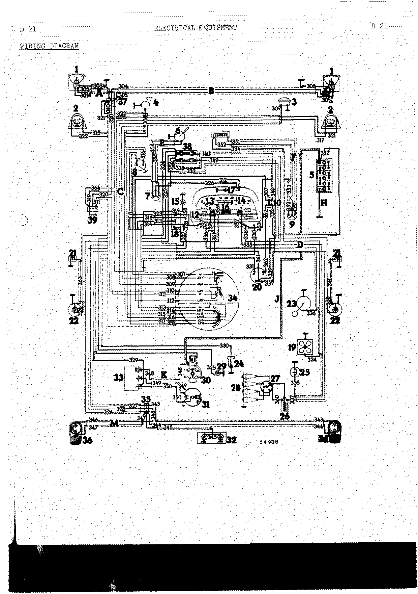

### Component connections (R1090 12-volt)

<!-- PDF p.138 · D-22 -->

**Instrument panel.** Panel components 11 Water temperature indicator, 12 Fuel contents indicator,
13 Charge-discharge warning light, 14 Oil pressure warning light, 16 Direction indicator tell-tale,
17 Instrument panel light. Wires present at the panel:

| Wire No. | Colour of sleeve and wire | Wire No. | Colour of sleeve and wire |
| -------- | ------------------------- | -------- | ------------------------- |
| 312      | yellow wire               | 355      | red                       |
| 326      | pink                      | 357      | red                       |
| 329      | blue                      | 358      | red                       |
| 330      | brown black               | 359      | red                       |
| 336      | violet yellow             | 361      | black                     |
| 338      | red                       |          |                           |
| 353      | red                       |          |                           |

**Flasher unit (18):**

| Wire No. | Colour of sleeve and wire |
| -------- | ------------------------- |
| 313      | blue                      |
| 314      | brown on red wire         |
| 318      | red                       |
| 323      | pink                      |
| 327      | brown on red wire         |
| 328      | violet on black wire      |
| 358      | red                       |
| 359      | red                       |

<!-- PDF p.139 · D-23 -->

**Horn and lighting switch (34):**

| Wire No. | Colour of sleeve and wire | Wire No. | Colour of sleeve and wire |
| -------- | ------------------------- | -------- | ------------------------- |
| 307      | grey                      | 313      | blue                      |
| 308      | yellow wire               | 314      | brown on red wire         |
| 309      | white                     | 315      | violet                    |
| 310      | yellow                    | 316      | red                       |
| 311      | black                     | 317      | brown                     |
| 312      | yellow wire               | 318      | red                       |

**Windscreen wiper (7):**

| Wire No. | Colour of sleeve and wire |
| -------- | ------------------------- |
| 354      | blue                      |
| 355      | red                       |
| 356      | red                       |

**Connection block behind instrument panel (2 terminals) (10):**

| Wire No. | Colour of sleeve and wire |
| -------- | ------------------------- |
| 307      | grey                      |
| 332      | blue                      |
| 362      | white                     |

<!-- PDF p.140 · D-24 -->

**3 section voltage regulator (33) / connection block behind instrument panel (2 terminals) (35):**

| Wire No. | Colour of sleeve and wire |
| -------- | ------------------------- |
| 326      | pink                      |
| 327      | brown on red wire         |
| 328      | violet on black wire      |
| 329      | blue                      |
| 343      | pink on blue wire         |
| 344      | yellow on red wire        |
| 345      | yellow on red wire        |
| 346      | pink on blue wire         |
| 347      | yellow on red wire        |
| 348      | white                     |
| 349      | green                     |
| 350      | blue                      |

**Headlights / foot operated dip switch (39):**

| Wire — left | Wire — right | Colour |
| ----------- | ------------ | ------ |
| 301         | 305          | green  |
| 302         | 304          | pink   |
| 303         | 306          | grey   |

Dip switch single wires: 311 black; 319 pink; 320 pink; 364 green.

<!-- PDF p.141 · D-25 -->

**NEIMAN ignition and starting switch (20):**

| Wire No. | Colour of sleeve and wire |
| -------- | ------------------------- |
| 331      | grey                      |
| 337      | red                       |
| 339      | red                       |
| 362      | white                     |

**Starter (30):**

| Wire No. | Colour of sleeve and wire |
| -------- | ------------------------- |
| 331      | grey                      |
| 348      | white                     |

**Front connection block (3 terminals) (37):**

| Wire No. | Colour of sleeve and wire |
| -------- | ------------------------- |
| 301      | green                     |
| 302      | pink                      |
| 304      | pink                      |
| 305      | green                     |
| 310      | yellow                    |
| 320      | pink                      |
| 321      | yellow                    |
| 322      | yellow                    |
| 364      | green                     |

---

## Wiring diagram — R1091 Gordini (1960 and 1961 models)

<!-- PDF p.142 · D-26 -->

### List of wiring harnesses (R1091 Gordini)

| Ref. | Harness                          | Ref. | Harness                   |
| ---- | -------------------------------- | ---- | ------------------------- |
| A    | Front left hand harness          | G    | Left hand harness         |
| B    | Front right hand harness         | H    | Battery negative lead     |
| C    | Horn and lighting switch harness | J    | Positive feed lead        |
| D    | Right hand harness               | K    | Charging circuit harness  |
| E    | Windscreen wiper harness         | L    | Rear right hand harness   |
| F    | NEIMAN ignition switch harness   | M    | Rear left hand harness    |

### List of component parts (R1091 Gordini)

| No. | Component                        | No. | Component                             |
| --- | -------------------------------- | --- | ------------------------------------- |
| 1   | Right hand headlight             | 25  | Distributor                           |
| 2   | Right hand direction indicator   | 26  | Spark plugs                           |
| 3   | Right hand side light            | 27  | Number plate light                    |
| 4   | Right hand door switch           | 28  | Windscreen wiper                      |
| 5   | Right hand interior light        | 29  | Flasher unit                          |
| 6   | Right hand rear light            | 30  | Engine compartment light              |
| 7   | Battery                          | 31  | Starter                               |
| 8   | SOFICA heater                    | 32  | Dynamo (generator)                    |
| 9   | Road horn                        | 33  | Windscreen wiper switch               |
| 10  | Connection block behind instrument panel | 34 | Town horn                        |
| 11  | Heater switch                    | 35  | Stop switch                           |
| 12  | Fuel contents rheostat           | 36  | Rear connection block (1 terminal on the 1960 model; 3 terminals on the 1961 model) |
| 13  | Oil pressure switch              | 37  | Front connection block                |
| 14  | NEIMAN ignition switch           | 38  | Voltage regulator                     |
| 15  | Ignition coil                    | 39  | Left hand headlight                   |
| 16  | Water temperature gauge          | 40  | Left hand direction indicator         |
| 17  | Oil pressure warning light       | 41  | Left hand side light                  |
| 18  | Instrument panel light           | 42  | Left hand door switch                 |
| 19  | Direction indicator tell-tale    | 43  | Left hand interior light              |
| 20  | Charge-discharge warning light   | 44  | Left hand rear light                  |
| 21  | Fuel contents indicator          | 45  | Rear connection block (2 terminals on the 1960 model) |
| 22  | Horn and lighting switch         | 46  | Headlight tell-tale light             |
| 23  | Direction indicator switch       | 47  | Parking light switch (1960 model)     |
| 24  | Temperature switch               |     |                                       |

### Harness routing (Gordini 1960 and 1961)

<!-- PDF p.143 · D-27 -->

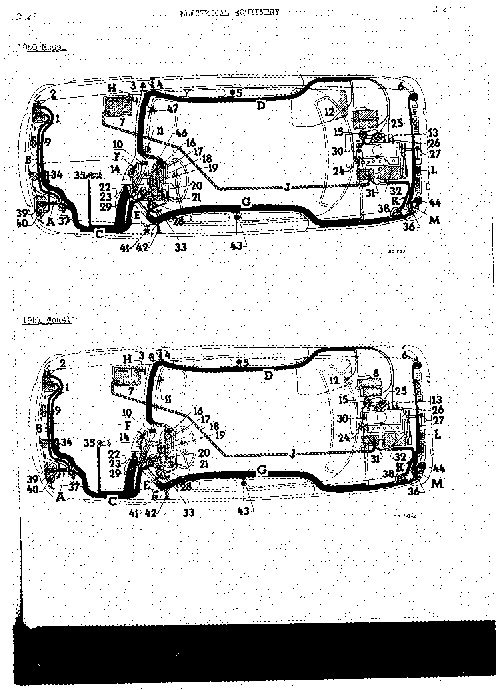

### List of wires — Gordini 1960 model

<!-- PDF p.144 · D-28 -->

| Harness | Wire | Sleeve and wire colour        | From                   | To                | Ø (mm/10) | AWG |
| ------- | ---- | ----------------------------- | ---------------------- | ----------------- | --------- | --- |
| A       | 101  | Pink on red wire              | 37                     | 39 (C)            | 16/10     | 14  |
| A       | 102  | Green on blue wire            | 37                     | 39 (R) (Road)     | 16/10     | 14  |
| A       | 103  | No sleeve, red wire           | 39 (M)                 | Earth (ground)    | 16/10     | 14  |
| B       | 105  | Green on blue wire            | 1 (R) (Road)           | 37                | 16/10     | 14  |
| B       | 106  | Pink on red wire              | 1 (C)                  | 37                | 16/10     | 14  |
| B       | 107  | No sleeve, red wire           | 1 (M)                  | Earth (ground)    | 16/10     | 14  |
| C       | 110  | Blue                          | 22 "+"                 | 10                | 25/10     | 10  |
| C       | 111  | Violet on red wire            | 22 "V" (Town)          | 34                | 16/10     | 14  |
| C       | 112  | White                         | 22 "R" (Road)          | 9                 | 16/10     | 14  |
| C       | 113  | No sleeve, yellow wire        | 22 "L.AR" (R. lgt)     | 37                | 16/10     | 14  |
| C       | 114  | Pink                          | 22 "C"                 | 37                | 16/10     | 14  |
| C       | 115  | Green                         | 22 "PH" (HdL)          | 37                | 16/10     | 14  |
| C       | 116  | No sleeve, yellow wire        | 22 "L.AR" (R. lgt)     | 18                | 12/10     | 16  |
| C       | 117  | Blue                          | 23 "+"                 | 29 "COM" (Switch) | 16/10     | 14  |
| C       | 118  | Brown on yellow wire          | 23 "AR.D" (R.RH)       | 29                | 16/10     | 14  |
| C       | 119  | Violet on grey wire           | 23 "AV.G" (F.LH)       | 40 (Dir. Ind.)    | 16/10     | 14  |
| C       | 120  | Pink                          | 23 "+" Stop            | 35                | 16/10     | 14  |
| C       | 121  | Brown on grey wire            | 23 "AV.D" (F.RH)       | 2 (Dir. Ind.)     | 16/10     | 14  |
| C       | 122  | Violet on yellow wire         | 23 "AR.G" (R.LH)       | 29                | 16/10     | 14  |
| C       | 125  | Red                           | 29 "+"                 | 35                | 16/10     | 14  |
| C       | 126  | Yellow on red wire            | 37                     | 40 (Sd. lgt)      | 12/10     | 16  |
| C       | 127  | Yellow on red wire            | 37                     | 2 (Sd. lgt)       | 12/10     | 16  |
| C       | 128  | Green                         | 22 "FH" (HdL)          | 47                | 9/10      | 19  |
| D       | 130  | Black                         | 17                     | 13                | 12/10     | 16  |
| D       | 131  | Red                           | 16                     | 11                | 16/10     | 14  |
| D       | 132  | Brown                         | 11                     | 8                 | 16/10     | 14  |
| D       | 133  | Violet                        | 21                     | 12                | 12/10     | 16  |
| D       | 134  | Red                           | 16                     | 15                | 16/10     | 14  |
| D       | 135  | Blue                          | 10                     | 5                 | 12/10     | 16  |
| D       | 136  | Blue                          | 10                     | 7 "+"             | 25/10     | 10  |
| D       | 137  | No sleeve, black wire         | 4                      | 5                 | 9/10      | 19  |
| E       | 140  | Red                           | 28 "2"                 | 33                | 16/10     | 14  |
| E       | 141  | Blue                          | 28 "1"                 | 33                | 16/10     | 14  |
| F       | 145  | Blue (10) white (14)          | 10                     | 14 "+"            | 25/10     | 10  |
| F       | 146  | Red                           | 16                     | 14 "B"            | 25/10     | 10  |
| G       | 150  | Brown                         | 29                     | 45                | 16/10     | 14  |
| G       | 151  | Violet                        | 29                     | 45                | 16/10     | 14  |
| G       | 152  | Yellow                        | 18                     | 36                | 16/10     | 14  |
| G       | 153  | Blue                          | 20                     | 38 "DYN"          | 12/10     | 16  |
| G       | 154  | Violet                        | 16                     | 24                | 9/10      | 19  |
| G       | 155  | Grey                          | 14 "D"                 | 31                | 25/10     | 10  |
| G       | 156  | Blue                          | 10                     | 43                | 12/10     | 16  |
| G       | 157  | No sleeve, black wire         | 42                     | 43                | 9/10      | 19  |
| H       | —    | Battery negative lead         | —                      | —                 | 55/10     | —   |
| J       | —    | Positive feed lead            | —                      | —                 | 55/10     | —   |
| K       | 160  | White                         | 38 "BAT"               | 31                | 25/10     | 10  |
| K       | 161  | Green                         | 38 "EXC" (FLD)         | 32 "EXC" (FLD)    | 12/10     | 16  |
| K       | 162  | Blue                          | 38 "DYN"               | 32 "DYN"          | 25/10     | 10  |
| L       | 165  | Violet on salmon pink wire    | 45                     | 44 (Stop)         | 16/10     | 14  |
| L       | 166  | Yellow on blue wire           | 36                     | 44 (R. lgt)       | 12/10     | 16  |
| M       | 170  | Brown on salmon pink wire     | 45                     | 6 (Stop)          | 16/10     | 14  |
| M       | 171  | Yellow on red wire            | 36                     | 6 (R. lgt)        | 12/10     | 16  |
| M       | 172  | Yellow on blue wire           | 36                     | 27                | 9/10      | 19  |
| Single wires | 180 | Red on blue wire         | 19                     | 29 "REP"          | 12/10     | 16  |
| Single wires | 181 | Red                      | 21                     | 29 "+"            | 16/10     | 14  |
| Single wires | 182 | White                    | 31                     | 30                | 12/10     | 16  |
| Single wires | 183 | Red                      | 16                     | 21                | 20/10     | 12  |
| Single wires | 184 | Red                      | 15                     | 25                | 16/10     | 14  |
| Single wires | 185 | Red                      | 28 "2"                 | 29 "+"            | 16/10     | 14  |
| Single wires | 186 | Blue                     | 10                     | 46 (Centre stud)  | 12/10     | 16  |
| Single wires | 187 | No sleeve (right hand)   | 46                     | 3                 | 12/10     | 16  |
| Single wires | 188 | No sleeve (left hand)    | 46                     | 41                | 12/10     | 16  |

### Wiring diagram schematic — Gordini 1960 model

<!-- PDF p.145 · D-29 -->

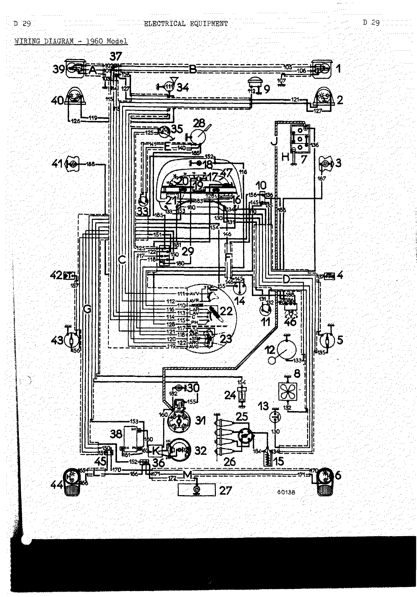

### List of wires — Gordini 1961 model

<!-- PDF p.146 · D-30 -->

> **Note:** On this page the conductor-diameter and AWG columns are blank for harness G (wires
> 150–157) in the source table.

| Harness | Wire | Sleeve and wire colour        | From                   | To                | Ø (mm/10) | AWG |
| ------- | ---- | ----------------------------- | ---------------------- | ----------------- | --------- | --- |
| A       | 101  | Pink on red wire              | 37                     | 39 (C)            | 16/10     | 14  |
| A       | 102  | Green on blue wire            | 37                     | 39 (R) (Road)     | 16/10     | 14  |
| A       | 103  | No sleeve, red wire           | 39 (M)                 | Earth (ground)    | 16/10     | 14  |
| B       | 105  | Green on blue wire            | 1 (R) (Road)           | 37                | 16/10     | 14  |
| B       | 106  | Pink on red wire              | 1 (C)                  | 37                | 16/10     | 14  |
| B       | 107  | No sleeve, red wire           | 1 (M)                  | Earth (ground)    | 16/10     | 14  |
| C       | 110  | Blue                          | 22 "+"                 | 10                | 25/10     | 10  |
| C       | 111  | Violet on red wire            | 22 "V" (Town)          | 34                | 16/10     | 14  |
| C       | 112  | White                         | 22 "R" (Road)          | 9                 | 16/10     | 14  |
| C       | 113  | No sleeve, yellow wire        | 22 "L.AR" (R. Lgt)     | 37                | 16/10     | 14  |
| C       | 114  | Pink                          | 22 "C"                 | 37                | 16/10     | 14  |
| C       | 115  | Green                         | 22 "PH" (HdL)          | 37                | 16/10     | 14  |
| C       | 116  | No sleeve, yellow wire        | 22 "L.AR" (R. lgt)     | 18                | 12/10     | 16  |
| C       | 117  | Blue                          | 23 "+"                 | 29 "COM" (Switch) | 16/10     | 14  |
| C       | 118  | Brown on yellow wire          | 23 "AR.D" (R.RH)       | 29                | 16/10     | 14  |
| C       | 119  | Violet on grey wire           | 23 "AV.G" (F.LH)       | 40 (Dir. Ind.)    | 16/10     | 14  |
| C       | 120  | Pink                          | 23 "+" Stop            | 35                | 16/10     | 14  |
| C       | 121  | Brown on grey wire            | 23 "AV.D" (F.RH)       | 2 (Dir. Ind.)     | 16/10     | 14  |
| C       | 122  | Violet on yellow wire         | 23 "AR.G" (R.LH)       | 29                | 16/10     | 14  |
| C       | 123  | Brown on black wire           | 23 "FD" (RHL)          | 3                 | 9/10      | 19  |
| C       | 124  | Violet on black wire          | 23 "FG" (LHL)          | 41                | 9/10      | 19  |
| C       | 125  | Red                           | 29 "+"                 | 35                | 16/10     | 14  |
| C       | 126  | Yellow on red wire            | 37                     | 40 (Sd. lgt)      | 12/10     | 16  |
| C       | 127  | Yellow on red wire            | 37                     | 2 (Sd. lgt)       | 12/10     | 16  |
| C       | 128  | Green                         | 22 "PH" (HdL)          | 47                | 9/10      | 19  |
| D       | 130  | Black                         | 17                     | 13                | 12/10     | 16  |
| D       | 131  | Red                           | 16                     | 11                | 16/10     | 14  |
| D       | 132  | Brown                         | 11                     | 8                 | 16/10     | 14  |
| D       | 133  | Violet                        | 21                     | 12                | 12/10     | 16  |
| D       | 134  | Red                           | 16                     | 15                | 16/10     | 14  |
| D       | 135  | Blue                          | 10                     | 5                 | 12/10     | 16  |
| D       | 136  | Blue                          | 10                     | 7 "+"             | 25/10     | 10  |
| D       | 137  | No sleeve, black wire         | 4                      | 5                 | 9/10      | 19  |
| E       | 140  | Red                           | 28 "2"                 | 33                | 16/10     | 14  |
| E       | 141  | Blue                          | 28 "1"                 | 33                | 16/10     | 14  |
| F       | 145  | Blue (10) white (14)          | 10                     | 14 "+"            | 25/10     | 10  |
| F       | 146  | Red                           | 16                     | 14 "B"            | 25/10     | 10  |
| G       | 150  | Brown                         | 29                     | 45                | —         | —   |
| G       | 151  | Violet                        | 29                     | 45                | —         | —   |
| G       | 152  | Yellow                        | 18                     | 36                | —         | —   |
| G       | 153  | Blue                          | 20                     | 38 "DYN"          | —         | —   |
| G       | 154  | Violet                        | 16                     | 24                | —         | —   |
| G       | 155  | Grey                          | 14 "D"                 | 31                | —         | —   |
| G       | 156  | Blue                          | 10                     | 43                | —         | —   |
| G       | 157  | No sleeve, black wire         | 42                     | 43                | —         | —   |
| H       | —    | Battery negative lead         | —                      | —                 | 55/10     | —   |
| J       | —    | Positive feed lead            | —                      | —                 | 55/10     | —   |
| K       | 160  | White                         | 38 "BAT"               | 31                | 25/10     | 10  |
| K       | 161  | Green                         | 38 "EXC" (FLD)         | 32 "EXC" (FLD)    | 12/10     | 16  |
| K       | 162  | Blue                          | 38 "DYN"               | 32 "DYN"          | 25/10     | 10  |
| L       | 165  | Violet on salmon pink wire    | 36                     | 44 (Stop)         | 16/10     | 14  |
| L       | 166  | Yellow on blue wire           | 36                     | 44 (R. lgt)       | 12/10     | 16  |
| M       | 170  | Brown on salmon pink wire     | 36                     | 6 (Stop)          | 16/10     | 14  |
| M       | 171  | Yellow on red wire            | 36                     | 6 (R. lgt)        | 12/10     | 16  |
| M       | 172  | Yellow on blue wire           | 36                     | 27                | 9/10      | 19  |
| Single wires | 180 | Red on blue wire         | 19                     | 29 "REP"          | 12/10     | 16  |
| Single wires | 181 | Red                      | 21                     | 29 "+"            | 16/10     | 14  |
| Single wires | 182 | White                    | 31                     | 30                | 12/10     | 16  |
| Single wires | 183 | Red                      | 16                     | 21                | 20/10     | 12  |
| Single wires | 184 | Red                      | 15                     | 25                | 16/10     | 14  |
| Single wires | 185 | Red                      | 28 "2"                 | 29 "+"            | 16/10     | 14  |

### Wiring diagram schematic — Gordini 1961 model

<!-- PDF p.147 · D-31 -->

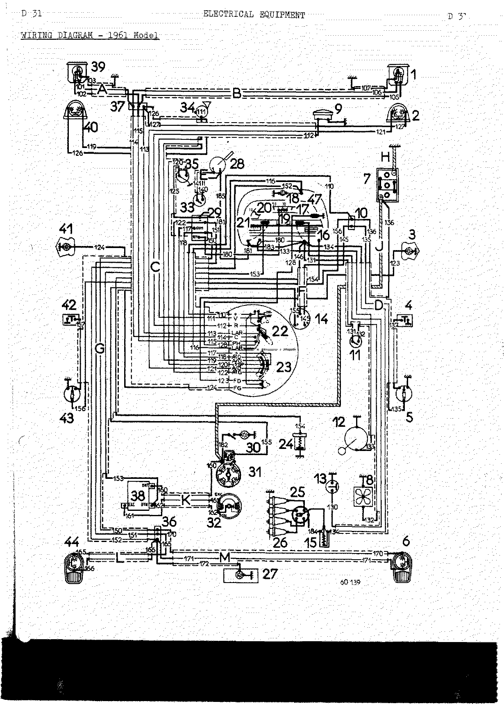

### Component connections (Gordini)

<!-- PDF p.148 · D-32 -->

**Instrument panel.** Panel components 16 Water temperature gauge, 17 Oil pressure warning light,
18 Instrument panel light, 19 Direction indicator tell-tale, 20 Charge-discharge warning light,
21 Fuel contents indicator, 47 Parking light switch (1960 model). Wires present at the panel:

| Wire No. | Colour of sleeve and wire | Wire No. | Colour of sleeve and wire |
| -------- | ------------------------- | -------- | ------------------------- |
| 116      | yellow wire               | 152      | yellow                    |
| 128      | green                     | 153      | blue                      |
| 130      | black                     | 154      | violet                    |
| 131      | red                       | 180      | red on blue wire          |
| 133      | violet                    | 181      | red                       |
| 134      | red                       | 183      | red                       |
| 126      | red                       |          |                           |

**Right hand headlight (1) / left hand headlight (39):**

| Wire — left | Wire — right | Colour             |
| ----------- | ------------ | ------------------ |
| 101         | 106          | pink on red wire   |
| 102         | 105          | green on blue wire |
| 103         | 107          | red wire           |

<!-- PDF p.149 · D-33 -->

**Rear connection block (36) and voltage regulator (38):**

| Wire No. | Colour of sleeve and wire | Wire No. | Colour of sleeve and wire  |
| -------- | ------------------------- | -------- | -------------------------- |
| 150      | brown                     | 162      | blue                       |
| 151      | violet                    | 165      | violet on salmon pink wire |
| 152      | yellow                    | 166      | yellow on blue wire        |
| 153      | blue                      | 170      | brown on salmon pink wire  |
| 160      | white                     | 171      | yellow on red wire         |
| 161      | green                     | 172      | yellow on blue wire        |

**Flasher unit (29):**

| Wire No. | Colour of sleeve and wire |
| -------- | ------------------------- |
| 117      | blue                      |
| 118      | brown on yellow wire      |
| 122      | violet on yellow wire     |
| 125      | red                       |
| 150      | brown                     |
| 151      | violet                    |
| 180      | red on blue wire          |
| 181      | red                       |
| 185      | red                       |

**Front connection block (37):**

| Wire No. | Colour of sleeve and wire |
| -------- | ------------------------- |
| 101      | pink on red wire          |
| 102      | green on blue wire        |
| 105      | green on blue wire        |
| 106      | pink on red wire          |
| 113      | yellow wire               |
| 114      | pink                      |
| 115      | green                     |
| 126      | yellow on red wire        |
| 127      | yellow on red wire        |

<!-- PDF p.150 · D-34 -->

Page D-34 carries only the horn-and-lighting-switch (22) and direction-indicator-switch (23) wiring
illustrations for the 1960 and 1961 models; the corresponding wire/colour data is tabulated on D-35
below.

<!-- PDF p.151 · D-35 -->

**Horn and lighting switch (22):**

| Wire No. | Colour of sleeve and wire |
| -------- | ------------------------- |
| 110      | blue                      |
| 111      | violet on red wire        |
| 112      | white                     |
| 113      | yellow wire               |
| 114      | pink                      |
| 115      | green                     |
| 116      | yellow wire               |
| 128      | green                     |

**Direction indicator (23):**

| Wire No. | Colour of sleeve and wire |
| -------- | ------------------------- |
| 117      | blue                      |
| 118      | brown on yellow wire      |
| 119      | violet on grey wire       |
| 120      | pink                      |
| 121      | brown on grey wire        |
| 122      | violet on yellow wire     |
| 123      | brown on black wire       |
| 124      | violet on black wire      |

**Connection block behind instrument panel (10):**

| Wire No. | Colour of sleeve and wire |
| -------- | ------------------------- |
| 110      | blue                      |
| 135      | blue                      |
| 136      | blue                      |
| 145      | blue                      |
| 156      | blue                      |

**NEIMAN ignition switch (14):**

| Wire No. | Colour of sleeve and wire |
| -------- | ------------------------- |
| 145      | white                     |
| 146      | red                       |
| 155      | grey                      |

**Windscreen wiper (28):**

| Wire No. | Colour of sleeve and wire |
| -------- | ------------------------- |
| 140      | red                       |
| 141      | blue                      |
| 185      | red                       |

**Dynamo:**

| Wire No. | Colour of sleeve and wire |
| -------- | ------------------------- |
| 161      | green                     |
| 162      | blue                      |

<!-- PDF p.152 · D-36 -->

**Starter (31):**

| Wire No. | Colour of sleeve and wire |
| -------- | ------------------------- |
| 155      | grey                      |
| 160      | white                     |
| 182      | white                     |

**Rear connection block (45) (2 terminals on the 1960 model):**

| Wire No. | Colour of sleeve and wire  |
| -------- | -------------------------- |
| 150      | brown                      |
| 151      | violet                     |
| 165      | violet on salmon pink wire |
| 170      | brown on salmon pink wire  |

---

## Component specifications (all types)

### Dynamos (generators) and voltage regulators

<!-- PDF p.153 · D-37 -->

It is essential that the correct voltage regulator should be fitted with any given dynamo (generator).
The dynamo reference number is marked on the dynamo body and that of the regulator on its casing.
(Illustrated examples: Ducellier 6-volt dynamo type 7181 G; Ducellier 6-volt regulator type 1331.)

**Field connection types.**

- **Type 1** — the field coils are connected to the positive pole inside the dynamo.
- **Type 2** — the field coils are connected to the negative pole inside the dynamo.

Dynamo terminals are marked Dyn., Fld. and Earth.

The chart shows the dynamo types and the corresponding voltage regulators. The regulator make is
indicated by the column in which the regulator reference appears.

| Manufacturer | Dynamo reference | Type | Voltage | Ducellier reg. | Paris-Rhône reg. | Cibié reg. | Bosch reg. | Marelli reg. | No. of sections | Current |
| ------------ | ---------------- | ---- | ------- | -------------- | ---------------- | ---------- | ---------- | ------------ | --------------- | ------- |
| Ducellier    | 7117 A 1         | 1    | 6       | 1275           |                  |            |            |              | 2               | 24 Amps |
| Ducellier    | 7130             | 1    | 6       | 1275           |                  |            |            |              | 2               | 24 Amps |
| Ducellier    | 7138 A 1         | 2    | 6       | 1331           |                  |            |            |              | 2               | 30 Amps |
| Ducellier    | 7139             | 2    | 6       | 1331           |                  |            |            |              | 2               | 30 Amps |
| Ducellier    | 7181 G           | 2    | 6       | 1331           |                  |            |            |              | 2               | 32 Amps |
| Ducellier    | 7181 B           | 2    | 6       | 8208           |                  |            |            |              | 3               | 32 Amps |
| Ducellier    | 7188 G           | 2    | 6       | 8212 A         |                  |            |            |              | 3               | 32 Amps |
| Ducellier    | 7188 A           | 2    | 6       | 8208 A         |                  |            |            |              | 3               | 32 Amps |
| Ducellier    | 7189             | 2    | 6       | 1331           |                  |            |            |              | 2               | 30 Amps |
| Ducellier    | 7247 G           | 2    | 6       | 8299 A         |                  |            |            |              | 2               | 34 Amps |
| Paris-Rhône  | G 11 R 79        | 2    | 6       |                |                  | H26        |            |              | 2               | 24 Amps |
| Paris-Rhône  | G 11 R 90        | 2    | 6       |                |                  | H27        |            |              | 2               | 30 Amps |
| Paris-Rhône  | G 10 C 9         | 2    | 6       |                | XD212            |            |            |              | 2               | 30 Amps |
| Paris-Rhône  | G 10 C 13        | 2    | 12      |                | YD216            |            |            |              | 2               | 22 Amps |
| Paris-Rhône  | G 11 R 108       | 2    | 6       |                |                  | H27        |            |              | 2               | 33 Amps |
| Bosch        | LJ/GG.40-12 2400 R.14MR | 1 | 12    |                |                  |            | RS/UAA 240/12/42 |        | 3               | 30 Amps |
| Bosch        | LJ/GG 200 6-2300 R | 1  | 6       |                |                  |            | RS/UAA 200/6/23  |        | 3               | 50 Amps |
| Marelli      | DN 44 G          | 1    | 12      |                |                  |            |            | IR 32C       | 2               | 20 Amps <!-- NEEDS REVIEW: Marelli regulator OCR read "TR 320"; page image clearly shows "IR 32C" — corrected from image --> |

### Starters

<!-- PDF p.154 · D-38 -->

The starter type is marked on the body (example: Ducel. 6010 D). This chart gives the specifications
of the various starters and the figures necessary for checking them on the test bench (torque, current
with pinion locked).

| Make        | Reference      | Feed voltage | Minimum locked pinion torque | Maximum locked pinion current | Notes                 |
| ----------- | -------------- | ------------ | ---------------------------- | ----------------------------- | --------------------- |
| Ducellier   | 6010           | 6 volts      | 0.8 m.kg (5.75 lbs.ft)       | 400 Amps                      |                       |
| Ducellier   | 6060           | 6 volts      | 0.8 m.kg (5.75 lbs.ft)       | 400 Amps                      |                       |
| Ducellier   | 6077           | 12 volts     | 0.95 m.kg (6.8 lbs.ft)       | 330 Amps                      |                       |
| Ducellier   | 6100           | 12 volts     | 0.95 m.kg (6.8 lbs.ft)       | 330 Amps                      | Auto bleu             |
| Ducellier   | 6129           | 12 volts     | 0.95 m.kg (6.8 lbs.ft)       | 290 Amps                      | Dauphine, Alpha-Roméo |
| Paris-Rhône | D 8E 15        | 6 volts      | 0.68 m.kg (5 lbs.ft)         | 360 to 400 Amps               |                       |
| Paris-Rhône | D 8E 32        | 6 volts      | 0.68 m.kg (5 lbs.ft)         | 360 to 400 Amps               |                       |
| Paris-Rhône | D 8E 30        | 12 volts     | 1.27 m.kg (9.15 lbs.ft)      | 360 to 420 Amps               |                       |
| Marelli     | MT 40 C        | 12 volts     | 0.75 m.kg (5.4 lbs.ft)       | 300 Amps                      |                       |
| Bosch       | EED 0.4/6 R 47 | 6 volts      |                              | 460 to 510 Amps at 3.5 volts  |                       |

<!-- NEEDS REVIEW: Bosch starter reference — OCR read "RED 0.4/6 R47"; page image reads "EED 0.4/6" over "R 47"; leading letters are ambiguous typewriter glyphs. Transcribed as "EED 0.4/6 R 47" from the image — verify. -->

### Distributors

<!-- PDF p.155 · D-39 -->

The vacuum-correction and centrifugal-advance curve references are marked on the distributor bodies.
(Example — S.E.V. or Ducellier distributor: centrifugal advance curve ref. XC — vacuum correction
curve ref. XD.)

**Distributor curves which correspond to the various vehicle types.**

| Make          | Vehicle type | Centrifugal advance | Vacuum correction | Static timing (mm) | Static timing (inches) |
| ------------- | ------------ | ------------------- | ----------------- | ------------------ | ---------------------- |
| R.B.–S.E.V.   | 1090         | RK                  |                   | 2                  | 5/64"                  |
| SEV DUCELLIER | 1090         | XC                  | XD                | 0 ± 1              | 0 ± 3/64"              |
| SEV DUCELLIER | 1091         | WW                  | RO                | 3 ± 1              | 1/8" ± 3/64"           |
| SEV           | 1090         | RK                  | RO                | 2 ± 1              | 5/64" ± 3/64"          |
| SEV JP4       | 1093         | R 199               |                   | 11                 | 7/16"                  |
| MARELLI type S98A | 1090     | Maximum 13°30       | Maximum 13°       |                    |                        |

> **Note (R.B.–S.E.V. 1090, high altitude):** initial static timing advance 5 mm at 3000 m
> (10,000 ft.).

### Batteries

<!-- PDF p.156 · D-40 -->

**6 volt version:** 75/90 Amp/hr. type M3 battery (Fulmen – Tudor – Tem).

**12 volt version:** 40/50 Amp/hr. type M10 AS battery (Fulmen – Tudor – Tem).

| Item                                | Value                                      |
| ----------------------------------- | ------------------------------------------ |
| Voltage of charged section          | 2.2 volts (recharge below 1.8 volts)       |
| Electrolyte level                   | 10 to 12 mm (3/8 to 1/2") above the plates |
| Electrolyte density (end of charge) | 28 – 30° Baumé (SG 1.24 to 1.26)           |

### Ignition coils

6 and 12 volt SEV and Ducellier ignition coils are of the F.C. (low consumption) type. It is essential
that automatic transmission vehicles should be equipped with F.C. type distributors.

### Spark plugs

| Vehicle / model                 | Spark plugs                     |
| ------------------------------- | ------------------------------- |
| R1090 — models previous to 1960 | AC type F 10 and Marchal 36/635 |
| R1090 — 1960 models             | AC 45 F and Marchal 36/635      |
| R1090 — 1961 models             | AC 44 F and Marchal 36 S        |
| R1091                           | AC 44 F – Marchal 35            |
| R1093                           | AC 43 F – Marchal 34 S          |

Spark gap 0.6 to 0.7 mm (.024 to .028").

### Flasher unit

**6 volt version:** Hussex Prelyo type T 4 S; Scintex type T R X; L.M.P. type 34.06/004.

**R1090 (1961 models):**
- 6 volt version: KLAXON type 2 L 30 – 36 W
- 12 volt version: KLAXON type 2 L 40 – 45 W

### Oil pressure switch

The oil pressure switch operates at pressures above 0.500 kg/sqcm (7 psi) ± 0.050 kg/sqcm for type
R1090/R1091/R1093 vehicles.

### Water temperature switches and gauges / Fuel contents indicator

Check these instruments by means of checking instrument ref. 04 for the first and Ele. 10 for the
second. Operating instructions accompany these instruments.

### Stop switches

For R1090 – R1091 type vehicles the switch operates at a fluid pressure of 6 ± 1 kg/sqcm
(70 – 100 psi).

### Headlights (all types)

Symmetrical beams for models produced before May 1959 — marked "NL" on the glass. Asymmetric beams for
models produced from May 1959 onwards — marked "E2" on the glass. <!-- NEEDS REVIEW: beam marking OCR read "Be"; page image clearly shows "E2" — corrected from image -->

---

## All distributor types

<!-- PDF p.157 · D-41 -->

| Distributor / item                          | Value                          |
| ------------------------------------------- | ------------------------------ |
| S.E.V. reference RK — shaft end play         | 0.2 to 0.3 mm (.008 to .012")  |
| S.E.V. reference RK — adjusting washers (R)  | 0.2 to 0.3 mm thick (.008 to .012") |
| R.B. reference RK — shaft end play           | 0.2 to 0.3 mm (.008 to .012")  |
| R.B. reference RK — adjusting washers (R)    | 0.2 to 0.3 mm thick (.008 to .012") |

<!-- PDF p.158 · D-42 -->

**Ducellier distributor** — references XC – XD, RK – RO, WW – RO. Shaft end play 0.2 to 0.3 mm
(.008 – .012") adjusted by inserting adjusting washers (R).

**SEV distributor** — references XC – XD, RK – RO, WW – RO. Shaft end play 0.2 to 0.3 mm
(.008 to .012") adjusted by inserting adjusting washers (R).

<!-- PDF p.159 · D-43 -->

**Marelli distributor:** type S 98 A.

### Adjusting the points gap

<!-- PDF p.160 · D-44 -->

The points gap can be adjusted in one of two different ways:

1. By measuring the points gap with a set of feeler gauges.
2. By measuring the dwell percentage using instrument Ele.16 (6 volt) or Ele.124 (adaptable, 6 or 12
   volt). <!-- NEEDS REVIEW: OCR read the 6-volt instrument as "Ele.le"; rendered as Ele.16 — verify the digit against a cleaner scan. -->

This measurement can be carried out either on the test bench or directly on the vehicle without
removing the distributor.

**1. Adjusting by measuring the points gap.** Place the contact-breaker cam follower on one of the
lobes of the cam. Adjust the gap to between **0.4 to 0.5 mm (.016 to .020")** by turning adjusting
screw (1) after first loosening locking screw (2).

- **SEV and R.B. distributor with centrifugal advance curve RK** (S.E.V. distributor, curves RK – RO,
  XC – XD, WW – RO): adjust the points gap to **0.4 mm (.016")** by turning adjusting screw (3) after
  first loosening locking screw (2). Retighten this screw after adjustment.

<!-- PDF p.161 · D-45 -->

- **Ducellier distributor** (curves RK – RO, XC – XD, WW – RO): adjust the distributor contact points
  by loosening screw (3) and moving the fixed point at (4). After adjusting, retighten screw (3).
- **Marelli distributor type S98 A (12 volt):** points gap **0.42 to 0.48 mm (.017 to .019")**. If the
  gap is not within these figures, turn screw (1) with a screwdriver after loosening screw (2) by the
  amount necessary to permit bracket (3) to be moved. When the gap has been adjusted, retighten screw
  (2).
- **SEV type JP4 (R1093) and A 57 distributors:** points gap **0.4 to 0.5 mm (.016 to .020")**.

**2. Adjustment by measuring the dwell percentage.**

> **Note:** RS1341 and Workshop Manual MR 49 EA give all the necessary connecting details and the
> checking figures for each distributor type.

### Checking the advance curves on the test bench

<!-- PDF p.162 · D-46 -->

Clean the distributor and, with the points adjusted, check the positions of the four sparks. Place the
spark which is farthest from its theoretical position on zero and then check that the positions of the
other three sparks are not more than **± 2°** from their theoretical positions. If they are, replace
the cam plate.

Then check the centrifugal advance curve followed by the vacuum correction curve. Compare them with
the graphs:

1. If the centrifugal advance does not follow the correct line, replace the springs and check the bob
   weights.
2. If the vacuum advance is not correct, check that the moving parts are free and replace the vacuum
   capsule if necessary.

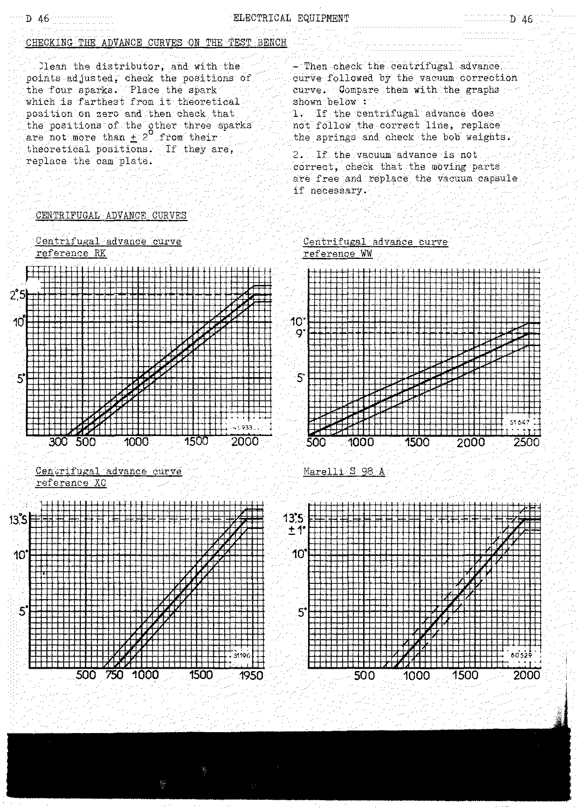

<!-- PDF p.163 · D-47 -->

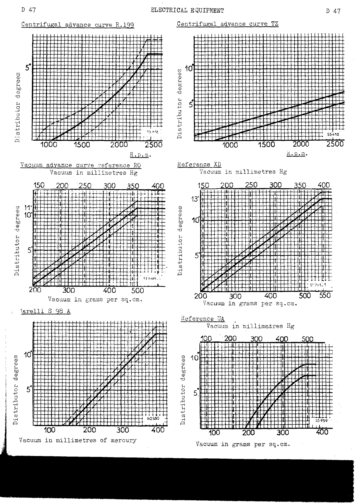

### Adjusting the static timing on the vehicle

<!-- PDF p.164 · D-48 -->

Loosen the distributor clamp and connect a pilot light between the low tension and earth (ground).

1. Remove the rocker arm cover and bring the valves of No. 4 cylinder into the "balanced" position,
   then the reference mark on the pulley to a distance **A** from the pointer.
2. Switch on the ignition.
3. Turn the distributor in an anti-clockwise direction. As soon as the pilot light switches on, clamp
   the distributor.

Firing order: **1 – 3 – 4 – 2**.

> **Note:** The dimension **A** varies with the distributor type. To obtain this dimension consult the
> distributor specification chart (see [Checking the advance curves on the vehicle](#checking-the-advance-curves-on-the-vehicle)).

For stroboscopic checking:

- Remove the dynamo drive belt.
- Disconnect the high tension lead between the coil and the distributor.
- Connect the stroboscopic lamp (Mot.24) between the high tension on the coil and the high tension on
  the distributor.

### Checking the advance curves on the vehicle

<!-- PDF p.165 · D-49 -->

**I. Checking the centrifugal advance.** A tachometer is required. With the distributor in the static
timing position **A**, mark a chalk line on the crankshaft pulley a distance **C** behind the pointer
on the timing gear casing.

1. Disconnect the distributor vacuum take-off point.
2. Start the engine and place the stroboscopic lamp a distance of approximately 5 cm (2") from the
   pulley.
3. Gradually accelerate the engine. The chalk mark on the pulley in the stroboscopic light beam
   should: start to move towards the timing gear casing pointer when the engine is running at speed
   **V1**; and be opposite the pointer when the engine is running at speed **V2**.

**II. Checking the vacuum advance.** Carry out the same operations as already described, but mark the
chalk mark at distance **B**.

1. Connect the distributor vacuum connection to a vacuum meter.
2. Run the engine at less than 1000 r.p.m.
3. Operate the vacuum meter; the chalk mark should: start to move towards the pointer on the casing
   when the vacuum is at **D1**; and be opposite the pointer when the vacuum is at **D2**.

If the distributor does not fulfill the requirements of this test, test it on a test bench.

**Chart of figures for various distributor types.**

| Distributor type | Centrifugal A | Centrifugal C   | V1 (r.p.m.) | V2 (r.p.m.) | Vacuum A    | Vacuum C        | D1 (gr/sqcm) | D2 (gr/sqcm) |
| ---------------- | ------------- | --------------- | ----------- | ----------- | ----------- | --------------- | ------------ | ------------ |
| RK               | 5/64" (2 mm)  | 29/32" (23 mm)  | 900         | 4 150       |             |                 |              |              |
| RK-RO            | 5/64" (2 mm)  | 29/32" (23 mm)  | 900         | 4 150       | 1/8" (3 mm) | 55/64" (22 mm)  | 200          | 500          |
| XC-XD            | 0 mm          | 1 3/32" (28 mm) | 750         | 4 000       | 0 mm        | 1 1/32" (26 mm) | 200          | 550          |
| WW-RO            | 1/8" (3 mm)   | 45/64" (18 mm)  | 1000        | 5 000       | 1/8" (3 mm) | 55/64" (22 mm)  | 200          | 500 <!-- NEEDS REVIEW: OCR read D2 as "900"; page image clearly shows "500" — corrected from image --> |

---

## Dynamos (generators)

<!-- PDF p.166 · D-50 -->

Illustrated: Ducellier type 7181 G dynamo.

### Specifications and mechanical data

<!-- PDF p.167 · D-51 -->

| Make        | Reference             | Field coil resistance (Ω) | Initial commutator diameter | Minimum commutator diameter | Carbon brush length, new | Minimum carbon brush length | Inter-segment insulation min. depth |
| ----------- | --------------------- | ------------------------- | --------------------------- | --------------------------- | ------------------------ | --------------------------- | ----------------------------------- |
| Ducellier   | 7117                  | 2.48                      | 47 mm (1.850")              | 44 mm (1.732")              | 20 mm (.788")            | 10 mm (.394")               | 0.5 mm (.020")                      |
| Ducellier   | 7130                  | 2.5                       | 47 mm (1.850")              | 44 mm (1.732")              | 20 mm (.788")            | 10 mm (.394")               | 0.5 mm (.020")                      |
| Ducellier   | 7138                  | 2.5                       | 47 mm (1.850")              | 44 mm (1.732")              | 20 mm (.788")            | 10 mm (.394")               | 0.5 mm (.020")                      |
| Ducellier   | 7139                  | 2.5                       | 47 mm (1.850")              | 44 mm (1.732")              | 20 mm (.788")            | 10 mm (.394")               | 0.5 mm (.020")                      |
| Ducellier   | 7181                  | 3.3                       | 47 mm (1.850")              | 44 mm (1.732")              | 20 mm (.788")            | 10 mm (.394")               | 0.5 mm (.020")                      |
| Ducellier   | 7188                  | 3.3                       | 47 mm (1.850")              | 44 mm (1.732")              | 20 mm (.788")            | 11 mm (.433")               | 0.5 mm (.020")                      |
| Ducellier   | 7189                  | 2.5                       | 47 mm (1.850")              | 44 mm (1.732")              | 20 mm (.788")            | 10 mm (.394")               | 0.5 mm (.020")                      |
| Ducellier   | 7247                  | 1.3                       | 37 mm (1.457")              | 35 mm (1.378")              | 22.5 mm (.886")          | 12 mm (.473")               | 0.5 mm (.020")                      |
| Paris-Rhône | G 11 R 79             | 3                         | 41.5 mm (1.634")            | 38 mm (1.496")              | 17 mm (.669")            | 10 mm (.394")               | 0.5 mm (.020")                      |
| Paris-Rhône | G 11 R 90             | 3.2                       | 41.5 mm (1.634")            | 38 mm (1.496")              | 17 mm (.669")            | 10 mm (.394")               | 0.5 mm (.020")                      |
| Paris-Rhône | G 10 C 9              | 2.8                       | 36.5 mm (1.433")            | 34 mm (1.339")              | 22.5 mm (.886")          | 12.5 mm (.492")             | 0.5 mm (.020")                      |
| Paris-Rhône | G 10 C 13             | 7                         | 36.5 mm (1.433")            | 34 mm (1.339")              | 22.5 mm (.886")          | 12.5 mm (.492")             | 0.5 mm (.020")                      |
| Paris-Rhône | G 11 R 108            | 3.2                       | 41.5 mm (1.634")            | 38 mm (1.496")              | 17 mm (.669")            | 10 mm (.394")               | 0.5 mm (.020")                      |
| Bosch       | LJ/GG 240 12/2400 R 14 mr | 4.8                   | 37.2 mm (1.465")            | 35 mm (1.378")              | 25 mm (.985")            | 11 mm (.433")               | 0.5 mm (.020")                      |
| Bosch       | LJ/GG 200 6.2300 R    |                           | 37.2 mm (1.465")            | 35 mm (1.378")              | 25 mm (.985")            | 11 mm (.433")               | 0.5 mm (.020")                      |
| Marelli     | D N 44 G              | 0.8                       |                             | 32 mm                       |                          | 12 mm                       | 0.6 to 0.8 mm (.024" to .032")      |

### Checking the dynamo (generator) on the vehicle (type 1)

<!-- PDF p.168 · D-52 -->

**Ducellier 7117:**

1. Connect a pilot light or a voltmeter between the dynamo + terminal and earth (ground).
2. Disconnect the lead from the "Exc" (field) terminal of the voltage regulator and earth (ground)
   this lead.
3. Run the engine at approximately 1000 r.p.m.

If the light switches on or the voltmeter registers, the dynamo is operating. If the light does not
switch on or the voltmeter does not register, the dynamo is defective.

> **Note:** If the dynamo is defective, check the voltage regulator on the test bench, because this may
> be the cause of the trouble.

**Bosch dynamo:**

1. Connect a pilot light (or a voltmeter) between the + terminal on the dynamo and earth (ground).
2. Disconnect the lead from the "Exc" (field) terminal on the voltage regulator and earth (ground) it.
3. Run the engine at approximately 1000 r.p.m.

If the light switches on (or the voltmeter registers) the dynamo is operating. If it does not, the
dynamo is defective and must be tested on the test bench (see M.R. 49 EA).

**Marelli dynamo:**

1. Disconnect the lead from terminal 6 on the dynamo and connect a pilot light or a voltmeter between
   this terminal and earth (ground) (or terminal 31 on the dynamo).
2. Disconnect the lead from the "DF" terminal on the voltage regulator and earth (ground) this lead
   (or connect it to terminal 31 on the dynamo).

<!-- PDF p.169 · D-53 -->

3. Run the engine at a speed a little above 1,000 r.p.m.: if the pilot light switches on, the dynamo
   is operating. If it does not, energise the dynamo by briefly connecting the battery positive
   terminal to terminal DF on the dynamo. If this still does not produce current, dismantle it and
   check all the parts. After reassembly, it must be energised again by repeating the operation
   already described.

**Paris-Rhône — checking the dynamo on the vehicle (type 2).** Disconnect the lead from terminal "ECK"
(field) on the voltage regulator and connect this lead to the "+" terminal on the dynamo. Following
this, carry out the same connections and the same checks as were carried out on type 1 dynamos.

### Removing the pulley

Removing or refitting the pulley: when carrying out this operation, hold the pulley by means of spanner
(wrench) Ele.04.

**Bosch dynamo — removing the pulley:**

1. Hold the pulley by means of spanner (wrench) Ele.11.
2. Unscrew the nut at the end of the pulley.
3. Remove the pulley.

Refitting the pulley: carry out the removing operations in reverse.

### Checking the dynamos on the test bench

<!-- PDF p.170 · D-54 -->

| Make        | Reference | Type | Checking voltage | First point speed | First I min | First I max | Second point speed | Second I min | Second I max |
| ----------- | --------- | ---- | ---------------- | ----------------- | ----------- | ----------- | ------------------ | ------------ | ------------ |
| Ducellier   | 7117      | 1    | 6.6              | 1100              | 4           | 9.5         | 1900               | 24           | 33           |
| Ducellier   | 7130      | 1    | 6.6              | 1100              | 4           | 9.5         | 1900               | 24           | 33           |
| Ducellier   | 7138      | 2    | 6.6              | 1100              | 4           | 9.5         | 1700               | 20           | 29           |
| Ducellier   | 7139      | 2    | 6.6              | 1100              | 4           | 9.5         | 1700               | 20           | 29           |
| Ducellier   | 7181      | 2    | 6.6              | 1100              | 2           | 9           | 1800               | 22           | 32           |
| Ducellier   | 7188      | 2    | 6.6              | 1100              | 2           | 9           | 1800               | 22           | 32           |
| Ducellier   | 7189      | 2    | 6.6              | 1300              | 7.5         | 17          | 2000               | 24           |              |
| Ducellier   | 7247      | 2    | 6.6              | 1600              | 5           | 6           | 2600               | 34           |              |
| Paris-Rhône | G 11 R 79 | 2    | 7                | 1000              | 5           | 12          | 2000               | 27           | 33           |
| Paris-Rhône | G 11 R 90 | 2    | 6.6              | 1100              | 2           | 10          | 2400               | 31           | 40           |
| Paris-Rhône | G 10 C 9  | 2    | 6.6              | 1600              | 4           | 17          | 2200               | 25           | 40           |
| Paris-Rhône | G 10 C 13 | 2    | 13.2             | 1700              | 6           | 15          | 2100               | 17           | 27           |
| Paris-Rhône | G 11 R 108 | 2   | 6.6              | 1100              | 2           | 10          | 2400               | 31           | 40           |
| Bosch       | LJ-GG-240 12-2400 R 14 mr / LJ-GG-200 6-2300-R | 1 | (no test-bench figures given) | | | | | | |

### Checking the dynamo – voltage regulator combination on the test bench

<!-- PDF p.171 · D-55 -->

**2 section regulators.** U and N are the regulating voltage and speed; Uc is the cut-in voltage
(min/max); Uc − Ud is the differential; 1st stage current I₁ with voltage U1 (min/max); 2nd stage
current I₂ with voltage U2 (min/max).

| Make        | Regulator     | Dynamo used in conjunction | U  | N    | Uc min | Uc max | Uc−Ud min | Uc−Ud max | I₁ | U1 min | U1 max | I₂ | U2 min | U2 max |
| ----------- | ------------- | -------------------------- | -- | ---- | ------ | ------ | --------- | --------- | -- | ------ | ------ | -- | ------ | ------ |
| Ducellier   | 1275          | 7117                       | 6  | 3500 | 6      | 6.5    | 1         |           | 24 | 6.3    | 6.9    | 4  | 7.5    | 7.95   |
| Ducellier   | 1275          | 7130                       | 6  | 3500 | 6      | 6.5    | 1         |           | 24 | 6.3    | 6.9    | 4  | 7.5    | 7.95   |
| Ducellier   | 1331 and 1331 C | 7138 / 7139 / 7181 / 7189 | 6 | 3500 | 6     | 6.5    | 1         |           | 30 | 6.3    | 6.9    | 4  | 7.6    | 8.1    |
| Ducellier   | 8299          | 7247                       | 6  | 5000 | 6      | 6.5    | 1         |           | 34 | 6.4    | 7.1    | 4  | 7.4    | 7.8    |
| Ducellier   | 8212          | 7188                       | 6  | 3500 | 6      | 6.5    | 1         |           | 30 | 6.3    | 6.9    | 4  | 7.4    | 8.1    |
| Paris-Rhône | XD212         | G10C9                      | 6  | 4000 | 6.1    | 6.6    | 0.75      |           | 10 | 7.2    | 7.65   |    |        |        |
| Paris-Rhône | YD216         | G10C13                     | 12 | 5000 | 12.2   | 13.2   | 1.5       |           | 10 | 13.75  | 14.65  |    |        |        |
| Cibié       | H 24          | 7117                       | 6  | 3500 | 6      | 6.7    | 0.8       | 2.5       | 24 | 6.3    | 6.85   | 5  | 7.1    | 7.95   |
| Cibié       | H 26          | G11R79                     | 6  | 3500 | 6      | 6.7    | 0.8       | 2.5       | 24 | 6.3    | 6.85   | 5  | 7.1    | 7.95   |
| Cibié       | H 27          | G11R90 / 7138              | 6  | 3500 | 6      | 6.7    | 0.8       | 2.5       | 30 | 6.15   | 6.85   | 6  | 7      | 7.9    |

**3 section regulators.** Voltage-limiting unit 1st point (I₁, U1 min/max) and 2nd point (I₂, U2
min/max); current-limiting unit (U3, I3 min/max).

| Make      | Regulator        | Dynamo used in conjunction | U  | N    | Uc min | Uc max | Uc−Ud min | I₁ | U1 min | U1 max | I₂ | U2 min | U2 max | U3  | I3 min | I3 max |
| --------- | ---------------- | -------------------------- | -- | ---- | ------ | ------ | --------- | -- | ------ | ------ | -- | ------ | ------ | --- | ------ | ------ |
| Ducellier | 8208             | 7181                       | 6  | 3500 | 6      | 6.5    | 1         | 3  | 7.7    | 8.1    | 27 | 7.4    | 8      | 6.6 | 30     | 32     |
| Ducellier | 8208             | 7.88 <!-- NEEDS REVIEW: page image prints "7.88"; from the D-37 chart this is dynamo 7188 (8208 A regulator, 3-section) — likely a dropped "1" on the typewriter. Kept as printed. --> | 6 | 3500 | 6 | 6.5 |  |  | 7.7 | 8.1 | 27 | 7.4 | 8 | 6.6 | 30 | 32 |
| Bosch     | RS UAA 240-12 42 | LJ GG 240-12 2400-R 14 mr  | 12 |      | 12.6   | 13.5   |           |    |        |        |    |        |        |     |        |        |

<!-- PDF p.172 · D-56 -->

**Checking Bosch dynamos and regulators on the test bench.**

| Dynamo                          | Regulator      | Uc          | Back current (Amps) | Off-load regulating figure U | On-load figure I when warm (double nominal speed) |
| ------------------------------- | -------------- | ----------- | ------------------- | ---------------------------- | ------------------------------------------------- |
| LJ/GG/200/6/2300 R14 mr         | RS/UA200/6/23  | 6.2 – 6.8   | 3.5 – 9.5           | 6.9 – 7.6                    | 47 – 51                                           |
|                                 | RS/UAA200/6/23 | 6 – 6.6     | 2.5 – 9             | 6.9 – 7.6                    | 47.5 – 52.5                                       |
| LJ/GG240/12 2400 AR (14 mr and el nr) | RS/UA240/12/42  | 12.5 – 13.5 | 4.5 – 8.5     | 13.9 – 14.9                  | 27 – 31                                           |
|                                 | RS/UAA240/12/42 | 12.5 – 13.2 | 5 – 11.5          | 13.9 – 14.9                  | 28 – 32                                           |

---

## Starters (service)

<!-- PDF p.172 · D-56 -->

### Ducellier starter

<!-- PDF p.173 · D-57 -->

**Pinion position.** At rest: dimension **D**. When operating: dimension **E**. Clearance between
control bolt and sleeve: dimension **F**. Clearance between front stop and pinion in operation:
dimension **G**. Adjusting washer thickness: **(R)**.

> **Note:** If the starter has been dismantled, one must re-adjust the at-rest position of the pinion,
> the forward position of the pinion, and the connection between the core and the fork.

**Adjusting and checking dimensions.**

| Reference | D               | E                  | F                             | G                              | R                                | Min. carbon brush length | Min. commutator diameter | Segment insulation undercut depth |
| --------- | --------------- | ------------------ | ----------------------------- | ------------------------------ | -------------------------------- | ------------------------ | ------------------------ | --------------------------------- |
| 6010      | 59 mm (2 5/16") | 70.5 mm (3 21/32") | 0.1 to 1.5 mm (.004 to .020") | 0.1 to 1.5 mm (.004" to .059") | 0.5 and 0.2 mm (.020" and .008") | 8 mm (.315")             | 32 mm (1.260")           | 0.5 mm (.020")                    |
| 6060      | (as 6010)       | (as 6010)          | (as 6010)                     | (as 6010)                      | (as 6010)                        | (as 6010)                | (as 6010)                | (as 6010)                         |
| 6077      | (as 6010)       | (as 6010)          | (as 6010)                     | (as 6010)                      | (as 6010)                        | (as 6010)                | (as 6010)                | (as 6010)                         |
| 6100      | (as 6010)       | (as 6010)          | (as 6010)                     | (as 6010)                      | (as 6010)                        | (as 6010)                | (as 6010)                | (as 6010)                         |
| 6129      | (as 6010)       | (as 6010)          | (as 6010)                     | (as 6010)                      | (as 6010)                        | (as 6010)                | (as 6010)                | (as 6010)                         |

<!-- NEEDS REVIEW: Ducellier dimension F prints "0.1 to 1.5 mm (.004 to .020")", but 1.5 mm ≈ .059" (as printed for dimension G), while .004–.020" ≈ 0.1–0.5 mm. The mm and inch halves of the F cell can't both be right; kept exactly as printed (source misprint). -->

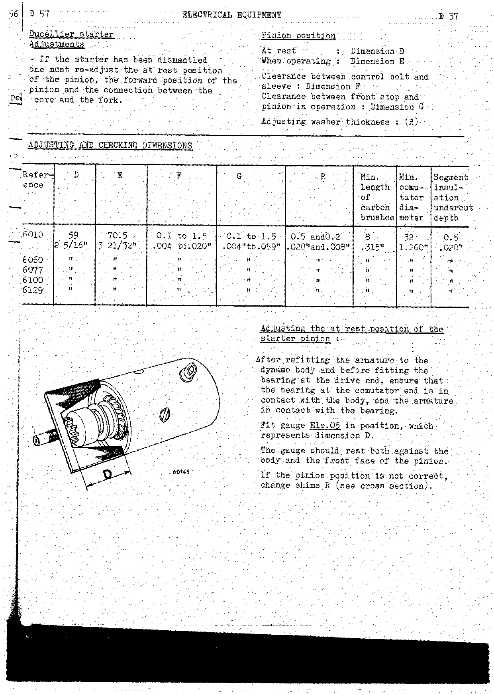

**Adjusting the at-rest position of the starter pinion.** After refitting the armature to the dynamo
body and before fitting the bearing at the drive end, ensure that the bearing at the commutator end is
in contact with the body, and the armature in contact with the bearing. Fit gauge Ele.05 in position,
which represents dimension D. The gauge should rest both against the body and the front face of the
pinion. If the pinion position is not correct, change shims R (see cross section).

<!-- PDF p.174 · D-58 -->

**Adjusting the forward position of the pinion.**

1. Position gauge Ele.05 in the same way as for the previous adjustment.
2. Screw in the front stop to bring it into contact with the outer edge of the gauge which represents
   dimension E.
3. Lock the stop by means of a new roll pin.

### Paris-Rhône starter

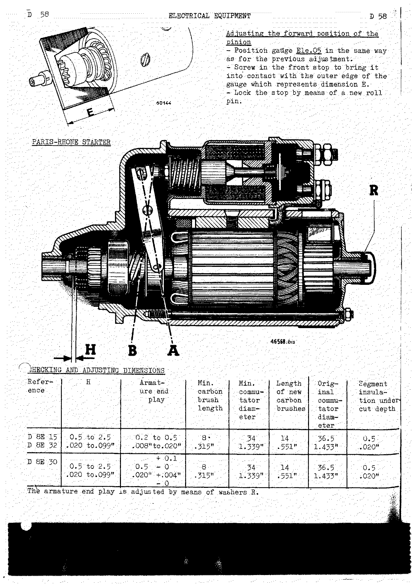

**Checking and adjusting dimensions.**

| Reference         | H                             | Armature end play              | Min. carbon brush length | Min. commutator diameter | Length of new carbon brushes | Original commutator diameter | Segment insulation undercut depth |
| ----------------- | ----------------------------- | ------------------------------ | ------------------------ | ------------------------ | ---------------------------- | ---------------------------- | --------------------------------- |
| D 8E 15 / D 8E 32 | 0.5 to 2.5 mm (.020 to .099") | 0.2 to 0.5 mm (.008" to .020") | 8 mm (.315")             | 34 mm (1.339")           | 14 mm (.551")                | 36.5 mm (1.433")             | 0.5 mm (.020")                    |
| D 8E 30           | 0.5 to 2.5 mm (.020 to .099") | 0.5 +0.1/−0 mm (.020" +.004"/−0) | 8 mm (.315")           | 34 mm (1.339")           | 14 mm (.551")                | 36.5 mm (1.433")             | 0.5 mm (.020")                    |

The armature end play is adjusted by means of washers R.

<!-- PDF p.175 · D-59 -->

**Adjusting the connection between the solenoid core and the fork.** Fit the "switch – bearing"
assembly to the body.

1. Push the control rod (2) fully in and check clearance G, which should be **0.1 to 1.5 mm
   (.004 – .060")** between the pinion and the front stop.
2. Allow the assembly to return and tighten or loosen sleeve (1) by means of hand spanner Moz.15 in
   order to obtain the correct clearance G with as small as possible a dimension F (see section on
   previous page).
3. Then check that when the starter pinion assembly is at rest it is well against the rear stop.

> **Note:** For all checks consult MR. 49 EA.

<!-- PDF p.176 · D-60 -->

**Re-assembling and adjusting.** If one has been obliged to dismantle the Paris-Rhône starter,
attention is to be paid to the following points during re-assembly. Always fit a new front stop.

- Cover the retaining rings with the stop. Peen down the end of the stop at four points to trap the
  rings.
- Adjust the connection between the core and the fork. Pinion (7) will then go into the forward
  position and there should be a clearance **H** between pinion (7) and the stop (8).
- If clearance H is not correct, remove the switch, lock the switch washer by means of spanner Ele.06,
  and screw the clevis in or out.
- Energise the solenoid.

> **Note:** The field coil feed terminal should not be connected.

### Marelli starter

<!-- PDF p.177 · D-61 -->

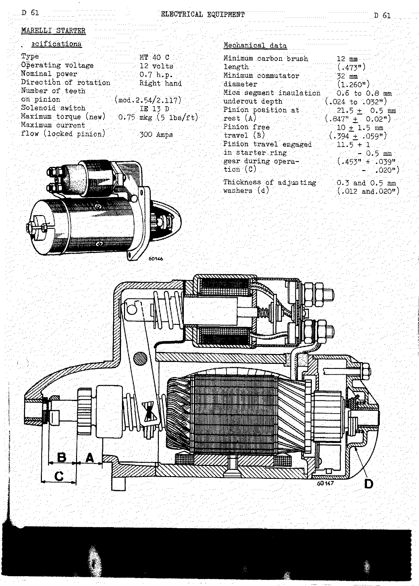

**Specifications.**

| Item                                 | Value               |
| ------------------------------------ | ------------------- |
| Type                                 | MT 40 C             |
| Operating voltage                    | 12 volts            |
| Nominal power                        | 0.7 h.p.            |
| Direction of rotation                | Right hand          |
| Number of teeth on pinion            | (mod. 2.54/2.117)   |
| Solenoid switch                      | IE 13 D             |
| Maximum torque (new)                 | 0.75 mkg (5 lbs/ft) |
| Maximum current flow (locked pinion) | 300 Amps            |

**Mechanical data.**

| Item                                                            | Value                                 |
| --------------------------------------------------------------- | ------------------------------------- |
| Minimum carbon brush length                                     | 12 mm (.473")                         |
| Minimum commutator diameter                                     | 32 mm (1.260") <!-- NEEDS REVIEW: OCR read "42 mm"; page image clearly shows "32 mm (1.260")" — corrected from image --> |
| Mica segment insulation undercut depth                          | 0.6 to 0.8 mm (.024 to .032")         |
| Pinion position at rest (A)                                     | 21.5 ± 0.5 mm (.847" ± 0.02")         |
| Pinion free travel (B)                                          | 10 ± 1.5 mm (.394 ± .059")            |
| Pinion travel engaged in starter ring gear during operation (C) | 11.5 +1/−0.5 mm (.453" +.039"/−.020") |
| Thickness of adjusting washers (d)                              | 0.3 and 0.5 mm (.012 and .020")       |

<!-- PDF p.178 · D-62 -->

**Checking — adjusting the at-rest position of the pinion.** The pinion position must always be
re-adjusted if the starter has been dismantled. After reassembling the starter, check the position of
the pinion when at rest, using the gauge shown, in the manner described. On side (a) the gauge should
rest against the pinion, but not make contact with the starter motor flange. On side (b) it should
rest against the starter motor flange but not make contact with the pinion. If the pinion position is
not as described, add or remove adjusting washers D. Generally speaking, the other positions of the
pinion do not require checking because they are automatically determined by the adjustment of the
pinion when at rest.

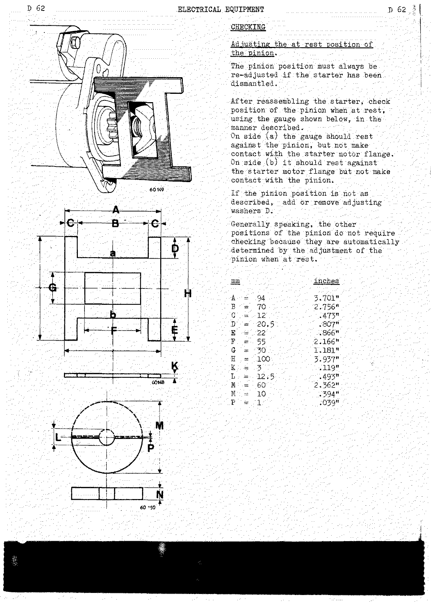

| Dimension | mm   | inches  |
| --------- | ---- | ------- |
| A         | 94   | 3.701"  |
| B         | 70   | 2.756"  |
| C         | 12   | .473"   |
| D         | 20.5 | .807"   |
| E         | 22   | .866"   |
| F         | 55   | 2.166"  |
| G         | 30   | 1.181"  |
| H         | 100  | 3.937"  |
| K         | 3    | .119"   |
| L         | 12.5 | .493"   |
| M         | 60   | 2.362"  |
| M         | 10   | .394" <!-- NEEDS REVIEW: the gauge drawing carries an "N" callout not present in the printed dimension list, which lists "M" twice; this second "M = 10 (.394")" is almost certainly dimension N. Kept as printed. --> |
| P         | 1    | .039"   |

<!-- PDF p.179 · D-63 -->

**Fitting the starting assembly (Marelli).** If the starting assembly has been dismantled, fit on the
shaft the starting hub, the lock nut, and the resilient washer in its location. Centre punch the edge
of the nut in four places in order to lock it to the resilient washer. This operation can be carried
out in a number of ways; however, the method shown is advised, which requires no special tools apart
from the two half-washers already shown in the dimension drawing.

---

## Windscreen wipers

<!-- PDF p.179 · D-63 -->

### Adjusting the wiper arms (1960 model)

Wet the windscreen and switch on the windscreen wipers, then stop them. The wiper blades should stop
approximately **2 cm (4")** from the windscreen frame. <!-- NEEDS REVIEW: source unit mismatch — page image prints "2 cm (4")"; 2 cm ≈ 3/4", not 4". Kept exactly as printed (source misprint). --> If they do not, lift the wiper arm (into the position
used to clean the windscreen), loosen screw (3) and turn the wiper arm in the required direction.
Firmly retighten the screw.

To re-position the arm on the drum: lift the wiper arm into the windscreen cleaning position; cam head
(1) frees leaf spring (2) which permits one to remove the wiper arm from the serrated drum. Refit the
wiper arm to the serrated drum in the correct position.

### Removing and refitting (1960 model)

<!-- PDF p.180 · D-64 -->

**Removing:**

1. Remove the left hand glove compartment. To do this: remove the screw from the lower mounting lug;
   free the upper clip by passing your hand behind the glove compartment; push the lower lug through
   the screw hole to free it from the instrument panel edge; extract the glove compartment.
2. Remove the windscreen wiper arms.
3. Remove the nut, washers and spacers (1) from both shafts. Disconnect the two motor leads. Remove
   the lower securing nuts and take out the assembly.
4. Separate the motor from its bracket by removing the assembly bolts (4) and disconnecting the
   control link.

**Refitting:**

1. Assemble the motor to its brackets by means of the three securing screws (4). Connect the earth
   (ground) lead to one of the lugs. Connect up the drive link and lock the outer washer (5) using
   snap ring (6). Fit the spacers to the lower bracket securing points.
2. Fit spacer (3), (E) on the passenger side; the nut, the cup washer, the rubber spacer and the inner
   spacer (2), (D) on the driver's side and (B) on the passenger side, to the shafts.
3. Fit the assembly to the car, tighten the lower securing points and connect up the two motor leads.
4. Fit the rubber washer and outer spacer at (A) on the passenger side on the outside of the car,
   followed by the rubber spacer, the cup washer, the nut and the protector.
5. Finally fit the two wiper arms.

> **Note:** Certain parts fitted to the wiper shafts differ only by their dimensions. Identify the
> positions they are to occupy by measuring them.

| Dimension | mm   | inches |
| --------- | ---- | ------ |
| A         | 14   | .551"  |
| B         | 16.5 | .650"  |
| C         | 18   | .709"  |
| D         | 20.6 | .811"  |
| E         | 10.5 | .413"  |
| F         | 40.5 | 1.595" |

### Removing and refitting (1961 model)

<!-- PDF p.181 · D-65 -->

**Removing:**

1. Remove the glove compartment on the steering wheel side.
2. Remove the wiper arms.
3. Disconnect the motor feed lead.
4. Unscrew the nuts.
5. Open the lead retaining clip (8).
6. From each bearing remove: nut (4), the washer (5), the embellisher (6) and the seal (7).
7. Take out the entire windscreen wiper mechanism from under the dashboard.

**Refitting:** carry out the removing operations in reverse.

---

## Headlights

<!-- PDF p.181 · D-65 -->

### Checking the headlights

"CIBIE Regloscope" equipment is to be fitted with the appropriate screen, which will permit the
adjustment of both asymmetric and old-type dipping headlights; the adjustment of the old type is
carried out on the left hand side of the screen.

1. The full beam should be centralised on the cross in the centre of the screen.
2. The European code dipped beam should be between the upper cranked line and the lower horizontal
   line.

### Adjustment ("Reglolux MARCHAL")

<!-- PDF p.182 · D-66 -->

1. The circumscribed cross should correspond to the brightest part of the full beam.
2. The cranked line, which is tangential to the lower part of the circle, should correspond to the
   upper edge of the European Code dipped beam.

**Adjustment:**

- Screw in or out at (1) to obtain the vertical adjustment.
- Screw in or out at (2) to obtain the sideways adjustment.
- To do this, use the Cibié "Regloscope" or "Reglolux Marchal" equipment.

**Removing:** Lift tab (3) and pull the beam unit towards the front and unhook it at point (4).

### Adjusting the beam

<!-- PDF p.183 · D-67 -->

The headlights are to be adjusted when the vehicle is empty. The position of the car varies with the
load depending on the model; it is therefore essential that the height of the dipped beam on the
adjusting equipment screen should be varied to suit the vehicle type.

On "Dauphine" vehicles it is essential that the adjustment should be carried out to the upper limit
shown on the dipped beam line on the screen (1). If necessary, check the beam position with two people
in the front seats of the vehicle.

### Headlights with rotating mechanism

<!-- PDF p.184 · D-68 -->

Certain vehicles are fitted with asymmetric beam units comprising bulb adjustment which permits them
to be used for either right hand or left hand drive depending upon the country in which they are to be
driven. This adjustment is obtained by means of a special socket known as a rotating socket.

**Adjustment:**

1. Remove the headlight bezel and the beam unit.
2. Pull off the connection block.
3. Lift the two springs (A) and take out the bulb.
4. Move lever (B) to the right when the vehicle is to be driven on the left hand side of the road, or
   to the left when the vehicle is to be driven on the right hand side of the road. (Driving on the
   right: push the lever to the left; driving on the left: push the lever to the right.)
5. Refit the bulb whilst ensuring that its projection is in the notch thus provided by the rotator.
6. Refit the connection block, the beam unit and the bezel. Then check the headlight adjustment.

---

## Steering lock

<!-- PDF p.185 · D-69 -->

### Removing and refitting the steering lock

1. Disconnect the battery and remove the right hand half housing from the horn and lighting switch
   assembly.
2. Place the locking device in the "garage" position with the key removed.
3. Disconnect the 3 leads, marking their positions.
4. Remove the two screws (2) and (3) which secure the cartridge to the bracket.
5. Press the tab through the hole (1) and remove the cartridge.
6. Insert a new cartridge in the "garage" position, and re-assemble by carrying out the removing
   operations in reverse.

### Replacing the switch

1. Disconnect the switch leads.
2. Remove the two arrowed screws and take out switch (4).
3. To refit, carry out the removing operations in reverse, positioning the switch spigot in its
   location.

> **Note:** If the cartridge keys are mislaid, their number will be found marked on the bottom of the
> cartridge (example: 7 335 Y 3).

**Checking the switch.** With the switch fitted, connect a pilot light to terminal "B" on the switch
and switch on the ignition. The light should switch on. Repeat the operation at terminal "D",
operating the starter. The light should switch on. If it does not, replace the switch.
