# Gearbox (Transmission Case)

<!--
Source: Renault Dauphine Workshop Manual M.R.93 (English edition, November 1964), Chapter E
"Gearbox (Transmission Case)" (Renault §94). Source PDF pages 186–247.

Page-mapping note: PDF p.186 is the chapter title + Contents leaf (bears no printed "E-n" number).
Numbered content runs continuously from printed E-3 = PDF p.187 to printed E-63 = PDF p.247, a
constant offset of +184 with no drift (printed E-N = PDF p.(N+184)). Citations below give the PDF
page (matches pNNNN.png) and the printed E-page. Note printed E-9 (operating diagram, type 289) and
E-47 (overhauling/dismantling intro, type 316) are absent from the raw OCR draft: E-9 is a diagram-only
page delivered per Rule 12; E-47's text was recovered directly from the page image (p0231).

Chapter scope: four gearbox types — 289, 314, 316, 318 — covered in parallel. For each of 289, 314 and
316 the manual gives removal/refitting, identification, specifications, lubrication, an operating diagram,
sectional views, then a full strip-down (dismantling / reassembling) with pinion-depth, crownwheel-and-
pinion backlash and differential-bearing adjustments. Type 318 is only summarised here (full 318 detail is
in a separate manual, M.R. 94 "EA chapter E", per the Contents). The chapter closes with a standardisation
section on using replacement gearbox types (325 / 318) and housings. Type 289 and 316 share the same
removal procedure and are three/four-speed respectively; 314 is a three-speed. No duplicate or foreign
pages were found in the range.

Content verification: every reduction-ratio table, oil-capacity figure, pinion-depth theoretical value,
shim/adjusting-washer thickness range, crownwheel-bolt and speedometer-worm torque, backlash figure,
differential pre-load and rotation-load spec, and the standardisation part-number chart was cross-checked
against the rendered page image. Assembly-critical shim-selection and pre-load values (E-18/19/21, E-32/33/
35/36/37/38, E-57/59/60) were each verified cell-by-cell against the image.
-->

<!-- PDF p.186 · chapter title & Contents -->

Chapter E of the M.R.93 workshop manual covers the Dauphine transaxle — the gearbox and integral final
drive/differential — for the four gearbox types fitted across the range: **289** and **314** (three forward
speeds, one reverse) and **316** and **318** (four forward speeds, one reverse). The unit is an aluminium
housing carrying the primary, secondary and reverse shafts, a bevel crownwheel-and-pinion final drive and a
two-planet/two-sun-wheel differential. This chapter gives removal/refitting on the vehicle, the identification,
specifications and lubrication for each type, and the complete bench overhaul (dismantling, reassembling, and
the pinion-depth, backlash and differential-bearing adjustments). It closes with the C.S.S. standardisation
scheme for supplying replacement gearboxes and housings.

## Contents of chapter

Page numbers are printed **E-n** pages. Each subject is given for the three types detailed in this manual
(289 / 314 / 316); type 318 refers to a separate manual (M.R. 94, "EA chapter E").

| Section                                          | 289  | 314  | 316  |
| ------------------------------------------------ | ---- | ---- | ---- |
| Removing and refitting the gearbox               | E-4  | E-5  | E-4  |
| Identification                                   | E-7  | E-23 | E-43 |
| Specifications                                   | E-8  | E-23 | E-43 |
| Lubrication                                      | E-8  | E-23 | E-43 |
| Operating diagram                                | E-9  | E-24 | E-44 |
| Longitudinal and cross section through differential | E-10 | E-25 | E-45 |
| Completely overhauling the gearbox — Dismantling | E-11 | E-26 | E-47 |
| — Reassembling                                   | E-15 | E-31 | E-51 |
| Adjusting — the pinion depth                     | E-18 | E-32 | E-56 |
| Adjusting — the crownwheel and pinion backlash   | E-20 | E-34 | E-59 |
| Adjusting — the bearing play                     | E-21 | E-34 | E-59 |

Standardisation as replacements of the various gearbox types — **E-61** (applies across all types).

<!-- PDF p.187 · E-3 · location of the gearbox in the vehicle -->

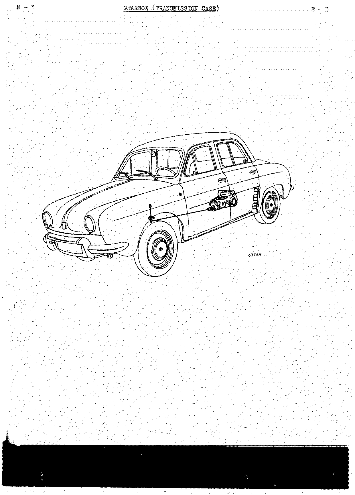

---

## Removing and refitting the gearbox

### Type 289 and 316 gearboxes

<!-- PDF p.188 · E-4 -->

**Removing:**

1. Drain the gearbox and remove the power unit assembly (see [Engine](b-engine.md)).
2. Remove the radiator.
3. Compress the suspension springs using claws **Sus.15** to remove the cross member.
4. Remove the suspension front cross member.
5. Remove the thrust pad, the right-hand mounting pad and the earth (ground) lead, the accelerator and
   clutch cable cover end stop, and the left-hand side mounting pad.
6. Remove the suspension springs and take out the shock absorbers.
7. Remove the half shaft tubes. To do this, free the half shells — each "half shaft tube–half shaft" assembly
   is freed in this manner:
   - Separate the two half shells from the half shaft tubes.
   - Refit the half shells to the gearbox (transmission case) to retain the differential carriers.
8. Remove the plate which covers the flywheel housing by pushing it towards the right in order to free it
   from the hook.
9. Separate the gearbox (transmission case) from the engine.

**Refitting:**

Carry out the refitting operations in the opposite order to removing, paying attention to the following points:

- Lightly grease the end of the clutch shaft.
- Smear the half shell thrust faces with jointing compound and fit them following the position marks made
  during dismantling.
- Place the plain washers on the half shells at the mounting pad locating points as well as the accelerator
  cable cover support.
- Refill the unit with oil after the power unit assembly has been refitted to the vehicle.

### Type 314 gearbox

<!-- PDF p.189 · E-5 -->

**Removing:**

1. Drain the gearbox (transmission case) and remove the power unit assembly (see [Engine](b-engine.md)).
2. Compress the suspension springs using claws **Sus.21**.
3. Disconnect the top end of the shock absorbers and remove the springs.
4. Remove the suspension cross member by disconnecting at the points shown.

<!-- PDF p.190 · E-6 -->

5. Mark the half shells and the differential carriers with respect to the housing.
6. Remove the side mounting pads.
7. Remove the half shaft tubes. Separate the half shells from the half shaft tubes and refit them to the
   gearbox (transmission case) to retain the differential carriers.
8. Remove the thrust pad bracket.
9. Separate the gearbox from the engine by removing its securing bolts.

**Refitting:**

Carry out the removing operations in reverse, paying attention to the following points:

- Lightly grease the end of the clutch shaft.
- Smear the differential carrier half shell thrust faces with jointing compound and fit them following the
  position marks made during dismantling.
- Fit the plain washers to the half shells at the mounting pad and accelerator cable cover bracket locating
  points.
- Fill the unit with oil after refitting the power unit assembly.

---

## Type 289 gearbox

### Identification — type 289

<!-- PDF p.191 · E-7 -->

The type, index and manufacturing number are shown on a number plate on the front of the housing.

### Specifications — type 289

<!-- PDF p.192 · E-8 -->

- Aluminium housing.
- Three forward speeds and one reverse. 2nd and 3rd speeds are synchronised.
- A differential consisting of two sun wheels and two planet wheels.
- A crown wheel with **35 teeth**.
- A final drive pinion with **8 teeth**.
- A five-start speedometer drive worm.
- Speedometer drive pinion with **12 teeth**.

**Reduction ratios:**

| Gear    | Ratio |
| ------- | ----- |
| 1st     | 3.7   |
| 2nd     | 1.80  |
| 3rd     | 1.07  |
| Reverse | 3.7   |

Housing oil capacity: **1 litre** (1¾ pts Imp) (2¼ pts US). <!-- NEEDS REVIEW: OCR read "14 pts Imp"/"17 pts Imp" and "24 pts Us"; page image clearly shows 1¾ pts Imp and 2¼ pts US — corrected from image -->

### Lubrication — type 289

The unit is splash lubricated. It is filled with oil through orifice (1) and is drained by means of plugs (2)
and (3).

- Oil capacity: **1 litre** (1¾ pts Imp) (2¼ pts US). <!-- NEEDS REVIEW: OCR garbled the Imp figure; page image shows 1¾ pts Imp — corrected from image -->
- Oil grade: **EP 80**.

**Checking the oil level:** Unscrew the level plug (4) using spanner (wrench) **B.Vi.03** and allow any excess
oil to run out. Top up the unit by pouring oil through the filler orifice (1) until oil starts to flow through
level orifice (4). Allow this oil to run out and then screw in plug (4).

### Operating diagram — type 289

<!-- PDF p.193 · E-9 (diagram-only page; absent from OCR text) -->

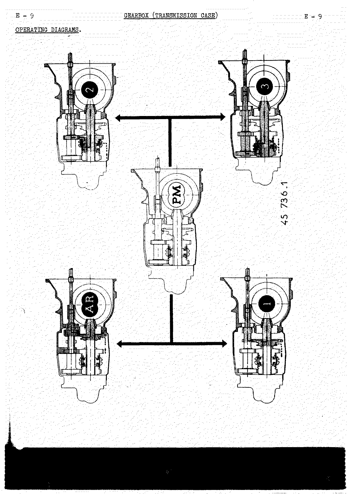

### Sectional views — type 289

<!-- PDF p.194 · E-10 -->

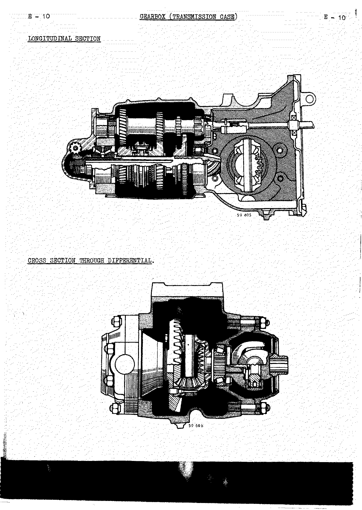

### Completely overhauling the gearbox — type 289

#### Dismantling — type 289

<!-- PDF p.195 · E-11 -->

1. Mount the gearbox (transmission case) on dismantling support **B.Vi.20**.
2. Remove the clutch control and the housing cover plate at the engine end.
3. Remove the clutch shaft. To do this:
   - Pull together the two horns on the pin retaining spring and push it along to gain access to the pin.
   - Using extractor **Emb.03**, push out the pin.
4. Remove the differential carriers. To do this, pull back the half shells and remove the universal joint
   retaining bolts.

<!-- PDF p.196 · E-12 -->

5. Extract the bearing track ring, adjusting washer and sealing washer assemblies from the carriers.
6. Bring one of the cut-outs in the differential housing opposite a boss on the casing so that it slides over
   the boss and permits one to free the crown wheel, and remove the differential.
7. Remove the shift fork cover and the lower cover plate.
8. Remove the speedometer drive housing. To do this:
   - Select first gear and pull back the cover until it rests against the clevis on the control shaft.
   - Turn the clevis in order to free the shift shaft lever and remove the housing.
9. Remove the shift fork control shafts. Extract the locking plunger which is between the two shafts in the
   housing web on the control side and remove the two forks.
10. Remove the secondary shaft:
    - Lock the secondary shaft by simultaneously engaging two gears.
    - Unlock the nut which acts as speedometer drive worm using a cold chisel which is of the same width and
      depth as the groove.
    - Remove the double taper roller bearing.
    - Push out the secondary shaft towards the differential in order to free the final drive pinion bearing
      track ring (after first removing the lock).

<!-- PDF p.197 · E-13 -->

11. Push back the third speed gear and take out the gearwheel locking key. Bring the third speed gearwheel and
    the dog ring against the housing. The third speed gearwheel locking washer is then accessible. Turn this to
    align its splines with those in the shaft and then pull it back.
12. Pull back the synchroniser, the dog ring and the second speed gearwheel. The second speed gearwheel stop
    washer is then accessible. Turn it to align its splines with those in the shaft and pull it back.
13. All the gearwheels may now be slid along the shaft. Push them back towards the first-reverse gearwheel.
14. Push back the shaft towards the differential end until its screwed end is freed from the bore in the
    housing. Hold all the gearwheels together and then move the "gearwheel-shaft" assembly towards the cover
    plate end.
15. Remove all the gearwheels from the shaft and also the bearing lock. Push out the bearing on the press.

<!-- PDF p.198 · E-14 -->

16. Remove the reverse shaft by means of extractor **B.Vi.11**. Remove the pin and push out the shaft. Remove
    the gearwheel and the spacer.
17. Remove the primary shaft:
    - Push the shaft towards the differential (taking the load on the track ring of the bearing at the cover
      end) in order to free the two track rings. Mark the positions of these track rings so that they may be
      refitted in the same positions.
    - The shaft is now free in the housing but cannot be removed until after the two bearings have been removed.
    - Extract the bearing at the differential end using extractor **B.Vi.22**.
    - Extract the second bearing.
18. Remove the shift fork control lever guide plate from the gearbox (transmission case) housing and also the
    plunger hole plug screw.

**Differential:**

1. Extract the bearings using tool **Mot.49**. (On the crown wheel side one must remove one of the assembly
   bolts in order to position the extractor.)
2. Remove the baffle washers.
3. Separate the crown wheel from the housing.
4. Remove the shear pin.
5. Push out the planet wheel shaft retaining pin.
6. Push out the shaft.
7. Remove the gearwheels and the planet wheel bearings from the housing.

#### Reassembling — type 289

<!-- PDF p.199 · E-15 -->

**Differential:**

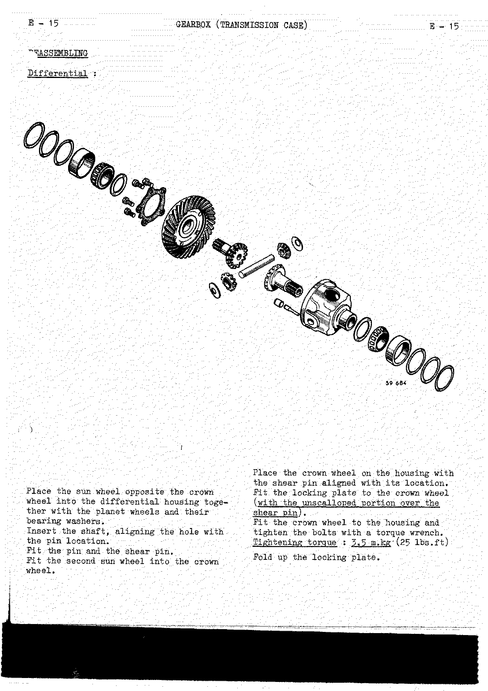

1. Place the sun wheel opposite the crown wheel into the differential housing together with the planet wheels
   and their bearing washers.
2. Insert the shaft, aligning the hole with the pin location.
3. Fit the pin and the shear pin.
4. Fit the second sun wheel into the crown wheel.
5. Place the crown wheel on the housing with the shear pin aligned with its location.
6. Fit the locking plate to the crown wheel (with the unscalloped portion over the shear pin).
7. Fit the crown wheel to the housing and tighten the bolts with a torque wrench. **Tightening torque:
   3.5 m.kg (25 lbs.ft).**
8. Fold up the locking plate.

<!-- PDF p.200 · E-16 -->

**Secondary shaft — 2nd-3rd synchroniser:**

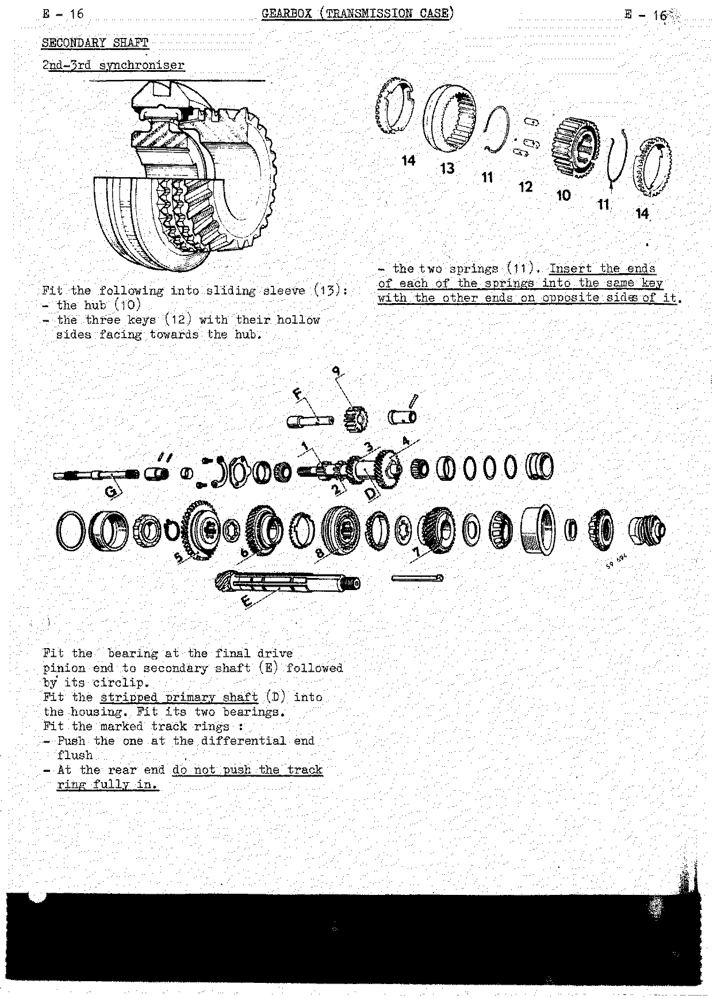

1. Fit the following into sliding sleeve (13):
   - the hub (10);
   - the three keys (12) with their hollow sides facing towards the hub;
   - the two springs (11). Insert the ends of each of the springs into the same key with the other ends on
     opposite sides of it.
2. Fit the bearing at the final drive pinion end to secondary shaft (E) followed by its circlip.
3. Fit the stripped primary shaft (D) into the housing. Fit its two bearings.
4. Fit the marked track rings:
   - Push the one at the differential end flush.
   - At the rear end, do not push the track ring fully in.

<!-- PDF p.201 · E-17 -->

5. Fit the following into the housing:
   - reverse gearwheel (9), with the lead on the teeth on the spacer side, and the spacer (with its shoulder at
     the gearwheel end).
6. Insert shaft (F) at the differential end. Position the flat on the shaft with respect to the primary shaft
   retaining plate. Pin the spacer to the shaft.
7. Fit the following to the secondary shaft:
   - sliding gearwheel (5) with its teeth at the differential end;
   - the largest diameter stop washer;
   - gearwheel (6);
   - dog ring (14);
   - synchroniser assembly (8) — align the unsplined portion of the hub with the keyway in the shaft;
   - the second dog ring (14);
   - the smallest diameter stop washer;
   - gearwheel (7).
8. Place this prepared assembly in the housing. Hold the gearwheels to prevent the hub coming out of position.
9. Fit the stop washers and lock them with the key by carrying out the removing operations in reverse.
10. Fit:
    - the pinion depth adjusting washer (with its large chamfer towards the rear);
    - the double taper roller bearing;
    - the nut which acts as a speedometer drive worm (to be replaced if the collar is damaged).
11. Tighten the nut which acts as speedometer drive worm. **Do not lock it** (so that the pinion depth can be
    adjusted).
12. At the differential end:
    - Fit the bearing track ring, its snap ring and oil baffle washer.
    - Fit the primary shaft bearing retaining plate and lock the bolts.

    The primary shaft should rotate freely but without play.
13. To adjust the primary shaft bearing play, push the rear bearing track ring fully in.
    - If the shaft turns freely, fit adjusting shims followed by the spacer until the spacer is flush.
    - If the shaft is stiff, fit thinner adjusting shims to recess the spacer by **1/10 mm (.004")**.
    - Temporarily fit the cover and its gasket. Tap on the differential end of the shaft to position it.

> **NOTE:** The double taper roller bearing is supplied pre-adjusted by the C.S.S. Its pre-load is adjusted by
> the manufacturer. Under no circumstances should this assembly be dismantled. When fitting a new bearing, the
> secondary shaft will be found to be stiff in rotation. This stiffness is perfectly normal. If the original
> bearing is re-used, ensure that there is no play. If there is play, it is to be replaced.

#### Adjusting the pinion depth — type 289

<!-- PDF p.202 · E-18 -->

Numbers such as the **55** and **181** in the illustration are references which, appearing on both crown wheel
and pinion, show that they are matched.

The theoretical pinion depth "A" is **47.5 mm (1.870")**.

The actual pinion depth is equal to **A + the difference figure shown on the pinion**. In the illustrated
example the pinion depth is 47.5 + 0.2 = **47.7 mm** (1.870" + .008" = 1.878"). If there is no additional
marking on the pinion, the pinion depth is then the actual theoretical figure.

<!-- PDF p.203 · E-19 -->

The pinion depth is measured by means of direct reading gauge **T.Ar.27**.

1. The reference plate marked with a "0" should be placed against the locating bores.
2. A graduated rule should be placed against the front face of the final drive pinion.
3. The dimension read opposite the "0" mark should be equal to the actual pinion depth already calculated.
4. If it is not, place an adjusting washer of a suitable thickness between the 3rd speed gearwheel and the
   double taper roller bearing. Washers of from **3.30 to 4.30 mm (.130" to .169")** in thickness, increasing
   in steps of **1/10 mm (.004")**, are available.
5. Temporarily fit the speedometer drive housing and check the pinion depth obtained.
6. Remove the housing. Knock the collar on the nut which acts as the speedometer drive worm into the groove in
   the shaft.
7. Secure the shift fork lever guide plate to the housing.

**Fitting the shift forks and fork shafts:**

1. Place the 2nd-3rd speed fork in the sliding gearwheel groove.
2. Insert the 2nd-3rd speed shaft (the shortest) and assemble it to the fork. Tighten the bolt and lock it with
   wire.
3. Insert the locking plunger by means of guide **B.Vi.04** and fit the plug screw.
4. Place the 1st-reverse shift fork in the groove in the sliding gearwheel (with the fork hub offset on the
   gearwheel side).
5. Insert the 1st-reverse shaft and assemble the fork to it. Tighten the bolt and lock it with wire.

<!-- PDF p.204 · E-20 -->

6. Select first gear, engage the control lever in the slot in the 1st-reverse shaft.
7. Place the locking balls and springs in position (with the longest of the springs on the 2nd-3rd shaft).
8. Refit the speedometer drive housing with its paper gasket smeared with jointing compound.
9. Refit the shift fork cover with its paper gasket smeared with jointing compound.
10. Fit the lower cover plate with its gasket smeared with jointing compound.

#### Adjusting the crownwheel and pinion backlash — type 289

1. Fit the differential (with new baffle washers) into the housing.
2. Place one of the adjusting tools **T.Ar.28** on the differential housing (with the adjusting screw on the
   tool unscrewed to its fullest extent).
3. Place the differential carrier on the tool together with its gasket and the matched half shells. Carry out
   the same operations with the other tool.
4. Mount a dial indicator on the casing using support **T.Ar.29**.
5. Place the dial indicator plunger into contact with one tooth on the crown wheel.

<!-- PDF p.205 · E-21 -->

6. Tighten the screw on the tool on the crown wheel side until a backlash of from **0.1 to 0.2 mm (.004" to
   .008")** has been obtained. <!-- NEEDS REVIEW: source misprint / OCR — page image prints "1 to 0.2 mm"; the (.004") conversion and the matching type-316 spec (E-59) confirm the intended value is 0.1 mm -->
7. Then tighten the lock nut.
8. Tighten the screw on the opposite side and tighten its lock nut.
9. Remove the half shells and the differential carriers.
10. Remove the tools and the baffle washers, taking care to mark the positions they occupy.

#### Adjusting the bearing play — type 289

This play is adjusted by means of shims placed under the track rings in the differential carriers. The thickness
of the shim pack to be fitted is equal to **C1 − C2**.

- **C1** is measured by means of a micrometer across the tool after it has been adjusted.
- **C2** is measured by means of a micrometer across fixture **T.Ar.28**. Clamp the bearing which corresponds to
  the tool that has been measured in fixture **T.Ar.28**; stop tightening the fixture before the rollers are
  locked.

Make up a shim pack which is as near as possible to the dimension obtained. Shims are obtainable in thicknesses
of **0.10 – 0.20 – 0.50 and 0.95 mm** (.004" – .008" – .020" and .037"). Mark this pack with respect to the
bearing behind which it will be fitted. Carry out the same operations for the second bearing.

Following the position marks, fit:

- the bearings to the differential;
- the seals, adjusting shims and track rings to the differential carriers.

<!-- PDF p.206 · E-22 -->

1. Fit the differential into the casing.
2. Fit the differential carriers with their paper gaskets smeared with jointing compound.
3. Fit the universal joints and secure them in place.
4. Temporarily fit the half shells and their felts.
5. Refit the clutch shaft together with its pin retaining spring to the primary shaft. Align the pin holes using
   drift **Emb.03**. Pin the shaft and lock the pin by means of its spring.
6. Refit the front cover with its paper gasket smeared with jointing compound.
7. Refit the clutch control.

> **NOTE:** The unit is to be refilled with oil after it has been refitted to the vehicle.

---

## Type 314 gearbox

### Identification — type 314

<!-- PDF p.207 · E-23 -->

The type, index and manufacturing number are shown on a number plate secured to the front of the housing.

### Specifications — type 314

- Aluminium housing.
- Three forward speeds and one reverse. 2nd and 3rd synchronised.
- Primary shaft: 3 gearwheels integral with the shaft.
- Secondary shaft: 2 gearwheels running free on the shaft. Two sliding gearwheels — 1st speed gearwheel splined
  to the shaft.
- Reverse shaft: 1 double gearwheel cluster running free on the shaft.
- A differential consisting of two planet wheels and two sun wheels.
- One crown wheel with **35 teeth**.
- A final drive pinion with **8 teeth**.
- Speedometer drive: 5-start worm, wheel with **12 teeth**.

**Reduction ratios:**

| Gear    | Ratio |
| ------- | ----- |
| 1st     | 3.70  |
| 2nd     | 1.80  |
| 3rd     | 1.03  |
| Reverse | 3.70  |

Housing oil capacity: **1.250 litres** (2¼ pts Imp) (2¾ pts US). <!-- NEEDS REVIEW: OCR read "24 pts Imp"/"2% pts US"; page image shows 2¼ pts Imp and 2¾ pts US — corrected from image. See E-63 for the June-1961 increase to 1.60 litres -->

### Lubrication — type 314

The gearwheels are splash lubricated. The unit is filled with oil through orifice (A) in the side of the housing
and this also fixes the oil level. It is drained by means of plugs (B) and (C).

- Quantity of oil required: **1.250 litres** (2¼ pts Imp) (2¾ pts US).
- Grade: **EP.80**.

**Checking the oil level:** Unscrew plug (A) using spanner (wrench) **B.Vi.03**. The oil should be flush with the
lower edge of the orifice.

### Operating diagram — type 314

<!-- PDF p.208 · E-24 -->

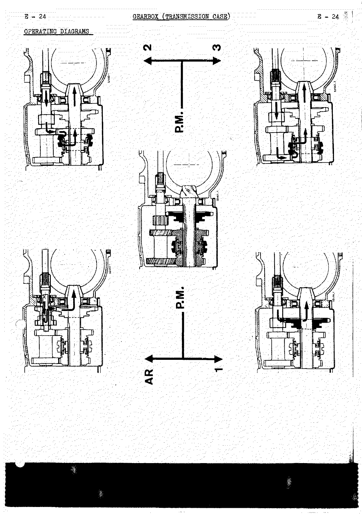

### Sectional views — type 314

<!-- PDF p.209 · E-25 -->

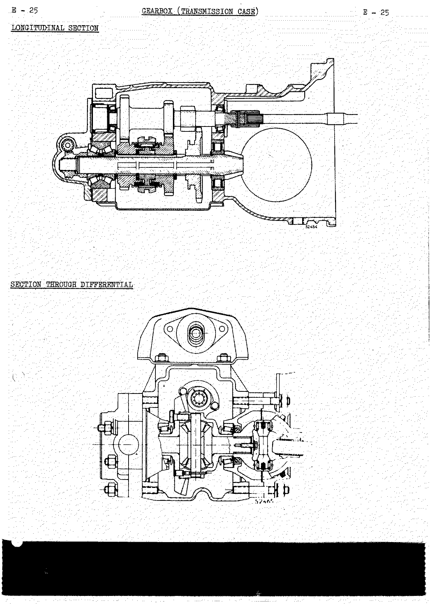

### Gear locking system — type 314

<!-- PDF p.210 · E-26 -->

Each shift fork shaft is locked, no matter what its position (whether in neutral or with a gear engaged), by a
ball and a spring. Locking plunger (1) locks the 2nd-3rd shaft when 1st (or reverse) is engaged, and the
contrary.

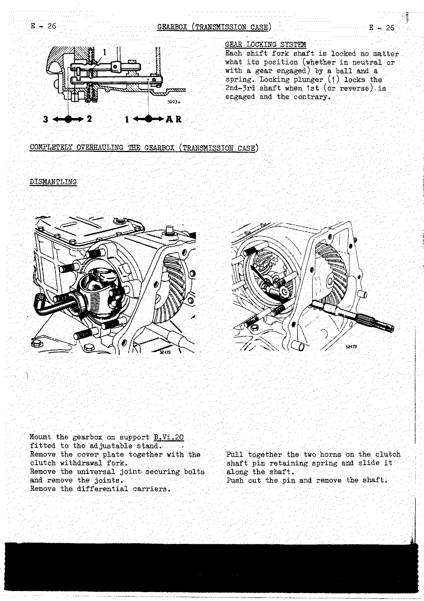

### Completely overhauling the gearbox — type 314

#### Dismantling — type 314

1. Mount the gearbox on support **B.Vi.20** fitted to the adjustable stand.
2. Remove the cover plate together with the clutch withdrawal fork.
3. Remove the universal joint securing bolts and remove the joints.
4. Remove the differential carriers.
5. Pull together the two horns on the clutch shaft pin retaining spring and slide it along the shaft. Push out
   the pin and remove the shaft.

<!-- PDF p.211 · E-27 -->

6. Place one of the cut-outs in the differential housing in line with a boss on the casing in order to be able
   to free the crown wheel. Take out the differential.
7. Remove the gearbox lower cover plate.
8. Remove the speedometer drive housing. To do this, engage first gear and bring the cover against the control
   shaft. Push out the roll pin by means of drift **B.Vi.31 A**. Remove the shaft and the cover and free the
   control lever. Return to the neutral position.
9. Remove the spacer and the primary shaft bearing adjusting shims.
10. Push out the roll pins which secure the shift forks using drift **B.Vi.31 A**.
11. Remove the screwed plug, take out the locking ball and spring which lock the 1st and reverse shafts. Take
    out the shaft. Remove plunger (1).
12. Remove the 2nd-3rd shaft (take care with the locking ball and spring: put them to one side). Remove the
    forks.
13. Lock the secondary shaft by engaging two speeds simultaneously. Unlock and unscrew the nut which acts as the
    speedometer drive worm. Return to the neutral position.

<!-- PDF p.212 · E-28 -->

14. Remove:
    - the double taper roller bearing;
    - the pinion depth adjusting washer;
    - the key which locks the gearwheel stop washers.
15. Bring the 1st speed gearwheel towards the differential end. Washer (17) is then accessible. Turn it and
    slide it along the shaft.
16. Pull back the 2nd speed synchroniser and gearwheel towards the differential. Stop washer (14) is then
    accessible. Turn it and slide it along the shaft.
17. Gradually pull out the shaft towards the differential and remove the gearwheels.

<!-- PDF p.213 · E-29 -->

18. Pull out the primary shaft towards the differential end and put aside the bearing track ring. Extract the
    bearing at the differential end using extractor **B.Vi.22**. The shaft is now free and can be removed from
    the housing without removing the second bearing. Push out the bearing track ring at the speedometer drive
    end.
19. Remove the plate which retains the reverse shaft and the primary shaft bearing.
20. Remove the reverse shaft. Remove the double gearwheel cluster and stop washer. Remove the reverse shaft bush.
21. Remove the primary shaft bearing using extractor **B.Vi.22**.
22. Remove the secondary shaft bearing on the press after first taking off its retaining circlip.

<!-- PDF p.214 · E-30 -->

**Differential:** Extract the bearings by means of extractor **B.Vi.28** (on the crownwheel side remove one of
the crownwheel securing bolts in order to fit the extractor). Remove the bolts which secure the crownwheel to the
housing. Separate the various parts.

**Differential carriers:** Extract the following on the press:

- the bearing track rings;
- the adjusting shims;
- the seals.

**Speedometer drive housing:** Push out the wheel and the nylon bush.

**Cleaning and checking:** Clean, then check, all the components. The seals, locking washers and roll pins must be
replaced by new ones.

#### Reassembling — type 314

<!-- PDF p.215 · E-31 -->

**Differential:**

1. Fit the following into the housing:
   - a sun wheel (previously dipped in oil grade EP.80);
   - the planet wheels and their bearing washers.
2. Insert the planet wheel shaft, aligning the pin hole with that in the housing.
3. Fit the pin and the shear pin.
4. Fit the second sun wheel into the crownwheel (immerse it in oil grade EP.80).
5. Fit the crownwheel to the housing (the locking plate tab should cover the shear pin hole). **Bolt tightening
   torque: 5 m.kg (35 lbs.ft).** Lock the bolts.

Before reassembling the mechanism assembly the following adjustments must be carried out:

- the pinion depth;
- the crownwheel and pinion backlash;
- the differential bearing adjustment so that they are fitted without play (when the original bearings are
  re-used) or with pre-load (when new bearings are fitted).

#### A — Adjusting the pinion depth — type 314

<!-- PDF p.216 · E-32 -->

**Crownwheel and pinion matchings:** The final drive pinion and the crownwheel are lapped together during
manufacture. They are therefore inseparable. Replacing one or other of these parts automatically involves
replacing the other. A common reference mark is inscribed on the crownwheel and the pinion — for example
**52 = 167**.

> **UNDER NO CIRCUMSTANCES SHOULD ANY ATTENTION BE PAID TO OTHER MARKINGS ON THE CROWNWHEEL.**

**Position of the final drive pinion:** The final drive pinion is in the correct position when its front face is
a distance **A = 47.50 mm (1.870")** from the crownwheel centreline. This position is obtained by placing a washer
of a suitable thickness between the double taper roller bearing and the shoulder on the secondary shaft.

**Exceptional case:** Under exceptional circumstances it is possible that dimension A is not the correct pinion
depth. The difference between the actual dimension and dimension A is then marked on the front face of the pinion
beside the matching reference. It is given in hundredths of a millimetre — for example **20**. Under these
circumstances the pinion depth is then A + the difference shown. In the above example it would be:
47.50 + 0.20 = **47.70 mm** (1.870" + .008" = 1.878").

<!-- PDF p.217 · E-33 -->

**Checking the pinion depth:**

1. Mount the mechanism housing on support **B.Vi.20**.
2. Fit the bearing to the secondary shaft on the press.
3. Insert the shaft in the housing, placing tool **B.Vi.32** on it so that the speedometer drive worm can be
   tightened.
4. Fit the pinion depth adjusting washer (the one removed during dismantling).
5. Fit the double taper roller bearing and the speedometer drive worm.

> **NOTE:** The double taper roller bearing is supplied pre-adjusted by the C.S.S. The pre-load adjustment is
> carried out by the manufacturer and under no circumstances must this assembly be dismantled. When fitting a new
> bearing a certain resistance of the secondary shaft to rotation can be felt. This resistance is perfectly
> normal. If the original bearing is re-used, ensure that there is no play. If play can be felt, replace it.

6. Tighten the speedometer drive worm using a torque wrench to a torque of **12 m.kg (85 lbs.ft)**.
7. Temporarily fit the speedometer drive housing in order to hold the double taper roller bearing track ring in
   position.
8. Fit tool **T.Ar.61** in position with its graduated rule against the final drive pinion and the plate with the
   "0" reference mark pressed well against the housing. The dimension read opposite the "0" reference mark should
   equal the pinion depth.
   - If the dimension read is **less** than the correct dimension, replace the pinion depth adjusting washer by a
     **thinner** one.
   - If the dimension read is **greater** than the pinion depth, replace the washer by a **thicker** one.
9. Adjusting washers available: thicknesses ranging from **3.30 to 4.10 mm (.130" to .162")** increasing in
   increments of **5/100 mm (.002")**, plus **4.20 mm (.165")** and **4.30 mm (.169")**.
10. When the correct adjustment has been obtained, remove tool **T.Ar.61**.

#### B — Adjusting the crownwheel and pinion backlash — type 314

<!-- PDF p.218 · E-34 -->

The backlash is adjusted by using adjusting tools **T.Ar.28**.

1. Fit the differential into the housing with new baffle washers.
2. Fit the two tools **T.Ar.28**, the adjusting screws fully unscrewed, to the differential.
3. Fit the differential carriers (together with their paper gaskets) to the housing.
4. Fit the corresponding half shells and secure them in place. **(Tightening torque: 5 m.kg (35 lbs.ft).)**
5. Mount a dial indicator on the housing using support **T.Ar.29**. Place the plunger of the indicator in contact
   with one of the crownwheel teeth.
6. Tighten the screw on the tool on the crownwheel side until a backlash of between **12/100 and 25/100 mm (.005"
   to .010")** has been obtained.
7. Screw down the screw on the other tool whilst ensuring that the crownwheel and pinion backlash has not altered.
8. Tighten the lock nut on each of the tools.
9. Remove: the half shells; the differential carriers; the tools.
10. Remove the differential from the housing. Remove the speedometer drive housing and the secondary shaft.

#### C — Adjusting the differential bearings — type 314

The adjustment is obtained by placing shims under the track rings in the differential carriers — this is shim
pack **C**.

<!-- PDF p.219 · E-35 -->

**Determining the shim pack C to be placed in a carrier:**

The thickness of shim pack **C** to be placed in a carrier is determined by finding the difference between
thickness **C1** on the adjusting tool **T.Ar.28** and thickness **C2** of the corresponding bearing:

**C = C1 − C2**

1. Measure the thickness of adjusting tool **C1** using a micrometer.
2. Place the bearing and its track ring on tool **T.Ar.28** and lock the assembly together. Measure the thickness
   of the bearing and the fixture **C3** with a micrometer. The thickness of the bearing C2 is therefore:
   **C2 = C3 − 10 mm (.394")** (which is the thickness of the fixture).
3. Make up a shim pack which corresponds to the dimension obtained. Shims of **0.1 – 0.2 – 0.25 – 0.5 and 1 mm**
   (.004" – .008" – .010" – .020" and .040") are obtainable.

> **NOTE:** Use the minimum possible number of shims to make up the pack.

4. Repeat the operation on the other differential carrier. The shim pack obtained allows the differential to
   rotate without play.

**Example:**

| Quantity            | Left-hand carrier                     | Right-hand carrier                                   |
| ------------------- | ------------------------------------- | ---------------------------------------------------- |
| C1                  | 18.53 mm (.732")                      | 18.76 mm (.740")                                     |
| C3                  | 27.30 mm (1.075")                     | 27.19 mm (1.071")                                    |
| C2 = C3 − 10        | 17.30 mm (C3 − .394" = .681")         | 17.19 mm (C3 − .394" = .677")                        |
| C = C1 − C2         | 1.23 mm (.051")                       | 1.57 mm (.063")                                      |
| Shim pack required  | 1 + 0.25 = 1.25 mm (.040" + .010" = .050") | 1 + 0.25 + 0.20 + 0.10 = 1.55 mm (.040" + .010" + .008" + .004" = .062") |

<!-- PDF p.220 · E-36 -->

Two sets of circumstances may arise:

**1 — The original bearings are re-used.** In this case the differential must turn without play. The shim pack
already obtained is therefore the final adjustment. Fit the following to the differential carriers:

- the seals;
- the adjusting shims;
- the bearing track rings (on the press).

Fit the bearings to the differential on the press after having fitted the baffle washers (the chamfer against the
housing).

**2 — If new bearings are used.** The bearings must then be fitted with a given pre-load. The differential must
rotate with a resisting torque of between **0.080 and 0.180 m.kg (7 to 16 lbs/in)**. The dimension just obtained
causes the differential to rotate without play, and therefore an additional shim **1/10 mm (.004")** thick must be
added in each of the differential carriers. Place the following in the differential carriers:

- the seals;
- the adjusting shims;
- the bearing track rings (on the press).

Fit the bearings to the differential on the press after fitting the baffle washers (with the chamfers against the
housing).

<!-- PDF p.221 · E-37 -->

**Checking the bearing pre-load:**

1. Fit the differential into the housing.
2. Place the differential carriers and their half shells in position and tighten the nuts to a torque of
   **5 m.kg (35 lbs.ft)**.
3. Turn the differential by hand a number of times to centralise the bearings.
4. Wrap a string around the differential housing.
5. Pull on the string with a string balancer: the differential should rotate under a load of between **1.7 kg and
   3.7 kg** (3 lbs. 12 oz. and 8 lbs. 2 oz.). This is the load necessary to cause the differential to rotate.
6. If the adjustment is not correct, increase or reduce the thickness of the shim pack by the same amount in each
   of the carriers.

**Primary shaft:**

1. Introduce the shaft into the housing.
2. Fit the bearing at the speedometer end to the shaft on the press.
3. Fit the bearing at the differential end on the press.

<!-- PDF p.222 · E-38 -->

4. Fit the bearing track ring at the differential end on the press. The track ring should be flush with the edge
   of the housing.
5. Fit the track ring of the bearing at the speedometer drive end on the press.
6. Temporarily fit the differential end bearing retaining plate.

**Adjusting the bearing end play:**

1. Push in the track ring of the bearing at the speedometer drive end until the shaft turns freely but without
   play.
2. Place adjusting shims **C** behind the track ring followed by the spacer. This spacer should come flush with
   the edge of the housing. Shims of **0.10 – 0.20 – 0.50 and 0.95 mm** (.004" – .008" – .020" and .038") are
   available. <!-- NEEDS REVIEW: source lists 0.95 mm as .038" here but as .037" in the type-289/316 shim lists (E-21, E-60) — kept each as printed -->
3. Temporarily fit the speedometer drive housing together with its paper gasket.
4. Tap the end of the shaft at the differential end to bed down the shim pack. Check that the shaft turns freely.
5. Remove the bearing retaining plate, the speedometer drive housing, the spacer and the adjusting shims.

<!-- PDF p.223 · E-39 -->

**Reverse shaft:**

1. Insert the shaft into bush (2).
2. Fit stop washer (4) into its location (with the bronze face against the gearwheel cluster) and position the
   flat.
3. Insert the double gearwheel cluster (3) (with the gearwheel on which the marked lead is machined at the
   differential end).
4. Fit the shaft (5).
5. Fit the stop plate and fold up the lock.

**Secondary shaft — 2nd-3rd synchroniser:**

Fit the key retaining ring and the two springs (6) to hub (7); insert the ends of the springs into one key with
the other ends on opposite sides of it. Insert the hub into sliding sleeve (9). <!-- NEEDS REVIEW: E-39 OCR of the synchroniser sub-steps is badly garbled; part numbers/order reconstructed against the E-40 exploded view (p0224) — verify -->

> **NOTE:** The sliding sleeve and its hub are matched.

<!-- PDF p.224 · E-40 -->

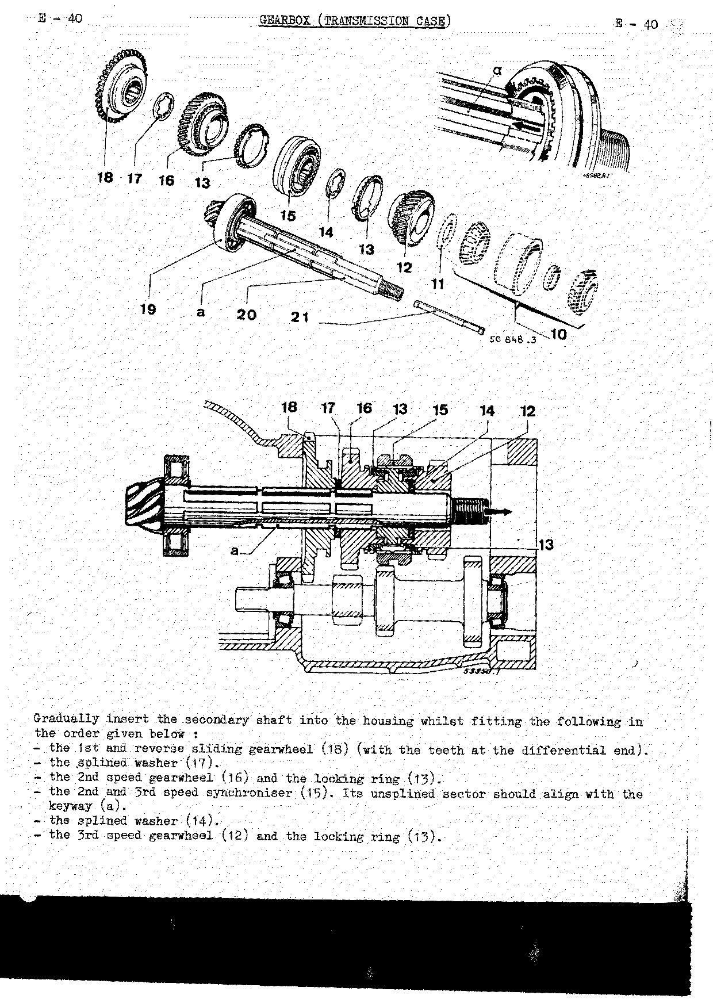

Gradually insert the secondary shaft into the housing whilst fitting the following in the order given below:

1. the 1st and reverse sliding gearwheel (18) (with the teeth at the differential end);
2. the splined washer (17);
3. the 2nd speed gearwheel (16) and the locking ring (13);
4. the 2nd and 3rd speed synchroniser (15) — its unsplined sector should align with the keyway (a);
5. the splined washer (14);
6. the 3rd speed gearwheel (12) and the locking ring (13).

<!-- PDF p.225 · E-41 -->

7. Push the "1st speed gearwheel – splined washer – 2nd speed synchroniser gearwheel" assembly towards the
   differential and fit washer (14).
8. Insert key (21) into its groove, thus preventing washer (14) from rotating.
9. Push back the secondary shaft and the "synchroniser – 2nd speed gearwheel" assembly towards the speedometer
   drive end.
10. Fit washer (17) and push the key (21) fully in.
11. Fit the pinion depth adjusting washer.
12. Fit the double taper roller bearing.
13. Engage two gears simultaneously and tighten the speedometer drive worm to a torque of **12 m.kg (85 lbs.ft)**.

<!-- PDF p.226 · E-42 -->

14. Fit spring (22) and place the ball in tool **B.Vi.34**. Introduce the tool into the 2nd-3rd shift fork shaft
    bore and turn it through a quarter of a turn. Push the ball by means of a rod and then push the tool towards
    the inside of the housing.
15. Fit the control lever shaft and pin the lever.
16. Insert the plunger (1) by means of tool **B.Vi.34**.
17. Fit the first-reverse shaft and the fork. Pin it.
18. Fit ball (23) and spring (24). Screw in and tighten down the lock stop (25) after smearing the thread with
    **BLUE-STOP** locking compound. Tighten lock nut (26).
19. Fit the following into the speedometer drive housing:
    - the seal;
    - the speedometer drive worm and its nylon bush (align its slot with the set bolt hole).
20. Engage first gear. Fit the shift fork shaft control lever. Position the speedometer drive housing with its
    paper gasket smeared with jointing compound. Fit the control lever shaft and pin the lever.
21. Return to the neutral position and fit the cover. Fit the lower cover plate with its gasket smeared with
    jointing compound.
22. Refit the clutch shaft together with its pin retaining spring. Fit the pin and lock it by means of the
    spring.
23. Refit the differential carriers with their paper gaskets smeared with jointing compound (follow the position
    marks made during dismantling).
24. Fit the universal joints and secure them in place.
25. Temporarily fit the half shells to hold the differential carriers in place.
26. Refit the cover plate with its paper gasket smeared with jointing compound.
27. Place the differential in the housing.

> **NOTE:** The unit is to be filled with oil after it is refitted to the vehicle.

---

## Type 316 gearbox

### Identification — type 316

<!-- PDF p.227 · E-43 -->

The type, the index and manufacturing numbers are given on a number plate fitted to the front of the housing.

### Specifications — type 316

- Aluminium housing.
- Four forward speeds and one reverse. 2nd, 3rd and 4th are synchronised.
- Differential consisting of two planet wheels and two sun wheels.
- Crown wheel with **35 teeth**.
- A final drive pinion with **8 teeth**.
- Speedometer drive: 5-start worm. Pinion with **11 teeth**.

**Reduction ratios:**

| Gear    | Ratio |
| ------- | ----- |
| 1st     | 3.7   |
| 2nd     | 2.1   |
| 3rd     | 1.46  |
| 4th     | 1.07  |
| Reverse | 3.7   |

<!-- NEEDS REVIEW: OCR of the ratio column was badly garbled ("1.46 / 1607 / Sel"); every value above was read directly from the page image — corrected from image -->

Housing oil capacity: **1 litre** (1¾ pts Imp) (2¼ pts US). <!-- NEEDS REVIEW: OCR read "1.4 pts Imp"/"24 pts Us"; page image shows 1¾ pts Imp and 2¼ pts US — corrected from image. See E-63 for the June-1961 increase to 1.60 litres for the 318 -->

### Lubrication — type 316

The gears are splash lubricated. The unit is filled through orifice (1). It is drained by means of plugs (2) and
(4).

- Oil quantity required: **1 litre** (1¾ pts Imp) (2¼ pts US).
- Grade: **EP.80**.

**Checking the oil level:** Unscrew the level orifice plug (3) by means of spanner (wrench) **B.Vi.03** and allow
the excess of oil to run out. Top up by pouring oil through the filler orifice (1) until it starts to run again
from the level orifice (3). Allow the oil to run out and screw in plug (3) again.

### Operating diagram — type 316

<!-- PDF p.228 · E-44 -->

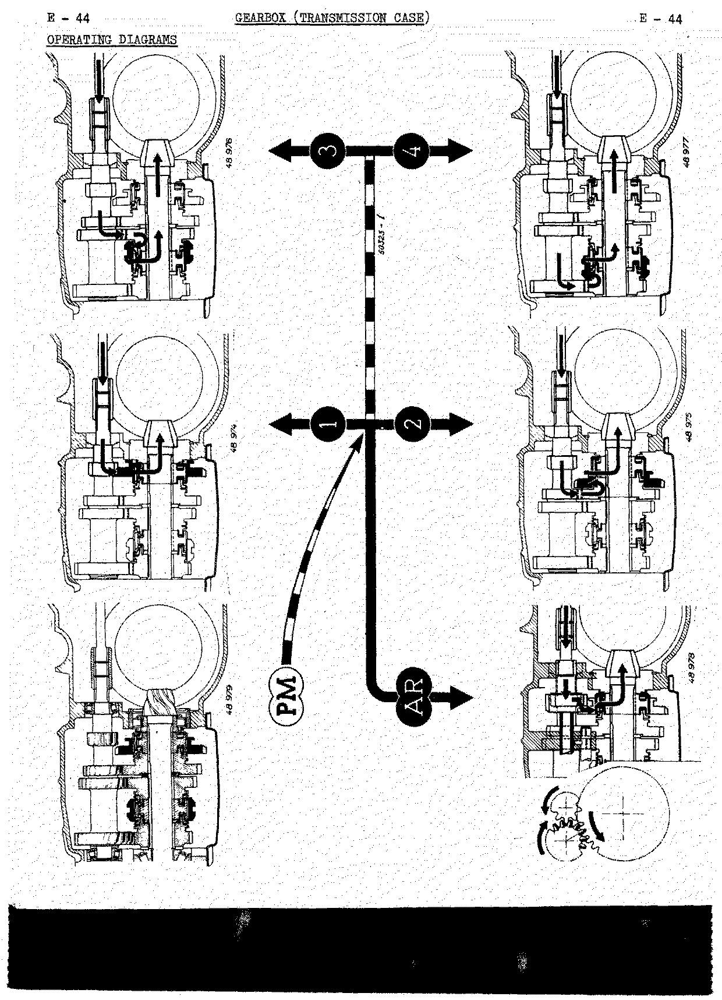

### Sectional views — type 316

<!-- PDF p.229 · E-45 -->

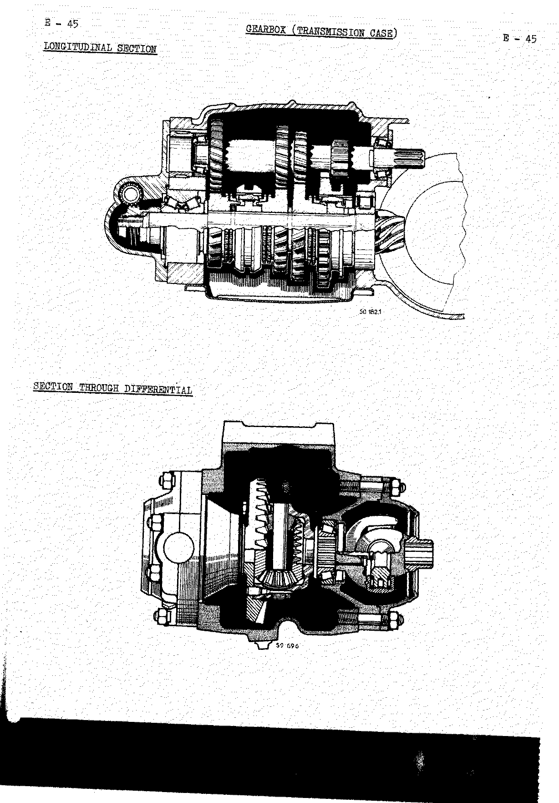

### Gear locking system — type 316

<!-- PDF p.230 · E-46 -->

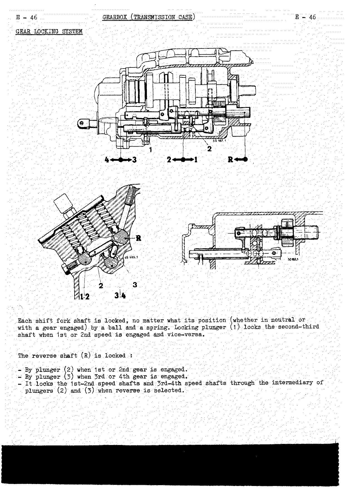

Each shift fork shaft is locked, no matter what its position (whether in neutral or with a gear engaged), by a
ball and a spring. Locking plunger (1) locks the 2nd-3rd shaft when 1st or 2nd speed is engaged, and vice-versa.

The reverse shaft (R) is locked:

- By plunger (2) when 1st or 2nd gear is engaged.
- By plunger (3) when 3rd or 4th gear is engaged.
- It locks the 1st-2nd speed shafts and 3rd-4th speed shafts through the intermediary of plungers (2) and (3)
  when reverse is selected.

### Completely overhauling the gearbox — type 316

#### Dismantling — type 316

<!-- PDF p.231 · E-47 (text absent from OCR; recovered from page image) -->

1. Mount the gearbox housing on the dismantling support **B.Vi.20**.
2. Remove the clutch control and the housing cover at the engine end.
3. Remove the clutch shaft. To do this, pull together the two ends of the pin retaining spring and push it back
   to gain access to the pin; push out the pin using extractor **Emb.03**.
4. Remove the differential carriers. To do this, remove the half shells and take out the universal joint securing
   bolts.

<!-- PDF p.232 · E-48 -->

5. To remove the differential, position one of the cut-outs in the housing in line with a boss on the casing so
   that it covers the boss and permits the crownwheel to be removed.
6. Remove the lower cover plate and the shift fork cover plate (take care with the locking balls and springs).
7. Remove the speedometer drive housing:
   - Select 2nd gear and pull back the housing until it makes contact with the control rod clevis.
   - Push out the roll pin by means of drift **B.Vi.31 A**, remove the shaft and free the control lever.
8. Push out the roll pins from the 1st-2nd and 3rd-4th shift forks, then remove the shafts from these two forks.
9. Extract the locking plunger from between the two shafts. Remove the 3rd-4th fork.
10. Turn the reverse shaft so that the reverse control lever is freed from the sleeve. Remove the reverse sleeve.

<!-- PDF p.233 · E-49 -->

11. Remove the secondary shaft:
    - Select two gears simultaneously to hold the secondary shaft.
    - Unlock the nut which acts as the speedometer drive worm.
    - Remove the double taper roller bearing.
    - Remove (at the differential end) the bearing retaining plate.
12. Free the pinion depth adjusting washer, then take out the gearwheel key.
13. Slide the 4th speed gearwheel as far as it will go in order to clear the synchroniser hub stop ring. When the
    stop ring is accessible, turn it to place its splines in line with those in the shaft, then pull it back.
14. Pull back the 3rd speed synchroniser and pinion. The 2nd speed stop washer is then accessible. Turn it so
    that its splines are in line with those on the shaft and pull it back.
15. In this way all the gearwheels can slide along the shaft, and the shaft may be removed by pushing it towards
    the differential end. Remove the gearwheels from the housing, together with the 1st-2nd shift fork shaft.
16. Remove the bearing from the shaft on the press.

<!-- PDF p.234 · E-50 -->

17. Remove the reverse shaft. To do this, push out the roll pins from the control lever and the gearwheel stop
    washer using drift **B.Vi.31 A**, then push the shaft towards the differential.
18. Remove the primary shaft:
    - Push the shaft towards the differential end (taking the load on the bearing track ring at the cover end) in
      order to free the two track rings, and mark these two so that they can be fitted in the same positions
      during reassembly.
    - The shaft cannot be removed until the bearing at the differential end has been taken off. To remove it use
      extractor **B.Vi.22**.
    - Align the undercut in the shaft with the bearing bore to remove the primary shaft from the housing. If the
      second bearing has to be replaced, use extractor **B.Vi.22**.
19. **Differential:** Remove the bearings by means of tool **Mot.49** (on the crownwheel side, one must remove one
    of the securing bolts in order to position the extractor). Remove the baffle washers. Separate the crownwheel
    from the housing. Remove the shear pin. Push out the planet wheel shaft retaining pin. Push out the shaft.
    Remove the planet wheels and their bearing washers from the differential housing.

#### Reassembling — type 316

<!-- PDF p.235 · E-51 -->

**Differential:**

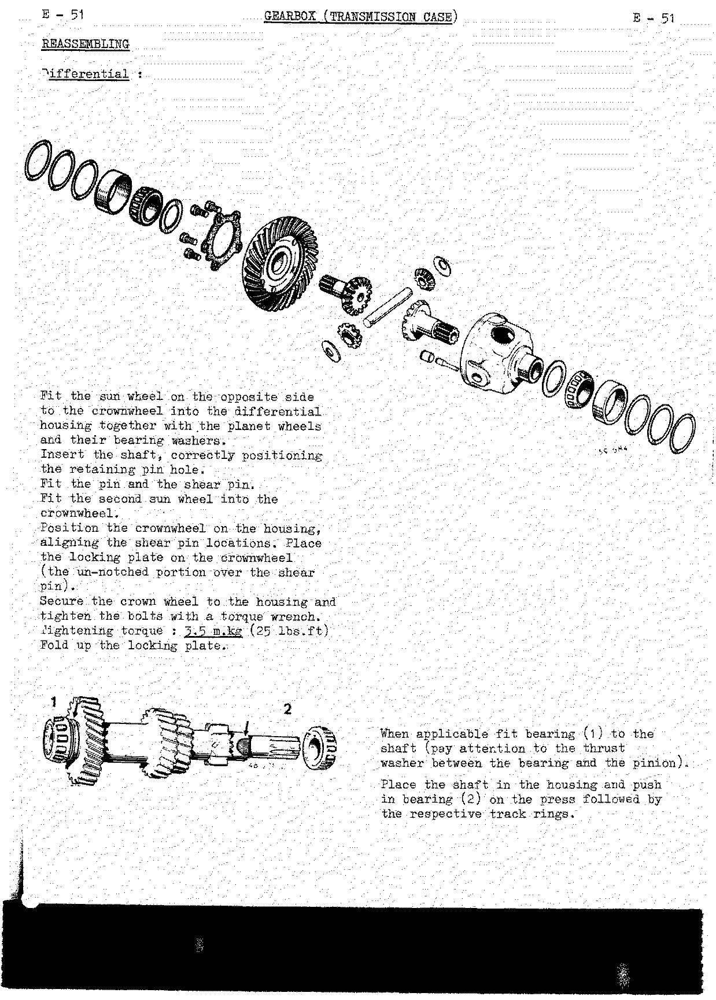

1. Fit the sun wheel on the opposite side to the crownwheel into the differential housing together with the
   planet wheels and their bearing washers.
2. Insert the shaft, correctly positioning the retaining pin hole.
3. Fit the pin and the shear pin.
4. Fit the second sun wheel into the crownwheel.
5. Position the crownwheel on the housing, aligning the shear pin locations. Place the locking plate on the
   crownwheel (the un-notched portion over the shear pin).
6. Secure the crown wheel to the housing and tighten the bolts with a torque wrench. **Tightening torque:
   3.5 m.kg (25 lbs.ft).**
7. Fold up the locking plate.

**Primary shaft:**

8. When applicable, fit bearing (1) to the shaft (pay attention to the thrust washer between the bearing and the
   pinion).
9. Place the shaft in the housing and push in bearing (2) on the press followed by the respective track rings.

<!-- PDF p.236 · E-52 -->

**Reverse shaft:**

1. Place the reverse gearwheel (3) in the gearbox (with the gear tooth lead towards the thrust washer).
2. Insert the shaft from the differential end, first through gearwheel (3) then through thrust washer (4) (the
   chamfer on the washer should be facing away from the gearwheel). Following this, pass the shaft through control
   lever (5).
3. Position the reverse shaft so that the roll pin holes align with those in the bush and the control lever. Fit
   the roll pins. Ensure that the reverse shaft slides freely and that the gearwheel turns freely on the shaft.

**Adjusting the primary shaft bearings:** The shaft should turn freely but without any play.

1. Push the rear bearing track ring fully in in order to take up the primary shaft bearing play.
2. If the shaft turns too freely, insert adjusting shims followed by the spacer so that the spacer comes flush
   with the housing.
3. If the shaft is stiff, fit thinner adjusting washers so that the spacer is recessed by **1/10 mm (.004")**.
4. Temporarily fit the cover and its housing. Tap on the differential end of the shaft to bed it down.

<!-- PDF p.237 · E-53 -->

**Secondary shaft — 2nd speed synchroniser:**

Fit the following inside hub (6): the key retaining ring (7) followed by the two springs (8). Complete the
operation by inserting the three keys (9). Insert one end of each of the springs into one of the keys with the
other ends on either and opposite sides of the key.

> To prevent the keys moving during assembly, it is advisable to hold them in place by means of wire.

**3rd-4th speed synchronisers:** Place the following in sliding sleeve (13):

- the hub (10);
- the three keys (12) with the hollow parts facing towards the hub;
- the two springs (11). Insert the end of each of the springs in one of the keys with the opposite ends on either
  and opposite sides of the key.

<!-- PDF p.238 · E-54 -->

1. Fit bearing (15) to secondary shaft (16) on the press, then slide the synchroniser hub along the shaft.
2. Fit gearwheels (18) and stop washers (19) and (20) into the box, placing them on the secondary shaft.

> **NOTE:**
> 1. Fit the shift fork over the 1st-2nd speed gearwheel before pushing in shaft (16).
> 2. Stop washer (19) is larger than washer (20).

3. Push in shaft (16) through the gearwheels, aligning the splined part of the 3rd-4th speed synchroniser hub with
   the keyway in shaft (a).
4. Slide the pinions on either side of the second speed stop washer location and fit the washer.
5. Slide the 3rd-4th speed synchroniser in order to fit the second washer.

<!-- PDF p.239 · E-55 · secondary-shaft assembly (illustration) -->
<!-- PDF p.240 · E-56 -->

6. Fit the track ring of the bearing at the drive pinion end (remove the wire which retains the second speed
   synchroniser keys).
7. At the other end of the shaft, fit:
   - the pinion depth adjusting washer;
   - the double taper roller bearing.

> **NOTE:** The double taper roller bearing is supplied pre-adjusted by the C.S.S. The pre-load is adjusted by the
> manufacturer. Under no circumstances should this assembly be dismantled. When fitting a new bearing the secondary
> shaft rotates with a certain resistance to rotation. This resistance is perfectly normal. If the original bearing
> is re-used, ensure that there is no play in it. If there is, replace it.

8. Tighten the nut which forms the speedometer worm. Do not lock it.

#### Adjusting the pinion depth — type 316

Marks such as the **55** and **181** shown in the illustration are references which appear also on the crownwheel
and show that the crownwheel and pinion are matched.

<!-- PDF p.241 · E-57 -->

The theoretical pinion depth "A" equals **47.5 mm (1.870")**.

The actual pinion depth is equal to **A + the difference noted on the pinion**. In the above example the pinion
depth equals 47.5 + 0.2 = **47.7 mm** (1.870" + .008" = 1.878"). If there is no difference figure on the pinion,
the actual pinion depth is equal to the theoretical pinion depth.

The actual pinion depth is measured by means of direct reading gauge **T.Ar.27**.

1. The reference plate with the "0" marked on it should be pressed against the differential carrier bore.
2. The graduated rule is to be placed against the front face of the final drive pinion.
3. The figure read opposite the "0" reference should equal the actual pinion depth already calculated.
4. If it does not, place an adjusting washer of suitable thickness between the 3rd speed gearwheel and the double
   bearing. Washers varying in thickness from **3.30 to 4.30 mm (.130" to .169")** in increments of **1/10 mm
   (.004")** are available.
5. Temporarily fit the speedometer drive housing and check the pinion depth that has been obtained. Remove the
   cover.
6. Knock down the collar on the nut which forms the speedometer drive worm so that it enters the groove in the
   shaft.

<!-- PDF p.242 · E-58 -->

**Fitting the shift forks and their shafts:**

1. Engage the reverse sleeve. Turn the reverse shaft so that the control lever enters the slot in the sleeve.
2. Fit the 3rd-4th speed fork followed by its shaft and pin it using drift **B.Vi.31 A**.
3. Position the locking plunger by means of guide **B.Vi.04**.
4. Engage the 1st-2nd speed fork shaft and pin it using drift **B.Vi.31 A**.
5. Engage 2nd gear. Fit the shift fork shaft control lever.
6. Place the speedometer drive housing in position with its gasket smeared with jointing compound. Fit the control
   lever shaft and pin the lever.
7. Return to the neutral position and fit the cover.
8. Position the locking balls and springs. Fit the cover with its gasket smeared with jointing compound.
9. Fit the lower cover plate with its gasket smeared with jointing compound.

#### Adjusting the crownwheel and pinion backlash — type 316

<!-- PDF p.243 · E-59 -->

1. Place the differential (fitted with new oil baffle washers) into the housing.
2. Place one of the adjusting tools **T.Ar.28** on the differential housing (with the adjusting screw on the tool
   fully unscrewed).
3. Place the differential carrier on the tool with its gasket and the matched half shells. Repeat the same
   operation on the other tool.
4. Mount a dial indicator on the housing by means of support **T.Ar.29**. Place the plunger in contact with one of
   the crownwheel teeth.
5. Tighten the screw on the tool on the crownwheel side until a backlash of from **0.1 to 0.2 mm (.004" to .008")**
   is obtained. Then tighten the lock nut.
6. Screw in the screw on the opposite side and tighten the lock nut.
7. Remove the half shells and the differential carriers. Remove the tools and the baffle washers, taking care to
   mark their positions.

#### Adjusting the bearing play — type 316

This is adjusted by means of shims placed under the track rings in the differential carriers. The thickness of the
shims to be fitted is equal to **C1 − C2**.

- **C1** is measured by means of a dial indicator across the tool after adjustment. Tighten the bearing which
  corresponds to the tool that has been measured on fixture **T.Ar.28**; stop tightening before the rollers become
  locked.

<!-- PDF p.244 · E-60 -->

- **C2** is measured on the fixture **T.Ar.28** by means of a micrometer.

Make up a shim pack which is as near as possible to the dimension obtained. Shims of **0.10 – 0.20 – 0.50 and
0.95 mm** (.004" – .008" – .020" and .037") can be obtained. Mark this shim pack with respect to the bearing with
which it is to be used. Repeat the operation for the second bearing.

Following the reference marks made during dismantling, fit:

- the differential bearings;
- the seals, adjusting shims and track rings in the differential carriers.

**Final assembly:**

1. Place the differential in the housing.
2. Place the differential carriers together with their paper gaskets smeared with jointing compound in their
   positions.
3. Fit the universal joints and secure them in place.
4. Temporarily fit the half shells and their felts.
5. Refit the clutch shaft together with its pin retaining spring to the primary shaft. Align the pin holes using
   drift **Emb.03**. Pin and lock the pin with the spring.
6. Refit the front cover with its paper gasket smeared with jointing compound.
7. Refit the clutch control.

> **NOTE:** The unit is to be filled with oil after it is refitted to the vehicle.

---

## Type 318 gearbox

<!-- PDF p.244 · E-60 -->

The type 318 gearbox fitted to type R.1090 and R.1091 vehicles is identical to that fitted to type R.1094 and
R.1095 vehicles. Only that fitted to the type R.1093 vehicle has different specifications:

- **Type 318-17:** 8 × 35 crownwheel and pinion.
- **Type 318-18:** 7 × 35 crownwheel and pinion.

The 4th speed reduction ratio is **1.07**.

> Full type-318 overhaul detail is in a separate manual — the Contents notes "See M.R. 94, EA chapter E".

---

## Standardisation as replacements of the various gearbox types

<!-- PDF p.245 · E-61 -->

### I — Gearboxes

In order to reduce the number of gearboxes available, the C.S.S. now only supplies the following gearbox types:

- **Type 325:** to replace a type 289 or 314 gearbox.
- **Type 318:** to replace a type 316 or 318 gearbox (gravity die cast housing).

> **NOTE:**
> a) Each gearbox type can be supplied with universal joints with 10 or 20 splines at the half shaft end.
> b) There is a countersunk screw in the housing which seals the upper part of the cover plate. This applies to
> the case where the gearbox is fitted to an engine which has no locating boss on the clutch housing bar. For a
> housing which has the locating boss, ensure that the screw head does not project past the plate.

**Fitting:** Fitting a type 325 or 318 gearbox involves carrying out the modifications listed in the chart below.

| Modification (by original gearbox type)        | No. | 289 | 289 Ferlec | 314 | 314 Ferlec | 316 | 318 |
| ---------------------------------------------- | --- | --- | ---------- | --- | ---------- | --- | --- |
| **Parts to be replaced:**                      |     |     |            |     |            |     |     |
| Engine to gearbox securing stud                | 4   | ✕   | ✕          | ✕   | ✕          | ✕   | ✕   |
| Radiator securing stud                         | 2   | ✕   | ✕          | ✕   | ✕          | ✕   | ✕   |
| Engine to gearbox locking plate                | 2   | ✕   | ✕          | ✕   | ✕          | ✕   | ✕   |
| Speedometer drive cable                        | 1   | ✕   | ✕          |     |            | ✕   |     |
| Gear cable cover support                       | 1   | ✕   |            | ✕   |            | ✕   | ✕   |
| Sump (oil pan) securing bolt                   | 3   | ✕   | ✕          | ✕   | ✕          | ✕   | ✕   |
| **Parts to be added:**                         |     |     |            |     |            |     |     |
| Clutch cable ball joint                        | 1   | ✕   |            | ✕   |            | ✕   | ✕   |
| **Modifications to be carried out:**           |     |     |            |     |            |     |     |
| Sump (oil pan)                                 |     | ✕   |            | ✕   |            | ✕   | ✕   |
| Microswitch                                    |     |     | ✕          |     |            |     |     |

<!-- PDF p.246 · E-62 -->

**Observations:**

1. Replacing a type 318 gearbox with a pressure die cast housing by a type 325 gearbox involves no modifications.
2. For type R.1090 and R.1091 vehicles which have **8 mm (5/16")** shims between the gearbox and the thrust pad
   bracket, remove the shims and replace the bracket by a new one (**No 4.281.512**).

**Modifications to be carried out:**

- **Sump (oil pan):** Cut the sump to permit the pressed steel clutch withdrawal fork to clear. (Section
  dimensions on the figure: 6 mm, 46 mm and 43 mm.)
- **Microswitch:** Replace the microswitch and its bracket. Secure it by means of 2 of the gear change lever
  securing bolts. Extend the 2 leads by the required amount.

### II — Gearbox housing

1. Type 289, 314 and 316 gearbox housings are still supplied by the C.S.S. However, the type 289 and 316 gearbox
   housings embody a modification to the double taper roller bearing lubrication hole (to standardise machining
   with the production type housings). Consequently, fitting a modified housing automatically involves fitting a
   double taper roller bearing, the outer track ring of which has a lubrication groove in it, **No 8.527.756**.

<!-- PDF p.247 · E-63 -->

2. However, one can replace:
   - A type 314 gearbox housing (gravity die or pressure die cast) by a type 325 gearbox housing (pressure die
     cast).
   - A type 318 gearbox housing (gravity die cast) by a type 318 gearbox housing (pressure die cast).

   These housings are specially designed as spare parts. They have a tapped hole in them to accommodate a
   countersunk screw, which will seal the upper part of the cover plate. This applies to cases where the gearbox
   is fitted to an engine which has no locating boss on the clutch housing bar.

   > **NOTE:** This screw must be fitted in all cases even if the clutch housing does have a locating boss. In this
   > case the head of the screw should not project past the cover plate.

   The operations involved in replacing a gravity die cast housing by a pressure die cast housing are the same as
   those that apply to a complete gearbox. Nevertheless the addition of the following parts is necessary:

   | Description            | Number |
   | ---------------------- | ------ |
   | Sheet steel rear cover | 1      |
   | Cover gasket           | 1      |
   | Dowel bush             | 2      |
   | Countersunk head screw | 1      |
   | Clutch withdrawal fork | 1      |
   | Return spring          | 1      |
   | Fork securing spring   | 1      |
   | Cover securing bolt    | 4      |
   | Plain washer           | 4      |

### III — Oil capacity

Since June 1961 the oil capacity of type 314 and 318 gearboxes has been increased. It has been increased from
**1.250 litres** (2¼ pts Imp) (2¾ pts US) to **1.60 litres** (2⅝ pts Imp) (3½ pts US). <!-- NEEDS REVIEW: OCR read "514 and 318" and "(25 pts Imp)(34 pts US)" / "22 pts US"; page image shows "type 314 and 318", 2⅝ pts Imp and 3½ pts US (from) 2¾ pts US — corrected from image -->

This increase has been obtained by raising the filler hole orifice by **8 mm (5/16")**. The new type housing can be
identified by the shape of the filler orifice boss.

When fitting a gearbox with an increased capacity housing you should ensure that the stub axle tubes have an oil
drain hole in them. If they have not, you must drill a **4 mm (.158")** diameter hole at a distance A of **40 mm
(1 9/16")**.
