# Suspension - Shock Absorbers

<!--
Source: Renault Dauphine Workshop Manual M.R.93 (English edition, November 1964), Chapter L
"Suspension - Shock Absorbers" (Renault §51). Source PDF pages 333–353.

Page-mapping note: PDF p.333 is the chapter title + Contents leaf (bears no printed "L-n" number).
Numbered content then runs continuously from printed L-3 = PDF p.334 to printed L-22 = PDF p.353,
a constant offset of +331 with no drift (printed L-N = PDF p.(N+331)). Citations below give the PDF
page (matches pNNNN.png) and the printed L-page. No duplicate, abridged or foreign (misfiled) pages
were found in the range. (The aerostable front/rear cross-sections on L-5 and L-6 use the same
factory drawings 59996/59997; delivered once, at L-5.)

Chapter scope: coil-spring suspension and hydraulic telescopic shock absorbers for the R.1090,
R.1091 and R.1093 (and the "aerostable" self-levelling variants). Covers spring and shock-absorber
specifications by model, shock-absorber colour/date-code identification, the 1960 rear-suspension
modification and standardisation, removing/refitting front and rear shock absorbers and springs
(both conventional and aerostable), bench/manual testing of a shock absorber, replacing the elastic
pad and eye-end bush, compound-filtration metal-cover shocks, the anti-roll bar, the override stops,
air cushions, checking the rear cross member, the half-shaft movement-limiter pad, and the full
shock-absorber part-number tables for the R.1090 and R.1091.

Content verification: SAFETY-RELEVANT chapter — every spring dimension, load figure, pad thickness,
setting dimension and part number was cross-checked against the rendered page image (≈19 page images
opened, essentially the whole chapter). Notable verified items: the L-3 spring table (front free
length 257 mm +1/−2, rear 278 mm ± 1.5), the aerostable spring specs on L-5/L-6/L-8, the refitting
pad thicknesses (9 mm and 15 mm, front and rear), the half-shaft limiter setting dimension
A = 161 mm on L-20, and the two R.1090/R.1091 shock-absorber part-number tables on L-21/L-22. Two
values are flagged inline: the L-8 R.1093 rear-spring length "15 1/6\"" (382 mm ≙ 15 1/16") and the
L-21 first-row 2nd-fitting number "85443042" (8 digits where every other entry is 7).
-->

<!-- PDF p.333 · chapter title & Contents leaf -->

## Contents of chapter

Page numbers are the printed **L-n** pages.

| Section | Page |
| ------- | ---- |
| Specifications | L-3 |
| Modification and standardisation of the rear suspension | L-7 |
| Removing and refitting a front shock absorber | L-9 |
| Removing and refitting a front spring | L-11 |
| Removing and refitting a rear spring and shock absorber | L-12 |
| Testing a shock absorber | L-16 |
| Replacing a shock absorber elastic pad | L-17 |
| Replacing the eye-end bush | L-17 |
| Shock absorbers with metal covers (Compound filtration equipment) | L-17 |
| Removing and refitting an anti-roll bar | L-18 |
| Replacing the override stops | L-19 |
| Replacing an air cushion | L-19 |
| Checking the rear suspension cross member | L-20 |
| Replacing the shock absorbing pad on the half shaft movement limiter (suspension other than aerostable type) | L-20 |
| Shock absorber types fitted (R.1090 – R.1091) | L-21 |

---

## Specifications

<!-- PDF p.334 · L-3 -->

### Suspension without aerostable attachment

Independent suspension on all four wheels by means of coil springs. Hydraulic telescopic shock
absorbers operating on the spring centre lines. Anti-roll bar at the front.

| Spring | Wire diameter | Outside diameter of spring | Free length | Difference in length under load |
| ------ | ------------- | -------------------------- | ----------- | ------------------------------- |
| Front spring | 11.2 mm (.441") | 100.4 mm (3 15/16") | 257 mm +1/−2 (10 1/8") <!-- NEEDS REVIEW: OCR read "257 mm * 5"; page image clearly shows "257 mm" with a +1/−2 tolerance — corrected from image --> | 300 kg and 200 kg = 32 mm ±1 (660 lb and 440 lb = 1 1/4") |
| Rear spring | 12.75 mm (.502") | 99 mm (3 7/8") | 278 mm ± 1.5 (10 15/16") | 350 kg and 250 kg = 17 mm ±1 (771 lb and 551 lb = 11/16") |

### Shock absorber identification

<!-- PDF p.335 · L-4 -->

The shock absorber bodies are painted in the following colours:

- dark red at the front
- blue at the rear

Each shock absorber has white painted references on the body showing the vehicle for which it is
intended and signs which correspond to the various manufacturing series (see figures).

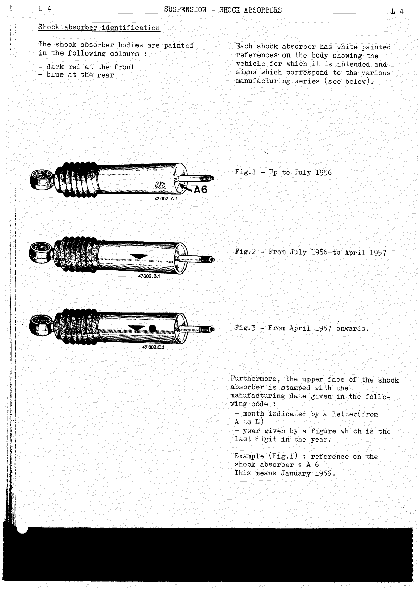

| Manufacturing series sign | Period |
| ------------------------- | ------ |
| Fig.1 | Up to July 1956 |
| Fig.2 | From July 1956 to April 1957 |
| Fig.3 | From April 1957 onwards |

Furthermore, the upper face of the shock absorber is stamped with the manufacturing date given in
the following code:

- month indicated by a letter (from A to L)
- year given by a figure which is the last digit in the year

> **Example (Fig.1):** reference on the shock absorber `A 6` means **January 1956**.

### Aerostable suspension — R.1090 / R.1090 A

<!-- PDF p.336 · L-5 -->

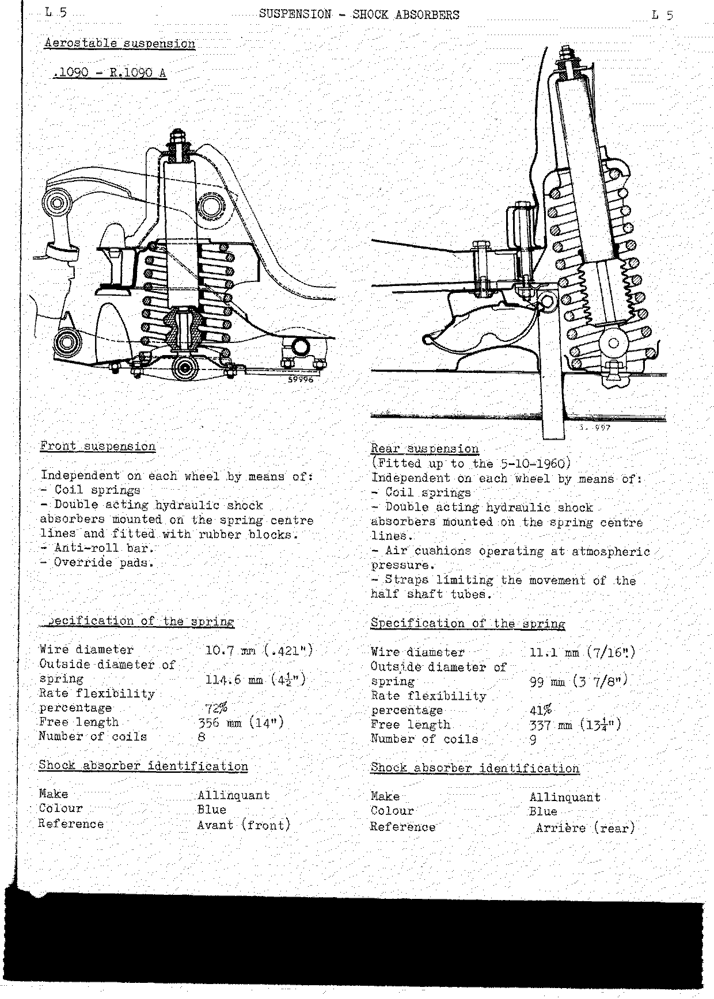

**Front suspension** — independent on each wheel by means of:

- Coil springs
- Double acting hydraulic shock absorbers mounted on the spring centre lines and fitted with rubber blocks
- Anti-roll bar
- Override pads

**Rear suspension** (fitted up to the 5-10-1960) — independent on each wheel by means of:

- Coil springs
- Double acting hydraulic shock absorbers mounted on the spring centre lines
- Air cushions operating at atmospheric pressure
- Straps limiting the movement of the half shaft tubes

| Spring specification | Front | Rear |
| -------------------- | ----- | ---- |
| Wire diameter | 10.7 mm (.421") | 11.1 mm (7/16") |
| Outside diameter of spring | 114.6 mm (4½") | 99 mm (3 7/8") |
| Rate flexibility percentage | 72% | 41% |
| Free length | 356 mm (14") | 337 mm (13¼") |
| Number of coils | 8 | 9 |

| Shock absorber identification | Front | Rear |
| ----------------------------- | ----- | ---- |
| Make | Allinquant | Allinquant |
| Colour | Blue | Blue |
| Reference | Avant (front) | Arrière (rear) |

### R.1091 aerostable suspension

<!-- PDF p.337 · L-6 -->

The front and rear cross-sections are the same factory drawings (59996 / 59997) shown at
[R.1090 / R.1090 A](#aerostable-suspension-r1090-r1090-a) above.

**Front suspension** — independent on each wheel by means of:

- Coil springs
- Double acting hydraulic shock absorbers mounted on the spring centre lines and fitted with rubber pads
- Anti-roll bar
- Override pads

**Rear suspension** — applicable up to manufacturing number **17.021 (15.5.1960)** — independent on
each wheel by means of:

- Coil springs
- Double acting hydraulic shock absorbers mounted on the spring centre lines
- Air cushions operating at atmospheric pressure
- Straps limiting the half shaft tube movement

| Spring specification | Front | Rear |
| -------------------- | ----- | ---- |
| Wire diameter | 10.7 mm (.421") | 12.3 mm (.484") |
| Outside diameter | 114.6 mm (4½") | 101 mm (4") |
| Free length | 356 mm (14") | 294 mm (11 9/16") |
| Length under load | of 200 kg (440 lbs): 206 mm +2/−3 (8 1/8") | of 300 kg (660 lbs): 214 ± 2 mm (8 7/16") |
| Number of coils | 8 | 9 |

| Shock absorber identification | Front | Rear |
| ----------------------------- | ----- | ---- |
| Make | Allinquant | Allinquant |
| Colour | Buff | Buff |
| Reference | Avant (front) | Arrière (rear) |

---

## Modification and standardisation of the rear suspension

<!-- PDF p.338 · L-7 -->

The rear suspension of type R.1090 and R.1091 vehicles was subjected to considerable modification
during 1960.

On the R.1090 from manufacturing number **17.022** up to number **26.436**, and on approximately the
first 400 "Ondine" models, the rear suspension was modified in the following manner:

1. The addition of **8 mm (.315")** spacers between:
   - the thrust pad and the box housing (A),
   - the side pads and the suspension cross member (B).
2. The insertion of **4 mm (.158")** spacers between the bottoms of the air cushions and the suspension cross member (C).
3. The addition of an Evidgom pad on the shock absorber (the bellows were discontinued).
4. The extension by **25 mm (1")** of the straps which limit the half shaft tube travel.

The shock absorbers were painted buff with a white band round them.

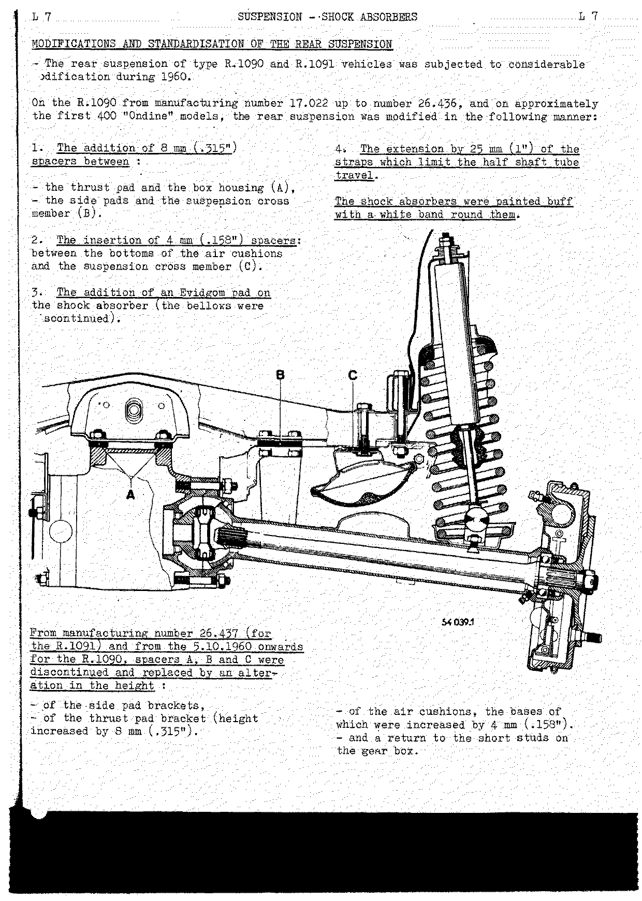

From manufacturing number **26.437** (for the R.1091) and from the **5.10.1960** onwards for the
R.1090, spacers A, B and C were discontinued and replaced by an alteration in the height:

- of the side pad brackets,
- of the thrust pad bracket (height increased by **8 mm (.315")**),
- of the air cushions, the bases of which were increased by **4 mm (.158")**,
- and a return to the short studs on the wear box.

<!-- PDF p.339 · L-8 -->

Following this modification and from the **5.10.1960** onwards, the rear suspensions of R.1090 and
R.1091 vehicles were standardised.

### Standardised rear suspension specification

Specification and methods of identifying the springs and shock absorbers fitted since the 15th May
1960 on the R.1091 and 5th October 1960 on the R.1090.

Shock absorber with Evidgom pad:

| Model | Number |
| ----- | ------ |
| Standard model | 9 823 692 |
| Compound model | 9 823 693 |

Spring **number 4 280 025**:

| Item | Value |
| ---- | ----- |
| Flexibility rate | 27% |
| Wire diameter | 12.3 mm (.484") |
| Outside diameter | 101 mm (4") |
| Free length | 294 mm (11 9/16") |
| Length under a load of 200 kg (440 lbs) | 240 mm (9 7/16") |
| Number of coils | 9 |

This type of suspension may be fitted to vehicles of the aerostable suspension type. To do this, it
is not necessary to remove the power unit assembly; merely follow the method given below:

1. Remove the radiator to gain access to the thrust pad.
2. Remove the bolt which secures the pad to the cross member.
3. Lower the gear box and take its weight on a jack.
4. Replace:
   - the thrust pad bracket
   - the side pad brackets
   - the shock absorbers
   - the rear springs (on the R.1090 only)
   - the straps
5. Fit **4 mm (5/32")** spacers between the air cushions and the cross member (or replace the cushions by those with bases which are higher by **4 mm (5/32")**).
6. Stick a protective sheet (Klégécell) to the floor centre cross member.

> **NOTE:** For vehicles of the R.1091 type produced between the 15th May and 5th October and for the
> first 400 "Ondine" models, when replacing a gear box of the 318.14 type (housing with long studs),
> the C.S.S. will supply a type 318.13 gear box (housing with short studs). This operation involves
> replacing the thrust pad bracket and removing the corresponding spacers.

### Type R.1093 suspension

At the front, the type R.1093 vehicle is fitted with independent suspension on each wheel operating
by means of:

- Coil spring with 7 coils; wire diameter 11.8 mm (.465")
- Double acting hydraulic shock absorbers
- Anti-roll bar 12 mm (.473") in diameter

The front axle is of the **67-27** type.

At the rear, the wheels also have independent suspension by means of:

- Coil springs with 8 coils; wire diameter 12.3 mm (.484"); length 382 mm (15 1/6") <!-- NEEDS REVIEW: page image prints "15 1/6\""; 382 mm = 15 1/16" (15.06"), so the printed fraction is almost certainly a missing-digit typo for "15 1/16\"". Kept as printed. -->; attachment between centres 352 ± 1 mm (13 7/8")
- Straps limiting the half shaft tube movement
- Air cushions between the half shaft tube and the rear cross member

---

## Removing and refitting a front shock absorber

<!-- PDF p.340 · L-9 -->

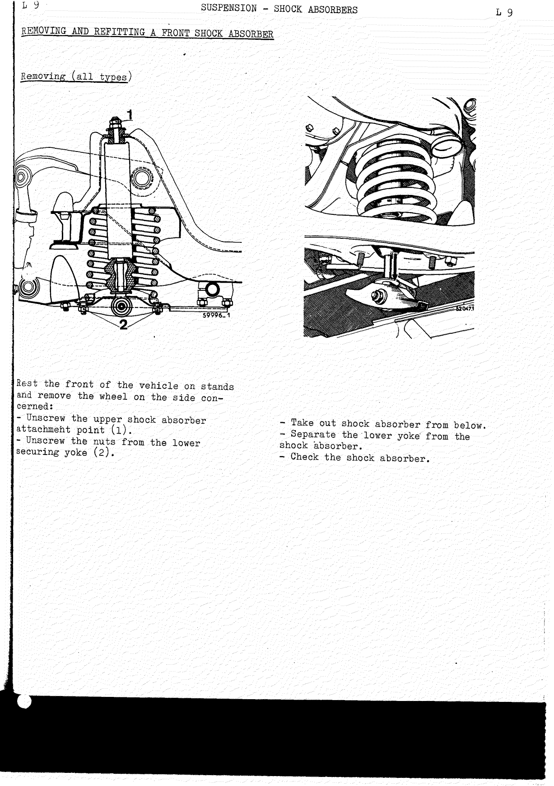

### Removing (all types)

Rest the front of the vehicle on stands and remove the wheel on the side concerned.

1. Unscrew the upper shock absorber attachment point (1).
2. Unscrew the nuts from the lower securing yoke (2).
3. Take out the shock absorber from below.
4. Separate the lower yoke from the shock absorber.
5. Check the shock absorber.

### Refitting (suspensions other than aerostable)

<!-- PDF p.341 · L-10 -->

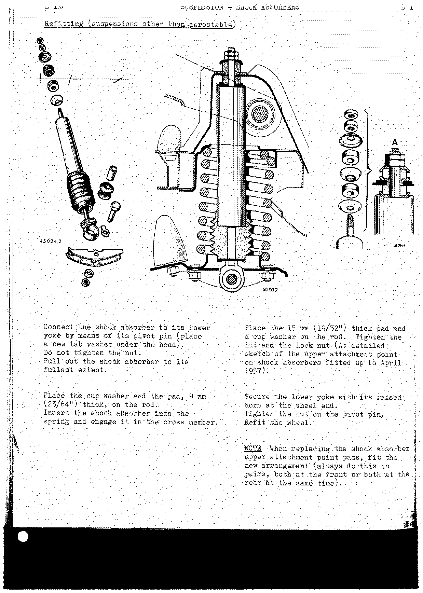

1. Connect the shock absorber to its lower yoke by means of its pivot pin (place a new tab washer under the head). Do not tighten the nut.
2. Pull out the shock absorber to its fullest extent.
3. Place the cup washer and the pad, **9 mm (23/64")** thick, on the rod.
4. Insert the shock absorber into the spring and engage it in the cross member.
5. Place the **15 mm (19/32")** thick pad and a cup washer on the rod. Tighten the nut and the lock nut (A: detailed sketch of the upper attachment point on shock absorbers fitted up to April 1957).
6. Secure the lower yoke with its raised horn at the wheel end.
7. Tighten the nut on the pivot pin.
8. Refit the wheel.

> **NOTE:** When replacing the shock absorber upper attachment point pads, fit the new arrangement
> (always do this in pairs, both at the front or both at the rear at the same time).

### Refitting (aerostable suspension)

<!-- PDF p.342 · L-11 -->

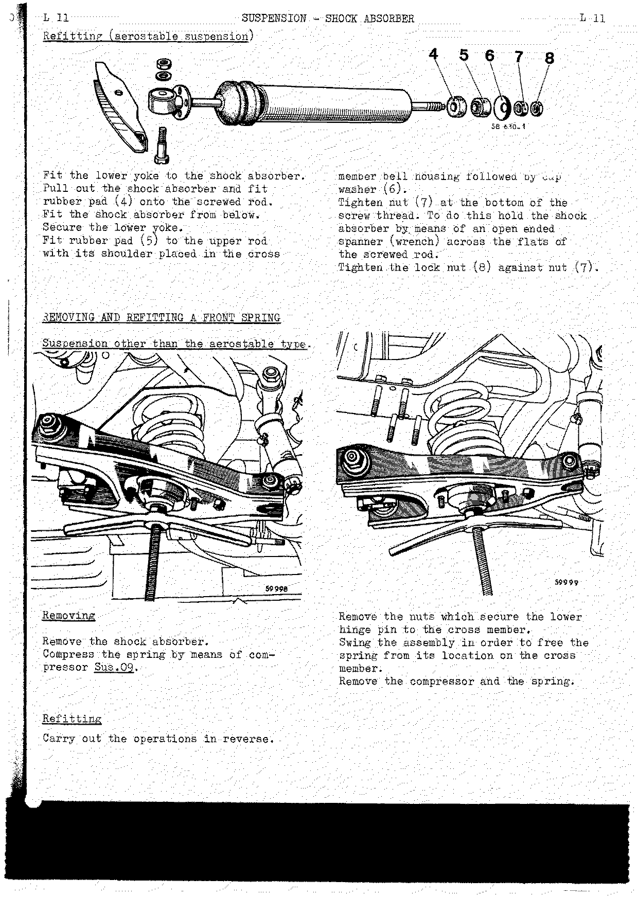

1. Fit the lower yoke to the shock absorber.
2. Pull out the shock absorber and fit rubber pad (4) onto the screwed rod.
3. Fit the shock absorber from below. Secure the lower yoke.
4. Fit rubber pad (5) to the upper rod with its shoulder placed in the cross member bell housing, followed by cup washer (6).
5. Tighten nut (7) at the bottom of the screw thread. To do this, hold the shock absorber by means of an open ended spanner (wrench) across the flats of the screwed rod.
6. Tighten the lock nut (8) against nut (7).

---

## Removing and refitting a front spring

<!-- PDF p.342 · L-11 -->

Suspension other than the aerostable type.

**Removing:**

1. Remove the shock absorber.
2. Compress the spring by means of compressor **Sus.09**.
3. Remove the nuts which secure the lower hinge pin to the cross member.
4. Swing the assembly in order to free the spring from its location on the cross member.
5. Remove the compressor and the spring.

**Refitting:** Carry out the operations in reverse.

### Aerostable suspension

<!-- PDF p.343 · L-12 -->

**Removing:**

1. Remove the shock absorber and fit the spring compressor (**Sus.20**).
2. Disconnect the anti-roll bar link from the lower hinge pin.
3. Loosen and remove the lower hinge pin.
4. Unscrew the four nuts which secure the hinge pin bearings.
5. Unscrew the spring compressor and put aside the spring.

**Refitting:**

1. Carry out the removing operations in reverse.
2. Tighten the hinge pin after inserting a spacer of the correct thickness between the upper suspension arm and the cross member.

> **NOTE:** See the section concerning tightening the rubber bushes in the
> [Front Axle](h-front-axle.md) chapter.

---

## Removing and refitting a rear spring and shock absorber

<!-- PDF p.343 · L-12 -->

Suspension other than the aerostable type.

**Removing:**

1. Place the vehicle on stands.
2. Remove the wheel.
3. Disconnect the shock absorber at the top.
4. Lift the half shaft tube with a jack in order to free the limit strap and disconnect the half shaft tube.
5. Push in the shock absorber to its fullest extent.
6. Free the assembly from the cross member.
7. Remove the spring, take out the lower pin and remove the shock absorber.

**Refitting:**

<!-- PDF p.344 · L-13 -->

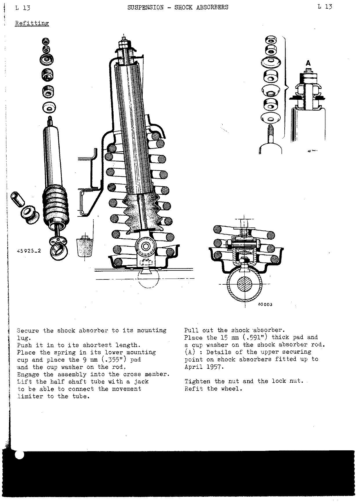

1. Secure the shock absorber to its mounting lug.
2. Push it in to its shortest length.
3. Place the spring in its lower mounting cup and place the **9 mm (.355")** pad and the cup washer on the rod.
4. Engage the assembly into the cross member.
5. Lift the half shaft tube with a jack to be able to connect the movement limiter to the tube.
6. Pull out the shock absorber.
7. Place the **15 mm (.591")** thick pad and a cup washer on the shock absorber rod (A: details of the upper securing point on shock absorbers fitted up to April 1957).
8. Tighten the nut and the lock nut.
9. Refit the wheel.

### Aerostable suspension (shock absorbers that have no Evidgom pad)

<!-- PDF p.345 · L-14 -->

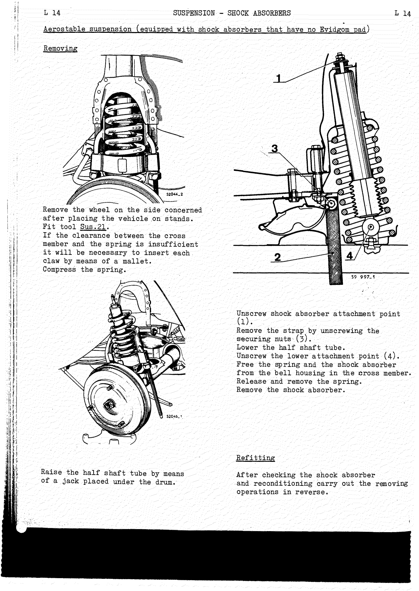

**Removing:**

1. Remove the wheel on the side concerned after placing the vehicle on stands.
2. Fit tool **Sus.21**. If the clearance between the cross member and the spring is insufficient, it will be necessary to insert each claw by means of a mallet.
3. Compress the spring.
4. Unscrew the shock absorber attachment point (1).
5. Remove the strap by unscrewing the securing nuts (3).
6. Lower the half shaft tube (raise it by means of a jack placed under the drum).
7. Unscrew the lower attachment point (4).
8. Free the spring and the shock absorber from the bell housing in the cross member.
9. Release and remove the spring.
10. Remove the shock absorber.

**Refitting:** After checking the shock absorber and reconditioning, carry out the removing
operations in reverse.

### Aerostable suspension (shock absorbers which have Evidgom pads)

<!-- PDF p.346 · L-15 -->

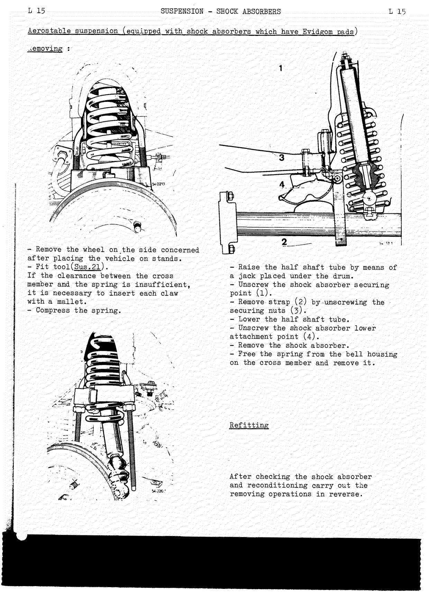

**Removing:**

1. Remove the wheel on the side concerned after placing the vehicle on stands.
2. Fit tool **Sus.21**. If the clearance between the cross member and the spring is insufficient, it is necessary to insert each claw with a mallet.
3. Compress the spring.
4. Raise the half shaft tube by means of a jack placed under the drum.
5. Unscrew the shock absorber securing point (1).
6. Remove strap (2) by unscrewing the securing nuts (3).
7. Lower the half shaft tube.
8. Unscrew the shock absorber lower attachment point (4).
9. Remove the shock absorber.
10. Free the spring from the bell housing on the cross member and remove it.

**Refitting:** After checking the shock absorber and reconditioning, carry out the removing
operations in reverse.

---

## Testing a shock absorber

<!-- PDF p.347 · L-16 -->

Any shock absorber which shows one of the following external defects is to be replaced:

- Bent piston rod.
- Loose securing point.
- Leakage (either at the gland or at the crimping).
- Damaged or dented body.

If none of these defects are noted, carry out a manual test as follows:

- Hold the shock absorber vertically with a rod passed through the grommet and a tube drilled with a **10 mm (25/64")** hole secured to the upper attachment point.
- Pump the shock absorber through its full travel eight or ten times.
- The resistance to movement should be constant.

**Replace the shock absorber if the following are noted:**

- a) cavitation when the direction of movement is changed.
- b) movement without resistance even over a short length of travel.
- c) if it is impossible to move the shock absorber by hand.

> **NOTE:** Comparing a new shock absorber with the shock absorber in question gives the wrong
> impression, because a shock absorber that has not yet been run in is obviously stiffer. A manual
> check only permits one to estimate on the condition of the shock absorber. To obtain absolutely
> accurate results a special test machine is necessary.

---

## Replacing a shock absorber elastic pad

<!-- PDF p.348 · L-17 -->

1. Place special tool (**Sus.22**) over the shock absorber piston rod and grip the assembly in a vice.
2. Unscrew the eye-end by means of a rod passed through the bush tube.
3. Remove tool (Sus.22) and take off the elastic pad.
4. Fit a new elastic pad and eye-end.

---

## Replacing the eye-end bush

<!-- PDF p.348 · L-17 -->

1. Remove the shock absorber and push out the spacing tube by means of mandrel **Sus.12**.
2. Take out the rubber bush by rocking it with a screwdriver.

---

## Shock absorbers with metal covers (Compound filtration equipment)

<!-- PDF p.348 · L-17 -->

- The piston rod is protected from thrown stones by a sheet steel tube.
- The shock absorber is sealed by a double seal. The direction in which the shock absorber is to be fitted is marked on the body.

---

## Removing and refitting an anti-roll bar

<!-- PDF p.349 · L-18 -->

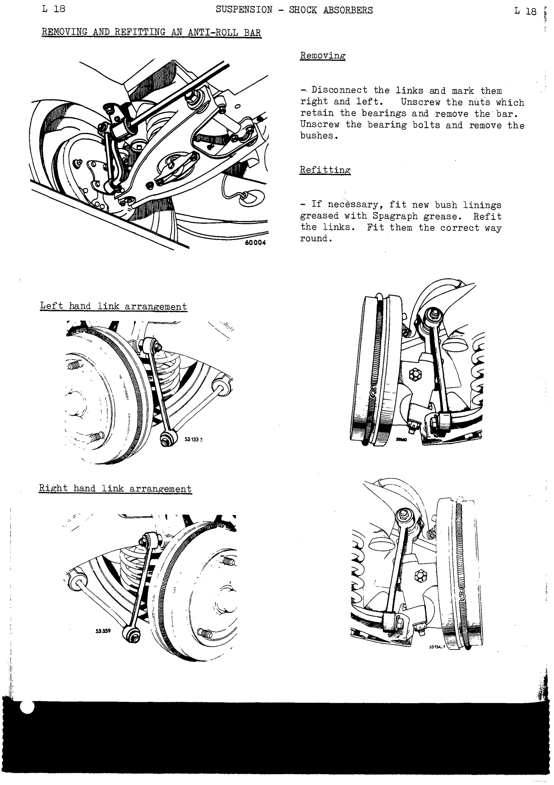

**Removing:**

1. Disconnect the links and mark them right and left.
2. Unscrew the nuts which retain the bearings and remove the bar.
3. Unscrew the bearing bolts and remove the bushes.

**Refitting:**

1. If necessary, fit new bush linings greased with Spagraph grease.
2. Refit the links. Fit them the correct way round.

---

## Replacing the override stops

<!-- PDF p.350 · L-19 -->

**Lower stop** — to do this, unscrew the nut which retains the stop pad on the cross member.

**Upper stop:**

1. Remove the wheel on the side concerned.
2. Remove the upper hinge pin and lift the arm.
3. Replace the defective pad.
4. Retighten the upper hinge pin after having inserted the positioning spacer between the upper suspension arm and the cross member.

> **NOTE:** For tightening the rubber bushes see the [Front Axle](h-front-axle.md) chapter,
> paragraph VII — Removing and Refitting a front half axle, page 9.

---

## Replacing an air cushion

<!-- PDF p.350 · L-19 -->

Unscrew the air cushion attachment points on the cross member. Take care with the **4 mm (5/32")**
spacers which are placed between the cushions and the rear cross member on certain models.

**Checking an air cushion:**

Test the vehicle over a distance of a few miles with it laden to its maximum extent and driving over
poor road surfaces. As soon as the vehicle is stopped, place it on stands with the rear wheels
hanging free. The curved portion of the rubber air cushion should show no signs of hollowing.

---

## Checking the rear suspension cross member

<!-- PDF p.351 · L-20 -->

1. Remove the rear suspension cross member (see the [Gearbox (transmission case)](e-gearbox.md) chapter).
2. Check the cross member by means of cross member checking gauge (**Sus.11A**).

---

## Replacing the shock absorbing pad on the half shaft movement limiter

<!-- PDF p.351 · L-20 -->

Suspension other than aerostable type.

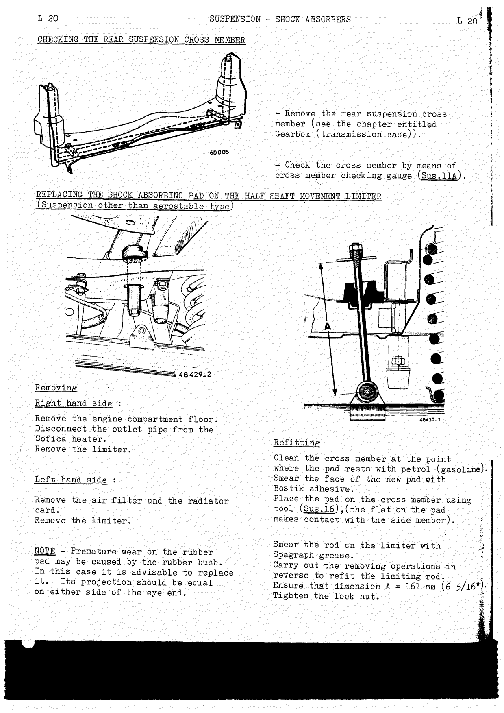

**Removing:**

- **Right hand side:** Remove the engine compartment floor. Disconnect the outlet pipe from the Sofica heater. Remove the limiter.
- **Left hand side:** Remove the air filter and the radiator card. Remove the limiter.

> **NOTE:** Premature wear on the rubber pad may be caused by the rubber bush. In this case it is
> advisable to replace it. Its projection should be equal on either side of the eye end.

**Refitting:**

1. Clean the cross member at the point where the pad rests with petrol (gasoline).
2. Smear the face of the new pad with Bostik adhesive.
3. Place the pad on the cross member using tool (**Sus.16**) — the flat on the pad makes contact with the side member.
4. Smear the rod on the limiter with Spagraph grease.
5. Carry out the removing operations in reverse to refit the limiting rod. Ensure that dimension **A = 161 mm (6 5/16")**.
6. Tighten the lock nut.

---

## Shock absorber types fitted (R.1090 – R.1091)

<!-- PDF p.352 · L-21 -->

> In the "Renault No. (2nd fitting)" columns a ditto mark `"` means "as the row above". All suppliers'
> references are Allinquant.

### R.1090 Dauphine (January 1960)

**Front shock absorbers:**

| Vehicle type | Renault No. (1st fitting) | Suppliers reference No. | Introduced (manufacturing No.) | Colours | Renault No. (2nd fitting) | Colours |
| ------------ | ------------------------- | ----------------------- | ------------------------------ | ------- | ------------------------- | ------- |
| All types | 8537339 | 601 33192C | From the 600th | Dark red | 85443042 R.10 <!-- NEEDS REVIEW: prints "85443042" (8 digits) where every other Renault No. in these tables is 7 digits; both OCR and page image read the same, so kept as printed — likely a source misprint (possibly for 8544304). --> | Dark red |
| All types | 8539466 | 601 33192E | From the 24853rd | Dark red + white triangle | " | Dark red |
| All types | 8540376 | 601 33192G | From the 126710th | Dark red + white triangle + white spot | " | Dark red |
| Tropical | 8542209 | 601 37248A | From the 220121st | Violet | " | Dark red |
| All types except compound | 8542209 | 601 37248A | Towards the end of June 1958 | Dark red | " | Dark red |
| All types except Compound Sport | 8543042 R.10 | 601 38211A | From the 6.2.1959 | Dark red | " | Dark red |
| Compound | 8543044 R.10 | 601 38232A | From the 6.2.1959 | Violet | 8543044 R.10 | Violet |
| All types except Compound | 9823688 | 601 38515B | Aerostable suspension | Dark red | 9823688 | Dark red |
| Compound | 9823689 | 601 39432B | Aerostable suspension | Violet | 9823689 | Violet |

**Rear shock absorbers:**

| Vehicle type | Renault No. (1st fitting) | Suppliers reference No. | Introduced (manufacturing No.) | Colours | Renault No. (2nd fitting) | Colours |
| ------------ | ------------------------- | ----------------------- | ------------------------------ | ------- | ------------------------- | ------- |
| All types | 8537340 | 601 33193E | From the 600th | Blue | 8543043 R.10 | Blue |
| All types | 8539647 | 601 33193F | From the 600th | Blue + red triangle | " | Blue |
| All types | 8540377 | 601 33193H | From the 126 710th | Blue + red triangle + red spot | " | Blue |
| Tropical | 8540400 | 601 35581 | From the 220121st | Black | " | Blue |
| All types except Compound | 8542208 | 601 37247A | Towards the end of June 1958 | Blue | " | Blue |

<!-- PDF p.353 · L-22 -->

**Rear shock absorbers (continued):**

| Vehicle type | Renault No. (1st fitting) | Suppliers reference | Introduced (manufacturing No.) | Colours | Renault No. (2nd fitting) | Colours |
| ------------ | ------------------------- | ------------------- | ------------------------------ | ------- | ------------------------- | ------- |
| All types except Compound Sport | 8543043 R.10 | 601 38212 | From the 6.2.1959 | Blue | 8543043 | Blue |
| Compound type | 8543045 R.10 | 601 38233 | From the 6.2.1959 | Black | 8543045 R.10 | Black |
| All types except Compound | 8543043 R.10 | 601 38212 | Aerostable suspension | Blue | 8543043 R.10 | Blue |
| Compound | 8543045 R.10 | 601 38233 | Aerostable suspension | Black | 8543045 R.10 | Black |
| Compound U.S.A. and Canada | 8544766 | 601 43854 | Aerostable suspension | Black | 8544766 | Black |

### R.1091 Dauphine

**Front shock absorbers:**

| Vehicle type | Renault No. (1st fitting) | Suppliers reference | Introduced (manufacturing No.) | Colours | Renault No. (2nd fitting) | Colours |
| ------------ | ------------------------- | ------------------- | ------------------------------ | ------- | ------------------------- | ------- |
| Sport type | 8543242 R.10 | 601 39255 | From the 6.2.1959 | Buff | 8543242 R.10 | Buff |
| Compound type | 8543244 R.10 | 601 39253 | From the 6.2.1959 | Black | 8543244 R.10 | Black |
| All types except Compound | 9823690 | 601 39437B | Aerostable suspension | Buff | 9823690 | Buff |
| Compound | 9823691 | 601 39439B | Aerostable suspension | Grey | 9823691 | Grey |

**Rear shock absorbers:**

| Vehicle type | Renault No. (1st fitting) | Suppliers reference | Introduced (manufacturing No.) | Colours | Renault No. (2nd fitting) | Colours |
| ------------ | ------------------------- | ------------------- | ------------------------------ | ------- | ------------------------- | ------- |
| Sport type | 8543243 R.10 | 601 39256 | From the 6.2.1959 | Red | 8543267 R.10 | Red |
| Compound type | 8543245 R.10 | 601 39254 | From the 6.2.1959 | Violet | 8543269 R.10 | Violet |
| All types except Compound | 8543267 | 601 39438 | Aerostable suspension | Buff | 8543267 | Buff |
| Compound | 8543269 | 601 39440 | Aerostable suspension | Grey | 8543269 | Grey |
| Compound U.S.A. and Canada | 8544767 | 601 43855 | Aerostable suspension | Grey | 8544767 | Grey |
