# Bodywork

<!--
Source: Renault Dauphine Workshop Manual M.R.93 (English edition), Chapter M "Bodywork"
(Renault §50, 81, 82, 84, 85). Source PDF pages 354–436.

Page-mapping note: PDF p.354 is the chapter title + Contents leaf (bears no printed "M-n" number).
Numbered content then runs continuously from printed M-3 = PDF p.355 to printed M-84 = PDF p.436,
a constant offset of +352 with no drift (printed M-N = PDF p.(N+352)). Citations below give the PDF
page (matches pNNNN.png) and the printed M-page. The raw OCR mislabelled two pages in the floor-check
sequence (it read printed "M-11" as "M-12"); the verified +352 offset was used to place every page
marker. No duplicate, abridged, or foreign (misfiled) pages were found in the range.

Content verification: this is a dimension- and part-number-heavy chapter. Every body-alignment /
jig-point dimension table, every cross-member and side-member interchangeability part number, and
every torque value below was cross-checked byte-for-byte against the rendered page image (~24 page
images opened): the main dimensions (M-4), floor-section checking dimensions A–AB (M-6), combined
jig-bench dimensions A–R (M-16), the front side-member checking-gauge dimensions (M-21), the front
cross-member check angles C = 80°40' / D = 2.5 mm and X = 26.5 mm / Y = 23° (M-24), the cross-member
identification part numbers and spring-cup dimensions (M-25/26/27), the side-member and engine-front-
cross-member part numbers and dimensions (M-30/31/32), the Sus.11 A modification dimensions (M-33),
the straightening dimensions (M-36), the door/lid clearance dimensions A–N (M-52/53), the door-
replacement part numbers (M-71/72) and the automatic-transmission bodywork dimensions (M-75/76).
Several OCR mis-reads were resolved from the image and are noted inline where relevant (e.g.
spring-cup A = 1 3/8" not "13"; F = 11 mm not "470 mm"; accelerator-pedal range "1.178 371" not
"271"; wire holes "6.5 mm (1/4")" not "(4")"; toe-board hole "(1 1/2")" not "(14")"). Two door/lid
fractional-inch figures ("15/63"" and "23/63"") are printed anomalies and are flagged as such.
-->

<!-- PDF p.354 · chapter title & Contents leaf -->

## Contents of chapter

Page numbers are the printed **M-n** pages.

| Section | Page |
| ------- | ---- |
| Specifications | M-3 |
| Main dimensions (unladen) | M-4 |
| Floor section component parts | M-5 |
| Checking the floor section | M-6 |
| Combined checking and repair jig bench | M-15 |
| Front side member checking gauges (Car.18) | M-21 |
| Rear side member checking gauges (Car.19) | M-22 |
| Gauge for fitting the cowl sides (Car.29) | M-22 |
| Lifting the car | M-23 |
| Checking and replacing the front cross member | M-24 |
| Replacing the cross member | M-27 |
| Replacing the side members | M-29 |
| Replacing the engine front cross member | M-32 |
| Body components | M-35 |
| Straightening damaged bodywork | M-36 |
| Replacing component parts | M-37 |
| Electric spot welding | M-38 |
| Double spot welding | M-40 |
| Using the spot welding gun | M-40 |
| Cross sections showing the component assembly points to assist in using the spot welding gun | M-47 |
| Door and lid clearance arrangement drawing | M-52 |
| Using weatherproofing compounds | M-54 |
| The identification of the paints used during manufacture | M-56 |
| Protective paint on sheet steel components supplied by the C.S.S. | M-57 |
| Precautions to be taken when stoving paint | M-57 |
| Zinc powder based protective paint | M-58 |
| Crackle finish paint on the dashboard embellisher | M-58 |
| Bodywork weatherproofing | M-59 |
| Doors | M-65 |
| Rear door lock | M-68 |
| Replacing a front or rear door on a vehicle made before 1960 | M-71 |
| Replacing the body shell on a car previous to the 1960 model, re-using one or more of the old type doors and ties | M-72 |
| Boot (trunk) lid | M-73 |
| Engine compartment lid arrangement | M-74 |
| Spare wheel compartment door and door control arrangement | M-74 |
| Special bodywork features on vehicles with automatic transmission | M-75 |
| Bumpers | M-77 |
| Replacing the windscreen and rear window | M-81 |
| Applying strips to the R.1093 bodywork | M-84 |

---

## Specifications

<!-- PDF p.355 · M-3 -->

The bodywork is of the "monocoque" type, and consists of sheet steel pressings joined together by
spot welding. It consists of two main sections, the **floor section** and the **superstructure**. The
detachable components are secured to this, such as the front and rear wings (fenders), the doors, the
boot (trunk) and engine compartment lids, and the spare wheel compartment door.

---

## Main dimensions (unladen)

<!-- PDF p.356 · M-4 -->

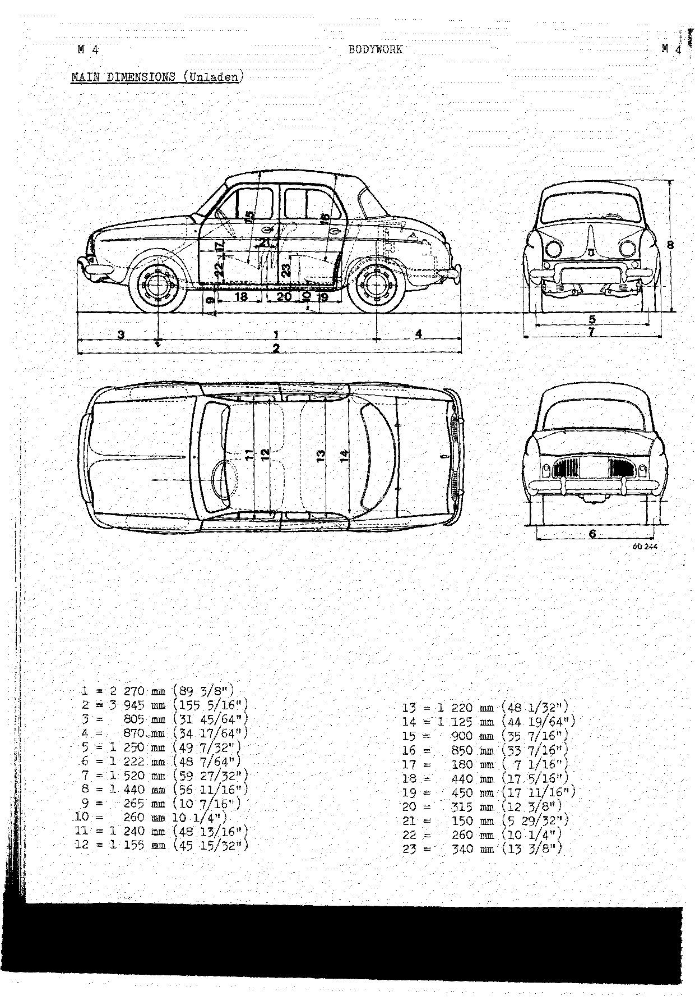

| Ref | Dimension | Ref | Dimension |
| --- | --------- | --- | --------- |
| 1 | 2 270 mm (89 3/8") | 13 | 1 220 mm (48 1/32") |
| 2 | 3 945 mm (155 5/16") | 14 | 1 125 mm (44 19/64") |
| 3 | 805 mm (31 45/64") | 15 | 900 mm (35 7/16") |
| 4 | 870 mm (34 17/64") | 16 | 850 mm (33 7/16") |
| 5 | 1 250 mm (49 7/32") | 17 | 180 mm (7 1/16") |
| 6 | 1 222 mm (48 7/64") | 18 | 440 mm (17 5/16") |
| 7 | 1 520 mm (59 27/32") | 19 | 450 mm (17 11/16") |
| 8 | 1 440 mm (56 11/16") | 20 | 315 mm (12 3/8") |
| 9 | 265 mm (10 7/16") | 21 | 150 mm (5 29/32") |
| 10 | 260 mm (10 1/4") | 22 | 260 mm (10 1/4") |
| 11 | 1 240 mm (48 13/16") | 23 | 340 mm (13 3/8") |
| 12 | 1 155 mm (45 15/32") | | |

---

## Floor section

<!-- PDF p.357 · M-5 -->

### Floor section component parts

This section consists of an assembly of side members and cross members to which the floor panelling
is welded.

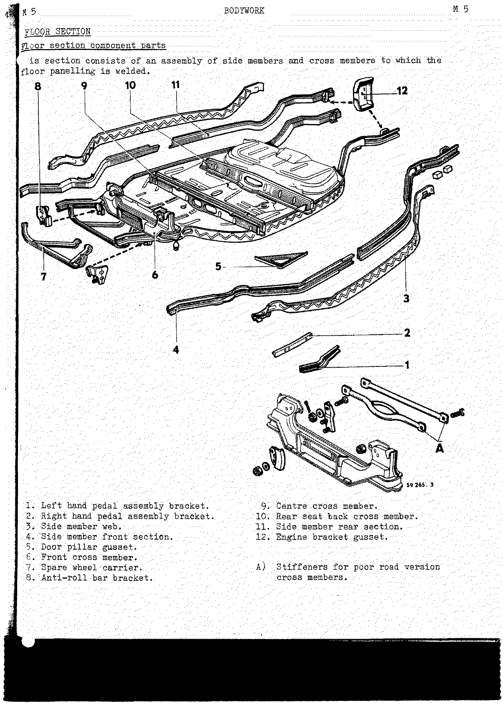

1. Left hand pedal assembly bracket.
2. Right hand pedal assembly bracket.
3. Side member web.
4. Side member front section.
5. Door pillar gusset.
6. Front cross member.
7. Spare wheel carrier.
8. Anti-roll-bar bracket.
9. Centre cross member.
10. Rear seat back cross member.
11. Side member rear section.
12. Engine bracket gusset.

> **A) Stiffeners** for poor road version cross members.

### Checking the floor section

<!-- PDF p.358 · M-6 -->

It is essential that any car that has been involved in an accident should be subjected to a check.
The following tools have been made available by RENAULT-SERVICE for the carrying out of this check:

1. Trammel gauge (Car. 27).
2. Checking gauge (Car. 15) (A).
3. Combination checking and repair jig bench (Car. 08.A).

This tooling permits one to check, with certainty, whether the body shell has suffered distortion
liable to affect the points at which the mechanical components are attached to the floor section.

> The diagnosis resulting from this check is important, it being the basis of all subsequent repair
> operations. None of the superstructure components should be replaced until one has ensured that the
> floor section side and cross members are in their correct positions.

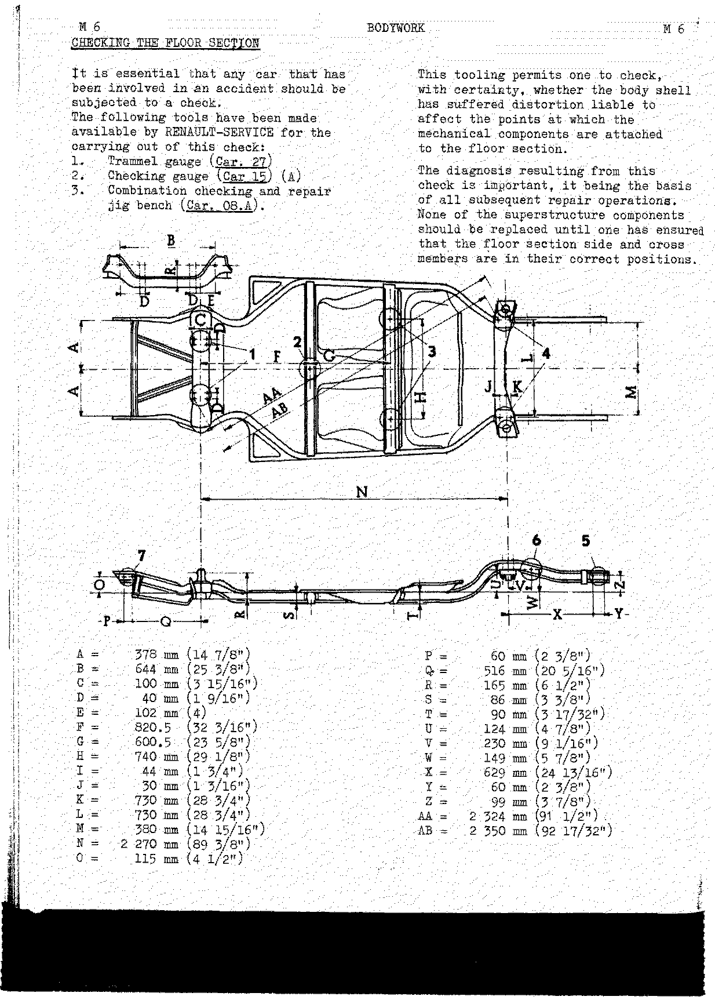

| Ref | Dimension | Ref | Dimension |
| --- | --------- | --- | --------- |
| A | 378 mm (14 7/8") | P | 60 mm (2 3/8") |
| B | 644 mm (25 3/8") | Q | 516 mm (20 5/16") |
| C | 100 mm (3 15/16") | R | 165 mm (6 1/2") |
| D | 40 mm (1 9/16") | S | 86 mm (3 3/8") |
| E | 102 mm (4) | T | 90 mm (3 17/32") |
| F | 820.5 (32 3/16") | U | 124 mm (4 7/8") |
| G | 600.5 (23 5/8") | V | 230 mm (9 1/16") |
| H | 740 mm (29 1/8") | W | 149 mm (5 7/8") |
| I | 44 mm (1 3/4") | X | 629 mm (24 13/16") |
| J | 30 mm (1 3/16") | Y | 60 mm (2 3/8") |
| K | 730 mm (28 3/4") | Z | 99 mm (3 7/8") |
| L | 730 mm (28 3/4") | AA | 2 324 mm (91 1/2") |
| M | 380 mm (14 15/16") | AB | 2 350 mm (92 17/32") |
| N | 2 270 mm (89 3/8") | | |
| O | 115 mm (4 1/2") | | |

#### Partial check with a trammel gauge

<!-- PDF p.359 · M-7 -->

Trammel gauge (Car. 27) permits one to carry out checks on the R. 1090 and derived versions without
removing any of the mechanical components. There are two distinctly separate sets of checking
operations:

1. Checking the centre part of the floor section and the position of the sheet steel components.
2. Checking the position of the mechanical components which form the front and rear axles, with
   respect to the floor section.

The trammel gauge consists of:

- A fixed portion (sleeve) (1).
- A sliding rule (2).
- A long pointer (3).
- A short pointer (4).

The sleeve (1) has a graduated scale on which are marked five lines. The centre graduation on the
scale, when aligned with the lines marked on the rule (2), gives the theoretical dimensions for the
various checks that are to be carried out. The lines marked on either side of this centre graduation
permit one to determine the differences in the dimensions.

The sliding rule (2) has a guide (shown in the inset) and this guide has a locking ball which locates
the pointer in one of the punch marks made in it. The various graduations on the rule represent
average dimensions obtained on new vehicles with the pointer placed in the position shown for each of
the checking operations.

> It is essential that the pointer should be placed in the correct position.

#### Checks carried out with the trammel gauge

<!-- PDF p.360 · M-8 -->

Trammel gauge Car. 27 permits one to carry out the following two distinctly separate sets of
operations without removing the mechanical components:

1. Checking the centre part of the floor section and the positions of the sheet steel components.
2. Checking the position of the mechanical components which form the front and rear axles with
   reference to the floor section.

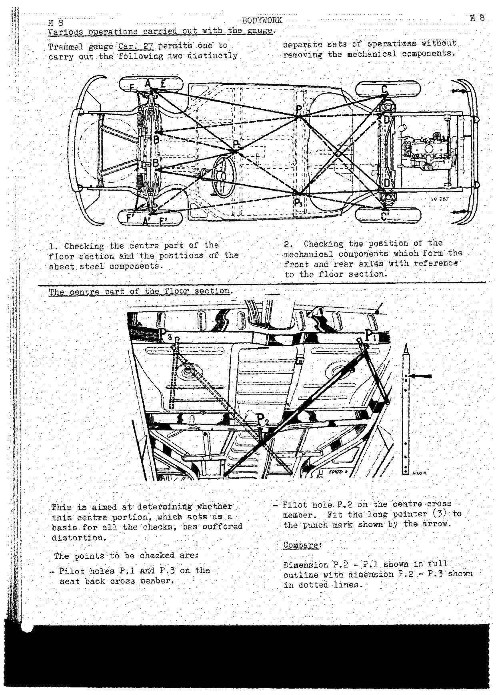

Each check compares two symmetrical dimensions (one shown in full outline, the other in dotted lines)
taken from the pilot holes **P.1** and **P.3** on the seat back cross member and **P.2** on the centre
cross member.

**The centre part of the floor section.** This is aimed at determining whether this centre portion,
which acts as a basis for all the checks, has suffered distortion. The points to be checked are pilot
holes P.1 and P.3 on the seat back cross member, and pilot hole P.2 on the centre cross member. Fit
the long pointer (3) to the punch mark shown by the arrow.

- Compare dimension **P.2 – P.1** (full outline) with dimension **P.2 – P.3** (dotted lines).

**Front axle.**

<!-- PDF p.361 · M-9 -->

The reference points are points **A** and **A'**, which are given by the centres of the right and left
hand stub axles, measured from pilot holes P.1, P.2 and P.3. Fit the short pointer (4) to the trammel
gauge at the punch mark shown by the arrow.

- Compare (1) dimension **P.2 – A** (full outline) with dimension **P.2 – A'** (dotted lines).
- Compare (2) dimension **P.1 – A** (full outline) with dimension **P.3 – A'** (dotted lines).

**Front cross member (with the front axle in position).**

<!-- PDF p.362 · M-10 -->

The reference points are points **B** and **B'**, which are the rear right and left hand bolt holes of
the front axle lower securing points, measured from pilot holes P.2, P.1 and P.3. Remove the two
bolts. Secure the long pointer (3) to the trammel gauge at the punch mark shown by the arrow.

- Compare (1) dimension **P.2 – B** (full outline) with dimension **P.2 – B'** (dotted lines).
- Compare (2) dimension **P.1 – B** (full outline) with dimension **P.3 – B'** (dotted lines).

**Front cross member (with the front axle removed).**

<!-- PDF p.363 · M-11 -->

The reference points are points **B** and **B'**, which are the holes in the cross member by means of
which the front axle is secured, measured from pilot holes P.1, P.2 and P.3. Secure the long pointer
(3) to the trammel gauge at the punch mark shown by the arrow.

- Compare (1) dimension **P.2 – B** (full outline) with dimension **P.2 – B'** (dotted lines).
- Compare (2) dimension **P.1 – B** (full outline) with dimension **P.3 – B'** (dotted lines).

**Rear axle.**

<!-- PDF p.364 · M-12 -->

> Owing to the movement of the half shaft tubes and the fact that the rear axle is secured to the
> floor by flexible mountings, this check merely gives an indication of its position. The clearance in
> the hinge points (of the half shaft in the universal joints) and the condition of the mounting
> rubbers prevent one from obtaining a fully reliable diagnosis in this way.

With these reservations, the trammel gauge can be used in the following way: the points to be checked
at **C** and **C'** are given by the left hand and right hand grease nipples at the ends of the half
shaft tubes, underneath them, measured from pilot holes P.1 and P.3. Secure the short pointer (4) at
the punch hole shown by the arrow.

- Compare (1) dimension **P.1 – C** (full outline) with dimension **P.3 – C'** (dotted lines).
- Compare (2) dimension **P.3 – C** (full outline) with dimension **P.1 – C'** (dotted lines).

Check the rear axle alignment by means of **T. Ar. 62** (see [Checking the rear axle alignment](#checking-the-rear-axle-alignment)).

**Rear suspension front cross member.**

<!-- PDF p.365 · M-13 -->

To check a car fitted with "aerostable" suspension, remove the air cushions. The reference points are
points **D** and **D'**, given by the centre lines of the front right and left hand bolts securing the
cross member to the side members, measured from pilot holes P.1 and P.3. Secure the long pointer (3)
to the punch mark shown by the full outline arrow.

- Compare (1) dimension **P.3 – D'** (full outline) with dimension **P.1 – D** (dotted lines).
- Compare (2) dimension **P.1 – D'** (full outline) with dimension **P.3 – D** (dotted lines).

The same check can be carried out on the cross member with the bolts removed by securing the pointer
at the punch mark shown by the shaded arrow. Check the rear suspension front cross member with the
rear axle removed using tool Sus. 11 A (see [Checking the rear suspension front cross member](#checking-the-rear-suspension-front-cross-member)).

**Positions of side members.**

<!-- PDF p.366 · M-14 -->

Reference points are points **D** and **D'**, which are the holes in the side members to which the
cross member is secured, measured from pilot holes P.1 and P.3. Secure the long pointer (3) to the
trammel gauge at the punch mark shown by the full outline arrow.

- Compare (1) dimension **P.3 – D'** (full outline) with dimension **P.1 – D** (dotted lines). <!-- NEEDS REVIEW: OCR read the first pilot hole here as "P.4"; the page image clearly shows "P.3" (only P.1/P.2/P.3 exist) — corrected from image. -->
- Compare (2) dimension **P.1 – D'** (full outline) with dimension **P.3 – D** (dotted lines).

Secure the pointer at the punch mark shown by the shaded arrow to measure the distance between the two
side members **D D'**.

### Combined checking and repair jig bench

<!-- PDF p.367 · M-15 -->

The jig bench has been designed to check and overhaul damaged bodywork components under the best
possible conditions.

The bench consists of:

- a base (Car 08 A) which is secured to the ground and which forms a horizontal surface;
- two sets of supports (Car. 1 A) comprising supports (3 ter, or 3 + 12), (5 bis), (11), (13), (14),
  (15), (5).

> It is to be noted that this set of supports is the same as for type R 1130 vehicles and derived
> versions.

Those repair shops which already have bracket No. 3, height 340 mm (13 3/8"), designed for the
R 1062, may use extensions No. 12 to obtain a height of 392.5 mm (15 7/16").

<!-- PDF p.368 · M-16 -->

1. **Checking** — this fixture can be compared in its essentials to the assembly fixtures used during
   manufacture. The bolts which secure the bodywork to the supports act as dowels. They must therefore
   all be fitted before the body can be considered as acceptable.
2. **Straightening** — it permits one to apply all the loads necessary for straightening damaged parts
   by applying tension or compression from a point inside the bench frame. These loads may be applied
   by ties or a hydraulic jack, but under no circumstances should the load be applied to the supports.

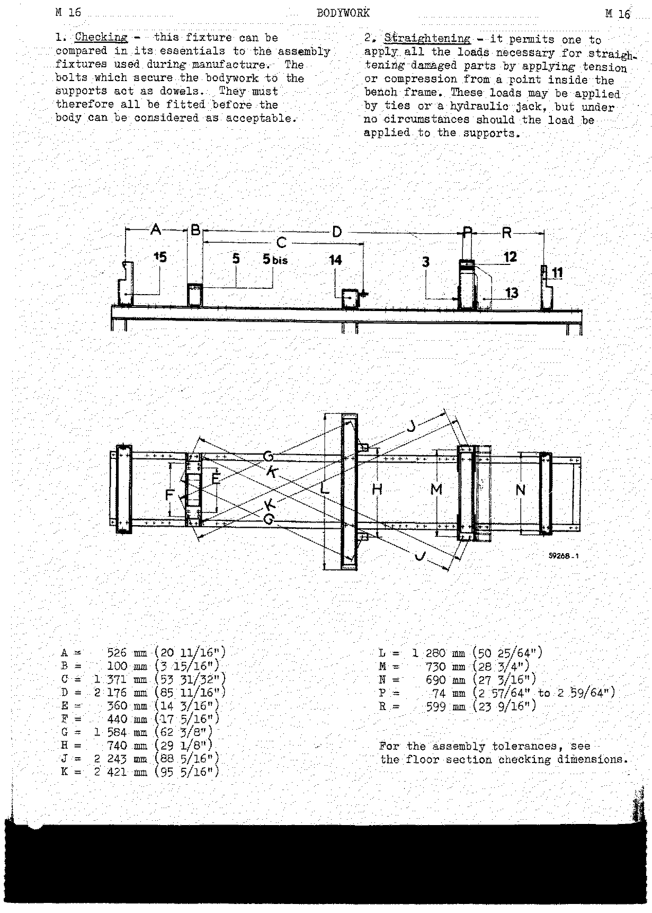

| Ref | Dimension | Ref | Dimension |
| --- | --------- | --- | --------- |
| A | 526 mm (20 11/16") | L | 1 280 mm (50 25/64") |
| B | 100 mm (3 15/16") | M | 730 mm (28 3/4") |
| C | 1 371 mm (53 31/32") | N | 690 mm (27 3/16") |
| D | 2 176 mm (85 11/16") | P | 74 mm (2 57/64" to 2 59/64") |
| E | 360 mm (14 3/16") | R | 599 mm (23 9/16") |
| F | 440 mm (17 5/16") | | |
| G | 1 584 mm (62 3/8") | | |
| H | 740 mm (29 1/8") | | |
| J | 2 243 mm (88 5/16") | | |
| K | 2 421 mm (95 5/16") | | |

> For the assembly tolerances, see the [floor section checking dimensions](#checking-the-floor-section).

#### Using the various supports

<!-- PDF p.369 · M-17 -->

**a) On a fully assembled car.** Fit the supports:

- (5 bis) locating on the front cross member.
- (14) locating on the pilot holes in the seat back cross member.
- (13) locating on the engine front cross member securing bolts.

**b) With the power unit assembly removed and the front axle assembly in position.** Fit the supports:

- (5 bis) locating on the front cross member.
- (14) locating on the pilot holes in the seat back cross member.
- (3 + 12 or 3 ter) locating on the gear box cross member securing holes.
- (11) locating on the rear side members.

<!-- PDF p.370 · M-18 -->

**c) With the power unit assembly in position and the front axle removed.** Fit the supports:

- (15) locating on the front side members.
- (5) locating on the front cross member.
- (14) locating on the pilot holes in the seat back cross member.
- (13) locating on the front cross member securing bolts.

**d) Stripped body shell.** Fit the supports:

- (15) locating on the front side members.
- (5) locating on the front cross member.
- (14) locating on the pilot holes in the seat back cross member.
- (3 + 12 or 3 ter) locating on the gear box cross member securing holes.
- (11) locating on the rear side members.

<!-- PDF p.371 · M-19 -->

**Straightening the rear side members with a hydraulic jack.** Place support (Car. 51) locally and
secure it behind support No. 3 so as to straighten the side members without any risk of moving the
supports out of position.

**Dowelling the supports.** Each support is marked with its number and should be dowelled in place
(taper pin or 8 mm dowel (5/16")) to the base after adjusting the position with a new body shell.

**Points at which the supports locate on the floor section:**

- Support No. 3 + No. 12 or No. 3 ter — locating on the rear side members at the holes which secure
  the power unit assembly cross member.
- Support No. 11 — locating on the rear side members at the bumper bracket strip front securing holes.

<!-- PDF p.372 · M-20 -->

- Support No. 5 bis — locating on the front cross member (with the front axle still in position) by
  the inner front suspension bearing bracket securing holes (with the securing bolts and the castor
  angle cams removed).
- Support No. 5 — locating on the front cross member by the outer front suspension bearing securing
  holes.
- Support No. 13 A — locating on the rear of the car at the engine cross member securing bolts, after
  replacing the original bolts by bolts 120 mm (4 3/4") long. To position the car, disconnect the
  brake lines, remove the silencer, the upper half shaft tube stops and the two straps.
- Support No. 14 — locating on the centre part of the floor section at the pilot holes in the seat
  back cross member. The width of this support is equal to the distance between the side members.

<!-- PDF p.373 · M-21 -->

- Support No. 15 — locating on the front side members at the bumper bracket strip front securing
  holes.

### Checking gauges

#### For the front side members (Car. 18)

<!-- PDF p.373 · M-21 -->

**Installing the jig bench.** Allow a working area of 28 – 30 sq. metres (302 – 324 sq. ft.). It is
preferable to install a hoist rail above the longitudinal centre line of the bench for lifting
purposes.

| Ref | Dimension |
| --- | --------- |
| A | 1.7 m (67") |
| B | 0.6 m (23 5/8") |
| C | 1.6 m (63") |
| D | 3.9 m (153 1/2") |

Outer dimensions of vehicle:

| Ref | Vehicle |
| --- | ------- |
| E | 4 CV – R. 1120 |
| F | Dauphine, R. 1092, R. 1130, R. 1131 |
| G | Frégate, Estafette |

This gauge (Car. 18) permits one to check and recondition the front part of the side members, from
the front cross member onwards. The basis of the check is the front axle lower hinge bearing securing
holes. The bumper bracket strip securing holes must be in line with the holes in the plates on the
ends of the gauge.

#### For the rear side members (Car. 19)

<!-- PDF p.374 · M-22 -->

This gauge permits one to check and recondition the rear part of the side members from the rear
suspension front cross member securing holes onwards. The rear bumper bracket strip securing holes
must correspond with the holes in the end plates.

#### Gauge for fitting the cowl sides (Car. 29)

<!-- PDF p.374 · M-22 -->

This gauge is to be fitted to the jig bench and permits one to install:

1. One or both cowl sides, if they have to be replaced.
2. The front end panel.

The jig is secured by bolts and the locating stud at the end of the bench. Two jig bushes provide the
pins which enter the wing (fender) securing holes in the wheel arches. Using this as a basis, the boot
(trunk) lid is thus located during fitting.

### Lifting the car

<!-- PDF p.375 · M-23 -->

There are two ways of lifting the car to place it on the jig bench.

1. **Using adaptable lift (Car. 34) and collapsible frame (Car. 36).** The frame takes the load in the
   floor section side members. The vehicle is balanced by moving the main links on the sling rings.
2. **Using lifting sling (Car. 14 A).** Engage the hoist hook in the lifting ring on the sling, with
   the arms hanging free from the frame movable hooks. To lift the vehicle, slide the arms (together
   with their protective rubbers) into the front and rear door frames, and secure them in place by
   means of the safety cables.

---

## Checking and replacing the front cross member

<!-- PDF p.376 · M-24 -->

### Checking the front cross member upper hinge pin bores

After removing the two front half axles (with the vehicle on trestles) check the position of each of
the upper hinge pins with gauge (Car. 15 A). Position the gauge from the front of the vehicle. It is
secured by two of the hinge bearing securing bolts. Check with the pin which slides in the sleeve. It
should enter the two upper bearings. The clearance between the diameter of the pin and the inside
diameter of the bearing hole is the acceptable tolerance within which repair is not necessary.

### Identifying and checking removable steering mechanism brackets

Check dimensions:

| Ref | Dimension |
| --- | --------- |
| C | 80°40' |
| D | 2.5 mm (.098") |

**Checking the welded steering mechanism bracket.** Check that the bracket secured to the cross member
is flat, using a straight edge, and that dimensions **X = 26.5 mm (1 1/32")** and **Y = 23°**.

### Identification and interchangeability of front cross members

<!-- PDF p.377 · M-25 -->

Two types of cross member are supplied as spare parts.

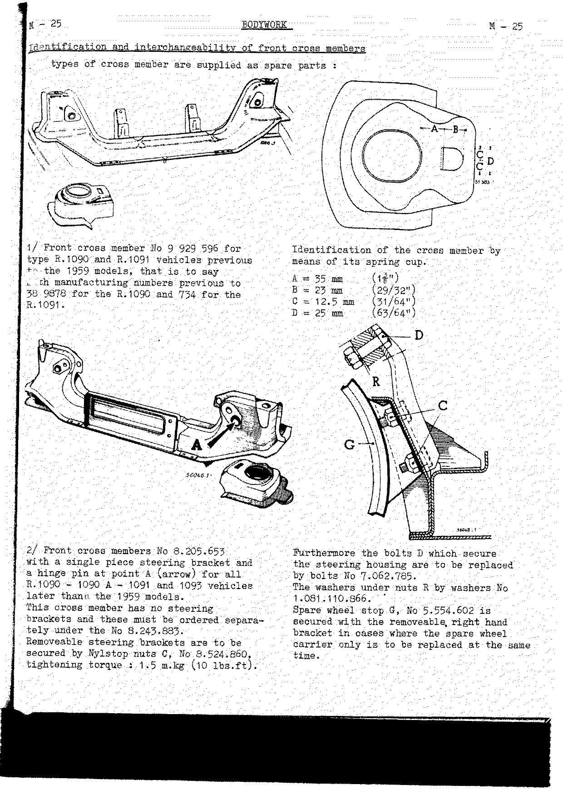

**1/ Front cross member No 9 929 596** for type R.1090 and R.1091 vehicles previous to the 1959
models, that is to say with manufacturing numbers previous to 38 9878 for the R.1090 and 734 for the
R.1091. <!-- NEEDS REVIEW: "38 9878" is transcribed exactly as printed; the same number appears on M-26 (p.378) as "389.878". -->

Identification of the cross member by means of its spring cup:

| Ref | Dimension |
| --- | --------- |
| A | 35 mm (1 3/8") |
| B | 23 mm (29/32") |
| C | 12.5 mm (31/64") |
| D | 25 mm (63/64") |

**2/ Front cross members No 8.205.653** with a single piece steering bracket and a hinge pin at point
A (arrow) for all R.1090 – 1090 A – 1091 and 1093 vehicles later than the 1959 models. This cross
member has no steering brackets and these must be ordered separately under the No 8.243.883. Removeable
steering brackets are to be secured by Nylstop nuts C, No 8.524.860, **tightening torque: 1.5 m.kg
(10 lbs.ft)**.

Furthermore the bolts D which secure the steering housing are to be replaced by bolts No 7.062.785.
The washers under nuts R by washers No 1.081.110.866. Spare wheel stop G, No 5.554.602, is secured
with the removeable right hand bracket in cases where the spare wheel carrier only is to be replaced at
the same time.

<!-- PDF p.378 · M-26 -->

Identifying the spring cup of cross members which have a single piece steering bracket:

| Ref | Dimension |
| --- | --------- |
| E | 35 mm (1 3/8") |
| F | 11 mm (7/16") |
| G | 5 mm (13/64") |
| D | 25 mm (63/64") |

#### Fitting instructions

1. Cross member No 9.929.596 is only fitted to the vehicles stated above.

   > **NOTE:** For right hand drive type R.1090 vehicles, up to No 401.730, one must, besides
   > replacing the accelerator pedal, apply the contents of note RS 1215 concerning replacing the
   > carburettor return spring, and this involves ordering one spring n° 6.063.153 and one clip
   > No 6.064.362.

2. Fitting cross member No 8.205.653 or replacing the bodywork on type R.1090 vehicles, between
   No 389.878 and 763.067, and R.1091 vehicles between 734 and 8.439:

   - **a)** Order and fit two additional spring cups numbers 5.552.131. These spring cups are welded
     in place by means of arc welded stitches inside each spring cup in order to locate suspension
     springs with an outside diameter of **104 mm (4 3/32")**.
   - **b)** Order stop No 6.070.324 for left hand drive vehicles to replace the clutch pedal stop J in
     order to permit the pedals to move through the correct travel, in view of the fact that the overall
     dimensions of the cross member upper components are increased in size. Before refitting the front
     axle, remove the existing pedal stop whilst retaining rubber washer H. Slit the stop grommet J
     No 6.070.324 radially and insert it into the toe-board by following the sketch, with the slit
     facing towards the outside of the car.

<!-- PDF p.379 · M-27 -->

For the accelerator control (M), order **either**:

| Part | No. | Application |
| ---- | --- | ----------- |
| 1 accelerator pedal | 9.842.292 | R.1090 up to 1.178 371 and R.1091 up to 24.598 |
| 1 accelerator pedal rod | 8.238.879 | R.1090 between 1.178.372 and 1.270.377, and R.1091 between 24.599 and 27.393 |
| 1 accelerator pedal rod | 9.842.293 | type R.1092 up to 22.770 |
| 1 accelerator pedal rod | 8.238.878 | R.1092 between 22.771 and 35.869 |

For right hand drive vehicles the fitting of this cross member with a single piece steering bracket
involves replacing the brake pedal stop grommet J, the accelerator pedal M and the fitting of a spacer
L under the accelerator casing. Order:

- 1 brake pedal stop grommet J No. 6.070.324
- 1 accelerator casing spacer L No. 5.554.563
- 2 casing bolts K No. 1.023.060.506

> **NOTE:** To make fitting spacer L under the accelerator pedal easier, slightly bend the scuttle
> panelling.

### Replacing the cross member

<!-- PDF p.379 · M-27 -->

**Removing the cross member:** Chisel free the pedal support welds (A), the spare wheel carrier welds
(B) and the cross member upper sheet welds on the side member at (C) in order to lift them. Flame cut
the cross member at both ends flush with the side members, so that it falls out.

<!-- PDF p.380 · M-28 -->

It now remains to free the spot welds connecting each cup to the side member. To do this:

1. Centre punch each of the welding spots of the vertical face of the cup at (D) and the four spots on
   the lower face at (E).
2. Drill a pilot hole in each spot with a **3 mm (7/64") diameter** drill (a). (Do not drill all the
   way through.)
3. Spot face each welding spot with an **8 mm (5/16") diameter** flat bottomed drill, taking care not
   to cut into the side member.
4. Pull the cup backwards and forwards a number of times with a pair of pliers in order to remove it.

**Refitting the cross member:** The spare parts stores supply the cross member in two parts in order to
make fitting it easier. These are:

- The actual cross member (3) to which one spring cup is already assembled.
- An inner spring cup (4).

1. Drill 5 holes (F) **12 mm (15/32")** in diameter in the inner face of the cup which is assembled to
   the cross member. Also drill 5 holes (F) in the separate cup, plus 2 holes in the bottom (H) and 2
   holes on either side at (J).
2. Open the two right and left hand end spot welds on the web (G), at the end of the cross member which
   has no inner cup, and fold down the web to permit the fitting of the cup.
3. Insert the cross member from below, correctly position it on the car centre line using gauge
   (Car. 27), and clamp it in position with clamps.
4. Secure the upper faces of the cross member to the side members with arc-welded stitches.
5. Insert the separate spring cup (4), secure it with two clamps, and knock down the cross member web.
   In each of the 12 mm (15/32") holes (F, H, J), which have previously been drilled, make an arc plug
   weld.
6. Butt joint the inner faces of each cup to the side members at point (M), and the points where the
   cup joins the side member at (L) and (N), as well as making joins between the cup and the side
   member at (R).
7. Weld in place the pedal support members and the spare wheel carrier.

---

## Replacing the side members

<!-- PDF p.381 · M-29 -->

> It is forbidden to heat any part of the side members in order to straighten them. Such heating would
> cause a reduction in the mechanical strength and the elasticity of the metal.

**Welding.** After determining the damaged portion which is to be replaced at the points marked (A),
(a), (c):

1. Free the panelling welded to the member and cut out the portion which is to be replaced.
2. Carefully adjust the new portion (6) to fit that part of the side member remaining in place (8).
3. Make a stiffener (7) from **1.5 mm (1/16")** sheet steel:
   - length L + L = **200 mm (7 7/8")**
   - depth E = **47 mm (1 27/32")**
   - width F = **35 mm (1 3/8")**
4. Insert this stiffener by a length **L = 100 mm (3 15/16")** into the new section (6) and spot weld
   it in place.
5. Insert the new section into the original side member, clamp it and spot weld it in position. Join
   the two side member sections by gas welding.

Do not omit, before fitting the cowl side, to weld the wheel arch, the body side and the side member
web in position, which are to be gas welded to the section.

### Side member identification and interchangeability

<!-- PDF p.382 · M-30 -->

For R.1090 vehicles up to 427.098 and R.1091 vehicles up to 733.

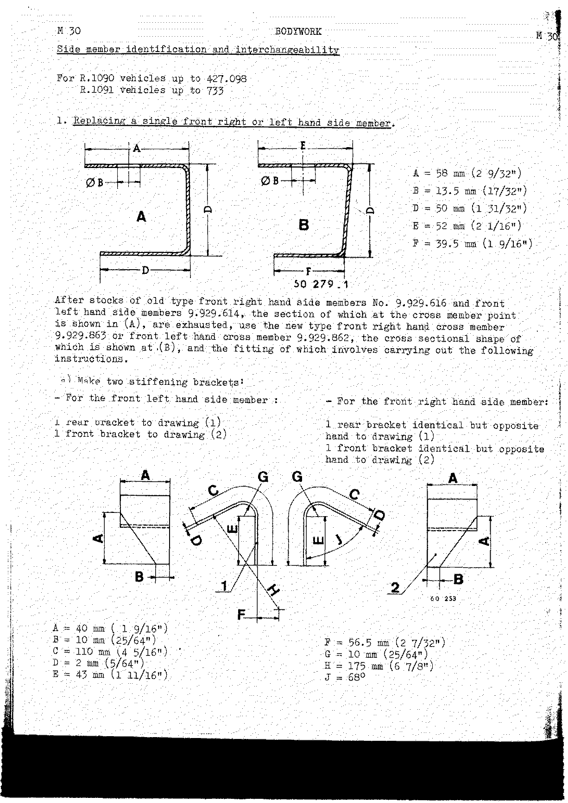

**1. Replacing a single front right or left hand side member.**

Side member section dimensions:

| Ref | Dimension |
| --- | --------- |
| A | 58 mm (2 9/32") |
| B | 13.5 mm (17/32") |
| D | 50 mm (1 31/32") |
| E | 52 mm (2 1/16") |
| F | 39.5 mm (1 9/16") |

After stocks of old type front right hand side members No. 9.929.616 and front left hand side members
9.929.614 — the section of which at the cross member point is shown in (A) — are exhausted, use the
new type front right hand side member 9.929.863 or front left hand side member 9.929.862, the cross
sectional shape of which is shown at (B), and the fitting of which involves carrying out the following
instructions. <!-- NEEDS REVIEW: the source prints "cross member" for the new-type 9.929.863 / 9.929.862 parts; from context these are side members (this section is "side member identification"). Transcribed as the parts they identify (side members). -->

**a) Make two stiffening brackets:**

- For the front left hand side member: 1 rear bracket to drawing (1), 1 front bracket to drawing (2).
- For the front right hand side member: 1 rear bracket identical but opposite hand to drawing (1),
  1 front bracket identical but opposite hand to drawing (2).

Bracket dimensions:

| Ref | Dimension | Ref | Dimension |
| --- | --------- | --- | --------- |
| A | 40 mm (1 9/16") | F | 56.5 mm (2 7/32") |
| B | 10 mm (25/64") | G | 10 mm (25/64") |
| C | 110 mm (4 5/16") | H | 175 mm (6 7/8") |
| D | 2 mm (5/64") | J | 68° |
| E | 43 mm (1 11/16") | | |

<!-- PDF p.383 · M-31 -->

**b)** Before fitting the side member to the cross member, drill two holes **12 mm (15/32")** in
diameter at the top of the cups with a between-centres dimension **K = 85 mm (3 11/32")**. These two
holes permit one to make plug welds between the cup and the side member using arc welding equipment.

**c)** Fit the side member and fit the brackets, clamp them to the spring cup and the inner face of the
side member.

- Weld brackets (1) and (2) to the cup and the side member by means of arc welded fillets.
- Fasten the cup to the side member at (3) by means of arc plug welds.
- Weld the cup to the side member normally at (4) and the cross member to the upper face of the side
  member.

**2. Replacing a single side and a cross member.** Use front cross member No. 9.929.596 and the new
side member, the adaptation of which to the cross member will involve making the two corresponding
brackets (1) and (2). See [Make two stiffening brackets](#side-member-identification-and-interchangeability).

**3. Replacing both front side members and the front cross member, or replacing the body shell.** The
same instructions are to be followed as for the vehicles described on page 26 (see
[Fitting instructions](#fitting-instructions)), but in addition order:

- 1 spacer No. 6.063.289.
- 2 lower shock absorber attachment points No. 5.550.124.
- 2 additional spring cups No. 5.552.131.

Then:

- **a)** Weld the two additional spring cups No. 5.552.131 inside the cross member cups.
- **b)** Fitting a cross member of the new type makes it **essential** to replace the old type front
  shock absorber lower attachment point No. 5.552.185 by an attachment of the new type No. 5.550.124.
- **c)** In cases where this repair has not involved replacing the toe-board nor the steering bracket,
  one must:
  - elongate the steering column clearance hole by **2.5 mm (1")** in a downward direction, <!-- NEEDS REVIEW: source misprint, not OCR — the page image shows "2.5 mm (1")", but 2.5 mm ≈ 3/32", not 1". The fractional-inch value does not reconcile with the metric. Kept exactly as printed. -->
  - insert a spacer No. 6.063.289 between the steering column bracket and the dashboard.

---

## Replacing the engine front cross member

<!-- PDF p.384 · M-32 -->

The Spare Parts Stores supplies only one stiffened engine front cross member No. 8.205.654, which has
two scollops on the cross member body.

> **NOTE:** Engine front cross member No. 8.205.654 which do not have the scollops are to be reserved
> for vehicles not fitted with radiator blinds.

When replacing this cross member on vehicles previous to the 1960 models (with conventional
suspension), order, for R.1090 – R.1091:

- 1 stiffened engine front cross member No. 8.205.654
- 2 straps (3) No. 5.552.407
- 8 washers (2) No. 6.068.702
- 4 Nylstop nuts (1) No. 8.524.860
- 4 bolts (4) No. 1061 080.256

**Instructions for repairing:**

- **a)** Replace the rod type travel stop by a new strap type stop, keeping the override pad (5) in the
  new arrangement. Ensure that the support does not make contact with the stiffening on strap support
  (6).
- **b)** The cross members are supplied without their two rear brake pipe clips (left hand side). You
  will therefore have to make a brake pipe retaining clip (7) from **0.7 mm (1/32")** sheet steel. Its
  developed length is **70 mm (2 3/4")**, and it is to be fitted as shown in the drawing.
- **c)** When fitting a stiffened cross member without scollops (X) on a vehicle which has no radiator
  blind, cut off the two securing lugs welded to the lower radiator casing in order to eliminate these
  projections from the lower part of the radiator.

Retaining clip (7) dimensions:

| Ref | Dimension | Ref | Dimension |
| --- | --------- | --- | --------- |
| A | 28 mm (1 3/32") | E | 40 mm (1 9/16") |
| B | 14 mm (35/64") | G | 8 mm (5/16") |
| C | 7 mm (9/32") | Diameter F | 8.5 mm (11/32") |
| D | 10 mm (25/64") | | |

### Checking the rear suspension front cross member

<!-- PDF p.385 · M-33 -->

Checking the already removed rear suspension front cross member using gauge Sus. 11 A.

**Modifying Sus. 11 A.** The gauge has been modified as shown in the sketch to permit the aerostable
suspension cushion to be applied to the rules.

| Ref | Dimension |
| --- | --------- |
| A | 6 mm (15/64") |
| B | 15 mm (19/32") |
| C | 10 mm (25/64") |

### Checking the rear axle alignment

<!-- PDF p.386 · M-34 -->

The half shaft tube / gear box (transmission case) alignment can be checked using gauge **T. Ar. 62**.
This operation is to be carried out on a car lift or on trestles.

1. Remove the two lower universal joint shell securing nuts (shown by the arrows).
2. Fit the gauge, pressed well against the sides.
3. The two pointers align with the grease nipples.

---

## Body components

<!-- PDF p.387 · M-35 -->

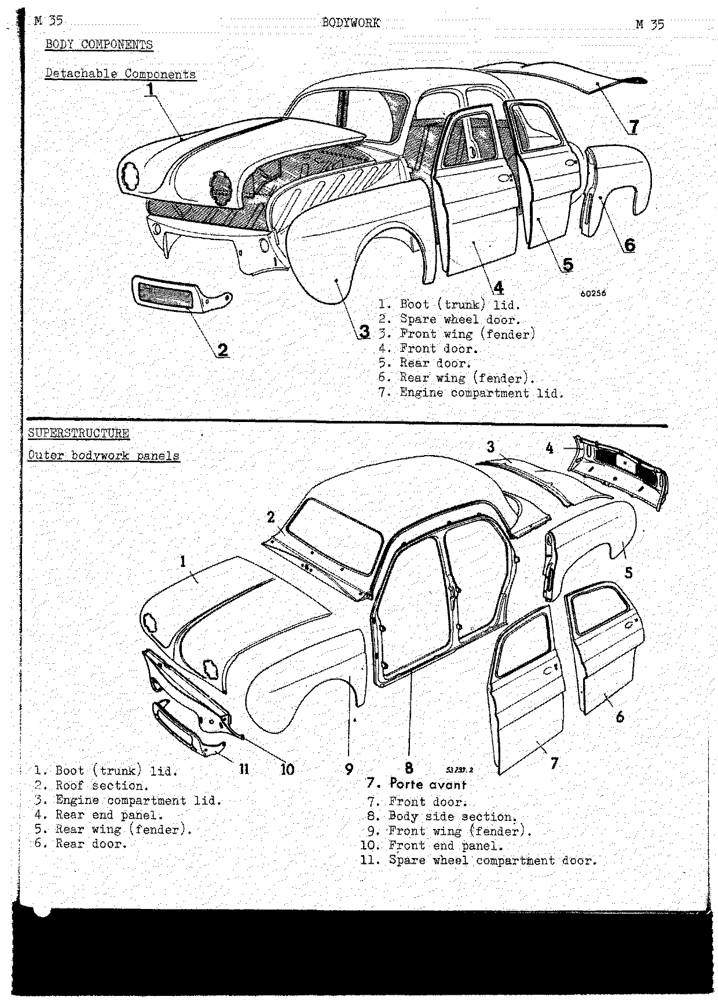

### Detachable components

1. Boot (trunk) lid.
2. Spare wheel door.
3. Front wing (fender).
4. Front door.
5. Rear door.
6. Rear wing (fender).
7. Engine compartment lid.

### Superstructure — outer bodywork panels

1. Boot (trunk) lid.
2. Roof section.
3. Engine compartment lid.
4. Rear end panel.
5. Rear wing (fender).
6. Rear door.
7. Front door.
8. Body side section.
9. Front wing (fender).
10. Front end panel.
11. Spare wheel compartment door.

### Inner bodywork panels

<!-- PDF p.388 · M-36 -->

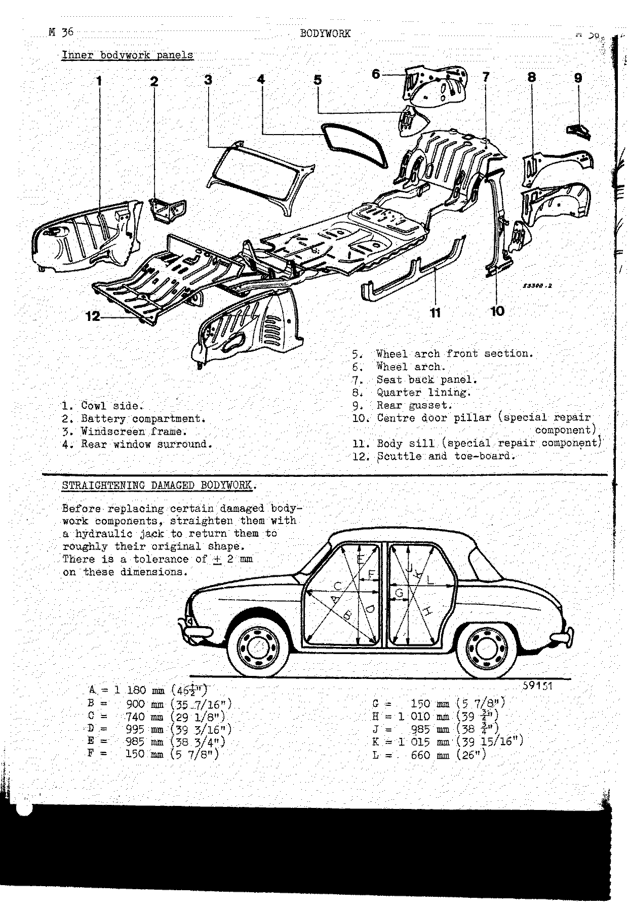

1. Cowl side.
2. Battery compartment.
3. Windscreen frame.
4. Rear window surround.
5. Wheel arch front section.
6. Wheel arch.
7. Seat back panel.
8. Quarter lining.
9. Rear gusset.
10. Centre door pillar (special repair component).
11. Body sill (special repair component).
12. Scuttle and toe-board.

---

## Straightening damaged bodywork

<!-- PDF p.388 · M-36 -->

Before replacing certain damaged bodywork components, straighten them with a hydraulic jack to return
them to roughly their original shape. There is a tolerance of **± 2 mm** on these dimensions.

| Ref | Dimension | Ref | Dimension |
| --- | --------- | --- | --------- |
| A | 1 180 mm (46 1/2") | G | 150 mm (5 7/8") |
| B | 900 mm (35 7/16") | H | 1 010 mm (39 3/4") |
| C | 740 mm (29 1/8") | J | 985 mm (38 3/4") |
| D | 995 mm (39 3/16") | K | 1 015 mm (39 15/16") |
| E | 985 mm (38 3/4") | L | 660 mm (26") |
| F | 150 mm (5 7/8") | | |

<!-- PDF p.389 · M-37 -->

Nine hardwood chocks exactly fit the curvature of the body sides and permit straightening and
reconditioning of damaged components on the door surrounds by means of a hydraulic jack. Each chock of
the set — 2-3-4-5-6-7-8-9 — can be used on both the right and left hand sides in the positions shown
in heavy outline in the illustration. Chocks 3-4-9 can also be used in the positions shown in dotted,
shaded outline. Chock (1) is placed against the scuttle inside the boot (trunk) to permit load
application by means of a jack, for straightening components at the front of the body.

## Replacing component parts

<!-- PDF p.389 · M-37 -->

If the parts are only slightly distorted, use conventional panel beating tooling: a hand slipper, a
dolly, a planishing hammer, a mallet or a sheet metal worker's hammer, etc., together with a hydraulic
press and ties. Free the spot welds by first drilling them with a 2–3 mm (5/64" – 1/8") hole, then
spot facing them with a flat bottomed drill. The component remaining in place must be in good condition
to permit an effective welding operation, with all the holes plugged with gas weld, the panels
flattened and carefully stripped back (without any trace of paint or primer).

**Replacing component parts.** Cut out the sections at the joints used during production or designed
for repair operations (as on components supplied by the Spares Stores). To do this, use tin-snips, a
hacksaw, an electric or pneumatic nibbler, or a flame torch.

**Fitting the new components.** Clamp them in place by means of clamps or quick-acting grips
(reference 12.222).

---

## Electric spot welding

<!-- PDF p.390 · M-38 -->

**Instructions for using the spot welding gun.** The various adjustments to be made should be carried
out very carefully in order to obtain a good quality weld. These adjustments concern:

- Electrode holders.
- The welding gun itself (the length of the pressure and fusion periods).
- The electrode holders and electrodes.

**Electrode holders.** Select the correct electrode holders for the job — whether straight, angled or
cranked — and as short as possible in order to avoid reducing the pressure and increasing the voltage
drop across the electrodes. After fitting, see that the electrode holders are parallel.

**Chamfer.** Diameter D of each electrode is determined to suit the thickness of the panelling (E) with
which it makes contact. That is to say: **D = 2e + 3 mm (1/8")**. To prevent rapid fouling of the
electrode it is standard sheet metal practice to chamfer the end at **120°**. This chamfer is made with
a file, the electrode being held in the chuck of a sensitive drill or a centre lathe.

**Electrodes.** The electrodes to be used are made from a copper alloy which is pressure and
temperature resistant (do not use electrodes made from straight copper, as these are less efficient).
Various types of electrodes can be fitted to the holders (cylindrical, eccentric, angled, round ended,
flatted or universal). The electrodes should be operating absolutely parallel to form a correct spot.
Check on the alignment and parallelism of their operating faces to avoid blow outs, cracking or
porosity.

<!-- PDF p.391 · M-39 -->

**Adjusting the gun — Pressure.** This must be the maximum possible so as to press the panels firmly
together at the point chosen for the weld. This is done by adjusting the knurled nut and then trying
the pressure at the handle.

**Time of fusion.** Adjust this at the timing box following the instructions provided with the gun.

> **NOTE:** After the welding current has been cut off the pressure must still be held whilst the spot
> cools, in order to forge the 2 panels together (do not release the control whilst the edge of the
> spot is still red).

**Welding — weld pitch.** Weld at the required pitch (the distance between the respective spots):

- **A = 25 mm (1")** minimum for panelling 1 mm (.040") thick.
- Less for thinner sheeting.
- More for thicker sheeting.

If the pitch is too small some of the welding current will flow through the adjoining weld, resulting
in a reduction in the amperage at the spot in the course of being made. Likewise the distance between
the edge of the panel and the centre of the spot should be **d = the diameter of the spot**. This is
necessary to obtain spots of good quality (good tensile strength) and to avoid blowing out.

**Checking the adjustment.** Carry out a test by means of 2 or 3 spots made on a test piece of sheets
of the same thickness as those to be welded. Test the weld in tension (avoid applying torsion). When
they fail there should be a hole in one of the pieces of sheet. Correct the adjustment in the light of
the results obtained from this test.

**Special case.** If the weld spots must be invisible after painting, use a full diameter or universal
ended electrode on the side concerned, or put a strip of copper between the panelling and the
electrode.

> **NOTE:** If in the course of operation the electrodes heat up: if the heating is mild, plunge the
> electrodes in water. If the heating is more noticeable, let them cool off, to avoid conducting the
> heat back to the transformer and damaging it.

### Double spot welding

<!-- PDF p.392 · M-40 -->

Follow the manufacturers' instructions as to the capacity of the gun. When welding thin, flexible
panelling, back up the joint with a block (preferably a copper one) or a jack to avoid distortion of
the panels to be welded.

The instructions for selecting electrodes, chamfering, adjusting and testing are identical to those
for the standard welding gun.

### Using the spot welding gun

<!-- PDF p.392 · M-40 -->

The assembly drawing shows the various methods of using the spot welding gun. The numbered joints
(1–84) are catalogued below and their cross sections are shown on M-47 to M-51 (PDF p.399–403).

> **NOTE:** For the cowl side fitting gauge, see [Gauge for fitting the cowl sides (Car. 29)](#gauge-for-fitting-the-cowl-sides-car-29).

Weld joints (using the spot welding gun):

1. Scuttle to roof section.
2. Cowl side to battery compartment.
3. Scuttle to cowl side.
4. Front end panel to scuttle.

<!-- PDF p.393 · M-41 -->

5. Cowl side to roof section.
6. Cowl side to front door pillar.
7. Cowl side to floor panel.
8. Cowl side to front end panel.

<!-- PDF p.394 · M-42 -->

9. Body side stiffener to seat back partition (electrodes ARO 100-101).
10. Body side to roof section.
11. Seat back partition to rear door pillar stiffening.
12. Body side to seat back partition.

<!-- PDF p.395 · M-43 -->

12. Body side stiffening to rear door pillar. <!-- NEEDS REVIEW: item "12" is printed twice in the source (once on M-42, once here on M-43); transcribed as printed. -->
14. Side members to body side.
15. Windscreen frame stiffening to roof section.
16. Bottom of wheel arch to roof section.

<!-- PDF p.396 · M-44 · figures only -->
<!-- PDF p.397 · M-45 -->

17. Seat back partition to quarter lining.
18. Seat back partition to tonneau panel.
19. Wheel arch to quarter lining.
20. Rear end panel to rear gusset.
21. Rear end panel to bottom of wheel arch.
22. Wheel arch to side member.
23. Side member web to side member.
24. Wheel arch to tonneau panel.

<!-- PDF p.398 · M-46 -->

25. Side member to front end panel.
26. Spare wheel carrier to side member.
27. Spare wheel carrier to front cross member.
28. Scuttle to floor section.

### Cross sections showing the component assembly points

<!-- PDF p.399 · M-47 -->

Sections of parts numbered 1–28 in the illustrations on the preceding pages. (Cross-section figures
appear on PDF p.399–403 / printed M-47 to M-51.)

The following numbered components appear in the cross-section figures:

<!-- PDF p.399–400 · M-47–M-48 -->

1. Scuttle
2. Roof section
3. Windscreen frame
4. Cowl side
5. Battery compartment
6. Cowl side
7. Scuttle
8. Front end panel
9. Connecting cross member
10. Scuttle
11. Body side
12. Cowl side
13. Roof section
14. Cowl side
15. Stiffening
16. Body side
17. Cowl side
18. Front door pillar gusset
19. Floor panel
20. Cowl side
21. Front end panel
22. Quarter panel lining
23. Seat back partition
24. Roof section
25. Tonneau panel
26. Bottom of wheel arch
27. Roof section
28. Drip moulding
29. Body side

<!-- PDF p.401 · M-49 -->

30. Stiffening
31. Seat back partition
32. Body side
33. Tonneau panel
34. Body side
35. Seat back partition
36. Seat back partition
37. Body side
38. Rear wing panel
39. Side member web
40. Body side
41. Floor panel
42. Side member
43. Roof section
44. Windscreen frame
45. Quarter lining
46. Seat back partition
47. Bottom of wheel arch
48. Tonneau panel
49. Roof section

<!-- PDF p.402 · M-50 -->

50. Rear window surround
51. Seat back partition
52. Bottom of wheel arch
53. Quarter lining
54. Tonneau panel
55. Rear window surround
56. Seat back partition
57. Tonneau panel
58. Quarter lining
59. Bottom of wheel arch
60. Rear gusset
61. Rear end panel
62. Bottom of wheel arch
63. Rear end panel
64. Bottom of wheel arch
65. Side member

<!-- PDF p.403 · M-51 -->

66. Bottom of wheel arch
67. Side member web
68. Raised stiffening
69. Side member
70. Quarter lining
71. Seat back partition
72. Bottom of wheel arch
73. Tonneau panel
74. Roof section
75. Side member
76. Side member to front end panel connecting face
77. Side member
78. Spare wheel carrier
79. Cowl side
80. Spare wheel carrier
81. Front cross member
82. Scuttle
83. Toe-board
84. Front floor panel

---

## Door and lid clearance arrangement drawing

<!-- PDF p.404 · M-52 -->

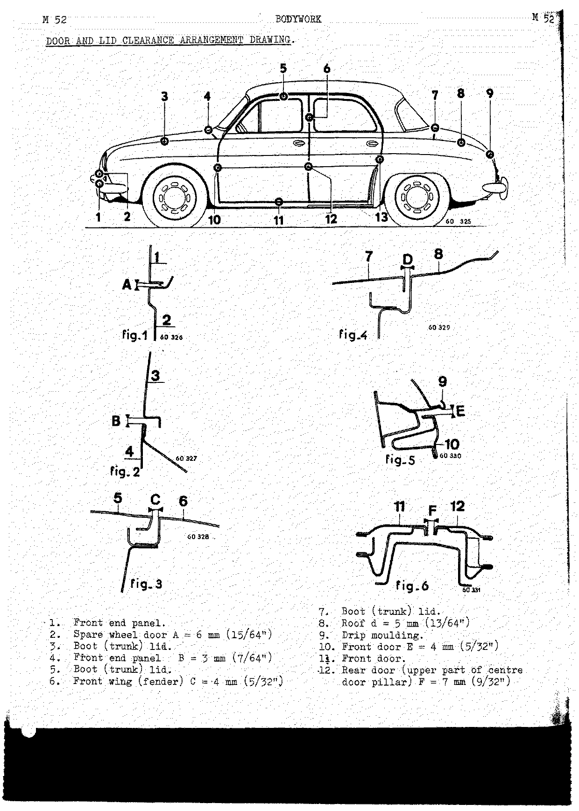

| Item | Component | Clearance |
| ---- | --------- | --------- |
| 2 | Spare wheel door | A = 6 mm (15/64") |
| 4 | Front end panel | B = 3 mm (7/64") |
| 6 | Front wing (fender) | C = 4 mm (5/32") |
| 8 | Roof | d = 5 mm (13/64") |
| 10 | Front door | E = 4 mm (5/32") |
| 12 | Rear door (upper part of centre door pillar) | F = 7 mm (9/32") |

Items 1, 3, 5, 7, 9, 11 are the mating panels (front end panel, boot lid, boot lid, boot lid, drip
moulding, front door respectively).

<!-- PDF p.405 · M-53 -->

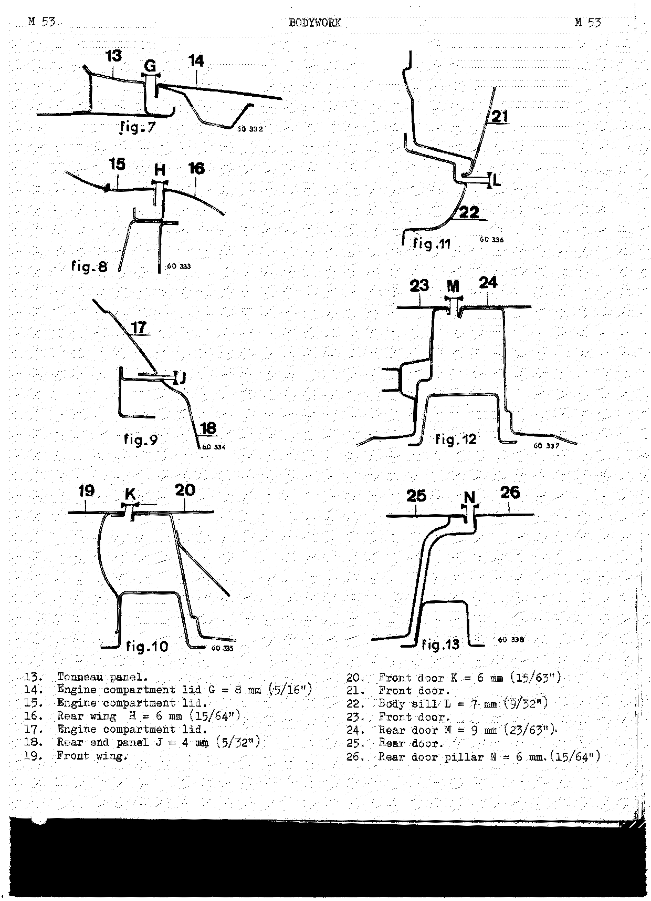

| Item | Component | Clearance |
| ---- | --------- | --------- |
| 14 | Engine compartment lid | G = 8 mm (5/16") |
| 16 | Rear wing | H = 6 mm (15/64") |
| 18 | Rear end panel | J = 4 mm (5/32") |
| 20 | Front door | K = 6 mm (15/63") <!-- NEEDS REVIEW: printed as "15/63""; 6 mm ≈ 15/64", so the denominator is almost certainly a printed/scan error for /64. Kept exactly as printed. --> |
| 22 | Body sill | L = 7 mm (9/32") |
| 24 | Rear door | M = 9 mm (23/63") <!-- NEEDS REVIEW: printed as "23/63""; 9 mm ≈ 23/64", so the denominator is almost certainly a printed/scan error for /64. Kept exactly as printed. --> |
| 26 | Rear door pillar | N = 6 mm (15/64") |

Items 13, 15, 17, 19, 21, 23, 25 are the mating panels (tonneau panel, engine compartment lid, engine
compartment lid, front wing, front door, front door, rear door respectively).

---

## Using weatherproofing compounds

<!-- PDF p.406 · M-54 -->

Whenever a bodywork component has been replaced one must weatherproof the joint or weld, especially in
the case of spot welded joints. Four different types of sealing compounds have been approved, which are
already on the market. These are obtainable from the C.S.S. (M.P.R.). When applied to clean,
grease-free panelling they present the following advantages: good adhesion and homogeneous
construction; easy, quick application and regular fillets when applied with a compressed air gun.

**I — CAOUSTAT 20** (green spot on cartridge). Reference Nos.: M.P.R. sales Ref. 13.162; R.N.U.R. works
Ref. "Mastic 306". This compound, supplied in cartridges, never dries and always remains capable of
flow. It is to be used for joints that cannot be seen and particularly on parts that are detachable
such as the wings (fenders), for weatherproofing the windscreen and the rear window at the joints
between the glass and the panelling, after fitting to the vehicle. Any excess may be removed with a rag
dipped in cleaners. CAOUSTAT 20 can stand stoving without losing any of its initial qualities.
*Application:* by means of the compressed air gun (reference 13.161) or the hand syringe (reference
12.372).

**II — MASTIC 2.300** (red spot on cartridge). Reference Nos.: M.P.R. sales Ref. 13.163; R.N.U.R. works
Ref. "Mastic 307". This compound is air drying, touch dry within around 15 mins and cured after 12
hours. When dry it feels like rubber and has a gloss finish. It will take a coat of paint. Used chiefly
after the front door window frames are fitted. The joint is made in one pass, without smoothing down.
If it needs cleaning, use solvent so as to avoid pulling off the bead, as it remains tacky until dry.
If necessary this compound can be used for panel joints (cowl sides and floor), but before stoving it
must have been allowed to cure fully (12 hours) in order to allow the solvent to evaporate (this
prevents gas bubbles under the paint). *Application:* by means of the compressed air gun (reference
13.161).

<!-- PDF p.407 · M-55 -->

**III — CAOURAL 297 compound.** Reference Nos.: M.P.R. sales Ref. 13.171; R.N.U.R. works Ref.
"Mastic 297". This compound is air drying and touch dry immediately after it is applied. It cures
within 3 to 4 hours. It can be used on all panel joints, whether visible or not, and on both stripped
and painted but properly cleaned panelling. The joints should be smoothed over with a brush dipped in
water or acetone. Before stoving, allow it to cure (3 to 4 hours) to allow the solvent to evaporate.
Likewise allow it to dry before carrying out a leak check. *Application:* the compound is supplied in
hermetically sealed tins together with empty cartridges for use in the compressed air gun (reference
13.161). The cartridges are filled with a sheet metal funnel. Check on the consistency of the
preparation before filling and if necessary add acetone.

**IV — TAPE COMPOUND (MASTIFLEX).**

- **a)** C.S.S. sales Ref. 8.555.557; R.N.U.R. works ref. "503". Compound which is triangular in shape
  20 x 10 mm (13/16" x 3/8"), length 650 mm (25 1/2"). Applied by hand. Used to seal wing motifs, to
  plug the corners of the toe-board, etc.
- **b)** C.S.S. sales Ref. 8568528; R.N.U.R. works Ref. "Mastic 275". Strip compound 4.7 mm (3/16")
  in diameter, supplied in cardboard boxes and applied by hand. Used to seal the headlights, door
  frames, deflectors, etc.
- **c)** C.S.S. ref. 6.078.257; R.N.U.R. works Ref. "Mastic RRI 502". Supplied in strips 15 x 3 x 560 mm
  (5/8" x 1/8" x 22 1/16"). Used for weatherproofing the window slides.

**Applying equipment.** The application of these various sealing compounds involves using a compressed
air gun which is supplied in a case together with its accessories under sales Ref. 13.328. Contents of
the case: compressed air gun; 5 m (16 feet) of hose with unions; short nozzle union; long nozzle union;
flat nozzle 8 x 2 mm (.315 x .079"); a long cranked steel nozzle, flat 8 x 2 mm (.315 x .079"); flat
nozzle 20 x 1.5 mm (.787 x .060"); circular steel nozzle 2.5 mm (.098") in diameter; circular steel
nozzle 1.5 mm (.059") in diameter; circular plastic nozzle 2.5 mm (.098") in diameter; cranked steel
nozzle for drip mouldings; 3 centre piston rings; 1 thrust piston ring; 1 front leather joint.

<!-- PDF p.408 · M-56 -->

**Using the gun.** Maximum operating pressure 2.5 to 3.5 kg/sq cm (35 to 50 p.s.i.). Always hold the
gun square with the joint to make it easier for the compound to flow into it. After use, the nozzle
should be cleaned or immersed in cellulose thinners between operations in order to prevent it becoming
blocked.

**Inserting the cartridges.** The cartridges have a crimped cap at the front and a plastic plug (4) at
the rear. Piston (2) is in contact with the compound and they are closed off by cap (3). To re-use the
cartridges, push out the piston with compressed air, or with an end fitting. Plug the bottom with a
plastic plug and refill. Switch off the compressed air, remove cap (3) and plug (4) and introduce the
cartridge into the gun in such a way that it rests freely in the gun body. Switch on the compressed air
without touching the trigger, in order to move the cartridge into its operating position. At the same
time the front cap will be perforated. The gun is then ready to use. When the cartridge is empty,
switch off the compressed air and pull the cartridge towards the rear. This operation is made easier by
pressing the trigger once or twice. Then remove the cartridge forwards.

**Soundproofing.** When fitting new components, one should apply soundproofing compound to them with a
knife, brush or gun. The thickness applied should be between **1 and 3 mm (1/32" to 1/8")**.

---

## The identification of the paints used during manufacture

<!-- PDF p.408 · M-56 -->

The paint reference is made up as follows:

1. **A letter** giving the type of paint:
   - C means cellulose
   - S means synthetic

   followed by the manufacturer reference number: Renault, Nitrolac, Valentine, Ripolin, Duco,
   Villemer, Dupont de Nemours, Soudée.

2. **A letter** giving the place at which the vehicle was assembled:
   - F means Flins
   - C means Creil
   - No letter means Billancourt

3. **Three figures**, which are the paint reference.

> Example: **S – F – 635** — this is a synthetic paint, made by Renault, applied at Flins, colour
> Pyramid Grey.

> **NOTE:** These references are in the boot (trunk) on the heater screen panel.

## Protective paint on sheet steel components supplied by the C.S.S.

<!-- PDF p.409 · M-57 -->

These parts are supplied in two different forms:

**A) Parts supplied by the C.S.S. covered with green protective varnish** should be stripped before
carrying out painting operations. This stripping operation is to be carried out:

1. With a rag dipped in one of the following solvents: petrol (gasoline); white spirit; methylated
   spirit; trichlorethylene; synthetic thinners; cellulose thinners (without aromatics); hot potassium.
2. By immersion in a bath of Magnet 2 fluid. This uninflammable fluid is to be kept in a tank with a
   cover and a drain tap. Its minimum dimensions should be 1.6 x 1.4 x 0.4 m (60 x 52 x 16") (made
   locally) to obtain a working depth of approximately 0.20 m (8") of fluid.

> **MAGNET 2** — MAGNUS product — C.S.S. reference 806.339, 240 kg drum (approximately 200 l
> (53 gallons US) / 44 gallons Imp); 806.340, 70 kg drum (approximately 70 l (16 gallons US) /
> 13 gallons Imp).

Then apply a coat of phosphate primer; apply coats of surfacer (cellulose or synthetic); rub down;
apply synthetic or cellulose gloss finisher. (If you use synthetic surfacer you must use a synthetic
finish coat, and likewise if you use a cellulose surfacer you must use a cellulose finish coat.)

**B) Parts painted with a coat of primer + synthetic surfacer** (brown in colour). Rub down the parts
as received (retouch any scratches with cellulose or synthetic surfacer). Apply the finish coat
directly: synthetic or cellulose gloss.

## Precautions to be taken when stoving paint

<!-- PDF p.409 · M-57 -->

Remove all plastic parts which may be damaged by the heat, such as: side lights, window slides, door
strikers, steering wheel cap, junction box cover.

## Zinc powder based protective paint

<!-- PDF p.410 · M-58 -->

Before fitting a detachable component or one which is to be welded in position, one must prevent
corrosion and protect the joint faces by applying a coat of zinc powder based protective paint to them.

Before using this, the surfaces must be prepared:

- **On new components:** clean them with petrol (gasoline) or trichlorethylene; if necessary remove all
  traces of rust with emery cloth.
- **On old components:** remove all traces of rust with a wire brush, then clean the area with petrol
  (gasoline) or trichlorethylene.

Apply the zinc paint with a brush and allow it to dry for **30 mins**.

> **WARNING:** These paints contain inflammable solvents. They may be ordered directly from the
> Cie ROYALE ASTURIENNE DES MINES — 42 Av. Gabriel — PARIS 8ème; or ZINC RICH WELDABLE PRIMER 373 –
> 1929 — Dupont de Nemours aux Ets. LAGARRIGUE — 14, rue Lincoln — PARIS 8ème.

## Crackle finish paint on the dashboard embellisher

<!-- PDF p.410 · M-58 -->

During manufacture the dashboard is painted with a special paint which is mixed with a reaction
solvent. The crackle finish on the paint is obtained when the component is stoved.

**Supply.** The VILLEMER Cie supplies the necessary products for repairing dashboard paintwork:

- Crackle finish grey 5603
- Reaction solvent 10.097
- Crackle finish grey 5664 for 1964 models

**Preparing the mix.** Mix the crackle finish paint and reaction solvent in the proportions of
**100 + 10 by weight**. Correct the viscosity with the synthetic thinners. Application viscosity 30
seconds measured with the AFNOR No. 4 cup at a temperature of 20°C (68°F). (Measuring instrument can be
obtained from Ets TOUZARD et MATIGNON, 3 rue Amyot, Paris 5e, under the reference "Viscosity cup AFNOR
130.014".)

**Retouching paintwork on dashboards as supplied by the C.S.S.** The special features of crackle finish
paint make it necessary to forbid partial retouching operations. It is therefore necessary to repaint
the entire component after stripping it back to the bare metal and applying a coat of phosphate primer.
Crackle finish paint can be applied directly to those dashboards supplied by the C.S.S. if painted with
a coat of primer + surfacer. Apply a crossed thick coat of paint. The paint is to be stoved, preferably
for half an hour in an oven at a temperature of **135°C (275°F)**, or for 25 minutes with infra-red
heaters. If you stove with heaters, place the part 20 cm (8") from the heating element and heat over
the entire length until obtaining the desired finish. (We advise you to carry out a test on a sample
sheet.)

---

## Bodywork weatherproofing

<!-- PDF p.411 · M-59 -->

After replacing the various bodywork components they must be weatherproofed by applying fillets of
CAOURAL 297 sealing compound with the compressed air gun.

**CAOURAL 297 — joints and nozzles:**

1. Joint between the cowl flange and the roof section. 2.5 mm (3/32") diameter nozzle.
2. Joint between the scuttle and the roof section. 2.5 mm (3/32") diameter nozzle.
3. Joint between the cowl side and the cowl drip moulding. 2.5 mm (3/32") diameter nozzle.
4. Joint between the cowl side and the cowl drip moulding. 20 x 1.5 mm (25/32" x 1/16") nozzle.
5. Joint (e) between drip moulding and the roof section; joint (f) between the drip moulding and the
   body side. 2.5 mm (3/32") diameter nozzle.
6. Joint between the floor panel and the side member. 8 x 2 mm (5/16" x 5/64") nozzle.
7. Joint between the floor panel and the seat back partition. 2.5 mm (3/32") diameter nozzle.

<!-- PDF p.412 · M-60 -->

8. Joint between the centre door pillar and the striker plate housing. 2.5 mm (3/32") diameter nozzle.
9. Joint between the seat back partition and the rear window surround, floor panel and the body side
   stiffener. 2.5 mm (3/32") diameter nozzle.

<!-- PDF p.413 · M-61 -->

**Joint between the tonneau panel and the roof section.** Extrude a fillet of 2300 compound along the
entire length of the joint with the plastic nozzle, after painting.

**After replacing a rear wheel arch.** Extrude fillets of CAOURAL 297 compound along the joints shown.
Smear sound deadening compound inside the engine compartment, the seat back partition, the front part
of the wheel arch, inside the wing and inside the wheel arch.

**After replacing a cowl side and scuttle.** Extrude fillets of CAOURAL 297 compound on the following
joints with the compressed air gun: floor to cowl side; toe-board to cowl side; floor to toe-board.
Also insert "Mastiflex" compound plugs at the points marked with a spot.

**Soundproofing.** Smear the inside of the wing and the cowl side, as well as the underside of the
floor — especially where it joins the side members — with sound deadening compound.

---

## Doors

### Replacing the front wing (fender)

<!-- PDF p.414 · M-62 -->

**Removing:**

1. Remove the two nuts which secure the wing (fender) to the front end panel at points (A) and (B).
2. Remove the four nuts which secure the wing to the cowl side at point (C) (removable champion type
   nuts).
3. Inside the car, under the dashboard, remove the nut (D) from the stud which secures the wing
   (fender) to the roof section.
4. Remove the three bolts (E) from the inside of the wing (fender) which secure the wing (fender)
   flange to the body side (removable champion type nuts).

<!-- PDF p.415 · M-63 -->

**Refitting:** Before fitting the wing (fender), apply fillets of Caoustat 20 compound to its entire
periphery at (1) and (2).

1. Position the wing (fender) and fit nut (D) on the roof section stud.
2. Fit the three bolts (E) which secure it to the body side.
3. Fit the four bolts (C) which secure it to the cowl side.
4. Fit the two bolts (A) and (B) which secure it to the front end panel.

After fitting the wing (fender), ensure that the joints between the roof section (3) and the upper part
of the front door pillar (4) are sealed by means of a fillet of CAOURAL 297 compound, applied with the
compressed air gun and the 2.5 mm (3/32") diameter nozzle. After fitting the motifs, the parking lights
and the mouldings, apply a plug of "Mastiflex" from inside the wing (fender) to each of the securing
points, especially at point (D).

### Replacing the rear wing

<!-- PDF p.416 · M-64 -->

**Removing:**

1. Remove the door striker plate, door stop, the air intake grill, the stiffener and the two door sill
   securing screws.
2. Remove the 5 bolts (A) which secure the wing (fender) to the cowl side.
3. Inside the wing, remove the three nuts (B) which secure it to the tonneau panel.
4. From inside the engine compartment, remove the three bolts (C) which secure it to the quarter lining
   (removable champion nuts).
5. Remove the nut (D) which secures it to the rear end panel.
6. Remove the nut (E) which secures the rear bumper bracket strips to the rear end panel.

**Refitting:** Before fitting the wing, apply fillets of CAOUSTAT 20 compound as shown in the diagram.

1. Apply a strip of sound deadening vinyl to the wing (fender) stiffener at point (F).
2. Position the wing (fender) and fit the three nuts (B) which secure it to the tonneau panel.
3. Fit the three bolts (C) which secure it to the quarter lining.
4. Fit the five bolts (A) which secure it to the body side.
5. Fit the two bolts (D) and (E) which secure it to the rear end panel.

After fitting the wing, extrude fillets of CAOURAL 297 compound using the 2.5 mm (3/32") diameter
nozzle fitted to the compressed air gun.

### Replacing a front door

<!-- PDF p.417 · M-65 -->

- Compress the door stop spring using tool Car. 40 (1).
- Remove and insert the hinge pins using tool Car. 07 A (2). To remove, first use the short part, then
  finish removing the pin with the long part of the tool.

**Stripping:**

1. Remove the window winder handle with a **2 mm (5/64")** diameter pin punch (1).
2. Remove the door trim panel using a screwdriver slipped between the trim panel and the door body.
3. Free the vinyl panel and remove the lower window stop.
4. Bring the wind-down window into its lower position and remove the three window winder mechanism
   securing screws at (7). Free the window winder from the slide and take out the parts through the
   aperture in the door body.
5. Remove the window slide, the two sheet metal screws at (8) and the one screw at (6).
6. Free the remote control link from its guide on the slide rail.
7. Remove the lock.
8. Remove the pivoting window frame which is secured to the door body by sheet metal screws.
9. Remove the window slides which are secured to the door body by tabs.

<!-- PDF p.418 · M-66 -->

**Refitting the trim.** Smear the inside of the door body with a coat of sound deadening compound. Carry
out the removing operations in reverse, paying attention to the following:

1. Apply CAOUSTAT 20 compound at joint (A) between the door body and the pivoting window frame, under
   the rubber, as shown in the sketch.
2. Grease the window winder and the lower window slide.
3. Stick vinyl and rubber to the door with Bostick or Cellonite adhesives. Do not omit to apply a piece
   of vinyl at point 5 near the pull handle.
4. Make two notches (3) in the rubber (2) at the bottom of the door body in line with the water drain
   holes.
5. Adjust the stiffness of the pivoting windows by turning the two lock nuts (B) after riveting the
   frame to the surround.

**Pivoting windows.** Crimp the window to its frame. Fitting the window and its seal to the frame will
be made easier by soaping the seal and using fitting jig Car. 42. Cut off the projecting part of the
rubber. Before crimping the glass in place, apply sealing compound to the glass at (A).

### Front door lock and remote control

<!-- PDF p.419 · M-67 -->

**Removing.** After removing the trim from the door, bring the window into its upper post position, free
the remote control link from the end of the door bolt, clip (3), then remove the lock (three screws on
the door) by tilting it and removing it through the door aperture.

- Remove the inside door handle. Remove the three securing screws and take out the "inside door handle
  and hook" assembly through the aperture in the door body.
- Remove the handle pin (6). Free the handle (a) and its spring using tool Car. 43.
- Remove the NEIMAN lock tumbler (7) by pushing out pin (5).

**Refitting.** Carry out the removing operations in reverse, as well as the following:

1. Grease the door bolt (4), which is made from strengthened nylon, with petroleum jelly (sales
   reference 78.655, grease composition 90% petroleum jelly of the Vaseline type, 10% refined kerosene,
   percentage by weight). Copiously grease the latch bolt (8).
2. (Before fitting the lock tumbler, immerse it in grease.)
3. Grease the inside door handle pin (a).
4. Grease the inside of the link guide rubber (2).

The door striker plates should be tightened up hard using a cranked tool with the appropriate end
fitting.

### Replacing a rear door

<!-- PDF p.420 · M-68 -->

- Compress the door stop spring by means of tool Car. 40.
- Remove and insert the hinge pins by means of tool Car. 07 A. To remove, use first the short end then
  finish the operation with the long end of the tool. (See [Replacing a front door](#replacing-a-front-door).)

**Stripping:**

1. Remove the frame screws (1). Take out the rack and free the window slide (two clips at (2)) to
   remove the sliding window.
2. Remove the fixed window assembly.

**Re-trimming the door:** Smear the inside of the door body with a coat of sound deadening compound.
Bond the fixed window rubber (3) to its entire periphery after fitting the window pillar (4) and the
wiper strip. Carry out the removing operations in reverse to refit and apply fillets of sealing
compound between the glass channel and the door body, before fitting the surround trim. Stick the vinyl
and rubber trim with Bostick or Cellonite adhesives. Make two notches in the rubber at the bottom of
the door in line with the water drain holes.

### Rear door lock

<!-- PDF p.420 · M-68 -->

**Removing.** After removing the trim from the door, disconnect the remote control link from the end of
the latch bolt, pin (4), then remove the lock (three screws on the door edge). The lower screw (7)
retains the inside latch (5) and the inside latch bolt (6).

- Remove the inside door handle.
- Remove the childproof locking system lever and take it out through the aperture in the door body.
- Remove the handle pin (8) to free the latch bolt from its spring.

<!-- PDF p.421 · M-69 -->

**Refitting.** Carry out removing operations in reverse and:

1. When refitting the lock lever (3), place the thick washer (1) against the door body, and the rubber
   washer (2) between this washer and the lever.
2. Apply a fillet of sealing compound between the door body and the inside door handle flange.
3. Grease the various lock components as described for the front door on page 61 (see
   [Front door lock and remote control](#front-door-lock-and-remote-control)).

**Childproof locking system on the rear doors.** This device is fitted to the rear doors and consists of
a latch lever (4) which pivots on the door body and permits one to free the inside door handle by
disconnecting the remote control link (5) by means of a slot in lever. In this way, when the handle is
operated, there is no danger because it is no longer operating the lock bolt.

> When carrying out any operation on the rear door latching mechanism, ensure that the spring stop
> plate (A) on the control link is correctly positioned towards the top. If it is not, remove it and
> reposition it.

<!-- PDF p.422 · M-70 -->

**New remote control No 8.242.449.** Whenever carrying out any operation on the rear door latch
mechanism, ensure that the spring stop plate (A) on the control link is in its correct position, facing
upwards. If it is not, remove it and re-position the link.

**Moving pad door striker.** The moving pad door striker consists of:

- a fixed nylon stop (3) which is a press-fit in the door by means of two studs;
- a moving, spring loaded pad, sliding on a casing (2) which is secured to the body side by means of
  two screws. The casing securing screws are covered by a nylon protector which is pressed into the
  casing.

To gain access to the securing screws, remove the protector (4) by means of a screwdriver placed in the
slots.

> Since the 4th of May 1959 the door striker rubber stops have a between-centres dimension of
> **15 mm (37/64")** in place of the former **18 mm (45/64")**. Consequently, for cars made previous to
> this modification, it will be necessary to elongate one of the holes on the rear wing (fender) to
> obtain a between-centres dimension of 18 mm (45/64").

**Door soundproofing and pads.** To ensure that the front and rear doors do not rattle, check: that the
outer periphery rubbers are in good condition; that the rubber pads are not worn.

> It is to be noted that under certain circumstances the strikers with moving pads are replaced by
> rubber stops.

### Replacing a front or rear door on a vehicle made before 1960

<!-- PDF p.423 · M-71 -->

To fit the new door one must order:

- **For a front right or left hand door:** spring 5.551.799; spring clamps 6.068.259; 6 mm countersunk
  screws, 10 mm (25/64") long, together with shakeproof washers and nuts.
- **For a rear right or left hand door:** spring 5.551.800; spring clamps 6.068.259; 6 mm countersunk
  screws, 10 mm (25/64") long, together with shakeproof washers and nuts.

Carry out the following operations on the body side:

**a)** Drill two holes **6.50 mm (1/4")** in diameter in the front or centre door pillar, depending on
which door is to be replaced, to the following layout:

- 28 mm (1 3/32")
- 27 mm (1 1/16")
- 25 mm (63/64")

**Fitting the spring securing screws.** Weld a 2 mm (5/64") wire rod, 10 mm long, to the heads of both
the 6 mm countersunk screws. <!-- NEEDS REVIEW: the rod length's fractional-inch value is cut off at the scan's left margin and could not be verified (OCR read it as "(4")"); the metric "10 mm" is clear. -->

**b)** Insert the upper screw into the door pillar through hole (T), by means of the wire, and guide it
into the upper hole which has already been drilled. When the screw is in position, fit the spring (1)
and secure it in place with the upper clamp (2). Fit the nut and tighten it.

**c)** Using a small screwdriver passed through the tie slot (B), lift the sheet steel cover welded
inside the door pillar (this part is made from thin material). Insert the second screw, once again
through the hole, and guide it into the lower screw hole and fit lower clamp (3) to the spring. Fit the
nut and tighten it.

**d)** Tear off the wires welded to the screw heads by twisting them a few times, and refit the plug.

### Replacing the body shell on a car previous to the 1960 model, re-using old type doors and ties

<!-- PDF p.424 · M-72 -->

One must fit a roller door stop to each of the door bodies in order to use these doors again. Order:

- Front door stop 8.243.349
- Rear door stop 8.243.350

The door stop is secured by means of 4 hexagon head bolts 5 mm in diameter and 12 mm (15/32") long,
together with shakeproof washers and nuts, or by 6 spot welds. The figure shows the right hand centre
door pillar of the new type with a torsion spring and a rear door of the old type (identified by the tie
clearance slot).

> It is to be noted that dimensions A and B are identified to make fitting easier. It is possible that
> under certain circumstances these figures will have to be slightly modified. In fact the final
> position of the door stop is to be adjusted to ensure that the roller runs correctly on the torsion
> spring.

| Ref | Dimension |
| --- | --------- |
| A | 43 mm (1 11/16") |
| B | 4 mm (5/32") for front doors; 12 mm (15/32") for rear doors |

**Replacing a body side or a centre door pillar on a car previous to the 1960 model, re-using original
type doors with ties.** The new body sides are fitted with the spring securing screws but not the
spring. Order:

- **To re-use a front right or left hand door:** 1 front door stop spring 5.551.799; 2 securing clamps
  6.068.259; 1 door stop 8.243.349; 2 6 mm countersunk screws, 10 mm (25/64") long, with shakeproof
  washers and nuts.
- **To re-use a rear right or left hand door:** 1 rear door stop spring 5.551.800; 2 securing clamps
  6.068.259; 1 rear door stop 8.243.350; 2 6 mm countersunk screws, 10 mm (25/64") long, with
  shakeproof washers and nuts.

---

## Boot (trunk) lid

<!-- PDF p.425 · M-73 -->

In order to obtain an even clearance round the entire periphery, the boot (trunk) lid adjustment is
facilitated by removing the headlights in order to gain access to the three securing bolts on the
hinges (2). The latch (3) is adjusted by moving the securing points.

**Fitting the headlights.** Before fitting the headlights apply CAOUSTAT 20 compound (as shown by the
drawing) inside the boot (trunk) lid.

**Rubber (boot lid seal):**

- **a)** Remove all traces of adhesive from the folded edge of the channel. Apply fresh adhesive to
  this edge and to the rubber. Fit the rubber. Do not close the lid for at least 1 hour.
- **b)** The staples which are used to secure the rubber in production are fitted with a tool that
  punches the panelling and inserts the staple simultaneously. This cannot be used under repair
  conditions. When replacing rubber, one must fit **10 detachable clips No. 8.554.944** which can be
  fitted by hand.

## Engine compartment lid arrangement

<!-- PDF p.426 · M-74 -->

The lid is adjusted by moving it on the hinge securing bolts.

## Spare wheel compartment door and door control arrangement

<!-- PDF p.426 · M-74 -->

(Arrangement drawing only.)

---

## Special bodywork features on vehicles with automatic transmission

<!-- PDF p.427 · M-75 -->

Vehicles with automatic transmission have modifications carried out on certain of the bodywork
components. These new components are available from C.S.S.

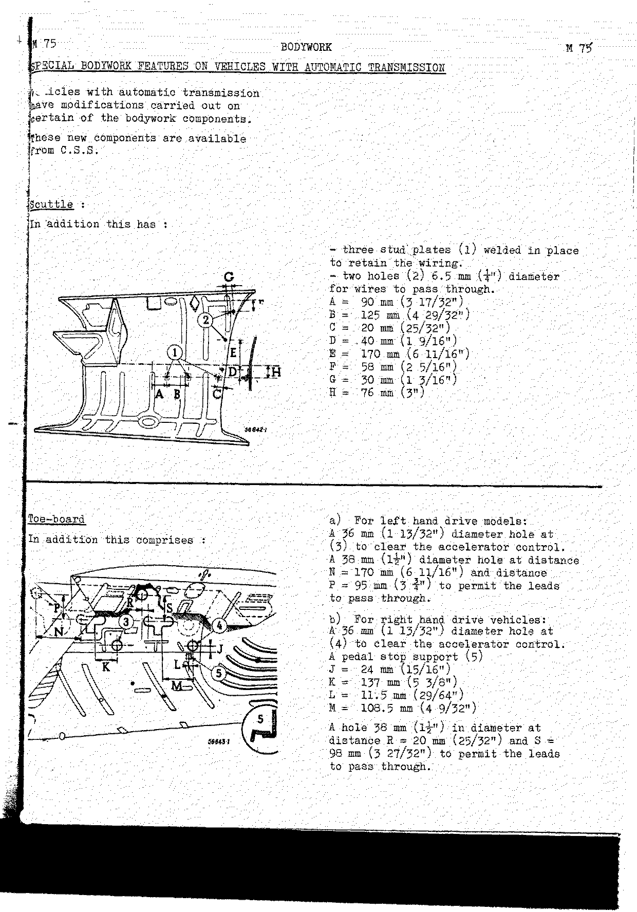

### Scuttle

In addition this has:

- three stud plates (1) welded in place to retain the wiring;
- two holes (2) **6.5 mm (1/4")** diameter for wires to pass through.

| Ref | Dimension | Ref | Dimension |
| --- | --------- | --- | --------- |
| A | 90 mm (3 17/32") | E | 170 mm (6 11/16") |
| B | 125 mm (4 29/32") | F | 58 mm (2 5/16") |
| C | 20 mm (25/32") | G | 30 mm (1 3/16") |
| D | 40 mm (1 9/16") | H | 76 mm (3") |

### Toe-board

In addition this comprises:

**a) For left hand drive models:** a **36 mm (1 13/32")** diameter hole at (3) to clear the accelerator
control; a **38 mm (1 1/2")** diameter hole at distance N = 170 mm (6 11/16") and distance P = 95 mm
(3 3/4") to permit the leads to pass through.

**b) For right hand drive vehicles:** a **36 mm (1 13/32")** diameter hole at (4) to clear the
accelerator control; a pedal stop support (5):

| Ref | Dimension |
| --- | --------- |
| J | 24 mm (15/16") |
| K | 137 mm (5 3/8") |
| L | 11.5 mm (29/64") |
| M | 108.5 mm (4 9/32") |

A hole **38 mm (1 1/2")** in diameter at distance R = 20 mm (25/32") and S = 98 mm (3 27/32") to permit
the leads to pass through.

### Under tray (left hand drive)

<!-- PDF p.428 · M-76 -->

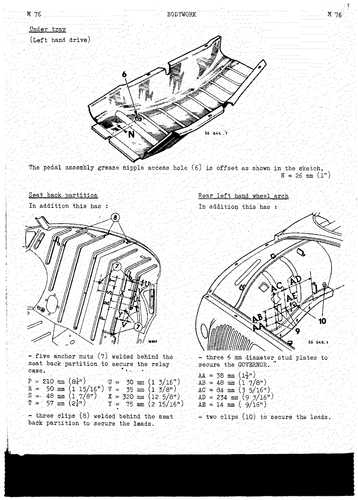

The pedal assembly grease nipple access hole (6) is offset as shown in the sketch, **N = 26 mm (1")**.

### Seat back partition

In addition this has five anchor nuts (7) welded behind the seat back partition to secure the relay
case, and three clips (8) welded behind the seat back partition to secure the leads.

| Ref | Dimension | Ref | Dimension |
| --- | --------- | --- | --------- |
| P | 210 mm (8 1/4") | U | 30 mm (1 3/16") |
| R | 50 mm (1 15/16") | V | 35 mm (1 3/8") |
| S | 48 mm (1 7/8") | X | 320 mm (12 5/8") |
| T | 57 mm (2 1/4") | Y | 75 mm (2 15/16") |

### Rear left hand wheel arch

In addition this has three 6 mm diameter stud plates to secure the GOVERNOR, and two clips (10) to
secure the leads.

| Ref | Dimension |
| --- | --------- |
| AA | 38 mm (1 1/2") |
| AB | 48 mm (1 7/8") |
| AC | 84 mm (3 5/16") |
| AD | 234 mm (9 3/16") |
| AE | 14 mm (9/16") |

---

## Bumpers

<!-- PDF p.429 · M-77 -->

There are two types of bumper fitted to R.1090 vehicles and their derived versions:

- **a)** The standard for Metropolitan France vehicles.
- **b)** Strengthened for U.S. models.

**Metropolitan France front bumper.** This consists of a centre strip (1), two outer strips (2) and (3),
two inner bracket strips (4) and (5), and two outer bracket strips (6) and (7). (The lower bar (8) is
only fitted to type R.1090 A vehicles.)

<!-- PDF p.430 · M-78 -->

**U.S. Model front bumper.** This consists of a centre strip (1), two outer strips (2) and (3), two
inner bracket strips (4) and (5), four outer bracket strips (6) and (7), an upper stiffening bar (9) and
a lower stiffening bar (8).

**Removing:** Remove the bumper assembly except for the outer bracket strips (6) and (7), which are to
be removed afterwards.

**Refitting:**

1. Fit the outer bracket strips (6) and (7) and their front end panel grommets.
2. Fit the assembly (with the nuts untightened), comprising the centre strip (1), the upper stiffening
   bar (9), the centre bracket strips (4) and (5) and their grommets.
3. Fit the two outer strips (2) and (3).
4. Fit the lower stiffening bar (8).
5. Centralise the bumper and tighten the outer strip (2) and (3) securing nuts on the centre strip (1).

> To make removing and refitting the outer bracket strips easier, use special spanners (wrenches)
> Car. 16 for the left hand side and Car. 30 for the right hand side.

<!-- PDF p.431 · M-79 · Metropolitan France rear bumper (figure) -->

<!-- PDF p.432 · M-80 -->

**U.S. Model rear bumper.** This consists of a centre strip (1), two outer strips (2) and (3), two inner
bracket strips (4) and (5), four outer bracket strips (6) and (7), an upper stiffening bar (8), two
overriders (9) and two lower ties (10).

**Removing:** Remove the bumper assembly with the exception of the outer bracket strips (6) and (7),
which are to be removed later.

**Refitting:** Carry out the removing operations in reverse. Centralise the bumper and tighten the
stiffening bar nuts (8) and the tie nuts (10) on the cross bar using cranked spanner (wrench) Car. 16.

---

## Replacing the windscreen and rear window

<!-- PDF p.433 · M-81 -->

**A. Principle of manufacture.** The windscreens of these vehicles are made from **"LUXRIT B"** glass
which has been officially approved by the road traffic authorities under the reference **AG-TP-GS 27**.
"LUXRIT B" is toughened safety glass, the special feature of which can be seen during a breakage test.
At this juncture it leaves a strip of finely quenched glass granules (of the 'SECURIT' type) around its
outer periphery, and a zone of larger granules at its centre.

**B. Example of breakage pattern.** This zone of larger granules leaves enough visibility to allow one
to drive the vehicle.

> **NOTE:** The large granule area has been deliberately limited by the manufacturer to ensure that the
> windscreen fulfills the necessary safety requirements.

**Preparing before fitting.** Fit the rubber seal to the windscreen and then place it on a covered
table. Introduce a length of string (2) **3 to 4 mm (1/8" to 5/32")** in diameter into the slit in the
rubber beading over its entire periphery. Take care to cross the string over a length of **10 cm
(4 5/16" approximately)** at its bottom edge towards one corner, leaving approximately **20 cm (8 1/2")**
hanging.

<!-- PDF p.434 · M-82 -->

**Fitting.** Position the glass fitted with its rubber beading, from outside, with the 2 ends of the
string hanging inside the vehicle. Locate the glass with respect to the frame aperture, hold it in
position and press at the point where the strings cross. From inside the car, pull alternately on each
end of the string, starting at the bottom of the glass. This lifts the lip of the seal, which comes down
over the aperture panelling. An assistant on the outside assists the operation of fitting the rubber
seal by pressing on the glass. Terminate the operation of removing the string at the top of the glass.
When the string has been removed, ensure that the seal adheres and assist it to do so by giving it a
number of taps with a rubber mallet.

**Weatherproofing.** To weatherproof, extrude CAOUSTAT 20 compound into the joint between the rubber and
the aperture panelling, and the rubber and the glass, using hand syringe (sales ref. 12.372).

### Windscreen or rear window embellisher strip

<!-- PDF p.435 · M-83 -->

The windscreen and rear window embellisher strip is made of sections connected by clips.

**Removing.** Slide off the clips and remove each section, taking care not to distort it.

**Refitting.** After the glass has been fitted to the vehicle, fit each embellisher section using a
string (1), 3 to 4 mm (1/8" to 5/32") in diameter, sliding in a copper tube (2) from 5 to 6 mm (3/16"
to 9/32") in diameter, 120 mm (4 3/4") long.

1. Engage the string in the slit (3) of the rubber into which the embellisher fits.
2. Fit the embellisher, positioning it correctly with respect to the glass.
3. Pull the string towards the centre of the glass, pressing firmly on the embellisher (4). As the
   string is freed it opens the two lips of the slit, thus allowing the embellisher to enter the rubber.
4. When the two embellisher sections are in position, slide the clips over the joints to secure them.

---

## Applying strips to the R.1093 bodywork

<!-- PDF p.436 · M-84 -->

Two blue plastic adhesive strips are applied parallel with the body longitudinal centreline (width of
strips **25 mm (1")**, distance between the strips **72 mm (2 27/32")**). These strips are applied in
three operations:

1. The boot (trunk) lid — cut the strips so that they end at the lid front swaging.
2. The roof.
3. The engine compartment lid.

Cut the strips 1 cm (25/64") longer than the part to be covered so that they can be folded down over
the edges of the lid. These strips are applied in the same way as ordinary adhesive tape.

**Total length of strip required: 7.10 m (280").**

> If these strips are not applied when the vehicle is delivered, you will find them packed in the boot
> (trunk).
